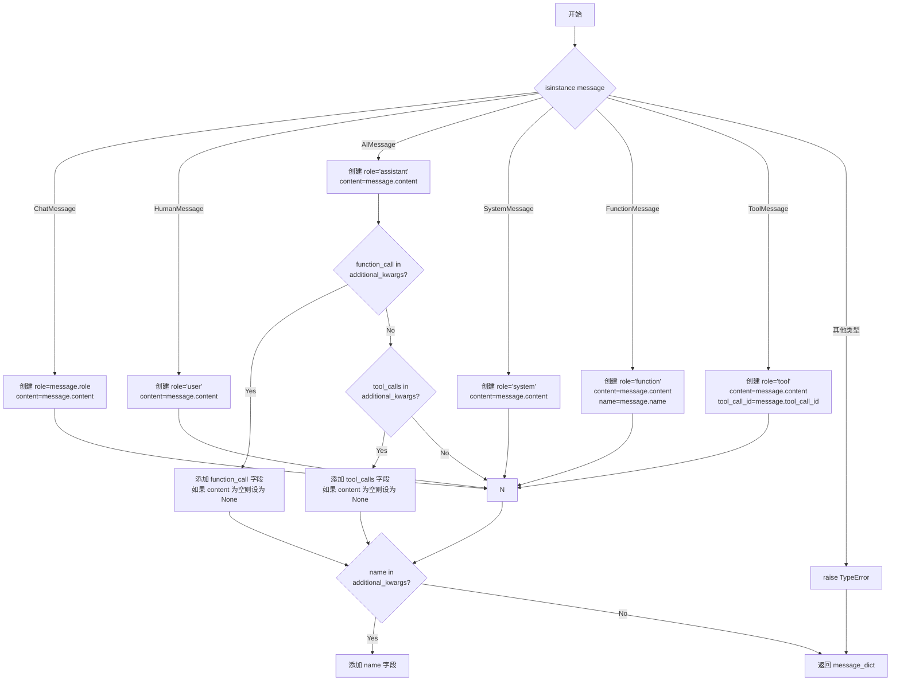
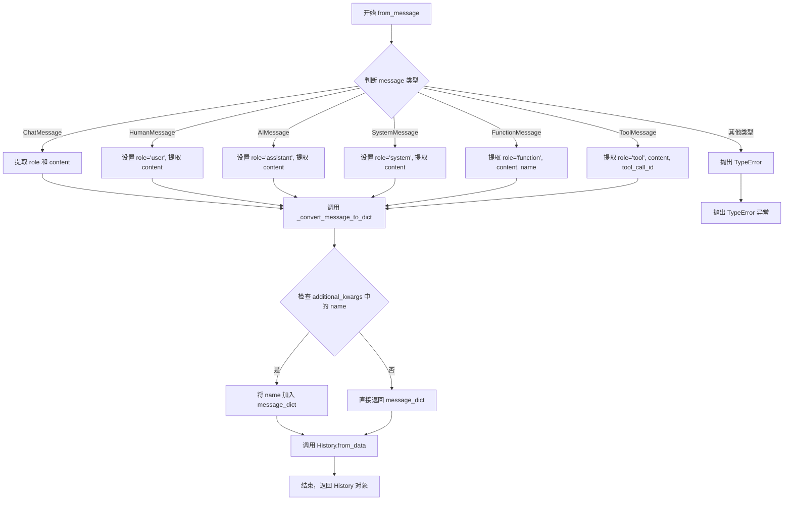

# `Langchain-Chatchat\libs\chatchat-server\langchain_chatchat\utils\history.py` 详细设计文档

该代码是一个LangChain消息历史管理模块，提供History类用于对话历史的建模和转换，支持将LangChain的BaseMessage与自定义History之间进行双向转换，并支持将历史消息转换为jinja2模板格式。

## 整体流程

```mermaid
graph TD
    A[开始] --> B{输入类型是什么?}
    B -- BaseMessage --> C[调用 _convert_message_to_dict]
    B -- List/Tuple/Dict --> D[调用 History.from_data]
    C --> E[根据消息类型转换为dict]
    D --> F[创建History实例]
    E --> G[返回History对象]
    F --> G
    G --> H{需要输出什么格式?}
    H -- to_msg_tuple --> I[返回 (role, content) 元组]
    H -- to_msg_template --> J[返回 ChatMessagePromptTemplate]
    H -- 内部转换 --> K[返回 History 对象]
```

## 类结构

```
Pydantic BaseModel
└── History (对话历史模型)
    ├── 字段: role, content
    └── 方法: to_msg_tuple, to_msg_template, from_data, from_message
```

## 全局变量及字段


### `logger`
    
模块级日志记录器，用于记录程序运行过程中的日志信息

类型：`logging.Logger`
    


### `History.role`
    
用户角色标识，用于标识消息发送者的角色（如 user、assistant、system 等）

类型：`str`
    


### `History.content`
    
对话内容，存储消息的实际文本内容

类型：`str`
    
    

## 全局函数及方法


### `_convert_message_to_dict(message: BaseMessage)`

将 LangChain 的各种消息类型（HumanMessage、AIMessage、SystemMessage、FunctionMessage、ToolMessage、ChatMessage）转换为标准的字典格式，适配 OpenAI API 的消息结构。

参数：

- `message`：`BaseMessage`，LangChain 消息对象，支持 HumanMessage、AIMessage、SystemMessage、FunctionMessage、ToolMessage、ChatMessage 等类型

返回值：`dict`，包含 `role` 和 `content` 的字典，根据消息类型可能包含 `function_call`、`tool_calls`、`name` 或 `tool_call_id` 等字段

#### 流程图



#### 带注释源码

```python
def _convert_message_to_dict(message: BaseMessage) -> dict:
    """Convert a LangChain message to a dictionary.

    Args:
        message: The LangChain message.

    Returns:
        The dictionary.
    """
    message_dict: Dict[str, Any]
    
    # 判断消息类型并构建对应的字典结构
    if isinstance(message, ChatMessage):
        # ChatMessage: 自定义角色消息
        message_dict = {"role": message.role, "content": message.content}
    elif isinstance(message, HumanMessage):
        # HumanMessage: 用户消息，role 映射为 "user"
        message_dict = {"role": "user", "content": message.content}
    elif isinstance(message, AIMessage):
        # AIMessage: AI 助手消息
        message_dict = {"role": "assistant", "content": message.content}
        
        # 处理 function_call (函数调用)
        if "function_call" in message.additional_kwargs:
            message_dict["function_call"] = message.additional_kwargs["function_call"]
            # 如果仅有 function_call 而无内容，content 应为 None 而非空字符串
            if message_dict["content"] == "":
                message_dict["content"] = None
        
        # 处理 tool_calls (工具调用)
        if "tool_calls" in message.additional_kwargs:
            message_dict["tool_calls"] = message.additional_kwargs["tool_calls"]
            # 如果仅有 tool_calls 而无内容，content 应为 None 而非空字符串
            if message_dict["content"] == "":
                message_dict["content"] = None
    elif isinstance(message, SystemMessage):
        # SystemMessage: 系统消息
        message_dict = {"role": "system", "content": message.content}
    elif isinstance(message, FunctionMessage):
        # FunctionMessage: 函数响应消息
        message_dict = {
            "role": "function",
            "content": message.content,
            "name": message.name,
        }
    elif isinstance(message, ToolMessage):
        # ToolMessage: 工具消息
        message_dict = {
            "role": "tool",
            "content": message.content,
            "tool_call_id": message.tool_call_id,
        }
    else:
        # 未知消息类型，抛出类型错误
        raise TypeError(f"Got unknown type {message}")
    
    # 处理额外的 name 字段 (如 system message 的 name)
    if "name" in message.additional_kwargs:
        message_dict["name"] = message.additional_kwargs["name"]
    
    return message_dict
```


### `History.to_msg_tuple()`

将 History 对象转换为消息元组格式，用于适配 LangChain 消息系统。该方法将角色字段规范化为 "ai" 或 "human"，并与内容组合为元组返回。

参数：
- 无（仅包含 `self` 隐式参数）

返回值：`Tuple[str, str]`，返回包含角色和内容的元组。角色根据原始角色字段转换："assistant" 转换为 "ai"，其他情况（包括 "user"）转换为 "human"。

#### 流程图

```mermaid
flowchart TD
    A[开始 to_msg_tuple] --> B{self.role == 'assistant'?}
    B -- 是 --> C[返回元组 ('ai', self.content)]
    B -- 否 --> D[返回元组 ('human', self.content)]
    C --> E[结束]
    D --> E
```

#### 带注释源码

```python
def to_msg_tuple(self):
    """
    将 History 对象转换为消息元组格式
    
    该方法将对话角色规范化为 AI 或人类角色，并与消息内容组合为元组。
    主要用于将内部 History 表示转换为 LangChain 或其他框架兼容的格式。
    
    Args:
        self: History 类的实例，包含 role 和 content 两个字段
        
    Returns:
        Tuple[str, str]: 
            - 第一个元素为角色字符串，'assistant' 角色返回 'ai'，其他角色（如 'user'）返回 'human'
            - 第二个元素为消息内容字符串
    """
    # 判断当前角色是否为助手角色，如果是则返回 'ai'，否则返回 'human'
    # 这种规范化处理使得不同来源的角色命名（如 'assistant'、'user'）能够统一
    return "ai" if self.role == "assistant" else "human", self.content
```


### `History.to_msg_template`

将当前 History 对象转换为 LangChain 的 ChatMessagePromptTemplate 聊天消息模板，支持 Jinja2 模板渲染。方法根据传入的 `is_raw` 参数决定是否对内容进行 Raw 处理，以适配 Jinja2 模板语法。

参数：

- `is_raw`：`bool`，布尔值标志。当设为 `True` 时，内容会被 Jinja2 的 `` 和 `` 标签包裹，用于输出原始文本而不进行模板变量替换；设为 `False` 时，内容保持原样，可包含模板变量。默认值为 `True`。

返回值：`ChatMessagePromptTemplate`，LangChain 的聊天消息模板对象，包含了渲染角色（role）和内容（content），可直接用于大语言模型的聊天提示。

#### 流程图

```mermaid
flowchart TD
    A[开始 to_msg_template] --> B{is_raw 参数检查}
    B -->|is_raw=True| C[在内容前后添加  和 ]
    B -->|is_raw=False| D[保持内容不变]
    C --> E[获取映射后的角色]
    D --> E
    E --> F[调用 ChatMessagePromptTemplate.from_template]
    F --> G[返回 ChatMessagePromptTemplate 对象]
    
    B1[role_maps 映射表] -.-> E
    C1["示例: 'ai' -> 'assistant', 'human' -> 'user'"] -.-> B1
```

#### 带注释源码

```python
def to_msg_template(self, is_raw=True) -> ChatMessagePromptTemplate:
    """
    将 History 对象转换为 ChatMessagePromptTemplate。
    
    Args:
        is_raw: 是否对内容进行 Raw 处理。
                True (默认): 包裹 ...，输出原始内容不解析 Jinja2 变量。
                False: 直接使用内容，允许 Jinja2 变量替换。
    
    Returns:
        ChatMessagePromptTemplate: LangChain 的聊天消息模板对象。
    """
    # 定义角色映射：将内部角色名称映射为 API 兼容的角色名称
    # 'ai' -> 'assistant' (OpenAI API 标准)
    # 'human' -> 'user' (OpenAI API 标准)
    role_maps = {
        "ai": "assistant",
        "human": "user",
    }
    # 从映射表中获取转换后的角色，若无映射则保留原角色
    role = role_maps.get(self.role, self.role)
    
    # 根据 is_raw 标志决定内容处理方式
    if is_raw:  # 当前默认历史消息都是没有 input_variable 的文本。
        # 使用 Jinja2 raw 标签包裹内容，防止模板引擎解析其中的变量
        content = "" + self.content + ""
    else:
        # 保持原始内容，可包含 Jinja2 变量占位符
        content = self.content

    # 使用 LangChain 的 ChatMessagePromptTemplate.from_template 创建模板
    # 参数:
    #   content: 消息内容模板
    #   "jinja2": 指定模板引擎类型
    #   role: 消息发送者角色
    return ChatMessagePromptTemplate.from_template(
        content,
        "jinja2",
        role=role,
    )
```


### `History.from_data`

从多种数据格式（列表、元组或字典）构造 History 对象的类方法，支持灵活的输入格式转换。

参数：

- `h`：`Union[List, Tuple, Dict]`，输入数据，可以是包含 role 和 content 的列表/元组（如 `["human", "你好"]`），也可以是字典（如 `{"role": "human", "content": "你好"}`）

返回值：`"History"`，返回构造的 History 对象实例

#### 流程图

```mermaid
flowchart TD
    A[开始 from_data] --> B{判断输入类型 h}
    
    B --> C{isinstance of list/tuple<br/>and len >= 2?}
    C -->|是| D[提取 h[0] 作为 role<br/>提取 h[1] 作为 content]
    D --> E[cls(role=role, content=content)]
    
    C -->|否| F{isinstance of dict?}
    F -->|是| G[使用字典解包 cls(**h)]
    G --> E
    
    F -->|否| H[保持 h 原值]
    H --> I[返回 h]
    
    E --> I
    
    I[返回 History 对象] --> J[结束]
    
    style C fill:#e1f5fe
    style F fill:#e1f5fe
    style E fill:#c8e6c9
    style G fill:#c8e6c9
```

#### 带注释源码

```python
@classmethod
def from_data(cls, h: Union[List, Tuple, Dict]) -> "History":
    """从多种数据格式构造 History 对象
    
    Args:
        h: 输入数据，支持三种格式:
           - list/tuple: 需要至少2个元素，[role, content]，如 ["human", "你好"]
           - dict: 字典格式，{"role": "xxx", "content": "xxx"}
           - 其他: 直接返回原值（但可能不是有效的 History）
    
    Returns:
        History: 构造的 History 对象实例
    """
    # 如果输入是列表或元组，且长度大于等于2
    if isinstance(h, (list, tuple)) and len(h) >= 2:
        # 提取第一个元素作为 role，第二个元素作为 content
        h = cls(role=h[0], content=h[1])
    # 如果输入是字典，使用字典解包构造对象
    elif isinstance(h, dict):
        h = cls(**h)
    
    # 返回构造的 History 对象
    return h
```


### `History.from_message`

将 LangChain 的 `BaseMessage` 转换为 `History` 对象，用于在聊天模型和提示模板之间传递对话历史。

参数：

- `message`：`BaseMessage`，LangChain 消息对象，可以是 `HumanMessage`、`AIMessage`、`SystemMessage`、`FunctionMessage`、`ToolMessage` 或 `ChatMessage` 等类型

返回值：`History`，从消息内容构建的对话历史对象，包含 `role` 和 `content` 字段

#### 流程图



#### 带注释源码

```python
@classmethod
def from_message(cls, message: BaseMessage) -> "History":
    """从 LangChain 消息构造 History 对象。
    
    该方法接收 LangChain 的 BaseMessage 类型的消息，
    将其转换为字典格式，然后使用 from_data 方法构建 History 对象。
    
    Args:
        message: LangChain 消息对象，支持多种消息类型：
                 - HumanMessage: 人类消息，role 为 'user'
                 - AIMessage: AI 消息，role 为 'assistant'
                 - SystemMessage: 系统消息，role 为 'system'
                 - FunctionMessage: 函数调用消息，role 为 'function'
                 - ToolMessage: 工具调用消息，role 为 'tool'
                 - ChatMessage: 自定义角色消息
    
    Returns:
        History: 包含 role 和 content 字段的对话历史对象
    
    Example:
        >>> from langchain_core.messages import HumanMessage
        >>> msg = HumanMessage(content="你好")
        >>> history = History.from_message(msg)
        >>> history.role
        'user'
        >>> history.content
        '你好'
    """
    # 调用 _convert_message_to_dict 将 BaseMessage 转换为字典
    # 该函数会处理不同类型的消息并提取 role、content 等信息
    # 然后调用 from_data 类方法从字典构造 History 对象
    return cls.from_data(_convert_message_to_dict(message=message))
```

## 关键组件


### 消息类型转换器（_convert_message_to_dict）

负责将LangChain的各种消息类型（ChatMessage, HumanMessage, AIMessage, SystemMessage, FunctionMessage, ToolMessage）统一转换为字典格式，同时处理function_call和tool_calls等额外参数的传递

### History对话历史类

核心数据结构，用于表示单条对话历史记录。包含role和content两个字段，提供多种构造方式（from_data、from_message）和格式转换方法（to_msg_tuple、to_msg_template），支持与LangChain消息系统的双向转换

### 多格式数据解析（History.from_data）

支持从list、tuple、Dict三种格式解析创建History对象，提供了灵活的历史记录构造接口

### 消息模板生成（History.to_msg_template）

将历史记录转换为LangChain的ChatMessagePromptTemplate，支持Jinja2模板渲染，可处理原始内容（raw）和变量插值两种模式

### 角色映射逻辑

在消息模板生成时，将内部角色标识（ai/human）映射为API兼容的角色名（assistant/user），确保与不同LLM提供商的角色定义一致


## 问题及建议


### 已知问题

-   **未使用的导入**：代码中导入了 `lru_cache`（from functools）、`BaseModel`（from openai）、以及 `typing` 中的 `Tuple`、`Union`、`List`、`Dict`、`Any` 等，但均未使用，增加了代码负担。
-   **类型注解不够精确**：`from_data` 方法的参数类型 `Union[List, Tuple, Dict]` 不够精确，应区分 `List[Any]`、`Tuple[Any, ...]` 和 `Dict[str, Any]`；返回值类型使用了字符串形式 `"History"`，可改用 `ForwardRef` 或 `from __future__ import annotations`。
-   **魔法字符串和硬编码**：`to_msg_template` 方法中的 role 映射 `{"ai": "assistant", "human": "user"}` 以及 Jinja2 模板标记 `""` 和 `""` 为硬编码，建议提取为常量。
-   **缺少输入验证**：`from_data` 方法未对输入数据的有效性进行验证，当输入既不是 List/Tuple 也不是 Dict 时，方法不会抛出明确错误，可能导致隐式 bug。
-   **重复代码逻辑**：`_convert_message_to_dict` 函数中处理 `content == ""` 置为 `None` 的逻辑在 `AIMessage` 的 `function_call` 和 `tool_calls` 分支中重复出现。
-   **日志记录器未使用**：导入了 `logger = logging.getLogger()` 但未在任何地方使用日志功能。
-   **方法命名不一致**：`to_msg_tuple` 方法注释中写的是 `to_msy_tuple`（疑似笔误），且与 `to_msg_template` 命名风格不完全一致。
-   **错误处理不完善**：当 `_convert_message_to_dict` 遇到未知消息类型时抛出 `TypeError`，但 `History` 类的 `from_message` 方法未对该异常进行捕获或处理。

### 优化建议

-   **清理未使用的导入**：移除 `lru_cache`、`BaseModel` 以及未使用的 `typing` 类型，仅保留实际使用的类型。
-   **改进类型注解**：使用更精确的类型定义，如 `Union[List[Any], Tuple[Any, ...], Dict[str, Any]]`；考虑在文件顶部添加 `from __future__ import annotations` 以支持延迟注解求值。
-   **提取常量**：将 role 映射和 Jinja2 模板标记定义为模块级常量，例如 `ROLE_MAPPING = {"ai": "assistant", "human": "user"}` 和 `RAW_TEMPLATE_PREFIX = ""`。
-   **增强输入验证**：在 `from_data` 方法中添加类型和长度验证，例如检查 tuple/list 是否至少有 2 个元素，dict 是否包含必需的 key。
-   **消除重复代码**：将 `content == ""` 时置为 `None` 的逻辑提取为单独的工具函数或使用装饰器。
-   **修复注释笔误**：将 `to_msy_tuple` 修正为 `to_msg_tuple` 以保持一致性。
-   **添加日志记录**：在关键路径（如异常分支、转换逻辑）添加适当的日志记录，便于调试和监控。
-   **完善错误处理**：在 `from_message` 方法中捕获可能的异常，或在文档中明确说明可能抛出的异常类型。

## 其它


### 设计目标与约束

本模块的设计目标是提供LangChain消息与字典格式之间的相互转换功能，并封装对话历史的数据结构。设计约束包括：1) 仅支持LangChain定义的标准消息类型；2) History类需要兼容dict、list、tuple和BaseMessage多种输入格式；3) 消息转换需保持原始消息的role、content、name、function_call、tool_calls等完整信息。

### 错误处理与异常设计

代码中的异常处理主要包括：1) `_convert_message_to_dict`函数在遇到未知消息类型时抛出`TypeError`异常，提示"Got unknown type {message}"；2) `History.from_data`方法在输入格式不符合预期时（list/tuple长度小于2）会导致后续处理异常。当前错误处理粒度较粗，建议增加更详细的输入验证和自定义异常类。

### 外部依赖与接口契约

本模块依赖以下外部包：1) `langchain-core.messages` - 提供BaseMessage及其子类（AIMessage、HumanMessage、SystemMessage等）；2) `langchain.prompts.chat` - 提供ChatMessagePromptTemplate类；3) `openai.BaseModel` - 作为History类的基类；4) `typing`和`functools` - Python标准库。接口契约要求：输入消息必须是LangChain定义的消息类型，输出统一为dict格式。

### 性能考虑

1) `_convert_message_to_dict`函数使用简单的isinstance类型检查，性能开销较小；2) `lru_cache`装饰器被导入但未在代码中使用，可考虑对频繁转换的相同消息进行缓存；3) History类继承自pydantic的BaseModel，会带来一定的验证开销，如需高性能场景可考虑使用dataclass。

### 安全性考虑

1) 代码中未对输入进行敏感信息过滤；2) `to_msg_template`方法使用Jinja2模板渲染，需要注意content内容是否可信；3) 建议在生产环境中对用户输入的message.content进行适当的清理和验证。

### 使用示例

```python
# 从dict创建History
h = History(role="user", content="你好")
# 从dict创建
h = History(**{"role":"user","content":"你好"})
# 从tuple/list创建
h = History.from_data(("user", "你好"))
# 从BaseMessage创建
msg = HumanMessage(content="Hello")
h = History.from_message(msg)
# 转换为消息模板
template = h.to_msg_template()
```

### 版本历史与变更记录

当前版本为初始版本，主要功能包括：1) 实现`_convert_message_to_dict`函数用于消息类型转换；2) 实现History类支持多种构造方式和消息转换；3) 支持将History转换为ChatMessagePromptTemplate用于LangChain提示词模板。


    