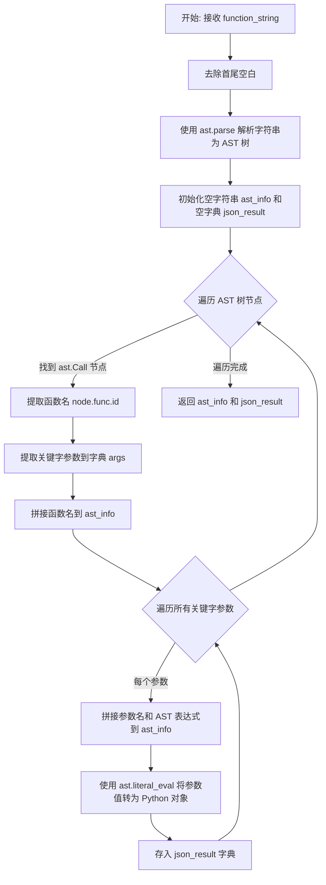

# `Langchain-Chatchat\libs\chatchat-server\langchain_chatchat\utils\try_parse_json_object.py` 详细设计文档

这是一个OpenAI API的工具函数模块，主要提供JSON解析和修复功能。代码包含两个核心函数：一个使用Python AST（抽象语法树）将函数调用字符串解析为JSON对象，另一个用于清理、修复和格式化可能格式错误的JSON字符串，支持多种边缘情况的处理。

## 整体流程

```mermaid
graph TD
    A[开始] --> B{能直接解析JSON?}
    B -- 是 --> C[返回原始输入和解析结果]
    B -- 否 --> D[使用正则提取{}内容]
    D --> E[清理JSON字符串]
    E --> F{能解析清理后的JSON?}
    F -- 是 --> G[返回清理后输入和解析结果]
    F -- 否 --> H[使用json_repair修复]
    H --> I{修复后更短?]
    I -- 是 --> J[使用AST解析]
    I -- 否 --> K[解析修复后的JSON]
    J --> L{AST解析成功?}
    L -- 是 --> M[返回AST信息和结果]
    L -- 否 --> N[返回错误日志和空字典]
    K --> O{解析成功且为dict?}
    O -- 是 --> P[返回修复后信息和结果]
    O -- 否 --> Q[记录异常并返回空字典]
    N --> R[结束]
    Q --> R
    P --> R
    M --> R
    G --> R
    C --> R
```

## 类结构

```
模块: utils.py (无类定义)
```

## 全局变量及字段


### `log`
    
用于记录日志的模块级变量

类型：`logging.Logger`
    


### `function_string`
    
输入的函数字符串参数

类型：`str`
    


### `tree`
    
AST语法树根节点

类型：`ast.Module`
    


### `ast_info`
    
AST解析信息字符串

类型：`str`
    


### `json_result`
    
AST解析的JSON结果

类型：`dict`
    


### `node`
    
AST遍历过程中的节点

类型：`ast.AST`
    


### `function_name`
    
函数名称

类型：`str`
    


### `args`
    
函数参数字典

类型：`dict`
    


### `arg`
    
参数名

类型：`str`
    


### `value`
    
参数值节点

类型：`ast.AST`
    


### `input`
    
输入字符串变量

类型：`str`
    


### `result`
    
JSON解析结果容器

类型：`dict/None`
    


### `_pattern`
    
正则表达式模式，用于提取JSON对象

类型：`str`
    


### `_match`
    
正则匹配结果对象

类型：`re.Match`
    


### `json_info`
    
JSON信息字符串

类型：`str`
    


    

## 全局函数及方法


### `try_parse_ast_to_json`

使用 Python AST 将函数调用字符串解析为 JSON 对象，返回解析详情和结果字典。该函数通过抽象语法树（AST）解析函数调用字符串，提取函数名和参数信息，并将参数值转换为 Python 对象。

参数：

- `function_string`：`str`，函数调用字符串，包含函数名和参数，例如 `"tool_call(first_int={'title': 'First Int', 'type': 'integer'}, second_int={'title': 'Second Int', 'type': 'integer'})"`

返回值：`tuple[str, dict]`，元组包含两个元素：
- 第一个元素为 `str` 类型，表示解析详情字符串，包含函数名和所有参数的名称与 AST 表达式
- 第二个元素为 `dict` 类型，表示解析后的参数键值对字典

#### 流程图



#### 带注释源码

```python
def try_parse_ast_to_json(function_string: str) -> tuple[str, dict]:
    """
    使用 Python AST 将函数调用字符串解析为 JSON 对象
    
    示例：
    function_string = "tool_call(first_int={'title': 'First Int', 'type': 'integer'}, second_int={'title': 'Second Int', 'type': 'integer'})"
    
    返回值包含解析详情字符串和参数字典
    """
    # 将输入字符串去除首尾空白后解析为 AST 抽象语法树
    tree = ast.parse(str(function_string).strip())
    
    # 初始化解析详情字符串和结果字典
    ast_info = ""
    json_result = {}
    
    # 遍历 AST 树中的所有节点，查找函数调用节点
    for node in ast.walk(tree):
        if isinstance(node, ast.Call):
            # 提取函数名（假设是简单的函数调用，不包含属性访问）
            function_name = node.func.id
            
            # 将关键字参数转换为字典，键为参数名，值为 AST 节点对象
            args = {kw.arg: kw.value for kw in node.keywords}
            
            # 拼接函数名到解析详情字符串
            ast_info += f"Function Name: {function_name}\r\n"
            
            # 遍历每个参数
            for arg, value in args.items():
                # 拼接参数名到解析详情
                ast_info += f"Argument Name: {arg}\n"
                # 拼接参数的 AST 表达式表示到解析详情
                ast_info += f"Argument Value: {ast.dump(value)}\n"
                
                # 使用 ast.literal_eval 将 AST 节点值转换为实际的 Python 对象
                # 例如：ast.Dict 节点转换为 Python 字典
                json_result[arg] = ast.literal_eval(value)

    # 返回解析详情字符串和参数结果字典
    return ast_info, json_result
```

---

### 关键组件信息

| 组件名称 | 一句话描述 |
|---------|-----------|
| `ast.parse` | Python 内置模块，将代码字符串解析为抽象语法树 |
| `ast.walk` | 遍历 AST 树所有节点的辅助函数 |
| `ast.Call` | AST 节点类型，表示函数调用 |
| `ast.literal_eval` | 安全地将 AST 节点求值为 Python 基本数据类型 |

---

### 潜在的技术债务或优化空间

1. **函数名提取限制**：当前实现仅支持 `node.func.id`（简单函数名），无法处理如 `obj.method()` 或 `module.func()` 这类带属性访问的函数调用
2. **错误处理缺失**：函数未对无效输入（如空字符串、非函数调用字符串）进行异常处理，可能返回空结果
3. **假设参数均为关键字参数**：代码仅处理 `keywords`，未考虑位置参数（positional arguments）的支持
4. **单节点假设**：遍历整个 AST 树但只处理第一个 `Call` 节点，可能忽略多个函数调用的情况

---

### 其它项目

#### 设计目标与约束

- **目标**：将 LLM 输出的函数调用字符串（如 `tool_call(arg1=val1, arg2=val2)`）转换为结构化的 Python 字典，便于后续处理
- **约束**：依赖 Python 标准库 `ast` 模块，无需外部依赖

#### 错误处理与异常设计

- 当前函数无显式 try-except 包装
- `ast.parse` 可能抛出 `SyntaxError`（输入字符串不符合 Python 语法）
- `ast.literal_eval` 可能抛出 `ValueError`（AST 节点不是可字面量求值的类型）

#### 数据流与状态机

该函数作为 JSON 解析流水线的一环：
1. 尝试 `json.loads` 直接解析
2. 失败后使用正则提取 JSON 部分
3. 再次失败后调用 `repair_json` 修复
4. 最后尝试使用 `try_parse_ast_to_json` 通过 AST 方式解析

#### 外部依赖与接口契约

- **输入**：`str` 类型的函数调用字符串
- **输出**：`tuple[str, dict]`，第一个元素为人类可读的解析详情，第二个元素为结构化的参数字典
- **依赖**：Python 内置模块 `ast`，无需额外安装


### `try_parse_json_object`

该函数是一个强大的JSON解析工具函数，专门用于处理来自大语言模型（LLM）输出中可能包含的各种格式错误的JSON字符串。它通过多层策略（直接解析、正则提取、字符串清理、markdown移除、json_repair修复、AST解析）逐步尝试恢复和解析JSON，最终返回一个包含原始字符串信息和解析后字典的元组。

参数：

- `input`：`str`，待解析的JSON字符串，可能包含额外描述、格式错误或markdown包装

返回值：`tuple[str, dict]`，返回元组，其中第一个元素是JSON信息字符串，第二个元素是解析后的字典对象

#### 流程图

```mermaid
flowchart TD
    A[开始: try_parse_json_object] --> B{尝试 json.loads 解析}
    B -- 成功 --> C[返回原字符串和解析结果]
    B -- 失败 --> D[使用正则提取 {...} 内容]
    D --> E[清理JSON字符串]
    E --> F[移除JSON Markdown代码块标记]
    F --> G{尝试 json.loads 解析}
    G -- 成功 --> C
    G -- 失败 --> H[使用 json_repair 修复JSON]
    H --> I{修复结果是否比原输入短}
    I -- 是 --> J[使用 try_parse_ast_to_json 解析]
    I -- 否 --> K[使用 json.loads 解析修复结果]
    J --> L{解析成功且为dict类型}
    K --> L
    L -- 是 --> M[返回JSON信息和结果字典]
    L -- 否 --> N[返回错误信息 和空字典]
    M --> O[结束]
    N --> O
```

#### 带注释源码

```python
def try_parse_json_object(input: str) -> tuple[str, dict]:
    """
    JSON cleaning and formatting utilities.
    
    该函数尝试将可能格式错误的JSON字符串解析为Python字典。
    它处理多种边缘情况，包括LLM输出中的额外描述、markdown包装、嵌套括号等。
    
    Args:
        input: 待解析的JSON字符串，可能包含额外描述或格式错误
        
    Returns:
        tuple[str, dict]: (JSON信息字符串, 解析后的字典)
    """
    # 初始化结果为None
    result = None
    
    # ===== 步骤1: 尝试直接解析 =====
    try:
        # 首先尝试使用标准json.loads直接解析
        result = json.loads(input)
    except json.JSONDecodeError:
        # 解析失败时记录警告日志
        log.info("Warning: Error decoding faulty json, attempting repair")
    
    # ===== 步骤2: 如果直接解析成功，直接返回 =====
    if result:
        return input, result
    
    # ===== 步骤3: 正则提取JSON内容 =====
    # 使用正则表达式从输入中提取 {...} 包裹的内容
    _pattern = r"\{(.*)\}"
    _match = re.search(_pattern, input)
    # 如果匹配成功，重新组装JSON结构；否则保持原输入
    input = "{" + _match.group(1) + "}" if _match else input
    
    # ===== 步骤4: 清理JSON字符串中的常见问题 =====
    # 处理双括号 {{ }} -> { }
    # 处理 LLM 常见的 "[{ ... }]" 嵌套错误
    input = (
        input.replace("{{", "{")
        .replace("}}", "}")
        .replace('"[{', "[{")   # 修复 "[{ 开头
        .replace('}]"', "}]")   # 修复 }]" 结尾
        .replace("\\", " ")      # 移除多余反斜杠
        .replace("\\n", " ")     # 替换换行符
        .replace("\n", " ")      # 替换实际换行符
        .replace("\r", "")       # 移除回车符
        .strip()                 # 去除首尾空白
    )
    
    # ===== 步骤5: 移除JSON Markdown代码块框架 =====
    # LLM 常用 ```json ... ``` 包裹JSON输出
    if input.startswith("```"):
        input = input[len("```"):]  # 移除开头的 ```
    if input.startswith("```json"):
        input = input[len("```json"):]  # 移除开头的 ```json
    if input.endswith("```"):
        input = input[: len(input) - len("```")]  # 移除结尾的 ```
    
    # ===== 步骤6: 再次尝试解析清理后的字符串 =====
    try:
        result = json.loads(input)
    except json.JSONDecodeError:
        # ===== 步骤7: 使用 json_repair 库修复损坏的JSON =====
        # json_repair 是一个专门用于修复损坏JSON的库
        json_info = str(repair_json(json_str=input, return_objects=False))
        
        # ===== 步骤8: 判断修复策略 =====
        try:
            # 如果修复后的字符串比原输入短，说明可能提取了有效内容
            if len(json_info) < len(input):
                # 尝试使用AST解析（针对函数调用风格的JSON）
                json_info, result = try_parse_ast_to_json(input)
            else:
                # 否则直接解析修复后的字符串
                result = json.loads(json_info)
                
        except json.JSONDecodeError:
            # 解析仍然失败，记录异常并返回空结果
            log.exception("error loading json, json=%s", input)
            return json_info, {}
        else:
            # ===== 步骤9: 验证结果类型 =====
            if not isinstance(result, dict):
                # 结果不是字典类型，记录错误并返回空字典
                log.exception("not expected dict type. type=%s:", type(result))
                return json_info, {}
            # 成功返回JSON信息和解析后的字典
            return json_info, result
    else:
        # 步骤6解析成功，直接返回
        return input, result
```

#### 关键组件信息

| 组件名称 | 描述 |
|---------|------|
| `json.loads` | Python标准库JSON解析器，用于将JSON字符串转换为Python对象 |
| `repair_json` | json_repair库的修复函数，专门处理格式损坏的JSON字符串 |
| `try_parse_ast_to_json` | 辅助函数，使用Python AST解析器处理函数调用风格的JSON字符串 |
| 正则表达式 `r"\{(.*)\}"` | 用于从混合文本中提取JSON对象内容 |

#### 潜在的技术债务或优化空间

1. **错误处理不一致**：函数在多个地方返回不同的错误格式（有时返回空字典`{}`，有时返回原始`json_info`），建议统一错误返回格式
2. **魔法字符串**：代码中存在多处硬编码的字符串操作（如````json`、`"[{"`等），建议提取为常量或配置
3. **日志级别选择**：`log.info`用于警告信息可能不够严重，建议使用`log.warning`
4. **AST解析依赖**：`try_parse_ast_to_json`函数被隐式依赖但未在主函数前定义，可能导致理解困难
5. **性能考量**：多次字符串替换操作效率较低，可考虑使用单次正则替换或编译正则表达式

#### 其它项目

**设计目标与约束**：
- 目标：最大化解析来自LLM输出的损坏JSON的成功率
- 约束：依赖外部库`json_repair`，需要保证该库可用

**错误处理与异常设计**：
- 捕获`json.JSONDecodeError`并尝试修复
- 捕获AST解析异常并返回空字典
- 所有异常都会记录日志（`log.exception`）

**数据流与状态机**：
- 状态1：直接解析尝试
- 状态2：清理后解析
- 状态3：repair修复后解析
- 状态4：AST解析（备用方案）

**外部依赖与接口契约**：
- 依赖`json`（标准库）
- 依赖`json_repair`库（第三方）
- 依赖`logging`（标准库）
- 依赖`re`（标准库）
- 依赖`ast`（标准库）

## 关键组件


### 1. JSON解析与修复引擎

这是代码的核心功能模块，负责解析和修复可能格式错误的JSON字符串，支持多种边缘情况处理。

### 2. AST函数字符串解析器

使用Python的ast模块将函数字符串解析为JSON对象，支持从函数调用语法中提取参数。

### 3. 正则表达式JSON提取器

使用正则表达式`r"\{(.*)\}"`从混合文本中提取JSON子串，处理LLM返回的额外描述文本。

### 4. JSON Markdown清理器

移除JSON Markdown代码块标记（```json和```），处理LLM返回的带格式JSON。

### 5. 双层括号修复器

将双括号{{}}转换为单括号{}，修复JSON序列化过程中产生的转义问题。

### 6. JSON修复后备机制

当标准json.loads失败时，使用json_repair库进行深度修复，作为最后的恢复手段。


## 问题及建议


### 已知问题

-   **正则表达式匹配缺陷**：使用 `_pattern = r"\{(.*)\}"` 贪婪匹配，可能在字符串内容包含 `{}` 时匹配错误范围，导致 JSON 提取失败
-   **错误处理不一致**：`try_parse_json_object` 在解析失败时根据不同分支返回不同格式的结果（字符串或空字典），调用方难以统一处理
-   **日志级别不当**：使用 `log.info` 记录 `"Warning: Error decoding faulty json"` 警告信息，应使用 `log.warning` 或 `log.error`
-   **函数职责过重**：`try_parse_json_object` 混合了 JSON 清洗、正则提取、AST 解析、JSON 修复等多重职责，降低了可维护性和可测试性
-   **AST 解析缺乏错误处理**：`try_parse_ast_to_json` 假设输入总是有效的函数调用字符串，当 `node.func.id` 或 `kw.arg` 不存在时会抛出 `AttributeError`
-   **魔法字符串重复**：Markdown 代码块标记 `"```"` 和 `"```json"` 在代码中多次出现，未提取为常量
-   **参数名遮蔽内置函数**：参数名 `input` 遮蔽了 Python 内置的 `input` 函数，可能导致意外行为
-   **类型提示不完整**：缺少返回值类型的标注（如 `-> tuple[str, dict]`），且 `json_result` 变量类型在某些分支不明确

### 优化建议

-   **重构正则表达式**：使用非贪婪匹配 `r"\{(.*?)\}"` 或更健壮的 JSON 提取方式（如逐字符扫描配对大括号）
-   **统一返回结构**：定义统一的返回类型或异常类，避免返回空字典时丢失原始错误信息
-   **拆分函数职责**：将 `try_parse_json_object` 拆分为独立的子函数（如 `clean_json_string`、`extract_json_pattern`、`repair_malformed_json`），提高可测试性
-   **完善错误处理**：为 `try_parse_ast_to_json` 添加异常捕获，处理无效输入；为关键操作添加具体的异常类型
-   **提取常量**：将 Markdown 标记、替换模式等提取为模块级常量，提升可读性
-   **修正日志级别**：将警告性质的日志改为 `log.warning`，错误性质的日志改为 `log.error`
-   **重命名参数**：将 `input` 改为 `json_string` 或 `input_str`，避免遮蔽内置函数
-   **完善类型提示**：为所有函数添加完整的类型注解，包括返回值类型

## 其它


### 设计目标与约束

本模块的设计目标是为OpenAI API调用提供健壮的JSON解析和修复能力，确保能够处理LLM返回的各种格式异常的JSON字符串。主要约束包括：1) 仅依赖标准库和轻量级第三方库（json_repair）；2) 函数设计为无状态纯函数，易于测试；3) 主要针对函数调用参数解析场景优化。

### 错误处理与异常设计

本模块采用分层异常处理策略。第一层：JSON解析使用try-except捕获json.JSONDecodeError并尝试修复；第二层：修复失败时尝试AST解析作为备选方案；第三层：若AST解析也失败则记录日志并返回空字典。关键异常处理点包括：1) json.JSONDecodeError - 初始解析失败时触发修复流程；2) json.JSONDecodeError（修复后）- 记录完整错误信息并返回空结果；3) ast literal_eval异常 - 当AST解析结果无法转换为Python对象时返回空字典。所有异常均通过日志记录，不向上抛出，保证调用方接口稳定性。

### 数据流与状态机

数据流处理分为三条路径：路径一（快速路径）：input能被json.loads直接解析，直接返回结果；路径二（修复路径）：解析失败时使用正则提取JSON片段，清理格式后重试解析；路径三（AST兜底）：修复后仍失败时，尝试使用AST解析函数调用格式。每条路径均产出tuple[str, dict]格式的结果，str为处理后的JSON字符串，dict为解析后的Python对象。状态转换：初始状态 -> (json.loads成功?) -> 完成/修复 -> (修复成功?) -> 完成/AST解析 -> 完成。

### 外部依赖与接口契约

本模块依赖两个外部包：1) json_repair - 用于修复格式严重损坏的JSON字符串；2) logging - Python标准库用于日志记录。公开接口包括两个函数：try_parse_ast_to_json(function_string: str) -> tuple[str, dict] 接受函数调用字符串并解析为JSON对象；try_parse_json_object(input: str) -> tuple[str, dict] 接受任意字符串尝试提取并解析JSON。两个函数均保证返回有效二元组，调用方无需处理None返回值。

### 性能考虑与优化空间

当前实现的主要性能关注点：1) ast.walk会遍历完整AST树，对于大型函数字符串可能较慢，建议在函数名解析成功后提前终止遍历；2) 正则表达式r"\{(.*)\}"使用贪婪匹配，可能在复杂嵌套场景下性能下降，建议改用非贪婪匹配或json.loads的内置错误处理；3) 多层try-except增加了异常捕获开销，可考虑使用单一入口的策略模式重构。优化方向：1) 增加输入长度限制，避免过大输入导致性能问题；2) 对常见错误模式进行预检，减少异常触发概率；3) 考虑使用lru_cache缓存频繁调用的解析结果。

### 安全性考虑

本模块处理来自LLM的输出，需注意：1) ast.literal_eval仅允许解析字面量表达式，理论上安全，但需注意输入长度以防止DoS；2) 正则匹配未设置回溯上限，恶意构造的输入可能导致ReDoS攻击，建议添加超时机制；3) 日志记录可能包含敏感信息，需配置日志级别过滤；4) replace操作中"\\"替换为空格可能影响合法的转义字符处理，需评估对实际使用场景的影响。

### 使用示例与调用模式

典型调用场景：1) 解析OpenAI function calling返回的参数：result, parsed = try_parse_json_object(raw_response)；2) 解析自定义格式的函数调用字符串：info, params = try_parse_ast_to_json("tool_call(arg1='value1')")；3) 批量处理多个JSON片段：可配合map函数实现并行解析。建议调用方在使用返回的dict前检查其是否为空，以决定是否需要降级处理或向用户请求修正输入。

### 测试策略建议

建议补充以下测试用例：1) 正常JSON解析测试 - 验证快速路径覆盖；2) 损坏JSON修复测试 - 验证各类格式问题的修复能力；3) AST解析回退测试 - 验证函数调用格式的解析；4. 边界条件测试 - 空字符串、超长输入、特殊字符等；5) 性能基准测试 - 大规模调用时的响应时间和内存使用；6. 混沌测试 - 使用模糊生成工具测试异常输入的鲁棒性。


    