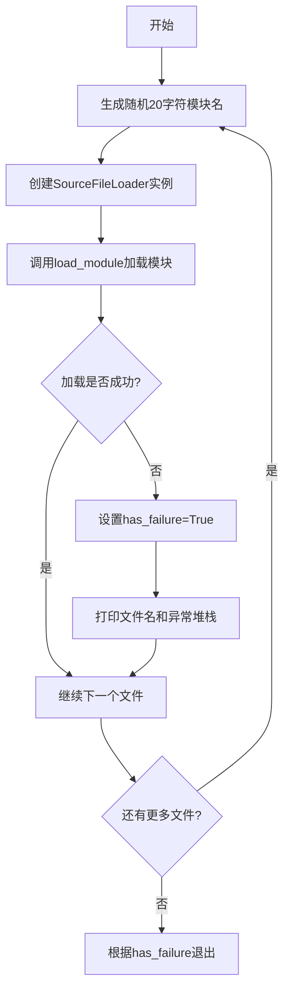
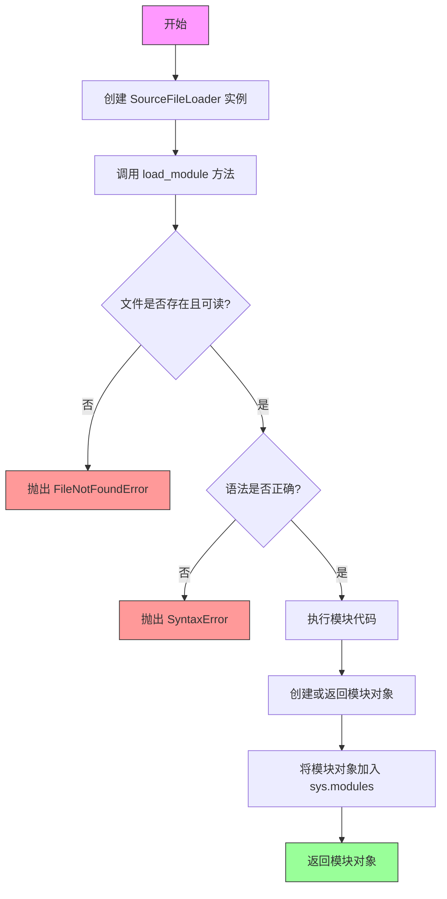
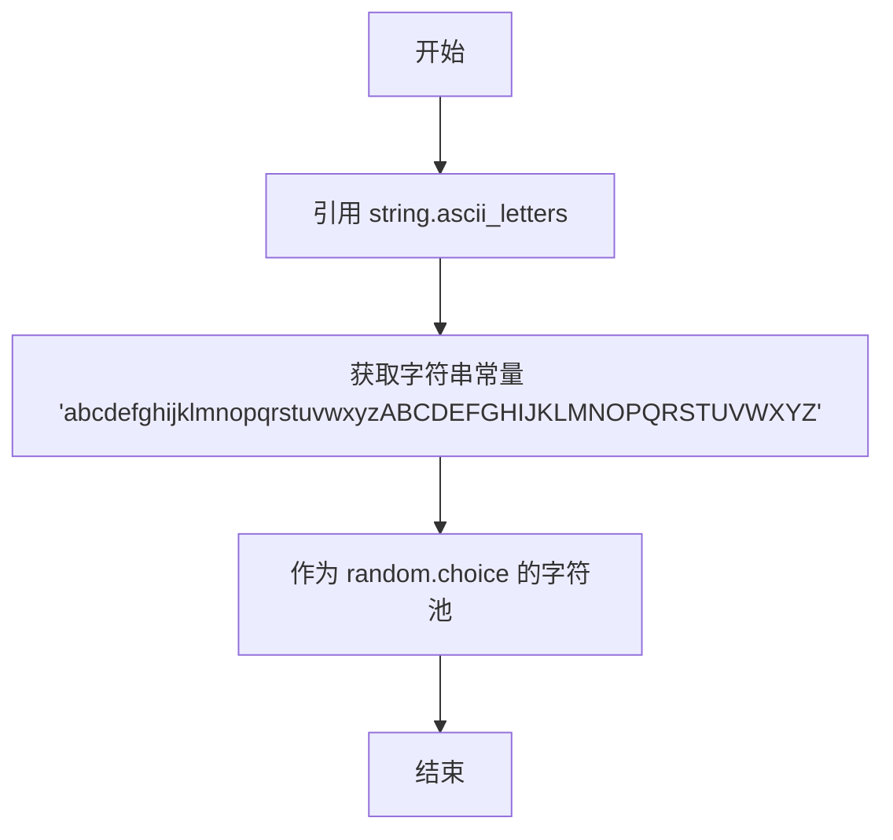

# `Langchain-Chatchat\libs\chatchat-server\scripts\check_imports.py` 详细设计文档

一个命令行工具，用于动态加载指定的Python模块文件，检测模块导入是否成功，并根据是否存在加载失败返回相应的退出码

## 整体流程

```mermaid
graph TD
    A[开始] --> B[获取命令行参数files]
    B --> C[初始化has_failure = False]
    C --> D{遍历files中的每个file}
    D --> E[生成20位随机模块名]
    E --> F[使用SourceFileLoader加载模块]
    F --> G{加载是否成功?}
    G -- 是 --> D
    G -- 否 --> H[设置has_failure = True]
    H --> I[打印文件名和异常堆栈]
    I --> D
    D --> J{所有文件处理完毕?}
J -- 是 --> K[根据has_failure退出]
K --> L[has_failure为True则exit(1), 否则exit(0)]
```

## 类结构

```
该脚本为无类定义的模块化脚本，主要依赖Python内置的SourceFileLoader进行动态模块加载
```

## 全局变量及字段


### `files`
    
从命令行参数获取的文件列表

类型：`list`
    


### `has_failure`
    
标记是否存在模块加载失败

类型：`bool`
    


### `file`
    
当前遍历的文件路径

类型：`str`
    


### `module_name`
    
动态生成的随机模块名

类型：`str`
    


    

## 全局函数及方法


### `SourceFileLoader.load_module`

该函数使用SourceFileLoader类动态加载指定的Python源文件，生成随机模块名并尝试加载，捕获任何异常以便进行错误报告。

参数：

- `module_name`：`str`，随机生成的20字符随机模块名，用于避免命名冲突
- `file`：`str`，要加载的Python源文件的路径

返回值：`types.ModuleType`，加载后的Python模块对象

#### 流程图



#### 带注释源码

```python
import random
import string
import sys
import traceback
from importlib.machinery import SourceFileLoader

if __name__ == "__main__":
    # 从命令行参数获取要加载的文件列表
    files = sys.argv[1:]
    # 初始化失败标志
    has_failure = False
    # 遍历每个文件
    for file in files:
        try:
            # 生成随机20字符的模块名，使用ASCII字母
            module_name = "".join(
                random.choice(string.ascii_letters) for _ in range(20)
            )
            # 使用SourceFileLoader动态加载模块
            # 参数1: 模块名（随机生成）
            # 参数2: 文件路径
            SourceFileLoader(module_name, file).load_module()
        except Exception:
            # 发生异常时标记失败
            has_failure = True
            print(file)  # 打印失败的文件名
            traceback.print_exc()  # 打印异常堆栈信息
            print()  # 输出空行分隔

    # 根据是否有失败返回退出码
    # 1表示有失败，0表示全部成功
    sys.exit(1 if has_failure else 0)
```

---


### `SourceFileLoader.load_module`

加载指定的 Python 模块，并返回加载后的模块对象。

参数：

- `fullname`：`str`，模块的完整名称（包括包路径），用于标识模块的唯一标识符
- （隐式参数 `path`）：在 `SourceFileLoader` 构造函数中传入，指向源文件的文件系统路径

返回值：`ModuleType`，返回加载后的模块对象，包含了模块中定义的所有属性、函数和类

#### 流程图



#### 带注释源码

```python
# SourceFileLoader.load_module 方法定义于 importlib.machinery
# 以下为调用示例代码的注释说明

# 导入 SourceFileLoader 类，用于从文件系统加载 Python 源码模块
from importlib.machinery import SourceFileLoader

if __name__ == "__main__":
    # 从命令行参数获取待加载的文件列表
    files = sys.argv[1:]
    
    # 标记是否存在加载失败
    has_failure = False
    
    # 遍历每个文件进行加载
    for file in files:
        try:
            # 生成随机模块名（20个随机字母组成）
            # 每次使用随机名称避免与已加载模块冲突
            module_name = "".join(
                random.choice(string.ascii_letters) for _ in range(20)
            )
            
            # 创建 SourceFileLoader 实例
            # 参数1: module_name - 模块的完整名称
            # 参数2: file - 源文件的绝对或相对路径
            loader = SourceFileLoader(module_name, file)
            
            # 调用 load_module 方法执行模块加载
            # 内部过程：
            # 1. 打开并读取源文件内容
            # 2. 编译 Python 代码为代码对象（检测语法错误）
            # 3. 创建空的模块对象
            # 4. 在模块命名空间中执行代码
            # 5. 将模块对象存入 sys.modules 缓存
            # 6. 返回加载后的模块对象
            loaded_module = loader.load_module()
            
        except Exception:
            # 捕获任何加载异常
            has_failure = True
            # 打印失败的文件名
            print(file)  # noqa: T201
            # 打印完整的异常堆栈信息
            traceback.print_exc()
            print()  # noqa: T201

    # 根据是否有失败返回退出码
    # 1 表示有失败，0 表示全部成功
    sys.exit(1 if has_failure else 0)
```


### `random.choice`

从给定序列中随机选择一个元素并返回。用于生成随机模块名称时，从字母集合中随机选取字符。

#### 参数

- `sequence`：`Sequence[Any]`（具体为 `string.ascii_letters`），一个非空的序列（列表、元组、字符串等），从中随机选取元素。

#### 返回值

`Any`，返回从序列中随机选取的单个元素（类型取决于序列元素类型，此处为 `str` 字符）。

#### 流程图


#### 带注释源码

```python
# random.choice 的典型调用方式（在给定代码中）
# 用于从字母集合中随机选择字符

# 从 string.ascii_letters（包含 a-zA-Z 的字符串）中随机选择一个字符
random.choice(string.ascii_letters)

# 在上下文中用于生成20个随机字符组成的模块名：
module_name = "".join(
    random.choice(string.ascii_letters) for _ in range(20)
)
# random.choice(string.ascii_letters) 每次调用从 'abcdefghijklmnopqrstuvwxyzABCDEFGHIJKLMNOPQRSTUVWXYZ' 中随机返回一个字母
```


### `string.ascii_letters`

该常量为 Python `string` 模块内置的字符串常量，包含了所有英文字母（a-z 和 A-Z），用于在该代码中作为随机字符生成的字符池。

参数：无（该属性为模块级常量，无需参数）

返回值：`str`，返回包含所有英文字母的字符串常量（"abcdefghijklmnopqrstuvwxyzABCDEFGHIJKLMNOPQRSTUVWXYZ"）

#### 流程图



#### 带注释源码

```python
import random
import string
import sys
import traceback
from importlib.machinery import SourceFileLoader

if __name__ == "__main__":
    files = sys.argv[1:]
    has_failure = False
    for file in files:
        try:
            # 使用 string.ascii_letters 作为字符池
            # ascii_letters 值为 'abcdefghijklmnopqrstuvwxyzABCDEFGHIJKLMNOPQRSTUVWXYZ'
            # 用于生成随机的模块名称
            module_name = "".join(
                random.choice(string.ascii_letters) for _ in range(20)
            )
            SourceFileLoader(module_name, file).load_module()
        except Exception:
            has_failure = True
            print(file)  # noqa: T201
            traceback.print_exc()
            print()  # noqa: T201

    sys.exit(1 if has_failure else 0)
```

---

#### 关键组件信息

| 名称 | 一句话描述 |
|------|-----------|
| `string.ascii_letters` | Python 标准库中的字符串常量，包含所有英文字母（a-zA-Z） |
| `random.choice()` | 从给定序列中随机选择一个元素 |
| `SourceFileLoader` | Python 导入机制中的动态模块加载器 |

#### 潜在技术债务与优化空间

1. **动态模块名安全性**：使用随机字符生成模块名可能导致命名冲突或难以调试，建议使用哈希或 UUID 替代
2. **错误处理粒度**：当前捕获所有异常并统一处理，缺乏针对性的异常处理策略
3. **无日志记录**：使用 `print` 进行输出，缺乏结构化日志记录，不利于生产环境排查问题
4. **缺少超时机制**：模块加载可能挂起，建议添加超时控制

## 关键组件


### 命令行参数处理

从 `sys.argv[1:]` 获取待加载的 Python 文件列表，作为脚本的输入参数。

### 随机模块名生成

使用 `random.choice` 和 `string.ascii_letters` 生成 20 个随机字母组成的模块名，避免模块名冲突。

### 动态模块加载

使用 `importlib.machinery.SourceFileLoader` 根据文件路径动态加载 Python 模块，支持运行时加载任意 Python 源文件。

### 异常捕获与处理

使用 `try-except` 块捕获模块加载过程中的所有异常，记录失败的文件并打印完整的堆栈信息，便于调试。

### 退出码管理

根据是否存在加载失败的情况，设置进程退出码：失败时返回 1，成功时返回 0，供调用脚本判断执行结果。

## 问题及建议


### 已知问题

-   **随机模块名重复风险**：每次运行生成20位随机字母作为模块名，存在极低概率的命名冲突，可能导致加载错误的模块
-   **模块缓存未清理**：SourceFileLoader加载的模块会驻留在sys.modules中，多次运行或加载多个同名模块时可能导致状态残留
-   **异常处理过于宽泛**：使用`except Exception`捕获所有异常，无法区分不同类型的错误（如文件不存在、语法错误、导入错误等），影响问题排查
-   **缺少文件存在性检查**：直接尝试加载文件，未预先检查文件是否存在或路径是否合法，异常信息不够友好
-   **未捕获模块执行的副作用**：load_module()会执行模块顶层代码，可能产生不可预期的副作用（如修改全局状态、创建资源等）
-   **命令行参数未校验**：未检查sys.argv[1:]是否为空，空运行无任何反馈
-   **安全风险**：动态加载任意Python文件并执行，无法限制加载来源，存在代码注入风险
-   **无日志记录**：仅使用print输出，无结构化日志，难以对接监控系统

### 优化建议

-   使用基于文件路径的哈希值或规范化名称作为模块名，避免随机性和潜在冲突
-   加载完成后清理sys.modules中对应的模块条目，防止状态污染
-   对不同异常类型进行分层捕获（FileNotFoundError、SyntaxError、ImportError等），提供更精确的错误信息
-   在加载前检查文件路径有效性，区分"文件不存在"与"加载失败"两种场景
-   添加dry-run模式或verbose模式，允许用户预览加载行为而不实际执行副作用
-   校验命令行参数，为空时输出Usage提示信息
-   考虑添加白名单机制或签名验证，仅允许加载受信任的模块文件
-   引入logging模块替代print，实现可配置的日志级别和输出格式

## 其它


### 设计目标与约束

该脚本的设计目标是提供一个批量Python模块测试工具，通过动态加载的方式验证指定Python文件的可导入性。主要约束包括：仅支持Python 3.x（因SourceFileLoader API差异），依赖标准库无需第三方包，文件路径通过命令行参数传入且无数量限制。

### 错误处理与异常设计

采用全局异常捕获机制，对每个文件的加载过程独立try-except保护。捕获所有Exception类型异常（包括语法错误、导入错误、运行时错误），标记has_failure标志位后继续处理后续文件。异常信息通过traceback.print_exc()输出完整堆栈，使用print()输出文件名作为失败标识。

### 数据流与状态机

程序状态主要分为两个阶段：初始化阶段（解析命令行参数、设置初始标志）和执行阶段（遍历文件列表、尝试加载、记录结果）。状态转换依赖于文件加载是否抛出异常，has_failure作为全局状态标志影响最终退出码。

### 外部依赖与接口契约

仅依赖Python标准库：random（生成随机模块名）、string（字符集）、sys（命令行参数和退出码）、traceback（异常堆栈）、importlib.machinery（动态加载）。接口契约为：接收1个或多个文件路径作为sys.argv[1:]，输出失败文件名到stdout，返回0（全部成功）或1（存在失败）。

### 性能考虑

随机模块名长度为20字符，采用随机字符生成存在极低概率碰撞风险（但实际影响可忽略）。每个文件独立加载无并发处理，大文件或复杂模块可能阻塞后续处理。无缓存机制，重复运行会重新加载所有模块。

### 安全性考虑

动态加载机制存在代码执行风险，加载恶意构造的Python文件可能导致安全事件。随机模块名可避免全局命名空间污染，但无法防止导入时的副作用。建议仅在可信环境使用，且不应以较高权限运行。

### 兼容性考虑

该脚本依赖importlib.machinery模块（Python 3.0+可用），不兼容Python 2.x。SourceFileLoader.load_module()在Python 3.10+已标记为deprecated，Python 3.12+可能完全移除，需关注版本演进。

### 测试策略建议

由于该工具本身用于测试其他模块，建议补充单元测试验证：正常文件加载返回0退出码、存在语法错误的文件返回1退出码、空文件列表行为、无效路径处理、以及并发场景下的稳定性。

### 运行要求与环境

Python 3.x解释器即可运行，无需额外依赖。命令行调用格式：python script.py file1.py file2.py ...，支持绝对路径和相对路径。建议在隔离的测试环境使用以避免意外的模块加载副作用。

    