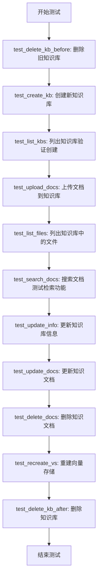
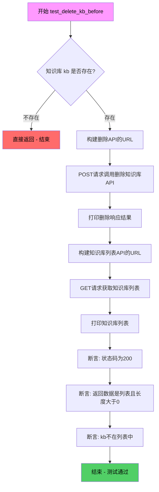
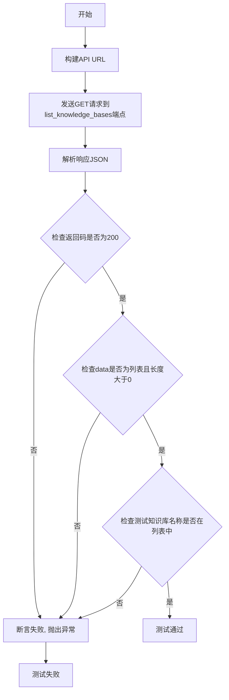
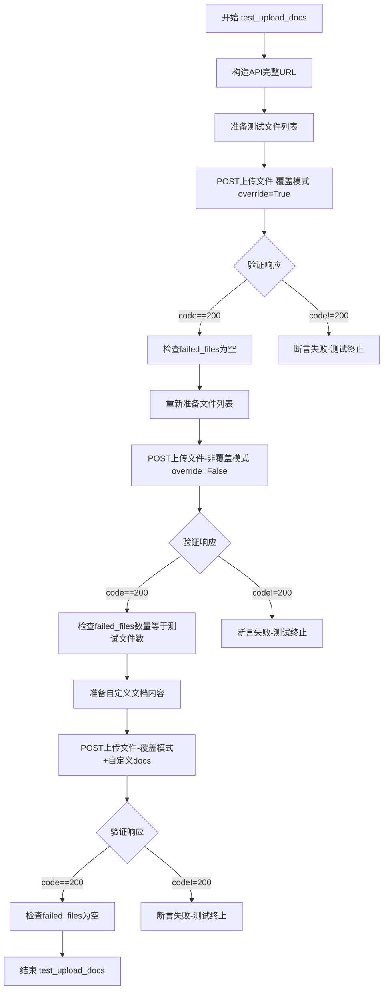
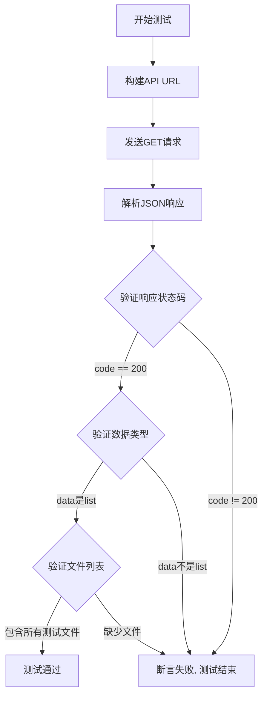
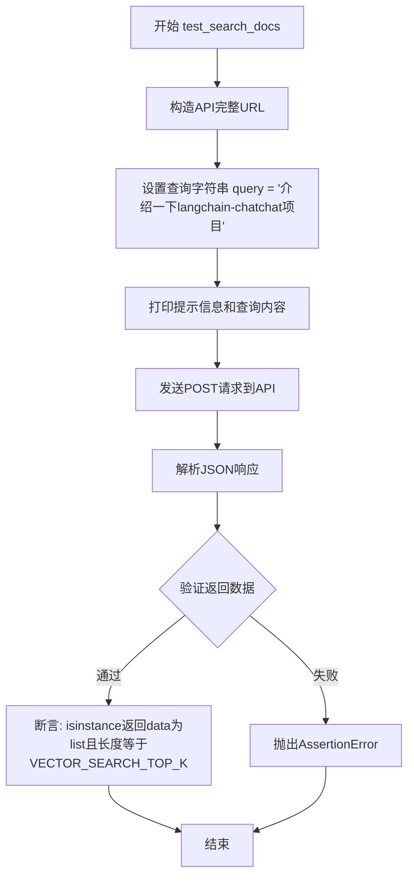
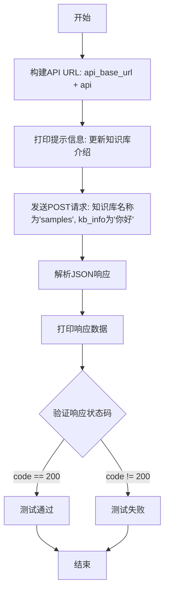
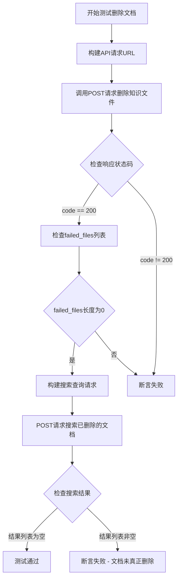

# `Langchain-Chatchat\libs\chatchat-server\tests\api\test_kb_api.py` 详细设计文档

该文件是一个测试脚本，用于通过HTTP API测试知识库（Knowledge Base）的完整生命周期管理功能，包括创建、删除、列出、上传文档、搜索文档、更新信息和重建向量存储等操作。

## 整体流程



## 类结构

```
无类定义（纯测试脚本）
├── 全局变量区
│   ├── root_path
│   ├── api_base_url
│   ├── kb
│   └── test_files
└── 测试函数区
    ├── test_delete_kb_before
    ├── test_create_kb
    ├── test_list_kbs
    ├── test_upload_docs
    ├── test_list_files
    ├── test_search_docs
    ├── test_update_info
    ├── test_update_docs
    ├── test_delete_docs
    ├── test_recreate_vs
    └── test_delete_kb_after
```

## 全局变量及字段


### `root_path`
    
项目根目录路径，通过获取测试脚本的父目录的父目录的父目录得到

类型：`Path`
    


### `api_base_url`
    
API服务的基础URL地址，通过调用api_address()函数获取

类型：`str`
    


### `kb`
    
测试用知识库名称，值为'kb_for_api_test'

类型：`str`
    


### `test_files`
    
测试文件字典，键为文件名（如'wiki/Home.MD'），值为文件路径（通过get_file_path函数获取）

类型：`dict`
    


    

## 全局函数及方法


### `test_delete_kb_before`

该函数用于在测试开始前清理已存在的测试知识库，确保测试环境的干净状态。它会先检查知识库是否存在，若存在则通过API删除，并验证删除操作是否成功。

参数：

- `api`：`str`，可选参数，默认为"/knowledge_base/delete_knowledge_base"，指定删除知识库的API端点

返回值：`None` 或 `无返回值`，函数执行完成后直接返回（当知识库不存在时返回`None`，否则执行完所有操作后返回）

#### 流程图



#### 带注释源码

```python
def test_delete_kb_before(api="/knowledge_base/delete_knowledge_base"):
    """
    删除测试前的旧知识库
    
    在运行集成测试前，清理可能存在的同名测试知识库，
    确保测试环境处于干净的初始状态。
    
    参数:
        api: 知识库删除API的端点路径，默认为 /knowledge_base/delete_knowledge_base
    
    返回:
        None: 当知识库不存在时提前返回; 成功执行完毕后返回None
    """
    
    # 检查测试知识库是否已存在于本地文件系统中
    # 如果不存在则无需删除，直接返回
    if not Path(get_kb_path(kb)).exists():
        return

    # 构建完整的删除API URL
    url = api_base_url + api
    print("\n测试知识库存在，需要删除")
    
    # 向删除API发送POST请求，请求体为知识库名称字符串
    r = requests.post(url, json=kb)
    data = r.json()
    pprint(data)

    # ============ 验证删除操作 ============
    # 重新获取知识库列表，确认删除成功
    
    # 构建获取知识库列表的API URL
    url = api_base_url + "/knowledge_base/list_knowledge_bases"
    print("\n获取知识库列表：")
    
    # GET请求获取当前所有知识库列表
    r = requests.get(url)
    data = r.json()
    pprint(data)
    
    # 断言1: API返回状态码为200，表示请求成功
    assert data["code"] == 200
    
    # 断言2: 返回的data是列表类型且列表非空
    assert isinstance(data["data"], list) and len(data["data"]) > 0
    
    # 断言3: 确认被删除的知识库名称不在列表中
    assert kb not in data["data"]
```


### `test_create_kb`

该函数用于测试知识库创建API的功能，涵盖三种场景：空名称创建应返回错误、同名知识库创建应返回错误、正常创建应返回成功。

#### 参数

- `api`：`str`，API端点路径，默认为"/knowledge_base/create_knowledge_base"

#### 返回值

`None`，该函数无显式返回值，通过`assert`断言验证API响应的正确性

#### 流程图

```mermaid
flowchart TD
    A[开始测试] --> B[构建API URL: api_base_url + api]
    B --> C[测试场景1: 空名称创建]
    C --> D[发送POST请求, json={'knowledge_base_name': ' '} ]
    D --> E{验证响应}
    E -->|code==404| F[验证msg=='知识库名称不能为空，请重新填写知识库名称']
    E -->|code!=404| G[测试失败]
    F --> H[测试场景2: 创建新知识库]
    H --> I[发送POST请求, json={'knowledge_base_name': kb}]
    I --> J{验证响应}
    J -->|code==200| K[验证msg=='已新增知识库 {kb}']
    J -->|code!=200| L[测试失败]
    K --> M[测试场景3: 创建同名知识库]
    M --> N[发送POST请求, json={'knowledge_base_name': kb}]
    N --> O{验证响应}
    O -->|code==404| P[验证msg=='已存在同名知识库 {kb}']
    O -->|code!=404| Q[测试失败]
    P --> R[所有测试通过]
```

#### 带注释源码

```python
def test_create_kb(api="/knowledge_base/create_knowledge_base"):
    """
    测试创建知识库API功能
    包含三个测试场景:
    1. 使用空名称创建知识库 - 预期返回404错误
    2. 正常创建新知识库 - 预期返回200成功
    3. 创建同名知识库 - 预期返回404错误
    """
    # 1. 构建完整的API URL地址
    url = api_base_url + api

    # ======== 测试场景1: 空名称创建 ========
    print(f"\n尝试用空名称创建知识库：")
    # 发送POST请求, 使用空格作为空名称
    r = requests.post(url, json={"knowledge_base_name": " "})
    # 获取响应数据
    data = r.json()
    pprint(data)
    # 断言响应状态码为404
    assert data["code"] == 404
    # 断言错误消息为"知识库名称不能为空，请重新填写知识库名称"
    assert data["msg"] == "知识库名称不能为空，请重新填写知识库名称"

    # ======== 测试场景2: 正常创建新知识库 ========
    print(f"\n创建新知识库： {kb}")
    # 发送POST请求, 使用正常的知识库名称
    r = requests.post(url, json={"knowledge_base_name": kb})
    # 获取响应数据
    data = r.json()
    pprint(data)
    # 断言响应状态码为200表示成功
    assert data["code"] == 200
    # 断言成功消息为"已新增知识库 {kb}"
    assert data["msg"] == f"已新增知识库 {kb}"

    # ======== 测试场景3: 创建同名知识库 ========
    print(f"\n尝试创建同名知识库： {kb}")
    # 发送POST请求, 使用已存在的知识库名称
    r = requests.post(url, json={"knowledge_base_name": kb})
    # 获取响应数据
    data = r.json()
    pprint(data)
    # 断言响应状态码为404表示不允许重复创建
    assert data["code"] == 404
    # 断言错误消息为"已存在同名知识库 {kb}"
    assert data["msg"] == f"已存在同名知识库 {kb}"
```


### `test_list_kbs`

测试列出所有知识库API，用于验证系统能够正确返回当前已创建的知识库列表。

参数：

- `api`：`str`，可选参数，API端点路径，默认为"/knowledge_base/list_knowledge_bases"

返回值：`requests.Response`，返回包含JSON数据的响应对象，其中`data["code"]`为200表示成功，`data["data"]`为知识库名称列表

#### 流程图



#### 带注释源码

```python
def test_list_kbs(api="/knowledge_base/list_knowledge_bases"):
    """
    测试列出所有知识库API
    
    参数:
        api: API端点路径,默认为/knowledge_base/list_knowledge_bases
    
    返回:
        无返回值,通过assert断言验证API响应
    """
    # 构建完整的API URL地址
    url = api_base_url + api
    
    # 打印提示信息
    print("\n获取知识库列表：")
    
    # 发送GET请求获取知识库列表
    r = requests.get(url)
    
    # 解析响应JSON数据
    data = r.json()
    
    # 打印返回数据用于调试
    pprint(data)
    
    # 断言1: 验证API返回成功状态码200
    assert data["code"] == 200
    
    # 断言2: 验证返回的data是列表类型且不为空
    assert isinstance(data["data"], list) and len(data["data"]) > 0
    
    # 断言3: 验证测试用的知识库名称存在于列表中
    assert kb in data["data"]
```


### `test_upload_docs`

测试上传文档API函数，用于验证知识库文档上传功能，支持覆盖模式和非覆盖模式两种上传场景，并测试自定义文档内容的处理。

参数：

- `api`：`str`，API端点路径，默认为`"/knowledge_base/upload_docs"`

返回值：`None`，该函数无显式返回值，通过断言验证API响应

#### 流程图



#### 带注释源码

```python
def test_upload_docs(api="/knowledge_base/upload_docs"):
    """
    测试上传文档API，包括覆盖和非覆盖模式
    
    Args:
        api: API端点路径，默认为知识库文档上传接口
    """
    # 构造完整的API URL地址
    url = api_base_url + api
    
    # 构建待上传文件列表，格式为(文件名, 文件对象)的元组列表
    # 使用open(path, "rb")以二进制读模式打开文件
    files = [("files", (name, open(path, "rb"))) for name, path in test_files.items()]

    # ======== 测试场景1: 覆盖模式上传 ========
    print(f"\n上传知识文件")
    # 构建请求数据：知识库名称为kb，覆盖模式开启
    data = {"knowledge_base_name": kb, "override": True}
    # 发送POST请求上传文件
    r = requests.post(url, data=data, files=files)
    # 解析JSON响应
    data = r.json()
    # 打印响应数据便于调试
    pprint(data)
    # 断言：响应状态码为200表示成功
    assert data["code"] == 200
    # 断言：失败文件列表长度为0，表示全部上传成功
    assert len(data["data"]["failed_files"]) == 0

    # ======== 测试场景2: 非覆盖模式上传 ========
    print(f"\n尝试重新上传知识文件， 不覆盖")
    # 构建请求数据：覆盖模式关闭
    data = {"knowledge_base_name": kb, "override": False}
    # 重新构建文件列表（需重新打开文件句柄）
    files = [("files", (name, open(path, "rb"))) for name, path in test_files.items()]
    # 发送POST请求
    r = requests.post(url, data=data, files=files)
    # 解析JSON响应
    data = r.json()
    # 打印响应数据
    pprint(data)
    # 断言：响应状态码为200
    assert data["code"] == 200
    # 断言：失败文件数量等于测试文件总数（因为文件已存在且不覆盖）
    assert len(data["data"]["failed_files"]) == len(test_files)

    # ======== 测试场景3: 覆盖模式+自定义文档内容 ========
    print(f"\n尝试重新上传知识文件， 覆盖，自定义docs")
    # 定义自定义文档内容：文件名FAQ.MD对应自定义页面内容
    docs = {"FAQ.MD": [{"page_content": "custom docs", "metadata": {}}]}
    # 构建请求数据：开启覆盖模式，并传入自定义文档JSON字符串
    data = {"knowledge_base_name": kb, "override": True, "docs": json.dumps(docs)}
    # 重新构建文件列表
    files = [("files", (name, open(path, "rb"))) for name, path in test_files.items()]
    # 发送POST请求
    r = requests.post(url, data=data, files=files)
    # 解析JSON响应
    data = r.json()
    # 打印响应数据
    pprint(data)
    # 断言：响应状态码为200
    assert data["code"] == 200
    # 断言：失败文件列表为空
    assert len(data["data"]["failed_files"]) == 0
```


### `test_list_files`

测试列出知识库中文件API，验证是否能正确获取知识库内的文件列表。

参数：

- `api`：`str`，可选参数，默认为`"/knowledge_base/list_files"`，API端点路径

返回值：`None`，通过断言验证API响应的正确性（验证返回code为200，data为list类型，且包含所有测试文件）

#### 流程图



#### 带注释源码

```python
def test_list_files(api="/knowledge_base/list_files"):
    """
    测试列出知识库中文件API
    
    Args:
        api: API端点路径，默认为 /knowledge_base/list_files
    """
    # 1. 构建完整的API URL
    url = api_base_url + api
    
    # 2. 打印测试说明
    print("\n获取知识库中文件列表：")
    
    # 3. 发送GET请求，使用knowledge_base_name作为查询参数
    r = requests.get(url, params={"knowledge_base_name": kb})
    
    # 4. 解析JSON响应
    data = r.json()
    
    # 5. 打印响应数据用于调试
    pprint(data)
    
    # 6. 断言1: 验证响应状态码为200
    assert data["code"] == 200
    
    # 7. 断言2: 验证返回的data是列表类型
    assert isinstance(data["data"], list)
    
    # 8. 断言3: 验证返回的文件列表包含所有上传的测试文件
    for name in test_files:
        assert name in data["data"]
```


### `test_search_docs`

该函数用于测试知识库的文档搜索API，构造包含知识库名称和查询词的POST请求，验证返回结果为列表且长度符合系统配置的最大检索数量设置。

参数：

- `api`：`str`，API端点路径，默认为 `/knowledge_base/search_docs`

返回值：`dict`，包含搜索结果的列表，长度应等于 `Settings.kb_settings.VECTOR_SEARCH_TOP_K`

#### 流程图



#### 带注释源码

```python
def test_search_docs(api="/knowledge_base/search_docs"):
    """
    测试知识库文档搜索API功能
    
    参数:
        api: str, API端点路径，默认为 "/knowledge_base/search_docs"
    返回:
        无返回值，通过断言验证返回数据格式
    """
    # 1. 构造完整的API请求URL
    url = api_base_url + api
    
    # 2. 定义测试查询语句
    query = "介绍一下langchain-chatchat项目"
    
    # 3. 打印提示信息，告知用户即将进行知识库检索
    print("\n检索知识库：")
    print(query)
    
    # 4. 发送POST请求，包含知识库名称和查询语句
    r = requests.post(url, json={"knowledge_base_name": kb, "query": query})
    
    # 5. 解析服务器返回的JSON数据
    data = r.json()
    
    # 6. 打印返回数据用于调试
    pprint(data)
    
    # 7. 断言验证返回数据格式：
    #    - 返回值必须是列表类型
    #    - 列表长度必须等于系统配置的向量搜索Top K数量
    assert isinstance(data, list) and len(data) == Settings.kb_settings.VECTOR_SEARCH_TOP_K
```


### `test_update_info`

测试更新知识库信息API，用于验证知识库的介绍信息是否能够成功更新。

参数：

- `api`：`str`，API端点路径，默认为 `"/knowledge_base/update_info"`

返回值：`None`，无显式返回值，但通过 `assert` 断言验证响应状态码为 `200`，确保更新成功。

#### 流程图



#### 带注释源码

```python
def test_update_info(api="/knowledge_base/update_info"):
    """
    测试更新知识库信息API
    
    参数:
        api: str, API端点路径，默认为 "/knowledge_base/update_info"
    """
    
    # 拼接完整的API URL地址
    url = api_base_url + api
    
    # 打印测试说明信息
    print("\n更新知识库介绍")
    
    # 发送POST请求更新知识库介绍信息
    # 请求参数:
    #   - knowledge_base_name: "samples" - 知识库名称
    #   - kb_info: "你好" - 知识库介绍内容
    r = requests.post(url, json={"knowledge_base_name": "samples", "kb_info": "你好"})
    
    # 解析JSON响应数据
    data = r.json()
    
    # 打印响应数据进行查看
    pprint(data)
    
    # 断言验证API调用是否成功
    assert data["code"] == 200
```


### `test_update_docs`

该函数用于测试更新知识库中的知识文档API，验证指定知识库的文件能否成功更新，并检查是否有失败的文件。

参数：

- `api`：`str`，API端点路径，默认为`"/knowledge_base/update_docs"`

返回值：`None`，该函数无显式返回值，但通过断言验证API响应的状态码为200且失败文件列表长度为0。

#### 流程图

```mermaid
flowchart TD
    A[开始执行 test_update_docs] --> B[构造API请求URL<br/>url = api_base_url + api]
    B --> C[打印日志: 更新知识文件]
    C --> D[发送POST请求<br/>requests.post url, json参数<br/>knowledge_base_name: kb<br/>file_names: test_files列表]
    D --> E[解析响应JSON<br/>data = r.json]
    E --> F[打印响应数据<br/>pprint data]
    F --> G{断言验证}
    G --> H[assert data['code'] == 200]
    H --> I[assert len data['data']['failed_files'] == 0]
    I --> J[结束]
    
    style G fill:#f9f,stroke:#333
    style H fill:#ff6b6b,stroke:#333
    style I fill:#ff6b6b,stroke:#333
```

#### 带注释源码

```python
def test_update_docs(api="/knowledge_base/update_docs"):
    """
    测试更新知识库中的知识文档API
    
    该函数向更新知识文档的API端点发送POST请求，
    验证知识库中的文件能否成功更新，并检查是否存在失败的文件。
    
    参数:
        api (str): API端点路径，默认为"/knowledge_base/update_docs"
    
    返回值:
        None: 该函数无显式返回值，通过断言验证API响应
    """
    # 拼接完整的API URL地址
    url = api_base_url + api

    # 打印操作提示信息
    print(f"\n更新知识文件")
    
    # 向更新文档API发送POST请求
    # 请求参数包含:
    #   - knowledge_base_name: 知识库名称（使用全局变量kb）
    #   - file_names: 需要更新的文件列表（test_files字典的键）
    r = requests.post(
        url, json={"knowledge_base_name": kb, "file_names": list(test_files)}
    )
    
    # 解析服务器返回的JSON响应数据
    data = r.json()
    
    # 打印响应数据用于调试和查看
    pprint(data)
    
    # 断言验证API调用成功
    # 验证返回的状态码为200表示操作成功
    assert data["code"] == 200
    
    # 验证失败文件列表长度为0，表示所有文件都更新成功
    assert len(data["data"]["failed_files"]) == 0
```


### `test_delete_docs`

该函数用于测试删除知识库中指定文档的API功能，通过调用删除接口删除已上传的测试文件，并验证删除后无法再检索到这些文档的内容。

参数：

- `api`：`str`，API端点路径，默认为"/knowledge_base/delete_docs"

返回值：`None`，该函数没有显式返回值，通过断言验证API响应的正确性

#### 流程图



#### 带注释源码

```python
def test_delete_docs(api="/knowledge_base/delete_docs"):
    """
    测试删除知识库中指定文档的功能
    
    参数:
        api: str, API端点路径，默认为"/knowledge_base/delete_docs"
    返回:
        None: 通过断言验证API响应的正确性，无显式返回值
    """
    # 1. 拼接完整的API请求URL
    url = api_base_url + api

    # 2. 打印提示信息，准备删除知识文件
    print(f"\n删除知识文件")
    
    # 3. 构造POST请求参数，包含知识库名称和要删除的文件名列表
    r = requests.post(
        url, json={"knowledge_base_name": kb, "file_names": list(test_files)}
    )
    
    # 4. 解析JSON响应数据
    data = r.json()
    
    # 5. 打印响应结果用于调试
    pprint(data)
    
    # 6. 断言：验证API返回成功状态码
    assert data["code"] == 200
    
    # 7. 断言：验证所有文件删除成功，没有失败的文件
    assert len(data["data"]["failed_files"]) == 0

    # 8. 更换为搜索API的URL，准备验证删除后无法检索
    url = api_base_url + "/knowledge_base/search_docs"
    
    # 9. 设置搜索查询内容
    query = "介绍一下langchain-chatchat项目"
    
    # 10. 打印提示信息，说明尝试检索已删除的文档
    print("\n尝试检索删除后的检索知识库：")
    print(query)
    
    # 11. 发起POST请求搜索知识库
    r = requests.post(url, json={"knowledge_base_name": kb, "query": query})
    
    # 12. 解析搜索响应数据
    data = r.json()
    
    # 13. 打印搜索结果用于调试
    pprint(data)
    
    # 14. 断言：验证删除后搜索结果为空列表，确认文档确实已被删除
    assert isinstance(data, list) and len(data) == 0
```


### `test_recreate_vs`

测试重建向量存储（Vector Store）功能，验证知识库在重建后搜索功能是否正常工作。

参数：

-  `api`：`str`，API端点路径，默认值为 `/knowledge_base/recreate_vector_store`

返回值：`None`，该函数为测试函数，无返回值（void）

#### 流程图

```mermaid
flowchart TD
    A[开始] --> B[构建重建向量存储API URL]
    B --> C[POST请求重建知识库, 启用stream=True]
    C --> D[迭代处理流式响应]
    D --> E{chunk是否存在?}
    E -->|是| F[解析chunk数据<br/>data = json.loads(chunk[6:])]
    F --> G[断言data是dict类型]
    G --> H[断言data.code == 200]
    H --> I[打印data.msg]
    I --> E
    E -->|否| J[构建搜索API URL]
    J --> K[设置查询字符串<br/>query = '本项目支持哪些文件格式?']
    K --> L[POST请求搜索知识库]
    L --> M[解析响应数据]
    M --> N[断言返回是list类型]
    N --> O[断言返回长度 == VECTOR_SEARCH_TOP_K]
    O --> P[结束]
```

#### 带注释源码

```python
def test_recreate_vs(api="/knowledge_base/recreate_vector_store"):
    """
    测试重建向量存储API，验证知识库重建后搜索功能正常
    
    参数:
        api: API端点路径，默认值为重建向量存储的API
    """
    # 构建完整的API URL
    url = api_base_url + api
    
    # 打印提示信息，表示开始重建知识库
    print("\n重建知识库：")
    
    # 发送POST请求重建知识库的向量存储，使用stream模式处理流式响应
    r = requests.post(url, json={"knowledge_base_name": kb}, stream=True)
    
    # 迭代处理流式响应的每个chunk
    for chunk in r.iter_content(None):
        # 跳过前6个字节（可能是进度前缀），解析JSON数据
        data = json.loads(chunk[6:])
        
        # 断言返回数据是字典类型
        assert isinstance(data, dict)
        
        # 断言响应状态码为200，表示成功
        assert data["code"] == 200
        
        # 打印重建进度消息
        print(data["msg"])
    
    # 重建完成后，构建搜索API的URL
    url = api_base_url + "/knowledge_base/search_docs"
    
    # 设置查询字符串
    query = "本项目支持哪些文件格式?"
    
    # 打印提示信息，表示开始检索重建后的知识库
    print("\n尝试检索重建后的检索知识库：")
    
    # 打印查询内容
    print(query)
    
    # 发送POST请求搜索知识库
    r = requests.post(url, json={"knowledge_base_name": kb, "query": query})
    
    # 解析响应JSON数据
    data = r.json()
    
    # 打印返回数据（调试用）
    pprint(data)
    
    # 断言返回数据是列表类型
    assert isinstance(data, list)
    
    # 断言返回结果数量等于配置中的向量搜索top K值
    assert len(data) == Settings.kb_settings.VECTOR_SEARCH_TOP_K
```


### `test_delete_kb_after`

该函数用于测试删除知识库的 API 功能。首先向删除知识库的 API 发送 POST 请求，传入知识库名称以删除指定知识库；随后通过调用获取知识库列表的 API 来验证该知识库已被成功删除。

**参数：**

- `api`：`str`，删除知识库的 API 端点，默认为 `/knowledge_base/delete_knowledge_base`

**返回值：** `None`，该函数无显式返回值，主要通过断言验证删除操作是否成功

#### 流程图

```mermaid
flowchart TD
    A[开始] --> B[构造删除知识库URL: api_base_url + api]
    B --> C[打印提示: 删除知识库]
    C --> D[发送POST请求: requests.post url, json=kb]
    D --> E[获取响应: data = r.json]
    E --> F[打印响应数据: pprint data]
    F --> G[构造获取列表URL: api_base_url + /knowledge_base/list_knowledge_bases]
    G --> H[打印提示: 获取知识库列表]
    H --> I[发送GET请求: requests.get url]
    I --> J[获取响应: data = r.json]
    J --> K[打印响应数据: pprint data]
    K --> L{断言验证}
    L -->|code == 200| M{data是list且长度>0}
    M -->|是| N{kb not in data[data]}
    N -->|是| O[删除验证成功]
    N -->|否| P[抛出AssertionError]
    M -->|否| P
    L -->|否| P
    O --> Q[结束]
```

#### 带注释源码

```python
def test_delete_kb_after(api="/knowledge_base/delete_knowledge_base"):
    """
    测试删除知识库的API功能
    
    参数:
        api: str, 删除知识库的API端点，默认为"/knowledge_base/delete_knowledge_base"
    返回:
        None: 该函数无显式返回值，通过断言验证删除操作是否成功
    """
    # 构造删除知识库的完整URL地址
    url = api_base_url + api
    
    # 打印操作提示信息
    print("\n删除知识库")
    
    # 发送POST请求删除指定的知识库(kb变量在文件开头定义为"kb_for_api_test")
    r = requests.post(url, json=kb)
    
    # 解析响应JSON数据
    data = r.json()
    
    # 打印响应数据用于调试查看
    pprint(data)

    # 构造获取知识库列表的URL，用于验证删除结果
    url = api_base_url + "/knowledge_base/list_knowledge_bases"
    
    # 打印操作提示信息
    print("\n获取知识库列表：")
    
    # 发送GET请求获取所有知识库列表
    r = requests.get(url)
    
    # 解析响应JSON数据
    data = r.json()
    
    # 打印响应数据用于调试查看
    pprint(data)
    
    # 断言验证响应状态码为200表示请求成功
    assert data["code"] == 200
    
    # 断言验证返回数据是列表类型且长度大于0
    assert isinstance(data["data"], list) and len(data["data"]) > 0
    
    # 断言验证被删除的知识库名称不在列表中，确认删除成功
    assert kb not in data["data"]
```

## 关键组件


### 知识库删除模块

在测试开始前检查并删除已存在的同名知识库，确保测试环境干净

### 知识库创建模块

测试知识库的创建功能，包括空名称校验和同名知识库冲突检测

### 知识库列表查询模块

获取并验证系统中所有知识库的列表信息

### 文档上传模块

向知识库批量上传多种格式的文档文件，支持覆盖模式和非覆盖模式，支持自定义文档内容

### 知识库文件列表模块

获取指定知识库中的所有文件列表并验证文件存在性

### 文档检索模块

基于查询词在知识库中进行向量语义检索，验证检索结果数量

### 知识库信息更新模块

更新指定知识库的描述信息

### 文档更新模块

重新处理并更新知识库中的指定文档文件

### 文档删除模块

从知识库中删除指定文档文件，并验证删除后检索结果为空

### 向量存储重建模块

重建知识库的向量存储，支持流式响应处理

### 知识库清理模块

测试完成后删除测试用知识库，验证删除结果

### 测试文件配置

定义测试用的知识库名称和待测试的文件路径字典

### API基础地址模块

获取被测试服务的API基础地址


## 问题及建议


### 已知问题

-   **资源泄露风险**：使用`open(path, "rb")`打开文件但未及时关闭（应在`with`语句中使用或显式关闭），且`test_upload_docs`中`files`列表被重复创建多次
-   **硬编码配置**：API路径、错误消息、查询语句等存在多处硬编码，缺乏配置管理
-   **网络请求配置缺失**：`requests`调用未设置超时(`timeout`参数)，可能导致请求无限期等待
-   **测试隔离性不足**：测试函数之间存在隐式依赖（如`test_delete_kb_before`假设知识库存在、`test_upload_docs`依赖前置创建操作），执行顺序会影响结果
-   **错误处理薄弱**：缺少`try-except`捕获网络异常、API返回非JSON响应等异常情况
-   **重复代码**：URL拼接逻辑在多个函数中重复出现，可提取为公共方法
-   **使用assert进行业务校验**：`assert`用于验证API返回的错误消息（如`assert data["msg"] == "知识库名称不能为空..."`），不适合生产环境
-   **sys.path手动修改**：通过`sys.path.append`添加路径不是推荐做法，应使用包安装或相对导入

### 优化建议

-   将`requests.post/get`包装为带超时和异常处理的公共方法，使用`requests.Session()`复用连接提升性能
-   将API路径、超时配置、知识库名称等提取为配置常量或从配置文件加载
-   使用`with`语句管理文件打开，确保资源正确释放
-   为每个测试函数添加`@pytest.fixture`或明确的setup/teardown逻辑，确保测试独立性
-   用`unittest.TestCase`或`pytest`框架重写，替代`assert`方式的校验，使用更规范的断言库
-   提取`get_url(api_path)`等公共方法减少重复代码

## 其它


### 设计目标与约束

该代码旨在验证知识库（Knowledge Base）API的功能完整性，确保chatchat项目的知识库管理模块能够正确处理创建、删除、上传、搜索等核心操作。测试脚本采用端到端方式，通过HTTP请求模拟客户端行为，覆盖知识库的完整生命周期。约束条件包括：测试环境需要启动chatchat服务器，测试文件必须存在于samples目录下，且API服务需要支持chunked响应（用于向量库重建测试）。

### 错误处理与异常设计

代码中的错误处理主要依赖assert语句进行断言验证。当API返回的code不等于200时测试失败，对于创建知识库的空名称场景，验证返回404错误码和特定错误信息"知识库名称不能为空，请重新填写知识库名称"。重复创建同名知识库时同样返回404并提示"已存在同名知识库"。文件上传测试中检查failed_files列表长度，删除后搜索验证返回空列表。潜在改进点：当前仅使用print输出错误信息，建议增加日志记录；对于网络异常（如连接超时）缺乏重试机制；未验证文件内容损坏等边界情况。

### 数据流与状态机

测试流程遵循状态机模型：初始化状态（检查知识库是否存在）→ 创建状态 → 上传文档 → 文档操作（列表/搜索/更新/删除）→ 重建向量库 → 清理状态（删除知识库）。数据流转路径为：本地测试文件 → multipart/form-data上传 → 服务器处理 → 向量存储 → 搜索查询返回结果。关键状态转换包括：test_delete_kb_before确保初始状态干净；test_upload_docs后文档进入已索引状态；test_delete_docs将文档标记为已删除；test_recreate_vs触发向量库完全重建。

### 外部依赖与接口契约

主要外部依赖包括：requests库用于HTTP通信；chatchat.settings.Settings提供配置参数（如VECTOR_SEARCH_TOP_K）；chatchat.server.knowledge_base.utils.get_file_path和get_kb_path处理路径解析；chatchat.server.utils.api_address获取API地址。接口契约方面：所有API端点遵循RESTful风格，返回JSON格式响应，响应结构包含code（状态码）、msg（消息）、data（数据）字段；上传接口支持multipart/form-data，其他接口支持JSON请求体；搜索接口返回文档列表，长度受VECTOR_SEARCH_TOP_K配置限制。

### 安全性考虑

测试代码中存在以下安全风险：test_files中的文件通过open直接以二进制模式读取，未进行文件类型验证；test_upload_docs支持自定义docs参数（JSON格式），需确保服务端对注入内容进行消毒处理；API调用使用明文HTTP（api_base_url），生产环境应使用HTTPS；测试脚本直接使用全局变量kb，存在命名冲突风险。建议在生产环境部署前移除调试打印语句，并对敏感操作添加认证令牌验证。

### 测试覆盖范围与边界条件

当前测试覆盖了正常流程和部分异常场景。覆盖的正常场景包括：创建新知识库、重复创建失败、列出知识库、上传文档（含覆盖/不覆盖选项）、自定义docs上传、文件列表查询、文档搜索、知识库信息更新、文档更新、文档删除、向量库重建、知识库删除。边界条件覆盖包括：空名称创建知识库、重复创建同名知识库、删除不存在的影响、删除后搜索返回空结果。未覆盖的边界场景包括：超长知识库名称、特殊字符文件名、并发上传同一文件、网络中断后的恢复、磁盘空间不足处理、超大文件分片上传等。

### 配置与环境要求

运行环境要求Python 3.8+，需要安装requests库。项目根目录通过Path(__file__).parent.parent.parent动态计算，需确保项目结构符合chatchat标准布局。测试依赖的samples目录应包含wiki/Home.md、wiki/开发环境部署.md、test_files/test.txt等文件。API服务地址通过api_address()函数获取，默认从Settings读取，服务启动端口需与Settings中配置一致。测试使用的知识库名称为"kb_for_api_test"，该名称在测试前后会被创建和删除。

### 性能考量

test_recreate_vs函数采用流式响应处理（stream=True），通过迭代r.iter_content(None)逐块获取响应，避免一次性加载大响应内容。文件上传时使用生成器表达式创建files列表，但实际open的文件句柄未显式关闭（依赖requests自动关闭）。搜索返回结果数量受Settings.kb_settings.VECTOR_SEARCH_TOP_K限制，该值影响内存占用和网络传输量。批量操作（如test_upload_docs和test_update_docs）未实现并发处理，大规模文件操作时性能可能受限。

    