# `Langchain-Chatchat\libs\chatchat-server\tests\api\test_kb_api_request.py` 详细设计文档

这是一个知识库API集成测试文件，用于测试知识库的创建、文档上传、检索、更新、删除等全生命周期管理功能，验证langchain-chatchat项目的知识库功能是否正常工作。

## 整体流程

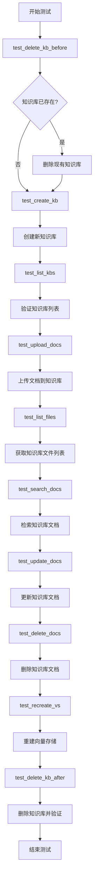

## 类结构

```
测试模块
├── 全局配置与初始化
│   ├── root_path (项目根路径)
│   ├── api_base_url (API基础URL)
│   ├── api (ApiRequest客户端)
│   ├── kb (测试用知识库名称)
│   └── test_files (测试文件字典)
└── 测试函数
    ├── test_delete_kb_before (前置删除)
    ├── test_create_kb (创建知识库)
    ├── test_list_kbs (列出知识库)
    ├── test_upload_docs (上传文档)
    ├── test_list_files (列出文件)
    ├── test_search_docs (检索文档)
    ├── test_update_docs (更新文档)
    ├── test_delete_docs (删除文档)
    ├── test_recreate_vs (重建向量存储)
    └── test_delete_kb_after (后置删除)
```

## 全局变量及字段


### `root_path`
    
项目根目录路径，通过获取当前文件父目录的父目录的父目录得到

类型：`Path`
    


### `api_base_url`
    
API服务地址，通过调用api_address函数获取

类型：`str`
    


### `api`
    
API请求客户端实例，用于向服务器发送HTTP请求

类型：`ApiRequest`
    


### `kb`
    
测试用知识库名称，值为'kb_for_api_test'

类型：`str`
    


### `test_files`
    
测试文件路径字典，包含FAQ.MD、README.MD和test.txt的绝对路径

类型：`dict`
    


    

## 全局函数及方法


### `test_delete_kb_before`

该函数用于在测试前清理已存在的知识库（kb_for_api_test），确保测试环境干净。如果知识库不存在则直接返回，否则调用API删除知识库并验证删除结果。

参数：无

返回值：`None`，无返回值（该函数没有return语句，但执行完成后隐式返回None）

#### 流程图

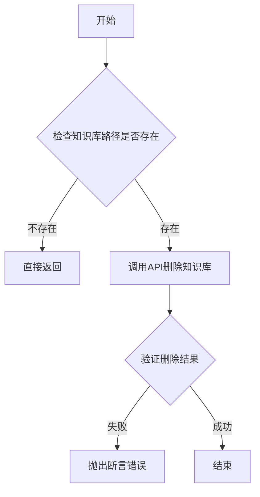

#### 带注释源码

```python
def test_delete_kb_before():
    """
    删除测试前的知识库（如存在）
    确保测试环境干净，避免因已存在的知识库导致测试失败
    """
    # 检查知识库路径是否存在，如果不存在则直接返回，无需删除
    if not Path(get_kb_path(kb)).exists():
        return

    # 调用API删除指定的知识库
    data = api.delete_knowledge_base(kb)
    
    # 打印API返回的详细数据，便于调试
    pprint(data)
    
    # 断言1：验证API调用是否成功（HTTP状态码为200）
    assert data["code"] == 200
    
    # 断言2：验证返回的data字段是列表且不为空
    assert isinstance(data["data"], list) and len(data["data"]) > 0
    
    # 断言3：验证被删除的知识库名称不在当前知识库列表中
    assert kb not in data["data"]
```

---

#### 补充说明

| 项目 | 描述 |
|------|------|
| **全局变量** | `kb` = "kb_for_api_test"（测试用知识库名称）<br>`api` = ApiRequest实例（API请求对象） |
| **依赖函数** | `Path(get_kb_path(kb)).exists()` - 检查知识库路径是否存在<br>`api.delete_knowledge_base(kb)` - 调用删除知识库API |
| **错误处理** | 使用assert语句进行断言验证，任何不满足条件都会抛出AssertionError |
| **设计意图** | 作为测试套件的setup阶段，确保每次测试前知识库状态一致，避免因残留数据导致测试失败 |


### `test_create_kb`

该函数是用于测试知识库创建功能的自动化测试用例，验证了空名称创建、新建知识库和重复创建同名知识库三种场景的正确性。

参数： 无

返回值：`None`，该函数为测试函数，不返回任何值，主要通过断言（assert）来验证API响应的正确性

#### 流程图

```mermaid
flowchart TD
    A[开始测试] --> B[尝试用空名称创建知识库]
    B --> C{断言响应}
    C -->|code==404 and msg包含"不能为空"| D[创建新知识库]
    C -->|失败| E[测试失败]
    D --> F{断言响应}
    F -->|code==200 and msg包含"已新增"| G[尝试创建同名知识库]
    F -->|失败| E
    G --> H{断言响应}
    H -->|code==404 and msg包含"已存在同名"| I[测试通过]
    H -->|失败| E
```

#### 带注释源码

```python
def test_create_kb():
    """
    测试创建知识库功能
    
    测试场景：
    1. 使用空名称创建知识库，预期返回404错误
    2. 正常创建新知识库，预期返回200成功
    3. 尝试创建同名知识库，预期返回404错误
    """
    
    # 测试场景1：尝试用空名称创建知识库
    print(f"\n尝试用空名称创建知识库：")
    # 调用API创建知识库，传入空格作为名称
    data = api.create_knowledge_base(" ")
    # 打印返回数据用于调试
    pprint(data)
    # 断言返回状态码为404，表示请求失败
    assert data["code"] == 404
    # 断言返回消息包含知识库名称不能为空
    assert data["msg"] == "知识库名称不能为空，请重新填写知识库名称"

    # 测试场景2：创建新知识库
    print(f"\n创建新知识库： {kb}")
    # 使用预定义的kb变量作为知识库名称创建知识库
    data = api.create_knowledge_base(kb)
    # 打印返回数据用于调试
    pprint(data)
    # 断言返回状态码为200，表示请求成功
    assert data["code"] == 200
    # 断言返回消息确认知识库已新增
    assert data["msg"] == f"已新增知识库 {kb}"

    # 测试场景3：尝试创建同名知识库
    print(f"\n尝试创建同名知识库： {kb}")
    # 再次使用相同的kb名称创建知识库
    data = api.create_knowledge_base(kb)
    # 打印返回数据用于调试
    pprint(data)
    # 断言返回状态码为404，表示请求失败
    assert data["code"] == 404
    # 断言返回消息确认同名知识库已存在
    assert data["msg"] == f"已存在同名知识库 {kb}"
```


### `test_list_kbs`

该函数用于测试列出所有知识库功能，通过调用API获取知识库列表，并验证返回结果是否为非空列表且包含预设的测试知识库，以确认知识库创建成功且可被正常检索。

参数：无

返回值：`list`，返回包含所有知识库名称的列表

#### 流程图

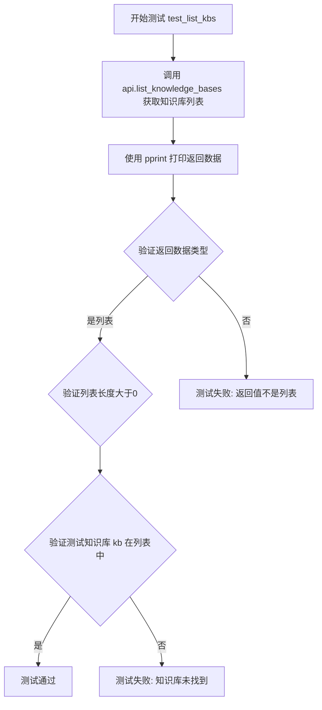

#### 带注释源码

```python
def test_list_kbs():
    """
    测试列出所有知识库功能
    
    验证点：
    1. API返回的是列表类型
    2. 列表不为空（至少存在一个知识库）
    3. 预设的测试知识库kb存在于列表中
    """
    # 调用API获取所有知识库列表
    data = api.list_knowledge_bases()
    
    # 打印返回结果便于调试和日志记录
    pprint(data)
    
    # 断言返回数据是列表类型且长度大于0
    assert isinstance(data, list) and len(data) > 0
    
    # 断言测试知识库名称存在于返回的列表中
    assert kb in data
```


### `test_upload_docs`

测试上传文档到知识库的功能，验证知识库文档上传接口的正确性，包括正常上传、覆盖模式上传以及使用自定义文档内容上传等场景。

参数：此函数无显式参数，但使用了以下全局变量

- `kb`：`str`，知识库名称
- `test_files`：`dict`，测试文件字典，键为文件名，值为文件路径
- `api`：`ApiRequest`，API 请求对象

返回值：`None`，函数通过 `assert` 断言验证 API 响应，不返回数据

#### 流程图

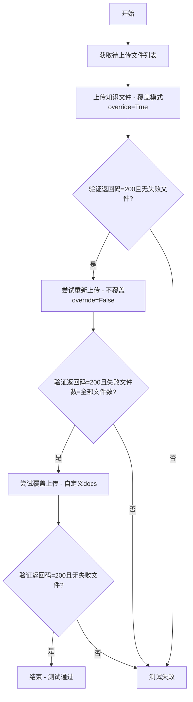

#### 带注释源码

```python
def test_upload_docs():
    # 获取test_files字典中所有文件路径，转换为列表
    files = list(test_files.values())

    # 第一次上传：使用覆盖模式(override=True)上传所有文件到知识库
    print(f"\n上传知识文件")
    data = {"knowledge_base_name": kb, "override": True}
    data = api.upload_kb_docs(files, **data)
    pprint(data)
    # 验证返回状态码为200，表示上传成功
    assert data["code"] == 200
    # 验证失败文件列表为空，表示所有文件都上传成功
    assert len(data["data"]["failed_files"]) == 0

    # 第二次上传：尝试重新上传相同文件，不覆盖(override=False)
    # 预期：已有文件不会被覆盖，返回的failed_files应包含所有文件
    print(f"\n尝试重新上传知识文件， 不覆盖")
    data = {"knowledge_base_name": kb, "override": False}
    data = api.upload_kb_docs(files, **data)
    pprint(data)
    assert data["code"] == 200
    # 验证失败文件数等于测试文件总数（因为不覆盖模式下重复上传会失败）
    assert len(data["data"]["failed_files"]) == len(test_files)

    # 第三次上传：覆盖模式上传，但使用自定义文档内容(docs参数)
    # 自定义docs只针对FAQ.MD文件，添加自定义页面内容
    print(f"\n尝试重新上传知识文件， 覆盖，自定义docs")
    docs = {"FAQ.MD": [{"page_content": "custom docs", "metadata": {}}]}
    data = {"knowledge_base_name": kb, "override": True, "docs": docs}
    data = api.upload_kb_docs(files, **data)
    pprint(data)
    assert data["code"] == 200
    # 验证覆盖上传成功，失败文件列表应为空
    assert len(data["data"]["failed_files"]) == 0
```


### `test_list_files`

该函数用于测试列出知识库中的文件列表，调用API获取指定知识库内的所有文件，并验证返回结果是否为列表且包含预期文件。

参数：此函数无参数。

返回值：`list`，返回知识库中的文件名列表。

#### 流程图

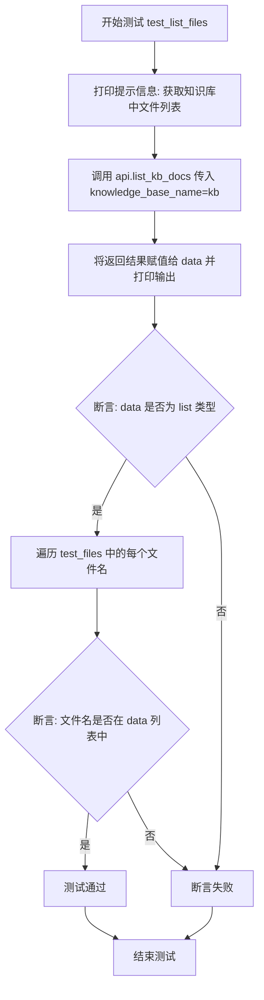

#### 带注释源码

```python
def test_list_files():
    """
    测试列出知识库中的文件列表
    验证API返回的文件列表包含测试上传的所有文件
    """
    # 打印提示信息，表示开始获取知识库中的文件列表
    print("\n获取知识库中文件列表：")
    
    # 调用ApiRequest对象的list_kb_docs方法，传入知识库名称参数
    # 返回该知识库中所有文件的列表
    data = api.list_kb_docs(knowledge_base_name=kb)
    
    # 打印返回的文件列表数据
    pprint(data)
    
    # 断言返回数据是list类型
    assert isinstance(data, list)
    
    # 遍历测试文件中预期的文件名，验证每个文件都在返回列表中
    for name in test_files:
        assert name in data
```


### `test_search_docs`

测试知识库文档检索功能，传入指定的查询语句，从指定知识库中检索相关文档，并验证返回结果数量是否符合配置中的向量搜索 top K 值。

参数：

- 该函数无显式参数，但使用以下闭包变量：
  - `query`：`str`，查询语句，内容为"介绍一下langchain-chatchat项目"
  - `kb`：`str`，知识库名称，值为 `"kb_for_api_test"`
  - `api`：`ApiRequest`，API 请求对象

返回值：`None`，无返回值（函数通过 assert 断言进行验证）

#### 流程图

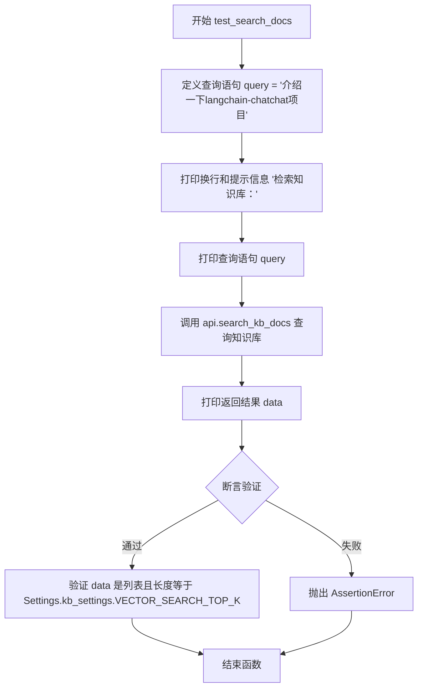

#### 带注释源码

```python
def test_search_docs():
    """
    测试知识库文档检索功能
    使用预定义的查询语句从知识库中检索文档，并验证返回结果数量
    """
    # 定义查询语句
    query = "介绍一下langchain-chatchat项目"
    
    # 打印提示信息和查询内容
    print("\n检索知识库：")
    print(query)
    
    # 调用 API 搜索知识库文档
    # 参数: query - 查询语句, kb - 知识库名称
    # 返回: 检索结果列表
    data = api.search_kb_docs(query, kb)
    
    # 打印返回的检索结果
    pprint(data)
    
    # 断言验证
    # 1. 验证返回结果是列表类型
    # 2. 验证返回结果数量等于配置中的向量搜索 top K 值
    assert isinstance(data, list) and len(data) == Settings.kb_settings.VECTOR_SEARCH_TOP_K
```


### `test_update_docs`

该函数用于测试更新知识库中的文档功能，通过调用API接口更新指定知识库（kb_for_api_test）中的文件，并验证更新操作是否成功。

参数：此函数无显式参数，但使用了以下外部变量：

- `kb`：`str`，知识库名称，值为 "kb_for_api_test"
- `test_files`：`dict`，待更新的测试文件字典，键为文件名，值为文件路径

返回值：`None`，该函数通过断言验证API响应的正确性，不直接返回数据

#### 流程图

```mermaid
flowchart TD
    A[开始 test_update_docs] --> B[打印更新提示信息]
    B --> C[调用 api.update_kb_docs]
    C --> D[传入 knowledge_base_name=kb]
    C --> E[传入 file_names=list(test_files)]
    D --> F[获取返回数据 data]
    F --> G{断言 data['code'] == 200?}
    G -->|是| H{断言 failed_files 长度为 0?}
    H -->|是| I[测试通过]
    H -->|否| J[抛出 AssertionError]
    G -->|否| J
    I --> K[结束]
    J --> K
```

#### 带注释源码

```python
def test_update_docs():
    """
    测试更新知识库文档功能
    该函数验证知识库文档更新API的正确性
    """
    # 打印提示信息，表示即将执行更新知识文件操作
    print(f"\n更新知识文件")
    
    # 调用API更新知识库中的文档
    # 参数:
    #   - knowledge_base_name: 知识库名称，使用全局变量 kb ("kb_for_api_test")
    #   - file_names: 要更新的文件列表，由 test_files 字典的键组成
    # 返回:
    #   - data: 包含更新结果的响应数据，结构为 {"code": 200, "data": {...}, "msg": "..."}
    data = api.update_kb_docs(knowledge_base_name=kb, file_names=list(test_files))
    
    # 打印返回数据用于调试查看
    pprint(data)
    
    # 断言1: 验证API调用是否成功 (HTTP状态码为200)
    assert data["code"] == 200
    
    # 断言2: 验证是否有文件更新失败
    # 预期所有文件都更新成功，因此 failed_files 列表长度应为0
    assert len(data["data"]["failed_files"]) == 0
```


### `test_delete_docs`

测试删除知识库中的文档，验证删除成功后检索结果为空，确认文档已被彻底删除。

参数：

- 无

返回值：`None`，无返回值（隐式返回）

#### 流程图

```mermaid
flowchart TD
    A[开始] --> B[打印: 删除知识文件]
    B --> C[调用api.delete_kb_docs删除知识文件]
    C --> D[打印删除结果]
    D --> E{断言data['code'] == 200?}
    E -->|是| F{断言data['data']['failed_files']长度 == 0?}
    E -->|否| G[测试失败]
    F -->|是| H[设置查询字符串: 介绍一下langchain-chatchat项目]
    F -->|否| G
    H --> I[打印查询消息和查询字符串]
    I --> J[调用api.search_kb_docs查询已删除的文档]
    J --> K[打印查询结果]
    K --> L{断言返回是列表且长度为0?}
    L -->|是| M[测试通过]
    L -->|否| G
    M --> N[结束]
```

#### 带注释源码

```python
def test_delete_docs():
    """
    测试删除知识库中的文档
    
    测试步骤：
    1. 调用API删除知识库中的所有测试文件
    2. 验证删除成功（返回码200，无失败文件）
    3. 尝试检索已删除的文档，确认检索结果为空
    """
    # 打印删除操作提示信息
    print(f"\n删除知识文件")
    
    # 调用API删除知识库中的文档
    # 参数：
    #   - knowledge_base_name: 知识库名称（使用全局变量kb）
    #   - file_names: 要删除的文件名列表（从test_files字典的键生成列表）
    data = api.delete_kb_docs(knowledge_base_name=kb, file_names=list(test_files))
    
    # 打印删除操作返回的详细数据
    pprint(data)
    
    # 断言：验证API调用是否成功（HTTP状态码为200）
    assert data["code"] == 200
    
    # 断言：验证没有文件删除失败（失败文件列表长度为0）
    assert len(data["data"]["failed_files"]) == 0

    # 定义测试查询字符串
    query = "介绍一下langchain-chatchat项目"
    
    # 打印检索操作提示信息
    print("\n尝试检索删除后的检索知识库：")
    # 打印查询字符串
    print(query)
    
    # 调用API检索知识库（预期应返回空结果，因为文档已被删除）
    # 参数：
    #   - query: 查询字符串
    #   - kb: 知识库名称
    data = api.search_kb_docs(query, kb)
    
    # 打印检索结果
    pprint(data)
    
    # 断言：验证检索结果为空列表（确认文档已被成功删除）
    assert isinstance(data, list) and len(data) == 0
```


### `test_recreate_vs`

该函数用于测试重建向量存储（Recreate Vector Store）功能，首先调用 API 重建指定知识库的向量存储，验证返回状态码为 200，然后通过查询知识库验证重建后的检索功能是否正常工作。

参数：无

返回值：无（测试函数，使用 assert 断言进行验证）

#### 流程图

```mermaid
flowchart TD
    A[开始] --> B[打印 "重建知识库："]
    B --> C[调用 api.recreate_vector_store kb]
    C --> D{遍历返回的生成器}
    D -->|对于每个 data| E[断言 data 是 dict 类型]
    E --> F[断言 data["code"] == 200]
    F --> G[打印 data["msg"]]
    G --> D
    D --> H{遍历完成}
    H --> I[设置查询: "本项目支持哪些文件格式?"]
    I --> J[打印 "尝试检索重建后的检索知识库："]
    J --> K[打印查询内容]
    K --> L[调用 api.search_kb_docs query, kb]
    L --> M[断言返回是 list 类型]
    M --> N[断言返回长度 == Settings.kb_settings.VECTOR_SEARCH_TOP_K]
    N --> O[结束]
```

#### 带注释源码

```
def test_recreate_vs():
    """
    测试重建向量存储功能
    
    测试步骤：
    1. 调用 recreate_vector_store API 重建知识库的向量存储
    2. 遍历返回结果，验证每个请求都成功（code == 200）
    3. 使用查询验证重建后的知识库检索功能是否正常
    """
    # 打印提示信息，表示开始重建知识库
    print("\n重建知识库：")
    
    # 调用 API 重建向量存储，返回一个生成器
    # 参数：kb - 知识库名称
    # 返回：生成器，每次迭代返回一个包含 code 和 msg 的字典
    r = api.recreate_vector_store(kb)
    
    # 遍历返回的生成器，验证每个结果
    for data in r:
        # 断言返回数据是字典类型
        assert isinstance(data, dict)
        # 断言操作成功，HTTP 状态码为 200
        assert data["code"] == 200
        # 打印每条重建任务的执行消息
        print(data["msg"])

    # 设置查询语句，用于验证重建后的检索功能
    query = "本项目支持哪些文件格式?"
    
    # 打印提示信息
    print("\n尝试检索重建后的检索知识库：")
    # 打印查询内容
    print(query)
    
    # 调用 API 检索知识库
    # 参数：
    #   - query: 查询语句
    #   - kb: 知识库名称
    # 返回：list，包含检索到的文档片段
    data = api.search_kb_docs(query, kb)
    
    # 打印检索结果
    pprint(data)
    
    # 断言返回结果是列表类型
    assert isinstance(data, list)
    # 断言返回结果数量等于配置的最大检索数量
    assert len(data) == Settings.kb_settings.VECTOR_SEARCH_TOP_K
```


### `test_delete_kb_after`

测试删除知识库功能，验证删除操作成功后，该知识库不再存在于知识库列表中。

参数： 无

返回值：`None`，无返回值（测试函数）

#### 流程图

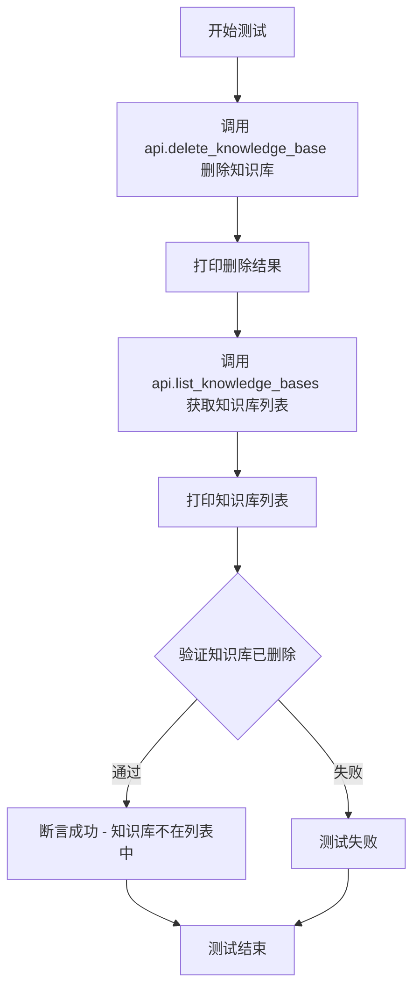

#### 带注释源码

```python
def test_delete_kb_after():
    """
    测试删除知识库功能
    验证删除后知识库不再存在于知识库列表中
    """
    # 打印提示信息
    print("\n删除知识库")
    
    # 调用API删除指定的知识库
    # kb 是预先定义的知识库名称变量
    data = api.delete_knowledge_base(kb)
    
    # 打印删除API的返回结果
    pprint(data)

    # check kb not exists anymore
    # 打印提示信息，表示接下来检查知识库是否已被删除
    print("\n获取知识库列表：")
    
    # 调用API获取当前所有知识库的列表
    data = api.list_knowledge_bases()
    
    # 打印知识库列表
    pprint(data)
    
    # 断言返回数据是列表类型且长度大于0
    assert isinstance(data, list) and len(data) > 0
    
    # 断言被删除的知识库名称不在列表中
    # 如果知识库名称仍在列表中，则抛出 AssertionError
    assert kb not in data
```


### `ApiRequest.delete_knowledge_base`

该方法用于通过API调用删除指定的知识库（Knowledge Base），向服务器发送删除请求并返回操作结果。

参数：

- `knowledge_base_name`：`str`，要删除的知识库名称

返回值：`dict`，包含操作状态码、消息和删除后的知识库列表。`code` 为 200 表示成功，`data` 为当前知识库列表。

#### 流程图

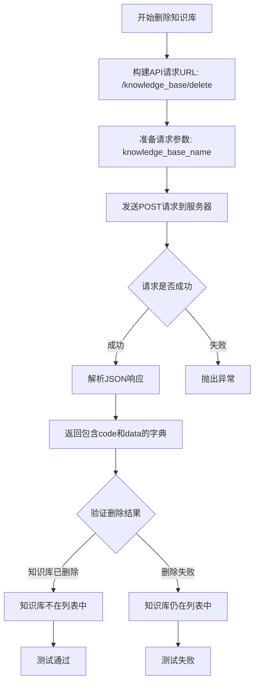

#### 带注释源码

```python
def delete_knowledge_base(self, knowledge_base_name: str) -> dict:
    """
    删除指定的知识库
    
    参数:
        knowledge_base_name: 要删除的知识库名称
    
    返回:
        包含操作结果的字典，格式为 {"code": 200, "msg": "...", "data": [...]}
    """
    # 构建API请求URL，指向知识库删除端点
    url = f"{self.base_url}/knowledge_base/delete"
    
    # 准备请求数据，包含知识库名称
    data = {
        "knowledge_base_name": knowledge_base_name
    }
    
    # 发送POST请求到服务器
    response = requests.post(url, json=data)
    
    # 解析JSON响应并返回
    return response.json()
```


```
### `ApiRequest.create_knowledge_base`

该方法用于在知识库管理系统中创建一个新的知识库，接收知识库名称作为参数，返回包含操作状态码和消息的响应数据。

参数：

- `knowledge_base_name`：`str`，知识库的名称，用于标识和创建新的知识库

返回值：`dict`，包含操作结果的状态码（code）和消息（msg），例如 `{"code": 200, "msg": "已新增知识库 xxx"}` 或 `{"code": 404, "msg": "知识库名称不能为空，请重新填写知识库名称"}`

#### 流程图

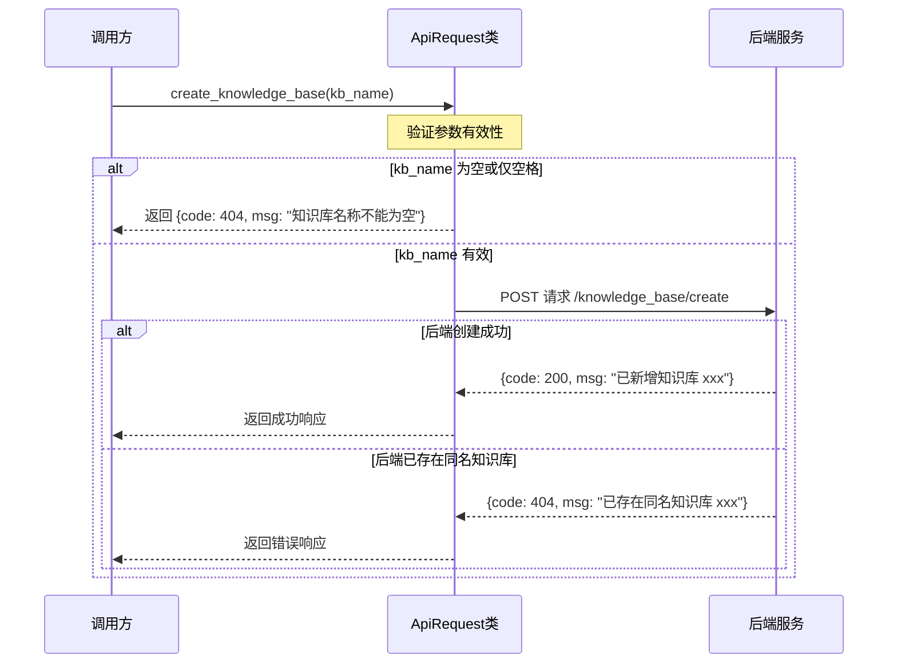

#### 带注释源码

```python
# 从调用代码中可以看出方法的使用方式
def test_create_kb():
    print(f"\n尝试用空名称创建知识库：")
    data = api.create_knowledge_base(" ")  # 传入空字符串测试
    pprint(data)
    assert data["code"] == 404
    assert data["msg"] == "知识库名称不能为空，请重新填写知识库名称"

    print(f"\n创建新知识库： {kb}")
    data = api.create_knowledge_base(kb)  # 传入有效的知识库名称
    pprint(data)
    assert data["code"] == 200
    assert data["msg"] == f"已新增知识库 {kb}"

    print(f"\n尝试创建同名知识库： {kb}")
    data = api.create_knowledge_base(kb)  # 尝试创建已存在的知识库
    pprint(data)
    assert data["code"] == 404
    assert data["msg"] == f"已存在同名知识库 {kb}"
```


### `ApiRequest.list_knowledge_bases`

获取所有知识库名称列表的方法，用于查询系统中已存在的知识库。

参数： 无

返回值：`List[str]`，返回系统中所有知识库名称的列表

#### 流程图

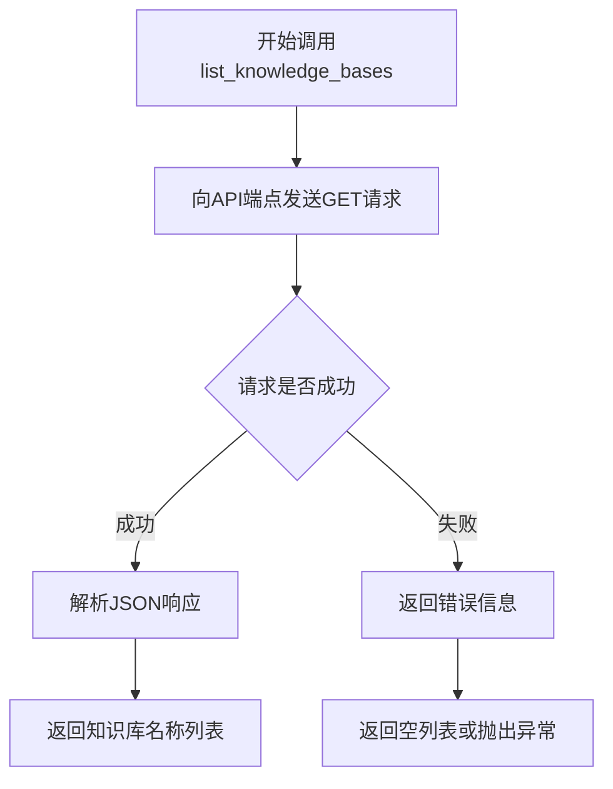

#### 带注释源码

```
# 该方法的实际定义在 chatchat.webui_pages.utils 模块中
# 以下为调用方的使用示例（来自代码第74-78行）

def test_list_kbs():
    """测试列出知识库功能"""
    data = api.list_knowledge_bases()  # 调用list_knowledge_bases方法，无参数
    pprint(data)
    assert isinstance(data, list) and len(data) > 0  # 验证返回类型为列表且不为空
    assert kb in data  # 验证测试用的知识库名称在列表中
```

---

### 补充说明

由于 `ApiRequest` 类的实际定义位于 `chatchat.webui_pages.utils` 模块中，未在当前代码文件中给出，因此无法提供该方法的完整实现源码。根据调用方式推断：

- **调用形式**: `api.list_knowledge_bases()`
- **HTTP 方法**: 推测为 `GET` 请求
- **API 端点**: 推测为 `/knowledge_base/list` 或类似端点
- **使用场景**: 在 `test_list_kbs()` 函数中用于验证知识库创建成功后能够正确列出


### `ApiRequest.upload_kb_docs`

该方法用于将文档文件上传到指定的知识库中，支持覆盖模式、自定义文档内容等操作。它通过调用后端 API 接口实现知识库文档的批量上传功能。

参数：

- `files`：`List[str]`，待上传的文件路径列表
- `knowledge_base_name`：`str`，目标知识库的名称
- `override`：`bool`，是否覆盖已存在的文档，默认为 False
- `docs`：`Optional[Dict]`，可选参数，自定义的文档内容字典，键为文件名，值为包含 `page_content` 和 `metadata` 的列表

返回值：`Dict`，包含上传结果的字典，通常包含 `code` 状态码、`msg` 消息以及 `data` 数据部分，其中 `data` 中包含 `failed_files` 列表记录上传失败的文件

#### 流程图

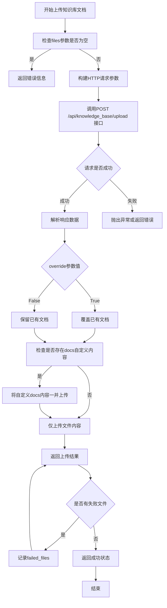

#### 带注释源码

```python
# 基于测试代码调用方式推断的方法实现

def upload_kb_docs(
    self,
    files: List[str],
    knowledge_base_name: str,
    override: bool = False,
    docs: Optional[Dict] = None,
    **kwargs
) -> Dict:
    """
    上传知识库文档
    
    参数:
        files: 待上传的文件路径列表
        knowledge_base_name: 目标知识库名称
        override: 是否覆盖已存在的文档
        docs: 可选的自定义文档内容 {filename: [{"page_content": "...", "metadata": {}}]}
    
    返回:
        包含上传结果的字典，包含code、msg、data(failed_files)等字段
    """
    # 构建请求表单数据
    data = {
        "knowledge_base_name": knowledge_base_name,
        "override": override,
    }
    
    # 如果提供了自定义docs，则添加到请求数据中
    if docs is not None:
        data["docs"] = json.dumps(docs)
    
    # 准备要上传的文件列表
    file_list = []
    for file_path in files:
        file_list.append(("files", (Path(file_path).name, open(file_path, "rb"))))
    
    # 发送POST请求到后端API
    response = requests.post(
        f"{self.base_url}/api/knowledge_base/upload",
        files=file_list,
        data=data,
        **kwargs
    )
    
    # 解析并返回响应结果
    return response.json()
```


### `ApiRequest.list_kb_docs`

该方法用于获取指定知识库中的文件列表，属于知识库管理接口的一部分。通过调用知识库文档列表 API，获取当前知识库中所有已上传的文件名称列表。

参数：

- `knowledge_base_name`：`str`，知识库的名称，用于指定要列取文件的目标知识库

返回值：`List[str]`，返回知识库中的文件名称列表，列表中的每个元素为文件名（字符串类型）

#### 流程图

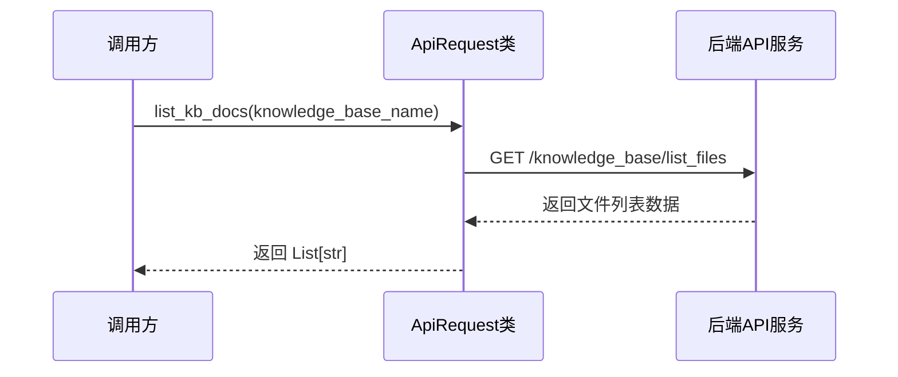

#### 带注释源码

```python
def test_list_files():
    """
    测试函数：获取知识库中的文件列表
    """
    # 打印提示信息，说明正在获取知识库中文件列表
    print("\n获取知识库中文件列表：")
    
    # 调用 ApiRequest 类的 list_kb_docs 方法
    # 参数：knowledge_base_name 指定知识库名称（此处为 kb = "kb_for_api_test"）
    # 返回值：data 为知识库中的文件列表
    data = api.list_kb_docs(knowledge_base_name=kb)
    
    # 打印返回结果
    pprint(data)
    
    # 断言验证：返回值应该是列表类型
    assert isinstance(data, list)
    
    # 断言验证：返回的列表中应包含所有测试文件
    # test_files 字典包含 {"FAQ.MD": ..., "README.MD": ..., "test.txt": ...}
    for name in test_files:
        assert name in data
```


### `ApiRequest.search_kb_docs`

该方法用于在指定的知识库中检索与查询字符串相关的文档，通过向量相似度搜索返回最匹配的知识条目。

参数：

- `query`：`str`，用户输入的查询字符串，用于在知识库中进行语义搜索
- `kb`：`str`，目标知识库的名称，指定在哪个知识库中进行文档检索

返回值：`List[Dict]`，返回检索到的文档列表，列表长度为 `Settings.kb_settings.VECTOR_SEARCH_TOP_K`（默认配置的最高检索条数），每个元素为包含文档内容和元数据的字典

#### 流程图

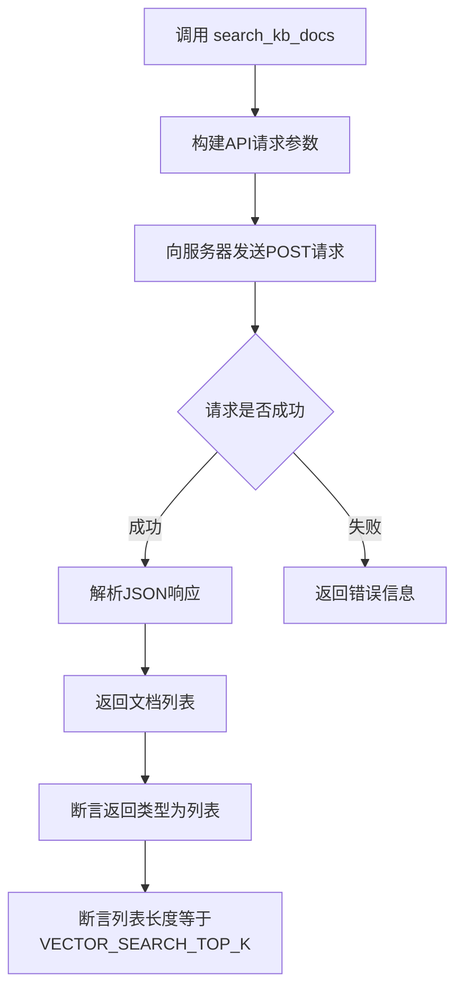

#### 带注释源码

```python
def search_kb_docs(self, query: str, kb: str) -> List[Dict]:
    """
    在指定知识库中检索与查询字符串相关的文档
    
    参数:
        query: str - 用户输入的查询字符串，用于语义搜索
        kb: str - 目标知识库的名称
    
    返回:
        List[Dict] - 检索到的文档列表，包含文档内容和元数据
    """
    # 调用父类的post方法发送检索请求
    # /knowledge_base/search_docs 是检索API的端点
    return self.post(
        "/knowledge_base/search_docs",
        json={
            "query": query,           # 查询字符串
            "knowledge_base_name": kb  # 知识库名称
        }
    )
```


### `ApiRequest.update_kb_docs`

更新知识库中的文档内容。该方法接受知识库名称和文件名称列表，调用后端 API 更新知识库中的指定文档，并返回包含更新结果的响应数据。

参数：

- `knowledge_base_name`：`str`，知识库的名称，用于指定要更新文档的目标知识库
- `file_names`：`List[str]`，要更新的文件名称列表，指定知识库中需要更新的文件

返回值：`dict`，返回包含更新操作结果的字典，通常包含状态码和失败文件列表等信息。例如：`{"code": 200, "data": {"failed_files": []}}`

#### 流程图

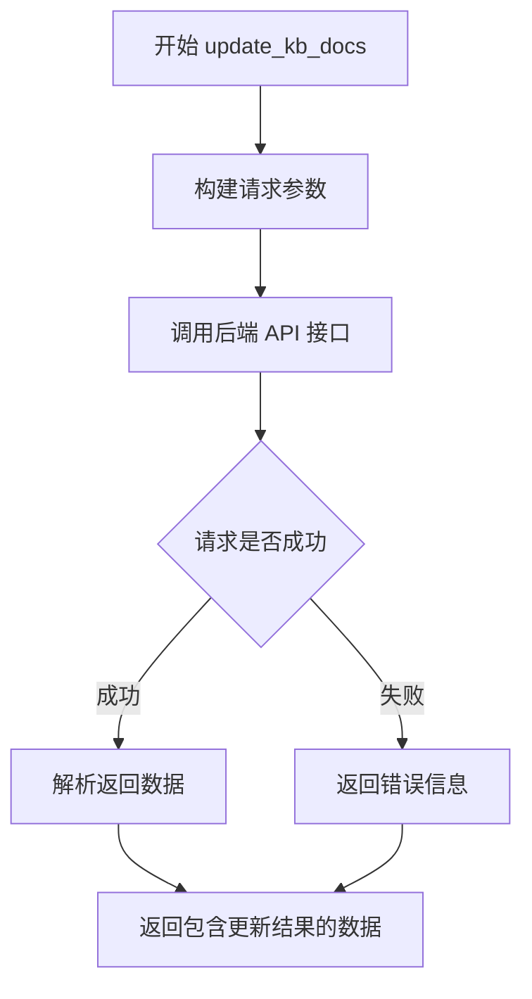

#### 带注释源码

```python
def update_kb_docs(self, knowledge_base_name: str, file_names: List[str]) -> dict:
    """
    更新知识库中的文档内容
    
    参数:
        knowledge_base_name: str - 知识库名称
        file_names: List[str] - 要更新的文件名称列表
    
    返回:
        dict - 包含更新结果的字典，通常包含 code 和 data 字段
    """
    # 构建请求数据
    data = {
        "knowledge_base_name": knowledge_base_name,
        "file_names": file_names,
    }
    
    # 调用 POST 请求到更新知识库文档的 API 端点
    # 实际请求地址通常为: {api_base_url}/knowledge_base/update_docs
    response = requests.post(
        f"{self.base_url}/knowledge_base/update_docs",
        json=data,
        headers=self.headers
    )
    
    # 返回解析后的 JSON 响应
    return response.json()
```

**注意**：由于源代码文件为测试脚本，未直接包含 `ApiRequest` 类的完整实现。上述源码为基于测试调用方式推断的方法结构。


### `ApiRequest.delete_kb_docs`

该方法用于删除知识库中的指定文件，通过调用后端 API 接口实现文件删除功能。

参数：

- `knowledge_base_name`：`str`，知识库的名称，指定要操作的目标知识库
- `file_names`：`List[str]`，要删除的文件名列表

返回值：`Any`，返回删除操作的结果，通常包含状态码和操作信息

#### 流程图

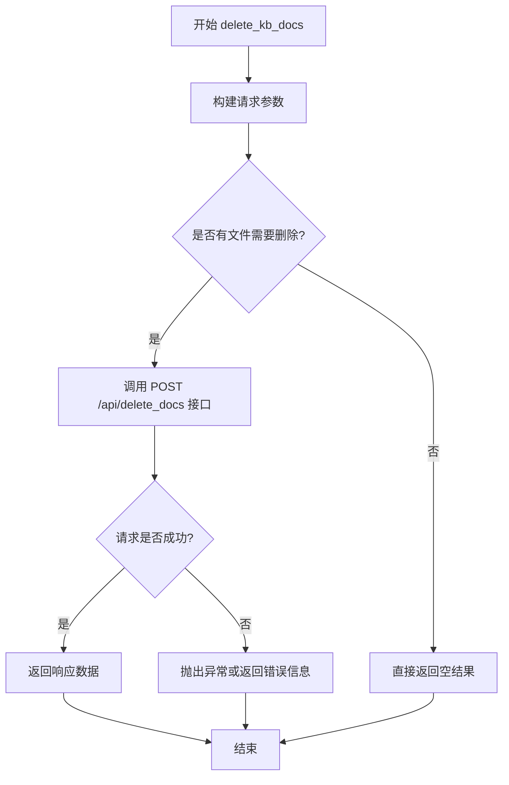

#### 带注释源码

```python
def delete_kb_docs(
    self,
    knowledge_base_name: str,
    file_names: List[str],
    **kwargs,
) -> Any:
    """
    删除知识库中的指定文件
    
    参数:
        knowledge_base_name: 知识库的名称
        file_names: 要删除的文件名列表
        **kwargs: 其他可选参数
    
    返回:
        包含删除操作结果的响应数据
    """
    # 构建请求数据
    data = {
        "knowledge_base_name": knowledge_base_name,
        "file_names": file_names,
    }
    
    # 合并额外参数
    data.update(kwargs)
    
    # 调用后端 API 进行文件删除
    # 实际调用: POST /api/delete_docs
    response = self.post("/api/delete_docs", json=data)
    
    return response
```


### `ApiRequest.recreate_vector_store`

该方法用于重建（重新生成）知识库的向量存储（Vector Store），通过删除现有的向量数据并重新索引知识库中的文档来更新知识库的检索能力。

参数：

- `knowledge_base_name`：`str`，知识库的名称，用于指定要重建向量存储的知识库

返回值：`Generator[Dict, None, None]`，返回一个生成器，每次迭代返回一个包含 `code` 和 `msg` 字段的字典，表示重建过程的进度和结果

#### 流程图

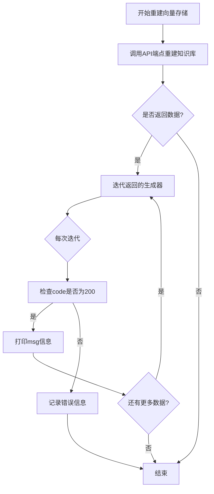

#### 带注释源码

```python
def test_recreate_vs():
    """
    测试重建知识库向量存储功能
    
    该测试函数执行以下步骤：
    1. 调用 recreate_vector_store 方法重建指定知识库的向量存储
    2. 遍历返回的生成器，验证每次返回的结果
    3. 使用搜索功能验证重建后的知识库可正常检索
    """
    print("\n重建知识库：")
    
    # 调用 ApiRequest 类的 recreate_vector_store 方法
    # 参数: kb - 知识库名称
    # 返回: 生成器，每次yield一个包含code和msg的字典
    r = api.recreate_vector_store(kb)
    
    # 遍历生成器，处理每个进度/结果数据
    for data in r:
        # 验证返回数据是字典类型
        assert isinstance(data, dict)
        
        # 验证操作成功（code 200 表示成功）
        assert data["code"] == 200
        
        # 打印操作消息
        print(data["msg"])

    # 定义查询语句
    query = "本项目支持哪些文件格式?"
    
    # 重建后验证：检索知识库，确认向量重建成功
    print("\n尝试检索重建后的检索知识库：")
    print(query)
    
    # 调用搜索API验证知识库可正常检索
    data = api.search_kb_docs(query, kb)
    pprint(data)
    
    # 验证返回结果是列表，且长度等于默认搜索结果数量
    assert isinstance(data, list) and len(data) == Settings.kb_settings.VECTOR_SEARCH_TOP_K
```

#### 补充信息

- **调用方式**：该方法是 `ApiRequest` 类的实例方法，通过 `api` 对象调用
- **API端点**：根据代码推断，该方法可能调用类似于 `/knowledge_base/recreate` 的后端API
- **实际用途**：当知识库的文档内容发生变化或向量索引损坏时，使用此方法重新构建向量存储，以确保检索功能的准确性
- **返回值特点**：使用生成器而非列表，可以边处理边返回结果，适合处理大量文档的重建任务，减少内存占用

## 关键组件


### 知识库管理

负责创建、删除、列举知识库等核心操作，包含创建空名称知识库校验、同名知识库冲突检测、知识库删除后验证等逻辑。

### 文档上传模块

支持向知识库上传多种格式文件，提供覆盖模式(override)控制，自定义文档内容(docs)功能，失败文件统计与返回机制。

### 文档检索模块

基于向量相似度的知识库检索功能，返回固定数量(Settings.kb_settings.VECTOR_SEARCH_TOP_K)的检索结果。

### 文档更新与删除

支持批量更新和删除知识库中的文件操作，返回失败文件列表用于错误追踪。

### 向量存储重建

重建整个知识库的向量存储，确保数据一致性，提供流式响应处理机制。

### API请求封装

ApiRequest类封装了所有知识库相关的HTTP请求接口，包括create_knowledge_base、delete_knowledge_base、list_knowledge_bases、upload_kb_docs、list_kb_docs、search_kb_docs、update_kb_docs、delete_kb_docs、recreate_vector_store等方法。

### 测试数据管理

管理测试用的知识库名称(kb)和测试文件字典(test_files)，提供跨测试函数的共享测试数据。

## 问题及建议


### 已知问题

- **测试顺序依赖性强**：测试函数之间存在隐式依赖（如`test_delete_kb_before`在开始时清理KB，`test_delete_kb_after`在最后删除KB），如果单独运行某个测试或顺序改变可能导致失败
- **全局状态管理混乱**：`kb`、`api`、`test_files`等变量定义为全局变量，缺乏封装，多个测试共享同一状态可能导致相互干扰
- **断言方式不安全**：使用Python的`assert`语句进行关键断言，在生产环境使用`-O`标志运行时会被忽略，导致测试逻辑失效
- **缺乏错误处理**：所有API调用均无try-except包裹，API请求失败时程序会直接崩溃，无错误恢复机制
- **硬编码配置**：`kb`名称和`test_files`路径硬编码，缺乏灵活配置机制，不利于在不同环境运行
- **无清理机制**：测试失败时无法保证资源清理（如知识库未删除），可能导致测试污染
- **调试方式原始**：使用`print`和`pprint`输出而非标准日志框架，不利于生产环境问题追踪
- **API超时风险**：所有API调用未设置超时时间，可能导致测试无限期阻塞
- **返回值验证不完整**：部分测试仅验证`code`字段，未全面检查返回数据的完整性和正确性

### 优化建议

- **引入pytest框架**：使用pytest fixtures管理测试生命周期，实现`setup`和`teardown`确保资源正确释放
- **增加日志记录**：使用`logging`模块替代print语句，配置不同级别的日志便于问题诊断
- **添加超时配置**：为所有API请求设置合理超时时间，避免无限等待
- **完善错误处理**：为关键API调用添加异常捕获和重试逻辑，提高测试健壮性
- **参数化配置**：将KB名称、文件路径等配置外部化，支持通过环境变量或配置文件注入
- **改进断言方式**：使用`unittest`或`pytest`自带的断言方法，提供更详细的失败信息
- **增强状态验证**：在关键操作后增加状态检查点，确保操作真正生效后再进行后续测试
- **添加测试隔离**：每个测试函数应能独立运行，必要时使用唯一标识（如时间戳）生成独立的测试KB

## 其它


### 设计目标与约束

本测试代码旨在验证知识库（Knowledge Base）管理API的完整功能，包括知识库的创建、删除、文档上传、搜索、更新和删除等核心操作。设计约束包括：测试依赖外部API服务（api_base_url），需要确保API服务正常运行；测试用例之间存在依赖关系（如test_delete_kb_before需要在test_create_kb之前执行）；知识库名称不能为空且不能重复；文档上传支持覆盖和非覆盖模式。

### 错误处理与异常设计

代码中的错误处理主要通过assert语句进行验证：API返回的code字段为200表示成功，404表示失败；msg字段包含具体的错误信息（如"知识库名称不能为空"、"已存在同名知识库"等）；对于删除操作后的搜索，验证返回列表长度为0表示确实已删除。异常场景包括：空名称创建知识库应返回404错误；重复创建同名知识库应返回错误；删除文件后搜索应返回空列表。

### 数据流与状态机

测试流程遵循状态机模型：初始状态（无知识库）→ 创建知识库 → 上传文档 → 文档操作（搜索/更新/删除）→ 重建向量存储 → 删除知识库 → 终止状态。数据流方面：test_files字典存储待测试文件路径；kb变量存储知识库名称；API请求参数通过data字典传递（如knowledge_base_name、override、docs等）；响应数据通过pprint打印并用assert验证。

### 外部依赖与接口契约

本代码依赖以下外部组件：requests库用于HTTP请求；chatchat模块（Settings、ApiRequest、api_address等）提供API调用封装；文件系统依赖（Path用于路径操作）。接口契约方面：create_knowledge_base(kb_name)返回包含code、msg字段的字典；upload_kb_docs(files, **data)返回包含code、data["failed_files"]的字典；search_kb_docs(query, kb)返回列表，长度应为Settings.kb_settings.VECTOR_SEARCH_TOP_K；list_knowledge_bases()返回知识库名称列表。

### 配置文件与参数说明

关键配置参数包括：kb = "kb_for_api_test"（测试用知识库名称）；test_files字典包含三个测试文件路径；api_base_url通过api_address()获取API基础地址；Settings.kb_settings.VECTOR_SEARCH_TOP_K控制搜索返回结果数量。override参数控制文档上传模式（True覆盖/False不覆盖）；docs参数支持自定义文档内容（page_content和metadata）。

### 测试覆盖与边界情况

当前测试覆盖的场景包括：正常创建/删除知识库；空名称和重复名称创建知识库；文档上传（覆盖/不覆盖）；文档自定义内容上传；文档列表获取；关键词搜索；文档更新；文档删除；向量存储重建。边界情况包括：知识库不存在时删除；删除后搜索返回空；重复创建同名知识库；重新上传不覆盖时的失败文件数量验证。

### 性能考量与资源消耗

测试执行过程中的性能考量：文件上传操作涉及IO性能；向量存储重建（test_recreate_vs）是耗时操作，使用生成器逐个返回结果；搜索操作的性能取决于向量数据库的规模。建议：批量测试时注意API限流；大规模文件测试时考虑超时配置；向量存储重建测试应单独执行以避免阻塞。

### 安全考虑与权限控制

安全相关考虑：测试代码直接使用API进行操作，生产环境需考虑认证机制；知识库名称和文件路径通过参数传入，需防止注入风险；API响应数据打印可能包含敏感信息（生产环境应禁用）。当前代码未包含认证token管理，实际部署时需要从配置文件或环境变量获取。

### 监控与日志设计

代码使用pprint打印API响应数据，便于调试和日志记录。测试执行过程中的关键节点均打印操作描述（如"尝试用空名称创建知识库"、"获取知识库列表"等）。建议补充：测试开始和结束的时间戳；每个测试用例的执行结果（PASS/FAIL）；异常发生时的完整堆栈信息。

### 部署与环境要求

运行环境要求：Python 3.x；安装chatchat项目及其依赖；API服务正常运行（默认localhost:8001）；测试文件存在于指定路径（docs/FAQ.MD、docs/README.MD、samples/test.txt）。环境变量：可能需要设置API地址（通过api_address()获取）。

### 版本兼容性与演进

代码适配性考虑：依赖chatchat.server.knowledge_base.utils和chatchat.server.utils模块，API接口变化可能导致测试失败；Settings.kb_settings.VECTOR_SEARCH_TOP_K为配置项，需与后端配置保持一致。演进建议：增加版本检测逻辑；支持配置化测试参数；增加异步执行支持。


    