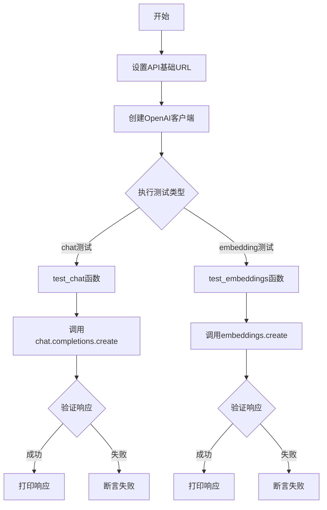
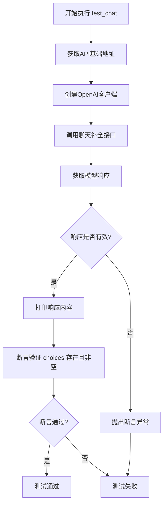
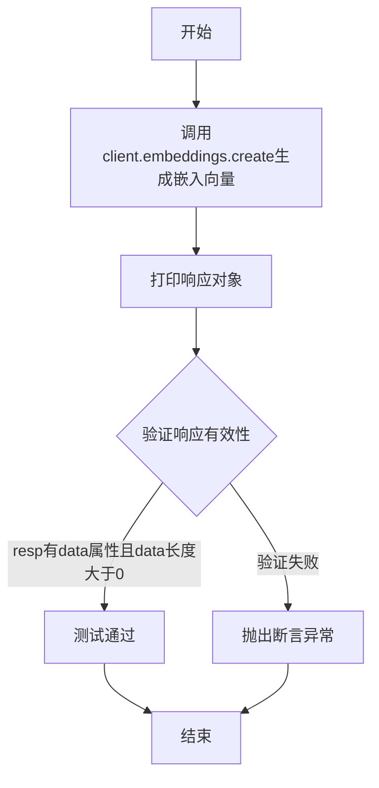

# `Langchain-Chatchat\libs\chatchat-server\tests\api\test_openai_wrap.py` 详细设计文档

这是一个用于测试ChatChat服务器API的客户端测试脚本，通过OpenAI兼容的接口测试聊天补全和嵌入向量生成功能。

## 整体流程



## 类结构

```
无类定义（脚本文件）
```

## 全局变量及字段


### `api_base_url`
    
API基础URL地址

类型：`str`
    


### `client`
    
OpenAI兼容的客户端实例

类型：`openai.Client`
    


    

## 全局函数及方法


### `test_chat`

测试聊天补全功能，验证系统能够通过聊天API获取模型响应，并确保响应包含有效的回答内容。

参数：

- 该函数无参数

返回值：`None`，该函数为测试函数，主要通过断言验证响应有效性，不返回具体数据

#### 流程图



#### 带注释源码

```python
def test_chat():
    """
    测试聊天补全功能
    
    该函数向默认的LLM模型发送一条简单的中文问题"你是谁"，
    并验证API能够返回有效的聊天响应。
    """
    # 使用已配置的客户端发送聊天请求
    # 消息内容为"你是谁"，模型使用系统默认LLM
    resp = client.chat.completions.create(
        messages=[{"role": "user", "content": "你是谁"}],  # 用户消息，角色为user
        model=get_default_llm(),  # 获取系统默认的LLM模型名称
    )
    print(resp)  # 打印完整的响应对象，用于调试和日志记录
    
    # 断言验证响应结构完整性
    # 必须包含choices字段且至少有一个选择项
    assert hasattr(resp, "choices") and len(resp.choices) > 0
```


### `test_embeddings`

测试嵌入向量生成功能，调用OpenAI兼容的嵌入API生成"你是谁"文本的嵌入向量，并验证返回数据中包含有效的嵌入向量。

参数：

- 无

返回值：`openai.Embedding` 对象，包含嵌入向量数据（包含 `data` 字段，存储嵌入向量结果）

#### 流程图



#### 带注释源码

```python
def test_embeddings():
    """
    测试嵌入向量生成功能
    
    该函数调用OpenAI兼容的嵌入API，使用默认的嵌入模型
    对输入文本"你是谁"生成嵌入向量，并验证返回结果的有效性。
    """
    # 调用嵌入API创建嵌入向量
    # input: 输入文本 "你是谁"
    # model: 从配置获取的默认嵌入模型
    resp = client.embeddings.create(input="你是谁", model=get_default_embedding())
    
    # 打印响应对象，用于调试和查看返回结构
    print(resp)
    
    # 断言验证返回的响应对象
    # 1. 必须具有 data 属性（包含嵌入向量数据）
    # 2. data 列表长度必须大于0（至少有一条嵌入向量结果）
    assert hasattr(resp, "data") and len(resp.data) > 0
```

## 关键组件


### OpenAI客户端配置

使用openai库创建客户端，配置API密钥为"EMPTY"（表示无需认证），base_url指向本地部署的ChatChat服务API地址。

### 聊天功能测试

test_chat函数通过客户端调用本地LLM服务，发送用户问题"你是谁"，验证返回响应中包含choices字段且不为空。

### 嵌入功能测试

test_embeddings函数通过客户端调用本地嵌入模型服务，验证返回响应中包含data字段且不为空。

### API地址获取模块

从chatchat.server.utils模块导入api_address、get_default_llm和get_default_embedding函数，用于获取服务API地址和默认模型配置。


## 问题及建议


### 已知问题

-   **硬编码 API 密钥**：`api_key="EMPTY"` 采用硬编码方式，在不同部署环境下可能导致认证失败
-   **缺乏异常处理**：网络请求、API 调用等关键操作未使用 try-except 包裹，测试失败时无法提供友好错误信息
-   **sys.path 手动修改**：使用 `sys.path.append` 方式添加路径不是最佳实践，容易产生导入冲突
-   **导入顺序不规范**：标准库、第三方库、本地包的导入未按 PEP8 规范分组
-   **调试方式不专业**：使用 `print` 语句而非 `logging` 模块进行日志记录
-   **断言信息缺失**：`assert` 语句没有附带自定义错误信息，排查问题时不直观
-   **配置分散**：API 地址、模型名称等配置硬编码在代码中，缺乏集中配置管理
-   **无测试隔离机制**：测试用例之间可能存在状态依赖，缺乏独立的测试设置和清理逻辑

### 优化建议

-   将 API 密钥、base_url 等配置抽取至环境变量或配置文件，使用 `os.getenv()` 或配置文件管理
-   为所有 API 调用添加异常捕获逻辑，区分处理网络错误、API 错误等不同异常类型
-   改用 `logging` 模块替代 `print`，配置合理的日志级别和格式
-   为 assert 添加自定义错误信息，如 `assert resp.choices, "响应中无 choices 字段"`
-   按标准排序导入：`标准库 > 第三方库 > 本地包`，并添加空行分组
-   考虑将客户端实例化封装为单例模式或依赖注入，提高可测试性
-   补充超时参数设置：`requests` 和 `openai` 调用建议添加 `timeout` 防止请求挂起
-   将测试用例参数化，支持通过参数灵活传入模型名称和测试文本

## 其它


### 设计目标与约束

本测试模块的核心目标是验证ChatChat系统的LLM对话功能和Embedding功能是否正常工作。设计约束包括：1) 依赖本地部署的API服务，必须确保api_address()返回有效的本地地址；2) 使用OPENAI兼容的客户端库，要求服务端实现OpenAI API协议；3) 测试模型依赖get_default_llm()和get_default_embedding()的返回值。

### 错误处理与异常设计

当前代码错误处理较为基础，仅使用assert进行基本断言。建议增加：1) 网络连接异常捕获（requests异常、openai.APIConnectionError）；2) API响应错误处理（openai.APIError、rate limit处理）；3) 超时配置（建议设置request_timeout参数）；4) 详细的错误日志记录，包含请求参数和响应状态码。

### 数据流与状态机

测试数据流如下：test_chat()流程-客户端初始化→构建消息列表→调用chat.completions.create→接收响应→断言验证→打印结果。test_embeddings()流程-客户端初始化→构建输入文本→调用embeddings.create→接收响应→断言验证→打印结果。状态机转换：IDLE→REQUESTING→RESPONDED/ERROR→COMPLETED。

### 外部依赖与接口契约

核心依赖包括：1) openai>=1.0.0 Python包；2) requests库（间接依赖）；3) chatchat.server.utils模块（需提供api_address、get_default_llm、get_default_embedding三个函数）。接口契约要求：api_address()返回形如http://localhost:8000的URL字符串；get_default_llm()返回有效的模型名称字符串；get_default_embedding()返回有效的embedding模型名称字符串。

### 安全性考虑

当前代码存在安全风险：1) api_key设置为"EMPTY"，生产环境需使用真实密钥；2) 缺少API密钥管理机制，建议使用环境变量或密钥管理系统；3) 未验证SSL证书（生产环境应启用verify参数）；4) 缺乏请求限流机制，可能触发服务端压力。

### 性能要求与约束

性能约束：1) API响应超时建议设置为30秒；2) 并发测试能力需评估（当前仅支持串行执行）；3) 大文本输入的截断策略需明确；4) 批量请求的支持情况需测试。

### 配置管理

当前硬编码配置项：api_base_url、api_key。建议配置化：1) API基础URL应从环境变量或配置文件读取；2) 模型名称应支持配置覆盖；3) 超时参数、retry次数等应纳入配置管理；4) 建议使用pydantic或dataclass定义配置类。

### 测试策略

当前仅包含基础功能测试。补充建议：1) 单元测试：mock外部依赖进行孤立测试；2) 集成测试：添加pytest参数化测试多模型；3) 边界测试：空字符串、超长文本、特殊字符；4) 异常测试：网络超时、服务不可用、非法模型名称；5) 性能测试：响应时间基准测试。

### 监控与日志

当前仅使用print输出。建议完善：1) 结构化日志（使用logging模块）；2) 请求/响应元数据记录（耗时、模型、token数）；3) 指标采集（QPS、错误率、延迟分布）；4) 告警机制（连续失败阈值）。

    