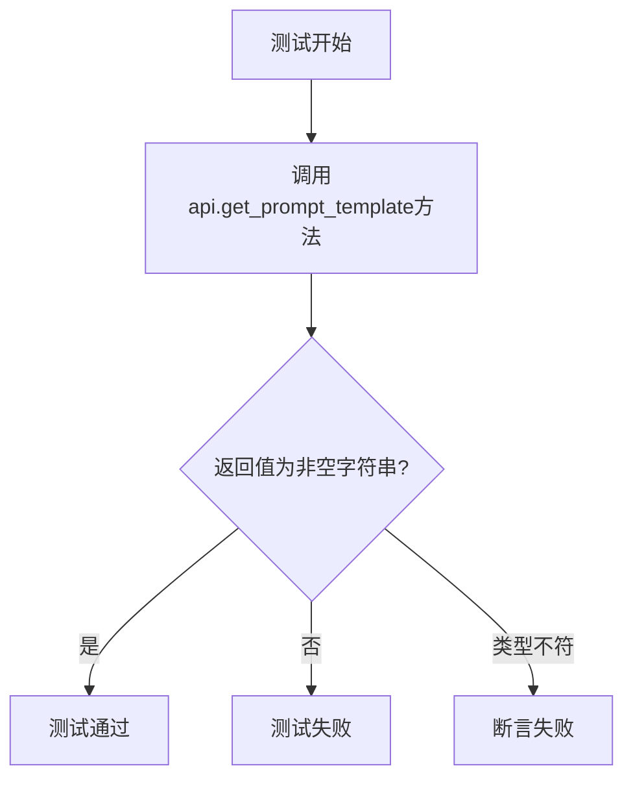
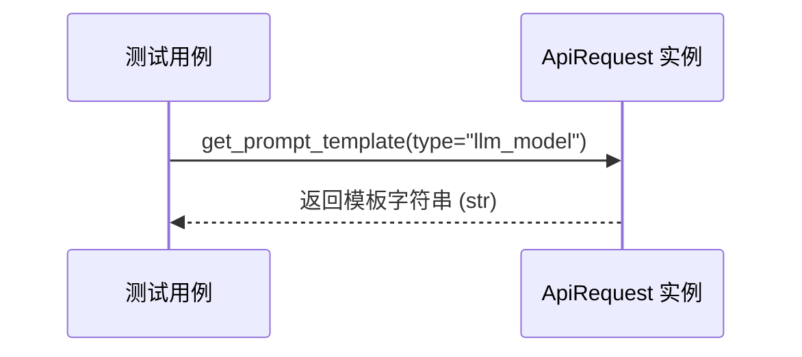

# `Langchain-Chatchat\libs\chatchat-server\tests\api\test_server_state_api.py` 详细设计文档

这是一个pytest测试文件，用于测试ApiRequest类的get_prompt_template方法，获取指定类型的prompt模板，并验证返回结果为非空字符串。

## 整体流程



## 类结构

```
测试模块
└── test_get_prompt_template (测试函数)
依赖模块
└── chatchat.webui_pages.utils.ApiRequest
```

## 全局变量及字段


### `root_path`
    
项目根目录的路径对象，通过获取当前文件父级目录的父级目录得到

类型：`Path`
    


### `api`
    
ApiRequest类的实例，用于发送API请求以获取提示词模板

类型：`ApiRequest`
    


### `chatchat.webui_pages.utils.ApiRequest.ApiRequest`
    
用于发送API请求的工具类，包含get_prompt_template等方法

类型：`class`
    
    

## 全局函数及方法


### `test_get_prompt_template`

这是一个pytest测试函数，用于验证 `ApiRequest` 类的 `get_prompt_template` 方法能否正确返回指定类型的提示词模板，并通过断言确保返回值是非空字符串。

参数：

- `type`：`str`，要获取的提示词模板类型（如 "llm_model"）

返回值：`None`，该函数无显式返回值，主要通过 pytest 断言验证功能正确性

#### 流程图

```mermaid
flowchart TD
    A[开始测试] --> B[打印提示信息: prompt template for: {type}]
    B --> C[调用 api.get_prompt_template 获取模板]
    C --> D[打印返回的模板内容]
    D --> E{断言: template 是字符串?}
    E -->|是| F{断言: template 长度 > 0?}
    E -->|否| G[测试失败]
    F -->|是| H[测试通过]
    F -->|否| G
    H --> I[结束测试]
```

#### 带注释源码

```python
import sys
from pathlib import Path

# 获取项目根路径并添加到 sys.path
root_path = Path(__file__).parent.parent.parent
sys.path.append(str(root_path))

from pprint import pprint
from typing import List

import pytest

# 导入 ApiRequest 工具类
from chatchat.webui_pages.utils import ApiRequest

# 创建 ApiRequest 实例（全局测试对象）
api = ApiRequest()


# 使用 pytest 参数化装饰器，定义测试类型列表
@pytest.mark.parametrize("type", ["llm_model"])
def test_get_prompt_template(type):
    """
    测试 get_prompt_template 方法是否返回有效的提示词模板
    
    测试步骤：
    1. 调用 ApiRequest.get_prompt_template 获取指定类型的模板
    2. 验证返回值是字符串类型
    3. 验证返回值长度大于 0（确保非空）
    """
    # 打印测试的模板类型
    print(f"prompt template for: {type}")
    
    # 调用被测试的方法获取提示词模板
    template = api.get_prompt_template(type=type)

    # 打印返回的模板内容（用于调试）
    print(template)
    
    # 断言1：确保返回的是字符串类型
    assert isinstance(template, str)
    
    # 断言2：确保返回的字符串非空
    assert len(template) > 0
```


### `ApiRequest.get_prompt_template`

该方法用于根据传入的 `type` 参数获取对应的提示词（Prompt）模板字符串。

参数：
- `type`：`str`，提示词模板的类型标识。在测试用例中，其值为 "llm_model"。

返回值：`str`，返回指定类型的提示词模板内容。根据测试用例中的断言 `assert isinstance(template, str)`，返回值被限定为字符串类型。

#### 流程图



#### 带注释源码

```python
def get_prompt_template(self, type: str) -> str:
    """
    获取指定类型的提示词模板。

    参数:
        type (str): 提示词模板的类型标识。

    返回值:
        str: 对应的提示词模板内容字符串。
    """
    # 注意：当前代码片段中未包含 ApiRequest 类的具体实现。
    # 根据测试调用可知，该方法应接收一个字符串类型的 type，
    # 并返回一个字符串类型的模板内容。
    pass
```


## 关键组件


### ApiRequest 类

负责与后端API通信的请求类，封装了HTTP请求方法，用于获取各种配置和模板信息。

### get_prompt_template 方法

根据指定的类型参数获取对应的提示词模板，返回模板字符串。

### test_get_prompt_template 测试函数

使用pytest参数化装饰器测试get_prompt_template方法，验证返回值为非空字符串。

### ApiRequest 实例化

创建ApiRequest类实例用于调用API方法。

### pytest.mark.parametrize 装饰器

实现测试参数化，支持传入不同的type参数进行测试。


## 问题及建议


### 已知问题

-   **使用 Python 关键字作为参数名**：`type` 是 Python 的内置关键字，覆盖它不是好的编程实践，容易引起混淆
-   **测试参数硬编码且覆盖不足**：`@pytest.mark.parametrize("type", ["llm_model"])` 仅包含一个测试用例，测试覆盖范围有限，未涵盖边界情况和异常场景
-   **断言过于简单**：仅验证了返回值是字符串且非空，未验证返回内容的格式正确性或包含必要的结构化信息
-   **冗余导入**：`pprint` 和 `List` 被导入但未在代码中使用，增加了代码冗余度
-   **模块级全局状态**：`api = ApiRequest()` 在模块级别实例化，可能导致测试间的隐式耦合，违反了测试隔离原则
-   **使用 print 而非标准测试日志**：在测试中使用 `print` 输出而非 pytest 提供的标准机制（如 caplog 或 pytest 的报告系统）
-   **路径计算脆弱**：`root_path = Path(__file__).parent.parent.parent` 硬编码了目录层级，假设文件位于特定深度，位置改变时会导致 ImportError
-   **缺乏错误处理测试**：未测试 API 调用失败或返回异常数据时的行为，测试健壮性不足

### 优化建议

-   **重命名参数**：将参数名 `type` 改为更具体的名称，如 `template_type` 或 `prompt_type`，避免覆盖内置关键字
-   **扩展测试用例**：增加更多参数化测试用例，覆盖正常情况、边界情况（如空字符串、无效类型）和异常情况
-   **增强断言**：根据 API 规范增加更具体的断言，验证返回模板的格式、关键占位符或结构
-   **清理未使用的导入**：移除未使用的 `pprint` 和 `List` 导入
-   **改进测试结构**：将 `ApiRequest` 实例化移至 fixture 中，使用 `@pytest.fixture` 确保测试隔离和资源清理
-   **使用标准日志**：用 `pytest caplog` 或 `logging` 替代 `print` 语句，或直接依赖 pytest 的断言失败信息
-   **优化导入路径**：使用相对导入或配置 `PYTHONPATH`，避免动态路径计算的脆弱性
-   **添加异常测试**：使用 `pytest.raises` 测试 API 异常情况，提升测试覆盖率

## 其它


### 设计目标与约束

本测试代码的核心目标是验证ApiRequest类的get_prompt_template方法能够正确返回指定类型（如"llm_model"）的prompt模板字符串。约束条件包括：必须使用pytest框架、采用参数化测试方式、返回值必须是非空字符串。

### 错误处理与异常设计

当前测试代码未显式处理异常。在测试执行过程中可能出现的异常包括：ImportError（模块导入失败）、ConnectionError（API服务不可用）、TimeoutError（请求超时）、AssertionError（断言失败）。建议添加try-except块捕获预期异常并提供清晰的错误信息。

### 数据流与状态机

数据流为：测试参数(type) → ApiRequest.get_prompt_template() → HTTP请求 → API响应 → 字符串验证。无状态机设计，属于简单的请求-响应模式。

### 外部依赖与接口契约

外部依赖包括：pytest框架、chatchat.webui_pages.utils.ApiRequest类、Path和sys标准库。接口契约方面：get_prompt_template接受type参数（字符串类型），返回字符串类型，调用前需确保API服务已启动。

### 测试覆盖范围

当前仅覆盖"llm_model"类型的prompt模板获取。建议扩展测试覆盖：测试多种type参数、测试无效type参数的处理、测试空字符串返回值、测试超长模板、测试特殊字符处理。

### 性能考虑

当前测试无性能基准。建议添加：API响应时间断言（建议<2秒）、批量测试执行时间监控。

### 安全性考虑

代码中未发现明显安全风险。建议：确保测试环境与生产环境隔离、敏感配置不硬编码、API密钥等凭证通过环境变量管理。

### 日志与监控

当前仅使用print输出结果。建议添加：pytest日志级别配置、测试执行时间记录、失败时的详细上下文信息输出。

### 部署与环境配置

依赖环境：Python 3.x、pytest、chatchat项目代码。配置要求：root_path自动计算、sys.path动态添加以支持跨目录导入。

### 版本兼容性

需考虑Python版本兼容性（建议3.8+）、pytest版本兼容性、chatchat项目API的版本稳定性。

### 代码可维护性建议

当前代码结构简洁。建议改进：提取魔法字符串到常量定义、增加测试文档字符串、使用fixture管理api实例、添加setup/teardown方法处理资源初始化和清理。


    