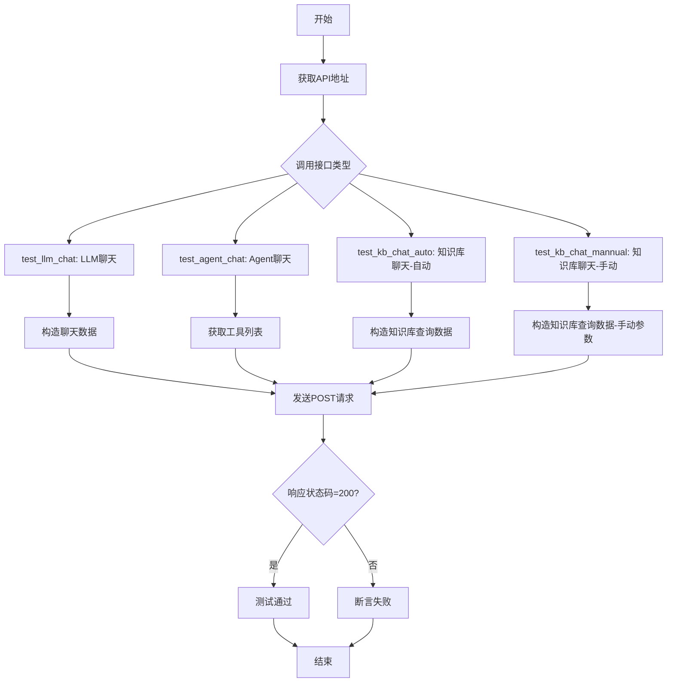
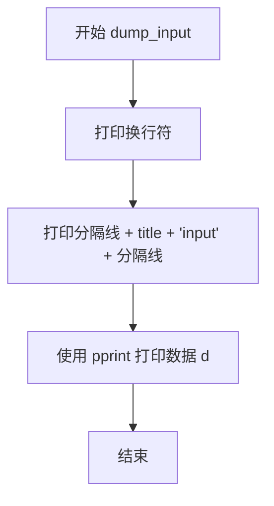
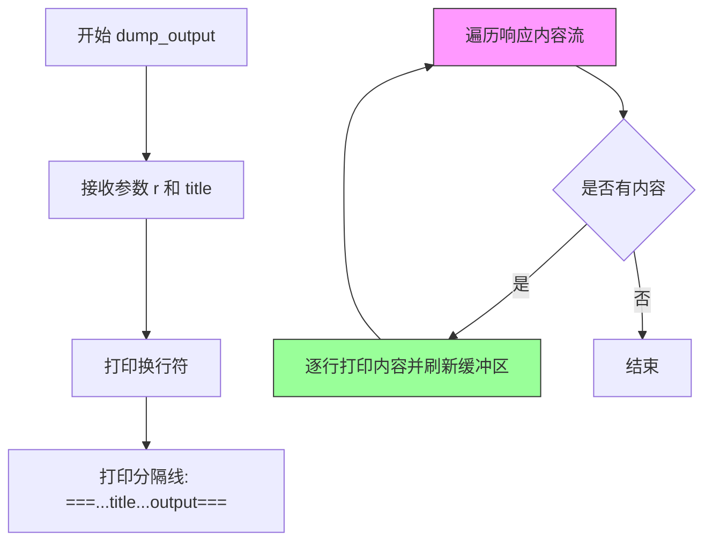
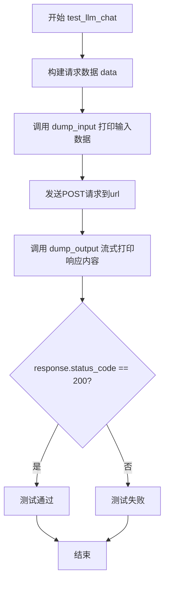
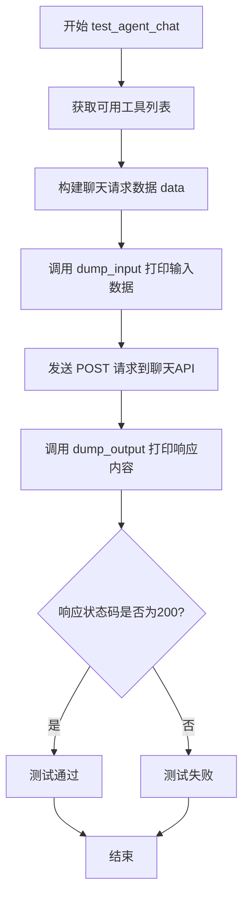
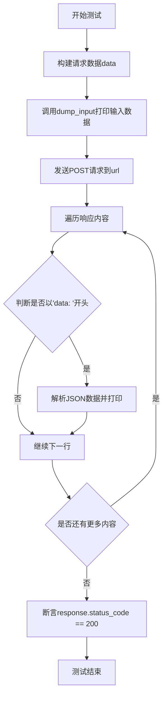
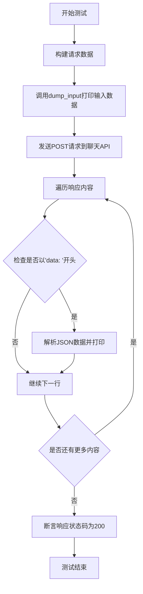

# `Langchain-Chatchat\libs\chatchat-server\tests\api\test_stream_chat_api.py` 详细设计文档

该文件是一个API测试脚本，用于测试chatchat项目的多个聊天接口功能，包括LLM聊天、Agent聊天（带工具调用）和知识库聊天，通过HTTP请求与后端API交互并验证响应状态。

## 整体流程



## 类结构

```
无类定义（脚本文件）
```

## 全局变量及字段


### `api_base_url`
    
API基础地址，从api_address()函数获取

类型：`str`
    


### `api`
    
API端点路径，值为'/chat/chat/completions'

类型：`str`
    


### `url`
    
完整API URL，由api_base_url和api拼接而成

类型：`str`
    


### `headers`
    
HTTP请求头，包含accept和Content-Type字段

类型：`dict`
    


    

## 全局函数及方法


### `dump_input`

打印输入数据的格式化输出，用于在调试或测试时可视化请求数据。

参数：

- `d`：`Any`，需要打印的数据对象，通常为字典类型
- `title`：`str`，打印输出的标题标识，用于区分不同的数据块

返回值：`None`，该函数无返回值，仅执行打印操作

#### 流程图



#### 带注释源码

```python
def dump_input(d, title):
    """
    打印输入数据的格式化输出
    
    参数:
        d: 需要打印的数据对象，通常为字典类型
        title: 打印输出的标题标识
    """
    print("\n")  # 打印空行，提供视觉分隔
    # 打印格式: ========...title input========...  (共30个=号)
    print("=" * 30 + title + "  input " + "=" * 30)
    # 使用 pprint 格式化打印数据，pprint 会自动处理缩进和换行
    pprint(d)
```


### `dump_output`

打印流式响应的内容，将HTTP响应流式输出到控制台，用于调试和查看流式API调用结果。

参数：

- `r`：`requests.Response`，HTTP响应对象，包含服务器返回的流式数据
- `title`：`str`，打印输出的标题，用于标识输出内容

返回值：`None`，无返回值，仅执行打印操作

#### 流程图



#### 带注释源码

```python
def dump_output(r, title):
    """
    打印流式响应的内容到控制台
    
    参数:
        r: requests.Response对象,HTTP响应流
        title: str,输出的标题标识
    """
    # 打印空行
    print("\n")
    # 打印分隔线,格式: ===...title...output===
    print("=" * 30 + title + "  output" + "=" * 30)
    # 遍历响应内容流,iter_content用于流式读取响应
    # decode_unicode=True自动将字节转换为Unicode字符串
    for line in r.iter_content(None, decode_unicode=True):
        # 打印每一行,end=""避免自动换行
        # flush=True立即刷新缓冲区,确保实时输出
        print(line, end="", flush=True)
```


### `test_llm_chat`

测试LLM基础聊天功能，该函数构建一个包含多轮对话的消息数组，发送POST请求到聊天补全API接口，以流式方式获取响应，并验证HTTP状态码为200。

参数：

- 该函数无参数

返回值：`None`，无显式返回值，但通过assert语句验证响应状态码为200

#### 流程图



#### 带注释源码

```python
def test_llm_chat():
    """
    测试LLM基础聊天功能
    发送包含多轮对话的消息到聊天API，验证流式响应正常工作
    """
    # 构建聊天请求数据
    data = {
        "model": "qwen1.5-chat",  # 使用的模型名称
        "messages": [  # 对话消息数组，包含多轮对话
            {"role": "user", "content": "你好"},  # 用户第一条消息：问候
            {"role": "assistant", "content": "你好，我是人工智能大模型"},  # 助手回复
            {"role": "user", "content": "请用100字左右的文字介绍自己"},  # 用户请求介绍
        ],
        "stream": True,  # 开启流式响应
        "temperature": 0.7,  # 控制生成随机性，值越高越随机
    }

    # 打印输入数据，便于调试和日志记录
    dump_input(data, "LLM Chat")
    
    # 发送POST请求到聊天API，stream=True启用流式响应
    response = requests.post(url, headers=headers, json=data, stream=True)
    
    # 流式打印API响应内容
    dump_output(response, "LLM Chat")
    
    # 断言响应状态码为200，表示请求成功
    assert response.status_code == 200
```


### `test_agent_chat`

测试Agent工具调用聊天功能，该函数通过发送包含工具(tools)的聊天请求到API端点，验证Agent模式下的工具调用能力是否正常工作。

参数：

- 无

返回值：`None`，无返回值，该函数仅执行测试逻辑并通过assert进行状态码断言

#### 流程图



#### 带注释源码

```python
def test_agent_chat():
    """
    测试Agent工具调用聊天功能
    
    该函数执行以下步骤：
    1. 从API获取当前可用的工具列表
    2. 构建包含工具的聊天请求数据
    3. 发送流式聊天请求到API
    4. 打印请求输入和响应输出
    5. 断言响应状态码为200
    """
    # 从API获取可用的工具列表
    tools = list(requests.get(f"{api_base_url}/tools").json()["data"])
    
    # 构建聊天请求数据，包含模型、消息、工具等参数
    data = {
        "model": "qwen1.5-chat",  # 使用的模型名称
        "messages": [  # 聊天消息历史
            {"role": "user", "content": "37+48=？"},  # 用户消息（简单的数学问题）
        ],
        "stream": True,  # 启用流式响应
        "temperature": 0.7,  # 温度参数，控制随机性
        "tools": tools,  # 可用工具列表，供Agent选择使用
    }

    # 打印输入数据，用于调试和日志记录
    dump_input(data, "Agent Chat")
    
    # 发送POST请求到聊天API端点，使用流式模式
    response = requests.post(url, headers=headers, json=data, stream=True)
    
    # 打印响应内容，用于验证API返回结果
    dump_output(response, "Agent Chat")
    
    # 断言响应状态码为200，表示请求成功
    assert response.status_code == 200
```


### `test_kb_chat_auto`

该函数用于测试知识库的自动检索聊天功能，通过发送包含用户问题的请求到聊天API，并指定自动检索工具（search_local_knowledgebase），验证系统能否正确调用知识库检索并返回响应。

参数：
- 该函数无显式参数（使用闭包中的全局变量和函数）

返回值：`None`，通过断言验证HTTP响应状态码为200表示测试通过

#### 流程图



#### 带注释源码

```python
def test_kb_chat_auto():
    """
    测试知识库的自动检索聊天功能
    
    该函数构造一个包含用户问题的请求，指定使用知识库检索工具
    (search_local_knowledgebase)，然后发送到聊天API并验证响应。
    """
    # 构建请求数据字典
    data = {
        "messages": [
            {"role": "user", "content": "如何提问以获得高质量答案"},  # 用户消息内容
        ],
        "model": "qwen1.5-chat",  # 使用的模型名称
        "tool_choice": "search_local_knowledgebase",  # 工具选择：自动检索知识库
        "stream": True,  # 启用流式响应
    }
    
    # 打印输入请求数据，用于调试和日志记录
    dump_input(data, "KB Chat (auto parameters)")
    
    # 发送POST请求到聊天API端点，使用流式模式
    response = requests.post(url, headers=headers, json=data, stream=True)
    
    # 打印分隔线和输出标题
    print("\n")
    print("=" * 30 + "KB Chat (auto parameters)" + "  output" + "=" * 30)
    
    # 遍历流式响应内容，逐行处理
    for line in response.iter_content(None, decode_unicode=True):
        # 检查是否是以'data: '开头的响应行（SSE格式）
        if line.startswith("data: "):
            # 提取JSON数据（去掉"data: "前缀）并解析
            data = json.loads(line[6:])
            # 打印解析后的数据
            pprint(data)
    
    # 断言响应状态码为200，表示请求成功
    assert response.status_code == 200
```


### `test_kb_chat_mannual`

测试知识库手动参数聊天功能，该函数通过发送POST请求调用聊天API，测试使用手动指定的知识库参数（database和query）进行知识库检索的能力。

参数： 无

返回值：`None`，该函数没有返回值，主要通过断言验证HTTP响应状态码为200

#### 流程图



#### 带注释源码

```python
def test_kb_chat_mannual():
    """
    测试知识库手动参数聊天功能
    
    该函数通过API调用测试知识库检索功能，使用手动指定的参数
    （database: "samples", query: "如何提问以获得高质量答案"）
    """
    
    # 构建请求数据
    data = {
        # 消息列表，包含用户问题
        "messages": [
            {"role": "user", "content": "如何提问以获得高质量答案"},
        ],
        # 使用的模型
        "model": "qwen1.5-chat",
        # 工具选择：使用本地知识库搜索
        "tool_choice": "search_local_knowledgebase",
        # 额外的请求体，包含工具输入参数
        "extra_body": {
            "tool_input": {
                "database": "samples",  # 知识库数据库名称
                "query": "如何提问以获得高质量答案"  # 检索查询内容
            }
        },
        # 启用流式响应
        "stream": True,
    }
    
    # 打印输入数据，便于调试
    dump_input(data, "KB Chat (auto parameters)")
    
    # 发送POST请求到聊天API端点
    response = requests.post(url, headers=headers, json=data, stream=True)
    
    # 打印分隔线和标题
    print("\n")
    print("=" * 30 + "KB Chat (auto parameters)" + "  output" + "=" * 30)
    
    # 遍历响应内容（流式读取）
    for line in response.iter_content(None, decode_unicode=True):
        # 检查是否是以"data: "开头的SSE数据行
        if line.startswith("data: "):
            # 解析JSON数据（跳过"data: "前缀）
            data = json.loads(line[6:])
            # 打印解析后的数据
            pprint(data)
    
    # 断言响应状态码为200，表示请求成功
    assert response.status_code == 200
```

## 关键组件


### 一段话描述

这是一个用于测试ChatChat聊天系统的自动化测试脚本，通过HTTP请求模拟LLM对话、Agent工具调用和知识库检索等场景，验证后端API的正确性和流式响应功能。

### 文件的整体运行流程

1. **初始化阶段**：导入所需库，设置系统路径，获取API基础地址并构建完整URL
2. **配置阶段**：定义HTTP请求头，初始化辅助打印函数
3. **测试执行阶段**：按顺序执行四个测试函数，每个函数构造特定的请求数据并发送POST请求
4. **验证阶段**：检查响应状态码是否为200，验证API返回的流式数据格式

### 全局变量和全局函数详细信息

#### 全局变量

**api_base_url**
- 类型：str
- 描述：API服务的基础地址，从api_address()函数获取

**api**
- 类型：str
- 描述：聊天Completions接口的API路径

**url**
- 类型：str
- 描述：完整的API请求URL，由api_base_url和api拼接而成

**headers**
- 类型：dict
- 描述：HTTP请求头，包含accept和Content-Type两个字段，值为application/json

#### 全局函数

**dump_input(d, title)**
- 参数：
  - d: 任意类型，要打印的数据
  - title: str，标题描述
- 返回值：None
- 描述：格式化打印输入数据，用于调试和日志记录

**dump_output(r, title)**
- 参数：
  - r: requests.Response，HTTP响应对象
  - title: str，标题描述
- 返回值：None
- 描述：流式打印响应内容，支持Unicode解码，用于查看流式输出的完整数据

**test_llm_chat()**
- 参数：无
- 返回值：None
- 描述：测试基础的LLM聊天功能，发送包含对话历史的messages数组，验证模型能否正确生成回复

**test_agent_chat()**
- 参数：无
- 返回值：None
- 描述：测试Agent工具调用功能，首先获取可用工具列表，然后发送包含tools参数的请求，验证模型能否正确使用工具

**test_kb_chat_auto()**
- 参数：无
- 返回值：None
- 描述：测试知识库自动检索功能，使用tool_choice指定search_local_knowledgebase工具，自动处理检索参数

**test_kb_chat_mannual()**
- 参数：无
- 返回值：None
- 描述：测试知识库手动参数设置功能，通过extra_body传递详细的tool_input参数，包括database和query字段

### 关键组件信息

**API通信模块**
- 负责与ChatChat后端服务建立HTTP连接，发送POST请求并接收流式响应数据

**测试数据构造器**
- 根据不同测试场景构造相应的请求payload，包含model、messages、stream、temperature等参数

**流式响应处理器**
- 使用requests库的stream=True参数和iter_content方法，实现服务端推送数据的实时接收和处理

**工具动态获取模块**
- 在Agent测试中通过GET /tools接口动态获取可用工具列表，确保测试环境与实际环境同步

### 潜在的技术债务或优化空间

1. **缺少异常处理机制**：所有测试函数没有try-except包装，网络异常会导致测试直接失败，缺乏友好的错误提示

2. **测试框架使用不当**：未使用pytest等标准测试框架，无法利用参数化测试、fixture等高级特性，测试用例之间存在重复代码

3. **硬编码配置问题**：API地址、模型名称、提示词等硬编码在代码中，缺乏配置管理机制，环境变更需要修改源码

4. **断言信息不够详细**：仅检查status_code == 200，没有验证响应内容的正确性、流式数据的完整性等

5. **测试数据重复**：多个测试函数中重复定义相似的data结构，可以提取为公共的fixture或工厂函数

6. **缺少测试隔离**：测试之间可能存在依赖关系（如工具列表获取），没有测试数据准备和清理机制

7. **日志输出方式原始**：使用print进行日志记录，缺乏日志级别控制、输出格式标准化等问题

### 其它项目

#### 设计目标与约束
- 验证ChatChat后端API的正确性，特别是流式响应功能
- 支持多种聊天模式：纯LLM对话、Agent工具调用、知识库检索
- 确保HTTP 200状态码的返回，表示请求成功

#### 错误处理与异常设计
- 当前版本未实现错误处理，依赖requests库的默认异常抛出机制
- 建议添加网络超时处理、连接重试、响应体验证等健壮性设计

#### 数据流与状态机
- 测试数据流：构造JSON → 发送POST请求 → 接收流式响应 → 解析并打印数据
- 状态转换：初始化 → 请求发送 → 响应接收 → 断言验证 → 完成

#### 外部依赖与接口契约
- 依赖chatchat.server.utils.api_address()获取服务地址
- 依赖requests库进行HTTP通信
- 依赖GET /tools接口获取可用工具列表
- 依赖POST /chat/chat/completions接口进行聊天交互


## 问题及建议


### 已知问题

-   **硬编码配置分散**：模型名称（"qwen1.5-chat"）、API路径（"/chat/chat/completions"）、温度参数（0.7）等在多处重复硬编码，缺乏统一配置管理
-   **代码重复**：流式响应处理逻辑（`iter_content` + `decode_unicode`）在多个测试函数中重复实现；JSON解析"data: "前缀的逻辑重复出现
-   **拼写错误**：`test_kb_chat_mannual`函数名中"mannual"应为"manual"
-   **输出标题不一致**：自动参数和手动参数的KB测试都使用标题"KB Chat (auto parameters)"
-   **缺少错误处理**：API请求无超时设置、无异常捕获、对非200状态码无处理
-   **模块级副作用**：`api_address()`在模块导入时执行，若服务未启动会导致导入失败
-   **sys.path操作不规范**：使用`sys.path.append`进行路径修改，非最佳实践
-   **测试验证不足**：仅断言`status_code == 200`，未验证响应内容正确性
-   **资源未释放**：使用`stream=True`但未显式关闭response连接
-   **魔法字符串**：API端点、工具名称等缺乏常量定义

### 优化建议

-   将配置项（URL、模型、温度等）提取为模块级常量或配置文件
-   封装流式响应处理和JSON解析为通用辅助函数
-   修复拼写错误，统一输出标题命名
-   为requests调用添加timeout参数，添加try-except异常处理
-   使用pytest fixture管理API地址初始化，延迟到测试执行时获取
-   改用相对导入或proper包结构，避免sys.path操作
-   增加响应内容验证逻辑，如检查字段存在性、类型或关键内容
-   使用context manager（with语句）确保response资源释放
-   定义常量类或枚举管理魔法字符串，提升可维护性

## 其它


### 设计目标与约束

本测试文件旨在验证ChatChat聊天API的三个核心场景：基础LLM对话、Agent工具调用对话、以及知识库问答功能。约束条件包括：必须使用流式响应(stream=True)、温度参数固定为0.7、模型统一使用qwen1.5-chat、所有测试依赖本地服务运行。

### 错误处理与异常设计

当前代码仅通过assert response.status_code == 200进行基础的HTTP状态码断言，缺乏对业务错误码、响应体格式异常、网络超时等情况的处理。建议增加：1)try-except捕获requests异常；2)响应体JSON解析失败的异常处理；3)流式响应中断时的容错机制；4)断言失败时的详细错误信息输出。

### 数据流与状态机

测试数据流为：构造请求数据(json)→发送POST请求→接收流式响应→逐行解析输出。其中test_llm_chat和test_agent_chat使用dump_output直接打印原始流内容，test_kb_chat系列则额外进行JSON解析提取data字段。状态转换：初始→请求发送→响应接收→流式输出→断言验证→结束。

### 外部依赖与接口契约

核心依赖包括：requests库用于HTTP通信、json库用于响应解析、pprint用于格式化输出、pathlib.Path用于路径处理。外部接口契约：1)api_address()返回基础URL；2)/chat/chat/completions端点接收POST请求；3)/tools端点返回可用工具列表。所有接口均采用JSON格式，请求头需包含Content-Type:application/json。

### 性能考量与限制

当前测试使用stream=True流式传输，适合大响应场景但增加了调试复杂度。每个测试函数独立运行，未实现测试用例间的状态隔离。知识库测试依赖本地samples数据库存在，工具测试依赖/tools接口返回有效工具列表。

### 安全考量

代码中硬编码了Content-Type和accept请求头，但缺乏认证token或APIKey的传递机制。请求数据中未包含敏感信息过滤，响应数据直接打印可能泄露内部实现细节。建议增加环境变量管理敏感配置。

### 测试覆盖与边界条件

当前覆盖了正常流程的主要路径，但边界条件覆盖不足：空消息测试、超长content测试、无效model参数测试、tools参数格式错误测试、流式响应中断处理、并发请求场景等均未覆盖。

    