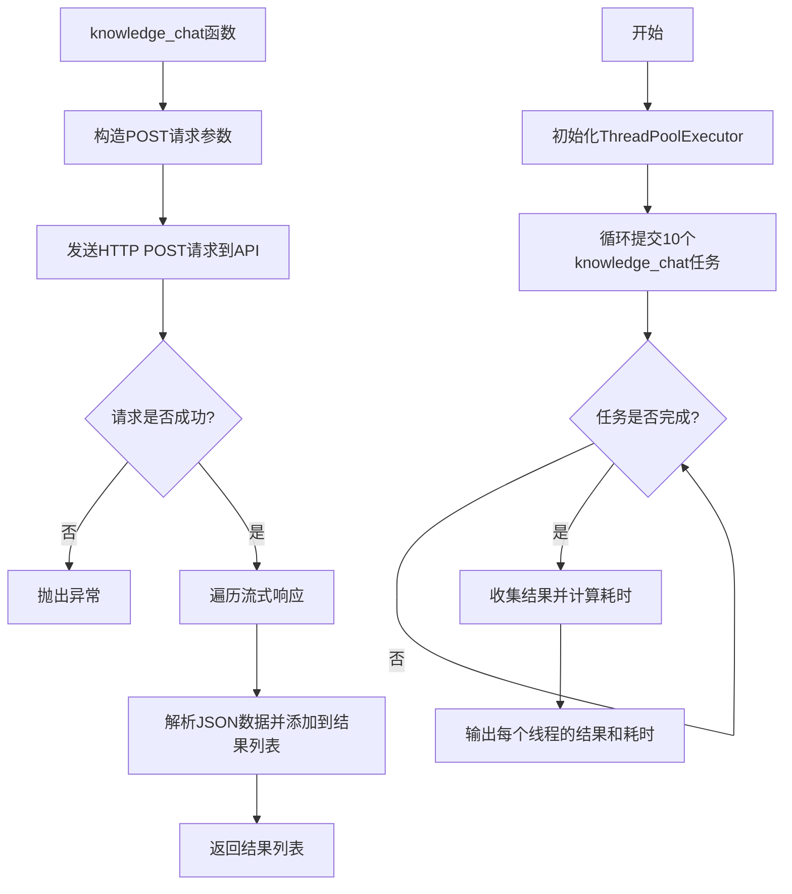
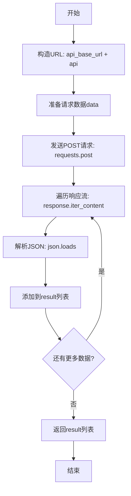
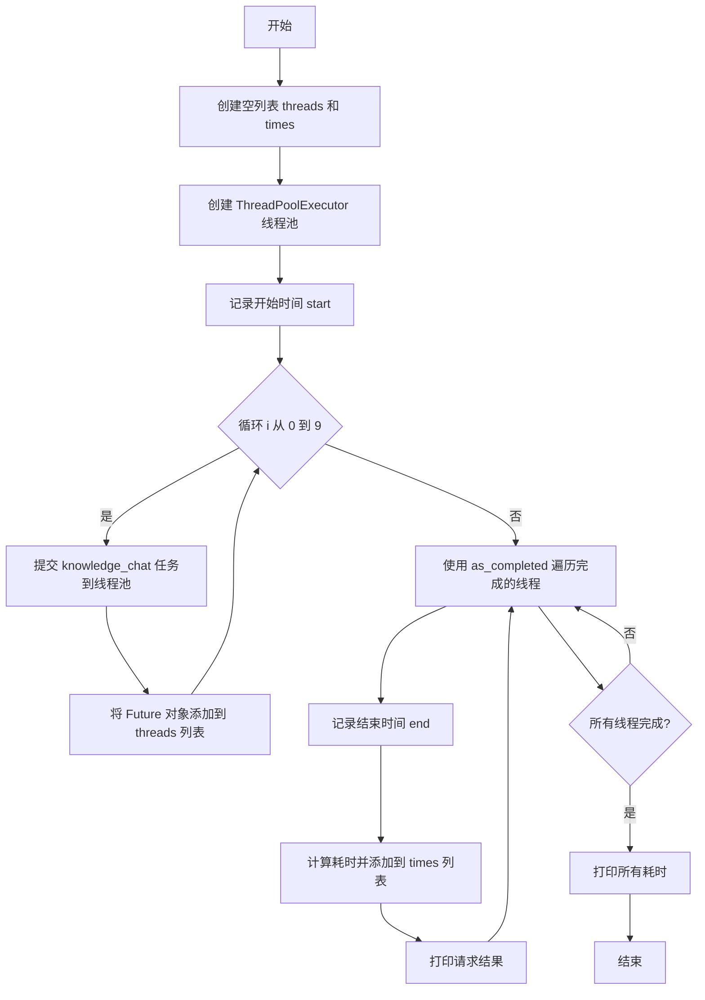

# `Langchain-Chatchat\libs\chatchat-server\tests\api\test_stream_chat_api_thread.py` 详细设计文档

这是一个用于测试知识库聊天API并发性能的工具脚本，通过HTTP POST请求与后端API交互，支持流式响应，并使用ThreadPoolExecutor实现多线程并发请求测试。

## 整体流程



## 类结构

```
无类层次结构（该文件仅包含全局函数）
```

## 全局变量及字段


### `api_base_url`
    
API基础URL地址

类型：`str`
    


### `headers`
    
HTTP请求头，包含accept和Content-Type

类型：`dict`
    


### `dump_input`
    
辅助函数，用于格式化打印输入数据

类型：`function`
    


### `dump_output`
    
辅助函数，用于格式化打印输出数据

类型：`function`
    


    

## 全局函数及方法


### `knowledge_chat`

发送知识库聊天请求的函数，向指定API端点发送POST请求，处理流式响应，并返回解析后的数据列表。

参数：

- `api`：`str`，知识库聊天的API端点路径，默认值为 `"/chat/knowledge_base_chat"`

返回值：`List[dict]`，从流式响应中解析出的数据列表

#### 流程图



#### 带注释源码

```python
def knowledge_chat(api="/chat/knowledge_base_chat"):
    """
    发送知识库聊天请求的函数
    
    参数:
        api: str, 知识库聊天的API端点路径，默认值为 "/chat/knowledge_base_chat"
    
    返回:
        List[dict]: 从流式响应中解析出的数据列表
    """
    # 1. 构造完整的API URL
    url = f"{api_base_url}{api}"
    
    # 2. 准备请求数据
    data = {
        "query": "如何提问以获得高质量答案",  # 用户查询内容
        "knowledge_base_name": "samples",    # 知识库名称
        "history": [                         # 对话历史
            {"role": "user", "content": "你好"},
            {"role": "assistant", "content": "你好，我是 ChatGLM"},
        ],
        "stream": True,                      # 启用流式响应
    }
    
    # 3. 初始化结果列表
    result = []
    
    # 4. 发送POST请求，设置stream=True以支持流式响应
    response = requests.post(url, headers=headers, json=data, stream=True)

    # 5. 遍历响应内容（流式读取）
    for line in response.iter_content(None, decode_unicode=True):
        # 6. 解析JSON数据（跳过前缀 "data: "）
        data = json.loads(line[6:])
        
        # 7. 将解析后的数据添加到结果列表
        result.append(data)

    # 8. 返回结果列表
    return result
```


### `test_thread`

使用线程池并发提交10个知识库聊天请求，收集所有响应结果并统计每个请求的耗时。

参数：无

返回值：`None`，该函数没有显式返回值，仅通过打印输出结果和耗时信息。

#### 流程图



#### 带注释源码

```python
def test_thread():
    """
    使用线程池并发测试知识库聊天API的函数
    """
    threads = []  # 存储提交到线程池的 Future 对象
    times = []    # 存储每个请求的耗时
    pool = ThreadPoolExecutor()  # 创建线程池，默认使用系统核心数作为最大线程数
    start = time.time()  # 记录整体开始时间
    
    # 循环提交10个并发请求
    for i in range(10):
        t = pool.submit(knowledge_chat)  # 提交知识库聊天任务到线程池
        threads.append(t)  # 保存 Future 对象以便后续获取结果
    
    # 遍历已完成的线程（as_completed 返回已完成的任务迭代器）
    for r in as_completed(threads):
        end = time.time()  # 记录单个任务完成时间
        times.append(end - start)  # 计算从整体开始到当前任务完成的耗时
        print("\nResult:\n")
        pprint(r.result())  # 打印任务返回的结果
    
    # 打印所有请求的耗时
    print("\nTime used:\n")
    for x in times:
        print(f"{x}")
```

## 关键组件


### HTTP请求与响应处理模块

负责构建和发送POST请求到知识库聊天API，并处理流式响应。包含headers定义、请求构建、JSON解析和流式内容迭代。

### 知识库聊天核心功能

通过`knowledge_chat`函数实现与知识库的对话功能，支持传入查询语句、知识库名称、历史对话记录，并接收流式响应。核心逻辑是构建请求数据、发送POST请求、解析流式JSON数据并汇总结果。

### 并发测试框架

通过`test_thread`函数实现多线程并发测试能力，使用ThreadPoolExecutor创建线程池，提交10个并发请求，通过as_completed等待所有任务完成并统计执行时间。

### 调试输出工具

提供`dump_input`和`dump_output`两个辅助函数，用于格式化打印请求输入数据和API响应内容，便于开发和调试过程中观察数据流。

### API地址配置

从`chatchat.server.utils`模块导入`api_address()`函数获取API基础URL，作为所有请求的URL前缀。


## 问题及建议


### 已知问题

-   **资源泄漏风险**：`ThreadPoolExecutor` 创建后未调用 `shutdown()` 方法，可能导致线程池资源未正确释放
-   **错误处理缺失**：`knowledge_chat` 函数无任何异常处理机制，API 调用失败、JSON 解析异常将直接导致程序崩溃
-   **计时逻辑错误**：`test_thread` 中 `times.append(end - start)` 记录的是任务完成时间而非任务实际执行时长，且所有任务共用同一个 `start` 时间戳，无法准确反映各任务的真实耗时
-   **HTTP 响应未正确关闭**：使用 `requests.post` 获取的响应对象未使用 context manager 或显式 close，可能导致连接泄漏
-   **硬编码配置**：URL、headers、请求数据等均直接写在代码中，缺乏配置管理，扩展性差
-   **全局状态依赖**：`api_base_url` 为模块级全局变量，函数行为依赖外部状态，测试困难
-   **类型提示缺失**：所有函数均无类型注解，不利于静态分析和 IDE 支持
-   **调试代码残留**：`dump_input`/`dump_output` 函数及 `pprint` 用于调试输出，生产环境中应移除或改为日志
-   **导入顺序不规范**：标准库、第三方库、本地模块导入未按 PEP8 规范分组
-   **并发控制缺失**：无最大并发数限制，可能导致瞬时请求过高压垮服务

### 优化建议

-   使用 `with` 语句或显式调用 `response.close()` 确保 HTTP 连接关闭
-   为 `ThreadPoolExecutor` 添加 `shutdown(wait=True)` 调用，建议使用 context manager：`with ThreadPoolExecutor() as pool:`
-   为 `knowledge_chat` 添加 try-except 块处理网络异常、超时和 JSON 解析错误
-   修正计时逻辑：应在每个任务提交时记录各自的开始时间，或使用 `time.perf_counter()` 提高精度
-   将配置信息抽离至配置文件或环境变量，使用 `os.getenv()` 或专用配置类
-   为关键函数添加类型注解和 docstring，提升代码可读性和可维护性
-   移除调试用的 `dump_*` 函数，改用标准日志模块
-   限制并发数量：`ThreadPoolExecutor(max_workers=10)` 或添加信号量控制
-   规范化导入顺序：标准库 → 第三方库 → 本地模块


## 其它


### 设计目标与约束

本代码的核心目标是测试知识库聊天API的并发性能和功能正确性。通过使用ThreadPoolExecutor并发发送多个请求，验证系统在高并发场景下的稳定性和响应能力。设计约束包括：仅支持Python 3.x环境，需安装requests库，依赖chatchat.server.utils模块的api_address函数获取API基础地址，且测试对象为本地部署的ChatGLM知识库聊天服务。

### 错误处理与异常设计

代码的错误处理机制较为薄弱，仅依赖requests库的默认异常抛出。主要潜在错误包括：网络连接失败（requests.exceptions.ConnectionError）、API请求超时（requests.exceptions.Timeout）、服务器返回非200状态码、JSON解析失败（json.JSONDecodeError）、以及线程池执行中的异常。当前未实现重试机制、错误日志记录、异常隔离（单个请求失败不影响其他请求）等容错设计。建议增加try-except捕获具体异常类型、设置超时时间、记录失败请求信息、优雅降级策略。

### 数据流与状态机

数据流从test_thread函数启动，经过ThreadPoolExecutor创建10个并发任务，每个任务调用knowledge_chat函数。knowledge_chat函数构造HTTP POST请求，发送JSON数据（包含query、knowledge_base_name、history、stream参数），接收流式响应并逐行解析JSON，最终汇总结果返回。状态机流程：初始化状态→请求发送中→接收响应→流式处理→解析数据→返回结果→汇总展示。无状态管理机制，每次请求相互独立。

### 外部依赖与接口契约

外部依赖包括：requests（HTTP客户端）、concurrent.futures（并发执行）、pprint（格式化打印）、json（JSON解析）、chatchat.server.utils（API地址获取）。接口契约方面，knowledge_chat函数依赖API端点"/chat/knowledge_base_chat"，请求需包含query（用户问题，字符串）、knowledge_base_name（知识库名称，字符串）、history（对话历史，列表）、stream（是否流式响应，布尔值）。API响应格式为SSE（Server-Sent Events）格式，每行以"data: "前缀开头，需手动解析。

### 性能考虑与优化建议

当前实现存在以下性能瓶颈：使用iter_content同步迭代响应流、未设置请求超时、未实现连接复用（未使用requests.Session）、线程池参数采用默认值（未调优）。优化建议：使用requests.Session()实现连接池复用、设置合理timeout参数、考虑异步IO（asyncio/aiohttp）替代线程池、添加请求完成统计（平均响应时间、成功率、QPS）、使用生成器模式处理大响应体。

### 安全性考虑

代码存在以下安全隐患：headers中hardcoded的Content-Type和accept、未验证API响应数据的合法性、未对用户输入进行消毒处理（如query参数）、敏感信息可能通过日志泄露（pprint输出）。建议增加输入验证、使用环境变量或配置文件管理API地址、实施响应数据校验、敏感信息脱敏日志。

### 配置管理与可维护性

当前代码采用硬编码配置（API路径、请求参数、线程数），缺乏灵活的配置管理机制。可维护性问题包括：magic number（30、10等）未提取为常量、函数职责不单一（dump_input/dump_output与业务逻辑混在一起）、无类型注解、缺乏单元测试。建议重构为：使用配置文件或环境变量、提取常量类、添加类型注解和文档字符串、分离工具函数和业务逻辑、增加配置类管理参数。


    