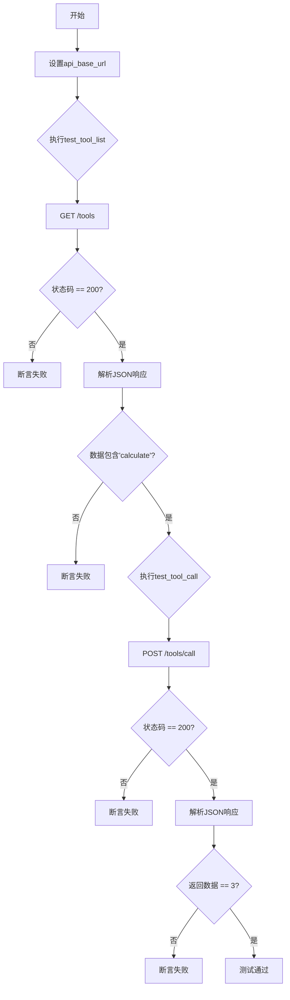
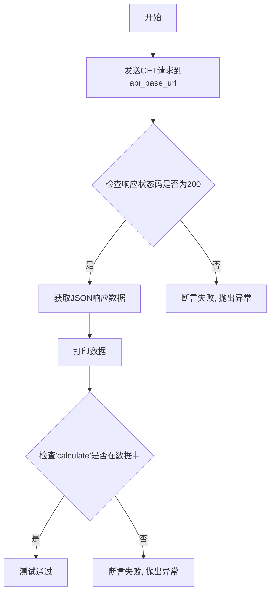
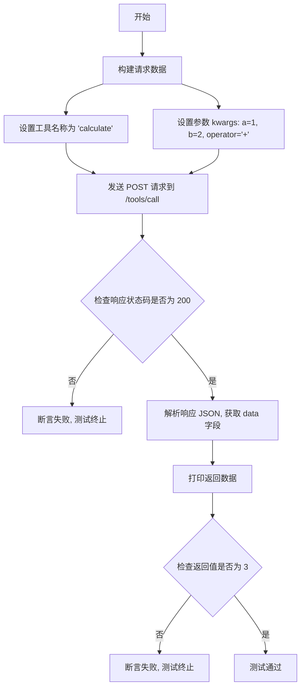
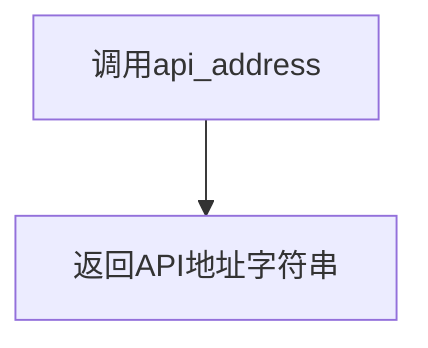
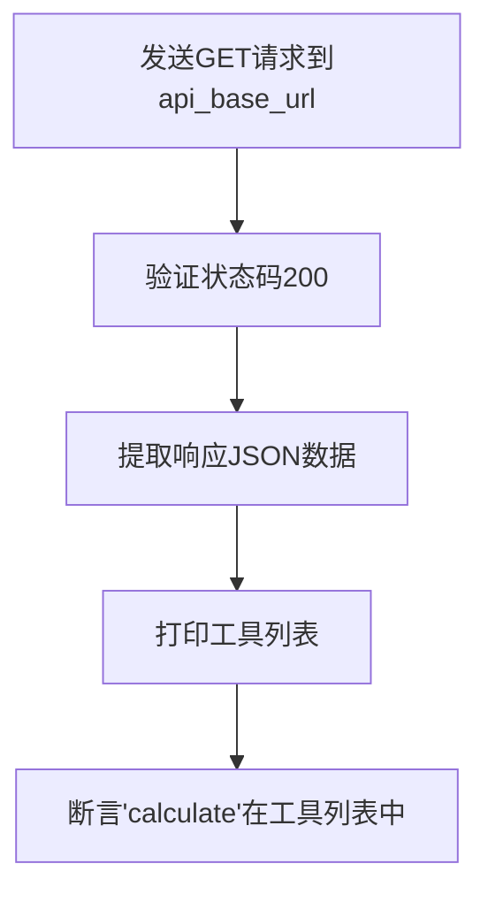
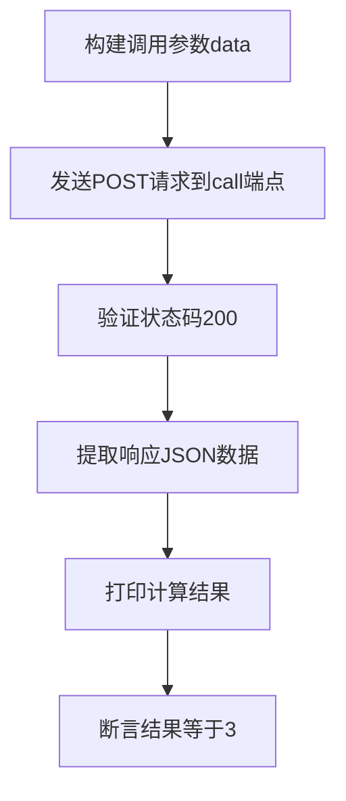

# `Langchain-Chatchat\libs\chatchat-server\tests\api\test_tools.py` 详细设计文档

这是一个工具服务的集成测试文件，用于测试ChatChat项目的工具API功能，包括获取可用工具列表和调用具体工具（如计算器）进行功能验证。

## 整体流程



## 类结构

```
测试模块 (无类)
└── 全局函数
    ├── test_tool_list
    └── test_tool_call
```

## 全局变量及字段


### `api_base_url`
    
工具API的基础URL地址

类型：`str`
    


    

## 全局函数及方法


### `test_tool_list`

测试获取工具列表功能，验证API可用性和calculate工具存在性。

参数：
- 无参数

返回值：`None`，该函数为测试函数，不返回具体数据，仅通过断言验证API响应。

#### 流程图



#### 带注释源码

```python
def test_tool_list():
    """
    测试获取工具列表功能，验证API可用性和calculate工具存在性
    
    测试步骤：
    1. 发送GET请求到工具列表API端点
    2. 验证HTTP响应状态码为200
    3. 打印返回的工具列表数据
    4. 断言calculate工具存在于返回的数据中
    """
    # 发送GET请求获取工具列表
    resp = requests.get(api_base_url)
    
    # 断言HTTP响应状态码为200，表示请求成功
    assert resp.status_code == 200
    
    # 从响应JSON中提取data字段
    data = resp.json()["data"]
    
    # 打印返回的工具列表数据，用于调试和日志记录
    pprint(data)
    
    # 断言calculate工具存在于返回的工具列表中
    assert "calculate" in data
```


### `test_tool_call`

测试调用 calculate 工具进行加法计算，验证工具调用返回正确结果。

参数：

- （无参数）

返回值：`void`，无返回值（测试函数，仅通过断言验证正确性）

#### 流程图



#### 带注释源码

```python
def test_tool_call():
    """测试调用 calculate 工具进行加法计算，验证工具调用返回正确结果"""
    
    # 1. 构建请求数据，包含工具名称和计算参数
    data = {
        "name": "calculate",              # 工具名称，指定要调用的工具
        "kwargs": {                       # 工具参数，使用关键字参数形式
            "a": 1,                       # 第一个操作数
            "b": 2,                       # 第二个操作数
            "operator": "+"               # 运算符，此处为加法
        },
    }
    
    # 2. 发送 POST 请求到工具调用端点
    #    api_base_url 格式: {api_address}/tools
    resp = requests.post(f"{api_base_url}/call", json=data)
    
    # 3. 断言 HTTP 响应状态码为 200，表示请求成功
    assert resp.status_code == 200
    
    # 4. 解析响应 JSON 数据，提取 data 字段
    #    响应格式: {"code": 200, "msg": "success", "data": <结果>}
    data = resp.json()["data"]
    
    # 5. 打印返回的计算结果用于调试
    pprint(data)
    
    # 6. 断言计算结果正确，1 + 2 应等于 3
    assert data == 3
```

## 关键组件


### 一段话描述

该代码是一个集成测试文件，用于测试远程工具服务的API功能，包括获取工具列表和调用计算工具进行数学运算，通过HTTP请求验证服务端的可用性和正确性。

### 文件整体运行流程

该测试文件首先通过`api_address()`函数获取API服务器地址，然后构建完整的API基础URL。测试流程分为两个阶段：第一阶段调用GET请求获取可用工具列表，验证状态码为200且包含"calculate"工具；第二阶段发送POST请求调用"calculate"工具，传入参数a=1、b=2、operator="+"，验证返回结果等于3。

### 全局函数详细信息

#### api_address
- **名称**: api_address
- **参数**: 无
- **参数类型**: 无
- **参数描述**: 获取API服务器地址的函数
- **返回值类型**: str
- **返回值描述**: 返回API服务的基础地址字符串
- **mermaid流程图**: 

- **带注释源码**: 
```python
from chatchat.server.utils import api_address  # 从项目utils模块导入api_address函数
api_base_url = f"{api_address()}/tools"  # 拼接完整的工具API端点
```

#### test_tool_list
- **名称**: test_tool_list
- **参数**: 无
- **参数类型**: 无
- **参数描述**: 测试获取工具列表功能的测试用例
- **返回值类型**: None
- **返回值描述**: 该函数通过assert进行断言验证，不返回具体值
- **mermaid流程图**: 

- **带注释源码**: 
```python
def test_tool_list():
    resp = requests.get(api_base_url)  # 发送GET请求获取工具列表
    assert resp.status_code == 200  # 验证HTTP状态码为200
    data = resp.json()["data"]  # 解析响应JSON，提取data字段
    pprint(data)  # 打印工具列表数据
    assert "calculate" in data  # 断言calculate工具存在于列表中
```

#### test_tool_call
- **名称**: test_tool_call
- **参数**: 无
- **参数类型**: 无
- **参数描述**: 测试调用工具执行计算功能的测试用例
- **返回值类型**: None
- **返回值描述**: 该函数通过assert进行断言验证，不返回具体值
- **mermaid流程图**: 

- **带注释源码**: 
```python
def test_tool_call():
    data = {
        "name": "calculate",  # 指定要调用的工具名称
        "kwargs": {"a": 1, "b": 2, "operator": "+"},  # 传入计算参数
    }
    resp = requests.post(f"{api_base_url}/call", json=data)  # 发送POST请求调用工具
    assert resp.status_code == 200  # 验证HTTP状态码为200
    data = resp.json()["data"]  # 解析响应JSON，提取data字段
    pprint(data)  # 打印计算结果
    assert data == 3  # 断言计算结果正确
```

### 关键组件信息

#### 工具列表获取组件
负责获取服务端注册的可用工具列表，验证工具服务是否正常运行

#### 工具调用组件
负责向服务端发送工具调用请求，执行具体的计算操作并返回结果

#### API地址管理组件
从项目配置中获取API服务器地址，支持动态配置和灵活部署

#### HTTP请求处理组件
封装requests库的GET和POST请求方法，处理网络通信和响应解析

### 潜在技术债务或优化空间

1. **缺乏错误处理**: 代码中没有try-except捕获网络异常或API不可用的情况，可能导致测试运行失败
2. **硬编码测试数据**: 测试参数(a=1, b=2, operator="+")硬编码在代码中，应考虑参数化测试
3. **缺少环境配置**: 依赖外部API服务但没有环境检查或服务可用性验证机制
4. **无超时设置**: requests请求未设置timeout参数，可能导致请求无限期等待
5. **缺少日志记录**: 没有详细的日志输出，难以追踪测试执行过程和问题定位

### 其它项目

#### 设计目标与约束
- 验证工具服务API的可用性
- 确保calculate工具功能正确
- 通过HTTP协议进行跨服务通信

#### 错误处理与异常设计
- 使用assert进行基本的断言验证
- 缺乏网络异常捕获和处理机制
- 未处理API返回错误码的情况

#### 数据流与状态机
- 测试流程: 初始化 → 获取工具列表 → 验证工具存在 → 调用工具 → 验证返回结果
- 状态转换: 发送请求 → 等待响应 → 解析数据 → 断言验证

#### 外部依赖与接口契约
- 依赖requests库进行HTTP通信
- 依赖chatchat.server.utils模块的api_address函数
- API契约: GET /tools返回工具列表，POST /tools/call调用工具
- 假设API地址可通过api_address()函数获取


## 问题及建议


### 已知问题

-   **硬编码的 API 端点**：`"/tools"` 和 `"/call"` 路径在代码中硬编码，缺乏灵活性，难以适配不同环境
-   **缺少超时设置**：`requests.get()` 和 `requests.post()` 未设置超时，可能导致测试在网络故障时无限期等待
-   **无错误处理机制**：缺少 try-except 异常捕获，API 不可用或返回错误时测试直接崩溃
-   **魔法字符串**：`"calculate"` 字符串在多处重复出现，未提取为常量
-   **缺乏测试框架标准实践**：未使用 pytest/unittest 框架，缺少测试隔离和 fixtures 管理
-   **调试代码残留**：使用 `pprint()` 进行输出，测试环境中应使用标准日志或删除
-   **断言信息不明确**：断言失败时无法提供有意义的错误上下文
-   **测试间可能存在隐式依赖**：测试执行顺序可能影响结果，缺乏独立性保证

### 优化建议

-   将 API 路径提取为模块级常量或配置项，提高可维护性
-   为所有 HTTP 请求添加合理的超时参数（如 `timeout=5`）
-   添加异常处理和重试机制，增强测试的鲁棒性
-   迁移至 pytest 框架，使用 fixtures 管理 api_base_url 等共享资源
-   使用数据驱动方式定义测试用例，避免重复代码
-   替换 `pprint()` 为 logging 模块或直接移除
-   为断言添加自定义错误消息，便于问题定位
-   考虑添加测试前置条件检查（如服务可用性检测）

## 其它


### 设计目标与约束

本测试模块旨在验证tools API的工具列表查询和工具调用功能的核心行为，确保API的可靠性和正确性。约束条件包括：测试环境需要能够访问api_address()返回的服务器地址；测试依赖于外部API服务，测试结果受网络连通性影响；测试用例仅覆盖基本的正向流程，未涵盖边界条件和异常场景。

### 错误处理与异常设计

当前代码主要依赖assert语句进行基本的结果验证，当断言失败时会抛出AssertionError。潜在的异常情况包括：requests.get()和requests.post()可能抛出连接超时异常（requests.exceptions.ConnectionError）、超时异常（requests.exceptions.Timeout）等网络相关异常；resp.status_code非200时仅通过断言捕获，未进行细粒度的错误码区分；resp.json()在响应体非JSON格式时会抛出json.JSONDecodeError。建议增加try-except块进行异常捕获，对不同错误码进行区分处理，并记录详细的错误日志以便排查问题。

### 数据流与状态机

测试数据流为线性顺序：无状态依赖，test_tool_list()和test_tool_call()可独立运行。数据流向为：测试函数构造请求 -> 发送HTTP请求到api_base_url -> 接收响应 -> 解析JSON响应 -> 断言验证 -> 输出结果。无复杂的状态转换或状态机逻辑，属于简单的请求-响应模型。

### 外部依赖与接口契约

核心依赖包括：requests库用于HTTP通信；chatchat.server.utils.api_address()函数用于获取API基础地址；外部服务/api/tools和/api/tools/call接口。接口契约方面：GET /tools返回包含工具列表的JSON响应，data字段应为字符串列表；POST /tools/call接收name和kwargs参数，data字段为计算结果。测试对接口响应格式有明确依赖，响应结构变化会导致测试失败。

### 测试覆盖率

当前测试覆盖率有限：仅覆盖calculate工具的正向调用（a=1, b=2, operator="+"），未覆盖减法、乘法、除法等运算符；未测试错误运算符（如"%"）的处理；未测试参数类型错误（如a为字符串）的处理；未测试不存在的工具名称；未测试工具列表为空或不存在calculate工具的情况。测试函数数量为2个，测试场景覆盖度较低。

### 性能考虑

当前测试未包含性能指标检测，主要性能关注点为：API请求的超时时间未设置，可能导致测试长时间阻塞；pprint()打印完整响应数据，在响应数据较大时可能影响测试执行效率；测试串行执行，无并行化设计。建议为requests请求添加timeout参数，根据实际性能要求设定合理的超时时间。

### 安全性考虑

测试代码未包含敏感信息处理，主要安全考量包括：API地址通过api_address()动态获取，未硬编码敏感URL；测试数据（a=1, b=2）为简单数值，无敏感数据；HTTP请求未使用HTTPS验证（取决于api_address()返回值）；未实现请求签名或认证token传递。建议在生产环境测试中验证API的认证机制是否正常工作。

### 配置管理

当前代码的配置管理包括：api_base_url基于api_address()动态构建，支持配置化；测试用例中的参数（a, b, operator）硬编码在测试函数中。建议将测试参数提取为配置文件或测试数据文件，支持不同测试场景的参数化配置，提高测试的可维护性和可扩展性。

### 日志与监控

当前测试使用pprint()输出响应数据，属于基本的调试信息输出。缺乏结构化日志记录，无法满足生产环境下的测试监控需求。建议引入标准logging模块，区分INFO（请求发送、响应接收）、WARNING（断言失败但非致命）、ERROR（网络异常、接口错误）等日志级别，便于测试执行的问题追踪和统计分析。

    