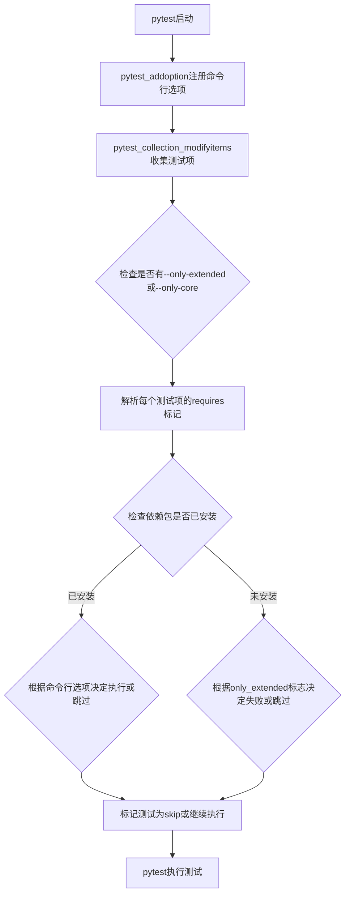
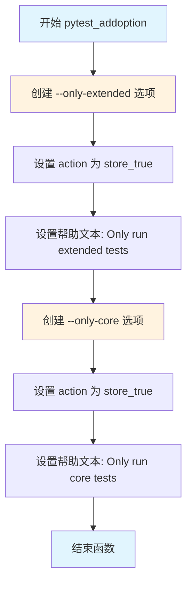
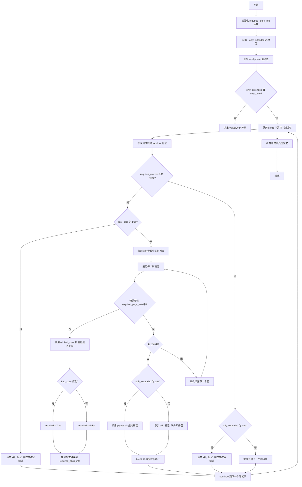

# `Langchain-Chatchat\libs\chatchat-server\tests\conftest.py` 详细设计文档

这是一个pytest配置文件，提供了自定义命令行选项（--only-extended 和 --only-core）用于控制测试执行范围，并实现了自定义的 @pytest.mark.requires 标记来管理依赖包的测试跳过逻辑，同时包含一个日志配置fixture。

## 整体流程



## 类结构

```
无类定义 - 模块级函数集合
├── pytest_addoption (命令行选项注册)
├── pytest_collection_modifyitems (测试项修改处理)
└── logging_conf (pytest fixture)
```

## 全局变量及字段


### `required_pkgs_info`
    
缓存包安装状态的字典，避免重复检查

类型：`Dict[str, bool]`
    


    

## 全局函数及方法


### `pytest_addoption`

添加自定义命令行选项到 pytest 解析器，允许用户在运行测试时指定特定的选项来控制测试执行行为。

参数：

- `parser`：`Parser`，pytest 的解析器对象，用于注册新的命令行选项

返回值：`None`，该函数没有返回值，仅通过副作用修改 parser 对象

#### 流程图



#### 带注释源码

```python
def pytest_addoption(parser: Parser) -> None:
    """Add custom command line options to pytest.
    
    这个函数是 pytest 的钩子函数(hook)，在 pytest 初始化时被调用。
    用于注册自定义的命令行选项，以便用户可以在运行测试时指定特定的行为。
    
    参数:
        parser: Parser 对象，pytest 的命令行解析器，用于添加新的选项
        
    返回值:
        None: 没有返回值，通过修改 parser 对象来添加选项
        
    示例:
        # 运行所有测试（包括扩展测试）
        pytest --only-extended
        
        # 仅运行核心测试（跳过所有扩展测试）
        pytest --only-core
    """
    # 注册 --only-extended 选项
    # action="store_true" 表示这是一个布尔选项，当指定时值为 True，未指定时为 False
    # help 参数提供帮助文本，供 pytest --help 命令显示
    parser.addoption(
        "--only-extended",
        action="store_true",
        help="Only run extended tests. Does not allow skipping any extended tests.",
    )
    
    # 注册 --only-core 选项
    # 此选项用于限制仅运行核心测试，跳过所有标记为扩展的测试
    parser.addoption(
        "--only-core",
        action="store_true",
        help="Only run core tests. Never runs any extended tests.",
    )
```


### `pytest_collection_modifyitems`

该函数是 pytest 的一个 hook 函数，在测试收集完成后、运行前修改测试项。它处理自定义的 `requires` 标记以检查测试所需的 Python 包是否已安装，根据 `--only-extended` 和 `--only-core` 命令行选项过滤核心测试和扩展测试，并相应地添加跳过或失败标记。

参数：

- `config`：`Config`，pytest 的配置对象，用于获取命令行选项（如 `--only-extended` 和 `--only-core`）的值
- `items`：`Sequence[Function]` ，收集到的所有测试项的序列，函数直接修改此序列以添加跳过或失败标记

返回值：`None`，该函数没有返回值，通过直接修改 `items` 序列来实现其功能

#### 流程图



#### 带注释源码

```python
def pytest_collection_modifyitems(config: Config, items: Sequence[Function]) -> None:
    """Add implementations for handling custom markers.

    At the moment, this adds support for a custom `requires` marker.

    The `requires` marker is used to denote tests that require one or more packages
    to be installed to run. If the package is not installed, the test is skipped.

    The `requires` marker syntax is:

    .. code-block:: python

        @pytest.mark.requires("package1", "package2")
        def test_something():
            ...
    """
    # 映射包名到是否已安装的状态
    # 用于避免重复调用 util.find_spec 提高性能
    required_pkgs_info: Dict[str, bool] = {}

    # 获取命令行选项 --only-extended 的值，默认为 False
    only_extended = config.getoption("--only-extended") or False
    # 获取命令行选项 --only-core 的值，默认为 False
    only_core = config.getoption("--only-core") or False

    # 互斥检查：不能同时指定 --only-extended 和 --only-core
    if only_extended and only_core:
        raise ValueError("Cannot specify both `--only-extended` and `--only-core`.")

    # 遍历所有收集到的测试项
    for item in items:
        # 获取测试项上最近的 requires 标记
        requires_marker = item.get_closest_marker("requires")
        
        # 如果测试项有 requires 标记
        if requires_marker is not None:
            # 如果只运行核心测试，跳过所有非核心测试（有 requires 标记的视为扩展测试）
            if only_core:
                item.add_marker(pytest.mark.skip(reason="Skipping not a core test."))
                continue

            # 从标记参数中获取所需包的列表
            required_pkgs = requires_marker.args
            
            # 遍历每个所需包
            for pkg in required_pkgs:
                # 如果尚未检查过该包是否已安装，则进行检查并缓存结果
                if pkg not in required_pkgs_info:
                    try:
                        # 使用 importlib.util.find_spec 检查包是否已安装
                        installed = util.find_spec(pkg) is not None
                    except Exception:
                        # 如果检查过程中发生异常，视为未安装
                        installed = False
                    # 缓存检查结果
                    required_pkgs_info[pkg] = installed

                # 如果包未安装
                if not required_pkgs_info[pkg]:
                    # 如果要求只运行扩展测试，则报告失败而非跳过
                    if only_extended:
                        pytest.fail(
                            f"Package `{pkg}` is not installed but is required for "
                            f"extended tests. Please install the given package and "
                            f"try again.",
                        )
                    else:
                        # 如果包未安装，立即添加 skip 标记并跳出包检查循环
                        # 因为只要有一个包不满足就跳过整个测试
                        item.add_marker(
                            pytest.mark.skip(reason=f"Requires pkg: `{pkg}`")
                        )
                        break
        else:
            # 如果测试项没有 requires 标记（即不是扩展测试）
            # 当要求只运行扩展测试时，跳过这些测试
            if only_extended:
                item.add_marker(
                    pytest.mark.skip(reason="Skipping not an extended test.")
                )
```


### `logging_conf`

这是一个 pytest fixture，用于配置日志系统，返回一个包含日志级别、日志文件路径、日志文件大小限制等信息的字典，供测试用例使用。

参数：

- （无显式参数，由 pytest fixture 机制隐式注入）

返回值：`dict`，包含日志配置的字典

#### 流程图

```mermaid
flowchart TD
    A[logging_conf fixture 被调用] --> B[调用 get_timestamp_ms 获取当前时间戳]
    B --> C[构造子目录名称 local_{timestamp}]
    C --> D[调用 get_log_file 获取日志文件路径]
    D --> E[计算日志文件大小: 3GB = 1024*1024*1024*3]
    E --> F[调用 get_config_dict 构造配置字典]
    F --> G[返回配置字典]
    
    style A fill:#f9f,color:#333
    style G fill:#9f9,color:#333
```

#### 带注释源码

```python
@pytest.fixture
def logging_conf() -> dict:
    """配置日志系统的 fixture。
    
    该 fixture 创建一个日志配置字典，用于在测试环境中设置日志系统。
    配置包括日志级别、输出文件、日志文件最大大小等。
    
    返回值:
        dict: 包含以下键值的配置字典:
            - level: 日志级别 (INFO)
            - filename: 日志文件完整路径
            - maxBytes: 单个日志文件最大字节数 (3GB)
            - backupCount: 保留的备份文件数量 (3个)
    """
    return get_config_dict(
        "INFO",  # 日志级别
        get_log_file(
            log_path="logs",  # 日志文件基础目录
            sub_dir=f"local_{get_timestamp_ms()}"  # 子目录，包含时间戳以确保唯一性
        ),
        1024 * 1024 * 1024 * 3,  # maxBytes: 单个日志文件最大大小 (3GB)
        1024 * 1024 * 1024 * 3,  # backupCount: 保留的备份文件数量 (3个)
    )
```

## 关键组件


### pytest_addoption

添加自定义命令行选项的钩子函数，用于注册 `--only-extended` 和 `--only-core` 两个布尔标志，允许用户控制运行核心测试或扩展测试。

### pytest_collection_modifyitems

处理测试收集阶段的核心函数，支持自定义 `requires` 标记，根据命令行选项和依赖包安装情况动态跳过或标记测试。

### logging_conf fixture

提供日志配置字典的fixture，返回包含日志级别、文件路径、大小限制等配置的字典，用于测试环境的日志设置。

### requires 标记处理逻辑

检测并处理 `@pytest.mark.requires` 装饰器，验证所需包是否已安装，未安装时根据配置决定跳过或失败测试。

### 命令行选项互斥检查

在 pytest_collection_modifyitems 中实现的逻辑，确保 `--only-extended` 和 `--only-core` 不能同时使用，避免冲突状态。

### required_pkgs_info 缓存字典

用于缓存包安装检查结果的字典，避免重复调用 `util.find_spec` 进行性能优化。


## 问题及建议


### 已知问题

-   **异常处理过于宽泛**：第73行使用 `except Exception:` 捕获所有异常并默认设置为未安装，这可能隐藏其他类型的错误，如 `ModuleNotFoundError` 以外的真正问题。
-   **日志配置硬编码值缺乏解释**：第92-95行的 `1024 * 1024 * 1024 * 3`（约3GB）磁盘大小限制没有任何注释说明，且可能对本地测试环境过大。
-   **类型注解不够精确**：`logging_conf` fixture 返回类型标注为 `dict`，但实际返回的是 `get_config_dict` 的结果，应使用更具体的类型注解。
-   **命名不一致**：函数 `pytest_addoption` 和 `pytest_collection_modifyitems` 使用 snake_case，但参数 `required_pkgs_info` 中的 `pkgs` 简写与代码其他地方不一致。
-   **缺少对 fixture 的文档说明**：`logging_conf` fixture 没有任何 docstring，用户无法了解其具体用途和返回值结构。
-   **marker 参数空列表处理**：当 `@pytest.mark.requires()` 不带任何参数时，代码会正常执行但不会跳过任何测试，可能不是预期行为。
-   **命令行选项互斥处理时机**：第67行在 `pytest_collection_modifyitems` 中检查 `--only-extended` 和 `--only-core` 的互斥，但这类验证更适合放在 `pytest_addoption` 阶段。

### 优化建议

-   将异常处理改为更具体的异常类型，或至少记录被捕获的异常以便调试。
-   将魔法数字提取为具名常量，并添加注释说明其用途和选择依据。
-   为 `logging_conf` fixture 添加详细的 docstring，说明返回的配置字典结构。
-   在 `pytest_addoption` 函数中添加选项互斥的验证逻辑，使用 `parser.addoption` 的 `group` 或自定义验证函数。
-   考虑使用 `functools.lru_cache` 或模块级变量缓存 `required_pkgs_info`，避免在大型测试套件中重复检测已安装的包。
-   对空的 `requires` marker 参数列表添加明确的处理逻辑或警告。
-   将日志路径中的 `f"local_{get_timestamp_ms()}"` 改为可配置的参数，提高灵活性。


## 其它


### 设计目标与约束

本配置文件的核心设计目标是为测试框架提供灵活的测试分类和依赖管理能力。具体目标包括：1) 通过`--only-core`和`--only-extended`命令行选项实现核心测试与扩展测试的分离执行；2) 通过`requires`标记实现测试对可选依赖包的动态检测和条件跳过；3) 确保核心测试可在最小依赖环境下运行，扩展测试则需要完整依赖环境。设计约束包括：不能同时指定`--only-extended`和`--only-core`选项；核心测试在任何情况下都不应被跳过；扩展测试在依赖缺失时可选择跳过或失败。

### 错误处理与异常设计

代码中的错误处理机制主要包括：1) 在`pytest_collection_modifyitems`函数中，当同时指定`--only-extended`和`--only-core`时抛出`ValueError`异常，错误信息明确说明这两个选项互斥；2) 在检查包是否安装时使用`try-except`块捕获所有异常，并将包视为未安装（`installed = False`）；3) 当`only_extended`为真且依赖包未安装时，调用`pytest.fail`使测试失败而非跳过，提供明确的错误信息指导用户安装所需包。异常设计遵循Fail-Fast原则，在配置冲突时立即报错，避免运行时行为不确定。

### 数据流与状态机

数据流主要分为三个阶段：配置解析阶段、收集阶段和标记阶段。在配置解析阶段，`pytest_addoption`注册命令行选项；在收集阶段，`pytest_collection_modifyitems`遍历所有测试项，根据配置和标记决定每个测试的最终状态（执行/跳过/失败）。状态转换规则：普通测试在`only_extended`模式下转换为跳过状态；带`requires`标记的测试在`only_core`模式下直接跳过，在`only_extended`模式下依赖缺失则失败，在默认模式下依赖缺失则跳过。`required_pkgs_info`字典作为缓存，避免重复调用`util.find_spec`。

### 外部依赖与接口契约

外部依赖包括：1) `pytest`框架本身，提供测试运行的基础设施；2) `importlib.util`模块，用于动态检查包是否已安装；3) `chatchat.utils`模块中的三个函数：`get_config_dict`用于生成日志配置字典，`get_log_file`用于获取日志文件路径，`get_timestamp_ms`用于生成时间戳。接口契约方面：`pytest_addoption`接收`Parser`对象并返回`None`；`pytest_collection_modifyitems`接收`Config`和`Sequence[Function]`对象并返回`None`；`logging_conf`是一个无参数fixture返回`dict`类型。所有函数遵循pytest插件的标准接口规范。

### 安全性考虑

代码在安全性方面有以下考量：1) 使用`util.find_spec`而非`import`来检查包是否存在，避免加载未信任的代码；2) 异常处理中捕获所有异常并默认认为包未安装，防止因检查逻辑本身出错导致安全风险；3) 命令行选项值通过`config.getoption`获取，pytest框架已处理输入验证。潜在安全风险：配置文件位于测试目录，可能暴露项目内部结构信息；日志路径包含时间戳，可能用于时间基攻击分析。

### 性能考虑

性能优化措施：1) 使用`required_pkgs_info`字典缓存包检查结果，避免对同一包重复调用`util.find_spec`，这在测试项较多时显著提升性能；2) 使用`get_closest_marker`而非遍历所有标记，提高标记获取效率；3) `logging_conf` fixture使用了相对较重的初始化（3GB日志文件大小），但仅在需要时创建。性能瓶颈：每个测试项都会遍历`requires`标记的参数列表，当依赖包列表较长时可能影响收集阶段性能；日志配置中设置的超大文件大小（3GB）可能造成磁盘空间浪费。

### 版本兼容性

代码依赖的Python版本通过`importlib.util`和`typing`模块推断应为Python 3.6+。pytest版本要求未明确声明，但使用了`get_closest_marker`（pytest 3.6+引入）和`add_marker`方法（pytest早期版本即支持）。兼容性风险：1) `typing.Sequence`在Python 3.9+有更好的替代类型`collections.abc.Sequence`；2) 日志配置中的`1024 * 1024 * 1024 * 3`计算在Python 2中可能产生不同结果（整数溢出行为不同）。建议：明确声明Python 3.8+和pytest 3.6+的版本要求。

### 日志记录策略

本文件本身不直接实现日志记录功能，但通过`logging_conf` fixture为测试会话提供日志配置。配置策略：日志级别设为INFO；日志文件路径包含时间戳以支持并行测试会话；日志文件大小限制设为3GB（单文件）和总大小3GB，提供充足的日志空间以支持长时间运行的集成测试。日志记录的设计考虑了测试环境的调试需求，在CI/CD环境中可通过日志文件追溯测试执行情况。

### 配置管理

配置管理采用以下策略：1) 命令行选项通过pytest的标准机制添加，保持与pytest生态的兼容性；2) 日志配置通过`chatchat.utils`模块集中管理，实现配置逻辑的复用；3) 测试标记（`requires`、`skip`）通过pytest的marker机制管理，不修改测试代码本身。配置优先级：命令行选项 > 默认值 > 代码硬编码值。配置验证在`pytest_collection_modifyitems`阶段进行，确保配置的一致性和有效性。

### 扩展性设计

代码在扩展性方面提供了以下支持：1) `pytest_addoption`和`pytest_collection_modifyitems`遵循pytest插件钩子规范，便于添加更多自定义选项和标记处理逻辑；2) `requires`标记支持任意数量的包参数，可轻松扩展新功能；3) 日志配置通过`get_config_dict`函数参数化，支持不同场景下的配置调整。未来扩展方向：可添加基于环境变量的配置选项；可实现测试依赖关系解析以支持并行执行优化；可添加测试超时控制标记。

### 关键场景分析

场景一：最小化环境运行。当所有可选依赖都未安装时，使用默认模式运行，核心测试正常执行，带`requires`标记的扩展测试被跳过。场景二：完整环境验证。使用`--only-extended`模式运行，所有依赖必须已安装，否则测试失败并给出明确的安装指导。场景三：核心测试隔离。使用`--only-core`模式运行，忽略所有扩展测试标记，仅执行核心测试。场景四：增量开发。开发者可使用`--only-core`快速验证核心功能，使用完整模式验证全部功能。


    