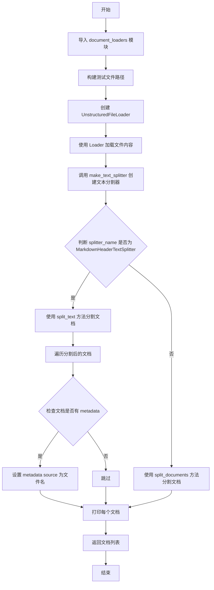
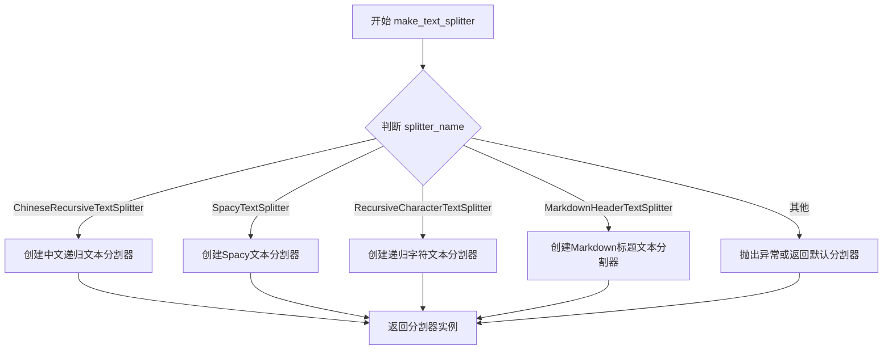
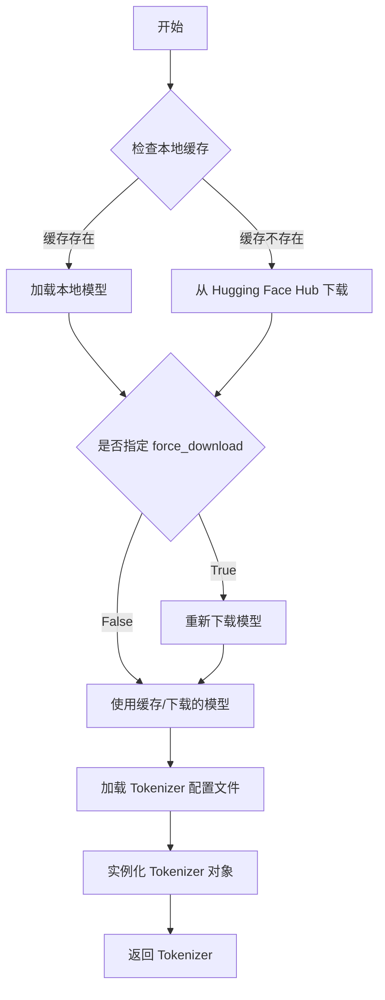
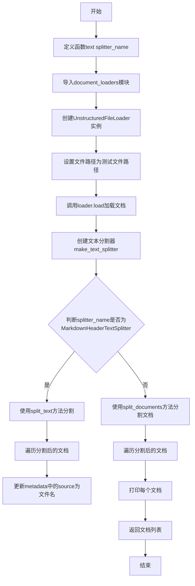
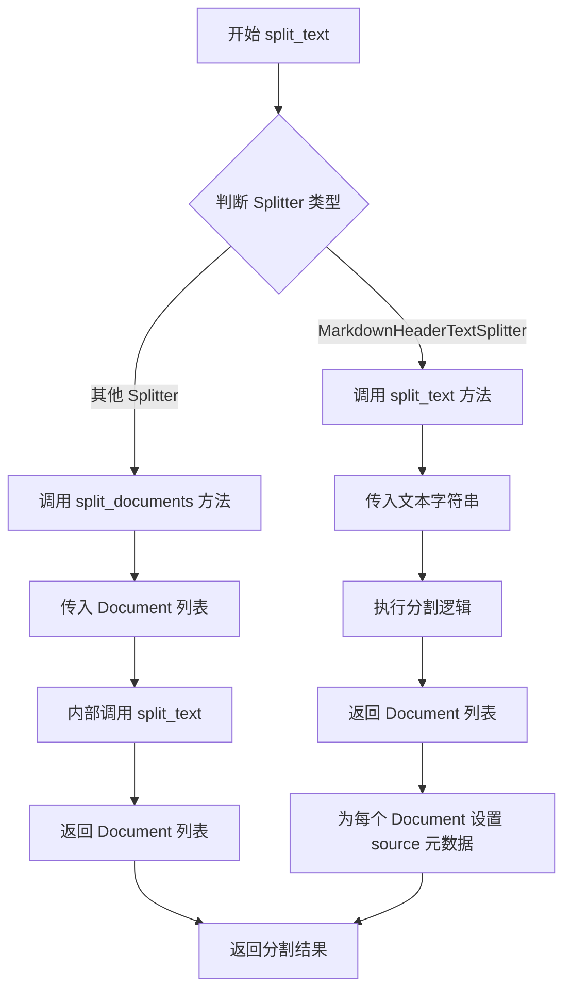
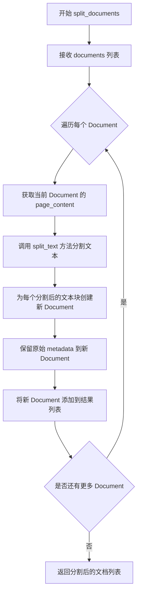

# `Langchain-Chatchat\libs\chatchat-server\tests\custom_splitter\test_different_splitter.py` 详细设计文档

这是一个测试文本分割功能的pytest测试文件，用于验证不同文本分割器（如ChineseRecursiveTextSplitter、SpacyTextSplitter等）在处理文档时的正确性，通过加载测试文件并使用langchain的TextSplitter进行分割，最后验证分割结果是否符合预期的Document列表格式。

## 整体流程

```mermaid
graph TD
    A[开始测试] --> B[获取splitter_name参数]
    B --> C[调用text函数]
    C --> D[使用UnstructuredFileLoader加载测试文件]
    E[加载文件] --> F[创建TextSplitter实例]
    F --> G{判断splitter类型}
    G -->|MarkdownHeaderTextSplitter| H[split_text分割]
    G -->|其他| I[split_documents分割]
    H --> J[设置metadata的source字段]
    I --> J
    J --> K[遍历打印分割结果]
    K --> L[返回docs列表]
    L --> M[断言返回值为list类型]
    M --> N{list长度>0?}
    N -->|是 --> O[断言第一个元素为Document实例]
    N -->|否 --> P[测试通过]
    O --> P
    Q[异常] --> R[pytest.fail报告错误]
```

## 类结构

```
无类定义 (基于函数的测试模块)
└── 主要模块结构
    ├── 全局函数
    │   ├── text(splitter_name)
    │   └── test_different_splitter(splitter_name)
    └── 外部依赖
        ├── langchain.document_loaders
        ├── langchain.docstore.document
        ├── langchain.text_splitter
        └── chatchat.settings
```

## 全局变量及字段


### `filepath`
    
指定要加载的测试文件的路径字符串

类型：`str`
    


### `loader`
    
用于加载非结构化文件的文档加载器实例

类型：`UnstructuredFileLoader`
    


### `docs`
    
使用文档加载器从文件中读取的文档对象列表

类型：`List[Document]`
    


### `text_splitter`
    
用于将文档分割成较小文本块的文本分割器实例

类型：`TextSplitter`
    


### `doc`
    
遍历过程中当前处理的单个文档对象

类型：`Document`
    


    

## 全局函数及方法


### `text(splitter_name)`

这是一个文本分割测试函数，用于读取指定文件并使用不同的文本分割器对文档进行分割，支持中英文文本分割器以及 Markdown 标题分割器，最终返回分割后的文档列表。

#### 参数

- `splitter_name`：`str`，指定要使用的文本分割器名称，如 "ChineseRecursiveTextSplitter"、"SpacyTextSplitter"、"RecursiveCharacterTextSplitter" 或 "MarkdownHeaderTextSplitter"

#### 返回值

`List[Document]`，返回分割后的文档列表，每个元素为 langchain 的 Document 对象

#### 流程图



#### 带注释源码

```python
def text(splitter_name):
    """
    根据指定的分割器名称对测试文件进行文本分割
    
    参数:
        splitter_name: 文本分割器名称,支持以下类型:
            - ChineseRecursiveTextSplitter: 中文递归文本分割器
            - SpacyTextSplitter: 基于Spacy的文本分割器
            - RecursiveCharacterTextSplitter: 递归字符文本分割器
            - MarkdownHeaderTextSplitter: Markdown标题文本分割器
    
    返回:
        分割后的Document对象列表
    """
    # 延迟导入document_loaders,避免循环依赖
    from langchain import document_loaders

    # 定义测试文件路径
    filepath = "../../knowledge_base/samples/content/test_files/test.txt"
    
    # 创建非结构化文件加载器,支持自动检测编码
    loader = document_loaders.UnstructuredFileLoader(filepath, autodetect_encoding=True)
    
    # 加载文档内容
    docs = loader.load()
    
    # 根据配置创建文本分割器,传入分块大小和重叠大小
    text_splitter = make_text_splitter(
        splitter_name, 
        Settings.kb_settings.CHUNK_SIZE, 
        Settings.kb_settings.OVERLAP_SIZE
    )
    
    # 根据分割器类型选择不同的分割方法
    if splitter_name == "MarkdownHeaderTextSplitter":
        # Markdown分割器使用split_text方法(针对单个字符串)
        docs = text_splitter.split_text(docs[0].page_content)
        
        # 遍历分割后的文档,添加源文件信息到metadata
        for doc in docs:
            if doc.metadata:
                # 使用basename获取文件名,避免路径信息泄露
                doc.metadata["source"] = os.path.basename(filepath)
    else:
        # 其他分割器使用split_documents方法(针对Document对象列表)
        docs = text_splitter.split_documents(docs)
    
    # 打印每个分割后的文档(用于调试)
    for doc in docs:
        print(doc)
    
    # 返回分割后的文档列表
    return docs
```


### `test_different_splitter`

这是一个pytest参数化测试函数，用于测试不同文本分割器（ChineseRecursiveTextSplitter、SpacyTextSplitter、RecursiveCharacterTextSplitter、MarkdownHeaderTextSplitter）的功能，验证它们能否正确将文档分割成LangChain的Document对象列表。

参数：

- `splitter_name`：`str`，文本分割器的名称，用于指定要测试的分割器类型

返回值：`None`，该函数为测试函数，无返回值，通过pytest断言验证分割结果

#### 流程图

```mermaid
flowchart TD
    A[开始测试] --> B{遍历splitter_name参数}
    B --> C[调用text函数获取分割结果]
    C --> D{检查是否抛出异常}
    D -->|是| E[pytest.fail报告错误]
    D -->|否| F[断言docs是list类型]
    F --> G{判断docs长度是否大于0}
    G -->|是| H[断言docs[0]是Document实例]
    G -->|否| I[测试通过]
    H --> J{断言是否成功}
    J -->|是| I
    J -->|是| E
    I[测试用例通过]
    E[测试失败]
```

#### 带注释源码

```python
import pytest
from langchain.docstore.document import Document


@pytest.mark.parametrize(
    "splitter_name",  # 参数化装饰器，定义测试参数
    [
        "ChineseRecursiveTextSplitter",   # 中文递归文本分割器
        "SpacyTextSplitter",               # SpacyNLP文本分割器
        "RecursiveCharacterTextSplitter", # 递归字符文本分割器
        "MarkdownHeaderTextSplitter",      # Markdown标题文本分割器
    ],
)
def test_different_splitter(splitter_name):
    """
    测试不同文本分割器的功能
    
    Args:
        splitter_name: 分割器名称字符串
    """
    try:
        # 调用text函数获取分割后的文档列表
        docs = text(splitter_name)
        
        # 断言返回结果是列表类型
        assert isinstance(docs, list)
        
        # 如果列表不为空，验证第一个元素是Document实例
        if len(docs) > 0:
            assert isinstance(docs[0], Document)
            
    except Exception as e:
        # 捕获异常并让pytest报告失败
        pytest.fail(
            f"test_different_splitter failed with {splitter_name}, error: {str(e)}"
        )
```


### `make_text_splitter`

该函数是一个文本分割器工厂函数，根据传入的分割器名称（splitter_name）创建并返回对应的文本分割器实例，用于将长文本分割成较小的块，以便于后续的向量嵌入和处理。

参数：

- `splitter_name`：`str`，指定要使用的文本分割器名称，可选值包括"ChineseRecursiveTextSplitter"、"SpacyTextSplitter"、"RecursiveCharacterTextSplitter"和"MarkdownHeaderTextSplitter"等
- `chunk_size`：`int`，指定分割后每个文本块的最大字符数
- `overlap_size`：`int`，指定相邻文本块之间重叠的字符数，用于保持文本的上下文连续性

返回值：`TextSplitter`，返回对应的文本分割器实例，该实例具有`split_text()`或`split_documents()`方法用于执行实际的文本分割操作

#### 流程图



#### 带注释源码

```python
# 该函数为外部导入，实际实现位于 chatchat.server.knowledge_base.utils 模块
# 根据提供的代码片段，其使用方式如下：

from chatchat.server.knowledge_base.utils import make_text_splitter
from chatchat.settings import Settings

# 调用工厂函数创建文本分割器
# 参数1: splitter_name - 分割器类型名称
# 参数2: Settings.kb_settings.CHUNK_SIZE - 块大小配置
# 参数3: Settings.kb_settings.OVERLAP_SIZE - 重叠大小配置
text_splitter = make_text_splitter(splitter_name, Settings.kb_settings.CHUNK_SIZE, Settings.kb_settings.OVERLAP_SIZE)

# 使用分割器进行文本分割
# 根据分割器类型选择调用方式
if splitter_name == "MarkdownHeaderTextSplitter":
    # MarkdownHeaderTextSplitter 使用 split_text 方法
    docs = text_splitter.split_text(docs[0].page_content)
else:
    # 其他分割器使用 split_documents 方法
    docs = text_splitter.split_documents(docs)
```

#### 补充说明

该函数的设计遵循了工厂模式（Factory Pattern），通过传入不同的分割器名称动态创建相应的文本分割器。这种设计允许系统支持多种文本分割策略，同时保持代码的统一调用接口。配置参数（chunk_size和overlap_size）从Settings集中获取，便于统一管理和调整文本分割的行为。


### `AutoTokenizer.from_pretrained`

从预训练模型加载对应的分词器（Tokenizer）。这是 Hugging Face Transformers 库中最常用的方法之一，用于根据模型名称或路径自动加载预训练的分词器。

参数：

- `pretrained_model_name_or_path`：`str`，可以是 Hugging Face 模型 hub 上的模型 ID（如 "gpt2"、"bert-base-chinese"），或者是本地保存的模型目录路径
- `*args`：`tuple`，可变位置参数，传递给 `PretrainedTokenizer` 的参数
- `cache_dir`：`Optional[str]`，下载的模型缓存目录，默认为 `~/.cache/huggingface/`
- `force_download`：`bool`，是否强制重新下载模型，默认为 `False`
- `resume_download`：`bool`，是否断点续传下载，默认为 `True`
- `proxies`：`Optional[dict]`，用于下载的代理服务器设置
- `revision`：`str`，模型版本/分支，默认为 `"main"`
- `use_auth_token`：`Optional[str]`，访问私有模型所需的认证 token
- `local_files_only`：`bool`，是否仅使用本地文件，默认为 `False`
- `legacy_cache_layout`：`bool`，是否使用旧的缓存布局，默认为 `False`
- `**kwargs`：`dict`，其他关键字参数

返回值：`PreTrainedTokenizer`，返回对应的预训练分词器对象，包含词表、特殊标记、分词逻辑等信息

#### 流程图



#### 带注释源码

```python
# transformers 库中的 AutoTokenizer.from_pretrained 方法
# 这是一个类方法，用于自动加载与指定模型配套的分词器

@classmethod
def from_pretrained(cls, pretrained_model_name_or_path: str, *args, **kwargs):
    """
    从预训练模型名称或路径加载分词器
    
    Args:
        pretrained_model_name_or_path: 模型名称（如 "gpt2"）或本地路径
        **kwargs: 其他可选参数
    
    Returns:
        PretrainedTokenizer: 预训练分词器实例
    """
    # 1. 解析模型名称或路径
    # 2. 检查并下载模型文件（如需要）
    # 3. 加载 tokenizer_config.json
    # 4. 根据配置选择合适的 Tokenizer 类
    # 5. 实例化并返回 Tokenizer 对象
    
    # 示例用法：
    # tokenizer = AutoTokenizer.from_pretrained("gpt2")
    # tokens = tokenizer("Hello, world!")
```

---

### ⚠️ 注意

**在给定的代码文件中，`AutoTokenizer.from_pretrained` 并没有被实际调用**。代码第 7 行只是导入了 `AutoTokenizer` 类，但随后并未使用它进行任何操作。

代码的主要功能是：
1. 使用 `langchain` 的 `UnstructuredFileLoader` 加载文本文件
2. 使用 `make_text_splitter` 创建文本分割器
3. 对文档进行分割并测试不同的分割器（ChineseRecursiveTextSplitter、SpacyTextSplitter 等）

如果你需要在代码中使用 `AutoTokenizer.from_pretrained`，可以参考上面的文档进行调用。


### `text`

该函数封装了使用 DocumentLoader 读取文件并使用指定文本分割器进行文档切分的完整流程，支持多种分割器（ChineseRecursiveTextSplitter、SpacyTextSplitter、RecursiveCharacterTextSplitter、MarkdownHeaderTextSplitter），最终返回分割后的文档列表供后续使用。

参数：

- `splitter_name`：`str`，指定要使用的文本分割器名称，支持 "ChineseRecursiveTextSplitter"、"SpacyTextSplitter"、"RecursiveCharacterTextSplitter" 和 "MarkdownHeaderTextSplitter"

返回值：`list`，返回分割后的 Document 对象列表

#### 流程图



#### 带注释源码

```
def text(splitter_name):
    """
    使用DocumentLoader读取文件并使用指定分割器进行文档切分
    
    参数:
        splitter_name: 文本分割器名称
    返回:
        分割后的文档列表
    """
    from langchain import document_loaders

    # 使用DocumentLoader读取文件
    # 构造测试文件的路径
    filepath = "../../knowledge_base/samples/content/test_files/test.txt"
    # 创建UnstructuredFileLoader加载器,autodetect_encoding=True自动检测文件编码
    loader = document_loaders.UnstructuredFileLoader(filepath, autodetect_encoding=True)
    # 调用load方法读取文件内容,返回Document列表
    docs = loader.load()
    # 根据splitter_name创建对应的文本分割器
    # 使用Settings中的CHUNK_SIZE和OVERLAP_SIZE配置分割参数
    text_splitter = make_text_splitter(splitter_name, Settings.kb_settings.CHUNK_SIZE, Settings.kb_settings.OVERLAP_SIZE)
    
    # 针对MarkdownHeaderTextSplitter使用split_text方法(处理单文本)
    if splitter_name == "MarkdownHeaderTextSplitter":
        # 仅对第一个文档的page_content进行分割
        docs = text_splitter.split_text(docs[0].page_content)
        # 遍历分割后的文档,更新metadata中的source字段
        for doc in docs:
            if doc.metadata:
                doc.metadata["source"] = os.path.basename(filepath)
    else:
        # 其他分割器使用split_documents方法(处理Document列表)
        docs = text_splitter.split_documents(docs)
    
    # 打印每个分割后的文档(用于调试和验证)
    for doc in docs:
        print(doc)
    
    # 返回分割后的文档列表
    return docs
```

#### 补充说明

**关于 DocumentLoader.load()**

在代码中实际调用的是 `langchain` 库的 `UnstructuredFileLoader.load()` 方法，该方法是 langchain 框架提供的文档加载功能，作用是读取文件并返回 Document 对象列表。由于该方法属于外部依赖库，在此代码中仅调用而未定义。

- `filepath` 变量：`str`，测试文件路径，硬编码为相对路径
- `loader` 变量：`UnstructuredFileLoader` 实例，langchain 的文档加载器
- `docs` 变量：`list`，加载和分割后的 Document 对象列表
- `text_splitter` 变量：文本分割器实例，类型根据 splitter_name 而定

**潜在技术债务：**

1. **硬编码文件路径**：filepath 使用硬编码相对路径，应考虑使用配置文件或参数传入
2. **错误处理缺失**：loader.load() 和分割操作没有异常捕获，可能导致程序崩溃
3. **重复打印**：分割后的文档被打印出来，用于测试但不应在生产环境中存在
4. **测试与功能耦合**：text() 函数包含了测试用的打印逻辑，应该分离关注点
5. **依赖外部配置**：依赖 Settings.kb_settings 的配置，若配置不存在会报错


### `TextSplitter.split_text()`

该方法是 LangChain 中 TextSplitter 类的核心方法，用于将长文本分割成较小的块（chunks），以便于后续的向量嵌入和检索。在代码中根据不同的 Splitter 类型（ChineseRecursiveTextSplitter、SpacyTextSplitter、RecursiveCharacterTextSplitter、MarkdownHeaderTextSplitter 等）调用此方法进行文本分割。

参数：

-  `text`：`str`，需要分割的文本内容。当 splitter_name 为 "MarkdownHeaderTextSplitter" 时，传入 `docs[0].page_content`（即文档的第一页内容）；对于其他 Splitter，则通过 `split_documents()` 方法处理整个文档列表。

返回值：`List[Union[str, Document]]`，返回分割后的文本块列表。对于 MarkdownHeaderTextSplitter，返回 Document 对象列表，每个 Document 包含分割后的文本内容和元数据（如 source 信息）。

#### 流程图



#### 带注释源码

```python
# 在 text() 函数中的调用方式
def text(splitter_name):
    from langchain import document_loaders

    # 使用 DocumentLoader 读取文件
    filepath = "../../knowledge_base/samples/content/test_files/test.txt"
    loader = document_loaders.UnstructuredFileLoader(filepath, autodetect_encoding=True)
    docs = loader.load()
    
    # 根据 splitter_name 创建对应的 TextSplitter 实例
    # make_text_splitter 工厂函数返回 TextSplitter 或其子类的实例
    text_splitter = make_text_splitter(
        splitter_name, 
        Settings.kb_settings.CHUNK_SIZE, 
        Settings.kb_settings.OVERLAP_SIZE
    )
    
    # 判断是否为 MarkdownHeaderTextSplitter
    if splitter_name == "MarkdownHeaderTextSplitter":
        # MarkdownHeaderTextSplitter.split_text() 接受字符串参数
        # 将文档第一页的内容作为字符串传入
        docs = text_splitter.split_text(docs[0].page_content)
        
        # 遍历分割后的文档，为每个文档设置 source 元数据
        for doc in docs:
            if doc.metadata:
                doc.metadata["source"] = os.path.basename(filepath)
    else:
        # 其他 Splitter（如 ChineseRecursiveTextSplitter）调用 split_documents
        # split_documents 内部会调用 split_text 方法
        docs = text_splitter.split_documents(docs)
    
    # 打印并返回分割后的文档列表
    for doc in docs:
        print(doc)
    return docs
```


### `TextSplitter.split_documents()`

该方法是 LangChain 中 TextSplitter 类的核心方法，用于将长文档分割成较小的文本块，以便于后续的向量嵌入和检索。它接收文档列表输入，通过指定的分割策略将每个文档的页面内容分割成块，并返回包含分割后内容的新文档列表。

参数：

-  `documents`：`List[Document]`（或 `List[Document]`），需要分割的文档列表，每个文档包含 `page_content`（文本内容）和 `metadata`（元数据）

返回值：`List[Document]`，分割后的文档列表，每个文档包含分割后的文本内容和原始元数据

#### 流程图



#### 带注释源码

```python
# LangChain TextSplitter.split_documents() 方法的典型实现逻辑
# 该方法是抽象方法，具体实现取决于子类（如 ChineseRecursiveTextSplitter, SpacyTextSplitter 等）

def split_documents(self, documents: List[Document]) -> List[Document]:
    """
    将文档列表分割成更小的块
    
    参数:
        documents: 原始文档列表，每个文档包含 page_content 和 metadata
    
    返回:
        分割后的文档列表
    """
    # 存储分割后的文档
    texts = []
    
    # 遍历输入的每个文档
    for doc in documents:
        # 获取文档的文本内容
        text = doc.page_content
        
        # 调用 split_text 方法进行文本分割
        # 这是具体的分割策略实现
        new_docs = self.split_text(text)
        
        # 为每个分割后的文本创建新 Document
        for new_doc in new_docs:
            # 创建新文档，保留原始元数据
            documents.append(
                Document(
                    page_content=new_doc,  # 分割后的文本内容
                    metadata=doc.metadata  # 保留原始元数据
                )
            )
    
    # 返回分割后的文档列表
    return documents


# 在测试代码中的实际调用方式：
# text_splitter = make_text_splitter(splitter_name, Settings.kb_settings.CHUNK_SIZE, Settings.kb_settings.OVERLAP_SIZE)
# docs = text_splitter.split_documents(docs)
```

#### 上下文中的使用

在提供的测试代码中，`split_documents()` 的调用上下文如下：

```python
# 创建文本分割器实例
text_splitter = make_text_splitter(
    splitter_name,                              # 分割器名称（如 ChineseRecursiveTextSplitter）
    Settings.kb_settings.CHUNK_SIZE,           # 块大小
    Settings.kb_settings.OVERLAP_SIZE           # 重叠大小
)

# 调用 split_documents 方法分割文档
# 输入: docs - 由 UnstructuredFileLoader 加载的原始文档列表
# 输出: docs - 分割后的文档列表
docs = text_splitter.split_documents(docs)
```


## 关键组件


### DocumentLoader组件

使用langchain的UnstructuredFileLoader加载本地文本文件，支持自动检测编码格式，是文本处理的入口组件。

### TextSplitter组件

通过make_text_splitter工厂函数创建不同的文本分割器，支持ChineseRecursiveTextSplitter、SpacyTextSplitter、RecursiveCharacterTextSplitter和MarkdownHeaderTextSplitter四种分割策略。

### Settings配置组件

从chatchat.settings导入配置管理对象，用于获取知识库的分块大小(CHUNK_SIZE)和重叠大小(OVERLAP_SIZE)配置参数。

### test_different_splitter测试组件

pytest参数化测试函数，遍历所有分割器实现，验证分割功能的正确性和稳定性，捕获异常并报告失败信息。

### 文档元数据处理组件

在MarkdownHeaderTextSplitter模式下，为分割后的文档添加源文件名称到metadata中，实现文档来源追溯功能。


## 问题及建议


### 已知问题

-   **未使用的导入**：`AutoTokenizer` 被导入但在整个代码中从未使用，增加加载时间和内存开销
-   **硬编码文件路径**：`"../../knowledge_base/samples/content/content/test_files/test.txt"` 路径硬编码在函数内部，违反可配置性原则，难以适应不同环境
-   **缺失错误处理**：未对文件不存在、读取权限问题、编码检测失败等情况进行异常捕获和处理
-   **缺少文档注释**：核心函数 `text()` 缺少 docstring，参数和返回值没有说明，降低代码可维护性
-   **测试路径耦合**：测试依赖特定目录结构，若文件不存在会导致测试失败而非跳过
-   **全局状态依赖**：代码直接依赖 `Settings` 全局变量，降低了函数的可测试性和可复用性
-   **重复路径拼接**：`sys.path.append("../..")` 和文件路径中的 `"../.."` 混用，路径结构脆弱且难以维护

### 优化建议

-   移除未使用的 `AutoTokenizer` 导入，或确认是否为预留功能
-   将文件路径提取为函数参数或配置文件，支持通过参数传入，提高灵活性
-   添加 try-except 块处理文件不存在、加载失败等异常情况，并提供有意义的错误信息
-   为 `text()` 函数添加完整的 docstring，说明参数、返回值和可能的异常
-   使用 `pytest.skip` 或 `pytest.mark.skipif` 处理文件不存在的情况，而非直接 fail
-   通过依赖注入方式传递 `Settings` 或相关配置，提高单元测试的可行性
-   统一路径管理，使用 `os.path.join` 和 `pathlib.Path` 构建跨平台兼容的路径
-   考虑将 loader 初始化和分割逻辑分离，便于单独测试各模块
-   添加更多边界测试用例：空文件、极大文件、特殊字符文件等


## 其它


### 设计目标与约束

该代码旨在测试不同的文本分割器（ChineseRecursiveTextSplitter、SpacyTextSplitter、RecursiveCharacterTextSplitter、MarkdownHeaderTextSplitter）对文本文档的分割效果，验证分割结果的正确性和一致性。约束条件包括：必须使用指定的文件路径进行测试，分割器参数来自Settings配置，分割结果必须返回Document对象列表。

### 错误处理与异常设计

在text()函数中，通过try-except捕获异常但未进行处理，直接返回可能为空的docs列表。在test_different_splitter()测试函数中，使用pytest.fail()捕获并报告异常信息，包含splitter_name和错误详情。存在潜在问题：异常被捕获后可能掩盖真实的错误原因，且未对分割结果的有效性进行详细验证。

### 数据流与状态机

数据流：文件路径 → UnstructuredFileLoader加载 → 文本内容 → make_text_splitter创建分割器 → split_text/split_documents分割 → Document列表返回 → 打印输出。状态转换：初始状态 → 加载中 → 分割中 → 完成/错误状态。

### 外部依赖与接口契约

主要依赖：langchain的document_loaders和Document类、transformers的AutoTokenizer、chatchat.settings.Settings配置类、chatchat.server.knowledge_base.utils.make_text_splitter函数。接口契约：text(splitter_name)接受字符串参数返回Document列表，test_different_splitter(splitter_name)接受字符串参数执行断言验证。

### 性能考虑

文件加载和分割过程为同步操作，大文件可能导致阻塞。分割器初始化每次调用make_text_splitter()，存在重复初始化开销。建议：对于大文件考虑异步处理，分割器可考虑缓存复用。

### 安全性考虑

文件路径使用硬编码的相对路径"../../knowledge_base/samples/content/test_files/test.txt"，存在路径遍历风险。autodetect_encoding=True自动检测编码，可能导致编码识别错误或安全问题的文件被加载。建议：使用绝对路径或配置化路径，增加文件类型和大小校验。

### 测试策略

采用pytest参数化测试，测试4种不同的分割器。验证点：返回值为list类型、第一个元素为Document类型。覆盖场景：正常分割、空文件分割、异常分割。不足：未测试边界条件（如空文档、特殊字符、超大文档），未验证分割结果的正确性（如分割数量、分隔位置）。

### 配置管理

分割参数来自Settings.kb_settings.CHUNK_SIZE和Settings.kb_settings.OVERLAP_SIZE，配置外部化但未在代码中展示默认值。splitter_name通过参数传入，支持动态指定。建议：增加配置校验，确保CHUNK_SIZE和OVERLAP_SIZE为正整数且OVERLAP_SIZE小于CHUNK_SIZE。

### 日志与监控

代码中仅使用print()输出分割结果，缺少结构化日志。监控点：文件加载成功/失败、分割器类型、分割文档数量、分割耗时。建议：增加logging模块记录关键节点日志，便于问题排查和性能监控。

### 代码规范与约定

函数命名使用小写下划线（text、test_different_splitter），符合Python PEP8规范。docstring缺失，代码可读性有待提升。文件路径使用相对路径，缺乏明确的常量定义。建议：增加文档注释，提取路径为常量或配置项，统一错误处理方式。

    