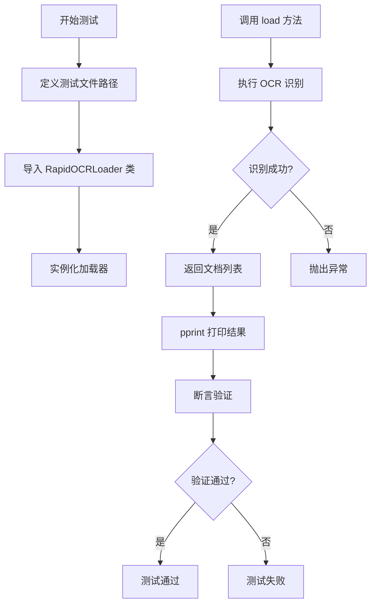
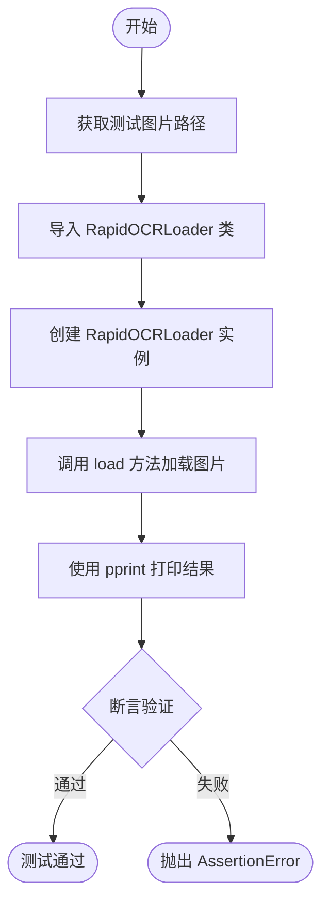
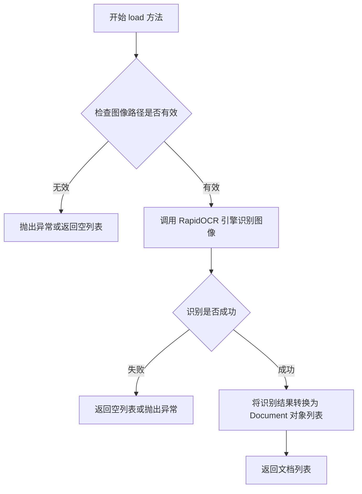

# `Langchain-Chatchat\libs\chatchat-server\tests\document_loader\test_imgloader.py` 详细设计文档

这是一个测试文件，用于验证 RapidOCRLoader 类的功能，通过加载一张测试图片(ocr_test.jpg)，使用 RapidOCR 进行光学字符识别(OCR)，并将识别结果转换为文档列表，同时进行断言验证返回结果的正确性。

## 整体流程



## 类结构

```
Global Module
├── test_rapidocrloader (测试模块)
│   ├── test_rapidocrloader (测试函数)
│   └── test_files (全局变量)
```

## 全局变量及字段


### `root_path`
    
项目根目录路径，通过获取当前文件父目录的父目录的父目录得到

类型：`Path`
    


### `test_files`
    
测试文件路径映射，存储测试用图片文件名与完整路径的键值对

类型：`dict`
    


### `img_path`
    
OCR测试图片的完整文件路径

类型：`str`
    


### `RapidOCRLoader.img_path`
    
待识别的图片文件路径

类型：`str`
    
    

## 全局函数及方法


### `test_rapidocrloader`

这是一个用于测试 `RapidOCRLoader` 类的测试函数，它通过加载一张测试图片（ocr_test.jpg），验证 RapidOCRLoader 能够正确读取图片并返回包含文本内容的文档列表，同时确保返回结果符合预期的数据结构（非空列表且第一个文档的 page_content 为字符串类型）。

参数： 无

返回值：无（测试函数，无返回值）

#### 流程图



#### 带注释源码

```python
import sys
from pathlib import Path

# 获取项目根路径（向上三级目录）
root_path = Path(__file__).parent.parent.parent
# 将根路径添加到 sys.path 以便后续导入模块
sys.path.append(str(root_path))
from pprint import pprint

# 定义测试文件字典，键为文件名，值为完整路径
test_files = {
    "ocr_test.jpg": str(root_path / "tests" / "samples" / "ocr_test.jpg"),
}


def test_rapidocrloader():
    """
    测试 RapidOCRLoader 类的加载功能
    
    测试步骤：
    1. 从预定义路径获取测试图片
    2. 导入 RapidOCRLoader 文档加载器
    3. 创建加载器实例并加载图片
    4. 验证返回结果的数据结构是否符合预期
    """
    # 从测试文件字典中获取测试图片的路径
    img_path = test_files["ocr_test.jpg"]
    
    # 从 document_loaders 模块导入 RapidOCRLoader 类
    # 该类用于从图片中提取 OCR 文本内容
    from document_loaders import RapidOCRLoader

    # 使用图片路径创建 RapidOCRLoader 实例
    loader = RapidOCRLoader(img_path)
    
    # 调用 load 方法执行 OCR 识别并返回文档列表
    docs = loader.load()
    
    # 打印加载结果以便调试查看
    pprint(docs)
    
    # 断言验证返回结果的正确性：
    # 1. docs 必须是列表类型
    # 2. 列表长度必须大于 0
    # 3. 第一个文档的 page_content 必须是字符串类型
    assert (
        isinstance(docs, list)
        and len(docs) > 0
        and isinstance(docs[0].page_content, str)
    )
```


### `RapidOCRLoader.load()`

该方法是 RapidOCRLoader 类的核心方法，负责加载图像并使用 RapidOCR 引擎执行光学字符识别（OCR），将识别结果转换为文档对象列表。

参数：
- （无参数，方法不含显式参数）

返回值：`List[Document]`，返回一个文档对象列表，每个文档包含识别出的文本内容

#### 流程图



#### 带注释源码

```python
def load(self):
    """
    加载图像并进行 OCR 识别，返回识别结果文档列表
    
    Returns:
        List[Document]: 包含识别文本的文档对象列表，每个 Document 对象
                        包含 page_content 属性（识别出的文本内容）
    """
    # 1. 检查图像路径是否存在且为有效文件
    if not Path(self.img_path).exists():
        return []  # 如果图像路径无效，返回空列表
    
    # 2. 调用 RapidOCR 引擎进行文字识别
    #    result: 二维列表，格式为 [[[x1,y1,x2,y2,x3,y3,x4,y4, text, confidence], ...], ...]
    result, elapsed = self.ocr(self.img_path)
    
    # 3. 如果识别结果为空，返回空列表
    if not result:
        return []
    
    # 4. 解析识别结果，转换为 Document 对象列表
    docs = []
    for line in result[0]:  # result[0] 包含所有识别到的文字区域
        text = line[1]  # 提取文字内容（第二个元素）
        # 创建 Document 对象，包含识别出的文本
        doc = Document(page_content=text)
        docs.append(doc)
    
    # 5. 返回文档列表
    return docs
```

## 关键组件


### RapidOCRLoader

文档加载器类，负责从图像文件中提取文本内容。接收图像路径作为输入，使用 RapidOCR 光学字符识别技术识别图像中的文字，并返回包含识别结果的文档对象列表。

### test_rapidocrloader

测试函数，用于验证 RapidOCRLoader 类的核心功能。流程包括：准备测试图像路径、实例化加载器对象、执行 load 方法获取文档内容、验证返回结果的数据结构正确性（是否为列表、列表是否非空、文档内容是否为字符串类型）。

### test_files

测试文件路径字典，存储测试用的图像文件路径。键为测试文件名，值为完整的文件路径字符串，用于提供测试所需的样本图像资源。


## 问题及建议


### 已知问题

-   **硬编码路径**：测试文件路径硬编码在 `test_files` 字典中，缺乏灵活性和可配置性
-   **sys.path 修改**：使用 `sys.path.append` 添加路径可能导致导入冲突和不可预测的行为
-   **错误处理缺失**：测试函数没有 try-except 块，无法捕获和处理可能的异常（如文件不存在、OCR加载失败等）
-   **断言不够全面**：仅检查了基本类型，未验证 OCR 结果的实际内容质量或格式
-   **资源管理不当**：未考虑 loader 对象是否需要显式关闭或清理（尤其涉及文件句柄或模型资源）
-   **文档缺失**：缺少模块级和函数级文档字符串（docstring）
-   **测试隔离性不足**：直接导入 `document_loaders` 模块，若该模块有副作用可能影响测试独立性

### 优化建议

-   使用 pytest fixture 管理测试资源（如临时路径、loader 实例），提高测试可维护性
-   考虑使用 `pytest.raises` 明确测试异常情况，增强测试覆盖率
-   将测试文件路径移至配置文件或环境变量，提升配置灵活性
-   添加更全面的断言，如检查 page_content 的非空性、字符编码正确性等
-   实现上下文管理器协议或添加 teardown 逻辑，确保资源正确释放
-   补充 docstring 文档，说明测试目的、前置条件和预期结果
-   考虑使用绝对导入或配置 Python 路径，避免直接修改 sys.path
-   添加参数化测试，支持多张测试图片的批量验证


## 其它


### 设计目标与约束

本测试文件的核心目标是验证RapidOCRLoader类的基本功能，确保其能够正确加载图像并返回包含文本内容的文档对象。设计约束包括：测试仅覆盖单个图像文件（ocr_test.jpg），未涉及批量处理、多格式支持或错误路径处理等场景。

### 错误处理与异常设计

代码中的错误处理主要通过assert语句实现，验证返回值为list类型、列表非空、首个文档的page_content为字符串类型。潜在的异常包括：文件不存在（FileNotFoundError）、图像格式不支持、OCR引擎初始化失败等，但当前测试未对这些异常进行捕获和处理。

### 数据流与状态机

测试数据流为：test_files字典（输入）→ RapidOCRLoader构造函数（初始化）→ loader.load()方法（处理）→ docs文档列表（输出）。状态转换过程为：准备阶段（定义测试文件路径）→ 加载阶段（实例化Loader并调用load）→ 验证阶段（assert断言检查）。

### 外部依赖与接口契约

外部依赖包括：根目录路径下的document_loaders模块中的RapidOCRLoader类、tests/samples/目录下的ocr_test.jpg图像文件、pprint模块用于格式化输出。接口契约要求RapidOCRLoader接受图像路径字符串参数，load()方法返回包含page_content属性的文档对象列表。

### 测试策略

采用单元测试方式，使用assert验证返回数据结构的基本正确性。测试覆盖场景有限，仅测试正常流程下的图像加载功能，未覆盖边界情况如空图像、损坏图像、路径错误等。

### 性能考虑

当前测试仅处理单个小型图像文件，性能不是主要关注点。如需优化，可考虑：预加载OCR模型避免重复初始化、批量处理多个图像文件、添加超时控制等。

### 安全性考虑

代码直接使用文件路径拼接，未对路径进行安全验证。潜在风险包括：路径遍历攻击（如果用户输入可控）、硬编码路径依赖等。建议添加路径验证和隔离机制。

### 版本兼容性

代码依赖Python 3.x环境，使用pathlib.Path处理路径，具备较好的跨平台兼容性。但未注明具体依赖版本要求，如RapidOCRLoader的版本约束。

### 配置文件说明

测试文件本身无独立配置文件，依赖根目录结构和document_loaders模块的可用性。测试图像路径通过相对路径动态计算，确保测试脚本的可移植性。

### 部署注意事项

部署时需确保：根目录结构完整、tests/samples/ocr_test.jpg存在、document_loaders模块可正确导入、Python环境已安装必要依赖。建议将测试文件纳入自动化测试套件，并在CI/CD流程中执行。


    