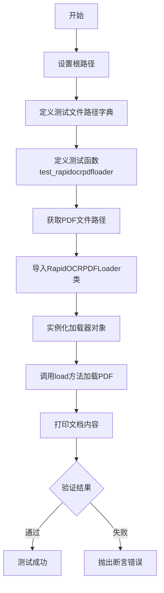
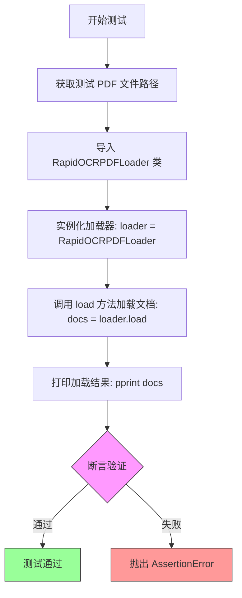
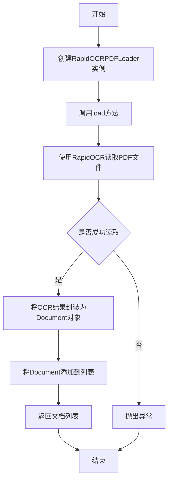

# `Langchain-Chatchat\libs\chatchat-server\tests\document_loader\test_pdfloader.py` 详细设计文档

该代码是一个测试文件，用于验证RapidOCRPDFLoader文档加载器的功能，通过加载OCR测试PDF文件并验证返回结果是否为包含文本内容的文档列表。

## 整体流程



## 类结构

```
RapidOCRPDFLoader (文档加载器类)
└── 从document_loaders模块导入
```

## 全局变量及字段


### `root_path`
    
指向项目根目录的Path对象

类型：`Path`
    


### `test_files`
    
存储测试文件名和对应路径的映射字典

类型：`dict`
    


### `pdf_path`
    
OCR测试PDF文件的完整路径字符串

类型：`str`
    


### `loader`
    
用于加载PDF文档的RapidOCRPDFLoader加载器实例

类型：`RapidOCRPDFLoader`
    


### `docs`
    
加载后的文档列表，包含提取的文本内容

类型：`list`
    


    

## 全局函数及方法


### `test_rapidocrpdfloader`

该测试函数用于验证 RapidOCRPDFLoader 的 PDF 文档加载功能，通过加载测试 PDF 文件并断言返回结果的有效性来确保加载器能够正确解析 OCR 测试文件并返回包含字符串内容的文档列表。

参数：

- 该函数无参数

返回值：`None`，无显式返回值，但通过 assert 断言验证加载结果符合预期（文档列表非空且首文档内容为字符串）

#### 流程图



#### 带注释源码

```python
import sys
from pathlib import Path

# 获取项目根路径：当前文件向上三级目录
root_path = Path(__file__).parent.parent.parent
# 将根路径添加到 sys.path 以便后续模块导入
sys.path.append(str(root_path))
# 导入 pprint 用于美化打印输出
from pprint import pprint

# 定义测试文件字典，包含测试 PDF 的路径映射
test_files = {
    "ocr_test.pdf": str(root_path / "tests" / "samples" / "ocr_test.pdf"),
}


def test_rapidocrpdfloader():
    """
    测试函数：验证 RapidOCRPDFLoader 的 PDF 加载功能
    
    该函数执行以下操作：
    1. 获取测试 PDF 文件的路径
    2. 动态导入 RapidOCRPDFLoader 类
    3. 使用测试文件实例化加载器
    4. 调用 load 方法加载 PDF 文档
    5. 验证返回结果的数据结构有效性
    """
    # 从测试文件字典中获取 OCR 测试 PDF 的完整路径
    pdf_path = test_files["ocr_test.pdf"]
    
    # 动态导入文档加载器模块中的 RapidOCRPDFLoader 类
    # 采用延迟导入以避免模块初始化顺序问题
    from document_loaders import RapidOCRPDFLoader

    # 使用 PDF 文件路径实例化 RapidOCRPDFLoader 对象
    loader = RapidOCRPDFLoader(pdf_path)
    
    # 调用 loader 的 load 方法执行 PDF 解析和 OCR 处理
    # 返回值为 Document 对象列表
    docs = loader.load()
    
    # 使用 pprint 美观打印输出加载结果，便于调试和验证
    pprint(docs)
    
    # 断言验证加载结果的正确性：
    # 1. docs 必须是列表类型
    # 2. 列表长度必须大于 0（至少有一个文档）
    # 3. 首个文档的 page_content 必须是字符串类型
    assert (
        isinstance(docs, list)
        and len(docs) > 0
        and isinstance(docs[0].page_content, str)
    )
```


### `RapidOCRPDFLoader.load()`

该方法用于加载PDF文件并使用RapidOCR技术提取其中的文本内容，返回一个包含提取文本的文档列表。

参数：

- `self`：隐式参数，RapidOCRPDFLoader实例本身

返回值：`List[Document]`，返回一个文档列表，其中每个Document对象包含`page_content`属性（字符串类型），存储提取的文本内容。

#### 流程图



#### 带注释源码

```python
def test_rapidocrpdfloader():
    """测试RapidOCRPDFLoader的加载功能"""
    # 准备测试数据：PDF文件路径
    pdf_path = test_files["ocr_test.pdf"]
    
    # 导入PDF加载器类
    from document_loaders import RapidOCRPDFLoader
    
    # 创建加载器实例，传入PDF路径
    loader = RapidOCRPDFLoader(pdf_path)
    
    # 调用load方法加载PDF并提取文本
    # 返回值docs是Document对象列表
    docs = loader.load()
    
    # 打印结果用于调试
    pprint(docs)
    
    # 断言验证返回结果符合预期
    # 1. 返回值必须是列表
    # 2. 列表长度必须大于0
    # 3. 第一个文档的page_content必须是字符串
    assert (
        isinstance(docs, list)
        and len(docs) > 0
        and isinstance(docs[0].page_content, str)
    )
```

> **注意**：由于提供的代码仅为测试文件，未包含`RapidOCRPDFLoader`类的实际实现，以上信息是基于测试代码的合理推断。该类应该位于`document_loaders`模块中，使用RapidOCR库进行PDF光学字符识别，并将识别结果封装为具有`page_content`属性的Document对象返回。

## 关键组件


### RapidOCRPDFLoader

从 document_loaders 模块导入的 PDF 文档加载器类，负责加载 OCR 处理后的 PDF 文档并返回包含页面内容的文档对象列表。

### test_rapidocrpdfloader()

测试函数，用于验证 RapidOCRPDFLoader 类的功能是否正常，包括实例化加载器、调用 load() 方法获取文档列表，并对返回结果进行断言验证。

### test_files 字典

存储测试文件路径的字典，包含测试用 PDF 文件 "ocr_test.pdf" 及其对应的完整文件系统路径。

### root_path 变量

Path 类型，表示项目根目录路径，通过 `__file__` 属性向上追溯三层目录得到，用于构建测试文件的绝对路径。


## 问题及建议


### 已知问题

-   **硬编码的测试文件路径**：test_files字典硬编码了"ocr_test.pdf"路径，文件不存在时会导致FileNotFoundError，缺乏文件存在性预检查
-   **缺乏异常处理**：整个测试函数没有任何try-except，PDF读取失败、OCR处理异常等情况会导致测试直接崩溃，无友好错误提示
-   **import语句位置不当**：在函数内部导入RapidOCRPDFLoader，虽然可能避免循环依赖，但影响代码可读性和性能
-   **路径解析假设性强**：`Path(__file__).parent.parent.parent` 假设了特定的目录层级结构，代码位置改变后需手动修改
-   **断言信息缺失**：断言失败时仅显示布尔值比较，无法快速定位具体是哪个条件未满足（如docs非list、长度为0、还是page_content非字符串）
-   **验证覆盖不全面**：仅验证docs[0]，若列表有多个元素，其他元素的page_content类型异常不会被检测
-   **sys.path动态修改**：在模块加载时修改sys.path可能导致命名空间污染，非最佳实践
-   **缺少资源清理**：使用完loader后没有显式关闭或清理资源（虽然可能依赖GC，但不够严谨）

### 优化建议

-   使用pytest框架的断言语法（assert condition, "message"）提供失败上下文信息
-   在函数开头添加文件存在性检查：`if not Path(pdf_path).exists(): raise FileNotFoundError(...)`
-   添加try-except包装核心逻辑，捕获FileNotFoundError、ImportError等并提供友好错误信息
-   考虑将import移至文件顶部，若存在循环依赖则通过延迟导入或重构模块结构解决
-   使用pathlib的resolve()或相对合理的路径计算方式，避免多层parent硬编码
-   遍历验证所有文档的page_content类型，确保数据一致性
-   考虑使用pytest fixtures管理测试资源和清理逻辑


## 其它


### 设计目标与约束

本测试代码旨在验证 RapidOCRPDFLoader 类的核心功能正确性，确保其能够正确加载PDF文件并提取文本内容。设计约束包括：测试文件必须存在于指定路径、依赖的 RapidOCRPDFLoader 类需正确实现、测试环境需安装所有必要的依赖包。

### 错误处理与异常设计

代码中的错误处理主要包括：文件路径不存在时将抛出 FileNotFoundError；RapidOCRPDFLoader 初始化或加载失败时抛出相应异常；断言检查确保返回结果为非空列表且第一个元素的 page_content 为字符串类型。测试函数本身未显式捕获异常，允许异常向上传播以便于调试。

### 外部依赖与接口契约

主要外部依赖包括：sys 和 pathlib 模块用于路径处理；pprint 模块用于格式化输出；RapidOCRPDFLoader 类来自 document_loaders 包。接口契约要求 load() 方法返回包含 page_content 属性的对象列表，每个对象的 page_content 应为字符串类型。

### 性能考虑

测试代码本身性能开销较小，但 RapidOCRPDFLoader 的 load() 方法涉及PDF解析和OCR识别，可能耗时较长。测试环境应具备足够的计算资源处理PDF文件，样本文件应选择适当大小以平衡测试覆盖和执行时间。

### 安全性考虑

代码存在潜在安全风险：root_path 通过 __file__ 动态计算，路径遍历需验证；test_files 字典直接硬编码文件路径，缺乏输入验证；加载外部PDF文件需考虑恶意文件处理。建议增加路径安全检查、文件类型验证和大小限制。

### 配置管理

测试配置通过 test_files 字典集中管理，支持快速添加新测试文件样本。配置项包括文件名到绝对路径的映射，未来可扩展为支持配置对象以控制加载参数。

### 测试策略

采用单元测试方式验证 RapidOCRPDFLoader 类的核心功能。测试覆盖场景包括：有效PDF文件加载、返回结果类型验证、page_content 属性存在性检查。测试设计遵循Arrange-Act-Assert模式，清晰分离测试准备、执行和验证阶段。

### 部署要求

部署测试环境需满足以下条件：Python 3.x解释器；document_loaders包及RapidOCRPDFLoader类可用；tests/samples/ocr_test.pdf测试文件存在；所有Python依赖包已安装。建议使用虚拟环境隔离项目依赖。

### 版本兼容性

代码依赖标准库模块（sys、pathlib、pprint），兼容性良好。document_loaders包的版本需与RapidOCRPDFLoader类的接口定义匹配。测试文件格式（PDF）需与RapidOCR支持的版本兼容。

### 监控与日志

当前代码缺少日志记录功能。建议添加日志输出记录测试执行过程、加载耗时、结果统计等信息，便于持续集成环境中的问题排查和性能监控。可使用Python logging模块实现。

    