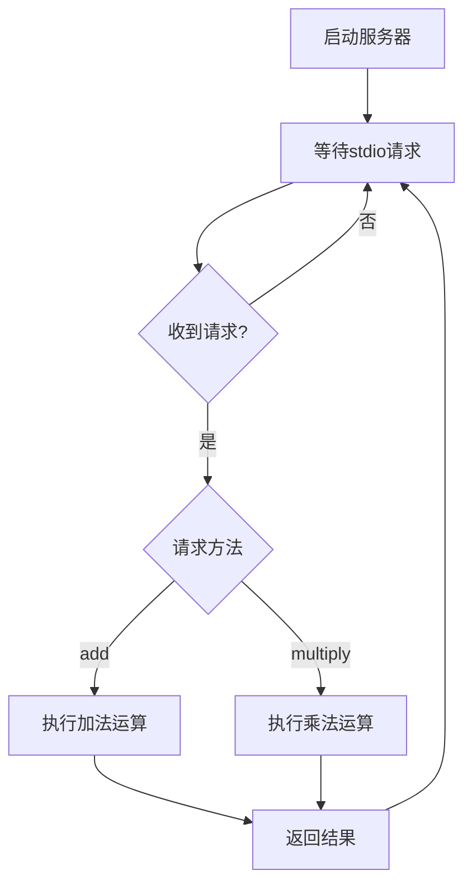
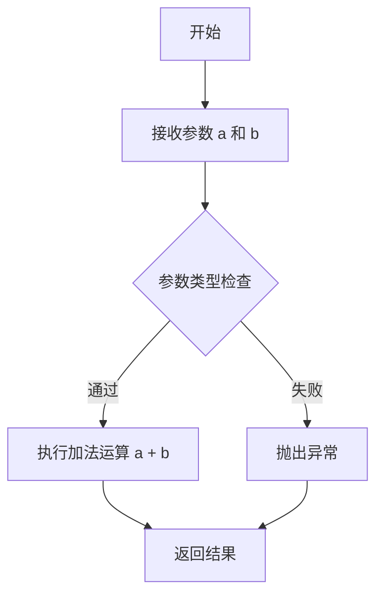
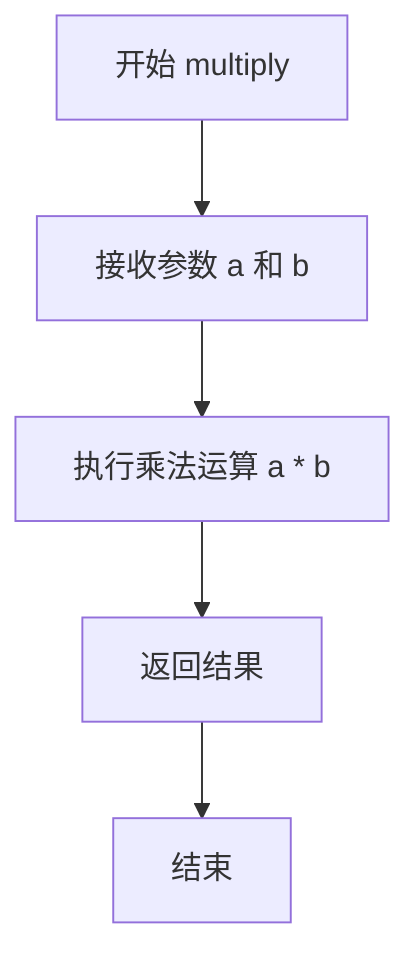

# `Langchain-Chatchat\libs\chatchat-server\tests\integration_tests\mcp_platform_tools\math_server.py` 详细设计文档

这是一个基于FastMCP框架的简单Math计算服务器，通过stdio传输协议提供加法和乘法两个数学工具函数，供MCP客户端调用。

## 整体流程



## 类结构

```
FastMCP Server
└── Math Server Instance
    ├── add tool
    └── multiply tool
```

## 全局变量及字段


### `mcp`
    
FastMCP服务器实例

类型：`FastMCP`
    


    

## 全局函数及方法


### `add`

一个简单的加法工具函数，接收两个整数参数并返回它们的和。

参数：

- `a`：`int`，第一个加数
- `b`：`int`，第二个加数

返回值：`int`，两个整数相加的结果

#### 流程图



#### 带注释源码

```python
@mcp.tool()                              # 装饰器：注册为 MCP 工具
def add(a: int, b: int) -> int:          # 函数定义：接收两个整数参数，返回整数
    """Add two numbers"""                # 函数文档字符串：描述函数功能
    return a + b                         # 返回值：两个整数相加的结果
```


### `multiply`

乘法工具函数，用于接收两个整数参数并返回它们的乘积。该函数作为MCP服务器的tool被注册，可被客户端远程调用执行基本的乘法运算。

参数：

- `a`：`int`，第一个乘数
- `b`：`int`，第二个乘数

返回值：`int`，两个数的乘积结果

#### 流程图



#### 带注释源码

```python
@mcp.tool()  # 装饰器：将该函数注册为MCP服务器的tool
def multiply(a: int, b: int) -> int:
    """Multiply two numbers"""
    return a * b
```

## 关键组件


### FastMCP 服务器实例

使用 FastMCP 框架创建的数学服务服务器，实例名称为 "Math"，通过 stdio 传输方式运行，负责注册和管理工具函数。

### add 工具函数

简单的加法运算工具，接收两个整数参数 a 和 b，返回它们的和。

### multiply 工具函数

简单的乘法运算工具，接收两个整数参数 a 和 b，返回它们的乘积。


## 问题及建议


### 已知问题

- 缺少输入验证机制，未对参数类型和取值范围进行校验
- 完全没有错误处理和异常捕获逻辑
- 缺少日志记录和监控功能，无法追踪调用和排查问题
- docstring 过于简单，未说明参数范围、异常情况和使用示例
- 没有任何测试代码（单元测试、集成测试）
- 缺少依赖版本约束管理
- 函数功能扩展性差，新增数学运算需直接修改代码
- 传输层仅配置为 "stdio"，缺乏灵活性

### 优化建议

- 引入 Pydantic 或类型校验库，对函数参数进行运行时类型和范围验证
- 添加 try-except 异常处理，捕获并记录可能的异常情况
- 集成标准日志模块（logging），记录函数调用、参数和执行结果
- 完善文档字符串，包含参数说明、返回值说明、异常说明和使用示例
- 添加单元测试用例，使用 pytest 或 unittest 框架
- 在 requirements.txt 或 pyproject.toml 中明确依赖版本号
- 考虑使用配置驱动的方式注册工具函数，提高可扩展性
- 评估是否需要支持其他传输层（如 SSE、HTTP）以适应不同部署场景

## 其它


### 设计目标与约束

本项目的设计目标是创建一个轻量级的数学计算MCP服务器，通过标准输入输出（stdio）传输协议提供基本的数学运算服务。核心约束包括：使用FastMCP框架构建，保持代码简洁性，仅支持加法和乘法两种基础运算，参数类型限定为整数（int），返回值类型统一为整数（int），服务器通过stdio传输进行通信。

### 错误处理与异常设计

当前代码未实现显式的错误处理机制。设计建议如下：
- **输入验证**：由于参数类型已声明为int，框架会自动进行类型检查
- **整数溢出**：Python的int类型支持大整数，理论上无溢出问题，但需注意业务层面的数值范围约束
- **异常传播**：框架会自动捕获函数异常并返回错误信息给客户端
- **建议改进**：可添加数值范围检查（如限制参数在特定范围内）以防止恶意输入

### 数据流与状态机

- **数据流向**：客户端请求 → stdio传输 → FastMCP框架 → 工具函数 → 返回结果 → stdio传输 → 客户端
- **状态机**：服务器启动后处于监听状态（Listening），接收到请求时进入处理状态（Processing），处理完成后返回监听状态
- **无状态设计**：当前实现为无状态服务，每次请求独立处理，不涉及会话管理或状态持久化

### 外部依赖与接口契约

- **核心依赖**：`mcp.server.fastmcp` 包，版本需与MCP协议兼容
- **接口契约**：
  - 传输协议：stdio（标准输入输出）
  - 通信格式：JSON-RPC（由MCP框架自动处理）
  - 工具函数签名：函数名作为工具标识，参数名称和类型需严格匹配
- **第三方库**：无其他外部依赖

### 性能考虑

- **轻量级设计**：代码量极小，初始化快速，内存占用低
- **计算复杂度**：加法和乘法均为O(1)时间复杂度
- **并发处理**：FastMCP框架支持多请求处理，但stdio传输为同步模式
- **优化空间**：当前实现已足够轻量，无需特殊优化

### 安全性考虑

- **输入验证**：依赖框架的类型声明，建议增加业务层参数校验
- **数值范围**：可考虑添加最大最小值限制防止资源耗尽
- **日志记录**：当前无日志记录功能，生产环境建议添加审计日志
- **沙箱隔离**：建议在隔离环境中运行敏感操作

### 部署与配置

- **运行方式**：作为独立进程运行，通过stdio与父进程通信
- **启动命令**：`python math_server.py`
- **环境要求**：Python 3.8+，`mcp` 包
- **配置方式**：当前无外部配置文件，框架配置使用默认参数

### 测试策略

- **单元测试**：建议为add和multiply函数编写单元测试，验证各种输入组合
- **集成测试**：测试服务器启动、stdio通信、工具调用完整流程
- **边界测试**：测试大整数、负数、零值等边界条件
- **错误场景**：测试类型错误、参数缺失等异常情况

    