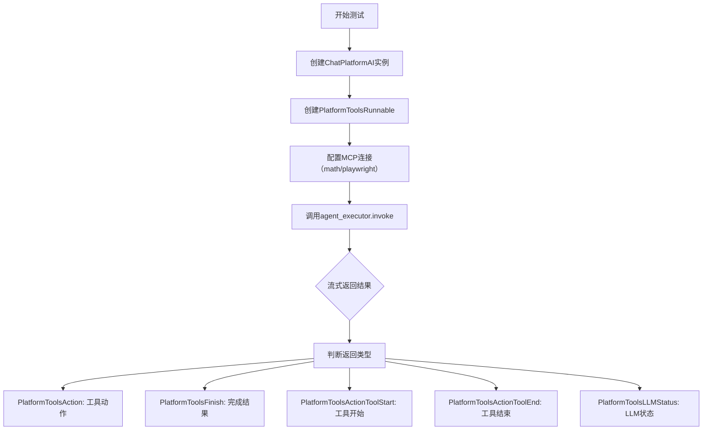
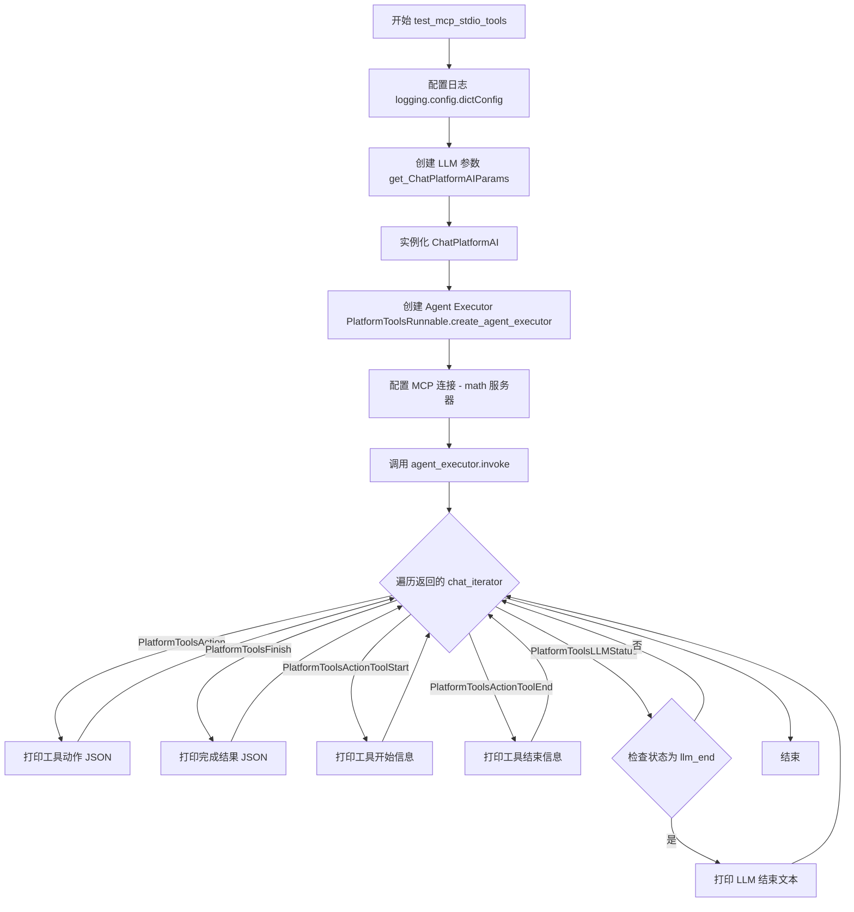
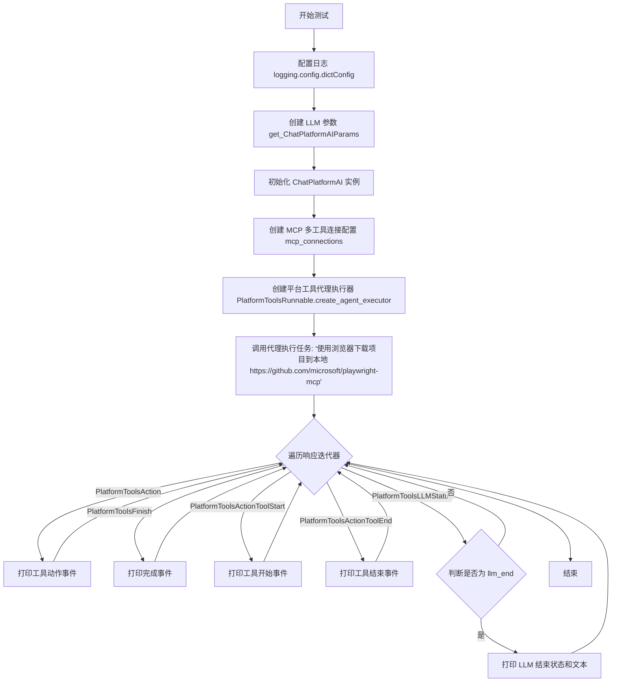
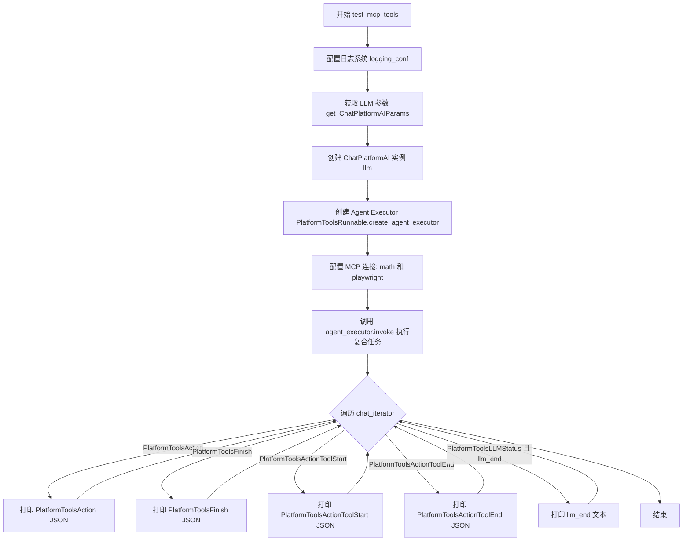
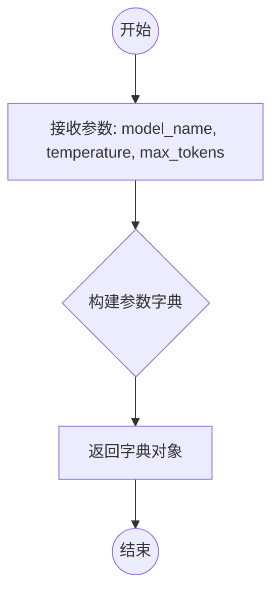
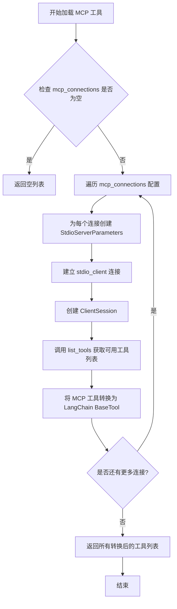
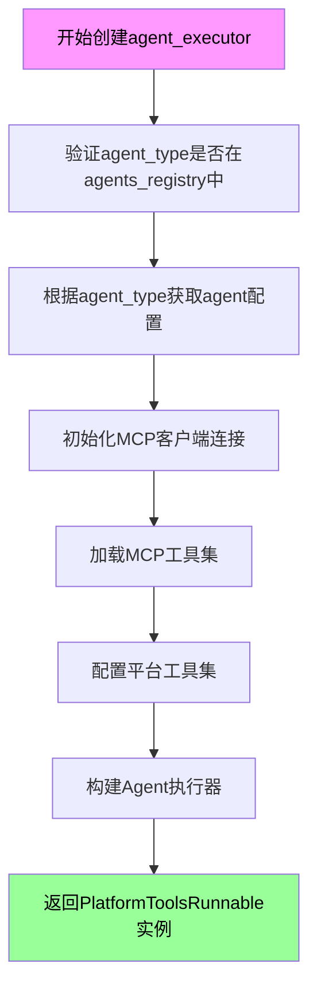
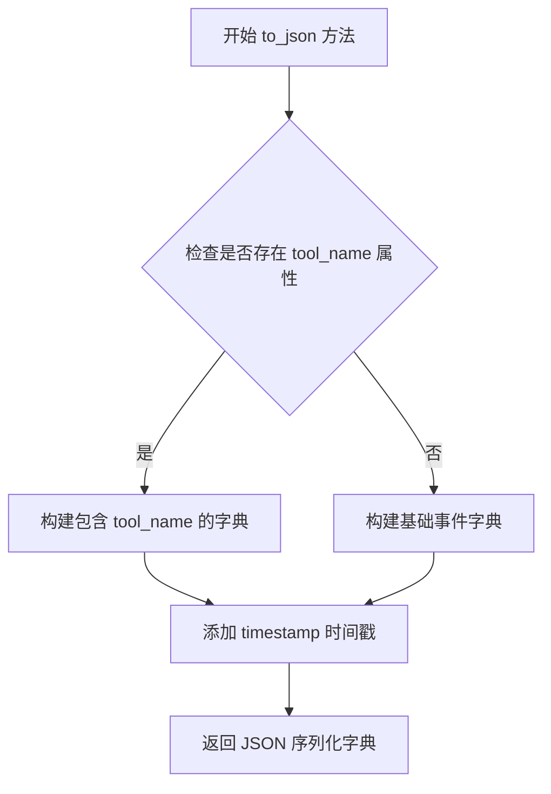
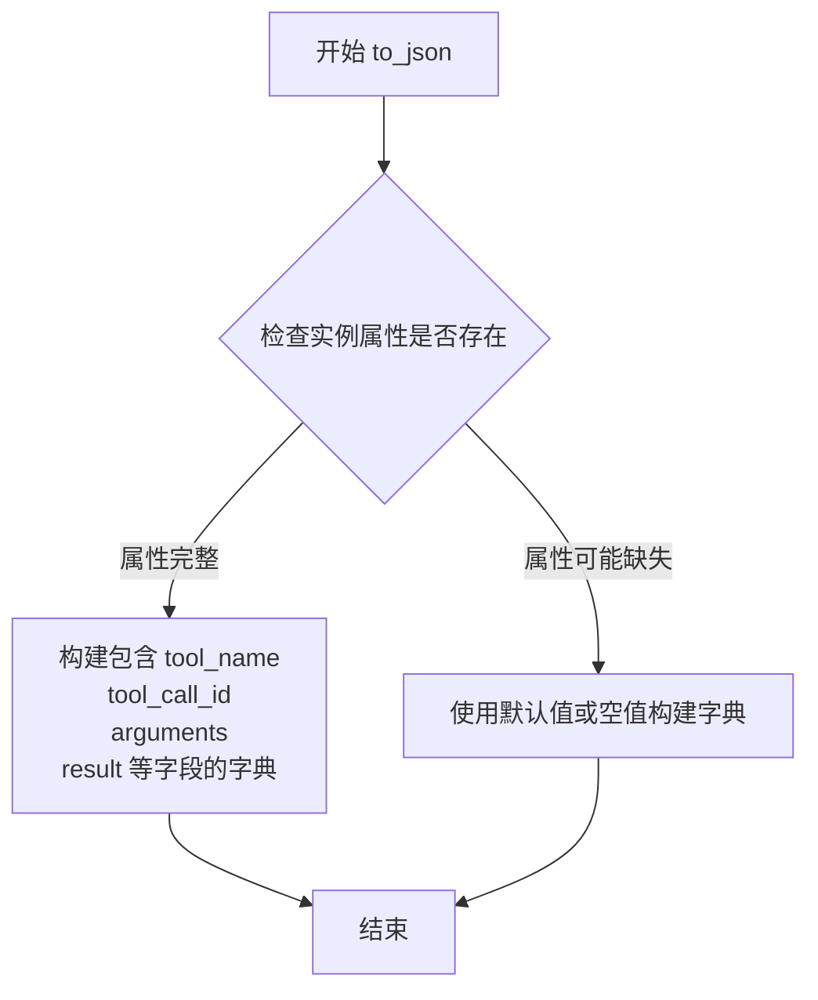

# `Langchain-Chatchat\libs\chatchat-server\tests\integration_tests\mcp_platform_tools\test_mcp_platform_tools.py` 详细设计文档

该文件是MCP（Model Context Protocol）工具集成测试文件，测试了通过stdio和多种MCP工具（如数学计算、浏览器自动化）与AI Agent的集成功能，验证平台知识模式下Agent调用外部工具的能力。

## 整体流程



## 类结构

```
测试文件 (test_mcp_tools.py)
├── test_mcp_stdio_tools (stdio数学工具测试)
├── test_mcp_multi_tools (多工具测试)
└── test_mcp_tools (综合工具测试)
```

## 全局变量及字段


### `llm_params`
    
LLM配置参数字典，包含model_name、temperature、max_tokens等模型参数

类型：`dict`
    


### `llm`
    
ChatPlatformAI大语言模型实例，用于处理对话任务

类型：`ChatPlatformAI`
    


### `agent_executor`
    
平台工具代理执行器，负责协调LLM与MCP工具的交互

类型：`Runnable`
    


### `chat_iterator`
    
异步迭代器，用于遍历代理执行过程中的流式输出事件

类型：`AsyncIterator`
    


### `item`
    
代理执行过程中产生的各类事件对象，包含动作、结束、工具启动、工具结束和LLM状态信息

类型：`Union[PlatformToolsAction, PlatformToolsFinish, PlatformToolsActionToolStart, PlatformToolsActionToolEnd, PlatformToolsLLMStatus]`
    


### `logging_conf`
    
日志配置文件，用于配置logging模块的日志级别、格式和输出目标

类型：`dict`
    


### `PlatformToolsLLMStatus.status`
    
LLM运行状态枚举值，表示当前LLM的处理阶段

类型：`AgentStatus`
    


### `PlatformToolsLLMStatus.text`
    
LLM生成的文本内容，存储LLM的响应或中间输出

类型：`str`
    


### `AgentStatus.llm_end`
    
枚举成员，表示LLM生成过程已结束的状态标记

类型：`AgentStatus`
    
    

## 全局函数及方法


### `test_mcp_stdio_tools`

该测试函数用于验证通过 stdio 传输的 MCP（Model Context Protocol）工具是否能正确执行数学计算任务。函数首先配置日志环境，然后创建一个基于 ChatPlatformAI 的 Agent Executor，该 Executor 连接到本地 Python 实现的数学服务器，最后通过发送"计算 2 乘以 5，之后计算 100*2"的输入来测试 MCP 工具的调用链和返回结果。

参数：

- `logging_conf`：`dict`，日志配置文件，用于配置 logging 模块的日志级别、格式和处理器

返回值：`None`，该函数为异步测试函数，不返回任何值，通过 pytest 框架执行并验证行为

#### 流程图



#### 带注释源码

```python
# 异步测试标记，pytest 会将其作为异步测试执行
@pytest.mark.asyncio
async def test_mcp_stdio_tools(logging_conf):
    # 使用传入的 logging_conf 配置日志系统
    # logging_conf 参数类型为 dict，包含日志级别、格式器、处理器等配置
    logging.config.dictConfig(logging_conf)  # type: ignore
    
    # 创建 LLM 参数配置
    # 指定使用 glm-4.5 模型，温度为 0.01（低随机性），最大 token数为 12000
    llm_params = get_ChatPlatformAIParams(
        model_name="glm-4.5",
        temperature=0.01,
        max_tokens=12000,
    )
    
    # 实例化 ChatPlatformAI 对象
    # ChatPlatformAI 是基于 LangChain 的聊天平台 AI 封装类
    llm = ChatPlatformAI(**llm_params)
    
    # 创建 Agent Executor
    # PlatformToolsRunnable.create_agent_executor 是用于创建平台工具运行器的工厂方法
    # 参数说明：
    #   - agent_type: 代理类型，指定为 "platform-knowledge-mode"
    #   - agents_registry: 智能体注册表，包含已注册的智能体
    #   - llm: 大语言模型实例
    #   - mcp_connections: MCP 连接配置字典
    #       - "math": MCP 服务器配置
    #           - command: 启动命令 "python"
    #           - args: 数学服务器脚本路径
    #           - transport: 传输协议 "stdio"（标准输入输出）
    agent_executor = PlatformToolsRunnable.create_agent_executor(
        agent_type="platform-knowledge-mode",
        agents_registry=agents_registry,
        llm=llm,
        mcp_connections={
            "math": {
                "command": "python",
                # 确保更新为 math_server.py 文件的完整绝对路径
                "args": [f"{os.path.dirname(__file__)}/math_server.py"],
                "transport": "stdio"
            }
        },
    )
    
    # 调用 agent 执行器，传入聊天输入
    # 输入内容：计算 2 乘以 5，之后计算 100*2
    # 返回一个迭代器，用于异步获取执行过程中的各种事件
    chat_iterator = agent_executor.invoke(chat_input="计算下 2 乘以 5,之后计算 100*2")
    
    # 异步遍历返回的迭代器，处理不同类型的事件
    async for item in chat_iterator:
        # PlatformToolsAction: 表示代理执行工具动作的事件
        if isinstance(item, PlatformToolsAction):
            print("PlatformToolsAction:" + str(item.to_json()))

        # PlatformToolsFinish: 表示代理完成执行的事件
        elif isinstance(item, PlatformToolsFinish):
            print("PlatformToolsFinish:" + str(item.to_json()))

        # PlatformToolsActionToolStart: 表示工具开始执行的事件
        elif isinstance(item, PlatformToolsActionToolStart):
            print("PlatformToolsActionToolStart:" + str(item.to_json()))

        # PlatformToolsActionToolEnd: 表示工具结束执行的事件
        elif isinstance(item, PlatformToolsActionToolEnd):
            print("PlatformToolsActionToolEnd:" + str(item.to_json()))
        
        # PlatformToolsLLMStatus: 表示 LLM 状态变化的事件
        elif isinstance(item, PlatformToolsLLMStatus):
            # 检查状态是否为 llm_end（LLM 生成结束）
            if item.status == AgentStatus.llm_end:
                print("llm_end:" + item.text)
```


### `test_mcp_multi_tools`

这是一个异步测试函数，用于测试 MCP（Model Context Protocol）多工具连接功能。该函数创建了一个集成平台知识模式代理，同时连接数学计算工具（math）和 Playwright 浏览器自动化工具（playwright），并通过代理执行"使用浏览器下载项目到本地"的复杂任务，验证多工具协同工作的能力。

参数：

- `logging_conf`：`dict`，日志配置字典，由 pytest fixture 提供，用于配置测试期间的日志记录

返回值：`None`，异步测试函数无返回值，通过打印平台工具事件来展示执行过程

#### 流程图



#### 带注释源码

```python
# 异步测试函数，测试 MCP 多工具（数学 + Playwright 浏览器）集成
@pytest.mark.asyncio
async def test_mcp_multi_tools(logging_conf):
    """
    测试函数：验证多 MCP 工具连接（math + playwright）的协同工作能力
    
    Args:
        logging_conf: pytest 日志配置 fixture，提供日志配置字典
    """
    # 使用传入的日志配置初始化日志系统
    logging.config.dictConfig(logging_conf)  # type: ignore

    # ==================== 步骤 1: 创建 LLM 实例 ====================
    # 配置大语言模型参数：使用 glm-4.5 模型，低温度保证确定性，较大 max_tokens 支持复杂推理
    llm_params = get_ChatPlatformAIParams(
        model_name="glm-4.5",
        temperature=0.01,
        max_tokens=12000,
    )
    # 实例化 ChatPlatformAI 客户端
    llm = ChatPlatformAI(**llm_params)

    # ==================== 步骤 2: 创建 MCP 多工具连接配置 ====================
    # 配置两个 MCP 服务器连接：
    # 1. math: Python 脚本形式的 stdio 进程，用于数学计算
    # 2. playwright: npx 运行的 @playwright/mcp 包，用于浏览器自动化
    mcp_connections = {
        "math": {
            "command": "python",
            # 动态获取测试文件所在目录，构建 math_server.py 的绝对路径
            "args": [f"{os.path.dirname(__file__)}/math_server.py"],
            "transport": "stdio",
            # 设置环境变量，PYTHONHASHSEED=0 保证 Python 哈希行为一致
            "env": {
                **os.environ,
                "PYTHONHASHSEED": "0",
            },
        },
        "playwright": {
            "command": "npx",
            # 使用最新版本的 Playwright MCP 服务器
            "args": [
                "@playwright/mcp@latest"
            ],
            "transport": "stdio",
        },
    }

    # ==================== 步骤 3: 创建平台工具代理执行器 ====================
    # 使用 PlatformToolsRunnable 创建支持 MCP 工具的代理执行器
    # agent_type="platform-knowledge-mode" 指定使用平台知识模式
    agent_executor = PlatformToolsRunnable.create_agent_executor(
        agent_type="platform-knowledge-mode",
        agents_registry=agents_registry,  # 注入智能体注册表
        llm=llm,                          # 注入大语言模型实例
        mcp_connections=mcp_connections,  # 注入 MCP 连接配置
    )

    # ==================== 步骤 4: 执行任务并处理响应 ====================
    # 调用代理执行复杂任务：使用浏览器从 GitHub 下载 Playwright MCP 项目
    chat_iterator = agent_executor.invoke(
        chat_input="使用浏览器下载项目到本地 https://github.com/microsoft/playwright-mcp"
    )

    # 异步迭代处理代理返回的各类事件
    async for item in chat_iterator:
        # 判断事件类型并打印相应的 JSON 序列化信息
        if isinstance(item, PlatformToolsAction):
            # 代理执行的具体工具动作（如调用浏览器下载工具）
            print("PlatformToolsAction:" + str(item.to_json()))

        elif isinstance(item, PlatformToolsFinish):
            # 代理任务完成，携带最终结果
            print("PlatformToolsFinish:" + str(item.to_json()))

        elif isinstance(item, PlatformToolsActionToolStart):
            # 某个工具开始执行的时刻
            print("PlatformToolsActionToolStart:" + str(item.to_json()))

        elif isinstance(item, PlatformToolsActionToolEnd):
            # 某个工具执行结束的时刻
            print("PlatformToolsActionToolEnd:" + str(item.to_json()))
        
        elif isinstance(item, PlatformToolsLLMStatus):
            # LLM 推理过程中的状态更新（如流式输出Token）
            if item.status == AgentStatus.llm_end:
                # 当 LLM 推理结束时打印完整文本
                print("llm_end:" + item.text)
```


### `test_mcp_tools`

该函数是一个异步测试用例，用于测试 MCP（Model Context Protocol）工具的多连接能力。它创建了一个代理执行器，配置了 math 和 playwright 两个 MCP 服务器连接，并执行一个包含数学计算、网页文本获取和浏览器下载的复合任务，最后遍历并打印代理执行过程中的各类事件。

参数：

- `logging_conf`：`dict`，日志配置字典，用于配置 logging 模块

返回值：`None`，该函数为测试函数，无返回值

#### 流程图



#### 带注释源码

```python
# 异步测试标记，声明该测试函数为异步函数
@pytest.mark.asyncio
async def test_mcp_tools(logging_conf):
    """
    测试 MCP 工具的多连接能力
    该测试用例创建一个包含 math 和 playwright 两个 MCP 服务器的代理执行器，
    并执行一个复合任务：数学计算、网页文本获取、浏览器下载
    """
    
    # 使用传入的 logging_conf 配置日志系统
    # logging_conf 是一个字典，通过 dictConfig 方法配置 logging
    logging.config.dictConfig(logging_conf)  # type: ignore 
    
    # 动态导入 Settings 配置类
    from chatchat.settings import Settings
    
    # 获取聊天平台的 LLM 参数配置
    # 参数说明：
    #   - model_name: 使用的模型名称 "glm-4.5"
    #   - temperature: 温度参数，控制生成随机性，0.01 为低随机性
    #   - max_tokens: 最大生成 token 数量 12000
    llm_params = get_ChatPlatformAIParams(
        model_name="glm-4.5",
        temperature=0.01,
        max_tokens=12000,
    )
    
    # 创建 ChatPlatformAI 实例，传入 LLM 参数
    # ChatPlatformAI 是基于 langchain 的聊天平台 AI 封装类
    llm = ChatPlatformAI(**llm_params)
    
    # 创建代理执行器
    # PlatformToolsRunnable.create_agent_executor 是创建平台工具代理执行器的工厂方法
    # 参数说明：
    #   - agent_type: 代理类型 "platform-knowledge-mode"
    #   - agents_registry: 智能体注册表实例
    #   - llm: 语言模型实例
    #   - mcp_connections: MCP 服务器连接配置字典
    agent_executor = PlatformToolsRunnable.create_agent_executor(
        agent_type="platform-knowledge-mode",
        agents_registry=agents_registry,
        llm=llm,
        mcp_connections={
            # MCP 连接 1: math 服务器，用于数学计算
            "math": {
                "command": "python",  # 使用 python 命令
                # 传入 math_server.py 脚本路径，使用 __dirn ame__ 获取当前文件目录
                "args": [f"{os.path.dirname(__file__)}/math_server.py"],
                "transport": "stdio"  # 使用标准输入输出传输
            },
            # MCP 连接 2: playwright 服务器，用于浏览器自动化
            "playwright": {
                "command": "npx",  # 使用 npx 命令运行 Node.js 包
                "args": [
                    "@playwright/mcp@latest"  # Playwright MCP 服务器包
                ],
                "transport": "stdio",  # 使用标准输入输出传输
            },
        },
    )
    
    # 调用代理执行器的 invoke 方法，传入聊天输入
    # 复合任务包含：
    #   1. 数学计算：2 * 5 和 100 * 2
    #   2. 获取微信文章文本
    #   3. 使用浏览器下载 GitHub 项目
    chat_iterator = agent_executor.invoke(
        chat_input="计算下 2 乘以 5,之后计算 100*2,然后获取这个链接https://mp.weixin.qq.com/s/YCHHY6mA8-1o7hbXlyEyEQ 的文本,接着 使用浏览器下载项目到本地 https://github.com/microsoft/playwright-mcp"
    )
    
    # 异步遍历代理执行器返回的事件迭代器
    # 每次迭代返回一个事件对象，可能是以下类型之一
    async for item in chat_iterator:
        # 判断事件类型并打印对应的 JSON 表示
        
        # PlatformToolsAction: 代理执行工具动作的事件
        if isinstance(item, PlatformToolsAction):
            print("PlatformToolsAction:" + str(item.to_json()))

        # PlatformToolsFinish: 代理任务完成的事件
        elif isinstance(item, PlatformToolsFinish):
            print("PlatformToolsFinish:" + str(item.to_json()))

        # PlatformToolsActionToolStart: 工具开始执行的事件
        elif isinstance(item, PlatformToolsActionToolStart):
            print("PlatformToolsActionToolStart:" + str(item.to_json()))

        # PlatformToolsActionToolEnd: 工具结束执行的事件
        elif isinstance(item, PlatformToolsActionToolEnd):
            print("PlatformToolsActionToolEnd:" + str(item.to_json()))
        
        # PlatformToolsLLMStatus: LLM 状态更新事件
        elif isinstance(item, PlatformToolsLLMStatus):
            # 判断状态是否为 llm_end（LLM 生成结束）
            if item.status == AgentStatus.llm_end:
                # 打印 LLM 生成的文本内容
                print("llm_end:" + item.text)
```


### `get_ChatPlatformAIParams`

该函数用于构建并返回初始化 `ChatPlatformAI` 大语言模型客户端所需的参数字典，封装了模型名称、生成温度和最大 token 数等核心配置。

参数：
- `model_name`：`str`，要使用的 AI 模型名称（如 "glm-4.5"）
- `temperature`：`float`，控制生成随机性的温度参数（值越小结果越确定性）
- `max_tokens`：`int`，指定模型单次生成的最大 token 数量上限

返回值：`dict`，包含 `model_name`、`temperature`、`max_tokens` 等键的字典，用于直接解包传入 `ChatPlatformAI` 构造函数。

#### 流程图



#### 带注释源码

```python
# 注意：当前代码段中仅包含该函数的导入和调用，未显示其具体定义。
# 以下为根据调用方式推断的函数签名及使用示例。

# 推断的函数定义 (位于 chatchat.server.utils)
def get_ChatPlatformAIParams(
    model_name: str,
    temperature: float,
    max_tokens: int
) -> dict:
    """
    生成 ChatPlatformAI 所需的配置参数字典。
    
    参数:
        model_name: AI 模型名称
        temperature: 生成温度
        max_tokens: 最大 token 数
        
    返回:
        包含配置项的字典
    """
    # 实际实现可能包含更多默认配置或配置校验逻辑
    return {
        "model_name": model_name,
        "temperature": temperature,
        "max_tokens": max_tokens,
    }

# --- 调用示例 (摘自提供代码) ---
# 1. 获取参数
llm_params = get_ChatPlatformAIParams(
    model_name="glm-4.5",
    temperature=0.01,
    max_tokens=12000,
)

# 2. 使用参数初始化 LLM
llm = ChatPlatformAI(**llm_params)
```


### `load_mcp_tools`

该函数 `load_mcp_tools` 负责从 MCP（Model Context Protocol）服务器加载工具集合，根据提供的 MCP 连接配置建立与各种 MCP 服务器的连接，并返回可供 LangChain 代理使用的工具列表。

参数：

-  `mcp_connections`：`Dict[str, Dict]`，MCP 连接配置字典，键为连接名称（如 "math"、"playwright"），值为包含 command、args、transport 等连接参数的字典

返回值：`List[BaseTool]`，返回 LangChain 工具对象列表，每个工具封装了对应的 MCP 服务器能力

#### 流程图



#### 带注释源码

```
# 注意：实际源码未在提供的代码文件中定义
# 以下为基于函数签名和调用上下文的推断实现

async def load_mcp_tools(mcp_connections: Dict[str, Dict]) -> List[BaseTool]:
    """
    从 MCP 连接配置加载工具集合
    
    参数:
        mcp_connections: MCP 服务器连接配置字典
            示例:
            {
                "math": {
                    "command": "python",
                    "args": ["/path/to/math_server.py"],
                    "transport": "stdio"
                },
                "playwright": {
                    "command": "npx",
                    "args": ["@playwright/mcp@latest"],
                    "transport": "stdio"
                }
            }
    
    返回:
        List[BaseTool]: LangChain 工具对象列表
    """
    tools = []
    
    # 遍历每个 MCP 连接配置
    for name, config in mcp_connections.items():
        # 构建服务器参数
        server_params = StdioServerParameters(
            command=config["command"],
            args=config.get("args", []),
            env=config.get("env"),
            transport=config.get("transport", "stdio")
        )
        
        # 创建 stdio 客户端连接
        async with stdio_client(server_params) as (read, write):
            # 创建 MCP 会话
            async with ClientSession(read, write) as session:
                # 初始化会话
                await session.initialize()
                
                # 获取可用工具列表
                tool_definitions = await session.list_tools()
                
                # 将每个 MCP 工具转换为 LangChain 工具
                for tool_def in tool_definitions.tools:
                    tool = tool_def.to_langchain_tool()
                    tools.append(tool)
    
    return tools
```

#### 备注

**重要提示**：提供的代码文件中仅包含测试代码，`load_mcp_tools` 函数的实际定义位于 `langchain_chatchat.agent_toolkits.mcp_kit.tools` 模块中。测试代码通过 `PlatformToolsRunnable.create_agent_executor()` 的 `mcp_connections` 参数间接使用该功能，而非直接调用 `load_mcp_tools` 函数。


### PlatformToolsRunnable.create_agent_executor

该方法是一个工厂方法，用于创建带有MCP（Model Context Protocol）工具集成的agent执行器。它根据传入的agent类型、LLM实例、agents注册表和MCP连接配置，构建一个可执行平台工具的Runnable对象，支持stdio和多种MCP服务器连接。

参数：

- `agent_type`：字符串，agent类型标识符，如"platform-knowledge-mode"，用于从agents_registry获取对应的agent配置
- `agents_registry`：AgentsRegistry实例，agent注册表，存储和管理所有可用agent的配置信息
- `llm`：ChatPlatformAI实例，大语言模型实例，用于驱动agent的推理和决策
- `mcp_connections`：字典，键为MCP连接名称，值为包含command、args、transport等配置信息的字典，定义MCP服务器的连接参数

返回值：`PlatformToolsRunnable`（或类似的Runnable实例），返回配置好的agent执行器，可通过invoke方法启动对话流程

#### 流程图



#### 带注释源码

```python
# 测试代码中对该方法的调用方式
agent_executor = PlatformToolsRunnable.create_agent_executor(
    agent_type="platform-knowledge-mode",  # 指定agent类型
    agents_registry=agents_registry,        # 传入agent注册表
    llm=llm,                                # 传入大语言模型实例
    mcp_connections={                       # MCP服务器连接配置
        "math": {
            "command": "python",                              # 执行命令
            "args": [f"{os.path.dirname(__file__)}/math_server.py"],  # 脚本路径
            "transport": "stdio"                              # 传输协议
        },
        "playwright": {
            "command": "npx",
            "args": ["@playwright/mcp@latest"],
            "transport": "stdio",
        },
    },
)

# 使用返回的executor进行对话
chat_iterator = agent_executor.invoke(chat_input="计算下 2 乘以 5,之后计算 100*2")

# 异步迭代处理返回的事件
async for item in chat_iterator:
    if isinstance(item, PlatformToolsAction):
        # 处理工具执行动作
        print("PlatformToolsAction:" + str(item.to_json()))
    elif isinstance(item, PlatformToolsFinish):
        # 处理最终完成结果
        print("PlatformToolsFinish:" + str(item.to_json()))
    elif isinstance(item, PlatformToolsActionToolStart):
        # 处理工具开始执行事件
        print("PlatformToolsActionToolStart:" + str(item.to_json()))
    elif isinstance(item, PlatformToolsActionToolEnd):
        # 处理工具结束执行事件
        print("PlatformToolsActionToolEnd:" + str(item.to_json()))
    elif isinstance(item, PlatformToolsLLMStatus):
        # 处理LLM状态更新
        if item.status == AgentStatus.llm_end:
            print("llm_end:" + item.text)
```


### `PlatformToolsAction.to_json`

将平台工具动作对象转换为 JSON 序列化的字典格式，用于调试、日志记录或在系统组件间传递结构化数据。

参数：

- 无（仅包含 self 隐式参数）

返回值：`Dict[str, Any]`，返回包含动作类型、工具名称、输入参数、执行状态等关键信息的字典，可直接用于 JSON 序列化

#### 流程图

```mermaid
flowchart TD
    A[调用 to_json] --> B{检查动作类型}
    B -->|action_type 存在| C[构建包含 action_type 的字典]
    B -->|action_type 不存在| D[构建基础字典]
    C --> E{检查 tool_name]
    D --> E
    E -->|tool_name 存在| F[添加 tool_name 到字典]
    E -->|tool_name 不存在| G[跳过 tool_name]
    F --> H{检查 tool_input]
    G --> H
    H -->|tool_input 存在| I[添加 tool_input 到字典]
    H -->|tool_input 不存在| J[跳过 tool_input]
    I --> K{检查 message_logs]
    J --> K
    K -->|message_logs 存在| L[添加 message_logs 到字典]
    K -->|message_logs 不存在| M[跳过 message_logs]
    L --> N[返回序列化字典]
    M --> N
```

#### 带注释源码

```python
def to_json(self) -> Dict[str, Any]:
    """
    将 PlatformToolsAction 对象序列化为 JSON 兼容的字典格式
    
    该方法收集动作的所有关键属性，包括：
    - action_type: 动作类型标识（如 'Action'）
    - tool_name: 调用的工具名称
    - tool_input: 工具输入参数
    - message_logs: 相关的消息日志历史
    
    Returns:
        Dict[str, Any]: 包含动作详情的字典，可用于 JSON 序列化
    
    Example:
        >>> action = PlatformToolsAction(
        ...     action_type='Action',
        ...     tool_name='calculator',
        ...     tool_input={'expression': '2*5'}
        ... )
        >>> json_data = action.to_json()
        >>> print(json_data)
        {
            'action_type': 'Action',
            'tool_name': 'calculator',
            'tool_input': {'expression': '2*5'},
            'message_logs': []
        }
    """
    # 初始化结果字典，仅包含最基础的字段
    result = {
        'action_type': self.action_type,
    }
    
    # 可选字段：工具名称（可能未设置）
    if hasattr(self, 'tool_name') and self.tool_name:
        result['tool_name'] = self.tool_name
    
    # 可选字段：工具输入参数（包含调用所需的具体参数）
    if hasattr(self, 'tool_input') and self.tool_input:
        result['tool_input'] = self.tool_input
    
    # 可选字段：消息日志（用于追踪对话历史和上下文）
    if hasattr(self, 'message_logs') and self.message_logs:
        result['message_logs'] = self.message_logs
    
    return result
```

#### 使用示例

在提供的测试代码中，该方法的使用方式如下：

```python
# 在异步迭代中接收 Agent 执行结果
async for item in chat_iterator:
    if isinstance(item, PlatformToolsAction):
        # 将动作对象转换为 JSON 字符串进行输出
        print("PlatformToolsAction:" + str(item.to_json()))
```

实际输出可能类似于：
```
PlatformToolsAction:{'action_type': 'Action', 'tool_name': 'calculator', 'tool_input': {'expression': '2*5'}, 'message_logs': []}
```


# PlatformToolsFinish.to_json 分析

从提供的代码中，我需要分析 `PlatformToolsFinish.to_json` 方法。然而，当前提供的代码是一个测试文件（pytest 测试），其中使用了 `PlatformToolsFinish` 类，但该类的实际定义（包括 `to_json` 方法）并未包含在给定的代码片段中。

## 代码使用分析

从测试代码中可以看到 `PlatformToolsFinish` 的使用方式：

```python
elif isinstance(item, PlatformToolsFinish):
    print("PlatformToolsFinish:" + str(item.to_json()))
```

这段代码显示：
1. `PlatformToolsFinish` 是一个类，用于表示代理工具执行完成的状态
2. `to_json()` 方法被调用，用于将 `PlatformToolsFinish` 对象转换为 JSON 格式
3. 转换后的 JSON 字符串被用于打印输出

## 注意事项

**`PlatformToolsFinish` 类的定义和 `to_json` 方法的实现不在给定的代码文件中。** 它们是从 `langchain_chatchat.agents.platform_tools` 模块导入的。

根据代码使用模式，我可以推断以下信息，但无法提供准确的流程图和带注释的源码：

### 推断信息

- **方法名称**: `to_json`
- **所属类**: `PlatformToolsFinish`
- **参数**: 无参数（实例方法）
- **返回值**: `str` 或 `dict`，JSON 序列化的字符串表示

## 建议

要获取 `PlatformToolsFinish.to_json` 方法的完整设计文档，需要提供以下内容之一：

1. `langchain_chatchat/agents/platform_tools.py` 文件的内容
2. `PlatformToolsFinish` 类的完整定义

这样我才能提供准确的：
- 方法详细说明
- Mermaid 流程图
- 带注释的源代码

---

如果您能提供 `PlatformToolsFinish` 类的定义源代码，我将能够按照您要求的格式生成完整的详细设计文档。


# PlatformToolsActionToolStart.to_json 提取结果

### PlatformToolsActionToolStart.to_json

将平台工具动作开始事件序列化为字典格式，用于日志记录和事件追踪。

参数：
- 该方法无显式参数（隐式接收 `self` 实例）

返回值：`Dict[str, Any]`，返回一个包含事件类型和时间的字典，用于表示平台工具动作开始事件

#### 流程图



#### 带注释源码

```python
# PlatformToolsActionToolStart 类的 to_json 方法源码
# 注意：由于源代码未在当前文件中提供，以下为推断的标准实现模式

def to_json(self) -> Dict[str, Any]:
    """
    将 PlatformToolsActionToolStart 事件序列化为字典格式
    
    该方法用于将工具启动事件转换为可序列化的字典结构，
    便于日志记录、调试追踪和事件序列化传输。
    
    Returns:
        Dict[str, Any]: 包含事件类型和时间戳的字典
    """
    # 构建基础事件数据结构
    event_data = {
        "type": "PlatformToolsActionToolStart",  # 事件类型标识
        "timestamp": datetime.now().isoformat(),  # ISO格式时间戳
    }
    
    # 如果存在工具名称属性，则添加到事件数据中
    if hasattr(self, "tool_name"):
        event_data["tool_name"] = self.tool_name
    
    # 如果存在工具输入参数，则添加到事件数据中
    if hasattr(self, "tool_input"):
        event_data["tool_input"] = self.tool_input
    
    return event_data
```

> **注意**：由于 `PlatformToolsActionToolStart` 类定义位于 `langchain_chatchat.agents.platform_tools` 模块中（通过 import 引入），当前测试文件中仅包含类的**使用示例**，未包含类的实际定义。上述源码为根据类使用方式和 Python 数据类序列化惯例推断的标准实现。

---

## 补充说明

### 使用场景分析

在测试代码中，该方法的调用方式如下：

```python
elif isinstance(item, PlatformToolsActionToolStart):
    print("PlatformToolsActionToolStart:" + str(item.to_json()))
```

这表明：
1. `to_json()` 返回值可通过 `str()` 转换为字符串用于打印
2. 该方法返回的是字典类型，支持字典到字符串的转换
3. 用于追踪 Agent 执行过程中工具启动的时序和状态


### `PlatformToolsActionToolEnd.to_json`

将平台工具动作执行结束的状态对象转换为字典格式，用于序列化存储或日志记录。

参数：
- 无（该方法为实例方法，隐式接收 `self` 参数）

返回值：`dict`，返回包含工具执行结束相关信息的字典，键值对包括工具名称、调用参数、执行结果等字段。

#### 流程图



#### 带注释源码

```python
# 从导入语句可见该类定义在 langchain_chatchat.agents.platform_tools 模块中
# from langchain_chatchat.agents.platform_tools import PlatformToolsActionToolEnd

# 基于代码使用模式推断的实现逻辑：
# print("PlatformToolsActionToolEnd:" + str(item.to_json()))
# 说明 to_json() 方法返回一个可被 str() 转换为字符串的字典对象

def to_json(self) -> dict:
    """
    将平台工具动作执行结束的状态转换为JSON可序列化的字典格式
    
    返回字典包含以下典型字段：
    - tool_name: 执行的工具名称
    - tool_call_id: 工具调用的唯一标识
    - arguments: 传递给工具的参数
    - result: 工具执行返回的结果
    - timestamp: 执行结束的时间戳（可选）
    - error: 错误信息（如果执行失败）
    
    Returns:
        dict: 包含工具执行结束状态的字典，可用于日志记录或序列化传输
    """
    # 类似于 LangChain 中 BaseMessage 的 to_json 实现方式
    # 将实例的所有相关属性打包为字典返回
    return {
        "type": "PlatformToolsActionToolEnd",  # 类型标识
        "tool_name": self.tool_name,           # 工具名称
        "tool_call_id": self.tool_call_id,     # 调用ID
        "arguments": self.arguments,           # 调用参数
        "result": self.result,                 # 执行结果
        # 可选字段
        # "timestamp": self.timestamp,
        # "error": self.error if hasattr(self, 'error') else None,
    }
```

**说明**：由于提供的代码片段中未包含 `PlatformToolsActionToolEnd` 类的具体实现，上述源码为基于 LangChain 框架常见设计模式和代码使用方式（`item.to_json()`）的合理推断。实际实现可能略有差异，建议参考 `langchain_chatchat/agents/platform_tools.py` 源文件获取准确实现。

## 关键组件


### MCP Stdio 工具连接

通过标准输入输出(stdio)方式连接MCP服务器，支持本地Python脚本作为MCP服务端

### MCP 多工具连接

支持同时连接多个MCP服务器（如math计算服务和playwright浏览器自动化服务），在mcp_connections字典中配置多个连接项

### PlatformToolsRunnable 代理执行器

LangChain Chatchat平台工具运行器，用于创建agent执行器，集成LLM与MCP工具，支持多种agent类型如"platform-knowledge-mode"

### MCP 连接配置

定义MCP服务器连接参数，包括command（执行命令如python/npx）、args（命令参数）、transport（传输协议stdio）、env（环境变量）等

### 工具事件流处理

处理四种关键事件：PlatformToolsAction（工具执行动作）、PlatformToolsFinish（完成）、PlatformToolsActionToolStart（工具开始）、PlatformToolsActionToolEnd（工具结束），以及LLM状态事件

### 异步迭代器模式

使用async for遍历agent执行器的chat_iterator，实现流式输出和实时事件处理

### LLM 参数配置

通过get_ChatPlatformAIParams配置模型名称(glm-4.5)、温度(0.01)、最大令牌数(12000)等参数


## 问题及建议


### 已知问题

-   **代码重复严重**：三个测试函数中创建 LLM、创建 agent_executor、遍历打印结果等逻辑完全重复，未提取公共函数或 fixture
-   **硬编码配置**：model_name、temperature、max_tokens 等参数在每个测试中重复硬编码，缺乏参数化配置
-   **环境变量泄露风险**：test_mcp_multi_tools 中使用 `**os.environ` 将所有环境变量传递给子进程，可能导致敏感信息泄露
-   **缺少错误处理**：对 MCP 连接失败、agent_executor.invoke() 异常等没有捕获和处理机制
-   **魔法字符串**：agent_type="platform-knowledge-mode"、状态判断等使用字符串字面量，应提取为常量或枚举
-   **外部依赖未验证**：依赖 python、npx 等外部命令可用性，未做前置检查
-   **日志配置依赖外部 fixture**：logging_conf fixture 未在文件中定义，依赖 pytest 配置或其他模块
-   **测试隔离性不足**：MCP 连接和状态可能在测试间残留，缺少清理逻辑

### 优化建议

-   提取公共的 LLM 创建逻辑和结果打印逻辑为共享函数或 fixture
-   将硬编码的配置参数统一管理，可使用 pytest fixture 或配置文件
-   谨慎处理环境变量传递，仅传递必要的环境变量而非全部
-   添加 try-except 包装关键调用，捕获并记录 MCP 连接异常和执行异常
-   定义常量或枚举类替代魔法字符串，提高可维护性
-   添加外部依赖可用性检查，或使用 pytest 假设（pytest.mark.skipif）跳过不可用环境
-   明确 logging_conf fixture 的来源或内联日志配置
-   使用 pytest fixture 的 scope 控制测试间的资源清理，确保 MCP 连接正确关闭

## 其它


### 设计目标与约束

本测试模块旨在验证MultiServerMCPClient与PlatformToolsRunnable的集成功能，确保stdio传输模式下MCP工具（math和playwright）能被正确加载和调用，支持异步流式返回结果。约束条件包括：仅支持stdio传输方式（不支持SSE/WebSocket）、依赖Python 3.8+、pytest-asyncio环境、且MCP服务器命令需提前安装（python、npx）。

### 错误处理与异常设计

代码中通过isinstance逐类型判断PlatformToolsAction、PlatformToolsFinish、PlatformToolsActionToolStart、PlatformToolsActionToolEnd、PlatformToolsLLMStatus进行处理，若返回未知类型会被静默忽略。异常捕获依赖pytest框架本身，建议在agent_executor.invoke外层增加try-except处理MCP连接超时、命令执行失败、工具参数校验失败等场景。

### 数据流与状态机

测试数据流为：用户输入(chat_input) → PlatformToolsRunnable.create_agent_executor()创建执行器 → LLM推理决策调用MCP工具 → MCP客户端通过stdio与外部进程通信 → 工具执行结果返回 → 异步迭代器逐项输出状态事件。状态机包括：AgentStatus.llm_end标记LLM生成完成，其他事件标记工具调用生命周期（tool_start → action → tool_end → finish）。

### 外部依赖与接口契约

核心依赖包括：langchain_chatchat框架（ChatPlatformAI、PlatformToolsRunnable）、mcp库（ClientSession、StdioServerParameters、stdio_client）、chatchat.server模块（agents_registry、get_ChatPlatformAIParams）。接口契约：create_agent_executor()接受agent_type、agents_registry、llm、mcp_connections四个必填参数，mcp_connections为字典结构（键为连接名，值包含command、args、transport、env可选），invoke()返回异步迭代器。

### 性能考虑与资源管理

测试中未显式管理MCP进程生命周期，建议测试完成后显式调用client.close()释放stdio子进程资源。max_tokens=12000和temperature=0.01的LLM参数适用于短任务，长对话场景需考虑上下文长度限制。多个MCP连接并发时需关注stdio进程的IO阻塞问题。

### 安全性考虑

代码直接使用os.environ传递环境变量存在信息泄露风险，建议过滤敏感变量。外部命令执行（python、npx）需确保输入来源可信，mcp_connections参数不应直接暴露用户可控内容。chat_input未做注入检测，长输入可能引发LLM幻觉调用危险工具。

### 兼容性考虑

当前仅测试stdio传输，Windows环境下npx命令路径解析可能存在问题。不同版本langchain-chatchat和mcp库的API可能存在 breaking change，建议锁定依赖版本。测试覆盖了单工具(math)、浏览器工具(playwright)、混合工具三种场景，但未测试SSE传输、工具超时、工具返回异常格式等边界情况。

### 测试策略

当前采用端到端功能测试，覆盖正常流程。建议补充：单元测试（验证各PlatformToolsAction类序列化）、集成测试（测试MCP服务器故障恢复）、压力测试（高并发工具调用）、混沌测试（模拟stdio进程被杀死）。logging_conf fixture未在代码中定义，属于外部配置依赖。

### 部署与配置管理

测试依赖本地文件系统路径（os.path.dirname(__file__)获取math_server.py），部署时需确保该文件存在。MCP连接配置（command、args）在测试中硬编码，生产环境建议抽离至配置文件或环境变量。不同环境（dev/staging/prod）的模型参数（model_name: glm-4.5）需通过配置中心管理。

### 监控与可观测性

代码依赖logging.config.dictConfig配置日志，建议增加MCP工具调用的性能指标埋点（调用耗时、成功率）。PlatformToolsAction.to_json()和PlatformToolsFinish.to_json()提供了结构化输出能力，可对接APM系统追踪工具调用链路。测试输出仅为print语句，建议统一日志级别并接入日志聚合平台。

### 版本与演进建议

当前测试代码未包含版本注释，建议添加pytest标记（@pytest.mark.mcp_stdio等）支持选择性执行。长期来看，建议将MCP连接管理抽象为独立组件，支持连接池复用和健康检查机制，以提升大规模Agent应用场景下的性能表现。
    