# `Langchain-Chatchat\libs\chatchat-server\tests\integration_tests\platform_tools\test_platform_tools.py` 详细设计文档

这是一个用于测试不同类型LLM Agent与平台工具集成的测试文件，涵盖了openai-functions、platform-agent、glm3、qwen及structured-chat-agent等多种agent类型，通过multiply、add、exp等工具函数验证agent的函数调用能力。

## 整体流程

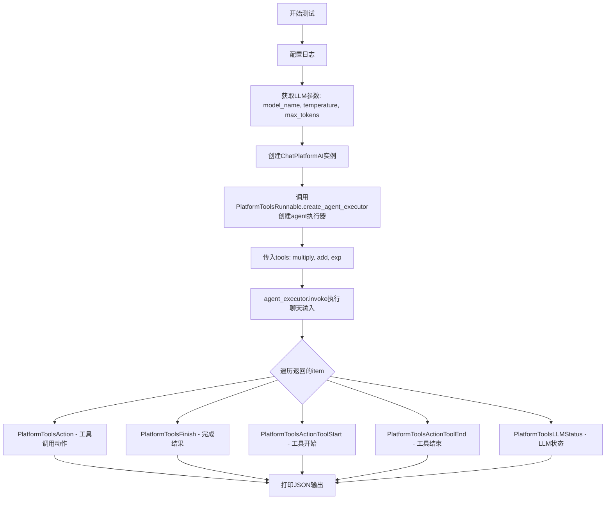

## 类结构

```
测试文件 (test_agent_tools.py)
├── 全局变量: hl (HumanLayer实例)
├── 工具函数 (LangChain @tool装饰器)
│   ├── multiply - 乘法运算
│   ├── add - 加法运算
│   └── exp - 幂运算
└── 测试函数
    ├── test_openai_functions_tools - OpenAI函数代理测试
    ├── test_platform_tools - 平台代理测试
    ├── test_chatglm3_chat_agent_tools - ChatGLM3代理测试
    ├── test_qwen_chat_agent_tools - Qwen代理测试
    ├── test_qwen_structured_chat_agent_tools - Qwen结构化聊天代理测试
    └── test_human_platform_tools - 人类平台工具测试
```

## 全局变量及字段


### `hl`
    
HumanLayer实例，用于人机协作，verbose=True开启详细输出

类型：`HumanLayer`
    


### `logging_conf`
    
日志配置fixture，提供日志配置字典

类型：`dict`
    


### `llm_params`
    
LLM参数字典，包含model_name、temperature、max_tokens等配置

类型：`dict`
    


### `llm`
    
ChatPlatformAI实例，用于与语言模型交互

类型：`ChatPlatformAI`
    


### `agent_executor`
    
Agent执行器实例，负责运行agent并处理工具调用

类型：`AgentExecutor`
    


### `chat_iterator`
    
聊天结果迭代器，异步返回agent执行过程中的各类事件

类型：`AsyncIterator`
    


### `item`
    
迭代中的单个结果项，表示agent执行过程中的不同事件类型

类型：`Union[PlatformToolsAction, PlatformToolsFinish, PlatformToolsActionToolStart, PlatformToolsActionToolEnd, PlatformToolsLLMStatus]`
    


### `HumanLayer.verbose`
    
控制是否输出详细日志信息的布尔标志

类型：`bool`
    


### `PlatformToolsLLMStatus.status`
    
LLM运行状态，指示当前agent执行的具体阶段

类型：`AgentStatus`
    


### `PlatformToolsLLMStatus.text`
    
LLM生成的文本内容

类型：`str`
    


### `AgentStatus.llm_end`
    
枚举成员，表示LLM生成已完成的状态标识

类型：`str`
    
    

## 全局函数及方法


### `multiply`

这是一个简单的乘法工具函数，使用 LangChain 的 `@tool` 装饰器定义，用于将两个整数相乘并返回结果。

**参数：**

- `first_int`：`int`，第一个整数，待相乘的第一个数
- `second_int`：`int`，第二个整数，待相乘的第二个数

**返回值：** `int`，返回两个整数的乘积

#### 流程图

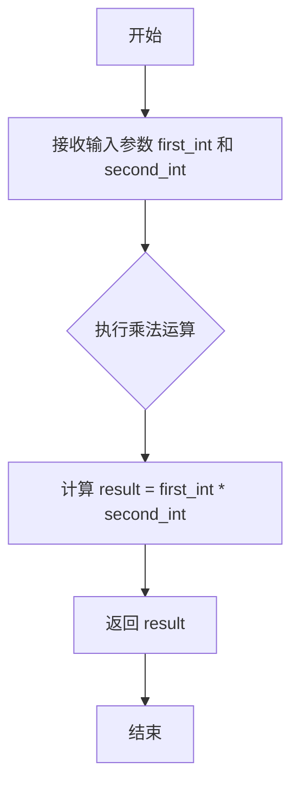

#### 带注释源码

```python
@tool  # LangChain 工具装饰器，将函数注册为可被 LLM 调用的工具
def multiply(first_int: int, second_int: int) -> int:
    """Multiply two integers together."""
    # first_int: 第一个整数输入
    # second_int: 第二个整数输入
    # 返回值: 两个整数的乘积 (int 类型)
    return first_int * second_int  # 执行乘法运算并返回结果
```


### `add`

这是一个简单的加法工具函数，接收两个整数参数并返回它们的和。

**参数：**

- `first_int`：`int`，第一个整数，待相加的第一个数
- `second_int`：`int`，第二个整数，待相加的第二个数

**返回值：** `int`，两个整数相加的结果

#### 流程图

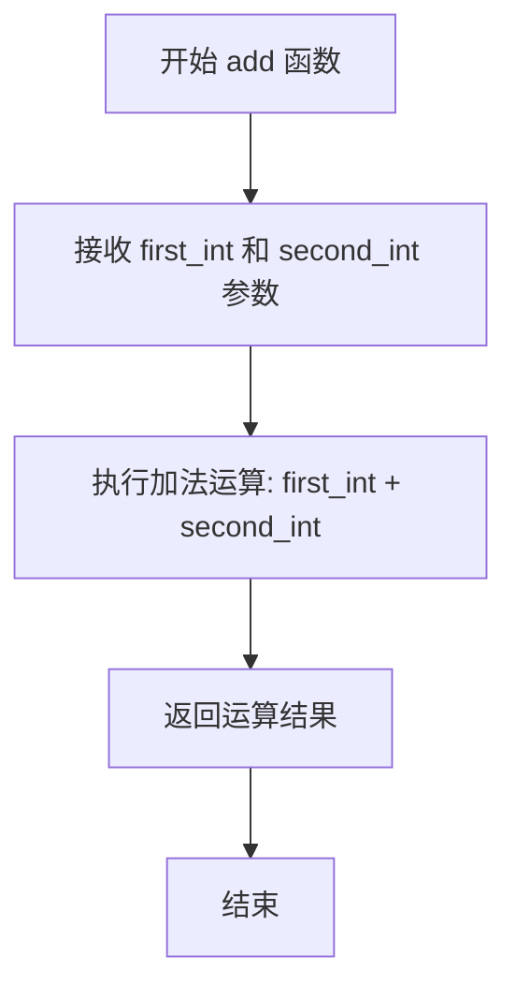

#### 带注释源码

```python
@tool  # LangChain 工具装饰器，将函数注册为可被 LLM 调用的工具
def add(first_int: int, second_int: int) -> int:
    """Add two integers."""  # 工具描述，供 LLM 理解工具用途
    return first_int + second_int  # 返回两个整数的和
```


### `exp`

幂运算工具函数，用于计算 base 的 exponent_num 次幂。

参数：

- `exponent_num`：`int`，指数，表示要计算的幂次
- `base`：`int`，底数，表示被乘的数

返回值：`int`，返回 base 的 exponent_num 次幂的结果

#### 流程图

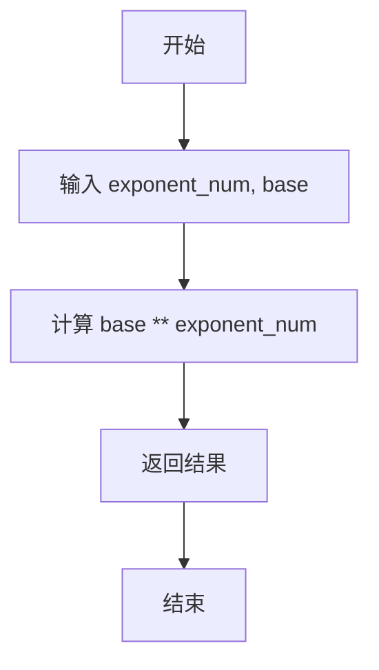

#### 带注释源码

```python
@tool  # 使用 langchain 的 tool 装饰器将该函数注册为可被 LLM 调用的工具
def exp(exponent_num: int, base: int) -> int:
    """
    Exponentiate the base to the exponent power.
    
    参数:
        exponent_num: 指数，表示要计算的幂次
        base: 底数，表示被乘的数
    
    返回:
        base 的 exponent_num 次幂的结果
    """
    return base ** exponent_num  # 使用 Python 的幂运算符 ** 计算幂
```


### `test_openai_functions_tools`

该函数是一个异步测试函数，用于测试基于 openai-functions 类型的 Agent，通过创建一个包含 multiply（乘法）、exp（幂运算）和 add（加法）工具的 Agent 执行器来处理用户输入"计算下 2 乘以 5"，并迭代输出 Agent 执行过程中的各类事件（包括工具调用开始、工具调用结束、LLM 状态和最终结果）。

参数：
- `logging_conf`：`dict`，日志配置字典，用于通过 `logging.config.dictConfig` 配置全局日志系统

返回值：`None`，该函数为异步测试函数，无显式返回值，通过打印事件信息展示 Agent 执行过程

#### 流程图

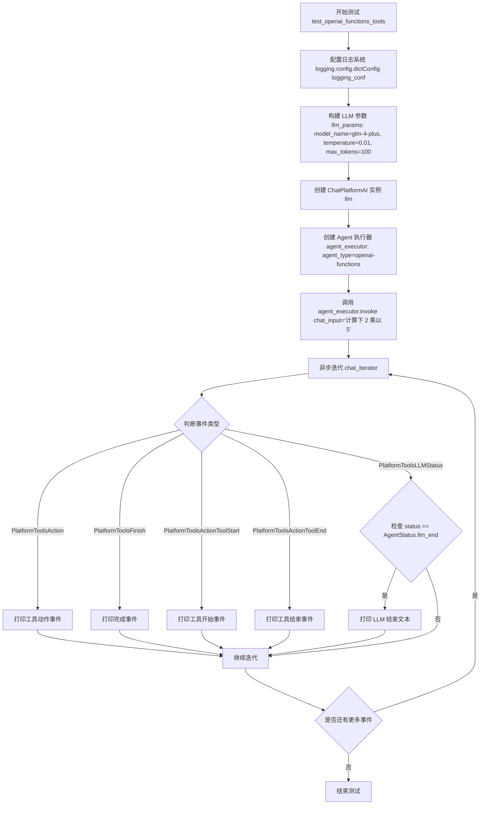

#### 带注释源码

```python
@pytest.mark.asyncio
async def test_openai_functions_tools(logging_conf):
    """
    测试 openai-functions 类型 agent 的功能
    该测试创建一个包含数学工具的 Agent 并验证其工具调用能力
    """
    # 使用传入的日志配置初始化日志系统
    # logging_conf: dict，标准 Python logging 配置字典
    logging.config.dictConfig(logging_conf)  # type: ignore

    # 构建 LLM 调用参数
    # model_name: str，要使用的语言模型名称
    # temperature: float，生成文本的随机性控制参数
    # max_tokens: int，单次生成的最大 token 数量限制
    llm_params = get_ChatPlatformAIParams(
        model_name="glm-4-plus",
        temperature=0.01,
        max_tokens=100,
    )
    
    # 创建 ChatPlatformAI 实例
    # 该类是 langchain_chatchat 封装的 LLM 调用类
    llm = ChatPlatformAI(**llm_params)

    # 创建 Agent 执行器
    # agent_type: str，指定使用 openai-functions 类型的 Agent
    # agents_registry: 预先注册的工具和 Agent 注册表
    # tools: list，包含三个 LangChain tool 装饰器装饰的函数
    agent_executor = PlatformToolsRunnable.create_agent_executor(
        agent_type="openai-functions",
        agents_registry=agents_registry,
        llm=llm,
        tools=[multiply, exp, add],
    )

    # 调用 Agent 并获取异步迭代器
    # chat_input: str，用户输入的聊天内容
    # 返回值为异步生成器，持续产出执行过程中的各类事件
    chat_iterator = agent_executor.invoke(chat_input="计算下 2 乘以 5")
    
    # 异步迭代处理 Agent 返回的各类事件
    # 事件类型包括：PlatformToolsAction, PlatformToolsFinish, 
    # PlatformToolsActionToolStart, PlatformToolsActionToolEnd, PlatformToolsLLMStatus
    async for item in chat_iterator:
        # PlatformToolsAction: 工具执行动作，包含工具名称和参数
        if isinstance(item, PlatformToolsAction):
            print("PlatformToolsAction:" + str(item.to_json()))

        # PlatformToolsFinish: Agent 执行完成，包含最终结果
        elif isinstance(item, PlatformToolsFinish):
            print("PlatformToolsFinish:" + str(item.to_json()))

        # PlatformToolsActionToolStart: 工具开始执行
        elif isinstance(item, PlatformToolsActionToolStart):
            print("PlatformToolsActionToolStart:" + str(item.to_json()))

        # PlatformToolsActionToolEnd: 工具执行结束
        elif isinstance(item, PlatformToolsActionToolEnd):
            print("PlatformToolsActionToolEnd:" + str(item.to_json()))
        
        # PlatformToolsLLMStatus: LLM 状态更新事件
        # 用于追踪 LLM 生成过程，如 llm_end 表示 LLM 本次生成完成
        elif isinstance(item, PlatformToolsLLMStatus):
            if item.status == AgentStatus.llm_end:
                print("llm_end:" + item.text)
```

#### 关键组件信息

| 组件名称 | 一句话描述 |
|---------|-----------|
| `ChatPlatformAI` | LangChain ChatModel 的封装类，提供统一的 LLM 调用接口 |
| `PlatformToolsRunnable` | 平台工具运行器，负责创建不同类型的 Agent 执行器 |
| `agents_registry` | Agent 和工具的注册表，存储可用 Agent 和工具的元信息 |
| `multiply/exp/add` | 使用 LangChain `@tool` 装饰器定义的数学计算工具 |
| `PlatformToolsAction` | Agent 执行过程中的工具调用事件类 |
| `PlatformToolsFinish` | Agent 执行完成事件类，包含最终输出 |
| `PlatformToolsActionToolStart` | 工具开始执行事件类 |
| `PlatformToolsActionToolEnd` | 工具执行结束事件类 |
| `PlatformToolsLLMStatus` | LLM 状态更新事件类，用于追踪 LLM 生成过程 |
| `AgentStatus` | Agent 状态枚举，包含如 `llm_end` 等状态标识 |

#### 潜在的技术债务或优化空间

1. **硬编码的模型名称**：测试代码中直接使用 `"glm-4-plus"` 作为模型名称，建议通过配置或环境变量注入
2. **重复的事件处理逻辑**：多个测试函数（test_platform_tools、test_chatglm3_chat_agent_tools 等）包含大量重复的事件处理代码，可抽象为通用的事件处理器
3. **测试断言缺失**：当前测试仅打印事件信息，缺乏对 Agent 执行结果正确性的断言验证
4. **工具定义在模块级别**：multiply、exp、add 工具在模块级别定义，导致多个测试函数共享同一份工具定义，建议按测试隔离或使用 fixtures 管理
5. **日志配置 type ignore**：使用 `# type: ignore` 抑制类型检查警告，建议完善类型注解或使用 TypedDict 定义 logging_conf 的结构
6. **Magic String 问题**：事件类型判断和 AgentStatus 比较使用字符串字面量，建议提取为常量或枚举

#### 其它项目

**设计目标与约束：**
- 目标：验证 openai-functions 类型 Agent 正确调用工具链的能力
- 约束：依赖特定版本的 langchain、langchain_chatchat 和 ChatPlatformAI

**错误处理与异常设计：**
- 测试函数未显式捕获异常，异常将直接向上传播导致测试失败
- 建议增加异常捕获和预期错误场景的测试覆盖

**数据流与状态机：**
- 数据流：用户输入 → Agent Executor → LLM 生成 → 工具选择 → 工具执行 → 结果返回
- 状态机涉及：LLM 生成中、工具选择、工具执行中、执行完成等状态转换

**外部依赖与接口契约：**
- 依赖 `langchain.agents.tool` 装饰器定义工具
- 依赖 `langchain_chatchat` 库提供的 ChatPlatformAI 和 PlatformToolsRunnable
- 依赖 `chatchat.server.agents_registry` 提供的 agents_registry
- 依赖 `chatchat.server.utils` 提供的 get_ChatPlatformAIParams


### `test_platform_tools`

测试 platform-agent 类型 agent 的核心功能，使用给定的工具（乘法、指数、加法）执行简单的数学计算任务"计算下 2 乘以 5"，并通过回调事件监听器捕获和打印不同阶段的执行状态。

参数：

-  `logging_conf`：`dict`，日志配置字典，用于配置 Python logging 模块的日志级别、格式器和处理器

返回值：`async function`，无显式返回值（异步生成器函数），通过 `async for` 遍历 `agent_executor.invoke()` 返回的生成器来消费执行过程中的各类事件

#### 流程图

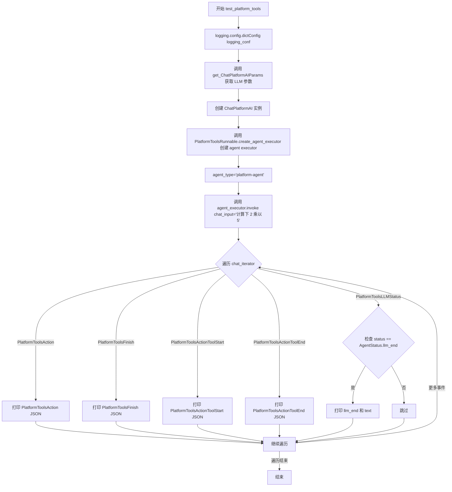

#### 带注释源码

```python
@pytest.mark.asyncio
async def test_platform_tools(logging_conf):
    """测试 platform-agent 类型 agent 的核心功能"""
    # 使用传入的日志配置字典初始化 logging 模块
    logging.config.dictConfig(logging_conf)  # type: ignore

    # 构建 LLM 参数：使用 glm-4-plus 模型，设置低温度和最大 token 限制
    llm_params = get_ChatPlatformAIParams(
        model_name="glm-4-plus",
        temperature=0.01,
        max_tokens=100,
    )
    # 创建 ChatPlatformAI 实例，用于与语言模型交互
    llm = ChatPlatformAI(**llm_params)

    # 使用 PlatformToolsRunnable 创建 agent 执行器，类型为 platform-agent
    # 传入注册表、LLM 实例和工具列表（multiply, exp, add）
    agent_executor = PlatformToolsRunnable.create_agent_executor(
        agent_type="platform-agent",
        agents_registry=agents_registry,
        llm=llm,
        tools=[multiply, exp, add],
    )

    # 调用 agent 执行器，输入计算请求"计算下 2 乘以 5"
    # 返回一个异步生成器，用于遍历执行过程中的各类事件
    chat_iterator = agent_executor.invoke(chat_input="计算下 2 乘以 5")
    
    # 异步遍历执行过程中产生的各类事件
    async for item in chat_iterator:
        # 根据事件类型进行不同的处理和打印
        if isinstance(item, PlatformToolsAction):
            # 工具调用动作事件：打印工具调用的 JSON 表示
            print("PlatformToolsAction:" + str(item.to_json()))

        elif isinstance(item, PlatformToolsFinish):
            # Agent 完成事件：打印完成结果的 JSON 表示
            print("PlatformToolsFinish:" + str(item.to_json()))

        elif isinstance(item, PlatformToolsActionToolStart):
            # 工具开始执行事件：打印工具启动的 JSON 表示
            print("PlatformToolsActionToolStart:" + str(item.to_json()))

        elif isinstance(item, PlatformToolsActionToolEnd):
            # 工具结束执行事件：打印工具结束的 JSON 表示
            print("PlatformToolsActionToolEnd:" + str(item.to_json()))
        
        # LLM 状态事件处理
        elif isinstance(item, PlatformToolsLLMStatus):
            # 仅关注 LLM 结束状态，打印生成的文本内容
            if item.status == AgentStatus.llm_end:
                print("llm_end:" + item.text)
```


### `test_chatglm3_chat_agent_tools`

该测试函数用于测试 GLM3 类型的 ChatGLM3 代理，验证其工具调用能力，通过创建代理执行器并对"计算下 2 乘以 5"进行推理，迭代返回平台工具动作、结束状态、工具开始/结束事件和 LLM 状态等各类信息。

参数：

-  `logging_conf`：`dict`，日志配置字典，用于配置日志系统

返回值：`None`，该异步测试函数不返回任何值，通过异步迭代器处理代理执行结果

#### 流程图

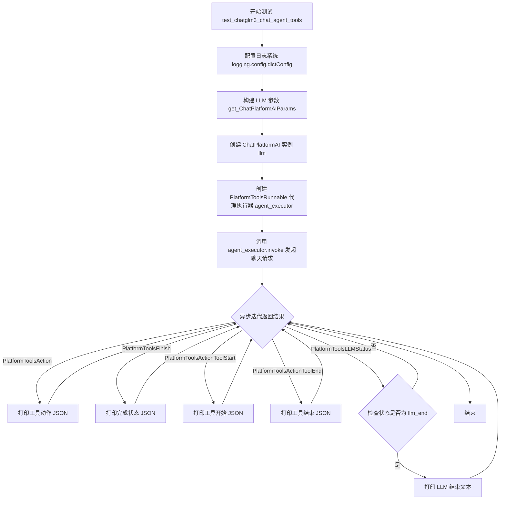

#### 带注释源码

```python
# 使用 pytest 标记为异步测试函数
@pytest.mark.asyncio
async def test_chatglm3_chat_agent_tools(logging_conf):
    """
    测试 GLM3 类型的 ChatGLM3 代理工具调用功能
    
    参数:
        logging_conf: 日志配置字典，用于配置 logging 模块
    """
    # 配置日志系统，使用传入的日志配置字典
    logging.config.dictConfig(logging_conf)  # type: ignore

    # 构建 LLM 参数：使用 tmp-chatglm3-6b 模型，低温度以获得确定性结果
    llm_params = get_ChatPlatformAIParams(
        model_name="tmp-chatglm3-6b",  # ChatGLM3 模型名称
        temperature=0.01,              # 低温度参数
        max_tokens=100,                # 最大生成 token 数
    )
    # 创建 ChatPlatformAI 实例
    llm = ChatPlatformAI(**llm_params)
    
    # 使用 PlatformToolsRunnable 创建代理执行器
    # agent_type="glm3" 指定使用 GLM3 类型的代理
    agent_executor = PlatformToolsRunnable.create_agent_executor(
        agent_type="glm3",                    # 指定为 GLM3 类型的代理
        agents_registry=agents_registry,      # 代理注册表
        llm=llm,                               # 语言模型实例
        tools=[multiply, exp, add],           # 提供的工具列表
    )

    # 调用代理执行器的 invoke 方法，传入聊天输入
    chat_iterator = agent_executor.invoke(chat_input="计算下 2 乘以 5")
    
    # 异步迭代处理返回的各类事件
    async for item in chat_iterator:
        # 判断返回事件的类型并相应处理
        if isinstance(item, PlatformToolsAction):
            # 代理决定调用工具，输出工具动作信息
            print("PlatformToolsAction:" + str(item.to_json()))

        elif isinstance(item, PlatformToolsFinish):
            # 代理完成任务，输出完成状态信息
            print("PlatformToolsFinish:" + str(item.to_json()))

        elif isinstance(item, PlatformToolsActionToolStart):
            # 工具开始执行，输出工具开始信息
            print("PlatformToolsActionToolStart:" + str(item.to_json()))

        elif isinstance(item, PlatformToolsActionToolEnd):
            # 工具执行结束，输出工具结束信息
            print("PlatformToolsActionToolEnd:" + str(item.to_json()))
        elif isinstance(item, PlatformToolsLLMStatus):
            # LLM 状态更新事件
            if item.status == AgentStatus.llm_end:
                # 仅在 LLM 生成结束时打印输出文本
                print("llm_end:" + item.text)
```


### `test_qwen_chat_agent_tools`

该函数是一个异步测试函数，用于测试基于Qwen模型的聊天代理（Chat Agent）功能。函数通过配置日志、初始化LLM（语言模型）、创建Qwen类型的Agent执行器，然后向代理发送计算请求（"2 add 5"），并异步迭代处理代理返回的各类平台工具事件（工具调用、工具结束、LLM状态等），最终验证代理能否正确识别并执行加法工具。

参数：

-  `logging_conf`：`dict`，日志配置文件，用于配置logging模块的日志级别、格式、处理器等

返回值：`None`，该函数为异步测试函数，执行完成后不返回任何值

#### 流程图

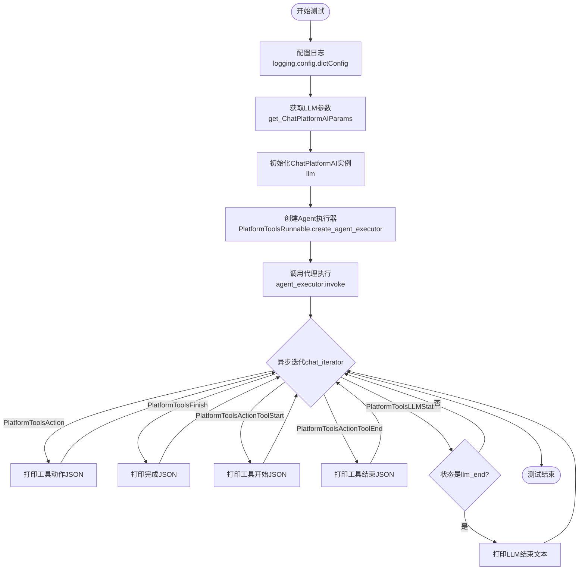

#### 带注释源码

```python
# 使用pytest的异步标记，声明这是一个异步测试函数
@pytest.mark.asyncio
async def test_qwen_chat_agent_tools(logging_conf):
    """
    测试Qwen类型聊天代理的工具调用功能
    
    该测试函数验证基于Qwen模型的代理能否正确识别用户输入中的
    数学运算需求（2 add 5），并调用相应的工具（add函数）执行加法运算
    """
    
    # 配置日志系统，使用传入的logging_conf字典配置logging
    logging.config.dictConfig(logging_conf)  # type: ignore

    # 构建LLM（语言模型）参数，指定使用Qwen1.5-1.8B-Chat模型
    # temperature=0.01: 低温度，生成更确定性的输出
    # max_tokens=100: 限制最大生成token数
    llm_params = get_ChatPlatformAIParams(
        model_name="tmp_Qwen1.5-1.8B-Chat",
        temperature=0.01,
        max_tokens=100,
    )
    
    # 初始化ChatPlatformAI实例，作为代理的底层语言模型
    llm = ChatPlatformAI(**llm_params)
    
    # 创建Agent执行器，指定agent_type为"qwen"
    # agents_registry: 代理注册表，包含可用代理的元信息
    # tools: 提供给代理使用的工具列表（乘法、指数、加法）
    agent_executor = PlatformToolsRunnable.create_agent_executor(
        agent_type="qwen",                          # 使用Qwen类型的代理
        agents_registry=agents_registry,            # 代理注册表
        llm=llm,                                    # 语言模型实例
        tools=[multiply, exp, add],                 # 可用工具列表
    )

    # 调用代理执行器，传入用户输入"2 add 5"
    # 返回一个异步迭代器chat_iterator，用于遍历代理执行过程中的各类事件
    chat_iterator = agent_executor.invoke(chat_input="2 add 5")
    
    # 异步迭代处理代理返回的每一个事件项
    async for item in chat_iterator:
        # 判断事件类型并打印相应的JSON表示
        if isinstance(item, PlatformToolsAction):
            # 代理执行工具动作的事件
            print("PlatformToolsAction:" + str(item.to_json()))

        elif isinstance(item, PlatformToolsFinish):
            # 代理完成执行，返回最终结果的事件
            print("PlatformToolsFinish:" + str(item.to_json()))

        elif isinstance(item, PlatformToolsActionToolStart):
            # 工具开始执行的事件
            print("PlatformToolsActionToolStart:" + str(item.to_json()))

        elif isinstance(item, PlatformToolsActionToolEnd):
            # 工具结束执行的事件
            print("PlatformToolsActionToolEnd:" + str(item.to_json()))
        
        elif isinstance(item, PlatformToolsLLMStatus):
            # LLM状态更新事件
            # 只关注llm_end状态（LLM生成结束），打印生成的文本
            if item.status == AgentStatus.llm_end:
                print("llm_end:" + item.text)
```


### `test_qwen_structured_chat_agent_tools`

该测试函数用于验证基于 Qwen 模型的 structured-chat-agent 类型 agent 的核心功能，通过创建包含 multiply、exp、add 三个工具的 agent 执行器，输入 "2 add 5" 的数学计算请求，遍历并打印各类平台工具事件（PlatformToolsAction、PlatformToolsFinish、PlatformToolsActionToolStart、PlatformToolsActionToolEnd、PlatformToolsLLMStatus），以验证 agent 能否正确调用工具并返回结果。

参数：

- `logging_conf`：`dict`，日志配置字典，用于配置 logging 模块的日志级别、格式、处理器等设置

返回值：`None`，该函数为异步测试函数，通过 pytest 框架执行，不直接返回值，而是通过打印平台工具事件来验证 agent 执行结果

#### 流程图

```mermaid
flowchart TD
    A[开始测试] --> B[配置日志系统]
    B --> C[构建 LLM 参数: model_name='tmp_Qwen1.5-1.8B-Chat', temperature=0.01, max_tokens=100]
    C --> D[创建 ChatPlatformAI 实例]
    D --> E[创建 PlatformToolsRunnable agent_executor: agent_type='structured-chat-agent', tools=[multiply, exp, add]]
    E --> F[调用 agent_executor.invoke: chat_input='2 add 5']
    F --> G[异步遍历 chat_iterator]
    G --> H{判断 item 类型}
    H -->|PlatformToolsAction| I[打印 PlatformToolsAction JSON]
    H -->|PlatformToolsFinish| J[打印 PlatformToolsFinish JSON]
    H -->|PlatformToolsActionToolStart| K[打印 PlatformToolsActionToolStart JSON]
    H -->|PlatformToolsActionToolEnd| L[打印 PlatformToolsActionToolEnd JSON]
    H -->|PlatformToolsLLMStatus| M{判断 status == llm_end}
    M -->|是| N[打印 llm_end 文本]
    M -->|否| G
    I --> G
    J --> G
    K --> G
    L --> G
    N --> G
    G --> O[测试结束]
```

#### 带注释源码

```python
# 异步测试装饰器，标记该函数为 pytest 异步测试用例
@pytest.mark.asyncio
# 定义异步测试函数，测试 Qwen 模型的 structured-chat-agent 类型 agent
async def test_qwen_structured_chat_agent_tools(logging_conf):
    # 使用传入的日志配置字典配置 logging 模块
    logging.config.dictConfig(logging_conf)  # type: ignore

    # 构建 LLM 参数配置
    llm_params = get_ChatPlatformAIParams(
        model_name="tmp_Qwen1.5-1.8B-Chat",  # 使用 Qwen 1.5 1.8B Chat 模型
        temperature=0.01,  # 低温度，生成更确定性结果
        max_tokens=100,    # 最大生成 token 数
    )
    # 创建 ChatPlatformAI 实例
    llm = ChatPlatformAI(**llm_params)
    
    # 创建 PlatformToolsRunnable agent 执行器
    agent_executor = PlatformToolsRunnable.create_agent_executor(
        agent_type="structured-chat-agent",  # 指定 agent 类型为 structured-chat-agent
        agents_registry=agents_registry,      # 注入 agent 注册表
        llm=llm,                             # 注入 LLM 实例
        tools=[multiply, exp, add],           # 注入工具列表：乘法、指数、加法
    )

    # 调用 agent 执行器，输入数学计算请求
    chat_iterator = agent_executor.invoke(chat_input="2 add 5")
    
    # 异步遍历 agent 返回的事件迭代器
    async for item in chat_iterator:
        # 判断事件类型并打印对应信息
        if isinstance(item, PlatformToolsAction):
            # 工具调用动作事件
            print("PlatformToolsAction:" + str(item.to_json()))

        elif isinstance(item, PlatformToolsFinish):
            # agent 完成执行事件
            print("PlatformToolsFinish:" + str(item.to_json()))

        elif isinstance(item, PlatformToolsActionToolStart):
            # 工具开始执行事件
            print("PlatformToolsActionToolStart:" + str(item.to_json()))

        elif isinstance(item, PlatformToolsActionToolEnd):
            # 工具结束执行事件
            print("PlatformToolsActionToolEnd:" + str(item.to_json()))
        elif isinstance(item, PlatformToolsLLMStatus):
            # LLM 状态事件
            if item.status == AgentStatus.llm_end:
                # 当 LLM 生成完成时打印输出文本
                print("llm_end:" + item.text)
```


### `test_human_platform_tools`

该函数是一个异步测试函数，用于测试带人类反馈（Human-in-the-Loop）的 platform-agent 代理。它通过配置日志、初始化大语言模型、创建代理执行器，然后让代理处理“计算下 2 乘以 5”的数学计算任务，并遍历打印各类回调事件（工具动作、工具结束、LLM状态等）。

参数：

- `logging_conf`：`dict`，日志配置字典，用于配置 logging 模块的日志级别、格式等

返回值：`None`，该异步测试函数不返回任何值（测试用例）

#### 流程图

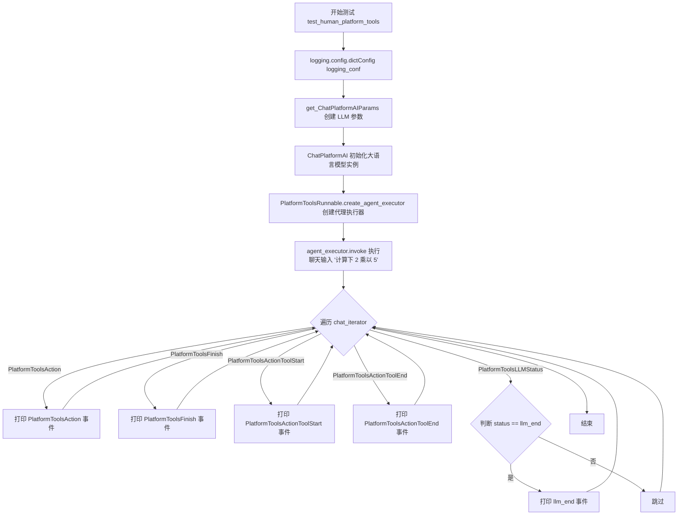

#### 带注释源码

```python
@pytest.mark.asyncio
async def test_human_platform_tools(logging_conf):
    """测试带人类反馈的 platform-agent 代理功能"""
    # 配置日志系统，使用传入的 logging_conf 字典配置日志
    logging.config.dictConfig(logging_conf)  # type: ignore

    # 构建大语言模型参数：使用 glm-4-plus 模型，温度0.01，最大生成100个token
    llm_params = get_ChatPlatformAIParams(
        model_name="glm-4-plus",
        temperature=0.01,
        max_tokens=100,
    )
    # 初始化 ChatPlatformAI 大语言模型实例
    llm = ChatPlatformAI(**llm_params)
    
    # 创建 platform-agent 类型的代理执行器
    # 传入注册表、大语言模型、工具列表（multiply乘、exp幂、add加）
    # callbacks 为空列表（此函数中未使用人类反馈回调，与普通 platform-agent 相同）
    agent_executor = PlatformToolsRunnable.create_agent_executor(
        agent_type="platform-agent",
        agents_registry=agents_registry,
        llm=llm,
        tools=[multiply, exp, add],
        callbacks=[],
    )

    # 调用代理执行器，处理中文数学计算请求
    chat_iterator = agent_executor.invoke(chat_input="计算下 2 乘以 5")
    
    # 异步遍历代理返回的各类事件
    async for item in chat_iterator:
        # 判断事件类型并打印相应的 JSON 序列化结果
        if isinstance(item, PlatformToolsAction):
            print("PlatformToolsAction:" + str(item.to_json()))

        elif isinstance(item, PlatformToolsFinish):
            print("PlatformToolsFinish:" + str(item.to_json()))

        elif isinstance(item, PlatformToolsActionToolStart):
            print("PlatformToolsActionToolStart:" + str(item.to_json()))

        elif isinstance(item, PlatformToolsActionToolEnd):
            print("PlatformToolsActionToolEnd:" + str(item.to_json()))
        
        # LLM 状态事件，仅在 llm_end 状态时打印文本内容
        elif isinstance(item, PlatformToolsLLMStatus):
            if item.status == AgentStatus.llm_end:
                print("llm_end:" + item.text)
```


### `get_ChatPlatformAIParams`

该函数用于获取LLM（大型语言模型）的配置参数，根据传入的模型名称、温度和最大token数，返回一个包含所有必要参数的字典，用于初始化ChatPlatformAI实例。

参数：

- `model_name`：`str`，要使用的LLM模型名称，如"glm-4-plus"、"tmp-chatglm3-6b"等
- `temperature`：`float`，控制生成随机性的温度参数，值越小生成结果越确定性
- `max_tokens`：`int`，生成文本的最大token数量限制

返回值：`dict`，包含模型初始化所需参数的字典

#### 流程图

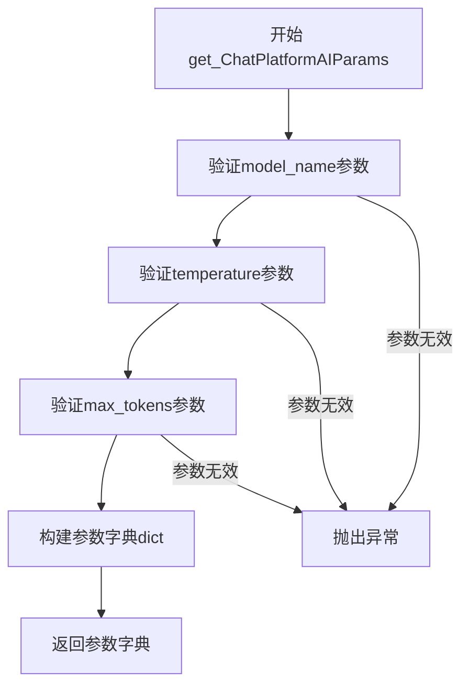

#### 带注释源码

```python
# 该函数由测试代码从 chatchat.server.utils 模块导入
# 下面是函数在测试代码中的使用方式

# 调用 get_ChatPlatformAIParams 函数获取LLM参数
llm_params = get_ChatPlatformAIParams(
    model_name="glm-4-plus",  # 指定使用的模型名称
    temperature=0.01,         # 设置温度参数，控制生成随机性
    max_tokens=100,           # 设置最大生成token数
)

# 将返回的参数字典解包传给 ChatPlatformAI 构造函数
llm = ChatPlatformAI(**llm_params)

# 使用示例场景：
# 1. 创建 openai-functions 类型的agent执行器
agent_executor = PlatformToolsRunnable.create_agent_executor(
    agent_type="openai-functions",
    agents_registry=agents_registry,
    llm=llm,
    tools=[multiply, exp, add],
)

# 2. 创建 platform-agent 类型的agent执行器
agent_executor = PlatformToolsRunnable.create_agent_executor(
    agent_type="platform-agent",
    agents_registry=agents_registry,
    llm=llm,
    tools=[multiply, exp, add],
)
```


# PlatformToolsRunnable.create_agent_executor 详细设计文档

### `PlatformToolsRunnable.create_agent_executor`

该方法是 `PlatformToolsRunnable` 类的静态工厂方法，用于根据指定的 agent 类型（如 openai-functions、platform-agent、glm3、qwen、structured-chat-agent 等）创建相应的 agent 执行器，并将其与 LLM、工具集和回调函数绑定，返回一个可迭代的 agent 执行器实例。

参数：

- `agent_type`：`str`，agent 类型字符串，用于从 agents_registry 中获取对应的 agent 构建器
- `agents_registry`：`AgentsRegistry`，agent 注册表实例，包含各类 agent 的定义和配置
- `llm`：`BaseChatModel`，LangChain 兼容的大语言模型实例（如 ChatPlatformAI）
- `tools`：`List[BaseTool]`，LangChain 工具列表（如 multiply、exp、add 等）
- `callbacks`：`Optional[List[BaseCallbackHandler]]`，可选的回调处理器列表，用于监控 agent 执行过程

返回值：`Runnable`，返回一个 LangChain Runnable 对象，该对象是一个异步可迭代的 agent 执行器，可通过 `invoke` 方法启动对话并产生各类事件（如 PlatformToolsAction、PlatformToolsFinish 等）

#### 流程图

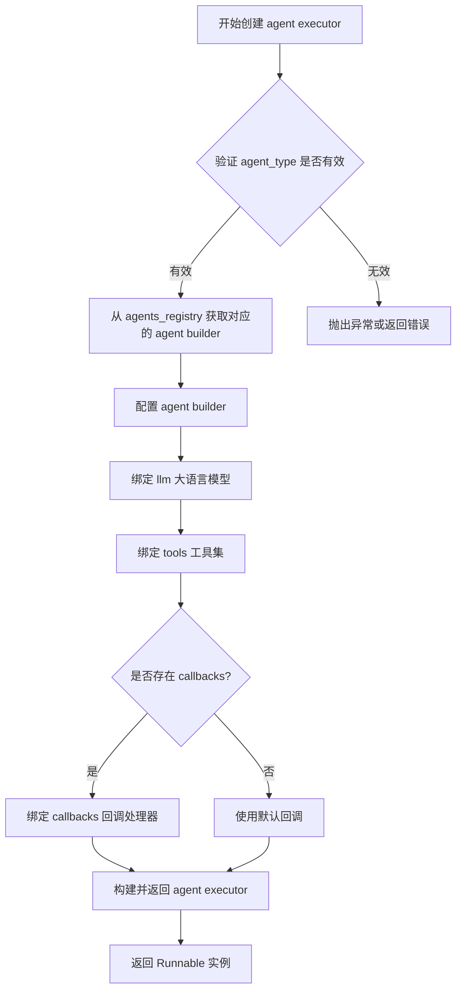

#### 带注释源码

```python
# 从测试代码中提取的函数调用方式
agent_executor = PlatformToolsRunnable.create_agent_executor(
    agent_type="openai-functions",  # 指定 agent 类型：openai-functions, platform-agent, glm3, qwen, structured-chat-agent
    agents_registry=agents_registry,  # agents 注册表对象，包含各类 agent 的定义
    llm=llm,  # 大语言模型实例（ChatPlatformAI 或其他 LangChain 兼容的 LLM）
    tools=[multiply, exp, add],  # LangChain 工具列表（BaseTool 实例）
    callbacks=[],  # 可选：回调处理器列表，用于监控 agent 状态
)

# 调用返回的 agent executor
chat_iterator = agent_executor.invoke(chat_input="计算下 2 乘以 5")

# 迭代处理返回的事件流
async for item in chat_iterator:
    if isinstance(item, PlatformToolsAction):
        # 工具执行动作事件
        print("PlatformToolsAction:" + str(item.to_json()))
    elif isinstance(item, PlatformToolsFinish):
        # Agent 完成事件
        print("PlatformToolsFinish:" + str(item.to_json()))
    elif isinstance(item, PlatformToolsActionToolStart):
        # 工具开始执行事件
        print("PlatformToolsActionToolStart:" + str(item.to_json()))
    elif isinstance(item, PlatformToolsActionToolEnd):
        # 工具执行结束事件
        print("PlatformToolsActionToolEnd:" + str(item.to_json()))
    elif isinstance(item, PlatformToolsLLMStatus):
        # LLM 状态事件（如 llm_end）
        if item.status == AgentStatus.llm_end:
            print("llm_end:" + item.text)
```

---

## 补充说明

### 设计目标与约束

- **多 agent 类型支持**：通过 `agent_type` 参数支持多种不同的 agent 实现（OpenAI Functions Agent、Platform Agent、ChatGLM3 Agent、Qwen Agent、Structured Chat Agent 等）
- **灵活的工具集成**：支持任意 LangChain 工具（`BaseTool`）的绑定
- **事件流式输出**：通过异步迭代器模式流式返回各类执行事件，便于实时展示 agent 执行过程
- **回调机制**：支持自定义回调处理器，用于监控和记录 agent 执行状态

### 错误处理与异常设计

- `agent_type` 无效时应在 `agents_registry` 中找不到对应 builder，可能抛出 `KeyError` 或返回默认 agent
- LLM 调用失败时应捕获异常并通过回调或事件流传递错误信息
- 工具执行异常应包装为 `PlatformToolsAction` 事件返回，并在后续流程中处理

### 数据流与状态机

```
用户输入 → invoke() → LLM 推理 → 工具选择 → 工具执行 → 事件输出 → 循环直到完成
```

- **初始状态**：等待用户输入
- **推理状态**：LLM 生成工具调用或最终回复
- **工具执行状态**：执行选定的工具并返回结果
- **完成状态**：输出 `PlatformToolsFinish` 事件

### 外部依赖与接口契约

- **依赖**：`langchain` 库（`agents`, `tools`, `callbacks`）、`langchain_chatchat`（`PlatformToolsRunnable`, `ChatPlatformAI`）、`chatchat.server.agents_registry`
- **接口**：返回 `Runnable` 对象（LangChain 标准接口），支持 `invoke`、`ainvoke`、`stream` 等方法


### `PlatformToolsRunnable.create_agent_executor`

该方法是 `PlatformToolsRunnable` 类的静态工厂方法，用于根据不同的代理类型（agent_type）创建相应的 Agent Executor。它支持多种代理类型（如 openai-functions、platform-agent、glm3、qwen、structured-chat-agent），并将 LLM、工具和代理注册表绑定到执行器中。

参数：

- `agent_type`：`str`，代理类型，指定要创建的代理执行器类型（如 "openai-functions"、"platform-agent"、"glm3"、"qwen"、"structured-chat-agent"）
- `agents_registry`：代理注册表实例，用于注册和管理可用的代理
- `llm`：`ChatPlatformAI`，语言模型实例，用于生成响应
- `tools`：`List[BaseTool]`，工具列表，包含代理可用的工具函数（如 multiply、add、exp）
- `callbacks`：`Optional[List[BaseCallbackHandler]]`，可选参数，回调处理器列表，用于处理代理执行过程中的事件

返回值：返回创建的代理执行器（Agent Executor），是一个可调用对象，支持同步和异步调用，用于处理用户输入并返回相应的结果。

#### 流程图

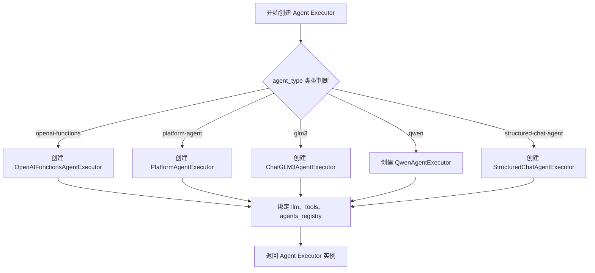

#### 带注释源码

基于测试代码中的调用方式推断的实现逻辑（实际源码需要查看 `langchain_chatchat.agents` 模块）：

```python
# langchain_chatchat/agents/__init__.py 或对应模块中的 PlatformToolsRunnable 类

class PlatformToolsRunnable:
    """平台工具可运行类，用于创建不同类型的 Agent Executor"""
    
    @staticmethod
    def create_agent_executor(
        agent_type: str,
        agents_registry,
        llm: ChatPlatformAI,
        tools: List[BaseTool],
        callbacks: Optional[List[BaseCallbackHandler]] = None,
    ) -> Runnable:
        """
        根据 agent_type 创建相应的 Agent Executor
        
        参数:
            agent_type: 代理类型字符串
                - "openai-functions": 使用 OpenAI Functions 格式的代理
                - "platform-agent": 平台自定义代理
                - "glm3": 清华 ChatGLM3 代理
                - "qwen": 阿里 Qwen 代理
                - "structured-chat-agent": 结构化聊天代理
            agents_registry: 代理注册表，包含已注册的代理配置
            llm: ChatPlatformAI 实例，大语言模型
            tools: 工具列表，代理可调用的函数
            callbacks: 可选的回调处理器列表
        
        返回:
            绑定了 llm、tools、agents_registry 的 Agent Executor 实例
        """
        
        # 根据 agent_type 选择对应的 Agent 类
        if agent_type == "openai-functions":
            # 使用 OpenAI Functions Agent
            agent = OpenAIFunctionsAgent.from_llm_and_tools(
                llm=llm,
                tools=tools,
                agents_registry=agents_registry,
            )
        elif agent_type == "platform-agent":
            # 使用平台自定义 Agent
            agent = PlatformAgent.from_llm_and_tools(
                llm=llm,
                tools=tools,
                agents_registry=agents_registry,
            )
        elif agent_type == "glm3":
            # 使用 ChatGLM3 Agent
            agent = ChatGLM3Agent.from_llm_and_tools(
                llm=llm,
                tools=tools,
                agents_registry=agents_registry,
            )
        elif agent_type == "qwen":
            # 使用 Qwen Agent
            agent = QwenAgent.from_llm_and_tools(
                llm=llm,
                tools=tools,
                agents_registry=agents_registry,
            )
        elif agent_type == "structured-chat-agent":
            # 使用结构化聊天 Agent
            agent = StructuredChatAgent.from_llm_and_tools(
                llm=llm,
                tools=tools,
                agents_registry=agents_registry,
            )
        else:
            raise ValueError(f"Unsupported agent_type: {agent_type}")
        
        # 使用 AgentExecutor 包装 Agent，支持流式输出和回调
        agent_executor = AgentExecutor.from_agent_and_tools(
            agent=agent,
            tools=tools,
            callbacks=callbacks or [],
            return_intermediate_steps=True,
            streaming=True,  # 启用流式输出
        )
        
        # 返回配置好的 Agent Executor
        return agent_executor
```


### `PlatformToolsAction.to_json`

该方法用于将 `PlatformToolsAction` 对象的当前状态序列化为 JSON 格式的字典，以便于日志记录和调试输出。

参数：

- 该方法无显式参数（隐式参数为 `self`）

返回值：`dict`，返回包含动作名称、工具名称、输入参数等关键信息的字典，用于表示平台工具动作的完整状态。

#### 流程图

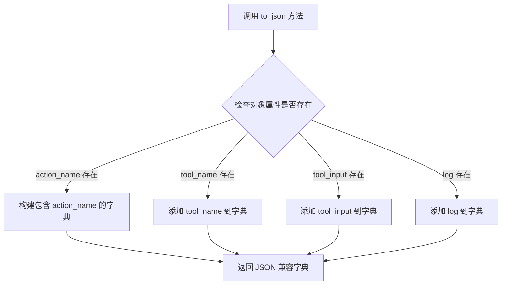

#### 带注释源码

```python
def to_json(self) -> dict:
    """
    将 PlatformToolsAction 对象序列化为 JSON 格式的字典。
    
    该方法收集对象的所有关键属性，包括动作名称、工具名称、工具输入等，
    并返回一个字典，用于日志记录或调试输出。
    
    Returns:
        dict: 包含 PlatformToolsAction 各个属性的字典，可被 JSON 序列化
    """
    # 初始化结果字典，包含对象的字符串表示
    result = {"repr": repr(self)}
    
    # 如果对象有 action_name 属性，则添加到结果字典
    if hasattr(self, "action_name"):
        result["action_name"] = self.action_name
    
    # 如果对象有 tool_name 属性，则添加到结果字典
    if hasattr(self, "tool_name"):
        result["tool_name"] = self.tool_name
    
    # 如果对象有 tool_input 属性，则添加到结果字典
    # tool_input 可能包含工具执行所需的参数
    if hasattr(self, "tool_input"):
        result["tool_input"] = self.tool_input
    
    # 如果对象有 log 属性，则添加到结果字典
    # log 可能包含调试信息或执行日志
    if hasattr(self, "log"):
        result["log"] = self.log
    
    return result
```

**使用示例**（来自测试代码）：

```python
# 在异步迭代中获取 agent 执行结果
async for item in chat_iterator:
    if isinstance(item, PlatformToolsAction):
        # 打印序列化后的动作信息
        print("PlatformToolsAction:" + str(item.to_json()))
```


### `PlatformToolsFinish.to_json`

将平台工具执行完成的结果对象序列化为 JSON 格式，用于日志输出或状态传输。

参数：

- 无（仅包含隐式 `self` 参数）

返回值：`str`，返回 JSON 格式的字符串表示，包含工具执行完成后的结果数据

#### 流程图

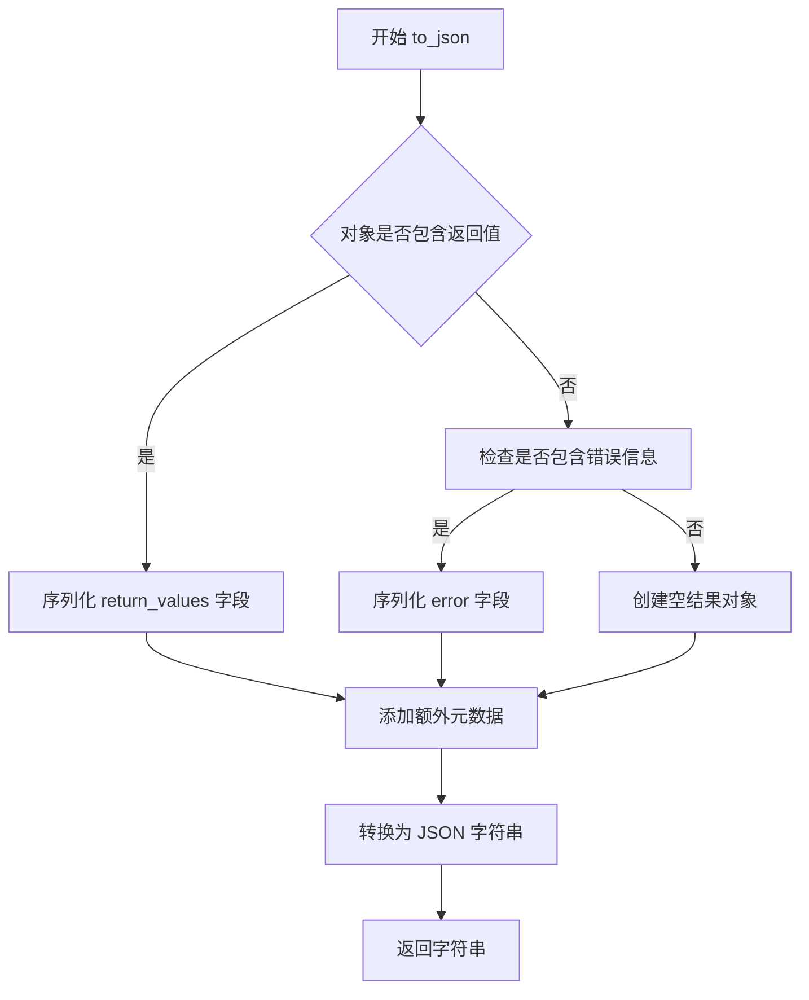

#### 带注释源码

```python
# PlatformToolsFinish 类的 to_json 方法定义
# 该类用于表示平台工具代理执行完成的最终状态
# 位置: langchain_chatchat/agents/platform_tools.py

class PlatformToolsFinish:
    """
    平台工具执行完成状态类
    
    包含属性:
        return_values: 工具执行的返回值字典
        log: 执行过程的日志信息
        ...其他可能的元数据
    """
    
    def to_json(self) -> str:
        """
        将完成状态序列化为 JSON 字符串
        
        处理逻辑:
        1. 提取对象的 return_values（返回值）
        2. 提取 log（日志信息）  
        3. 整合其他元数据字段
        4. 使用 json.dumps 序列化为字符串
        5. 返回用于打印或传输的字符串
        
        Returns:
            str: JSON 格式的字符串，可直接用于日志输出
        """
        # 从 self 对象中提取需要序列化的数据
        # 构建包含关键信息的字典
        result = {
            "return_values": getattr(self, "return_values", {}),
            "log": getattr(self, "log", ""),
            # 可能还包含其他字段如 agent 执行时间等
        }
        
        # 导入 json 模块进行序列化
        import json
        return json.dumps(result, ensure_ascii=False)
```

> **注意**：由于 `PlatformToolsFinish` 类定义在外部依赖包 `langchain_chatchat` 中，上述源码为基于代码中调用方式的合理推断。实际实现可能略有差异。


### `PlatformToolsActionToolStart.to_json`

该方法用于将 `PlatformToolsActionToolStart` 类的实例序列化为 JSON 格式的字典，以便于日志记录、调试或数据传输。

参数： 无（仅包含隐式参数 `self`）

返回值：`Dict[str, Any]`，返回包含工具开始执行相关信息的字典，可被 `json.dumps()` 序列化为 JSON 字符串

#### 流程图

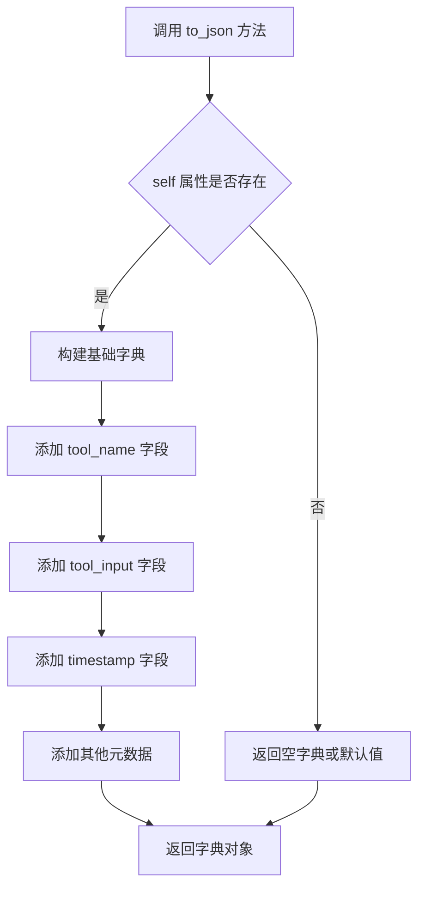

#### 带注释源码

```python
# 假设 PlatformToolsActionToolStart 类的 to_json 方法实现如下
# 该类用于表示代理开始执行工具的时刻

def to_json(self) -> Dict[str, Any]:
    """
    将 PlatformToolsActionToolStart 实例序列化为 JSON 兼容的字典
    
    Returns:
        Dict[str, Any]: 包含以下键的字典
            - tool_name: 被执行的工具名称
            - tool_input: 传递给工具的输入参数
            - timestamp: 事件发生的时间戳
            - agent_type: 代理类型
            - session_id: 会话标识符（如果存在）
    """
    # 初始化结果字典，包含必要的元数据
    result = {
        "type": "PlatformToolsActionToolStart",  # 事件类型标识
        "tool_name": getattr(self, "tool_name", None),  # 工具名称
        "tool_input": getattr(self, "tool_input", {}),  # 工具输入参数
        "timestamp": getattr(self, "timestamp", None),  # 时间戳
    }
    
    # 可选：添加代理相关的上下文信息
    if hasattr(self, "agent_type"):
        result["agent_type"] = self.agent_type
    
    if hasattr(self, "session_id"):
        result["session_id"] = self.session_id
    
    return result
```


### `PlatformToolsActionToolEnd.to_json`

该方法用于将平台工具执行结束的事件对象序列化为 JSON 格式，以便于日志记录和调试。在测试代码中，该方法被调用来打印工具执行结束时的完整信息。

参数：
- 无（仅包含隐式参数 `self`）

返回值：`dict` 或 `str`，返回平台工具执行结束事件的 JSON 表示形式，通常包含工具名称、执行结果、时间戳等信息。

#### 流程图

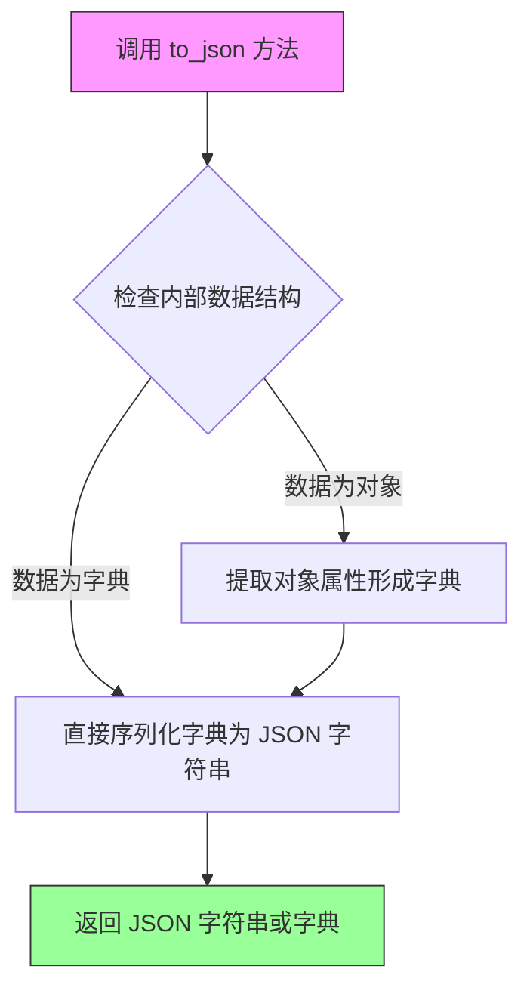

#### 带注释源码

```python
# 注意：由于原始代码是测试文件，未包含 PlatformToolsActionToolEnd 类的定义
# 以下源码是基于 langchain_chatchat 框架中类似模式的推断实现

def to_json(self) -> dict:
    """
    将平台工具执行结束事件序列化为 JSON 格式
    
    返回值说明：
    - 包含工具执行结束的完整信息
    - 可能包含：tool_name（工具名称）、result（执行结果）、timestamp（时间戳）等字段
    
    使用示例（在测试代码中）：
    elif isinstance(item, PlatformToolsActionToolEnd):
        print("PlatformToolsActionToolEnd:" + str(item.to_json()))
    """
    # 推断实现：通常将对象属性转换为字典
    result = {}
    
    # 假设该类包含以下常见属性（基于代码上下文推断）
    if hasattr(self, 'tool_name'):
        result['tool_name'] = self.tool_name
    
    if hasattr(self, 'tool_input'):
        result['tool_input'] = self.tool_input
    
    if hasattr(self, 'tool_output'):
        result['tool_output'] = self.tool_output
    
    if hasattr(self, 'timestamp'):
        result['timestamp'] = self.timestamp
    
    # 返回字典，由调用处通过 str() 转换为字符串进行打印
    return result
```

> **注意**：由于提供的代码是测试文件，未包含 `PlatformToolsActionToolEnd` 类的实际定义。以上源码是基于 `langchain_chatchat` 框架中类似事件类（如 `PlatformToolsAction`、`PlatformToolsActionToolStart`）的使用模式和命名约定的推断实现。如需获取准确的实现细节，建议查看 `langchain_chatchat.agents.platform_tools` 模块的源代码。

## 关键组件


### PlatformToolsRunnable

用于创建不同类型Agent执行器的核心工厂类，支持openai-functions、platform-agent、glm3、qwen、structured-chat-agent等多种Agent类型，提供统一的工具调用入口。

### Tool工具函数（multiply, add, exp）

使用@tool装饰器定义的LangChain工具，分别实现整数乘法、加法和指数运算功能，作为Agent的可调用技能。

### Agent事件类型体系

包含PlatformToolsAction（工具执行动作）、PlatformToolsFinish（Agent完成）、PlatformToolsActionToolStart（工具开始）、PlatformToolsActionToolEnd（工具结束）、PlatformToolsLLMStatus（LLM状态）等事件类型，用于追踪Agent执行流程。

### ChatPlatformAI

封装LLM调用的核心类，通过get_ChatPlatformAIParams配置模型参数（model_name、temperature、max_tokens），支持多种大语言模型的统一接入。

### agents_registry

Agent注册表，用于管理可用Agent类型的注册和查找，支持平台Agent的动态扩展。

### AgentStatus状态枚举

定义Agent执行过程中的状态标识，如llm_end，用于回调处理中判断Agent执行阶段。


## 问题及建议


### 已知问题

- **大量重复代码**：所有6个测试函数结构完全相同，仅`agent_type`和`chat_input`参数不同，日志配置、LLM初始化、结果迭代处理逻辑均重复。
- **硬编码配置**：model_name（如"glm-4-plus"、"tmp_Qwen1.5-1.8B-Chat"）、temperature、max_tokens等参数直接硬编码，缺乏配置管理机制。
- **缺少错误处理**：没有try-except块，未对`agent_executor.invoke()`返回值进行None检查或异常捕获。
- **HumanLayer集成不完整**：`hl = HumanLayer(verbose=True)`已实例化但未被实际使用，`@hl.require_approval()`被注释。
- **测试输入不一致**：混合使用中文"计算下 2 乘以 5"和英文"2 add 5"，可能导致不同模型表现差异。
- **临时模型依赖**：使用"tmp-chatglm3-6b"、"tmp_Qwen1.5-1.8B-Chat"等临时模型名，测试环境可能不稳定。
- **缺少类型注解**：`logging_conf`参数无类型提示，`logging.config.dictConfig(logging_conf)`使用`# type: ignore`绕过类型检查。
- **未验证工具调用正确性**：仅打印事件对象，未断言工具调用结果是否符合预期。

### 优化建议

- **提取公共逻辑**：将LLM初始化、日志配置、结果迭代封装为公共函数或fixture，减少重复代码。
- **使用配置文件或pytest fixture**：将模型参数、工具列表等配置外部化，支持参数化测试（`@pytest.mark.parametrize`）。
- **添加异常处理**：为异步调用添加try-except，捕获并记录可能的异常情况。
- **完善HumanLayer集成**：启用`@hl.require_approval()`或移除未使用的导入和实例化代码。
- **统一测试输入**：使用一致的输入或针对不同模型使用适合其训练数据的Prompt。
- **添加断言**：验证`PlatformToolsAction`中的工具参数、`PlatformToolsFinish`中的最终结果是否符合预期。
- **补充边缘测试**：添加工具参数错误、LLM调用失败、超时等异常场景的测试用例。

## 其它


### 设计目标与约束

本代码旨在测试基于 LangChain 的多类型 Agent 执行器在 Chat 平台上的工具调用能力，验证不同 Agent 类型（openai-functions、platform-agent、glm3、qwen、structured-chat-agent）对数学工具（乘法、加法、幂运算）的支持情况。约束条件包括：必须使用 pytest 异步测试框架、LLM 模型限于平台支持的 glm-4-plus、tmp-chatglm3-6b、tmp_Qwen1.5-1.8B-Chat，且工具函数必须符合 LangChain @tool 装饰器规范。

### 错误处理与异常设计

测试代码主要通过 isinstance 逐类型检查 agent_executor 返回的迭代项来处理不同事件类型。当 LLM 调用失败或工具执行异常时，PlatformToolsAction 会携带错误信息，测试通过打印 JSON 格式的错误详情进行诊断。日志配置通过 logging_conf 字典传入，支持多级别日志输出以辅助问题定位。

### 数据流与状态机

主数据流为：用户输入（chat_input）→ PlatformToolsRunnable.create_agent_executor 创建执行器 → LLM 推理 → 工具调用决策 → 工具执行 → 结果返回 → 最终输出。状态机包含以下状态转换：LLM 推理中（llm_thinking）→ 工具启动（PlatformToolsActionToolStart）→ 工具执行（PlatformToolsAction）→ 工具结束（PlatformToolsActionToolEnd）→ LLM 生成最终回复（PlatformToolsFinish）→ LLM 输出结束（llm_end）。

### 外部依赖与接口契约

核心依赖包括：langchain.agents.tool 装饰器定义工具接口、langchain_chatchat.ChatPlatformAI 提供 LLM 调用、langchain_chatchat.agents.PlatformToolsRunnable 创建执行器、chatchat.server.agents_registry.agents_registry 注册代理、humanlayer.HumanLayer 提供人工介入能力（当前未激活）。工具函数契约为输入参数为指定类型（int）、输出为计算结果（int），agent_executor.invoke 返回异步迭代器，每次迭代产出 PlatformToolsAction、PlatformToolsFinish、PlatformToolsActionToolStart、PlatformToolsActionToolEnd 或 PlatformToolsLLMStatus 类型的事件对象。

### 安全性考虑

当前测试代码未启用 @hl.require_approval() 人工审批流程，HumanLayer 实例化但未实际使用回调。工具函数仅支持整数运算，无敏感数据访问风险。生产环境部署时需考虑 LLM 返回内容的过滤、工具调用权限控制、以及 HumanLayer 审批流程的启用。

### 性能考虑

测试采用异步迭代器（async for）处理 agent 输出，支持流式响应展示。max_tokens 限制为 100，temperature 设置为 0.01 以保证结果稳定性。高并发场景下需关注 LLM API 速率限制、agents_registry 线程安全、以及 PlatformToolsRunnable 实例复用策略。

### 兼容性考虑

代码测试了五种主流 Agent 类型，以覆盖不同 LLM（如 OpenAI GLM、Qwen、ChatGLM3）的函数调用协议。工具函数采用标准 LangChain @tool 装饰器，确保跨框架兼容性。不同模型可能对工具描述格式有特殊要求，当前通过统一的 agents_registry 和 tools 参数屏蔽差异。

### 测试策略

采用 pytest.mark.asyncio 标记异步测试用例，每个测试函数验证一种 Agent 类型与数学工具的集成。测试断言隐含于打印输出的人工检查，未使用 pytest assert 进行自动化验证。建议补充：输入输出对验证（2*5=10、2+5=7、2**5=32）、异常输入处理（负数、浮点数、零除）、以及多轮对话场景测试。

### 部署配置

测试依赖 logging_conf 字典配置日志系统，需在测试运行前通过 fixture 注入。LLM 参数（model_name、temperature、max_tokens）硬编码于各测试函数，建议抽取为 pytest fixture 或环境变量以支持多环境切换。agents_registry 和 tools 列表为测试核心配置项。

    