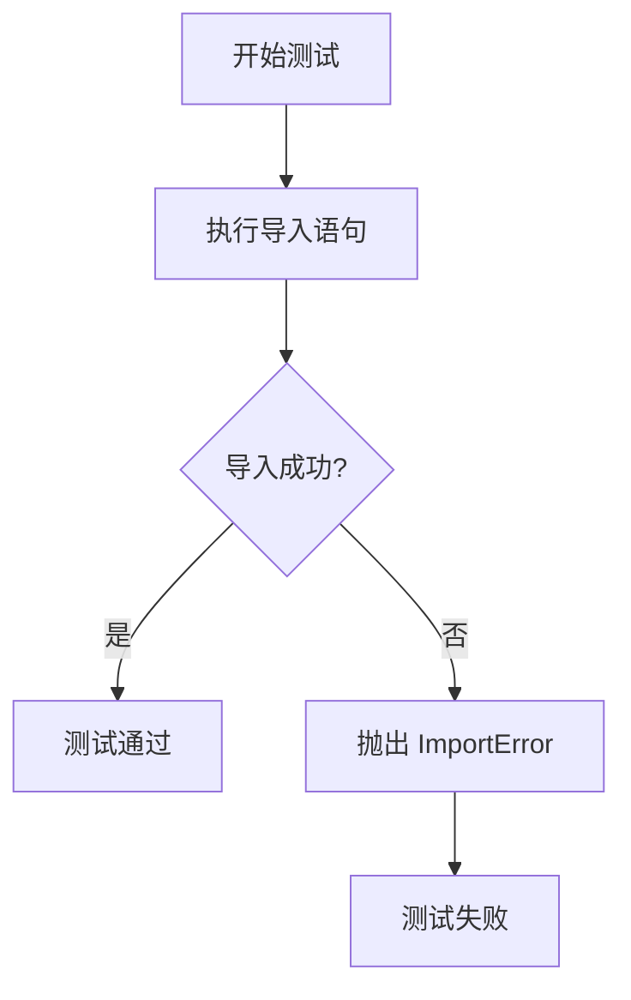
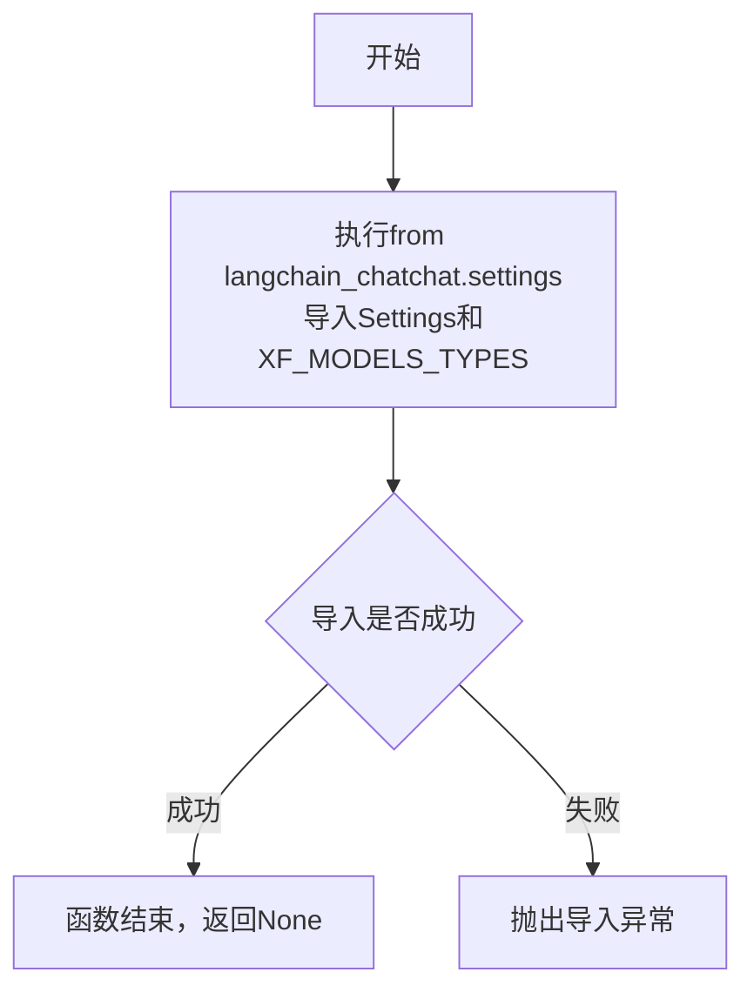
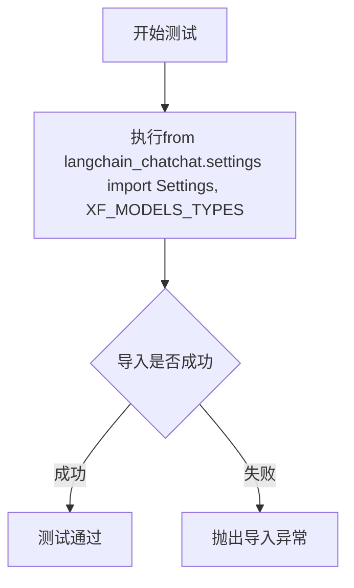

# `Langchain-Chatchat\libs\chatchat-server\tests\integration_tests\test_sdk_import.py` 详细设计文档

这是一个单元测试文件，用于验证 langchain_chatchat.settings 模块中的 Settings 配置类和 XF_MODELS_TYPES 枚举类型是否能够正确导入，确保 SDK 依赖完整性。

## 整体流程



## 类结构

```
该文件为测试模块，无类层次结构
仅包含一个测试函数 test_sdk_import_unit()
```

## 全局变量及字段


### `XF_MODELS_TYPES`
    
从langchain_chatchat.settings导入的模型类型常量集合

类型：`module variable / constant`
    


### `Settings.Settings`
    
从langchain_chatchat.settings导入的配置类，用于管理应用配置

类型：`class`
    
    

## 全局函数及方法


### `test_sdk_import_unit`

这是一个单元测试函数，用于验证从`langchain_chatchat.settings`模块导入`Settings`和`XF_MODELS_TYPES`是否正常工作。

参数：

- 无参数

返回值：`None`，无返回值（Python函数默认返回None）

#### 流程图



#### 带注释源码

```python
def test_sdk_import_unit():
    """
    测试SDK导入单元的函数。
    用于验证从langchain_chatchat.settings模块导入Settings和XF_MODELS_TYPES是否成功。
    这是一个基础的导入测试，确保项目依赖的模块可以正常加载。
    """
    from langchain_chatchat.settings import Settings, XF_MODELS_TYPES
    # 导入语句：如果模块路径或类名错误，将在此处抛出ImportError或AttributeError
    # 该测试函数通常用于单元测试框架中，确保项目配置模块可访问
```

## 关键组件


## 一段话描述

该代码定义了一个测试函数 `test_sdk_import_unit()`，用于验证 `langchain_chatchat` 项目中 Settings 配置类和 XF_MODELS_TYPES 模型类型常量的导入单元测试，确保核心配置模块的可导入性和完整性。

## 文件的整体运行流程

该测试文件执行流程极为简单：
1. 执行 `test_sdk_import_unit()` 函数
2. 从 `langchain_chatchat.settings` 模块导入 `Settings` 类和 `XF_MODELS_TYPES` 常量
3. 验证导入成功即测试通过

## 类详细信息

无类定义

## 全局变量和全局函数详细信息

### 全局变量

#### XF_MODELS_TYPES

- **类型**: 推测为枚举类或字典常量
- **描述**: 定义 XF（讯飞）模型类型集合，可能包含如文本模型、embedding 模型、对话模型等类型的枚举值或映射关系

#### Settings

- **类型**: 推测为 Pydantic BaseSettings 或类似配置类
- **描述**: 应用全局配置管理类，用于集中管理 API 密钥、模型参数、路径配置等运行时设置

### 全局函数

#### test_sdk_import_unit

- **参数**: 无
- **参数类型**: 无
- **参数描述**: 无参数测试函数
- **返回值类型**: None
- **返回值描述**: 无返回值，仅执行导入验证操作

**mermaid 流程图**:



**带注释源码**:

```python
def test_sdk_import_unit():
    """
    SDK 导入单元测试函数
    
    验证 langchain_chatchat.settings 模块中的核心组件
    Settings 配置类和 XF_MODELS_TYPES 模型类型常量可以正确导入
    """
    from langchain_chatchat.settings import Settings, XF_MODELS_TYPES
```

## 关键组件信息

### Settings 配置类

应用全局配置管理中心，封装所有运行时可配置参数，提供类型安全的配置访问接口

### XF_MODELS_TYPES 模型类型枚举

定义讯飞模型类型集合，用于在不同场景下区分和选择对应的模型能力

## 潜在的技术债务或优化空间

1. **测试覆盖不足**: 当前仅验证导入成功，未验证导入组件的实际功能和类型正确性
2. **缺乏配置校验**: 未验证 Settings 类的必需字段和 XF_MODELS_TYPES 的完整性
3. **无 mock 机制**: 实际运行环境中可能需要模拟外部依赖

## 其它项目

### 设计目标与约束

- **目标**: 确保项目配置模块的可导入性和基础结构完整性
- **约束**: 依赖 langchain_chatchat.settings 模块的存在和正确导出

### 错误处理与异常设计

- 导入失败时抛出 ModuleNotFoundError 或 ImportError
- 建议增加具体的异常类型和错误消息

### 外部依赖与接口契约

- 依赖 `langchain_chatchat.settings` 模块的外部接口
- 期望该模块导出 Settings 类和 XF_MODELS_TYPES 常量


## 问题及建议


### 已知问题

-   **空测试函数**：测试函数体只包含一条import语句，没有实际的测试逻辑和断言，无法验证任何功能行为
-   **缺乏测试断言**：没有使用任何断言来验证导入的模块、类或变量是否符合预期
-   **导入依赖裸奔**：直接import语句没有任何错误处理，若模块不存在或导入失败会导致测试直接崩溃
-   **命名与实现不符**：函数名 `test_sdk_import_unit` 暗示是单元测试，但实际上只是导入语句，非真正的测试
-   **无文档注释**：缺少docstring说明该测试函数的意图和预期行为
-   **无类型注解**：函数参数和返回值没有类型提示，降低了代码可读性和可维护性

### 优化建议

-   为测试函数添加docstring，描述测试目的（如"验证Settings和XF_MODELS_TYPES能否正确导入"）
-   添加实际的测试断言，例如：
    -   验证 `Settings` 类是否存在且可实例化
    -   验证 `XF_MODELS_TYPES` 是否为预期的数据类型（如字典或列表）
    -   验证关键配置项是否存在
-   使用 try-except 块包装导入语句，提供有意义的错误信息
-   考虑使用 pytest 框架的 `importorskip` 或类似机制处理可选依赖
-   添加类型注解，如 `def test_sdk_import_unit() -> None:`
-   将导入移到模块顶部或使用 pytest fixtures 来管理测试依赖


## 其它


### 测试目的

验证 langchain_chatchat.settings 模块中的 Settings 和 XF_MODELS_TYPES 可以被正确导入，确保模块依赖完整性。

### 测试环境

- Python 3.x
- langchain_chatchat 包已安装
- 依赖模块：langchain_chatchat.settings

### 依赖项

- langchain_chatchat.settings：包含 Settings 和 XF_MODELS_TYPES 的配置模块
- 测试框架：默认使用 Python 标准库，可扩展为 pytest

### 预期结果

成功导入 Settings 和 XF_MODELS_TYPES，无异常抛出。

### 错误处理

- 导入失败时抛出 ModuleNotFoundError 或 ImportError
- 建议捕获异常并提供清晰的错误信息

### 维护建议

- 当前仅测试导入，建议扩展为测试 Settings 和 XF_MODELS_TYPES 的具体属性或方法
- 可使用 pytest 框架进行更规范的单元测试

### 扩展性

可添加更多导入测试用例，例如测试其他模块或配置类。

### 性能考虑

导入操作通常较快，但需确保测试环境初始化时间合理。

### 安全性

导入的模块可能包含敏感配置，建议在测试环境中使用脱敏配置。

### 版本兼容性

确保与 langchain_chatchat 包的版本兼容，及时更新测试以适应 API 变更。

    