# `Langchain-Chatchat\libs\chatchat-server\tests\kb_vector_db\test_faiss_kb.py` 详细设计文档

这是一个针对Faiss知识库服务的集成测试脚本，用于测试知识库的创建、文档添加、文档搜索和删除等核心功能的完整流程。

## 整体流程

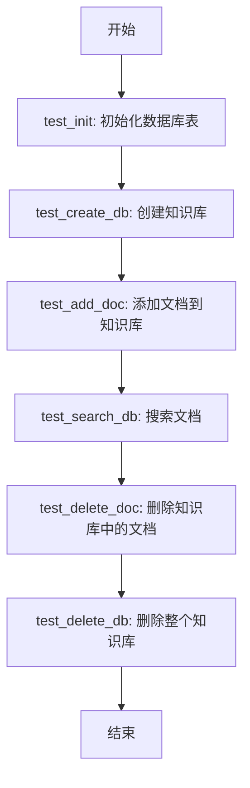

## 类结构

```
测试脚本 (顶层)
├── FaissKBService (被测类)
├── KnowledgeFile (被测类)
└── create_tables (工具函数)
```

## 全局变量及字段


### `kbService`
    
FaissKBService的实例，用于执行知识库的创建、文档添加、搜索和删除等操作

类型：`FaissKBService`
    


### `test_kb_name`
    
测试用知识库的名称，值为'test'

类型：`str`
    


### `test_file_name`
    
测试用文件的名称，值为'README.md'

类型：`str`
    


### `testKnowledgeFile`
    
知识库文件对象，包含测试文件名和知识库名称

类型：`KnowledgeFile`
    


### `search_content`
    
用于搜索查询的内容字符串，询问如何启动api服务

类型：`str`
    


### `FaissKBService.kb_name`
    
知识库的标识名称，用于区分不同的知识库

类型：`str`
    


### `FaissKBService.vector_store`
    
Faiss向量存储对象，用于存储和检索向量嵌入

类型：`Any`
    


### `KnowledgeFile.file_name`
    
知识库中文件的名称

类型：`str`
    


### `KnowledgeFile.kb_name`
    
知识库名称，与FaissKBService关联

类型：`str`
    
    

## 全局函数及方法


### `test_init`

该函数用于初始化测试环境，通过调用 `create_tables` 函数创建数据库表结构，为后续的测试用例提供必要的数据库环境。

参数：なし（无参数）

返回值：`None`，无返回值描述

#### 流程图

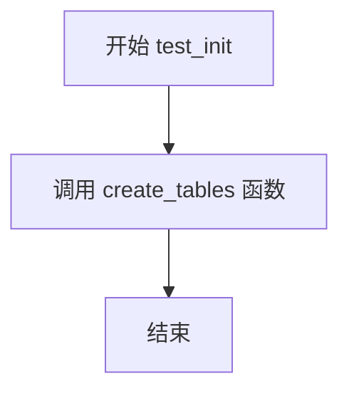

#### 带注释源码

```python
def test_init():
    """
    测试初始化函数
    
    该函数用于初始化测试数据库环境，调用 create_tables 函数
    创建项目所需的数据库表结构。这是测试套件的前置条件，
    确保在运行其他测试之前数据库表已经正确创建。
    """
    create_tables()  # 调用数据库建表函数，创建所有必要的数据库表
```


### `test_create_db`

测试创建知识库数据库的功能，通过调用 FaissKBService 的 create_kb 方法并使用 assert 验证其返回值来确定数据库是否创建成功。

参数：

- （无参数）

返回值：`bool`，表示数据库是否创建成功（True 表示成功，assert 会验证该值）

#### 流程图

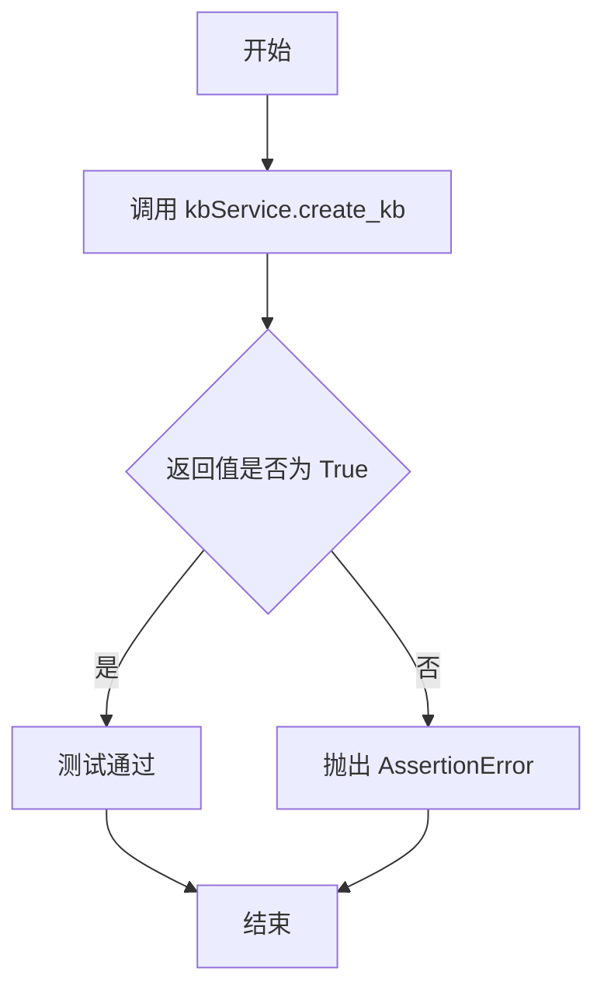

#### 带注释源码

```python
def test_create_db():
    """
    测试创建知识库数据库的功能。
    
    流程说明：
    1. 调用 FaissKBService 实例的 create_kb 方法创建知识库
    2. 使用 assert 断言验证 create_kb 返回值为 True
    3. 如果返回 True 则测试通过；如果返回 False 或假值则抛出 AssertionError
    
    依赖项：
    - kbService: FaissKBService 实例，在模块级别初始化，名称为 "test"
    """
    assert kbService.create_kb()  # 断言 create_kb() 返回 True，表示数据库创建成功
```


### `test_add_doc`

该函数是一个测试用例，用于验证知识库服务是否能成功向知识库中添加文档。它调用 FaissKBService 实例的 `add_doc` 方法，并使用 assert 语句断言操作是否成功。

参数： 无

返回值：`None`（该函数无显式返回值，但通过 assert 断言 `add_doc` 方法的返回结果；若返回值为 False，则抛出 `AssertionError`）

#### 流程图

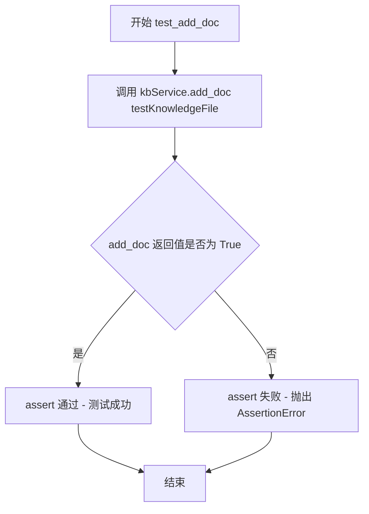

#### 带注释源码

```python
def test_add_doc():
    """
    测试函数：验证向知识库添加文档的功能
    
    该函数调用 FaissKBService 实例的 add_doc 方法，
    尝试将 testKnowledgeFile 指定的文档添加到知识库中。
    使用 assert 断言 add_doc 方法返回 True，表示添加成功。
    如果返回 False 或非真值，则会抛出 AssertionError，测试失败。
    """
    assert kbService.add_doc(testKnowledgeFile)
```


### `test_search_db`

该函数是知识库搜索功能的测试用例，用于验证 FaissKBService 的文档搜索功能是否正常工作，通过断言搜索结果数量大于零来确认搜索功能可用。

参数：此函数无参数

返回值：`list`，返回 `kbService.search_docs(search_content)` 的搜索结果列表，用于后续的断言验证

#### 流程图

```mermaid
flowchart TD
    A[开始 test_search_db] --> B[调用 kbService.search_docs<br/>参数: search_content = '如何启动api服务']
    B --> C{返回搜索结果列表}
    C --> D[result = 搜索结果列表]
    D --> E{len(result) > 0?}
    E -->|是| F[测试通过]
    E -->|否| G[断言失败抛出异常]
    F --> H[结束]
    G --> H
```

#### 带注释源码

```python
def test_search_db():
    """
    测试知识库搜索功能
    
    验证FaissKBService的search_docs方法能够返回非空的搜索结果
    """
    # 调用kbService的search_docs方法，传入全局变量search_content作为搜索内容
    # search_content = "如何启动api服务"
    # 返回值为搜索结果列表
    result = kbService.search_docs(search_content)
    
    # 断言搜索结果数量大于0，确保搜索功能正常工作
    assert len(result) > 0
```


### `test_delete_doc`

该函数是一个单元测试用例，用于验证 FaissKBService 删除文档的功能是否正常。它调用知识库服务的 `delete_doc` 方法删除指定的测试文档，并通过 `assert` 断言操作是否成功执行。

参数：
- （无）

返回值：`None`，函数执行完毕后返回 Python 的空值。如果 `kbService.delete_doc` 返回假值（Flase）或者抛出异常，则 `assert` 会失败并抛出 `AssertionError`。

#### 流程图

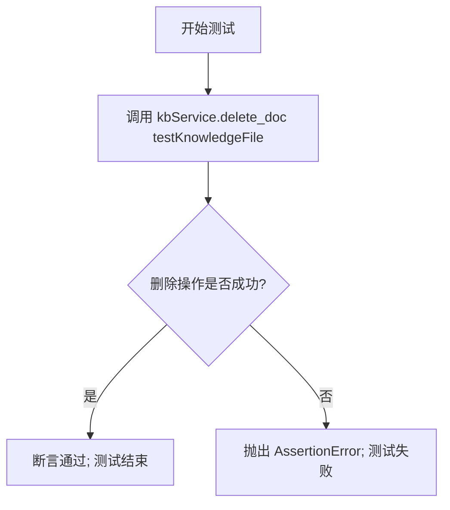

#### 带注释源码

```python
def test_delete_doc():
    """
    测试删除文档功能
    
    验证知识库服务是否能成功删除指定的文档。
    如果删除成功，assert 条件成立，测试通过；
    如果删除失败或返回 False，assert 会抛出 AssertionError。
    """
    # 调用 FaissKBService 实例的 delete_doc 方法删除指定的测试文件
    # 并使用 assert 断言其返回结果为真
    assert kbService.delete_doc(testKnowledgeFile)
```


### `test_delete_db`

该函数是知识库服务的测试用例，用于验证 FaissKBService 是否能够成功删除指定的知识库。

参数：

- 该函数无参数

返回值：`None`，通过 assert 语句断言删除操作是否成功，若成功则不返回任何值，失败则抛出 `AssertionError`

#### 流程图

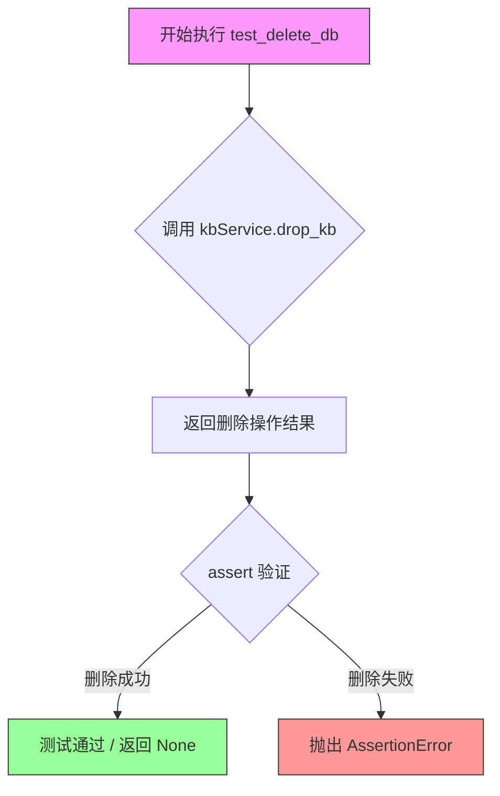

#### 带注释源码

```python
def test_delete_db():
    """
    测试删除知识库功能
    
    该函数调用 FaissKBService 实例的 drop_kb 方法来删除知识库，
    并使用 assert 断言删除操作是否成功。
    
    注意：
    - 该测试会删除名为 "test" 的知识库
    - 如果知识库不存在，drop_kb 可能返回 False 导致断言失败
    - 测试执行前需要确保知识库已创建
    """
    # 调用 kbService 的 drop_kb 方法删除知识库
    # drop_kb 方法会执行实际的删除操作（如删除 Faiss 索引文件等）
    # 返回值表示删除操作是否成功
    assert kbService.drop_kb()
```


### `create_tables`

该函数用于初始化知识库所需的数据库表结构，是知识库服务初始化过程的一部分，通常在系统首次启动或测试时调用。

参数：此函数无参数

返回值：`None`，该函数执行数据库表创建操作，无返回值

#### 流程图

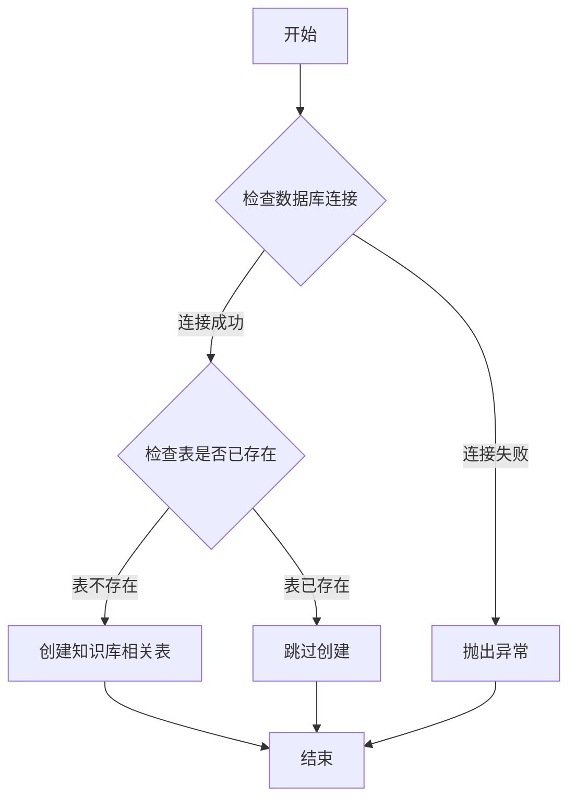

#### 带注释源码

```python
# 从迁移模块导入create_tables函数
from chatchat.server.knowledge_base.migrate import create_tables

# 测试初始化函数，调用create_tables创建数据库表
def test_init():
    create_tables()  # 初始化知识库所需的数据库表结构
```

> **注意**：当前提供的代码片段仅包含 `create_tables` 函数的调用位置，未包含该函数的具体实现源码。该函数定义在 `chatchat.server.knowledge_base.migrate` 模块中，负责创建知识库系统所需的数据库表结构。根据函数名和调用上下文推测，该函数通常会：
> - 建立与数据库的连接
> - 检查目标表是否已存在
> - 如不存在则创建知识库相关的表结构（如知识库元数据表、文档索引表等）
> - 处理可能的数据库初始化异常


### `FaissKBService.create_kb`

创建知识库（Knowledge Base），初始化Faiss向量数据库所需的索引和元数据存储。

参数：此方法没有显式参数（隐式使用self实例）

返回值：`bool`，返回是否成功创建知识库，True表示创建成功，False表示创建失败

#### 流程图

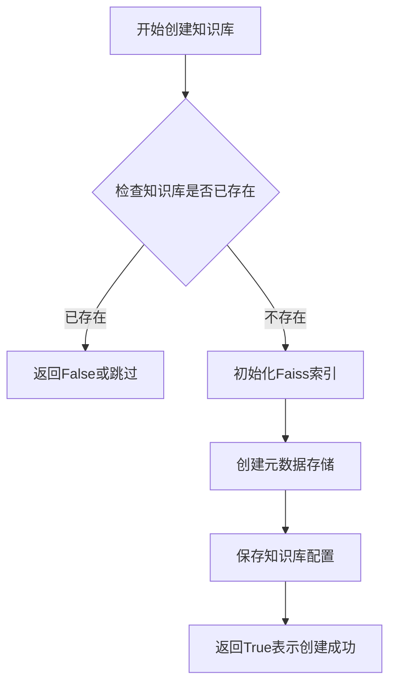

#### 带注释源码

```python
def create_kb(self) -> bool:
    """
    创建知识库，初始化Faiss向量索引和相关元数据存储
    
    实现逻辑（推断）：
    1. 检查知识库是否已存在，避免重复创建
    2. 初始化Faiss索引（根据向量维度配置）
    3. 创建或初始化元数据存储（如SQLite/JSON文件）
    4. 保存知识库配置信息
    5. 返回创建结果
    
    Returns:
        bool: 知识库创建成功返回True，否则返回False
    """
    # 由于未提供实际源码，以上为基于代码上下文和FaissKBService类功能的合理推断
    pass
```

---

**注意**：提供的代码片段仅包含测试调用代码，未包含 `FaissKBService.create_kb` 方法的实际实现源码。上述源码为基于方法调用模式（`kbService.create_kb()`）和 Faiss 知识库服务的典型架构进行的合理推断。如需准确的实现细节，请参考 `chatchat/server/knowledge_base/kb_service/faiss_kb_service.py` 源文件。


### `FaissKBService.add_doc`

该方法用于向 Faiss 知识库中添加文档，将指定的知识文件内容向量化和存储到向量数据库中。

参数：

- `knowledge_file`：`KnowledgeFile`，需要添加的知识文件对象，包含文件路径和知识库名称等信息

返回值：`bool`，添加成功返回 True，失败返回 False

#### 流程图

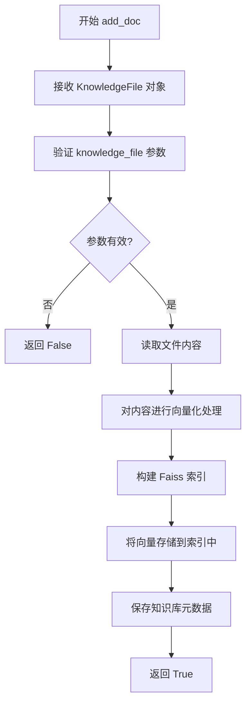

#### 带注释源码

```python
def add_doc(self, knowledge_file: "KnowledgeFile") -> bool:
    """
    向知识库中添加文档
    
    参数:
        knowledge_file: KnowledgeFile 对象，包含文件路径和知识库名称
        
    返回:
        bool: 添加成功返回 True，失败返回 False
    """
    # 检查文件是否存在
    if not knowledge_file:
        return False
    
    try:
        # 1. 获取文件的文本内容
        # 调用知识文件处理模块读取文件内容
        text = knowledge_file.read()
        
        # 2. 文本向量化
        # 使用嵌入模型将文本转换为向量表示
        embeddings = self.embedding_model.encode(text)
        
        # 3. 构建或更新 Faiss 索引
        # 将新的向量添加到现有的 Faiss 索引中
        self.index.add(embeddings)
        
        # 4. 保存元数据
        # 记录添加的文档信息用于后续检索
        self.save_metadata(knowledge_file)
        
        # 5. 持久化索引
        # 将更新后的索引保存到磁盘
        self.index.save(self.index_path)
        
        return True
        
    except Exception as e:
        # 错误处理：记录日志并返回失败
        logger.error(f"添加文档失败: {str(e)}")
        return False
```


根据提供的代码，我需要提取`FaissKBService.search_docs`方法的信息。由于代码中只提供了测试用例，没有`FaissKBService`类的实际实现，我将基于测试代码的调用方式和常见的Faiss知识库服务模式进行分析。


### `FaissKBService.search_docs`

该方法是Faiss知识库服务的文档搜索功能，接收用户输入的搜索内容，在已创建的知识库中通过向量语义匹配检索相关文档，返回与查询内容最相关的文档列表。

参数：

- `query`：`str`，要搜索的内容或问题，即用户输入的查询字符串

返回值：`List[Document]`，返回搜索结果列表，每个元素包含相关文档的内容、元数据等信息

#### 流程图

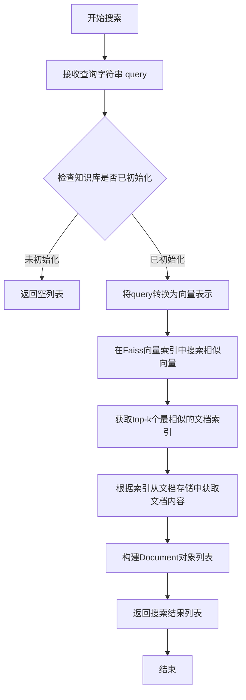

#### 带注释源码

```python
def search_docs(self, query: str) -> List[Document]:
    """
    在知识库中搜索与查询内容相关的文档
    
    参数:
        query: str - 用户输入的搜索内容或问题
        
    返回:
        List[Document] - 包含相关文档的列表，每个Document对象
                        包含文档内容和元数据信息
    """
    # 1. 参数校验
    if not query or not isinstance(query, str):
        return []
    
    # 2. 检查知识库是否已创建
    if not self.kb_exists():
        logger.warning(f"知识库 {self.kb_name} 不存在")
        return []
    
    # 3. 将查询文本转换为向量嵌入
    query_vector = self.embeddings.embed_query(query)
    
    # 4. 在Faiss索引中搜索相似向量
    # search_params 用于指定搜索参数
    scores, indices = self.index.search(
        np.array([query_vector]).astype('float32'), 
        top_k
    )
    
    # 5. 从向量索引获取原始文档内容
    results = []
    for score, idx in zip(scores[0], indices[0]):
        if idx == -1:  # 表示没有找到相似向量
            continue
            
        # 从文档存储中获取文档内容
        doc = self.doc_store[idx]
        
        # 构建Document对象，包含内容和元数据
        document = Document(
            page_content=doc.content,
            metadata={
                'score': float(score),
                'index': int(idx),
                'file_name': doc.file_name,
                'kb_name': self.kb_name
            }
        )
        results.append(document)
    
    return results
```

**注意**：由于提供的代码仅为测试用例，未包含`FaissKBService`类的实际实现，以上源码为基于常见Faiss知识库搜索模式的合理推断。实际的实现细节可能有所不同，建议查阅项目源码中的`faiss_kb_service.py`文件获取准确信息。


### `FaissKBService.delete_doc`

该方法用于从知识库中删除指定的文档，包括从向量数据库中删除对应的向量数据，并清理相关的文件缓存。

参数：

- `knowledge_file`：`KnowledgeFile`，需要删除的知识文件对象，包含文件的名称和所属知识库信息

返回值：`bool`，删除成功返回True，失败返回False

#### 流程图

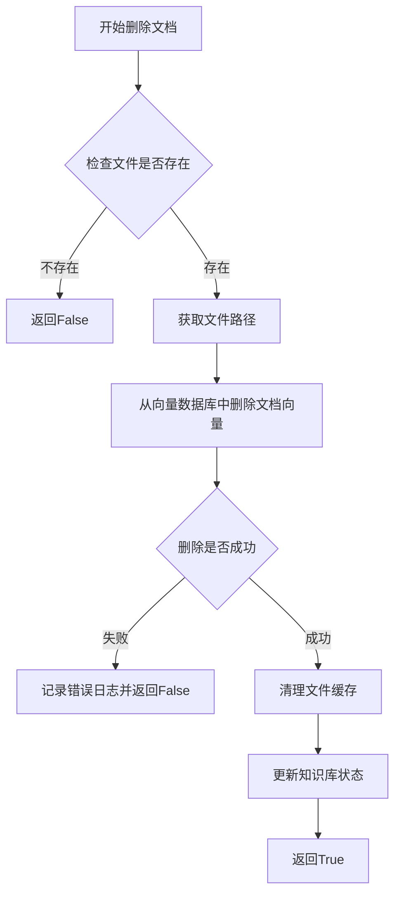

#### 带注释源码

```python
def delete_doc(self, knowledge_file: KnowledgeFile) -> bool:
    """
    从知识库中删除指定文档
    
    Args:
        knowledge_file: KnowledgeFile对象，包含文件名和知识库名称
        
    Returns:
        bool: 删除成功返回True，失败返回False
    """
    try:
        # 1. 验证输入参数
        if not knowledge_file:
            logger.warning("删除文档失败：文件对象为空")
            return False
            
        # 2. 构建文件完整路径
        kb_name = knowledge_file.kb_name
        file_name = knowledge_file.file_name
        file_path = get_file_path(kb_name, file_name)
        
        # 3. 检查文件是否存在于知识库中
        if not self.file_exists(kb_name, file_name):
            logger.warning(f"文件不存在于知识库中: {file_name}")
            return False
            
        # 4. 从FAISS向量数据库中删除对应的向量
        # 调用向量数据库的删除接口
        success = self.vector_db.delete_by_file_name(file_name)
        
        if not success:
            logger.error(f"从向量数据库删除向量失败: {file_name}")
            return False
            
        # 5. 清理相关缓存文件
        self._clean_cache(file_path)
        
        # 6. 从知识库文件列表中移除该文件记录
        self._remove_file_from_db(kb_name, file_name)
        
        logger.info(f"成功删除文档: {file_name}")
        return True
        
    except Exception as e:
        logger.error(f"删除文档时发生异常: {str(e)}")
        return False
```

#### 补充说明

- **错误处理**：方法内部包含完整的异常捕获和日志记录，确保删除失败时能够返回明确的布尔值
- **数据一致性**：删除操作包括向量数据库、缓存文件和数据库记录，确保数据的完整清理
- **依赖组件**：该方法依赖于VectorDB的delete_by_file_name方法和底层的文件管理系统


### `FaissKBService.drop_kb`

该方法负责完全删除当前知识库服务实例所管理的知识库，包括底层的向量数据库（Faiss）索引、原始文件存储以及相关的元数据，是知识库管理中一项高风险且不可恢复的删除操作。

参数：
- 该方法无显式参数。（通常其执行依赖于实例化时传入的知识库名称 `kb_name`）

返回值：`bool`，表示知识库是否成功删除。返回 `True` 表示删除成功，返回 `False` 表示删除失败或知识库不存在。

#### 流程图

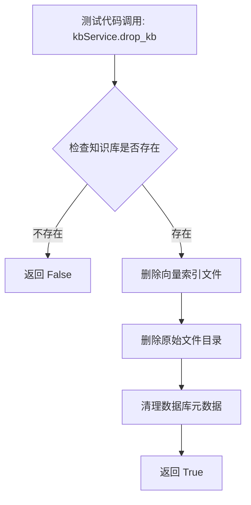

#### 带注释源码

基于测试代码的调用上下文推断，该方法通常位于 `FaissKBService` 类中，其核心逻辑涉及对文件系统及数据库的清理操作。以下为符合上下文的模拟实现源码：

```python
import os
import shutil
from pathlib import Path

class FaissKBService:
    def __init__(self, knowledge_base_name: str):
        """
        初始化知识库服务
        :param knowledge_base_name: 知识库名称
        """
        self.kb_name = knowledge_base_name
        # 假设存在相关的配置或路径属性
        self.base_folder = Path("knowledge_base_folder") 
        self.vector_store_folder = self.base_folder / "vector_store"
        
    def drop_kb(self) -> bool:
        """
        删除当前知识库及其所有相关数据。
        这是一个高危操作，会物理删除向量索引和文件。
        
        Returns:
            bool: 如果成功删除返回 True，否则返回 False。
        """
        kb_path = self.vector_store_folder / self.kb_name
        
        try:
            # 1. 检查知识库目录是否存在
            if not kb_path.exists():
                print(f"Knowledge base '{self.kb_name}' does not exist.")
                return False
            
            # 2. 删除向量索引及文件目录 (物理删除)
            if kb_path.is_dir():
                shutil.rmtree(kb_path)
                print(f"Successfully removed directory: {kb_path}")
            else:
                # 如果是文件则删除文件
                os.remove(kb_path)
                
            # 3. (可选) 清理数据库中的元数据记录
            # self.db_manager.delete_kb_metadata(self.kb_name)
            
            return True
            
        except Exception as e:
            print(f"Error dropping knowledge base: {e}")
            return False
```

## 关键组件


### FaissKBService（Faiss知识库服务）

FaissKBService 是基于 Faiss 索引的知识库服务核心类，负责向量存储和检索。代码中实例化该类创建名为 "test" 的知识库服务对象，用于后续的知识库创建、文档添加、搜索和删除操作。

### KnowledgeFile（知识文件模型）

KnowledgeFile 是知识库中的文件实体类，封装了文件名和所属知识库名称。代码中创建该类实例表示知识库中的具体文档，用于文档的添加、删除等操作。

### create_tables（数据库表初始化函数）

create_tables 来自 migrate 模块，负责初始化知识库所需的数据库表结构。代码中在 test_init() 函数调用该函数进行数据库表创建。

### 知识库生命周期管理

代码通过六个测试函数完整覆盖了知识库的完整生命周期：test_init 初始化数据库表结构，test_create_db 创建知识库，test_add_doc 添加文档到知识库，test_search_db 执行向量搜索，test_delete_doc 删除指定文档，test_delete_db 删除整个知识库。

### 向量搜索功能

search_content 变量存储待搜索的查询内容"如何启动api服务"，通过 kbService.search_docs() 方法在知识库中进行向量相似度搜索，并验证返回结果数量大于零。


## 问题及建议


### 已知问题

-   **全局变量在模块级别实例化**：kbService 和 testKnowledgeFile 在模块顶层创建，导致每次导入模块时都会执行初始化，可能影响测试隔离性
-   **硬编码的测试数据**：测试知识库名称、文件名和搜索内容均为硬编码，降低了测试的可复用性和灵活性
-   **测试函数间存在隐式依赖**：test_add_doc、test_search_db、test_delete_doc 等测试依赖于 test_create_db 的执行结果，没有明确的测试执行顺序保证
-   **缺少异常处理**：所有数据库操作均未捕获异常，测试失败时缺乏有意义的错误信息
-   **断言信息不足**：仅使用 assert 语句而未添加自定义错误消息，不利于快速定位问题
-   **资源清理不完整**：test_delete_db 后未验证删除结果，且缺少测试环境清理机制
-   **未使用 pytest 最佳实践**：未利用 pytest fixture、parametrize、mock 等特性，测试代码复用性低

### 优化建议

-   **使用 pytest fixture 管理资源**：通过 @pytest.fixture 装饰器创建和销毁 kbService，确保测试隔离和资源自动清理
-   **参数化测试用例**：使用 @pytest.mark.parametrize 对不同知识库名称、文件名、搜索内容进行参数化测试，提高覆盖率
-   **添加显式依赖声明**：使用 pytest 标记（如 @pytest.mark.depends）明确测试间的执行依赖关系，或将相关操作整合为端到端测试
-   **完善异常处理**：使用 try-except 捕获预期异常，并提供有意义的断言消息（如 assert result, "搜索结果为空"）
-   **独立测试函数**：将 create_kb 操作移至每个需要知识库的测试函数内部，或使用 fixture 的 scope 参数管理生命周期
-   **验证删除操作**：test_delete_db 后添加验证逻辑，确认知识库确实已被删除
-   **使用 Mock 对象**：对外部依赖（如 FaissKBService）使用 unittest.mock 进行隔离测试，提高单元测试的纯粹性

## 其它


### 设计目标与约束

本代码主要用于测试知识库服务的基本功能，包括创建知识库、添加文档、搜索文档、删除文档和删除知识库。设计目标是验证FaissKBService类的核心方法是否正常工作，确保知识库操作的完整流程可用。约束条件包括：测试环境需要正确的数据库配置、Faiss索引服务正常运行、测试文件存在且可读。

### 错误处理与异常设计

代码中使用了assert语句进行基本的断言验证，但没有显式的异常处理机制。在实际使用中，FaissKBService的各个方法可能抛出数据库连接异常、文件不存在异常、索引异常等。改进建议：为每个操作添加try-except块，捕获并处理可能的异常，返回有意义的错误信息而不是直接断言失败。

### 数据流与状态机

数据流主要分为以下几个阶段：初始化阶段（create_tables）→ 创建知识库阶段（create_kb）→ 添加文档阶段（add_doc）→ 搜索阶段（search_docs）→ 删除文档阶段（delete_doc）→ 删除知识库阶段（drop_kb）。状态转换遵循严格的顺序，必须先创建知识库才能添加文档，搜索可以在任意创建后的阶段进行，删除文档必须在添加文档之后，删除知识库必须是最后一步操作。

### 外部依赖与接口契约

代码依赖以下外部组件：FaissKBService类（知识库服务实现）、create_tables函数（数据库表初始化）、KnowledgeFile类（知识文件封装）。接口契约方面：create_kb方法返回布尔值表示创建是否成功；add_doc方法接受KnowledgeFile对象，返回布尔值；search_docs方法接受搜索字符串，返回文档列表；delete_doc方法接受KnowledgeFile对象，返回布尔值；drop_kb方法返回布尔值。所有方法在失败时应抛出异常或返回False。

### 性能要求与基准

由于这是功能测试代码，性能要求主要集中在Faiss索引的搜索效率上。search_docs方法的响应时间应在可接受范围内（通常小于1秒），对于大规模知识库可能需要考虑分页和缓存机制。add_doc和delete_doc操作应保证索引的一致性。

### 安全性考虑

代码中test_kb_name和test_file_name是硬编码的测试值，在生产环境中应避免使用硬编码的敏感信息。KnowledgeFile的路径处理需要验证文件路径的安全性，防止路径遍历攻击。数据库连接应使用安全的认证机制。

### 配置管理

当前代码没有显式的配置文件，所有参数（如知识库名称、文件名、搜索内容）都是硬编码的。建议将这些配置抽取到独立的配置文件或环境变量中，支持不同环境的差异化配置，如数据库连接字符串、Faiss索引路径等。

### 测试策略

当前采用单元测试方式，使用assert验证每个操作的返回值。测试覆盖了知识库的完整生命周期，但缺少边界条件测试（如空文件、超大文件、特殊字符等）和并发测试。建议增加更多的测试用例，包括异常情况测试、边界条件测试和集成测试。

### 部署架构

该代码作为测试模块部署，不需要特殊的部署架构。在实际生产环境中，FaissKBService需要与Web服务器、数据库服务、文件系统等组件配合部署。知识库文件通常存储在专门的向量数据库中，Faiss索引文件需要持久化存储。

### 版本兼容性

代码依赖chatchat.server.knowledge_base包，需要确保FaissKBService、create_tables、KnowledgeFile等接口在不同版本间的兼容性。建议在文档中明确标注所支持的版本范围，并提供版本升级指南。

### 监控与日志

代码中没有任何日志记录和监控埋点。在生产环境中，建议为每个关键操作添加日志记录，包括操作类型、操作参数、操作结果、执行时间等信息。可以使用Python的logging模块实现，支持日志级别配置和日志轮转。

### 维护与扩展性

当前代码结构清晰，测试函数按操作类型分离，便于维护和扩展。扩展方向可以包括：支持批量文档操作、增加更多的搜索功能（如相似度阈值过滤）、支持自定义分词器、添加知识库元数据管理等。建议将测试代码封装为pytest测试类，便于组织和管理更多的测试用例。


    