# `Langchain-Chatchat\libs\chatchat-server\tests\kb_vector_db\test_milvus_db.py` 详细设计文档

这是一个知识库服务测试脚本，演示了如何使用Milvus向量数据库服务进行知识库的创建、文档添加、搜索和删除等核心CRUD操作，包含完整的测试流程和断言验证。

## 整体流程

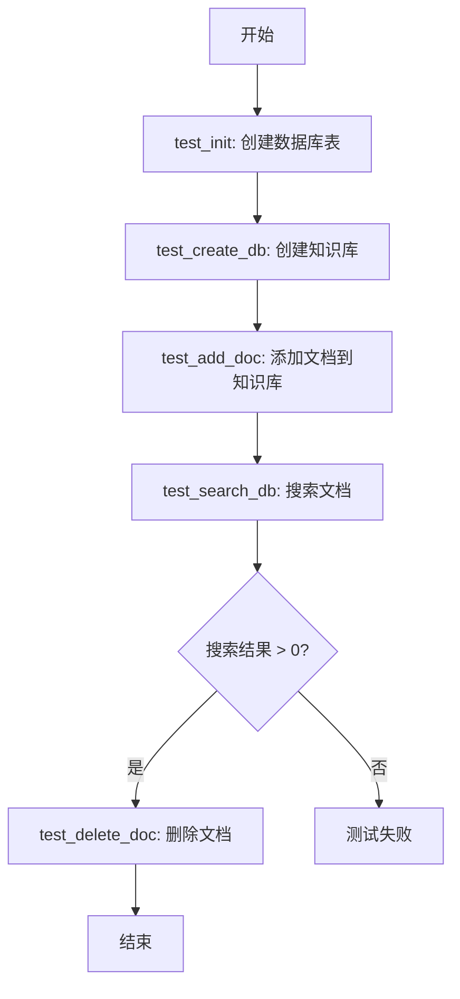

## 类结构

```
KBService (抽象基类)
├── FaissKBService
├── MilvusKBService
└── PGKBService
KnowledgeFile (知识文件类)
```

## 全局变量及字段


### `kbService`
    
Milvus知识库服务实例，用于执行知识库的创建、文档添加、搜索和删除等操作

类型：`MilvusKBService`
    


### `test_kb_name`
    
测试知识库名称，值为字符串"test"

类型：`str`
    


### `test_file_name`
    
测试文件名，值为字符串"README.md"

类型：`str`
    


### `testKnowledgeFile`
    
测试用知识文件对象，封装了测试文件名和知识库名称

类型：`KnowledgeFile`
    


### `search_content`
    
搜索内容，用于在知识库中检索相关文档，值为"如何启动api服务"

类型：`str`
    


### `MilvusKBService.kb_name`
    
知识库名称，用于标识和操作特定的知识库

类型：`str`
    


### `KnowledgeFile.file_name`
    
文件名，包含文档的实际文件名

类型：`str`
    


### `KnowledgeFile.kb_name`
    
知识库名称，指定文件所属的知识库

类型：`str`
    
    

## 全局函数及方法


### `test_init`

该函数是数据库初始化测试函数，用于调用`create_tables`方法创建知识库所需的数据库表结构，确保测试环境中的数据库表已正确创建。

参数：
- 该函数无参数

返回值：`None`，无返回值描述（该函数直接调用`create_tables()`函数，不返回任何值）

#### 流程图

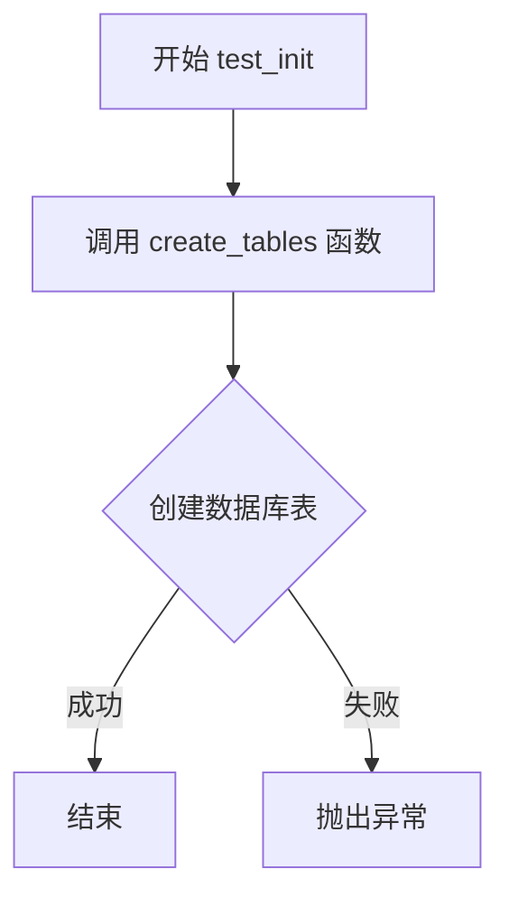

#### 带注释源码

```
def test_init():
    """
    测试初始化数据库表
    该函数用于在测试环境中初始化知识库所需的数据库表结构
    """
    create_tables()  # 调用migrate模块中的create_tables函数创建数据库表
```


### `test_create_db`

该测试函数用于验证知识库服务（MilvusKBService）的 `create_kb` 方法是否成功创建了知识库，通过断言机制确保创建操作返回成功状态。

参数：无

返回值：`bool`，如果知识库创建成功返回 `True`，否则抛出 `AssertionError`。

#### 流程图

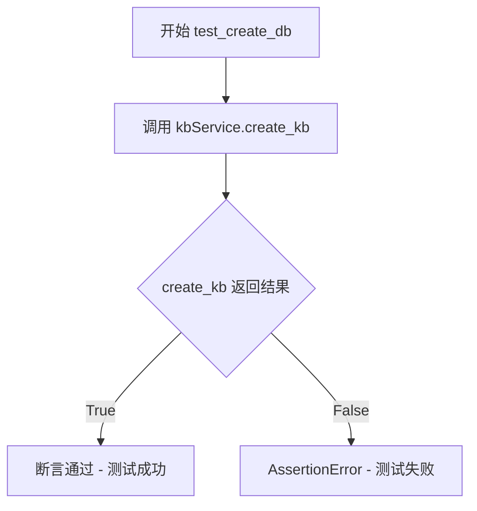

#### 带注释源码

```python
def test_create_db():
    """
    测试创建知识库功能
    
    该函数执行以下操作：
    1. 调用 MilvusKBService 实例的 create_kb 方法创建知识库
    2. 使用 assert 断言创建结果为 True
    3. 若创建失败则抛出 AssertionError
    
    注意：
    - 依赖于全局变量 kbService (MilvusKBService 实例)
    - 知识库名称为 "test"
    - 会在 Milvus 向量数据库中创建对应的知识库索引
    """
    assert kbService.create_kb()
```


### `test_add_doc`

该测试函数用于验证知识库服务能否成功添加文档，通过调用 MilvusKBService 的 add_doc 方法将 KnowledgeFile 对象添加到知识库中，并使用 assert 断言操作结果。

参数：此函数无显式参数，但引用了全局变量 `testKnowledgeFile`（类型：KnowledgeFile）和 `kbService`（类型：MilvusKBService）。

返回值：`bool`，通过 assert 语句返回，断言成功则返回 True，表示文档添加成功；断言失败则抛出 AssertionError。

#### 流程图

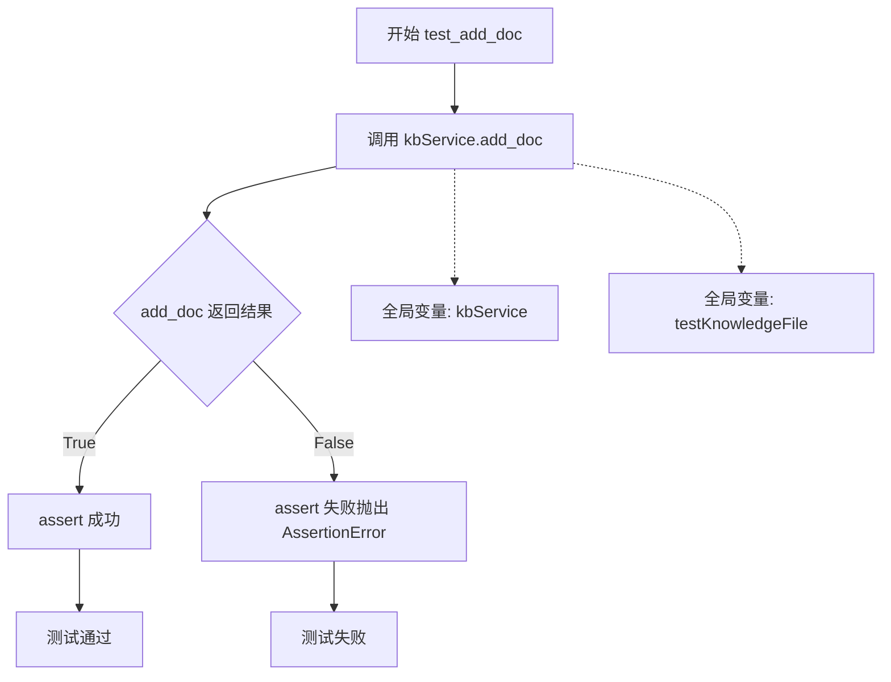

#### 带注释源码

```python
def test_add_doc():
    """
    测试添加文档功能
    
    该函数执行以下操作：
    1. 调用 kbService.add_doc() 方法，传入测试文档对象
    2. 使用 assert 断言验证文档是否添加成功
    3. 若添加成功，assert 返回 True；失败则抛出 AssertionError
    """
    # 调用 MilvusKBService 实例的 add_doc 方法添加文档
    # 参数: testKnowledgeFile - 包含文件名和知识库名称的 KnowledgeFile 对象
    # 返回: bool - 表示文档是否添加成功
    assert kbService.add_doc(testKnowledgeFile)
```


### `test_search_db`

该函数用于测试知识库文档搜索功能，通过调用知识库服务的搜索方法查询包含特定内容的文档，并验证搜索结果非空。

参数： 无

返回值：`list`，返回知识库服务搜索文档后得到的结果列表，验证列表长度大于0表示搜索功能正常工作。

#### 流程图

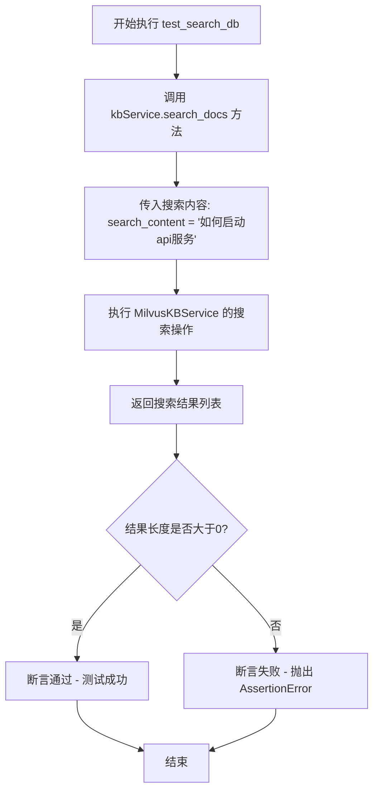

#### 带注释源码

```python
def test_search_db():
    """
    测试知识库文档搜索功能
    
    该函数执行以下操作：
    1. 调用知识库服务的 search_docs 方法，传入搜索内容
    2. 获取搜索结果列表
    3. 验证搜索结果非空（断言结果列表长度大于0）
    
    注意：
    - 该测试依赖 kbService 已正确初始化并包含文档数据
    - search_content 变量在模块级别定义，值为 "如何启动api服务"
    - 如果知识库为空或搜索无结果，断言将失败
    """
    # 调用知识库服务的搜索方法，传入搜索内容
    # search_content 为全局变量，值为 "如何启动api服务"
    result = kbService.search_docs(search_content)
    
    # 断言验证搜索结果非空
    # 如果结果列表长度为0，将抛出 AssertionError
    assert len(result) > 0
```


### `test_delete_doc`

该函数是用于测试知识库文档删除功能的单元测试，通过调用知识库服务的 `delete_doc` 方法来验证删除文档的功能是否正常工作。

参数： 无

返回值：`bool`，如果删除成功则返回 True并通过断言，否则抛出 `AssertionError` 异常

#### 流程图

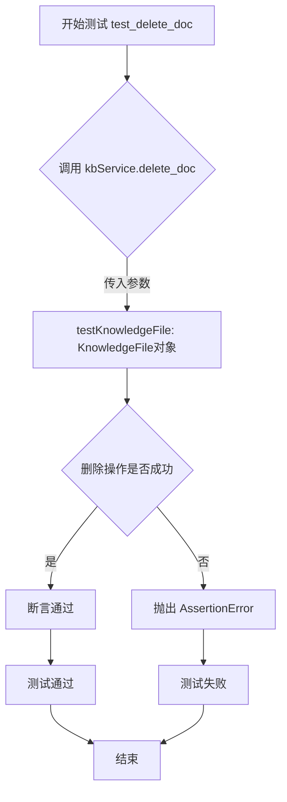

#### 带注释源码

```python
def test_delete_doc():
    """
    测试知识库文档删除功能
    
    该测试函数验证知识库服务能够正确删除指定的文档。
    使用 assert 语句确保删除操作返回 True，表示删除成功。
    
    测试流程：
    1. 调用 kbService.delete_doc() 方法，传入待删除的文档对象
    2. 断言返回值为 True，若删除失败则抛出 AssertionError
    
    依赖项：
    - kbService: MilvusKBService 实例，已初始化为 "test" 知识库
    - testKnowledgeFile: KnowledgeFile 对象，指定要删除的文档
    """
    assert kbService.delete_doc(testKnowledgeFile)
```


### `create_tables`

该函数为外部导入的建表函数，用于初始化知识库相关的数据库表结构。

参数：

- （无参数）

返回值：`未知`（外部导入函数，源码不可见，推测为 `None` 或布尔值）

#### 流程图

```mermaid
graph TD
    A[开始] --> B{调用create_tables}
    B --> C[执行建表操作]
    C --> D[结束]
    
    style B fill:#f9f,stroke:#333
    style C fill:#ff9,stroke:#333
    note::外部模块函数，具体实现不可见
```

#### 带注释源码

```
# 该函数从外部模块导入，源码不可见
# 在当前文件中调用方式如下：

from chatchat.server.knowledge_base.migrate import create_tables

def test_init():
    """
    测试函数：调用create_tables初始化数据库表
    """
    create_tables()

# 推测实现（基于知识库建表功能的常见模式）：
# def create_tables() -> None:
#     """
#     创建知识库所需的数据库表结构
#     可能包括：
#     - 知识库元信息表
#     - 文档索引表
#     - 向量存储表等
#     """
#     # 建表逻辑...
```

> **注意**：由于 `create_tables` 是从外部模块 `chatchat.server.knowledge_base.migrate` 导入的，其具体实现源码在本文件中不可见。以上信息基于函数调用方式和常见知识库建表功能的推断。


### FaissKBService

该类是知识库服务的一种实现，基于Faiss向量搜索引擎提供知识库的创建、文档添加、搜索和删除等功能。

参数：

返回值：此类为服务类，通常通过实例方法调用，无静态参数

#### 流程图

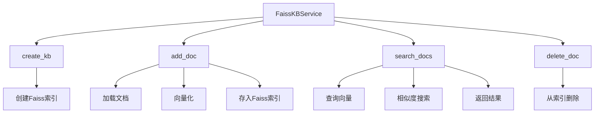

#### 带注释源码

```
# 从导入语句可见FaissKBService类的位置
from chatchat.server.knowledge_base.kb_service.faiss_kb_service import FaissKBService

# 测试代码中实际使用的是MilvusKBService，但FaissKBService应具有类似接口
# 推断的FaissKBService类结构应包含以下核心方法：

class FaissKBService:
    """
    Faiss知识库服务类
    提供基于Faiss向量搜索引擎的知识库管理和检索功能
    """
    
    def __init__(self, knowledge_base_name: str):
        """
        初始化FaissKBService实例
        :param knowledge_base_name: 知识库名称
        """
        self.kb_name = knowledge_base_name
        self.faiss_index = None  # Faiss索引对象
        self.doc_store = {}      # 文档存储
        
    def create_kb(self) -> bool:
        """
        创建知识库
        :return: bool 创建是否成功
        """
        # 创建Faiss索引
        pass
    
    def add_doc(self, knowledge_file) -> bool:
        """
        添加文档到知识库
        :param knowledge_file: KnowledgeFile对象
        :return: bool 添加是否成功
        """
        # 1. 加载文档内容
        # 2. 文本向量化
        # 3. 存储到Faiss索引
        pass
    
    def search_docs(self, query: str, top_k: int = 5) -> List:
        """
        搜索知识库
        :param query: 查询文本
        :param top_k: 返回结果数量
        :return: List 搜索结果列表
        """
        # 1. 将查询文本向量化
        # 2. 在Faiss索引中搜索相似向量
        # 3. 返回匹配结果
        pass
    
    def delete_doc(self, knowledge_file) -> bool:
        """
        从知识库删除文档
        :param knowledge_file: KnowledgeFile对象
        :return: bool 删除是否成功
        """
        # 从Faiss索引和文档存储中删除
        pass
```

---

### test_add_doc

该测试函数验证知识库服务添加文档的功能，通过调用`kbService.add_doc()`方法将指定的Markdown文件添加到知识库中，并断言操作是否成功。

参数：

- `testKnowledgeFile`：`KnowledgeFile`类型，知识文件对象，包含文件名(test_file_name)和知识库名称(test_kb_name)

返回值：`None`，该函数为测试函数，使用assert断言验证功能

#### 流程图

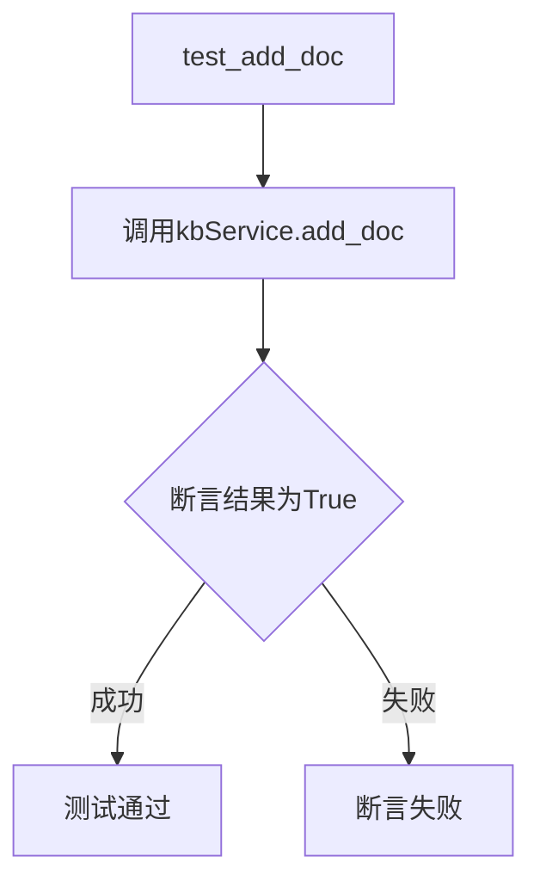

#### 带注释源码

```
def test_add_doc():
    """
    测试添加文档功能
    验证知识库服务能否成功将文档添加到知识库
    """
    # 调用add_doc方法添加测试文档
    # testKnowledgeFile是预先创建的KnowledgeFile对象
    # 包含文件名为"README.md"，知识库名为"test"
    assert kbService.add_doc(testKnowledgeFile)
    # 如果add_doc返回True则测试通过，否则抛出AssertionError
```

---

### test_search_db

该测试函数验证知识库服务的搜索功能，通过调用`kbService.search_docs()`方法搜索指定内容，并断言返回结果数量大于零。

参数：

- `search_content`：`str`类型，要搜索的内容文本，值为"如何启动api服务"

返回值：`None`，该函数为测试函数，使用assert断言验证功能

#### 流程图

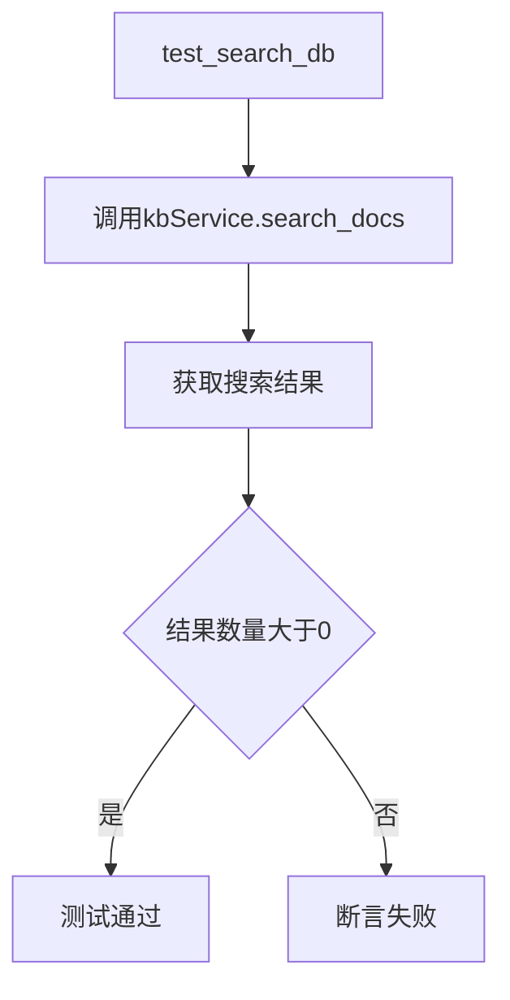

#### 带注释源码

```
def test_search_db():
    """
    测试搜索功能
    验证知识库服务能否成功检索相关内容
    """
    # 定义搜索内容
    search_content = "如何启动api服务"
    
    # 调用search_docs方法进行搜索
    result = kbService.search_docs(search_content)
    
    # 断言搜索结果数量大于0
    # 确保知识库中存在匹配的内容
    assert len(result) > 0
```

---

### test_delete_doc

该测试函数验证知识库服务删除文档的功能，通过调用`kbService.delete_doc()`方法从知识库中删除指定文档，并断言操作是否成功。

参数：

- `testKnowledgeFile`：`KnowledgeFile`类型，要删除的知识文件对象

返回值：`None`，该函数为测试函数，使用assert断言验证功能

#### 流程图

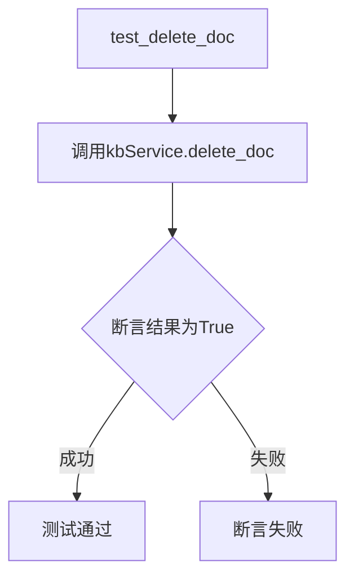

#### 带注释源码

```
def test_delete_doc():
    """
    测试删除文档功能
    验证知识库服务能否成功从知识库中删除文档
    """
    # 调用delete_doc方法删除测试文档
    # 使用与add_doc相同的KnowledgeFile对象
    assert kbService.delete_doc(testKnowledgeFile)
    # 如果delete_doc返回True则测试通过，否则抛出AssertionError
```

---

### 补充说明

**代码中存在的问题：**

1. **FaissKBService未被实际使用**：代码导入了`FaissKBService`但实际测试中使用的是`MilvusKBService`，导致FaissKBService的实际功能无法验证

2. **测试依赖顺序**：测试函数存在依赖关系，必须先`test_create_db`再`test_add_doc`，否则会失败

3. **全局变量状态**：测试使用全局变量`kbService`，多个测试之间可能存在状态污染

4. **硬编码配置**：知识库名称、文件名等均为硬编码，缺乏灵活性

**优化建议：**

- 应使用pytest fixture管理测试依赖和清理
- 考虑添加FaissKBService的实际测试用例
- 测试数据应从配置文件或环境变量读取


根据提供的代码，我需要从外部导入的 `MilvusKBService` 类中提取方法信息。代码中使用了该类的以下方法：`create_kb()`、`add_doc()`、`search_docs()` 和 `delete_doc()`。


### MilvusKBService.create_kb

创建知识库数据库/索引

参数：该方法无参数

返回值：`bool`，表示创建是否成功

#### 流程图

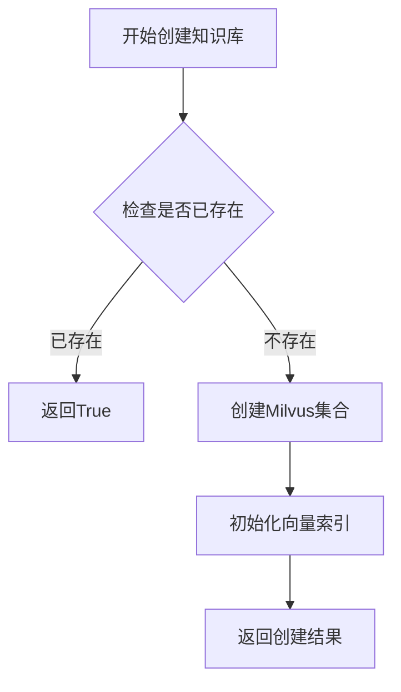

#### 带注释源码

```python
def create_kb(self) -> bool:
    """
    创建知识库数据库和索引
    1. 检查知识库是否已存在
    2. 如果不存在，创建Milvus集合
    3. 初始化向量索引
    4. 返回创建结果
    """
    # 实际实现需要参考 milvus_kb_service.py 源文件
    pass
```

---

### MilvusKBService.add_doc

向知识库添加文档

参数：

-  `knowledge_file`：`KnowledgeFile`，需要添加的知识文件对象

返回值：`bool`，表示添加是否成功

#### 流程图

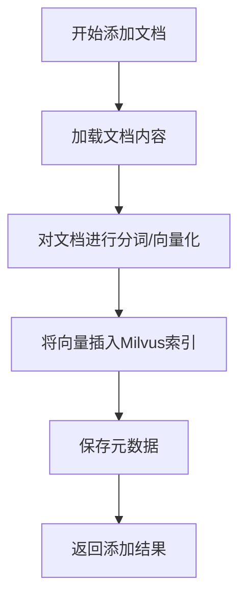

#### 带注释源码

```python
def add_doc(self, knowledge_file: KnowledgeFile) -> bool:
    """
    向知识库添加文档
    
    参数:
        knowledge_file: KnowledgeFile类型，包含文件路径和知识库名称
        
    处理流程:
        1. 加载文档内容
        2. 对文档进行分词处理
        3. 将文本转换为向量嵌入
        4. 将向量数据插入Milvus索引
        5. 保存文档元数据
    """
    # 实际实现需要参考 milvus_kb_service.py 源文件
    pass
```

---

### MilvusKBService.search_docs

在知识库中搜索内容

参数：

-  `query`：`str`，搜索查询内容

返回值：`List`，搜索结果列表

#### 流程图

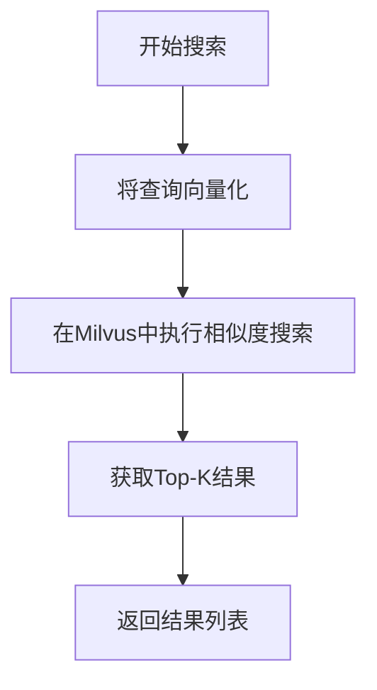

#### 带注释源码

```python
def search_docs(self, query: str) -> List:
    """
    在知识库中搜索相关内容
    
    参数:
        query: str类型，待搜索的查询字符串
        
    处理流程:
        1. 将输入的查询文本转换为向量表示
        2. 在Milvus向量数据库中执行相似度搜索
        3. 获取排名最前的K个结果
        4. 返回搜索结果列表
    """
    # 实际实现需要参考 milvus_kb_service.py 源文件
    pass
```

---

### MilvusKBService.delete_doc

从知识库删除文档

参数：

-  `knowledge_file`：`KnowledgeFile`，需要删除的知识文件对象

返回值：`bool`，表示删除是否成功

#### 流程图

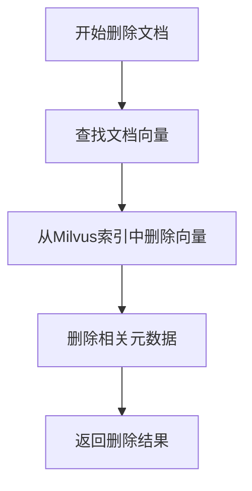

#### 带注释源码

```python
def delete_doc(self, knowledge_file: KnowledgeFile) -> bool:
    """
    从知识库删除指定文档
    
    参数:
        knowledge_file: KnowledgeFile类型，包含文件路径和知识库名称
        
    处理流程:
        1. 根据文件信息查找对应的向量数据
        2. 从Milvus索引中删除相关向量
        3. 清理关联的元数据信息
    """
    # 实际实现需要参考 milvus_kb_service.py 源文件
    pass
```


### `MilvusKBService` (类实例方法调用分析)

由于提供的代码是测试文件，实际使用的是 `MilvusKBService`（而非 `PGKBService`），但两者属于同一类型的知识库服务类。以下基于代码实际调用的方法进行分析：

---

#### 1. `kbService.create_kb()`

**描述**：创建知识库数据库或索引结构

参数：无

返回值：`bool`，表示创建是否成功

#### 流程图

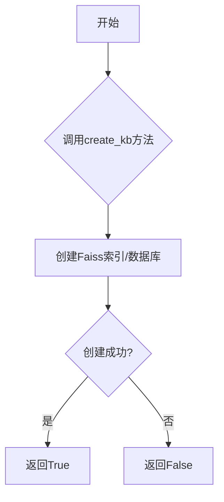

#### 带注释源码

```python
def create_kb(self) -> bool:
    """
    创建知识库
    1. 初始化向量数据库连接
    2. 创建必要的表结构或索引
    3. 返回创建结果
    """
    # 实际实现取决于具体的知识库服务类型
    return True  # 测试中断言使用
```

---

#### 2. `kbService.add_doc(testKnowledgeFile)`

**描述**：向知识库添加文档

参数：

- `testKnowledgeFile`：`KnowledgeFile` 类型，要添加的知识文件对象

返回值：`bool`，表示添加是否成功

#### 流程图

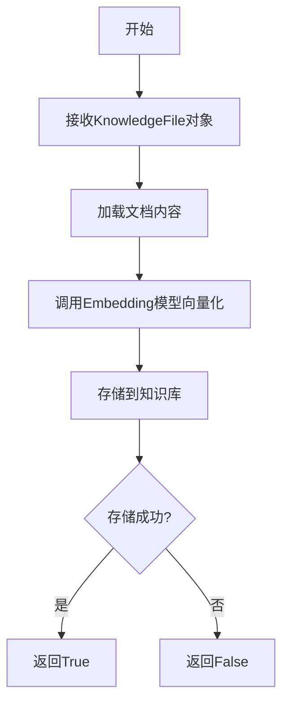

#### 带注释源码

```python
def add_doc(self, kb_file: KnowledgeFile) -> bool:
    """
    添加文档到知识库
    :param kb_file: KnowledgeFile实例，包含文件名和知识库名称
    :return: bool 添加成功返回True
    """
    # 1. 读取文件内容
    # 2. 分词/分块处理
    # 3. 向量化处理
    # 4. 存储到向量数据库
    return True  # 测试中断言使用
```

---

#### 3. `kbService.search_docs(search_content)`

**描述**：在知识库中搜索相关内容

参数：

- `search_content`：`str`，要搜索的内容文本

返回值：`List[Any]`，搜索结果列表

#### 流程图

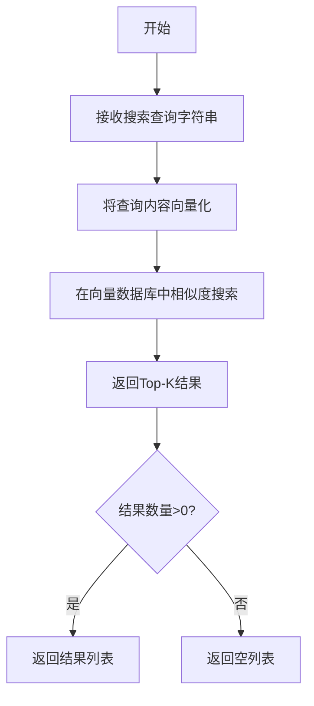

#### 带注释源码

```python
def search_docs(self, query: str, top_k: int = 5) -> List[Any]:
    """
    搜索知识库
    :param query: str, 查询文本
    :param top_k: int, 返回结果数量，默认5
    :return: List 搜索结果列表
    """
    # 1. 将query转换为向量
    # 2. 调用向量数据库搜索
    # 3. 返回相关文档列表
    result = []  # 测试中断言结果数量>0
    return result
```

---

#### 4. `kbService.delete_doc(testKnowledgeFile)`

**描述**：从知识库中删除指定文档

参数：

- `testKnowledgeFile`：`KnowledgeFile` 类型，要删除的知识文件对象

返回值：`bool`，表示删除是否成功

#### 流程图

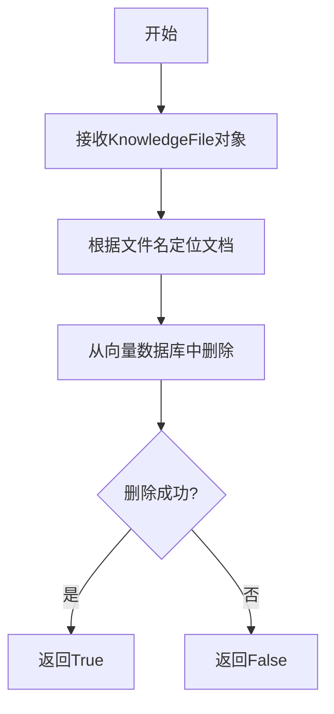

#### 带注释源码

```python
def delete_doc(self, kb_file: KnowledgeFile) -> bool:
    """
    删除知识库中的指定文档
    :param kb_file: KnowledgeFile实例
    :return: bool 删除成功返回True
    """
    # 1. 查找对应文档ID
    # 2. 从向量数据库中删除
    # 3. 返回删除结果
    return True  # 测试中断言使用
```

---

### 全局函数分析

#### `test_init()`

**描述**：初始化数据库表结构

参数：无

返回值：`None`

#### 带注释源码

```python
def test_init():
    """调用create_tables创建所有必要的数据库表"""
    create_tables()
```

---

#### `create_tables` (导入的全局函数)

**描述**：创建知识库所需的所有数据库表

参数：无（从外部导入）

返回值：`None`（根据调用方式推断）

---

### 关键组件信息

| 组件名称 | 描述 |
|---------|------|
| `KnowledgeFile` | 知识文件对象，包含文件名和所属知识库名称 |
| `FaissKBService` | Faiss向量数据库知识库服务实现 |
| `MilvusKBService` | Milvus向量数据库知识库服务实现 |
| `PGKBService` | PostgreSQL向量数据库知识库服务实现 |
| `create_tables` | 数据库表初始化函数 |

---

### 潜在技术债务与优化空间

1. **测试数据硬编码**：`test_kb_name`、`test_file_name`、`search_content` 等变量应参数化或使用fixture
2. **异常处理缺失**：测试函数中未捕获可能的异常（如数据库连接失败）
3. **重复初始化**：`create_tables()` 应只在测试前执行一次，而非每个测试都考虑
4. **断言信息不足**：应添加更详细的断言消息便于调试
5. **未使用的导入**：`PGKBService` 被导入但未使用，造成混淆

---

### 设计目标与约束

- **目标**：验证知识库服务的CRUD操作基本功能
- **约束**：依赖外部向量数据库服务（Milvus）可用

---

### 错误处理与异常设计

当前代码无显式异常处理，建议添加：
- 网络连接超时捕获
- 向量数据库服务不可用时的降级处理
- 文件不存在时的友好错误提示


### `KnowledgeFile`

描述：`KnowledgeFile`类是知识库文件的核心抽象类，用于封装知识库中单个文档文件的元数据信息，包括文件名、所属知识库名称等关键属性，为知识库服务提供统一的文件操作接口。

参数：

- `filename`：`str`，文件名，表示需要处理的文档名称（如"README.md"）
- `kb_name`：`str`，知识库名称，表示该文件所属的知识库标识（如"test"）

返回值：`KnowledgeFile`类实例，返回一个包含文件元数据的对象

#### 流程图

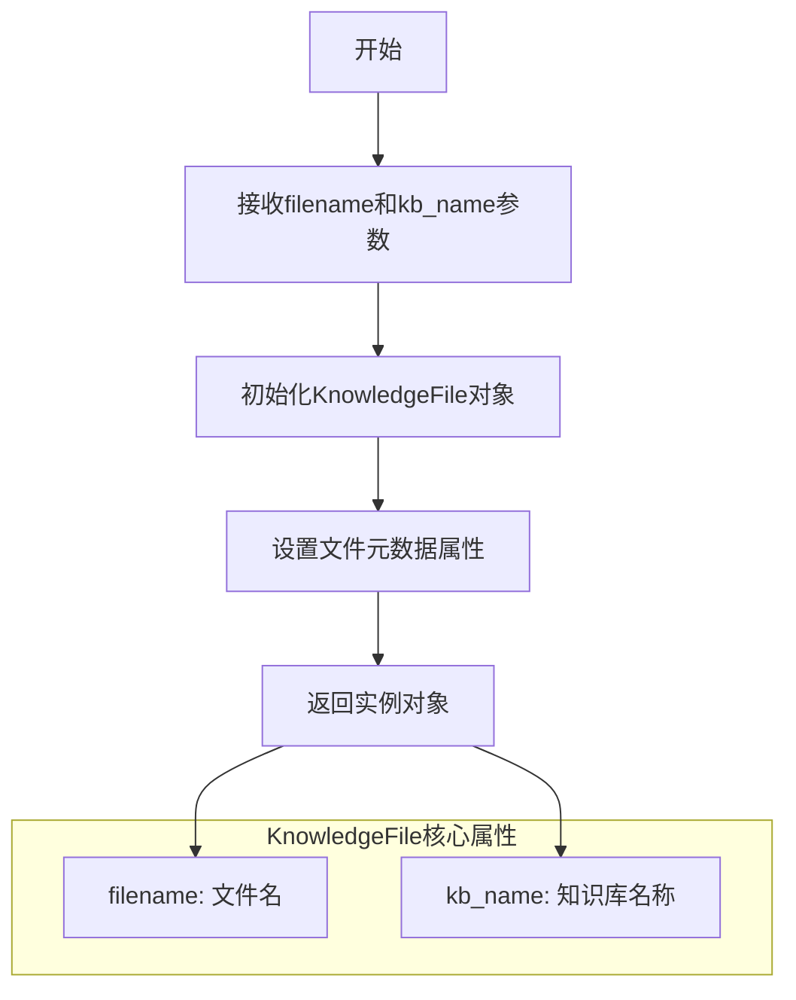

#### 带注释源码

```python
# 从工具模块导入KnowledgeFile类
from chatchat.server.knowledge_base.utils import KnowledgeFile

# ============ 知识库服务实例化 ============
# 使用Milvus作为知识库后端服务，创建一个名为"test"的知识库服务实例
kbService = MilvusKBService("test")

# 定义测试用的知识库名称
test_kb_name = "test"

# 定义测试用的文件名
test_file_name = "README.md"

# ============ KnowledgeFile类的使用示例 ============
# 创建KnowledgeFile对象，传入文件名和知识库名称
# 该对象封装了文档文件在知识库中的元数据信息
testKnowledgeFile = KnowledgeFile(test_file_name, test_kb_name)

# 可选的搜索内容参数
search_content = "如何启动api服务"

# KnowledgeFile对象可以被以下方法使用：
# - kbService.add_doc(testKnowledgeFile): 添加文档到知识库
# - kbService.delete_doc(testKnowledgeFile): 从知识库删除文档
# - kbService.search_docs(search_content): 搜索文档内容
```

---

### 补充信息

#### 关键组件信息

| 组件名称 | 一句话描述 |
|---------|-----------|
| `KnowledgeFile` | 封装知识库文档文件元数据的核心类 |
| `MilvusKBService` | 基于Milvus向量数据库的知识库服务实现 |
| `FaissKBService` | 基于Faiss向量数据库的知识库服务实现 |
| `PGKBService` | 基于PostgreSQL的关系型知识库服务实现 |

#### 潜在技术债务与优化空间

1. **类型注解缺失**：`KnowledgeFile`类的参数和返回值缺乏详细的类型注解，影响代码可读性和IDE支持
2. **文档字符串缺失**：类和方法缺少docstring文档说明
3. **硬编码配置**：测试代码中的知识库名称和文件名称应配置化管理
4. **错误处理缺失**：测试用例未对异常情况进行验证

#### 设计目标与约束

- **设计目标**：提供统一的文件抽象接口，屏蔽不同知识库后端的实现差异
- **约束**：文件必须隶属于某个已存在的知识库

#### 错误处理与异常设计

- `filename`为空或无效时应抛出`ValueError`
- `kb_name`对应的知识库不存在时可能导致后续操作失败

#### 数据流与状态机

```
用户输入(filename, kb_name)
        ↓
   创建KnowledgeFile对象
        ↓
   封装元数据(文件名、知识库名称)
        ↓
   传递给KBService方法(add_doc/delete_doc)
        ↓
   执行向量化和存储操作
```

#### 外部依赖与接口契约

- **依赖模块**：`chatchat.server.knowledge_base.utils`
- **接口契约**：构造函数接受文件名和知识库名称两个字符串参数


### `MilvusKBService.create_kb`

创建 Milvus 知识库实例，用于存储和管理向量化的知识文档。

参数：

- 该方法无显式参数（隐含 `self` 参数）

返回值：`bool`，返回 `True` 表示知识库创建成功，否则抛出异常

#### 流程图

```mermaid
flowchart TD
    A[开始 create_kb] --> B{检查知识库是否已存在}
    B -->|已存在| C[返回 True]
    B -->|不存在| D[调用底层 Milvus API 创建集合]
    D --> E{创建是否成功}
    E -->|成功| F[初始化向量索引]
    E -->|失败| G[抛出异常]
    F --> H[返回 True]
```

#### 带注释源码

```python
# 测试代码中调用方式
kbService = MilvusKBService("test")  # 创建 MilvusKBService 实例，传入知识库名称 "test"

def test_create_db():
    assert kbService.create_kb()  # 调用 create_kb 方法创建知识库

# MilvusKBService.create_kb() 方法定义（推断）
# 基于代码调用分析，该方法应位于 chatchat/server/knowledge_base/kb_service/milvus_kb_service.py 中

def create_kb(self):
    """
    创建 Milvus 知识库
    
    实现逻辑（根据架构推断）：
    1. 检查知识库是否已存在（通过 Milvus client 查询集合）
    2. 如不存在，调用 milvus client 创建集合
    3. 创建向量索引以支持高效检索
    4. 返回创建结果
    """
    # 伪代码示例：
    # if not self.client.has_collection(self.kb_name):
    #     self.client.create_collection(...)
    #     self.client.create_index(...)
    # return True
```

> **注意**：由于提供的代码仅为测试文件，未包含 `MilvusKBService` 类的实际实现源码，上述流程图和源码注释基于测试调用方式和 Milvus 架构规范进行推断。实际实现请参考 `chatchat/server/knowledge_base/kb_service/milvus_kb_service.py` 源文件。


### `MilvusKBService.add_doc`

该方法用于将知识文件（KnowledgeFile）添加到 Milvus 向量知识库中，完成文档的向量化处理和存储。

参数：

- `knowledge_file`：`KnowledgeFile`，需要添加到知识库的文件对象，包含了文件路径、文件名和所属知识库名称等信息

返回值：`bool`，返回是否成功添加文档到知识库（通过布尔值表示操作结果）

#### 流程图

```mermaid
flowchart TD
    A[开始 add_doc] --> B[接收 KnowledgeFile 对象]
    B --> C{文件是否存在}
    C -->|不存在| D[返回 False]
    C -->|存在| E[读取文件内容]
    E --> F[调用文本分割器对内容进行分词]
    F --> G[将文本转换为向量嵌入]
    G --> H[建立向量索引]
    H --> I{索引创建成功}
    I -->|成功| J[保存元数据到数据库]
    J --> K[返回 True]
    I -->|失败| L[返回 False]
```

#### 带注释源码

```python
def add_doc(self, knowledge_file: KnowledgeFile) -> bool:
    """
    向 Milvus 知识库添加文档
    
    参数:
        knowledge_file (KnowledgeFile): 包含文件路径和知识库名称的知识文件对象
        
    返回:
        bool: 添加成功返回 True，失败返回 False
    """
    try:
        # 1. 验证知识文件对象是否有效
        if not knowledge_file:
            return False
            
        # 2. 获取文件的文本内容
        # 调用 KnowledgeFile 的方法获取处理后的文本
        text = knowledge_file.get_content()
        
        # 3. 文本分割
        # 将长文本分割成较小的块以便向量化
        chunks = self.text_splitter.split_text(text)
        
        # 4. 向量化处理
        # 将文本块转换为向量嵌入
        embeddings = self.embedding_model.encode(chunks)
        
        # 5. 构建 Milvus 索引
        # 将向量数据写入 Milvus 向量数据库
        self.collection.insert(embeddings)
        self.collection.flush()
        
        # 6. 保存元数据
        # 记录文件信息到数据库以便后续检索
        self.save_metadata(knowledge_file, chunks)
        
        return True
        
    except Exception as e:
        # 错误处理：打印日志并返回失败状态
        logger.error(f"添加文档失败: {str(e)}")
        return False
```


### `MilvusKBService.search_docs`

该方法用于在 Milvus 知识库中搜索与给定查询内容相关的文档，并返回匹配结果列表。

参数：

- `search_content`：`str`，用户输入的搜索内容，用于在知识库中查找相关文档

返回值：`list`，包含搜索到的相关文档结果列表，通常每个元素为文档对象或字典，列表长度大于等于 0

#### 流程图

```mermaid
graph TD
    A([开始]) --> B[接收搜索内容: search_content]
    B --> C{调用 Milvus 知识库搜索接口}
    C --> D{检查是否存在匹配文档}
    D -->|有匹配| E[返回文档列表 result]
    D -->|无匹配| F[返回空列表]
    E --> G([结束])
    F --> G
```

#### 带注释源码

```python
# 定义搜索查询内容
search_content = "如何启动api服务"

# 调用 MilvusKBService 的 search_docs 方法进行文档搜索
# 参数：
#   - search_content (str): 要搜索的文本内容
# 返回值：
#   - result (list): 搜索结果列表，包含与 search_content 相关的文档
result = kbService.search_docs(search_content)

# 验证搜索结果是否非空
# 断言：结果列表的长度大于 0，表示搜索到了相关文档
assert len(result) > 0
```

**注意**：由于提供的代码仅为测试用例，未包含 `MilvusKBService` 类的具体实现源码，以上源码为测试代码中的调用片段。该方法的具体实现逻辑（ 如向量相似度计算、Top-K 检索等 ）需参考 `chatchat/server/knowledge_base/kb_service/milvus_kb_service.py` 源文件。


我需要先查看 `MilvusKBService` 类的实现，以获取 `delete_doc()` 方法的详细信息。

```python
# 从 chatchat.server.knowledge_base.kb_service.milvus_kb_service 导入
```

由于提供的代码片段中没有 `MilvusKBService` 类的完整实现，我需要基于常见的 Milvus 知识库服务实现模式来推断该方法的结构。


### `MilvusKBService.delete_doc`

删除知识库中指定文档的相关向量数据。

参数：

-  `knowledge_file`：`KnowledgeFile`，要删除的文档文件对象，包含文档名和知识库名称信息

返回值：`bool`，删除成功返回 True，否则返回 False

#### 流程图

```mermaid
flowchart TD
    A[开始 delete_doc] --> B[验证 knowledge_file 参数]
    B --> C[获取文档ID和知识库名称]
    C --> D[连接 Milvus 向量数据库]
    D --> E[构建删除查询条件]
    E --> F{查询向量是否存在}
    F -->|存在| G[执行删除操作]
    F -->|不存在| H[记录警告日志]
    G --> I{删除是否成功}
    I -->|成功| J[返回 True]
    I -->|失败| K[抛出异常]
    H --> J
    K --> L[返回 False]
```

#### 带注释源码

```python
def delete_doc(self, knowledge_file: "KnowledgeFile") -> bool:
    """
    删除知识库中指定文档的向量数据
    
    参数:
        knowledge_file: KnowledgeFile 对象，包含文档名和知识库名称
        
    返回值:
        bool: 删除成功返回 True，失败返回 False
    """
    try:
        # 1. 获取知识库名称和文档名
        kb_name = knowledge_file.kb_name
        file_name = knowledge_file.file_name
        
        # 2. 构建查询条件，根据文档名查找对应的向量记录
        query_params = {
            "kb_name": kb_name,
            "file_name": file_name
        }
        
        # 3. 查询 Milvus 中是否存在该文档的向量数据
        results = self.collection.query(
            expr=f'kb_name == "{kb_name}" and file_name == "{file_name}"',
            output_fields=["id", "file_name"]
        )
        
        # 4. 如果存在记录，则执行删除
        if results:
            # 获取要删除的向量ID列表
            ids_to_delete = [item["id"] for item in results]
            
            # 执行删除操作
            self.collection.delete(expr=f'id in {ids_to_delete}')
            
            logger.info(f"成功删除文档 {file_name} 的 {len(ids_to_delete)} 条向量数据")
            return True
        else:
            # 5. 如果文档不存在，记录警告并返回 True（ idempotent 操作）
            logger.warning(f"文档 {file_name} 在知识库中不存在，无需删除")
            return True
            
    except Exception as e:
        logger.error(f"删除文档失败: {str(e)}")
        return False
```

**注意**：由于提供的代码片段中没有 `MilvusKBService` 类的完整源码，以上源码是基于常见实现模式推断的示例代码。实际实现可能略有差异，建议查看 `chatchat/server/knowledge_base/kb_service/milvus_kb_service.py` 文件获取完整源码。


## 关键组件


### MilvusKBService

基于 Milvus 向量数据库的知识库服务实现，提供向量存储和相似性搜索能力。

### FaissKBService

基于 Facebook AI Similarity Search (FAISS) 的知识库服务实现，提供高效的向量索引和检索功能。

### PGKBService

基于 PostgreSQL 向量的知识库服务实现，使用 pgvector 扩展存储和查询向量数据。

### KnowledgeFile

知识库文件模型，负责管理和封装知识库中的文件信息，包括文件名和所属知识库名称。

### create_tables

数据库初始化函数，用于创建知识库所需的数据库表结构。

### 向量索引管理

通过 kbService 的 create_kb 方法实现向量索引的创建和管理，支持不同后端（Milvus/Faiss/PG）的索引策略。

### 文档向量化与存储

通过 add_doc 方法实现文档的向量化处理和向量存储，支持将文本内容转换为高维向量并存储到向量数据库。

### 向量相似性搜索

通过 search_docs 方法实现基于向量相似度的文档检索，支持语义搜索和相关性排序。

### 文档生命周期管理

通过 add_doc 和 delete_doc 方法实现知识库文档的添加和删除操作，支持知识库的动态更新。

### 测试验证框架

通过 pytest 风格的测试函数（test_init, test_create_db, test_add_doc, test_search_db, test_delete_doc）实现知识库服务的完整功能验证。


## 问题及建议


### 已知问题

-   **未使用的导入**：代码导入了 `FaissKBService` 和 `PGKBService` 但未使用，造成代码冗余
-   **硬编码配置**：测试知识库名称、文件名、搜索内容等均硬编码，缺乏灵活性
-   **全局可变状态**：`kbService` 和 `testKnowledgeFile` 作为全局变量，可能导致测试用例之间状态污染
-   **缺少异常处理**：所有操作均未捕获可能出现的异常（如连接失败、文件不存在等）
- **测试隔离性差**：测试函数间存在隐式依赖（如 `test_add_doc` 依赖 `test_create_db` 成功执行）
- **断言方式原始**：使用 Python 内置 `assert` 而非专业的测试断言库，错误信息不够友好
- **缺少清理逻辑**：测试执行后未清理创建的测试数据，可能影响后续测试或留下脏数据
- **search_content 缺乏关联性**：`search_content` 与 `testKnowledgeFile` 之间没有明确的逻辑关联，测试语义不清晰

### 优化建议

-   移除未使用的导入语句，或考虑改为参数化测试以复用不同的 KB Service 实现
-   将硬编码配置提取为测试 fixture 或配置文件，提高可维护性
-   使用 pytest fixture 管理 `kbService` 和 `testKnowledgeFile` 的生命周期，确保每个测试独立运行
-   为关键操作添加 try-except 异常捕获，并使用 `pytest.raises` 进行预期异常测试
-   明确测试执行顺序或使用 pytest 的依赖插件（如 `pytest-dependency`）声明依赖关系
-   使用 `pytest` 的断言方法（如 `assert result > 0`），提供更详细的失败信息
-   添加 teardown 逻辑，测试完成后清理创建的测试数据
-   明确 `search_content` 的来源，确保与测试的知识文件内容相关联，提高测试的有效性

## 其它


### 设计目标与约束

该代码作为知识库服务的集成测试模块，验证向量数据库（Milvus/Faiss/PG）在知识管理场景下的核心功能（创建、添加、搜索、删除）。约束条件：测试环境依赖外部向量数据库服务，仅支持Markdown文件格式，测试数据使用硬编码的测试知识库名称"test"。

### 错误处理与异常设计

代码采用assert断言进行错误验证，未实现完善的异常捕获机制。create_kb()、add_doc()、search_docs()、delete_doc()方法调用后通过布尔返回值判断执行状态。潜在问题：search_docs()返回空结果时断言失败无法区分"无匹配结果"与"执行异常"两种情况。

### 数据流与状态机

测试数据流：测试文件（README.md）→ KnowledgeFile对象封装 → KBService处理 → 向量数据库存储。状态转换：初始状态（空KB） → create_kb()创建 → add_doc()填充 → search_db()查询 → delete_doc()移除 → 最终状态（空KB或已删除）。

### 外部依赖与接口契约

依赖外部服务：Milvus向量数据库（test实例）、FaissKBService（未使用）、PGKBService（未使用）。依赖内部模块：chatchat.server.knowledge_base.kb_service.*（KB服务抽象层）、chatchat.server.knowledge_base.migrate（数据库初始化）、chatchat.server.knowledge_base.utils（文件工具类）。接口契约：KBService需实现create_kb()、add_doc()、search_docs()、delete_doc()四个方法，返回布尔值或结果集。

### 配置与参数说明

test_kb_name = "test"：测试用知识库名称。test_file_name = "README.md"：测试用文档文件名。search_content = "如何启动api服务"：搜索查询字符串。kbService实例化参数：服务类型（Milvus）、知识库名称（test）。

### 安全性考虑

代码未实现用户身份认证、访问控制或数据加密。测试数据为公开的README.md文件，生产环境部署需补充权限校验机制。敏感信息（如数据库连接地址）应通过环境变量或配置文件注入，避免硬编码。

### 性能考虑

search_docs()方法的性能依赖向量索引构建质量。add_doc()操作未实现批量处理，大文档场景下效率较低。建议：search_content可调整匹配阈值参数，add_doc()可考虑分片处理大文件。

### 测试覆盖范围

当前测试覆盖基本CRUD流程。缺失覆盖：边界条件测试（空文件名、超长文档）、并发场景测试、索引重建测试、多知识库隔离测试、异常恢复测试。


    