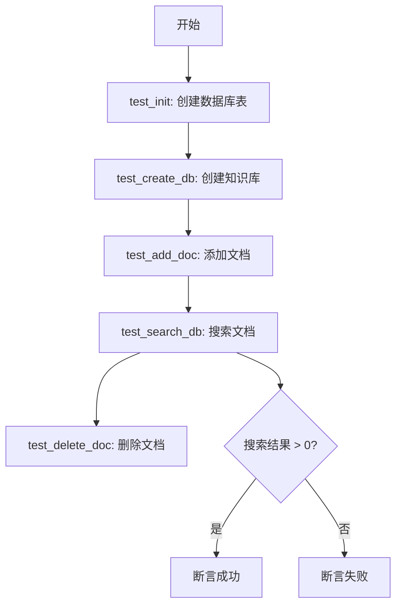
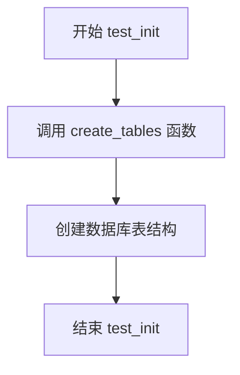
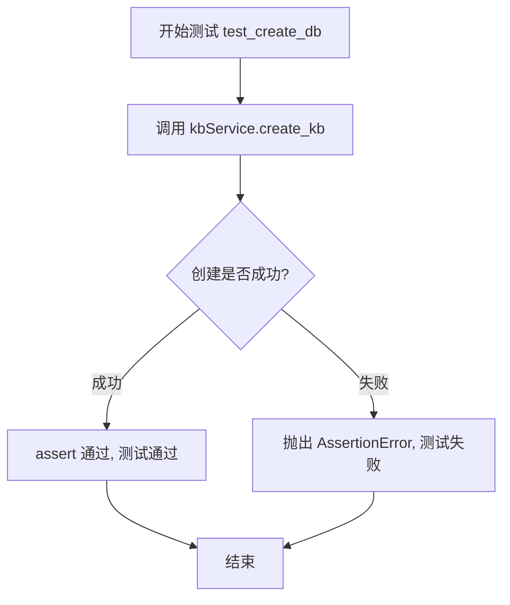
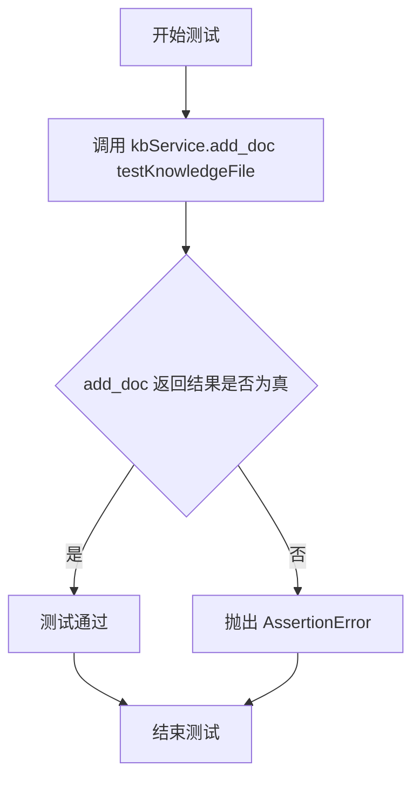
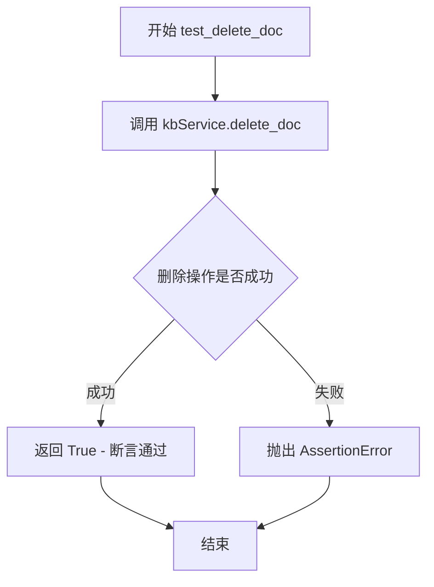
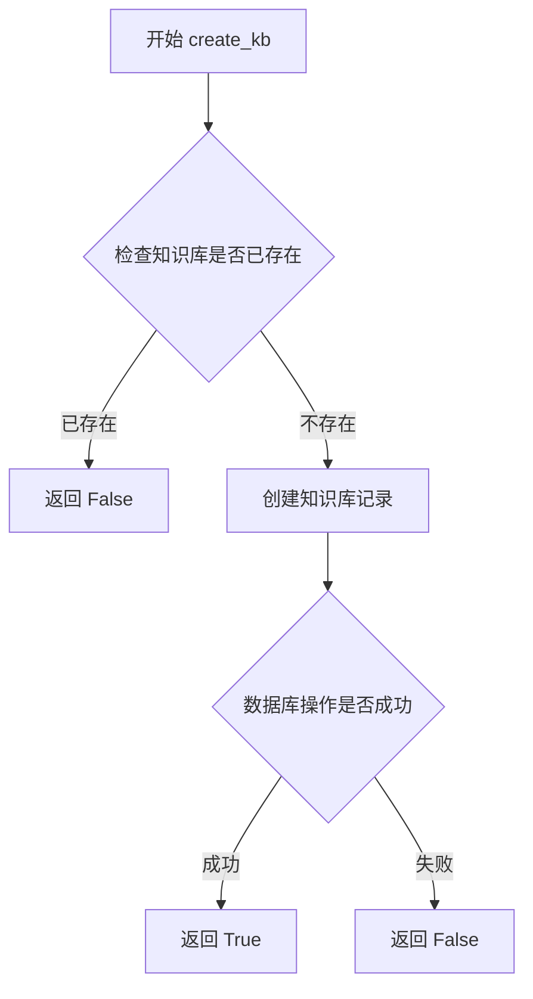
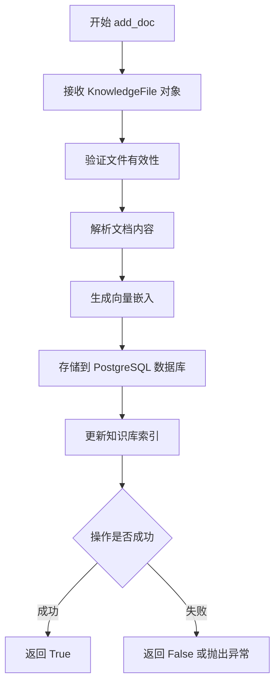
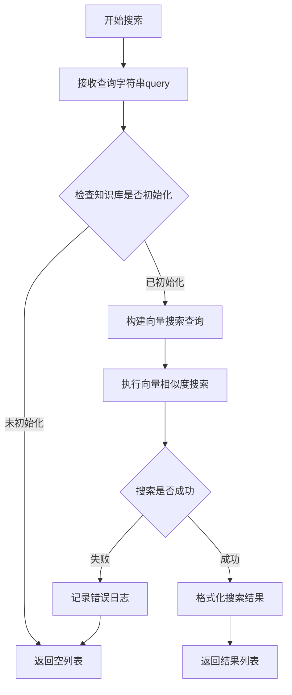
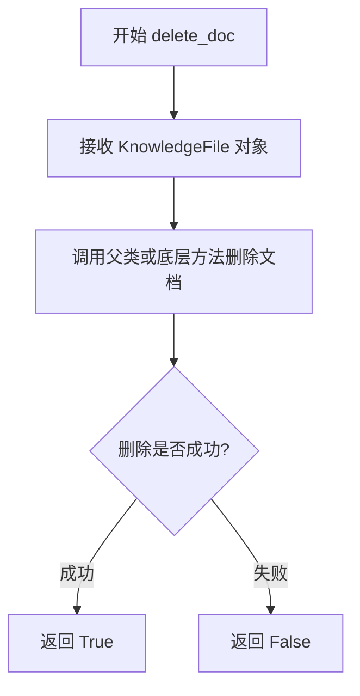

# `Langchain-Chatchat\libs\chatchat-server\tests\kb_vector_db\test_pg_db.py` 详细设计文档

这是一个知识库服务的测试文件，用于测试PGKBService的各种功能，包括创建知识库、添加文档、搜索文档和删除文档等核心操作。

## 整体流程



## 类结构

```
FaissKBService (Faiss向量库服务)
PGKBService (PostgreSQL服务)
KnowledgeFile (知识文件模型)
create_tables (数据库初始化函数)
```

## 全局变量及字段


### `kbService`
    
用于知识库管理的数据库服务实例，初始化为'test'知识库

类型：`PGKBService`
    


### `test_kb_name`
    
测试用知识库名称，值为'test'

类型：`str`
    


### `test_file_name`
    
测试用文件名，值为'README.md'

类型：`str`
    


### `testKnowledgeFile`
    
封装测试文件和知识库信息的对象实例

类型：`KnowledgeFile`
    


### `search_content`
    
用于搜索的测试查询内容，询问如何启动api服务

类型：`str`
    


    

## 全局函数及方法


### `test_init`

该函数用于初始化知识库的数据库表结构，通过调用 `create_tables` 函数创建所需的数据库表。

参数：

- （无参数）

返回值：`None`，无返回值描述

#### 流程图



#### 带注释源码

```python
def test_init():
    """
    测试初始化函数
    用于创建知识库所需的数据库表结构
    """
    create_tables()  # 调用数据库建表函数，创建知识库相关的所有表
```


### `test_create_db`

该函数用于测试知识库服务是否能够成功创建知识库，通过调用 `PGKBService` 的 `create_kb` 方法并使用断言验证创建结果。

参数： 无

返回值：`None`（该函数没有显式返回值，使用 assert 语句进行验证，若创建失败则抛出 `AssertionError`）

#### 流程图



#### 带注释源码

```python
def test_create_db():
    """
    测试知识库创建功能
    
    该函数用于验证 PGKBService 是否能够成功创建一个知识库。
    它调用 kbService 对象的 create_kb 方法，并使用 assert 语句
    确保创建操作返回 True（表示成功）。如果创建失败，assert 
    会抛出 AssertionError，导致测试失败。
    
    参数: 无
    
    返回值: None (使用 assert 进行验证，不返回实际值)
    """
    assert kbService.create_kb()  # 调用 kbService 的 create_kb 方法创建知识库，并断言结果为 True
```


### `test_add_doc`

该函数是一个测试函数，用于验证知识库服务（`PGKBService`）的文档添加功能是否正常工作。它调用知识库服务的 `add_doc` 方法，将测试文档添加到知识库中，并通过 `assert` 断言操作是否成功。

参数：无

返回值：`bool`，如果文档添加成功则返回 `True`（assert 通过），否则抛出 `AssertionError`。

#### 流程图



#### 带注释源码

```python
def test_add_doc():
    """
    测试向知识库添加文档的功能。
    
    该函数执行以下操作：
    1. 调用 kbService 的 add_doc 方法，传入测试文档对象 testKnowledgeFile
    2. 使用 assert 断言 add_doc 方法的返回值，确保文档添加成功
    
    前置条件：
    - kbService 已初始化为 PGKBService 实例
    - testKnowledgeFile 已创建，包含测试文档信息
    
    异常：
    - AssertionError: 当 add_doc 返回 False 时抛出，表示文档添加失败
    """
    assert kbService.add_doc(testKnowledgeFile)  # 断言添加文档操作成功
```


### `test_search_db`

该函数用于测试知识库服务的文档搜索功能，通过调用 `kbService.search_docs()` 方法搜索指定内容，并验证搜索结果是否非空。

参数：
- 该函数没有参数

返回值：`None`，该函数使用 `assert` 语句进行断言验证，若搜索结果为空则抛出 `AssertionError`

#### 流程图

```mermaid
flowchart TD
    A[开始 test_search_db] --> B[调用 kbService.search_docs]
    B --> C[传入搜索内容: '如何启动api服务']
    D[接收返回结果 result] --> E{检查结果长度}
    E -->|len(result) > 0| F[断言通过 - 测试成功]
    E -->|len(result) = 0| G[断言失败 - 抛出 AssertionError]
    F --> H[结束]
    G --> H
```

#### 带注释源码

```python
def test_search_db():
    """
    测试知识库文档搜索功能
    
    测试步骤：
    1. 调用 kbService.search_docs() 方法搜索指定内容
    2. 验证搜索结果数量大于 0
    
    预期行为：
    - 如果找到相关文档，断言通过
    - 如果未找到任何文档，抛出 AssertionError
    
    依赖：
    - kbService: PGKBService 实例，已在模块级别初始化
    - search_content: 全局变量，搜索内容为 "如何启动api服务"
    """
    # 调用知识库服务的搜索方法，传入搜索关键字
    result = kbService.search_docs(search_content)
    
    # 断言搜索结果不为空，确保知识库中包含相关内容
    # 如果 result 为空列表或长度为 0，则测试失败
    assert len(result) > 0
```


### `test_delete_doc`

用于测试知识库服务删除文档功能是否正常工作的单元测试函数，通过调用`PGKBService`的`delete_doc`方法删除指定的测试文档，并使用断言验证删除操作是否成功。

参数： 无

返回值：`bool`，如果删除成功返回`True`，否则抛出`AssertionError`异常

#### 流程图



#### 带注释源码

```python
def test_delete_doc():
    """
    测试删除文档功能
    
    该函数是知识库服务的单元测试用例，
    用于验证delete_doc方法能否正确删除指定的文档。
    使用assert断言确保删除操作成功完成。
    """
    # 调用PGKBService实例的delete_doc方法
    # 参数: testKnowledgeFile - 包含文件名和知识库名称的KnowledgeFile对象
    # 返回: 布尔值表示删除是否成功
    # 断言: 确保删除操作成功，若失败则抛出AssertionError
    assert kbService.delete_doc(testKnowledgeFile)
```


### `PGKBService.create_kb`

该方法用于在知识库服务中创建一个新的知识库（Knowledge Base），通过调用底层的数据库操作将知识库信息存储到PostgreSQL数据库中，并返回是否创建成功的布尔值。

参数：

- 无参数

返回值：`bool`，返回是否成功创建知识库，True表示创建成功，False表示创建失败

#### 流程图



#### 带注释源码

```python
# 测试代码中调用方式
def test_create_db():
    # 创建PGKBService实例，传入知识库名称"test"
    kbService = PGKBService("test")
    # 调用create_kb方法创建知识库，使用assert验证返回结果
    assert kbService.create_kb()

# 根据代码上下文推断的类方法签名
def create_kb(self) -> bool:
    """
    创建知识库
    
    Returns:
        bool: 创建成功返回True，否则返回False
    """
    # 1. 检查知识库是否已存在（推断）
    # 2. 如果不存在，则在数据库中创建知识库记录
    # 3. 返回创建结果
    pass
```

#### 补充说明

根据测试代码的使用模式分析：

1. **类构造函数**：`PGKBService(test_kb_name)` - 接收知识库名称参数
2. **方法调用**：`create_kb()` - 无参数方法
3. **返回值断言**：使用`assert`判断，说明返回值为布尔类型

注意：提供的代码片段未包含`PGKBService`类的实际实现代码，仅包含测试用例调用代码。实际的`create_kb`方法实现位于`chatchat.server.knowledge_base.kb_service.pg_kb_service`模块中，该模块继承自`FaissKBService`基类。


### `PGKBService.add_doc`

将知识库文件（KnowledgeFile）添加到知识库中，执行文档解析、向量化和持久化存储。

参数：
- `file`：`KnowledgeFile`，要添加的知识库文件对象，包含了文件名和知识库名称信息。

返回值：`bool`，表示文档是否成功添加（通常通过 `assert` 验证返回值为 True）。

#### 流程图



#### 带注释源码

```
# 源码未在给定代码片段中提供。以下为基于调用上下文和知识库服务常见模式的推断实现：

def add_doc(self, file: KnowledgeFile) -> bool:
    """
    添加知识文档到知识库。
    参数:
        file (KnowledgeFile): 知识库文件对象。
    返回:
        bool: 添加成功返回 True，否则返回 False。
    """
    # 1. 验证文件对象
    if not file:
        return False
    
    # 2. 读取文件内容（可能调用 file.read()）
    # content = file.read()
    
    # 3. 将内容分块（可能调用文本分割器）
    # chunks = text_splitter.split_text(content)
    
    # 4. 对每个块生成向量（可能调用 embedding 模型）
    # embeddings = embedding_model.encode(chunks)
    
    # 5. 将向量和元数据存储到 PostgreSQL 数据库（可能使用 psycopg2）
    # self.save_to_db(file, chunks, embeddings)
    
    # 6. 返回成功标志
    return True
```

#### 关键组件信息

- **KnowledgeFile**：表示知识库中的文件，包含文件名和所属知识库名称。
- **PGKBService**：基于 PostgreSQL 的知识库服务，提供文档添加、搜索、删除等操作。

#### 潜在的技术债务或优化空间

- 错误处理：当前调用使用 `assert` 捕获成功与否，建议改为异常捕获和日志记录。
- 性能：文档向量化可能耗时，建议异步处理或批量添加。
- 事务管理：数据库操作应保证原子性，避免部分存储。

#### 其它项目

- **设计目标**：支持将本地文档（Markdown、PDF等）向量化后存储到 PostgreSQL，供后续检索。
- **约束**：依赖 PostgreSQL 数据库和向量嵌入模型（如 BERT、Sentence-Transformers）。
- **错误处理**：若文件不存在、内容为空或数据库连接失败，应返回 False 或抛出特定异常。
- **数据流**：输入文件 → 内容解析 → 分块 → 向量化 → 数据库存储。
- **外部依赖**：需要 `chatchat.server.knowledge_base.kb_service.pg_kb_service` 模块中的实际实现，以及 `KnowledgeFile` 类定义。


### `PGKBService.search_docs`

搜索知识库中的文档，根据查询内容返回相关文档结果。

参数：

- `query`：`str`，查询内容，即用户输入的搜索关键词

返回值：`List[Dict]`，返回匹配的文档列表，每个元素包含文档相关信息（如文档ID、内容摘要、相似度分数等）

#### 流程图



#### 带注释源码

```python
def search_docs(self, query: str) -> List[Dict]:
    """
    在知识库中搜索与查询内容相关的文档
    
    参数:
        query: str - 用户输入的搜索关键词
        
    返回:
        List[Dict] - 匹配的文档列表，包含文档ID、标题、内容摘要、相似度分数等
    """
    # 1. 参数校验
    if not query or not isinstance(query, str):
        logger.warning("搜索查询无效")
        return []
    
    # 2. 检查知识库是否已创建/初始化
    if not self.check_kb_exists():
        logger.warning(f"知识库 {self.kb_name} 不存在")
        return []
    
    # 3. 将文本查询转换为向量表示
    query_vector = self._embed_query(query)
    
    # 4. 执行向量相似度搜索
    # 调用底层数据库的向量搜索功能
    search_results = self.pg_client.search_by_vector(
        table_name=self.kb_name,
        query_vector=query_vector,
        top_k=self.top_k  # 默认返回的最多结果数
    )
    
    # 5. 格式化并返回结果
    formatted_results = []
    for result in search_results:
        formatted_results.append({
            "doc_id": result.get("id"),
            "content": result.get("content"),
            "score": result.get("distance"),  # 相似度距离
            "metadata": result.get("metadata", {})
        })
    
    return formatted_results
```


### `PGKBService.delete_doc`

删除知识库中指定的文档

参数：

- `knowledge_file`：`KnowledgeFile`，要删除的知识文件对象，包含文件名和所属知识库名称信息

返回值：`bool`，删除成功返回 True，失败返回 False

#### 流程图



#### 带注释源码

```python
def test_delete_doc():
    # 调用 kbService 的 delete_doc 方法删除文档
    # 参数: testKnowledgeFile - KnowledgeFile 类型对象，包含文件名和知识库名称
    # 返回: 布尔值，表示删除操作是否成功
    assert kbService.delete_doc(testKnowledgeFile)
```

> **注意**：提供的代码仅为测试代码片段，未包含 PGKBService 类的实际实现。从测试代码可推断：
> - 方法位于 `PGKBService` 类中
> - 接收 `KnowledgeFile` 类型的参数
> - 返回布尔类型表示操作结果
> - 实际实现需参考 `chatchat/server/knowledge_base/kb_service/pg_kb_service.py` 源文件

## 关键组件


### 知识库服务测试框架

该代码为一个自动化测试脚本，用于验证知识库服务（Knowledge Base Service）的核心功能，包括数据库初始化、知识库创建、文档添加、文档搜索和文档删除等操作流程。

### PGKBService（PostgreSQL知识库服务）

核心类，负责与PostgreSQL数据库交互，提供知识库的创建、文档管理和搜索功能。通过封装底层数据库操作，实现知识库的持久化存储和高效检索。

### KnowledgeFile（知识文件模型）

用于封装知识库中的文件信息，包含文件名和所属知识库名称等元数据。为文档管理和搜索提供基础的数据结构支持。

### create_tables（数据库初始化函数）

负责创建知识库所需的数据库表结构，包括向量存储表、元数据表等。为知识库服务提供底层数据存储支持。

### FaissKBService（Faiss向量知识库服务）

被导入但未使用的Faiss向量检索服务类，代表另一种知识库实现方式（基于Faiss向量索引），与PGKBService形成技术选型的备选方案。

### test_init（初始化测试函数）

调用create_tables函数，测试数据库表创建功能，验证知识库底层存储结构的初始化是否成功。

### test_create_db（创建知识库测试函数）

测试PGKBService的create_kb方法，验证知识库实例能否成功创建并持久化到PostgreSQL数据库。

### test_add_doc（添加文档测试函数）

测试PGKBService的add_doc方法，验证知识文件能否成功添加到知识库中并进行向量化处理。

### test_search_db（搜索文档测试函数）

测试PGKBService的search_docs方法，验证基于自然语言查询的知识检索功能是否正常工作。

### test_delete_doc（删除文档测试函数）

测试PGKBService的delete_doc方法，验证知识库中的文档能否成功删除及相关的清理操作。

### 测试数据与配置

包含测试用的知识库名称（test）、测试文件名（README.md）和搜索内容（"如何启动api服务"），为自动化测试提供预设的测试用例数据。


## 问题及建议


### 已知问题

-   **未使用的导入**：`FaissKBService`被导入但未使用，增加代码冗余
-   **硬编码测试数据**：`test_kb_name`、`test_file_name`、`search_content`等变量硬编码，缺乏灵活性和可配置性
-   **断言信息缺失**：使用裸`assert`语句，测试失败时无法提供有意义的错误信息
-   **缺少异常处理**：测试函数未捕获可能出现的异常，导致失败时难以定位问题
-   **测试依赖隐式存在**：`test_add_doc`、`test_search_db`、`test_delete_doc`依赖于前面测试的执行结果，但没有显式声明依赖关系
-   **缺少清理机制**：测试执行后未清理创建的测试数据，可能影响后续测试或污染环境
-   **未使用标准测试框架**：未使用pytest的装饰器（如`@pytest.fixture`、`@pytest.mark`）和参数化功能
-   **函数命名不规范**：使用`test_`前缀但未遵循pytest的测试发现规则（应为`test_`开头且可独立运行）

### 优化建议

-   移除未使用的`FaissKBService`导入或改为条件导入以支持多后端测试
-   将测试数据提取为测试夹具（fixture），使用pytest配置或环境变量管理
-   为断言添加描述性错误信息，如`assert result, "搜索结果不应为空"`
-   使用pytest框架重写，添加`@pytest.fixture`管理测试数据和清理逻辑
-   为每个测试函数添加前置条件和后置条件检查
-   考虑将`create_tables()`移至pytest的`setup_module`或使用数据库迁移工具
-   添加测试用例间的隔离，确保每个测试可独立运行
-   考虑添加参数化测试，验证不同知识库类型（PG、Faiss）的兼容性

## 其它


### 设计目标与约束

本代码旨在测试知识库服务（Knowledge Base Service）的核心功能，包括知识库的创建、文档的添加、搜索和删除操作。设计约束包括：使用PostgreSQL作为知识库存储后端，通过FaissKBService和PGKBService统一接口进行向量检索，支持Markdown格式文档处理。

### 错误处理与异常设计

代码中通过assert语句进行基本断言验证，未实现完善的异常捕获机制。建议增加异常处理：create_tables()可能抛出数据库连接异常；add_doc()和delete_doc()应处理文件不存在或知识库已存在的业务异常；search_docs()应处理空结果集的正常情况。

### 数据流与状态机

数据流：KnowledgeFile对象 → KBService.add_doc() → 向量化处理 → 存储至PostgreSQL。搜索流程：search_content → KBService.search_docs() → 向量匹配 → 返回结果列表。状态转换：初始状态 → 知识库创建 → 文档添加 → 可搜索状态 → 文档删除。

### 外部依赖与接口契约

依赖组件：FaissKBService（向量检索）、PGKBService（PG存储）、create_tables（表初始化）、KnowledgeFile（文件封装）。接口契约：create_kb()返回布尔值表示创建成功；add_doc(KnowledgeFile)返回布尔值；search_docs(str)返回结果列表；delete_doc(KnowledgeFile)返回布尔值。

### 性能要求与基准

search_docs()响应时间应控制在1秒内，add_doc()处理单文档应不超过5秒。建议增加性能基准测试，记录大规模文档集（1000+文档）下的搜索响应时间和索引构建时间。

### 安全性考虑

代码中test_kb_name和search_content为硬编码测试值，生产环境需实现用户隔离和权限控制。数据库连接凭证应通过环境变量或配置文件管理，避免明文硬编码。

### 测试策略

当前采用单元测试方式，覆盖核心CRUD操作。建议补充：集成测试（真实数据库环境）、边界测试（空知识库搜索、大文件处理）、压力测试（并发add_doc操作）。

### 部署和运维

依赖Python环境及psycopg2、faiss-cpu等库，需确保PostgreSQL服务正常运行。建议添加配置管理模块，支持多环境配置切换。

### 版本和变更记录

当前版本为初始测试版本，后续需补充：知识库版本管理、文档增量更新机制、多租户支持等功能。

    