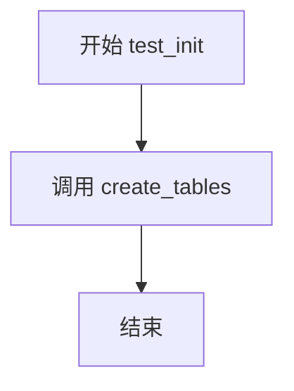
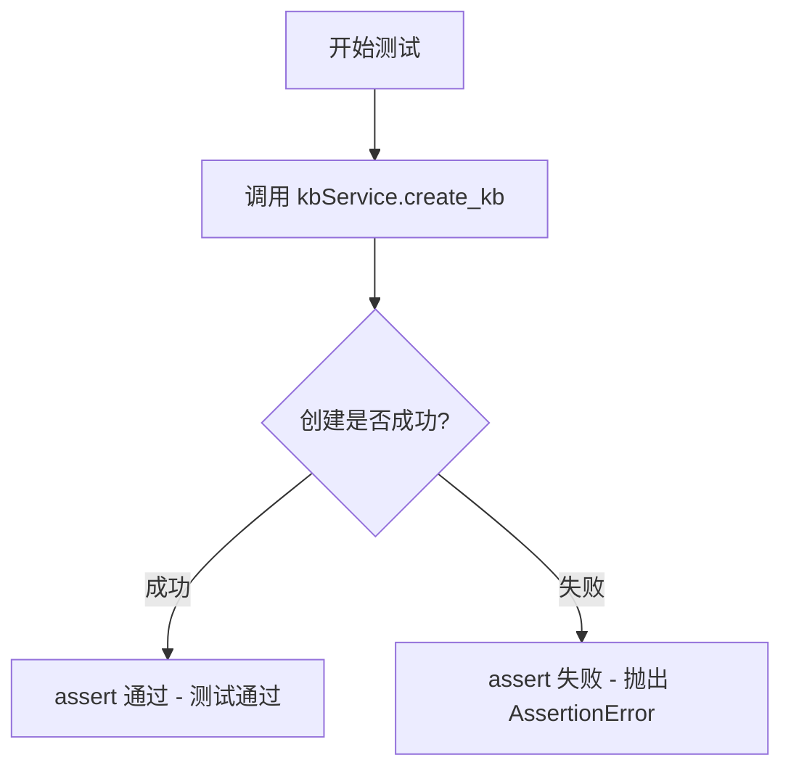
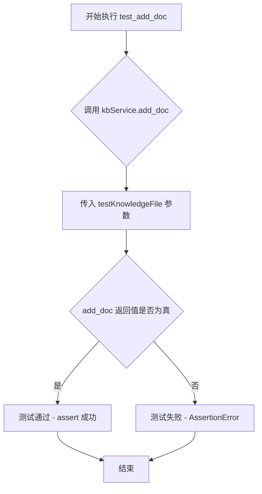
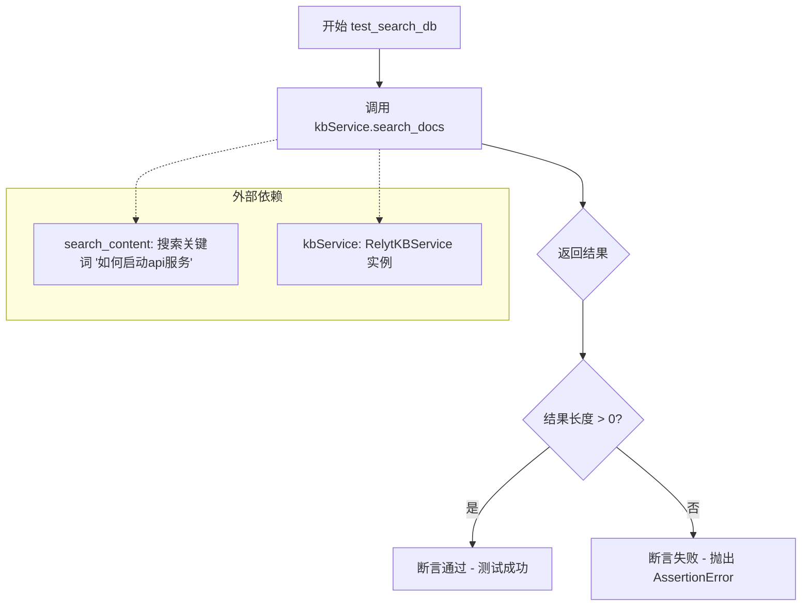
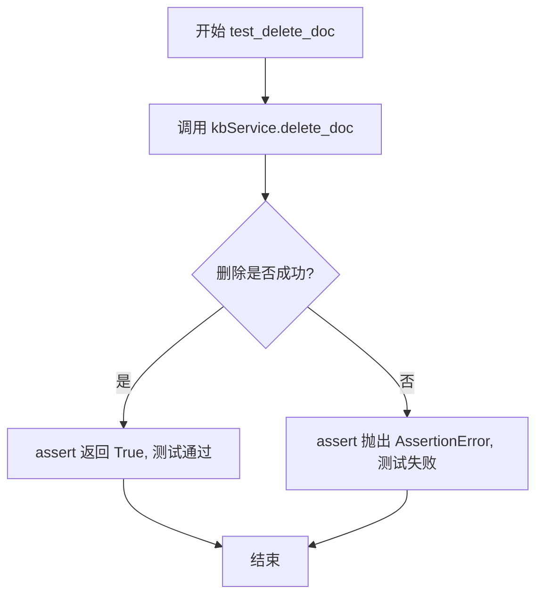
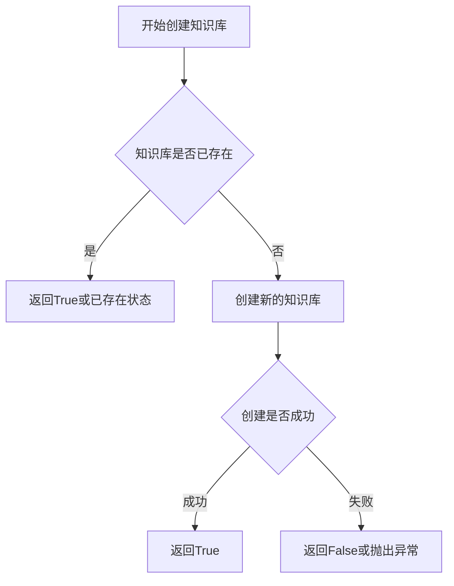
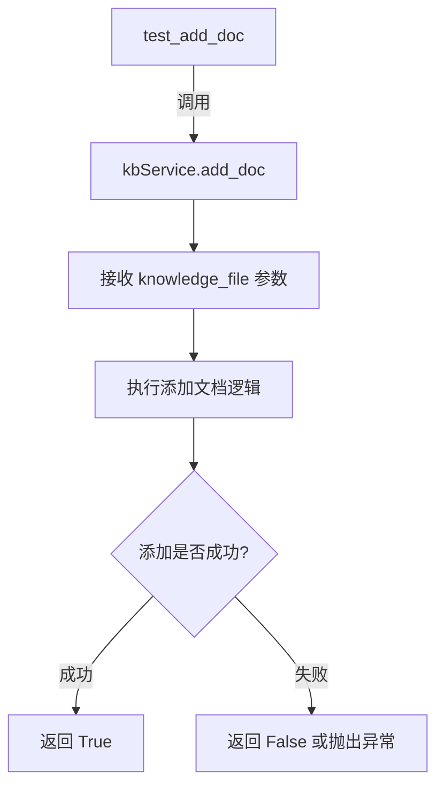
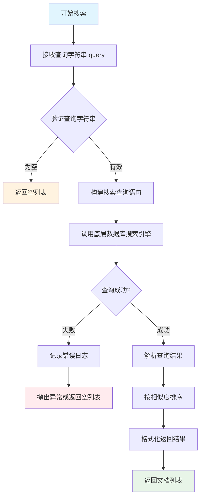
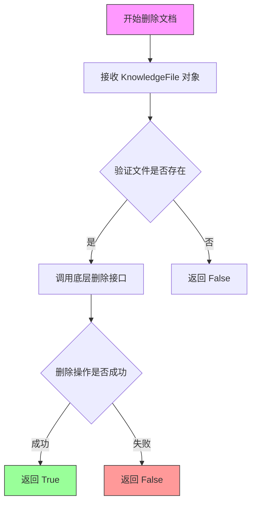

# `Langchain-Chatchat\libs\chatchat-server\tests\kb_vector_db\test_relyt_db.py` 详细设计文档

这是一个知识库（Knowledge Base）服务的测试文件，用于验证 RelytKBService 的核心功能，包括知识库创建、文档添加、搜索和删除等操作，底层依赖 Relyt 数据库存储向量数据。

## 整体流程

```mermaid
graph TD
    A[开始] --> B[test_init: 调用 create_tables 初始化数据库表结构]
    B --> C[test_create_db: 调用 kbService.create_kb 创建知识库]
    C --> D[test_add_doc: 调用 kbService.add_doc 添加文档到知识库]
    D --> E[test_search_db: 调用 kbService.search_docs 搜索内容]
    E --> F{搜索结果是否为空?}
    F -- 是 --> G[测试失败: 断言 len(result) > 0]
    F -- 否 --> H[test_delete_doc: 调用 kbService.delete_doc 删除文档]
    H --> I[结束]
```

## 类结构

```
RelytKBService (Relyt知识库服务类)
├── create_tables (数据库表初始化函数)
└── KnowledgeFile (知识文件模型类)
```

## 全局变量及字段


### `kbService`
    
RelytKBService 实例，用于执行知识库相关操作

类型：`RelytKBService`
    


### `test_kb_name`
    
测试用知识库名称字符串

类型：`str`
    


### `test_file_name`
    
测试用文件名字符串

类型：`str`
    


### `testKnowledgeFile`
    
KnowledgeFile 实例，表示测试用的知识库文件

类型：`KnowledgeFile`
    


### `search_content`
    
搜索内容字符串

类型：`str`
    


### `RelytKBService.kb_name`
    
知识库名称

类型：`str`
    


### `KnowledgeFile.file_name`
    
文件名

类型：`str`
    


### `KnowledgeFile.kb_name`
    
知识库名称

类型：`str`
    
    

## 全局函数及方法


### `test_init`

该函数是测试初始化函数，用于初始化数据库表结构。

参数：
- 无

返回值：`None`，该函数没有返回值，仅执行数据库表创建操作。

#### 流程图



#### 带注释源码

```python
def test_init():
    """
    测试初始化函数
    用于初始化数据库表结构
    调用 create_tables 函数创建所需的数据库表
    """
    create_tables()
```


### `test_create_db`

该函数是一个测试用例，用于验证知识库创建功能是否正常工作。它通过调用 RelytKBService 实例的 `create_kb()` 方法来创建知识库，并使用 assert 断言确保创建操作成功。

参数： 无

返回值： `bool`，表示知识库创建操作是否成功（通过 assert 断言）

#### 流程图



#### 带注释源码

```python
def test_create_db():
    """
    测试创建知识库功能
    
    该测试函数验证 RelytKBService 的 create_kb() 方法
    是否能够成功创建知识库。
    """
    # 调用知识库服务的 create_kb 方法创建知识库
    # 使用 assert 断言确保创建操作返回 True（成功）
    assert kbService.create_kb()
```

#### 依赖项说明

| 依赖项 | 类型 | 说明 |
|--------|------|------|
| `kbService` | `RelytKBService` 实例 | 知识库服务实例，在模块级别初始化为 `RelytKBService("test")` |
| `kbService.create_kb()` | 方法 | RelytKBService 类的方法，实际执行创建知识库的操作 |

#### 技术说明

- 该函数依赖于外部服务 `RelytKBService`，因此测试运行前需确保服务配置正确
- 使用 assert 进行简单断言，若 `create_kb()` 返回 `False` 或抛出异常，测试将失败
- 该测试用例与其他测试用例（test_init、test_add_doc、test_search_db、test_delete_doc）共同构成了知识库功能的完整测试套件


### `test_add_doc`

测试向知识库添加文档的功能，通过调用RelytKBService的add_doc方法将KnowledgeFile对象添加到知识库，并使用assert断言验证操作是否成功。

参数：
- （无显式参数，函数内部使用外部变量`testKnowledgeFile`和`kbService`）

返回值：`bool`，如果`add_doc`方法返回True则测试通过，否则抛出AssertionError异常

#### 流程图



#### 带注释源码

```python
def test_add_doc():
    """
    测试函数：向知识库添加文档
    
    该函数执行以下操作：
    1. 调用 RelytKBService 实例的 add_doc 方法
    2. 传入 KnowledgeFile 对象作为参数
    3. 使用 assert 验证 add_doc 返回值是否为 True
    
    依赖的外部变量：
    - kbService: RelytKBService 实例，已初始化为 "test" 知识库
    - testKnowledgeFile: KnowledgeFile 对象，文件名为 "README.md"，属于 "test" 知识库
    
    注意：
    - 该函数依赖 test_init 和 test_create_db 先执行
    - 如果知识库或文件不存在，可能导致测试失败
    """
    assert kbService.add_doc(testKnowledgeFile)
    # 断言解释：
    # kbService.add_doc(testKnowledgeFile) 返回布尔值
    # 如果返回 True，assert 通过，测试成功
    # 如果返回 False 或抛出异常，assert 失败，测试报错
```


### `test_search_db`

该测试函数用于验证知识库文档搜索功能，通过调用 `RelytKBService` 的 `search_docs` 方法搜索包含指定内容的文档，并断言返回结果数量大于零，确保搜索功能正常工作。

参数：

- 无显式参数（使用外部全局变量 `search_content`）

返回值：`list`，搜索结果列表，包含匹配搜索内容的文档记录

#### 流程图



#### 带注释源码

```python
def test_search_db():
    """
    测试知识库搜索功能
    验证 search_docs 方法能否正确检索包含指定内容的文档
    """
    # 调用 kbService 的 search_docs 方法进行搜索
    # 参数: search_content (全局变量，值为 "如何启动api服务")
    # 返回: result (list类型，包含匹配搜索条件的文档列表)
    result = kbService.search_docs(search_content)
    
    # 断言验证：确保搜索结果不为空
    # 如果 result 为空列表，len(result) 为 0，断言失败
    assert len(result) > 0
```


### `test_delete_doc`

该测试函数用于验证从知识库中删除文档的功能是否正常工作，通过调用 RelytKBService 的 delete_doc 方法删除指定的测试文档，并使用 assert 断言确保删除操作成功执行。

参数：

- 无

返回值：`bool`，assert 表达式的结果，表示文档删除是否成功（True 为成功）

#### 流程图



#### 带注释源码

```python
def test_delete_doc():
    """
    测试从知识库中删除文档的功能
    
    该函数调用 kbService 的 delete_doc 方法，
    尝试删除之前添加的测试文档 testKnowledgeFile。
    使用 assert 断言确保删除操作返回成功结果。
    """
    # 调用 RelytKBService 实例的 delete_doc 方法
    # 传入需要删除的 KnowledgeFile 对象（testKnowledgeFile）
    # delete_doc 方法应返回 True 表示删除成功
    assert kbService.delete_doc(testKnowledgeFile)
```


### `RelytKBService.create_kb`

创建知识库（Knowledge Base）的核心方法，用于在RelytKBService中初始化一个新的知识库实例。

参数：

- 该方法无显式参数（使用self隐式传递实例引用）

返回值：`bool`，返回创建知识库操作是否成功。True表示知识库创建成功，False表示创建失败（用于测试中断言验证）。

#### 流程图



#### 带注释源码

```
# 从测试代码中提取的调用方式
kbService = RelytKBService("test")  # 创建RelytKBService实例，传入知识库名称"test"
result = kbService.create_kb()      # 调用create_kb方法创建知识库
assert result                        # 断言返回值，用于验证创建是否成功

# 注意：由于用户未提供RelytKBService类的实际源代码，
# 无法提取create_kb()方法的具体实现逻辑。
# 建议提供 server/knowledge_base/kb_service/relyt_kb_service.py 文件以获取完整实现。
```

---

**⚠️ 重要说明**：当前提供的代码片段仅为测试文件（test_relyt_kb.py），并未包含RelytKBService类的实际实现代码。从测试代码的使用方式可以推断：

1. **create_kb()** 方法无参数
2. 返回布尔值用于断言验证
3. 具体的知识库创建逻辑位于 `server.knowledge_base.kb_service.relyt_kb_service` 模块中

如需获取完整的详细设计文档（包括详细的类字段、方法实现、流程控制等），请提供RelytKBService类的实际源代码文件。


根据提供的代码片段（测试代码），未包含 `RelytKBService.add_doc()` 方法的实际实现代码，仅有测试调用。基于测试代码中的调用约定，可以推断该方法的接口信息，但详细内部逻辑和源码无法提取。以下为基于测试上下文推断的结果：

### `RelytKBService.add_doc`

将指定的 `KnowledgeFile` 对象所代表的文档内容添加至知识库中。

参数：
- `knowledge_file`：`KnowledgeFile`，需要添加的知识文件对象（测试中实例为 `testKnowledgeFile`）

返回值：`bool`，表示文档是否添加成功（测试中使用 `assert` 断言其返回值）

#### 流程图



#### 带注释源码

```python
# 测试代码中的调用示例
def test_add_doc():
    # 传入 KnowledgeFile 对象，断言返回值（预期为 True 表示添加成功）
    assert kbService.add_doc(testKnowledgeFile)
```

> **注意**：提供的代码为测试脚本，未包含 `RelytKBService` 类的定义及 `add_doc` 方法的具体实现。无法提取更详细的类字段、方法内部逻辑及流程。若需完整设计文档，请提供 `RelytKBService` 类的源代码。


### `RelytKBService.search_docs()`

该方法是 RelytKBService 类中的文档搜索功能，用于在知识库中根据关键词搜索相关文档，并返回匹配度较高的文档列表。

参数：

- `query`：`str`，搜索关键词或查询语句，用于在知识库中匹配相关文档

返回值：`List[Dict]`，返回匹配的文档列表，每个文档以字典形式包含文档名称、内容摘要、相似度分数等信息

#### 流程图



#### 带注释源码

```python
def search_docs(self, query: str) -> List[Dict]:
    """
    在知识库中搜索与查询语句匹配的文档
    
    参数:
        query: str - 用户输入的搜索关键词或查询语句
        
    返回:
        List[Dict] - 匹配度较高的文档列表，每个元素包含文档信息
        
    实现思路（基于测试代码推断）:
        1. 接收搜索关键词 query
        2. 验证 query 是否有效（非空、符合格式要求）
        3. 构建底层数据库查询语句
        4. 执行搜索查询，获取原始结果
        5. 处理查询结果，计算相似度分数
        6. 对结果进行排序和格式化
        7. 返回最终的文档列表
    """
    
    # 从测试代码中的调用方式推断：
    # result = kbService.search_docs(search_content)
    # 其中 search_content = "如何启动api服务"
    # assert len(result) > 0 表明返回值是一个可迭代对象（列表）
    
    # 实际实现可能包含以下逻辑：
    # 1. 连接 Relyt 数据库
    # 2. 使用全文搜索或向量相似度搜索
    # 3. 返回包含文档路径、摘要、分数等信息的字典列表
    
    pass  # 具体实现需查看 relyt_kb_service.py 源文件
```

#### 相关上下文信息

**测试用例中的使用方式：**

```python
# 创建服务实例
kbService = RelytKBService("test")

# 设置搜索内容
search_content = "如何启动api服务"

# 调用搜索方法
result = kbService.search_docs(search_content)

# 验证返回结果
assert len(result) > 0
```

**设计意图：**
- 支持中文语义搜索
- 返回结果应包含匹配文档的基本信息
- 用于知识库问答系统的检索环节

**潜在优化方向：**
- 添加搜索结果数量限制参数
- 支持分页查询
- 增加搜索结果过滤条件（如按时间、按文件类型）
- 添加缓存机制提高重复查询性能


### `RelytKBService.delete_doc`

该方法用于从知识库中删除指定的文档，接收一个 KnowledgeFile 对象作为参数，并返回布尔值表示删除操作是否成功。

参数：

- `file`: `KnowledgeFile`，要删除的知识文件对象，包含文件名和所属知识库名称

返回值：`bool`，删除成功返回 True，否则返回 False

#### 流程图



#### 带注释源码

```python
def test_delete_doc():
    """
    测试删除文档功能
    使用 assert 断言确保 delete_doc 方法返回 True
    """
    # 创建知识库服务实例（test 为知识库名称）
    kbService = RelytKBService("test")
    
    # 创建知识文件对象（README.md 为文件名，test 为知识库名）
    test_kb_name = "test"
    test_file_name = "README.md"
    testKnowledgeFile = KnowledgeFile(test_file_name, test_kb_name)
    
    # 调用 delete_doc 方法删除文档
    # 参数：testKnowledgeFile - KnowledgeFile 类型的文件对象
    # 返回值：bool - 表示删除是否成功
    assert kbService.delete_doc(testKnowledgeFile)
```

#### 补充说明

| 项目 | 说明 |
|------|------|
| **所属类** | RelytKBService |
| **调用方式** | 实例方法 |
| **依赖模块** | server.knowledge_base.kb_service.relyt_kb_service |
| **关联类** | KnowledgeFile（来自 server.knowledge_base.utils） |
| **潜在优化点** | 缺少对文件不存在、权限问题、网络异常等场景的错误处理；返回值应该包含更详细的删除结果信息（如删除的文件数量） |


## 关键组件


### RelytKBService类

负责知识库的创建、文档添加、搜索和删除等核心操作的服务类。

### KnowledgeFile类

表示知识库中的单个文件，包含文件名和所属知识库名称的信息。

### create_tables函数

用于初始化数据库表结构的函数。

### test_init测试函数

调用create_tables函数初始化数据库表结构。

### test_create_db测试函数

调用kbService.create_kb()方法创建知识库。

### test_add_doc测试函数

调用kbService.add_doc()方法向知识库添加文档。

### test_search_db测试函数

调用kbService.search_docs()方法搜索知识库中的文档。

### test_delete_doc测试函数

调用kbService.delete_doc()方法从知识库删除文档。


## 问题及建议


### 已知问题

- **全局变量缺乏封装**：全局变量 `kbService`、`test_kb_name`、`test_file_name`、`testKnowledgeFile`、`search_content` 散落在模块级别，缺乏良好的封装和生命周期管理，多个测试函数共享状态可能导致测试间相互影响
- **测试隔离性不足**：测试函数之间存在隐式依赖，`test_add_doc` 依赖于 `test_create_db` 先执行成功，`test_delete_doc` 依赖于前面的添加操作，缺乏独立的 setup/teardown 机制
- **硬编码配置问题**：知识库名称 `"test"`、文件名 `"README.md"`、搜索内容 `"如何启动api服务"` 等均以硬编码形式存在，不利于配置管理和测试复用
- **缺少错误处理与断言信息**：仅使用简单的 `assert` 语句，未提供详细的错误信息，当测试失败时难以定位具体原因
- **资源未及时释放**：测试完成后未显式删除创建的知识库资源，可能对后续测试环境造成污染
- **函数缺少文档注释**：所有测试函数均无 docstring，无法快速理解各测试用例的意图和预期行为
- **魔法字符串缺乏解释**：如 `"test"`、`"README.md"` 等字符串的含义未通过常量或注释说明，可读性较差
- **未验证初始化状态**：未在测试前验证 `kbService` 的初始化是否成功，隐藏的初始化异常可能导致后续测试失败
- **搜索结果断言不够严格**：`assert len(result) > 0` 仅验证结果非空，未验证返回结果的格式、类型或内容正确性

### 优化建议

- **引入 pytest fixtures**：使用 `@pytest.fixture` 装饰器管理 `kbService` 和 `testKnowledgeFile` 的生命周期，在 fixture 中实现 setup 和 teardown，确保测试隔离和资源清理
- **抽取配置常量**：将硬编码的字符串提取为模块级常量或配置文件，例如 `TEST_KB_NAME = "test"`，增强可维护性
- **完善断言信息**：为每个断言添加描述性错误信息，例如 `assert result, "搜索结果为空，预期返回非空列表"`
- **添加文档注释**：为每个测试函数编写 docstring，说明测试目的、输入和预期输出
- **增加前置状态检查**：在测试函数开始时添加必要的状态验证，如 `assert kbService.is_kb_exists(test_kb_name)`
- **优化搜索结果验证**：除了检查结果数量，还应验证返回结果的类型、字段完整性等，例如 `assert isinstance(result, list)` 和 `assert all('content' in item for item in result)`
- **考虑测试并行化**：当测试规模扩大时，当前设计可能阻碍测试并行执行，建议消除测试间的隐式依赖

## 其它


### 设计目标与约束

本代码为Relyt知识库服务的单元测试代码，核心目标验证RelytKBService类的CRUD操作功能是否正常。约束条件：需依赖Relyt数据库服务正常运行，测试前需确保create_tables已执行，测试文件需存在于指定路径。

### 错误处理与异常设计

代码采用assert断言进行错误验证，未显式捕获异常。若kbService方法返回False或result为空，assert会抛出AssertionError表明测试失败。create_tables可能抛出数据库连接异常，add_doc可能抛出文件不存在或解析异常，search_docs可能抛出查询超时或连接异常。

### 数据流与状态机

测试数据流：test_init执行建表初始化 → test_create_db创建知识库 → test_add_doc添加文档到知识库 → test_search_db搜索文档验证 → test_delete_doc删除文档清理。状态转换：初始化状态 → 知识库存在状态 → 文档已添加状态 → 搜索验证完成状态 → 文档已删除状态。

### 外部依赖与接口契约

依赖外部服务：Relyt数据库服务（PostgreSQL兼容）。依赖模块接口：RelytKBService.create_kb()返回bool、add_doc(KnowledgeFile)返回bool、search_docs(str)返回list、delete_doc(KnowledgeFile)返回bool；create_tables()无返回值；KnowledgeFile(filename, kb_name)构造函数。

### 安全性考虑

代码中硬编码了知识库名称"test"和文件名"README.md"，测试搜索内容"如何启动api服务"为明文传输。生产环境需对敏感知识库名称和搜索内容进行脱敏处理，避免敏感信息泄露。

### 性能考虑

search_docs方法返回全部结果未做分页，文档量大时可能导致内存占用过高。建议添加分页参数限制单次返回数量，测试用例应覆盖大规模文档场景的性能验证。

### 配置与常量

test_kb_name = "test" - 测试用知识库名称；test_file_name = "README.md" - 测试用文件名；search_content = "如何启动api服务" - 搜索测试内容。这些值建议抽取至测试配置文件。

### 测试策略

当前采用黑盒功能测试，通过assert验证返回值。覆盖场景：知识库创建、文档添加、文档搜索、文档删除。缺失场景：重复添加相同文档、删除不存在文档、搜索空结果集、并发操作、边界条件（大文件、特殊字符）。

### 部署与运维

测试环境需部署Relyt数据库并配置连接信息。测试执行顺序依赖：test_init必须先于其他测试执行。建议使用pytest fixtures管理测试顺序和资源清理。

    