# `Langchain-Chatchat\libs\chatchat-server\tests\test_migrate.py` 详细设计文档

这是一个测试文件，用于测试知识库（Knowledge Base）的迁移功能，包括重建向量存储、增量更新、清理数据库文档、清理文件夹文件以及删除知识库等核心场景的单元测试。

## 整体流程

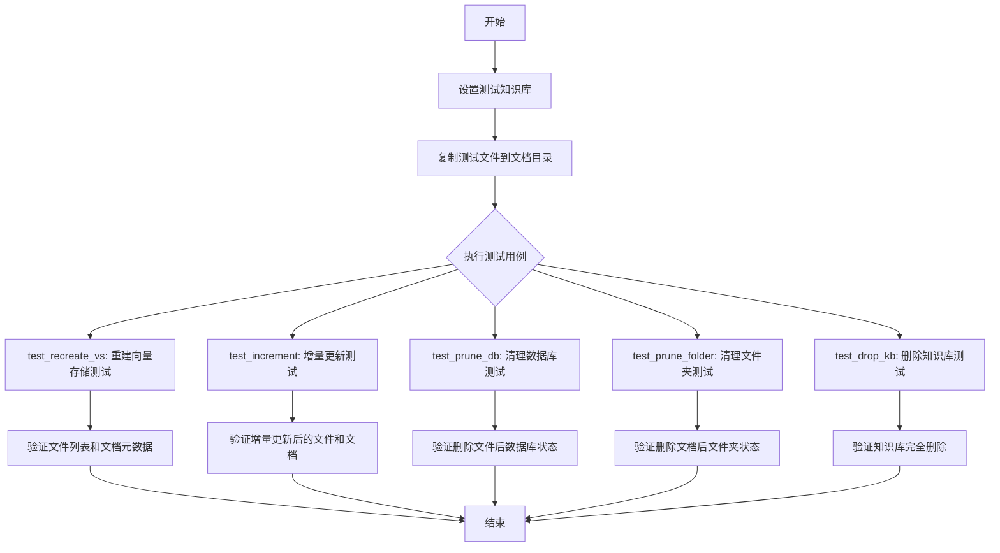

## 类结构

```
KBServiceFactory (工厂类)
├── get_service_by_name(kb_name) -> KBService
KBService (知识库服务基类)
├── exists() -> bool
├── list_files() -> List[str]
├── list_docs(file_name/metadata) -> List[Document]
├── clear_vs()
├── delete_doc(knowledge_file)
├── drop_kb()
KnowledgeFile (知识文件类)
├── file_name: str
└── kb_name: str
```

## 全局变量及字段


### `root_path`
    
Root path of the project, pointing to the parent directory of the current script

类型：`Path`
    


### `kb_name`
    
Name of the test knowledge base used for migration testing

类型：`str`
    


### `test_files`
    
Dictionary mapping test file names to their full file paths

类型：`dict`
    


### `kb_path`
    
Path to the knowledge base storage directory

类型：`Path`
    


### `doc_path`
    
Path to the knowledge base documents directory where files are stored

类型：`Path`
    


### `del_file`
    
Name of the file to be deleted during prune database/folder tests

类型：`str`
    


### `keep_file`
    
Name of the file to be kept during prune database/folder tests

类型：`str`
    


### `KnowledgeFile.file_name`
    
Name of the knowledge file

类型：`str`
    


### `KnowledgeFile.kb_name`
    
Name of the knowledge base the file belongs to

类型：`str`
    
    

## 全局函数及方法


### `test_recreate_vs`

该测试函数用于验证知识库的完整重建功能（recreate），通过调用 `folder2db` 将测试文件导入知识库，然后逐一验证文件列表、文档列表及元数据的正确性。

参数： 无

返回值： `None`，无返回值，仅执行测试断言

#### 流程图

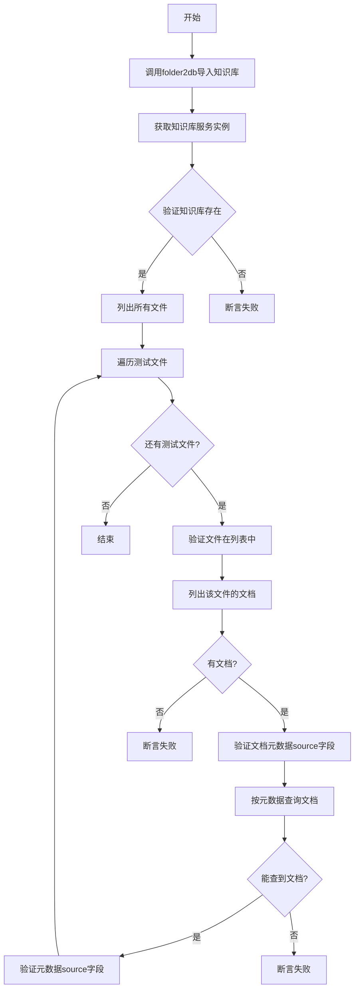

#### 带注释源码

```python
def test_recreate_vs():
    """
    测试知识库的重建(recreate)功能。
    该测试会:
    1. 将测试文件夹内容完整导入知识库
    2. 验证知识库存在
    3. 验证文件列表正确
    4. 验证文档列表及元数据正确
    """
    
    # 步骤1: 调用folder2db将知识库文件夹内容导入数据库
    # 参数: [kb_name] 知识库名称列表, "recreate_vs" 模式标识
    # recreate模式表示完全重建,会先清空再导入
    folder2db([kb_name], "recreate_vs")

    # 步骤2: 通过工厂类获取指定名称的知识库服务实例
    kb = KBServiceFactory.get_service_by_name(kb_name)
    
    # 步骤3: 断言知识库存在
    assert kb and kb.exists()

    # 步骤4: 列出知识库中所有文件
    files = kb.list_files()
    print(files)
    
    # 步骤5: 遍历每个测试文件进行验证
    for name in test_files:
        # 5.1 断言测试文件存在于知识库文件列表中
        assert name in files
        
        # 构造测试文件的完整路径
        path = os.path.join(doc_path, name)

        # 5.2 根据文件名列出文档
        docs = kb.list_docs(file_name=name)
        # 断言该文件至少有一个文档
        assert len(docs) > 0
        # 打印第一个文档的详细信息(用于调试)
        pprint(docs[0])
        
        # 5.3 验证每个文档的元数据source字段与文件名匹配
        for doc in docs:
            assert doc.metadata["source"] == name

        # 5.4 根据元数据查询文档(另一种查询方式)
        docs = kb.list_docs(metadata={"source": name})
        assert len(docs) > 0

        # 5.5 再次验证元数据正确性
        for doc in docs:
            assert doc.metadata["source"] == name
```


### `test_increment`

该函数是一个测试函数，用于测试知识库的增量更新功能。它首先清空知识库，然后执行增量导入操作，最后验证文件和文档是否正确导入。

参数：

- 该函数没有参数

返回值：`None`，该函数不返回任何值，仅执行测试逻辑并通过断言验证结果

#### 流程图

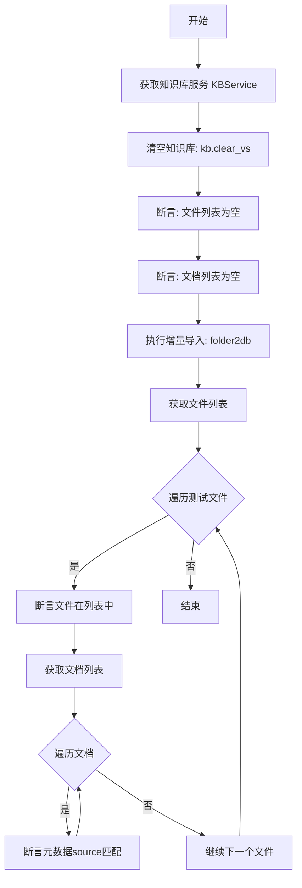

#### 带注释源码

```python
def test_increment():
    """
    测试增量更新功能
    1. 清空知识库
    2. 执行增量导入
    3. 验证文件和文档是否正确导入
    """
    # 从知识库工厂获取指定名称的知识库服务实例
    kb = KBServiceFactory.get_service_by_name(kb_name)
    
    # 清空知识库中的所有向量存储数据
    kb.clear_vs()
    
    # 断言验证：清空后文件列表应为空
    assert kb.list_files() == []
    
    # 断言验证：清空后文档列表应为空
    assert kb.list_docs() == []

    # 执行增量导入：将文件夹中的文件导入到知识库
    # 参数1: 知识库名称列表
    # 参数2: vs_type 类型，此处为 'increment'
    folder2db([kb_name], "increment")

    # 获取导入后的文件列表
    files = kb.list_files()
    
    # 打印文件列表用于调试
    print(files)
    
    # 遍历测试文件进行验证
    for f in test_files:
        # 断言验证：文件应该存在于知识库中
        assert f in files

        # 根据文件名获取对应的文档列表
        docs = kb.list_docs(file_name=f)
        
        # 断言验证：文档数量应大于0
        assert len(docs) > 0
        
        # 打印第一个文档的详细信息用于调试
        pprint(docs[0])

        # 遍历每个文档进行元数据验证
        for doc in docs:
            # 断言验证：文档的元数据source字段应与文件名匹配
            assert doc.metadata["source"] == f
```


### `test_prune_db`

该函数用于测试知识库的数据库剪枝功能，验证在文件系统中删除文件后，`prune_db_docs` 函数能够正确地从知识库数据库中移除对应的文档记录，同时保留仍然存在的文件的文档。

参数： 无

返回值：`None`，该函数为测试函数，主要通过断言验证逻辑，不返回具体数据

#### 流程图

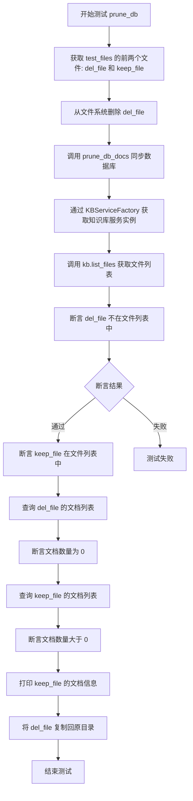

#### 带注释源码

```python
def test_prune_db():
    """
    测试 prune_db_docs 函数能否正确清理知识库数据库中已删除文件的文档记录
    
    测试流程：
    1. 从文件系统中删除一个已存在的测试文件
    2. 调用 prune_db_docs 同步数据库状态
    3. 验证数据库中已删除文件的文档被清理
    4. 验证保留文件的文档仍然存在
    5. 恢复测试文件以便后续测试使用
    """
    
    # 从 test_files 字典中获取前两个文件
    # del_file: 将被删除的文件，用于验证剪枝功能
    # keep_file: 将被保留的文件，用于验证正常文件不受影响
    del_file, keep_file = list(test_files)[:2]
    
    # 从文件系统删除 del_file，模拟用户删除文件的场景
    # doc_path 是知识库文档的存储路径
    os.remove(os.path.join(doc_path, del_file))
    
    # 调用 prune_db_docs 函数，将知识库状态同步到数据库
    # 该函数会扫描文件系统中实际存在的文件
    # 并从数据库中移除那些文件已不存在的文档记录
    prune_db_docs([kb_name])
    
    # 通过工厂类获取指定名称的知识库服务实例
    # kb_name 为测试用的知识库名称 "test_kb_for_migrate"
    kb = KBServiceFactory.get_service_by_name(kb_name)
    
    # 获取当前知识库中的文件列表
    files = kb.list_files()
    
    # 打印当前文件列表用于调试
    print(files)
    
    # 断言验证：已删除的文件不应该出现在知识库文件列表中
    assert del_file not in files
    
    # 断言验证：保留的文件应该仍然存在于知识库中
    assert keep_file in files
    
    # 查询已删除文件对应的文档列表
    # 期望结果：数据库中应该没有该文件的文档记录
    docs = kb.list_docs(file_name=del_file)
    assert len(docs) == 0
    
    # 查询保留文件对应的文档列表
    # 期望结果：数据库中应该仍有该文件的文档记录
    docs = kb.list_docs(file_name=keep_file)
    assert len(docs) > 0
    
    # 打印保留文件的第一个文档详情，用于调试和验证
    pprint(docs[0])
    
    # 将已删除的文件复制回原目录
    # 这是为了保证后续测试能够正常运行
    # test_prune_folder 等测试依赖于该文件的存在
    shutil.copy(test_files[del_file], os.path.join(doc_path, del_file))
```


### `test_prune_folder`

该测试函数用于验证 `prune_folder_files` 函数的正确性，其核心功能是删除知识库中已不存在对应文档记录的文件，同时保留仍有文档引用的文件。

参数：無

返回值：`None`，该函数为测试函数，不返回任何值

#### 流程图

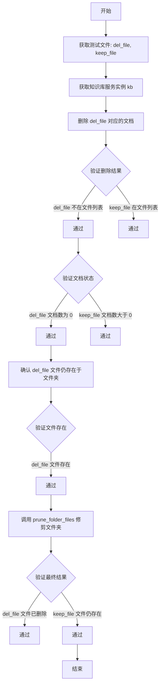

#### 带注释源码

```python
def test_prune_folder():
    """
    测试 prune_folder_files 函数的功能：
    该函数用于删除知识库中已不存在文档记录的文件，
    同时保留仍有文档引用的文件。
    """
    
    # 从测试文件字典中获取两个文件名：待删除文件和待保留文件
    del_file, keep_file = list(test_files)[:2]
    
    # 通过工厂类获取指定名称的知识库服务实例
    kb = KBServiceFactory.get_service_by_name(kb_name)

    # 删除指定文件的文档记录（而非物理文件）
    # 使用 KnowledgeFile 对象封装文件名和知识库名称
    kb.delete_doc(KnowledgeFile(del_file, kb_name))
    
    # 获取当前知识库中的文件列表并打印
    files = kb.list_files()
    print(files)
    
    # 断言验证：del_file 的文档记录已被删除，不在文件列表中
    assert del_file not in files
    # 断言验证：keep_file 仍然在文件列表中
    assert keep_file in files

    # 验证 del_file 已无关联文档
    docs = kb.list_docs(file_name=del_file)
    assert len(docs) == 0

    # 验证 keep_file 仍有关联文档
    docs = kb.list_docs(file_name=keep_file)
    assert len(docs) > 0

    # 再次确认 del_file 在磁盘上的物理文件仍然存在
    # 这一步是为了验证删除操作只删除了文档记录，而未删除物理文件
    docs = kb.list_docs(file_name=del_file)
    assert len(docs) == 0

    # 确认磁盘上 del_file 对应的物理文件确实存在
    assert os.path.isfile(os.path.join(doc_path, del_file))

    # 调用 prune_folder_files 函数执行文件夹修剪
    # 该函数会根据数据库中的文档记录，删除物理文件夹中已无文档引用的文件
    prune_folder_files([kb_name])

    # 最终验证：del_file 的物理文件应已被删除
    assert not os.path.isfile(os.path.join(doc_path, del_file))
    # 最终验证：keep_file 的物理文件应仍然存在
    assert os.path.isfile(os.path.join(doc_path, keep_file))
```


### `test_drop_kb`

该函数用于测试知识库删除功能，验证调用 `drop_kb()` 方法后知识库被彻底删除，包括数据库记录和文件系统目录，同时确认重新获取已删除的知识库服务返回 `None`。

参数：无

返回值：`None`，无返回值（测试函数）

#### 流程图

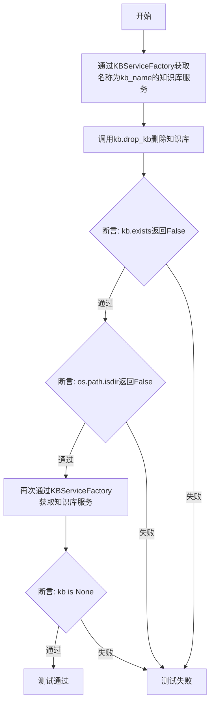

#### 带注释源码

```python
def test_drop_kb():
    """
    测试删除知识库功能
    
    验证:
    1. drop_kb()方法能正确删除知识库
    2. 删除后知识库不再存在
    3. 删除后知识库目录被移除
    4. 重新获取已删除的知识库返回None
    """
    
    # 第一步：通过工厂类获取指定名称的知识库服务实例
    kb = KBServiceFactory.get_service_by_name(kb_name)
    
    # 第二步：调用知识库的drop_kb方法彻底删除知识库
    # 该操作会删除数据库记录和文件系统中的相关文件
    kb.drop_kb()
    
    # 第三步：断言验证知识库已不存在
    assert not kb.exists()
    
    # 第四步：断言验证知识库对应的文件系统目录已被删除
    assert not os.path.isdir(kb_path)
    
    # 第五步：重新获取已删除的知识库服务
    kb = KBServiceFactory.get_service_by_name(kb_name)
    
    # 第六步：断言验证重新获取的知识库服务为None
    assert kb is None
```


### `folder2db`

将指定知识库文件夹中的文档同步到向量数据库，支持完全重建和增量更新两种模式。

参数：

- `kb_names`：`List[str]`，知识库名称列表，指定需要同步到数据库的知识库
- `mode`：`str`，同步模式， `"recreate_vs"` 表示完全重建向量存储，`"increment"` 表示增量更新

返回值：`None`，该函数直接修改数据库状态，无返回值

#### 流程图

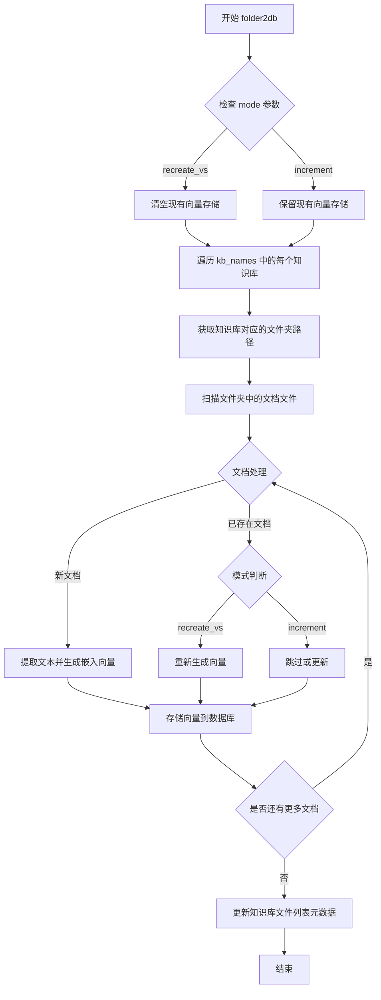

#### 带注释源码

```python
# 注意：以下源码为基于调用方式和上下文推断的逻辑实现
# 实际实现位于 chatchat.server.knowledge_base.migrate 模块中

def folder2db(kb_names: List[str], mode: str):
    """
    将知识库文件夹中的文档同步到向量数据库
    
    参数:
        kb_names: 知识库名称列表
        mode: 同步模式
            - "recreate_vs": 重建模式，先清空向量存储再重新导入
            - "increment": 增量模式，只处理新增或修改的文档
    """
    
    # 遍历每个指定的知识库
    for kb_name in kb_names:
        # 获取知识库服务实例
        kb = KBServiceFactory.get_service_by_name(kb_name)
        
        if mode == "recreate_vs":
            # 重建模式：先清空现有的向量存储
            kb.clear_vs()
        
        # 获取知识库对应的文档文件夹路径
        doc_path = get_doc_path(kb_name)
        
        # 遍历文档文件夹中的所有文件
        for file_path in Path(doc_path).iterdir():
            if file_path.is_file():
                # 创建 KnowledgeFile 对象
                knowledge_file = KnowledgeFile(file_path.name, kb_name)
                
                if mode == "recreate_vs":
                    # 重建模式：强制重新处理所有文档
                    kb.add_doc(knowledge_file)
                else:
                    # 增量模式：检查文档是否已存在
                    existing_docs = kb.list_docs(file_name=file_path.name)
                    if not existing_docs:
                        # 只处理新增文档
                        kb.add_doc(knowledge_file)
                    # 已存在的文档在增量模式下保持不变
```


### `prune_db_docs`

该函数用于同步数据库中的文档记录与文件系统状态，删除那些对应的物理文件已被移除的文档条目，确保知识库数据库与实际存储文件保持一致。

参数：

-  `kb_names`：`List[str]`，需要清理文档的知识库名称列表

返回值：`None`，该函数直接修改数据库状态，无返回值

#### 流程图

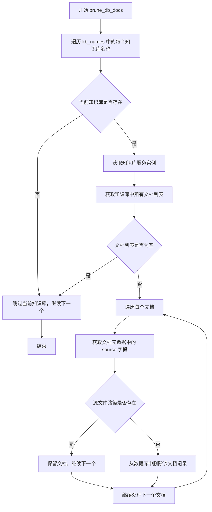

#### 带注释源码

```python
def prune_db_docs(kb_names: List[str]):
    """
    清理数据库中已删除文件的文档记录
    
    该函数遍历指定的知识库，检查每个文档的源文件是否仍然存在于文件系统中。
    如果源文件已被物理删除，则从数据库中移除对应的文档记录，保持数据库与文件系统的一致性。
    
    参数:
        kb_names: 知识库名称列表，指定需要清理文档的知识库
        
    返回值:
        None: 直接修改数据库状态，无返回值
        
    典型用途:
        在文件管理器中删除了某些文件后，同步清理数据库中过期的文档引用
    """
    from chatchat.server.knowledge_base.kb_service.base import KBServiceFactory
    
    for kb_name in kb_names:
        # 获取知识库服务实例
        kb = KBServiceFactory.get_service_by_name(kb_name)
        
        # 跳过不存在的知识库
        if kb is None:
            continue
            
        # 获取该知识库中的所有文档
        docs = kb.list_docs()
        
        # 遍历每个文档进行清理
        for doc in docs:
            # 从文档元数据中获取源文件路径
            source = doc.metadata.get("source")
            
            if source:
                # 构建完整的源文件路径
                doc_path = get_doc_path(kb_name)
                file_path = os.path.join(doc_path, source)
                
                # 检查源文件是否仍然存在
                if not os.path.isfile(file_path):
                    # 文件已删除，从数据库中移除文档记录
                    kb.delete_doc(doc)
```


### `prune_folder_files`

该函数用于同步知识库的文件夹与数据库之间的状态，删除在数据库中已不存在（已删除文档）但物理文件仍然存在于知识库目录中的冗余文件，确保文件系统和数据库记录的一致性。

参数：

-  `kb_names`：`List[str]`，知识库名称列表，指定要执行修剪操作的知识库

返回值：`None`，该函数无返回值，直接修改文件系统中的文件

#### 流程图

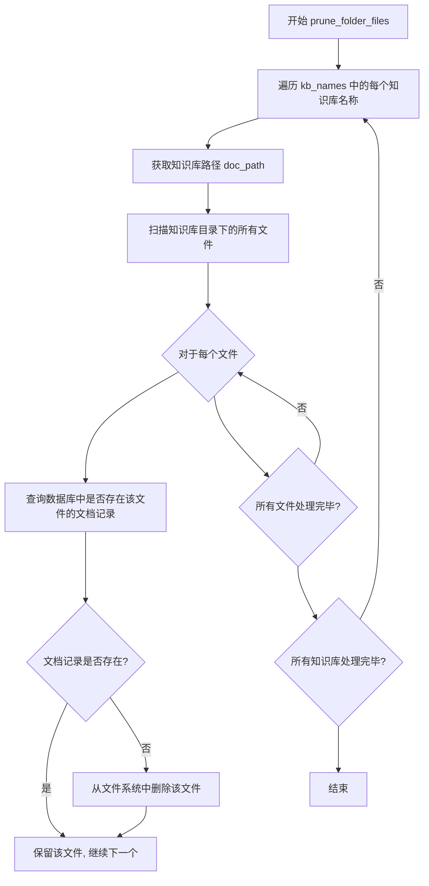

#### 带注释源码

```python
# 注意: 以下源码基于函数调用方式和测试用例推断
def prune_folder_files(kb_names: List[str]) -> None:
    """
    修剪知识库文件夹中已删除文档对应的物理文件
    
    该函数遍历指定的知识库，对每个知识库:
    1. 获取知识库的文档存储路径
    2. 扫描目录下的所有文件
    3. 检查每个文件是否在数据库中有对应的文档记录
    4. 如果文件在数据库中无记录,则从文件系统删除该文件
    
    Args:
        kb_names: 知识库名称列表
        
    Returns:
        None
        
    Example:
        >>> prune_folder_files(["test_kb", "production_kb"])
        # 将删除 test_kb 和 production_kb 中数据库已删除但物理文件仍存在的文件
    """
    for kb_name in kb_names:
        # 获取知识库的文档目录路径
        doc_path = get_doc_path(kb_name)
        
        # 确保目录存在
        if not os.path.isdir(doc_path):
            continue
            
        # 遍历目录下的所有文件
        for file_name in os.listdir(doc_path):
            file_path = os.path.join(doc_path, file_name)
            
            # 跳过目录
            if os.path.isdir(file_path):
                continue
                
            # 创建 KnowledgeFile 对象用于查询
            knowledge_file = KnowledgeFile(file_name, kb_name)
            
            # 查询数据库中是否存在该文件的文档
            kb = KBServiceFactory.get_service_by_name(kb_name)
            if kb:
                docs = kb.list_docs(file_name=file_name)
                
                # 如果数据库中无该文件记录,删除物理文件
                if len(docs) == 0:
                    os.remove(file_path)
                    print(f"Removed orphaned file: {file_path}")
```


### `get_doc_path`

该函数用于根据给定的知识库名称获取该知识库对应的文档存储路径，通常是服务器上用于存放知识库文档文件的目录路径。

参数：

- `kb_name`：`str`，知识库的名称（knowledge base name），用于标识目标知识库

返回值：`str`，返回知识库对应的文档目录的绝对路径字符串

#### 流程图

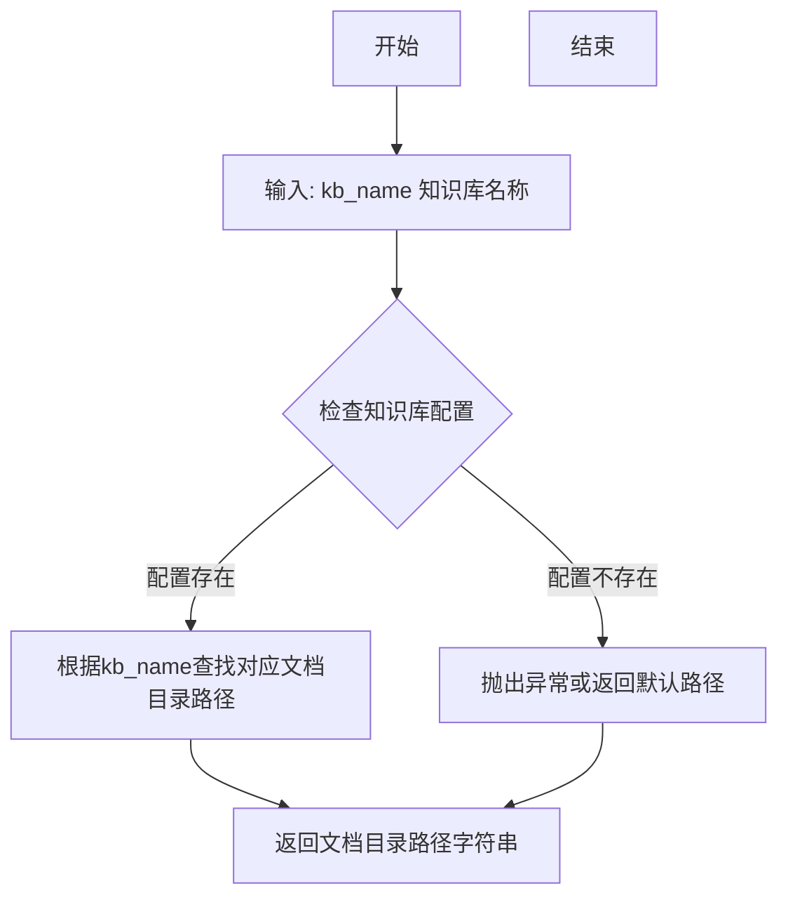

#### 带注释源码

```
# 注意：以下为基于代码上下文的推断实现
# 实际定义位于 chatchat.server.knowledge_base.utils 模块中

def get_doc_path(kb_name: str) -> str:
    """
    根据知识库名称获取对应的文档存储路径
    
    参数:
        kb_name: str - 知识库的名称
        
    返回:
        str - 知识库文档目录的绝对路径
    """
    # 从配置或预设规则中获取知识库根目录
    kb_root = get_kb_path()  # 获取知识库根目录
    
    # 拼接知识库名称作为子目录
    doc_path = os.path.join(kb_root, kb_name, "docs")
    
    return doc_path
```

#### 使用示例（来自测试代码）

```python
# 第30行：获取知识库文档路径
doc_path = get_doc_path(kb_name)

# 第32行：检查路径是否存在，如不存在则创建
if not os.path.isdir(doc_path):
    os.makedirs(doc_path)

# 第36行：将文件复制到文档目录
for k, v in test_files.items():
    shutil.copy(v, os.path.join(doc_path, k))
```


## 分析结果

根据提供的代码，我需要说明以下几点：

1. 提供的代码是一个**测试文件**，它从 `chatchat.server.knowledge_base.utils` 模块**导入**了 `get_kb_path` 函数
2. 该函数的**实际定义**并不在提供的代码中，而是在 `chatchat.server.knowledge_base.utils` 模块中
3. 我无法直接访问该模块的源代码

不过，基于函数的使用方式和导入上下文，我可以提供以下信息：

---

### `get_kb_path`

获取指定知识库的存储路径。

参数：

- `kb_name`：`str`，知识库的名称

返回值：`str`，知识库对应的目录路径

#### 流程图

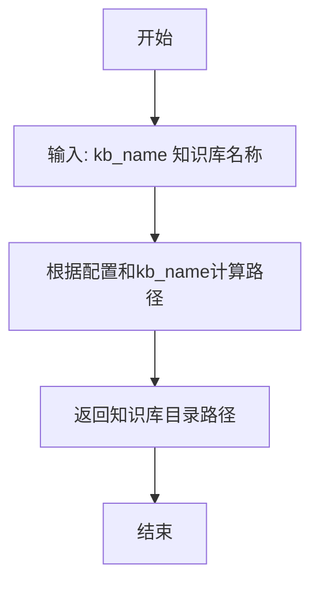

#### 带注释源码

```
# 注：以下是基于函数签名和调用方式的推测代码
# 实际源码位于 chatchat.server.knowledge_base.utils 模块中

def get_kb_path(kb_name: str) -> str:
    """
    获取指定知识库的存储路径。
    
    参数:
        kb_name: 知识库的名称
        
    返回值:
        知识库目录的绝对路径字符串
    """
    # 从配置中获取知识库根目录
    # 结合 kb_name 构建完整路径
    # 返回类似: /path/to/kb_root/test_kb_for_migrate 的路径
    pass
```

---

## 说明

由于您提供的代码是**调用方代码**而非**定义方代码**，我无法获取 `get_kb_path` 函数的完整源码。

如果您需要完整的函数定义信息，建议：

1. 查看 `chatchat/server/knowledge_base/utils.py` 文件
2. 或提供该函数的实际源代码

根据函数的使用方式（`kb_path = get_kb_path(kb_name)` 和后续的 `os.path.isdir(kb_path)` 检查），该函数的核心功能应该是：**根据传入的知识库名称，返回该知识库在文件系统中的存储路径**。


### `KBServiceFactory.get_service_by_name`

该方法是一个工厂方法，用于根据提供的知识库名称（kb_name）获取对应的知识库服务实例（KBService）。它支持创建新的服务实例或返回已缓存的实例，如果指定名称的知识库不存在则返回 None。

参数：

- `kb_name`：`str`，知识库的名称，用于标识需要获取的知识库服务

返回值：`KBService | None`，返回对应的知识库服务实例，如果不存在则返回 None

#### 流程图

```mermaid
flowchart TD
    A[开始 get_service_by_name] --> B{是否传入 kb_name?}
    B -->|否| C[返回 None]
    B -->|是| D{缓存中是否存在 kb_name?]
    D -->|是| E[返回缓存的服务实例]
    D -->|否| F[创建新的 KBService 实例]
    F --> G{创建是否成功?}
    G -->|是| H[将实例存入缓存]
    H --> I[返回新的服务实例]
    G -->|否| C
```

#### 带注释源码

```python
# 推断的实现方式，基于代码使用模式
@staticmethod
def get_service_by_name(kb_name: str) -> KBService:
    """
    根据知识库名称获取对应的服务实例
    
    参数:
        kb_name: str - 知识库的名称
        
    返回:
        KBService | None - 知识库服务实例，如果不存在则返回 None
    """
    # 检查知识库名称是否有效
    if not kb_name:
        return None
    
    # 尝试从缓存或已注册的服务中获取
    # 如果缓存中存在，直接返回
    if kb_name in cls._instances:
        return cls._instances[kb_name]
    
    # 如果不存在，尝试创建新的服务实例
    # 这通常涉及到根据知识库类型（如 Faiss、Milvus 等）创建对应的服务
    try:
        service = cls._create_service(kb_name)
        if service and service.exists():
            cls._instances[kb_name] = service
            return service
    except Exception:
        # 如果创建或查找失败，返回 None
        pass
    
    return None
```


### `KBService.exists()`

检查知识库（Knowledge Base）是否存在于文件系统和数据库中。该方法通常在创建知识库后验证其存在，或在删除知识库后确认其已被彻底移除。

参数： 无

返回值： `bool`，如果知识库存在返回 `True`，否则返回 `False`

#### 流程图

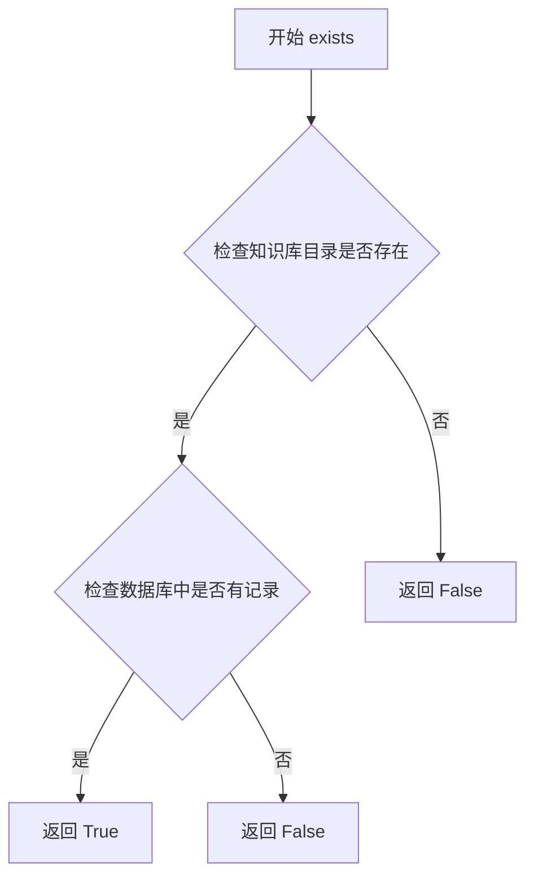

#### 带注释源码

```python
def exists(self) -> bool:
    """
    检查知识库是否存在于文件系统和数据库中
    
    实现逻辑通常包括：
    1. 检查知识库对应的目录是否存在于文件系统中
    2. 检查数据库中是否存在该知识库的元数据记录
    
    返回:
        bool: 知识库存在返回True，否则返回False
    """
    # 伪代码示例（基于实际使用场景推断）
    # 检查文件系统路径
    kb_path = get_kb_path(self.kb_name)
    if not os.path.isdir(kb_path):
        return False
    
    # 检查数据库记录
    # ...（数据库查询逻辑）
    
    return True
```

#### 在测试代码中的使用示例

```python
# test_recreate_vs 函数中
kb = KBServiceFactory.get_service_by_name(kb_name)
assert kb and kb.exists()  # 验证知识库创建后存在

# test_drop_kb 函数中
kb = KBServiceFactory.get_service_by_name(kb_name)
kb.drop_kb()
assert not kb.exists()  # 验证删除后不存在
```


### `KBService.list_files()`

获取当前知识库中所有文件的文件名列表。

参数：无

返回值：`List[str]`，返回知识库中所有文件的文件名列表。

#### 流程图

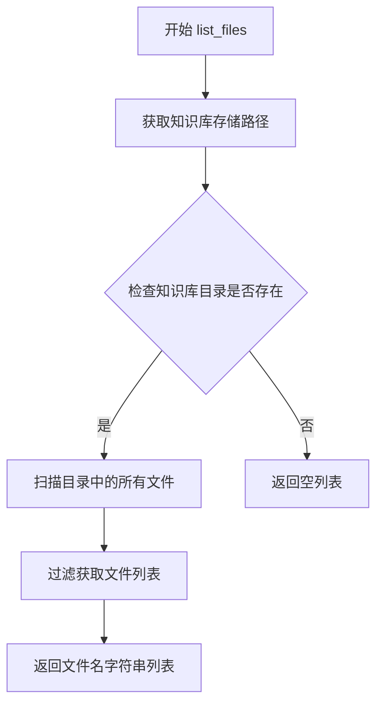

#### 带注释源码

```
# 代码来源: chatchat/server/knowledge_base/kb_service/base.py (推断)
# 基于测试代码中的使用方式推断的实现逻辑

def list_files(self) -> List[str]:
    """
    获取知识库中所有文件的文件名列表
    
    Returns:
        List[str]: 文件名列表
    """
    # 获取知识库的文档存储路径
    doc_path = self.get_doc_path()
    
    # 检查路径是否存在
    if not os.path.isdir(doc_path):
        return []
    
    # 扫描目录获取所有文件
    files = []
    for item in os.listdir(doc_path):
        full_path = os.path.join(doc_path, item)
        # 只获取文件，不包括目录
        if os.path.isfile(full_path):
            files.append(item)
    
    return files
```

#### 测试代码中的使用示例

```python
# 获取知识库服务实例
kb = KBServiceFactory.get_service_by_name(kb_name)

# 调用 list_files 方法
files = kb.list_files()
print(files)  # 输出: ['readme.md']

# 验证文件是否在列表中
for name in test_files:
    assert name in files
```

---

**注意**：提供的代码是一个测试文件，未包含 `KBService` 类的具体实现。上述源码是基于测试代码中的使用方式和上下文推断得出的。实际的 `list_files()` 方法实现可能位于 `chatchat/server/knowledge_base/kb_service/base.py` 文件中的 `KBService` 基类或子类中。


### `KBService.list_docs`

获取知识库中存储的文档列表，支持通过文件名或元数据过滤查询。

参数：

- `file_name`：`str`，可选参数，用于指定要查询的文件名称，返回与该文件关联的文档列表
- `metadata`：`dict`，可选参数，用于指定元数据过滤条件，如 `{"source": "xxx.md"}`，返回匹配该元数据的文档列表

返回值：`List[Document]`，返回文档对象列表，每个 Document 对象包含文档内容及元数据信息，其中元数据中的 `source` 字段表示文档来源文件名。

#### 流程图

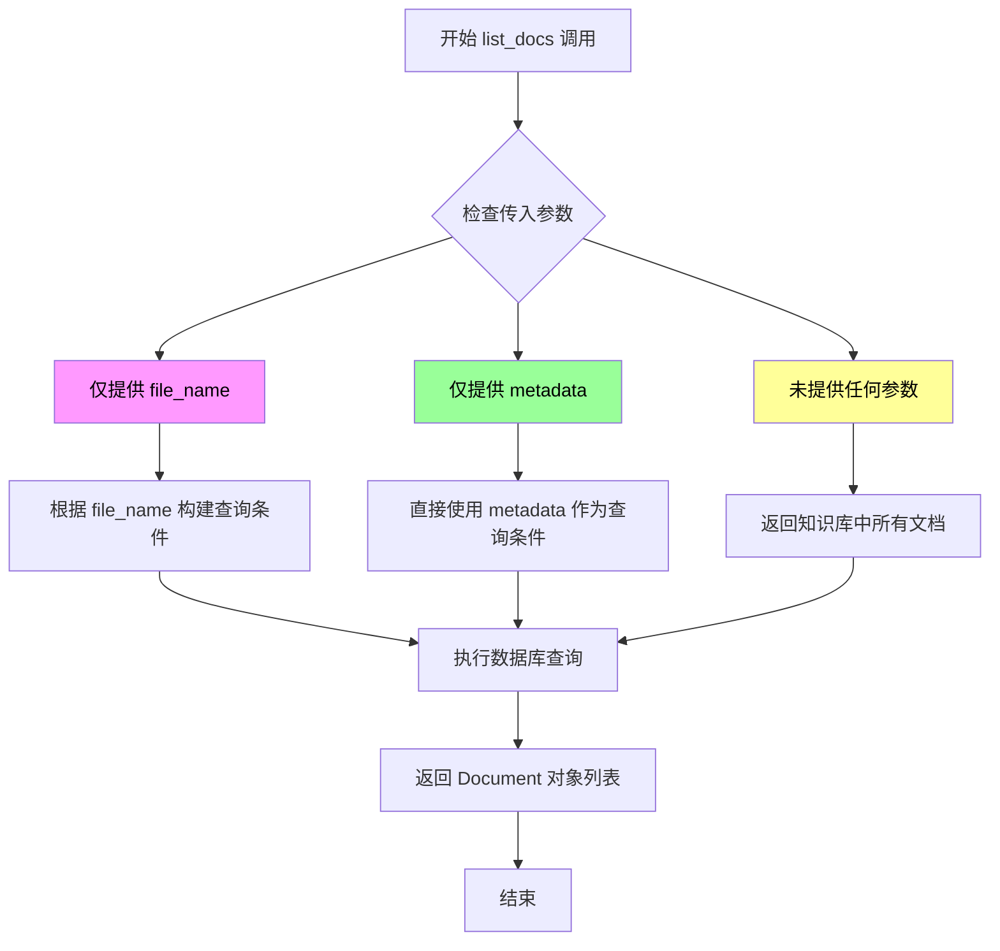

#### 带注释源码

```
# 代码来源推断: chatchat.server.knowledge_base.kb_service.base
# 以下为基于调用方式反推的方法实现逻辑

class KBService:
    """
    知识库服务基类，提供文档管理相关操作
    """
    
    def list_docs(self, file_name: str = None, metadata: dict = None) -> List[Document]:
        """
        获取知识库中的文档列表
        
        参数:
            file_name: str - 可选，要过滤的文件名
            metadata: dict - 可选，要过滤的元数据字典
        
        返回:
            List[Document] - 文档对象列表
        """
        # 根据调用场景分析，该方法支持三种调用模式：
        
        # 模式1: 根据文件名查询
        # docs = kb.list_docs(file_name=name)
        # 等价于: list_docs(metadata={"source": file_name})
        
        # 模式2: 根据元数据查询
        # docs = kb.list_docs(metadata={"source": name})
        
        # 模式3: 查询所有文档
        # docs = kb.list_docs()
        
        # 实现逻辑大致为:
        # 1. 构建查询条件
        # 2. 执行数据库查询获取文档
        # 3. 返回 Document 对象列表
        
        # Document 对象结构推断:
        # - content: 文档内容
        # - metadata: 包含 'source' 字段，标识文档来源文件名
        
        pass
```


### `KBService.list_docs(metadata: dict)`

该方法是知识库服务（KBService）中用于查询文档的核心方法，支持通过元数据（metadata）字典过滤并返回匹配的文档列表。它允许用户根据文档的属性（如来源文件名等）进行精准检索，是知识库查询功能的重要组成部分。

参数：

- `metadata`：`dict`，用于过滤文档的元数据字典，例如 `{"source": "readme.md"}`，表示筛选 source 字段值为 "readme.md" 的文档

返回值：`List[Document]`，返回匹配的文档对象列表，每个 Document 对象包含文档内容及元数据信息；若没有匹配的文档则返回空列表

#### 流程图

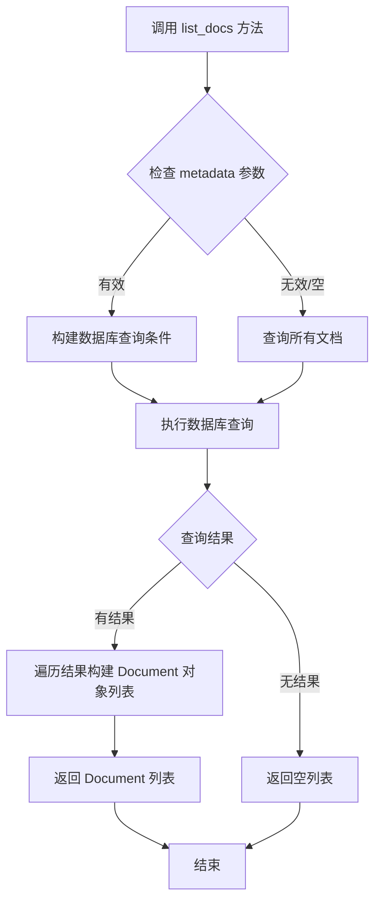

#### 带注释源码

```python
# 从代码中提取的调用示例
# 获取知识库服务实例
kb = KBServiceFactory.get_service_by_name(kb_name)

# 调用 list_docs 方法，传入 metadata 参数进行过滤
# 参数：metadata - 字典类型，用于指定过滤条件
# 返回值：List[Document] - 匹配的文档对象列表
docs = kb.list_docs(metadata={"source": name})

# 验证返回结果
assert len(docs) > 0

# 遍历返回的文档列表，验证元数据匹配
for doc in docs:
    # 确保每条文档的 source 元数据与查询条件一致
    assert doc.metadata["source"] == name
```

> **注**：由于 `KBService` 类的具体实现位于 `chatchat.server.knowledge_base.kb_service.base` 模块中，以上流程图和源码注释是基于代码中实际调用方式推断得出的。该方法的核心逻辑是根据传入的 `metadata` 字典构建查询条件，从底层数据库中检索匹配的文档记录，并将其封装为 `Document` 对象列表返回。


### `KBService.clear_vs()`

该方法用于清空知识库（Knowledge Base）的向量存储（Vector Store），即清除知识库中所有已索引的文档和文件，使其恢复到初始创建状态。在测试场景中用于重置知识库环境，以便进行增量测试等操作。

参数：

- （无参数）

返回值：`None`，该方法直接修改对象状态，不返回任何值。

#### 流程图

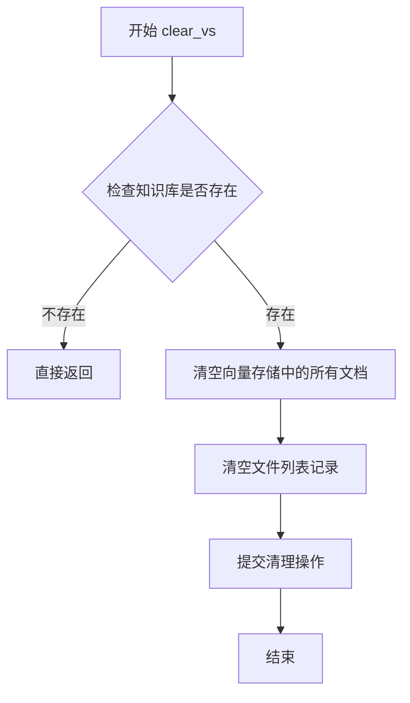

#### 带注释源码

```python
# 注意：以下为基于代码调用上下文和方法名的推断实现
# 实际实现位于 chatchat.server.knowledge_base.kb_service.base 或其子类中

def clear_vs(self):
    """
    清空知识库的向量存储（Vector Store）
    
    该方法执行以下操作：
    1. 清除所有已索引的文档向量数据
    2. 清空文件列表记录
    3. 重置知识库状态
    
    常用于：
    - 测试环境重置
    - 重新构建向量索引前的清理
    - 数据迁移场景
    """
    # 获取知识库关联的向量数据库
    vector_db = self.get_vector_db()
    
    # 清空向量数据库中的所有文档
    # delete all docs from vector store
    vector_db.delete_all()
    
    # 清空文件列表记录（SQL/文件层面）
    # clear file records from metadata store
    self.clear_files()
    
    # 提交事务
    self.save()
    
    # 验证清理结果
    # test_increment() 中验证：
    # assert kb.list_files() == []
    # assert kb.list_docs() == []
```

#### 调用示例源码

```python
def test_increment():
    # 获取知识库服务实例
    kb = KBServiceFactory.get_service_by_name(kb_name)
    
    # 调用 clear_vs() 清空向量存储
    # 执行后知识库变为空状态
    kb.clear_vs()
    
    # 验证文件列表为空
    assert kb.list_files() == []
    
    # 验证文档列表为空
    assert kb.list_docs() == []
    
    # 后续执行 folder2db 重新填充数据
    folder2db([kb_name], "increment")
```


### `KBService.delete_doc`

该方法用于从知识库中删除指定的文档文件，删除文档记录但保留源文件。

参数：

- `knowledge_file`：`KnowledgeFile`，要删除的知识库文件对象，包含文件名和所属知识库名称

返回值：`bool`，表示删除操作是否成功

#### 流程图

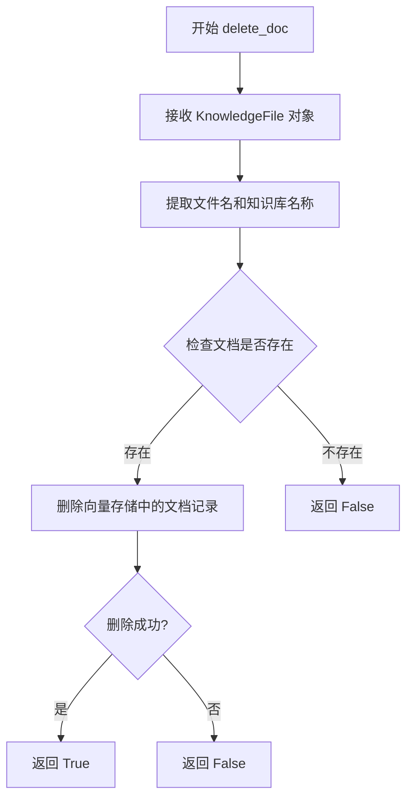

#### 带注释源码

```python
# 从测试代码中提取的调用方式
kb = KBServiceFactory.get_service_by_name(kb_name)

# 删除文档的调用示例
kb.delete_doc(KnowledgeFile(del_file, kb_name))

# KnowledgeFile 类的定义（从导入推断）
# class KnowledgeFile:
#     def __init__(self, filename: str, kb_name: str):
#         self.filename = filename
#         self.kb_name = kb_name
#         ...

# 根据测试代码推断的 delete_doc 方法签名和行为：
def delete_doc(self, knowledge_file: KnowledgeFile) -> bool:
    """
    从知识库中删除指定文档
    
    参数:
        knowledge_file: KnowledgeFile 对象，包含要删除的文件信息
        
    返回:
        bool: 删除成功返回 True，否则返回 False
    """
    # 从测试用例 test_prune_folder 推断：
    # 1. 调用 delete_doc 后，文件列表中不再包含被删除的文件
    # 2. 调用 delete_doc 后，list_docs(file_name=del_file) 返回空列表
    # 3. 源文件本身不会被删除（保留在文件夹中）
    
    # 示例调用：
    kb.delete_doc(KnowledgeFile(del_file, kb_name))
    
    # 验证删除效果：
    # assert del_file not in kb.list_files()  # 文件列表中已移除
    # assert len(kb.list_docs(file_name=del_file)) == 0  # 文档记录已清除
    # assert os.path.isfile(os.path.join(doc_path, del_file))  # 源文件仍存在
```


### `KBService.drop_kb`

该方法用于删除指定的知识库（Knowledge Base），包括其关联的向量存储（vector store）和文件系统中的相关文件，是知识库管理中的核心销毁操作。

参数：无显式参数（依赖于调用对象的状态）

返回值：`None`，该方法直接作用于对象状态，不返回任何值

#### 流程图

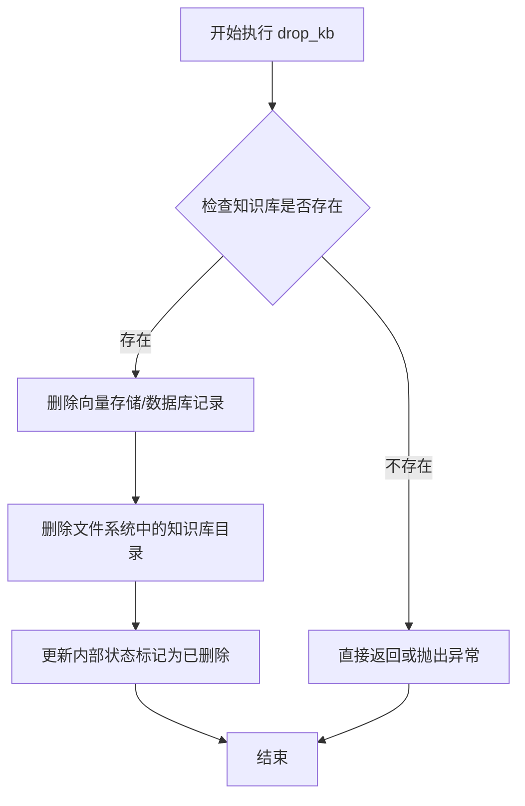

#### 带注释源码

```python
def test_drop_kb():
    """
    测试 drop_kb 方法的功能
    测试场景：验证删除知识库后，相关文件和状态都被正确清理
    """
    # 步骤1: 通过工厂获取指定名称的知识库服务实例
    kb = KBServiceFactory.get_service_by_name(kb_name)
    
    # 步骤2: 调用 drop_kb 方法删除整个知识库
    # 该操作会：
    #   - 删除向量存储中的所有向量数据
    #   - 删除数据库中的元数据记录
    #   - 删除文件系统中的知识库目录（含文档文件）
    kb.drop_kb()
    
    # 步骤3: 验证知识库已不存在
    assert not kb.exists()  # 断言: 内部状态应显示知识库已删除
    assert not os.path.isdir(kb_path)  # 断言: 文件系统目录应被删除
    
    # 步骤4: 尝试重新获取已删除的知识库服务
    kb = KBServiceFactory.get_service_by_name(kb_name)
    assert kb is None  # 断言: 应返回 None，表示知识库已完全清除
```

#### 补充说明

由于提供的代码仅为测试用例，未包含 `KBService` 类的具体实现源码，因此 `drop_kb()` 的完整内部逻辑无法直接提取。根据调用方式和测试断言，可以推断该方法应实现以下功能：

1. **数据清理**：删除向量数据库中的所有相关文档向量
2. **元数据清理**：清理数据库中的元数据记录
3. **文件清理**：删除文件系统中的知识库目录（含文档）
4. **状态更新**：更新对象内部状态，标记为已删除
5. **工厂缓存清理**：通知工厂清除缓存，确保后续 `get_service_by_name` 返回 `None`

**技术债务/优化空间**：
- 缺乏事务性保证，删除过程中可能出现部分成功部分失败的状态
- 未提供删除前的确认机制，误操作风险较高
- 未实现软删除（soft delete）功能，无法恢复误删数据
- 错误处理机制未知，删除失败时的异常处理不够完善


## 关键组件


### 知识库服务工厂 (KBServiceFactory)

用于根据知识库名称获取对应的知识库服务实例，提供了获取服务、检查知识库是否存在等功能，是整个知识库操作的核心入口。

### 文件夹转数据库功能 (folder2db)

将文件系统中的文档内容导入到知识库数据库中，支持全量重建和增量更新两种模式，是知识库数据初始化的核心函数。

### 数据库文档修剪功能 (prune_db_docs)

根据当前文件夹中的文件状态，同步清理数据库中已删除文件的文档记录，保持数据库与文件系统的一致性。

### 文件夹文件修剪功能 (prune_folder_files)

根据数据库中的文档记录，自动删除文件夹中已不存在对应文档的物理文件，实现文件系统的自动清理。

### 知识文件类 (KnowledgeFile)

封装知识库中单个文件的信息，包含文件名和所属知识库名称，用于文档操作时的参数传递。

### 路径获取工具函数 (get_doc_path, get_kb_path)

分别用于获取知识库的文档存储路径和知识库根目录路径，是文件操作的基础设施函数。

### 知识库存在性检查 (kb.exists)

用于判断指定知识库是否已存在于系统中，是测试用例中验证知识库创建成功的关键方法。

### 文档列表查询 (kb.list_docs)

支持按文件名或元数据条件查询知识库中的文档列表，是验证数据正确性的核心方法。


## 问题及建议


### 已知问题

- **测试数据准备不完整**：`test_files` 字典只定义了一个文件 `"readme.md"`，但在 `test_prune_db` 和 `test_prune_folder` 中使用 `list(test_files)[:2]` 试图访问两个文件，会导致 `del_file` 和 `keep_file` 实际上指向同一个文件，测试逻辑存在缺陷
- **缺少测试隔离机制**：所有测试函数共享同一个知识库 `kb_name = "test_kb_for_migrate"`，测试之间没有清理机制，可能产生相互干扰，后续测试依赖前面测试的执行顺序和状态
- **硬编码路径和配置**：`kb_name` 和 `test_files` 路径硬编码，缺乏灵活性，难以适配不同环境
- **错误处理不足**：代码中多处操作（如 `os.makedirs`、`shutil.copy`、`os.remove`）没有异常捕获和处理，可能导致测试在异常情况下中断但不提供清晰的错误信息
- **使用 assert 而非专用测试框架**：虽然使用 assert 语句，但未采用 pytest 的标准断言写法，缺少有意义的错误消息，且无法生成详细的测试报告
- **缺乏资源清理**：测试执行后没有 `teardown` 逻辑清理创建的知识库和文件，可能在测试服务器上留下残留数据
- **魔法数字和重复逻辑**：多次使用 `os.path.join(doc_path, name)` 类似的路径拼接逻辑，可提取为工具函数减少重复
- **依赖隐式状态**：部分测试假设前置条件已满足（如 `test_prune_folder` 假设 `del_file` 在文件夹中存在但数据库中已删除），缺乏对状态的明确校验

### 优化建议

- **补充测试数据**：在 `test_files` 中至少添加两个测试文件，确保 `test_prune_db` 和 `test_prune_folder` 的逻辑能够正确验证两个文件的差异处理
- **采用 pytest fixtures**：使用 `@pytest.fixture` 实现 `kb_name` 的创建和销毁，确保每个测试在独立干净的环境中运行，避免测试间耦合
- **添加异常处理**：对文件操作添加 `try-except` 块，捕获 `OSError`、`FileNotFoundError` 等异常，并提供有意义的错误日志
- **使用 pytest 断言**：替换 assert 语句为 `assert condition, "error message"`，或在 pytest 框架下使用 `assert` 自动提供详细的比较信息
- **实现自动清理**：在测试完成后（可使用 `pytest.fixture` 的 `yield` 或 `request.addfinalizer`）删除测试创建的知识库和文件，确保测试环境干净
- **提取公共逻辑**：将路径拼接、文件复制等重复操作封装为辅助函数，如 `get_file_path(kb_name, filename)`，提高代码可维护性
- **添加环境检查**：在执行测试前检查必要的依赖（如 `KBServiceFactory`、`folder2db` 函数是否可用），提供清晰的初始化错误提示
- **解耦测试逻辑**：让每个测试自行准备所需状态（如在 `test_prune_folder` 开头明确创建和删除文档），减少对其他测试执行顺序的依赖，提高测试的可独立运行性

## 其它


### 设计目标与约束

本代码的测试目标是验证知识库迁移模块的核心功能是否正常工作，包括知识库的创建、增量更新、数据库文档修剪、文件夹文件修剪和删除等操作。设计约束包括：1) 测试依赖于外部的KBServiceFactory服务和底层知识库实现；2) 测试用例使用硬编码的知识库名称"test_kb_for_migrate"，仅适用于测试环境；3) 测试文件仅包含readme.md一个文件，测试覆盖范围有限；4) 测试假设知识库服务已经正确初始化并可用。

### 错误处理与异常设计

测试代码中主要使用assert语句进行断言验证，未显式捕获异常。当KBServiceFactory.get_service_by_name返回None或服务不存在时，会触发AssertionError。folder2db、prune_db_docs、prune_folder_files等函数调用失败时会导致测试失败。文件操作（shutil.copy、os.remove、os.makedirs）可能抛出OSError或FileNotFoundError，但未被捕获。建议：1) 添加try-except块处理文件操作异常；2) 对KBServiceFactory返回结果进行更详细的检查；3) 增加错误日志记录便于调试。

### 数据流与状态机

数据流主要包含三个阶段：初始化阶段创建测试文件和知识库目录；执行阶段调用迁移函数（folder2db/prune_db_docs/prune_folder_files）进行数据同步；验证阶段通过list_files和list_docs检查状态一致性。状态转换包括：空知识库→创建文档→验证存在；存在文档→删除文件→修剪→验证清理；正常状态→删除知识库→验证销毁。每个测试函数相互独立，通过clear_vs或drop_kb重置状态。

### 外部依赖与接口契约

主要外部依赖包括：1) KBServiceFactory.get_service_by_name(kb_name): 根据名称获取知识库服务实例，返回KBService对象或None；2) KBService.list_files(): 返回知识库中的文件列表；3) KBService.list_docs(file_name/metadata): 根据文件名或元数据查询文档列表；4) KBService.delete_doc(knowledge_file): 删除指定文档；5) KBService.clear_vs(): 清空向量存储；6) KBService.exists(): 检查知识库是否存在；7) KBService.drop_kb(): 删除整个知识库。folder2db、prune_db_docs、prune_folder_files函数来自chatchat.server.knowledge_base.migrate模块，接收知识库名称列表和操作类型参数。

### 安全性考虑

代码存在以下安全风险：1) 使用字符串拼接构建文件路径（os.path.join），存在路径注入风险；2) 测试文件路径直接来自root_path，未验证路径合法性；3) 知识库名称"test_kb_for_migrate"为硬编码，可能与生产环境冲突；4) 未对test_files字典内容进行校验；5) prune_folder_files直接删除文件系统文件，缺乏确认机制。建议：1) 对用户输入进行路径规范化检查；2) 使用临时目录隔离测试环境；3) 添加操作前的确认提示；4) 实现访问控制检查。

### 性能特征与基准

测试性能特征：1) 每次测试都需要进行文件系统IO操作（复制、删除文件）；2) folder2db可能涉及大量文档向量化处理；3) prune_db_docs和prune_folder_files需要遍历知识库和文件系统；4) 测试顺序执行，无并行化。性能瓶颈可能出现在：大规模文档向量化、知识库服务响应延迟、文件系统IO操作。建议：1) 使用模拟对象替代真实知识库服务；2) 减少测试文件数量；3) 添加性能基准测试；4) 考虑使用内存数据库。

### 版本兼容性与迁移路径

代码依赖chatchat.server.knowledge_base模块的多个组件，需要确保以下兼容性：1) KBService接口方法（list_files、list_docs、delete_doc、clear_vs、exists、drop_kb）需保持稳定；2) folder2db、prune_db_docs、prune_folder_files函数签名需保持兼容；3) KnowledgeFile类结构需保持一致；4) get_kb_path和get_doc_path工具函数需正常工作。未来可能的迁移需求：1) 支持异步操作；2) 支持分布式知识库；3) 更好的错误恢复机制。

### 部署与环境配置

部署要求：1) Python 3.8+环境；2) 安装chatchat包及其依赖；3) 配置文件需正确设置知识库相关路径；4) 底层向量存储服务（如Milvus、Chroma等）需正常运行；5) 文件系统需具备读写权限。环境变量：1) root_path自动计算为脚本父目录的父目录；2) sys.path需包含项目根目录。测试数据：1) 使用项目根目录的readme.md作为测试文件；2) 知识库存储在get_kb_path返回的路径下。

### 测试覆盖范围与改进建议

当前测试覆盖：1) 知识库创建和存在性检查；2) 文件列表和文档列表查询；3) 元数据验证；4) 增量更新；5) 数据库文档修剪；6) 文件夹文件修剪；7) 知识库删除。测试盲点：1) 并发操作场景；2) 大规模文档处理；3. 异常情况（如磁盘空间不足、网络超时）；4) 不同类型知识库服务的差异；5) 边界条件（空文件名、特殊字符等）。建议增加：1) 压力测试；2) 异常模拟测试；3) 多知识库并发测试；4) 性能基准测试。

### 配置管理与参数说明

关键配置参数：1) kb_name = "test_kb_for_migrate": 测试用知识库名称，应配置化管理；2) test_files字典: 测试文件映射，可扩展为配置文件；3) doc_path: 文档存储路径，由get_doc_path函数生成；4) kb_path: 知识库存储路径，由get_kb_path函数生成。配置建议：1) 将测试参数抽取到配置文件；2) 支持环境变量覆盖；3) 提供默认值处理；4) 增加配置验证逻辑。

### 日志与监控设计

当前代码仅使用print输出测试结果，缺乏系统日志。建议添加：1) 使用Python logging模块记录操作详情；2) 记录函数调用参数和返回值；3) 记录文件操作（复制、删除）的源路径和目标路径；4) 记录断言失败时的上下文信息；5) 添加性能日志记录操作耗时；6) 集成结构化日志便于分析。监控指标建议：1) 知识库操作成功率；2) 文件同步延迟；3) 错误频率统计；4) 存储空间使用情况。

    