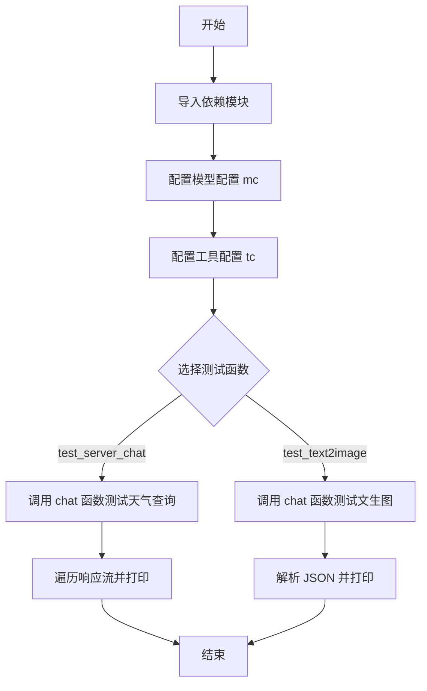
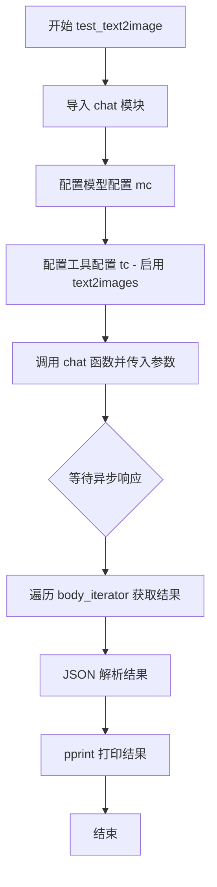

# `Langchain-Chatchat\libs\chatchat-server\tests\test_qwen_agent.py` 详细设计文档

这是一个测试 ChatChat 服务器聊天和文生图功能的脚本，通过异步调用 chat 函数测试不同模型配置（预处理、LLM、动作、后处理模型）的响应，以及文生图工具的使用。

## 整体流程



## 类结构

```
测试脚本 (无类定义)
├── test_server_chat (异步测试函数 - 聊天功能)
└── test_text2image (异步测试函数 - 文生图功能)
```

## 全局变量及字段


### `mc`
    
模型配置字典，包含 preprocess_model、llm_model、action_model、postprocess_model 配置

类型：`dict`
    


### `tc`
    
工具配置字典，包含天气查询或文生图工具配置

类型：`dict`
    


### `x`
    
遍历响应流时的临时变量

类型：`Any`
    


    

## 全局函数及方法


### `test_server_chat`

这是一个异步测试函数，用于测试聊天功能，通过调用聊天接口查询苏州的天气情况。该函数配置了多个模型（预处理模型、LLM模型、动作模型、后处理模型）的参数，并使用流式方式获取聊天响应。

参数：

- 该函数没有显式参数

返回值：`AsyncIterator`（异步迭代器），通过遍历 `body_iterator` 获取聊天响应内容，每条响应都会被 pprint 打印输出

#### 流程图

```mermaid
flowchart TD
    A[开始 test_server_chat] --> B[导入 chat 函数从 chatchat.server.chat.chat]
    B --> C[定义模型配置 mc]
    C --> C1[preprocess_model: qwen 模型, temperature=0.4, max_tokens=2048]
    C --> C2[llm_model: qwen 模型, temperature=0.9, max_tokens=4096]
    C --> C3[action_model: qwen 模型, temperature=0.01, max_tokens=4096]
    C --> C4[postprocess_model: qwen 模型, temperature=0.01, max_tokens=4096]
    C --> D[定义工具配置 tc]
    D --> E[weather_check: use=False, api-key=your key]
    E --> F[调用 chat 函数]
    F --> F1[输入: 苏州天气如何]
    F --> F2[额外参数: model_config, tool_config, conversation_id=None, history_len=-1, history=[], stream=True]
    F --> G[await chat 返回异步响应对象]
    G --> H[获取 body_iterator 异步迭代器]
    H --> I{async for 遍历 x in body_iterator}
    I -->|每次迭代| J[pprint 打印 x]
    J --> I
    I --> K[结束]
```

#### 带注释源码

```python
# 异步测试函数：test_server_chat
# 功能：测试聊天功能，查询苏州天气，输出流式响应
async def test_server_chat():
    # 从 chatchat.server.chat.chat 模块导入 chat 聊天函数
    # chat 函数是核心的聊天接口，负责处理用户的聊天请求
    from chatchat.server.chat.chat import chat

    # 模型配置字典 mc (model_config)
    # 包含四个模型配置：预处理模型、LLM模型、动作模型、后处理模型
    mc = {
        # preprocess_model: 预处理模型，用于处理用户输入
        "preprocess_model": {
            "qwen": {
                "temperature": 0.4,        # 控制生成随机性，值越小越确定性
                "max_tokens": 2048,        # 最大生成 token 数量
                "history_len": 100,        # 历史记录长度
                "prompt_name": "default",  # 使用的提示词模板名称
                "callbacks": False,        # 是否启用回调
            }
        },
        # llm_model: 主语言模型，负责生成聊天回复
        "llm_model": {
            "qwen": {
                "temperature": 0.9,        # 较高的随机性，生成更有创意的回复
                "max_tokens": 4096,        # 较长的最大生成 token 数
                "history_len": 3,          # 较短的历史记录，只保留最近3条
                "prompt_name": "default",  # 使用的提示词模板名称
                "callbacks": True,         # 启用回调
            }
        },
        # action_model: 动作模型，用于决定是否调用工具
        "action_model": {
            "qwen": {
                "temperature": 0.01,       # 极低随机性，确保决策稳定
                "max_tokens": 4096,        # 最大生成 token 数
                "prompt_name": "qwen",     # 特定提示词模板
                "callbacks": True,         # 启用回调
            }
        },
        # postprocess_model: 后处理模型，用于处理输出
        "postprocess_model": {
            "qwen": {
                "temperature": 0.01,       # 极低随机性，确保输出稳定
                "max_tokens": 4096,        # 最大生成 token 数
                "prompt_name": "default",  # 使用的提示词模板名称
                "callbacks": True,         # 启用回调
            }
        },
    }

    # 工具配置字典 tc (tool_config)
    # 配置聊天时可用的工具
    tc = {
        "weather_check": {
            "use": False,              # 天气查询工具禁用状态
            "api-key": "your key"      # API 密钥（占位符）
        }
    }

    # 调用 chat 异步函数获取聊天响应
    # 参数说明：
    #   - "苏州天气如何": 用户输入的查询内容
    #   - {}: 额外的用户消息元数据
    #   - model_config=mc: 模型配置
    #   - tool_config=tc: 工具配置
    #   - conversation_id=None: 对话ID，None 表示新建对话
    #   - history_len=-1: 历史记录长度，-1 表示不限制
    #   - history=[]: 初始历史记录为空
    #   - stream=True: 启用流式输出
    # 返回一个异步响应对象，包含 body_iterator 用于迭代获取流式内容
    chat_response = await chat(
        "苏州天气如何",
        {},
        model_config=mc,
        tool_config=tc,
        conversation_id=None,
        history_len=-1,
        history=[],
        stream=True,
    )

    # 异步迭代遍历响应体的迭代器
    # body_iterator 是一个异步生成器，逐块返回聊天响应内容
    async for x in chat_response.body_iterator:
        # 使用 pprint 格式化打印每个响应块
        # pprint 提供更易读的输出格式
        pprint(x)
```


### `test_text2image`

这是一个异步测试函数，用于测试系统的文生图（Text-to-Image）功能。该函数通过调用聊天接口，配置图像生成模型（sd-turbo），向模型发送"draw a house"指令，生成房屋图像并输出结果。

#### 参数

- 无显式参数（函数不接受任何输入参数）

#### 返回值

- `None`，该函数执行完成后无返回值，主要通过 `pprint` 打印输出结果

#### 流程图



#### 带注释源码

```python
async def test_text2image():
    """
    异步测试函数，用于测试文生图功能
    生成房屋图像并输出结果
    """
    # 导入聊天模块，获取 chat 函数
    from chatchat.server.chat.chat import chat

    # 定义模型配置字典，包含多个模型配置
    mc = {
        # 预处理模型配置
        "preprocess_model": {
            "qwen-api": {
                "temperature": 0.4,          # 控制生成随机性
                "max_tokens": 2048,          # 最大生成token数
                "history_len": 100,          # 历史记录长度
                "prompt_name": "default",    # 使用的提示词模板
                "callbacks": False,          # 是否启用回调
            }
        },
        # LLM语言模型配置
        "llm_model": {
            "qwen-api": {
                "temperature": 0.9,          # 较高的随机性
                "max_tokens": 4096,          # 较大的生成长度
                "history_len": 3,            # 较少的历史记录
                "prompt_name": "default",
                "callbacks": True,           # 启用回调
            }
        },
        # 动作模型配置
        "action_model": {
            "qwen-api": {
                "temperature": 0.01,         # 低随机性，更确定性
                "max_tokens": 4096,
                "prompt_name": "qwen",
                "callbacks": True,
            }
        },
        # 后处理模型配置
        "postprocess_model": {
            "qwen-api": {
                "temperature": 0.01,
                "max_tokens": 4096,
                "prompt_name": "default",
                "callbacks": True,
            }
        },
        # 图像生成模型配置 - 使用 Stable Diffusion Turbo
        "image_model": {"sd-turbo": {}},
    }

    # 工具配置字典，启用 text2images 工具
    tc = {"text2images": {"use": True}}

    # 调用 chat 函数发起异步请求
    # 参数说明：
    # - "draw a house": 用户输入的提示词
    # - {}: 额外的请求参数
    # - model_config=mc: 模型配置
    # - tool_config=tc: 工具配置
    # - conversation_id=None: 新会话
    # - history_len=-1: 保留所有历史
    # - history=[]: 初始历史为空
    # - stream=False: 非流式输出
    chat_result = await chat(
        "draw a house",
        {},
        model_config=mc,
        tool_config=tc,
        conversation_id=None,
        history_len=-1,
        history=[],
        stream=False,
    )

    # 异步遍历返回的 body_iterator 获取结果
    async for x in chat_result.body_iterator:
        # 将结果字符串解析为 JSON 对象
        x = json.loads(x)
        # 打印解析后的结果
        pprint(x)
```

## 关键组件


### 模型配置系统 (model_config)

定义了多模型协作配置，包含preprocess_model（预处理）、llm_model（主模型）、action_model（行动模型）、postprocess_model（后处理），支持qwen系列模型的不同参数调优。

### 工具配置系统 (tool_config)

支持可选的工具插件集成，如天气查询(weather_check)和文生图(text2images)功能，通过use字段控制启用状态。

### 异步流式响应 (Async Streaming)

使用async for遍历body_iterator实现流式输出，支持实时打印LLM生成的响应内容。

### 多模型编排 (Multi-Model Orchestration)

通过chat函数协调多个模型处理流程：预处理→LLM推理→行动执行→后处理，适合复杂对话场景。

### 对话上下文管理

支持history（历史消息）、history_len（历史长度控制）、conversation_id（会话标识）等参数，实现连续对话上下文保持。

### 图像生成功能

test_text2image函数集成sd-turbo模型，通过text2images工具将文本描述转换为图像，支持同步/异步模式。

### 测试入口

asyncio.run()驱动异步测试流程，展示了两种典型场景：纯文本聊天和文生图任务。


## 问题及建议


### 已知问题

- **致命错误**：调用了未定义的函数 `test1()`，应该是 `test_server_chat()` 或 `test_text2image()`
- **未使用的导入**：导入了 `langchain.globals`、`AgentExecutor` 和 `pprint` 但未使用
- **硬编码敏感信息**：API 密钥直接硬编码为 `"your key"`，存在安全隐患
- **缺少异常处理**：`json.loads(x)` 可能抛出 `JSONDecodeError` 异常，未做捕获
- **使用 sys.path.append**：通过修改 `sys.path` 来导入模块不是最佳实践，应使用包安装或相对导入
- **顶层代码执行**：测试代码直接放在模块顶层，未使用 `if __name__ == "__main__"` 保护，会在导入时执行
- **缺少类型注解**：函数参数和返回值缺少类型提示
- **配置硬编码**：模型配置完全硬编码在代码中，缺乏灵活性和可维护性

### 优化建议

- 修正函数调用错误，将 `asyncio.run(test1())` 改为 `asyncio.run(test_server_chat())` 或 `asyncio.run(test_text2image())`
- 清理未使用的导入语句，减少代码负担
- 使用环境变量或配置文件管理 API 密钥和敏感配置
- 为 `json.loads()` 添加 try-except 异常处理
- 使用 Poetry、pipenv 或 pyproject.toml 管理项目依赖，避免 sys.path 操作
- 将测试代码包裹在 `if __name__ == "__main__":` 块中
- 为所有函数添加类型注解（PEP 484）
- 将模型配置抽取为独立的 YAML 或 JSON 配置文件
- 为关键函数添加文档字符串说明功能、参数和返回值
- 考虑将重复的配置结构抽象为配置类或工厂函数

## 其它


### 设计目标与约束

本测试文件旨在验证ChatChat聊天系统的核心功能，包括对话生成和文生图能力。设计约束包括：必须使用异步编程模型(stream=True时需支持流式输出)；模型配置支持多模型切换(preprocess/llm/action/postprocess)；工具配置支持可插拔(weather_check、text2images)；历史记录管理支持自定义长度；对话ID可选，支持无状态会话。

### 错误处理与异常设计

代码中未显式包含错误处理逻辑，但通过pprint(x)输出调试信息。实际调用时chat函数可能抛出的异常包括：模型配置错误导致LLM初始化失败；API密钥缺失或无效；网络连接超时；工具配置错误导致工具不可用；JSON解析异常(在test_text2image中)。建议在生产环境中添加try-except块、错误码定义和用户友好的错误提示。

### 数据流与状态机

测试数据流如下：输入文本→模型配置解析→多模型链式调用(preprocess→llm→action/postprocess)→工具调用(如需要)→结果输出。状态转换包括：配置初始化状态、模型加载状态、推理执行状态、流式输出状态(或批量输出状态)。conversation_id为None时创建新会话，否则恢复历史会话。

### 外部依赖与接口契约

核心依赖包括：langchain(AgentExecutor、globals)；chatchat.server.chat.chat(chat函数)；chatchat.server.utils(get_ChatOpenAI)。chat函数接口契约：参数包括query(str)、metadata(dict)、model_config(dict)、tool_config(dict)、conversation_id(str/None)、history_len(int)、history(list)、stream(bool)；返回值为异步生成器，yield JSON格式的流式响应或批量响应。

### 配置说明

model_config采用分层配置结构，支持4类模型：preprocess_model(预处理模型，用于意图识别/路由)、llm_model(主对话模型)、action_model(行动执行模型，用于工具调用)、postprocess_model(后处理模型)。每类模型可配置多个引擎(如qwen、qwen-api)，每个引擎支持temperature、max_tokens、history_len、prompt_name、callbacks等参数。tool_config定义启用哪些工具及其配置。

### 性能考虑

test_server_chat使用stream=True流式输出，适合长响应场景；test_text2image使用stream=False批量输出，适合短响应场景。history_len=-1表示不限制历史长度，需注意内存占用。建议：大批量请求时限制history_len；流式输出可降低首字节延迟(TTFB)；模型max_tokens需合理设置以控制响应长度和推理时间。

### 安全性考虑

代码中存在硬编码API密钥风险(tc中api-key: "your key"应替换为环境变量或密钥管理系统)。敏感信息不应明文写在配置中，建议使用os.getenv或secrets模块。请求内容通过chatchat.server.chat.chat传递，需确保传输层安全(HTTPS)和身份认证机制。

### 测试策略

当前文件为集成测试，直接调用chat函数验证端到端功能。单元测试应覆盖：各模型配置解析、工具调用逻辑、历史记录管理、流式/批量输出切换。建议添加：边界条件测试(空输入、超长输入)、异常场景测试(无效配置、无效API key)、并发测试(多会话同时请求)。

### 部署要求

运行环境需要：Python 3.8+；chatchat项目依赖安装完整；LLM API服务可访问(OpenAI/Qwen等)；可选工具API(如天气查询、图像生成服务)。部署时应配置：环境变量存储API密钥；模型服务资源规划(根据并发量)；日志收集机制(用于问题排查)。


    