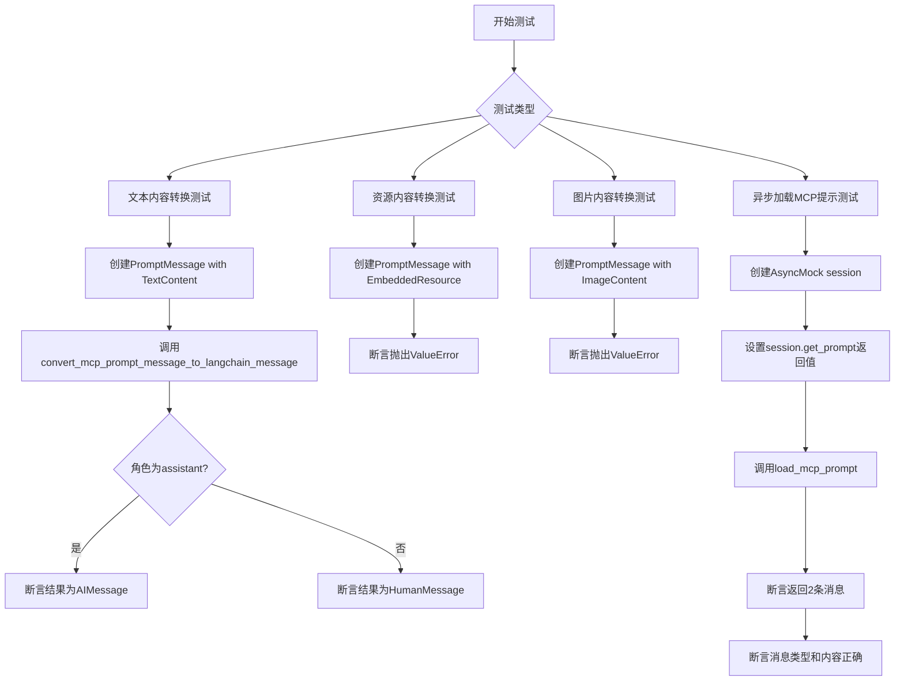
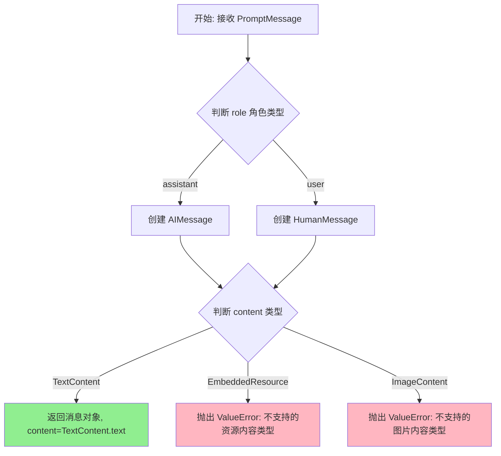
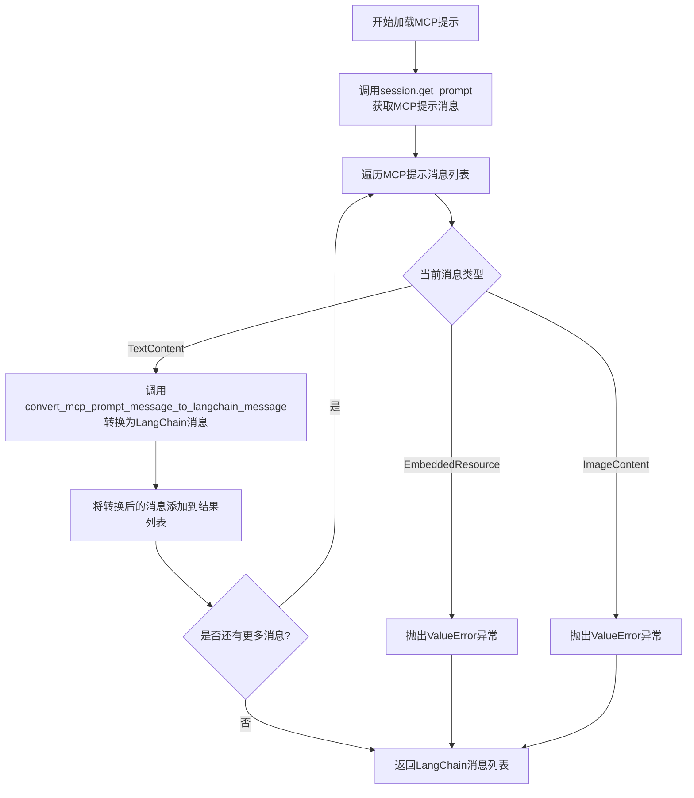

# `Langchain-Chatchat\libs\chatchat-server\tests\unit_tests\test_mcp_prompts.py` 详细设计文档

这是一个pytest测试文件，用于测试langchain_chatchat项目中MCP工具包的消息转换和提示加载功能，包括将MCP协议的PromptMessage转换为LangChain消息类型，以及异步加载MCP提示的测试。

## 整体流程



## 类结构

```
测试模块
├── test_convert_mcp_prompt_message_to_langchain_message_with_text_content
├── test_convert_mcp_prompt_message_to_langchain_message_with_resource_content
├── test_convert_mcp_prompt_message_to_langchain_message_with_image_content
└── test_load_mcp_prompt (异步测试)
```

## 全局变量及字段


### `role`
    
消息角色(assistant/user)

类型：`str`
    


### `text`
    
消息文本内容

类型：`str`
    


### `expected_cls`
    
期望的LangChain消息类型

类型：`type`
    


### `message`
    
MCP协议提示消息对象

类型：`PromptMessage`
    


### `result`
    
转换后的LangChain消息

类型：`AIMessage|HumanMessage`
    


### `session`
    
模拟的MCP会话对象

类型：`AsyncMock`
    


    

## 全局函数及方法


### `convert_mcp_prompt_message_to_langchain_message`

将 MCP（Model Context Protocol）的 PromptMessage 对象转换为 LangChain 的消息类型（HumanMessage 或 AIMessage）。

参数：

- `message`：`PromptMessage`，MCP 协议中的消息对象，包含 role 和 content 字段

返回值：`Union[HumanMessage, AIMessage]`，根据 role 字段转换后的 LangChain 消息类型

#### 流程图



#### 带注释源码

```
# 根据提供的代码，函数签名和逻辑推断如下：
def convert_mcp_prompt_message_to_langchain_message(message: PromptMessage) -> Union[HumanMessage, AIMessage]:
    """
    将 MCP PromptMessage 转换为 LangChain 消息类型
    
    参数:
        message: PromptMessage 对象，包含 role 和 content 字段
            - role: 角色标识，"assistant" 或 "user"
            - content: 内容对象，支持 TextContent/EmbeddedResource/ImageContent
    
    返回值:
        根据 role 创建的 LangChain 消息:
        - role="assistant" -> AIMessage
        - role="user" -> HumanMessage
    
    异常:
        ValueError: 当 content 类型为 EmbeddedResource 或 ImageContent 时抛出
    """
    # 根据 role 决定消息类型
    if message.role == "assistant":
        result_class = AIMessage
    elif message.role == "user":
        result_class = HumanMessage
    else:
        raise ValueError(f"Unsupported role: {message.role}")
    
    # 检查内容类型，只支持 TextContent
    if isinstance(message.content, TextContent):
        return result_class(content=message.content.text)
    elif isinstance(message.content, (EmbeddedResource, ImageContent)):
        raise ValueError(
            f"Unsupported content type: {type(message.content).__name__}. "
            "Only TextContent is supported."
        )
    else:
        raise ValueError(f"Unknown content type: {type(message.content)}")
```


### `load_mcp_prompt`

异步加载MCP提示并将其转换为LangChain消息列表。

参数：

- `session`：MCP会话对象，具有`get_prompt`异步方法，用于与MCP服务器通信获取提示
- `prompt_name`：字符串，MCP提示的名称或标识符，用于指定要加载的具体提示

返回值：`list[BaseMessage]`，LangChain消息对象列表（通常包含HumanMessage和AIMessage）

#### 流程图



#### 带注释源码

```python
@pytest.mark.asyncio
async def test_load_mcp_prompt():
    """
    测试load_mcp_prompt函数的异步加载和消息转换功能
    """
    # 创建模拟的MCP会话对象
    session = AsyncMock()
    
    # 配置模拟的get_prompt方法返回预设的MCP提示消息
    # 包含用户消息和助手消息
    session.get_prompt = AsyncMock(
        return_value=AsyncMock(
            messages=[
                # 用户消息：Hello
                PromptMessage(role="user", content=TextContent(type="text", text="Hello")),
                # 助手消息：Hi
                PromptMessage(role="assistant", content=TextContent(type="text", text="Hi")),
            ]
        )
    )
    
    # 调用load_mcp_prompt函数，传入会话和提示名称
    # prompt_name="test_prompt"指定要加载的MCP提示
    result = await load_mcp_prompt(session, "test_prompt")
    
    # 验证返回结果包含2条消息
    assert len(result) == 2
    
    # 验证第一条消息是HumanMessage且内容为Hello
    assert isinstance(result[0], HumanMessage)
    assert result[0].content == "Hello"
    
    # 验证第二条消息是AIMessage且内容为Hi
    assert isinstance(result[1], AIMessage)
    assert result[1].content == "Hi"
```

## 关键组件


### convert_mcp_prompt_message_to_langchain_message

将 MCP 协议的 PromptMessage 转换为 LangChain 的消息类型（AIMessage 或 HumanMessage），支持根据角色和内容类型进行映射转换。

### load_mcp_prompt

异步加载 MCP prompt，通过 session 获取 prompt 定义并将返回的 MCP 消息列表转换为 LangChain 消息列表。

### 消息类型映射逻辑

根据 MCP PromptMessage 的 role 字段（assistant/user）映射到对应的 LangChain 消息类，以及根据 content 类型（TextContent/EmbeddedResource/ImageContent）进行相应处理。

### 错误处理机制

针对不支持的 content 类型（EmbeddedResource、ImageContent）抛出 ValueError 异常，确保只支持纯文本内容的消息转换。


## 问题及建议


### 已知问题

- 测试用例覆盖不完整：缺少对 "system" 角色和其他可能角色的测试
- 错误处理测试缺乏具体性：`pytest.raises(ValueError)` 仅验证异常被抛出，未验证错误消息内容是否符合预期
- 异步测试场景不足：`load_mcp_prompt` 仅测试正常流程，未测试异常情况（如 session.get_prompt 抛出异常）
- 边界情况未覆盖：缺少对空文本、None 值等边界值的测试
- Mock 对象嵌套过深：`AsyncMock(return_value=AsyncMock(...))` 嵌套结构复杂，可读性较差

### 优化建议

- 增加角色类型测试覆盖，包括 "system" 角色和其他自定义角色
- 为异常测试添加错误消息验证，例如 `pytest.raises(ValueError, match="...")`
- 为 `load_mcp_prompt` 添加异常场景测试，如网络错误、超时等
- 添加边界值测试用例：空字符串文本、None 内容、特殊字符等
- 简化 Mock 对象结构，使用 `MagicMock` 或 `spec` 参数明确 Mock 对象的接口
- 为测试变量添加类型注解以提高可维护性

## 其它


### 设计目标与约束

本模块的设计目标是将MCP（Model Context Protocol）的消息格式转换为LangChain的消息格式，以便在LangChain框架中使用MCP协议传递的提示信息。主要约束包括：仅支持文本内容的消息转换，不支持资源内容和图片内容（抛出ValueError异常）；load_mcp_prompt函数为异步函数，需配合异步调用使用。

### 错误处理与异常设计

本代码中的错误处理主要通过pytest.raises来验证异常抛出。当传入EmbeddedResource或ImageContent类型的content时，convert_mcp_prompt_message_to_langchain_message函数会抛出ValueError异常，表示不支持的资源类型。这种设计明确了功能边界，告知调用者仅支持纯文本内容。异常信息需要从被测函数中获取，当前测试仅验证异常类型存在，未验证具体异常消息内容。

### 数据流与状态机

测试数据流如下：对于convert_mcp_prompt_message_to_langchain_message，输入为MCP协议的PromptMessage对象（含role和content），输出为LangChain的AIMessage或HumanMessage对象。测试覆盖两种角色（assistant和user）到对应消息类型的映射。对于load_mcp_prompt，输入为AsyncMock会话对象和提示名称，输出为LangChain消息列表。测试验证了消息列表的正确长度和消息类型的正确性。

### 外部依赖与接口契约

本模块依赖以下外部包：pytest（测试框架）、unittest.mock（AsyncMock用于模拟异步会话）、langchain_core.messages（AIMessage、HumanMessage类）、mcp.types（PromptMessage、EmbeddedResource、ImageContent、TextContent、TextResourceContents类）。接口契约方面：convert_mcp_prompt_message_to_langchain_message接受PromptMessage对象，返回AIMessage或HumanMessage对象；load_mcp_prompt接受session对象和prompt_name字符串，返回AsyncIterator[BaseMessage]（测试中验证为列表）。

### 测试覆盖矩阵

| 测试函数 | 输入类型 | 预期输出 | 边界条件 |
|---------|---------|---------|---------|
| test_convert_mcp_prompt_message_to_langchain_message_with_text_content | TextContent | 对应的LangChain消息类型 | assistant→AIMessage, user→HumanMessage |
| test_convert_mcp_prompt_message_to_langchain_message_with_resource_content | EmbeddedResource | ValueError异常 | 资源内容不支持 |
| test_convert_mcp_prompt_message_to_langchain_message_with_image_content | ImageContent | ValueError异常 | 图片内容不支持 |
| test_load_mcp_prompt | AsyncMock session | 消息列表 | 验证消息数量和类型 |

### 性能考量与资源使用

测试代码使用了AsyncMock来模拟异步session，避免了实际网络调用。测试中的session.get_prompt被设置为同步返回AsyncMock对象，这种模拟方式虽然简化了测试，但与真实异步行为存在差异。测试数据量较小（仅2条消息），未涉及大规模性能测试场景。


    