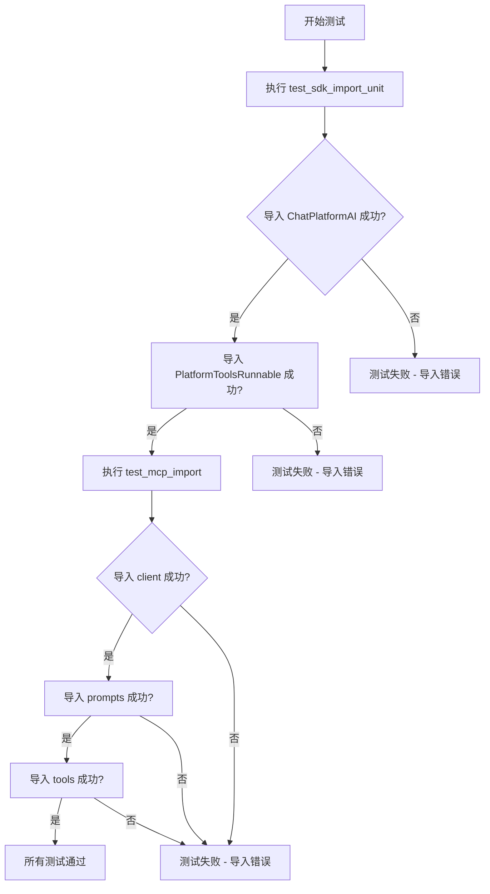
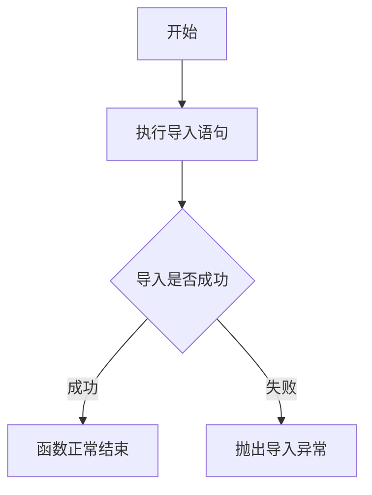
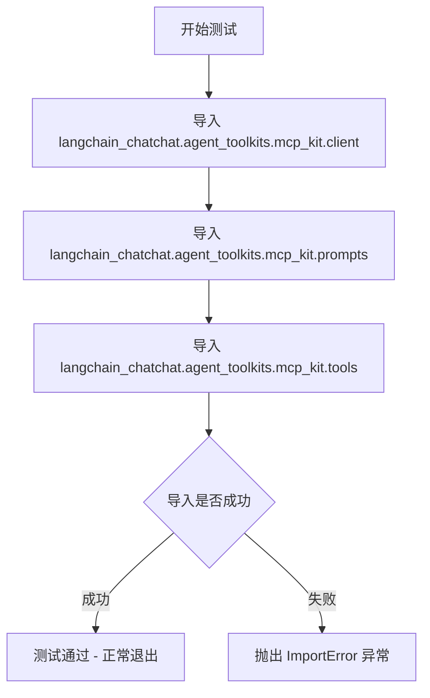

# `Langchain-Chatchat\libs\chatchat-server\tests\unit_tests\test_sdk_import.py` 详细设计文档

这是一个单元测试文件，用于验证 langchain_chatchat 核心模块（ChatPlatformAI、PlatformToolsRunnable）以及 MCP 工具包（client、prompts、tools）的导入功能是否正常，确保项目依赖关系正确配置。

## 整体流程



## 类结构

```
测试模块 (无类定义)
└── test_sdk_import_unit (测试函数)
└── test_mcp_import (测试函数)
```

## 全局变量及字段


    

## 全局函数及方法


### `test_sdk_import_unit`

该函数用于测试 langchain_chatchat 核心模块中的 ChatPlatformAI 和 PlatformToolsRunnable 类是否能正确导入，验证 SDK 依赖的可用性。

参数：无

返回值：`None`，无返回值（Python 函数默认返回 None）

#### 流程图



#### 带注释源码

```python
def test_sdk_import_unit():
    """
    测试 SDK 核心组件导入单元
    
    该函数用于验证 langchain_chatchat 包中的核心类是否可以正常导入，
    确保 ChatPlatformAI 和 PlatformToolsRunnable 这两个关键类在运行时可用。
    这是基础的冒烟测试，用于快速检测 SDK 依赖是否完整。
    """
    # 导入聊天平台 AI 核心类
    # ChatPlatformAI: 用于与聊天平台交互的 AI 接口类
    # PlatformToolsRunnable: 平台工具可运行类，用于执行平台特定工具
    from langchain_chatchat import ChatPlatformAI, PlatformToolsRunnable
```


### `test_mcp_import`

测试代码能否正确导入 MCP (Model Context Protocol) 相关的模块，验证 langchain_chatchat.agent_toolkits.mcp_kit 包中的 client、prompts、tools 模块是否可以成功导入。

参数：

- 无

返回值：`None`，该函数仅用于测试导入功能，不返回任何值

#### 流程图



#### 带注释源码

```python
def test_mcp_import() -> None:
    """Test that the code can be imported"""
    # 导入 MCP 工具包中的客户端模块
    # 用于测试该模块是否可正常导入
    from langchain_chatchat.agent_toolkits.mcp_kit import client  # noqa: F401

    # 导入 MCP 工具包中的提示词模块
    # 用于测试该模块是否可正常导入
    from langchain_chatchat.agent_toolkits.mcp_kit import prompts  # noqa: F401

    # 导入 MCP 工具包中的工具模块
    # 用于测试该模块是否可正常导入
    # noqa: F401 用于忽略 flake8 对未使用导入的警告
    from langchain_chatchat.agent_toolkits.mcp_kit import tools  # noqa: F401
```

## 关键组件


### ChatPlatformAI

从 langchain_chatchat 库导入的聊天平台 AI 类，用于处理聊天平台的对话能力。

### PlatformToolsRunnable

从 langchain_chatchat 库导入的可运行平台工具类，提供平台工具的执行能力。

### MCP 客户端组件 (client)

从 langchain_chatchat.agent_toolkits.mcp_kit 模块导入的 MCP 客户端实现，用于与 MCP 服务器通信。

### MCP 提示词组件 (prompts)

从 langchain_chatchat.agent_toolkits.mcp_kit 模块导入的提示词模板，用于构建 MCP 工具调用请求。

### MCP 工具组件 (tools)

从 langchain_chatchat.agent_toolkits.mcp_kit 模块导入的工具定义，封装了可用的 MCP 工具集合。


## 问题及建议


### 已知问题

-   **导入未实际使用**：两个测试函数分别导入了 `ChatPlatformAI`、`PlatformToolsRunnable` 和 `client`、`prompts`、`tools`，但均未实际使用这些导入的内容，仅进行了导入验证
-   **测试覆盖不足**：仅测试了模块是否能成功导入，没有验证导入的类或函数是否可用、是否具有预期的方法或属性
-   **缺少断言**：没有使用任何断言语句来验证导入结果，测试的可靠性无法保证
-   **使用 noqa 规避警告**：`# noqa: F401` 表明代码中存在导入未使用的问题，通过抑制警告而非解决根本问题
-   **测试命名不够明确**：`test_sdk_import_unit` 名称过于笼统，未清晰表达测试意图
-   **文档字符串过于简略**：第二个测试的 docstring 仅说明“测试代码可以被导入”，缺乏对测试目的的详细描述

### 优化建议

-   **添加功能性验证**：在测试中实例化导入的类或调用导入的函数，验证其基本可用性（如检查方法是否存在）
-   **添加断言语句**：使用 `assert` 验证导入的对象非空且类型正确，例如 `assert ChatPlatformAI is not None`
-   **移除 noqa 注释**：若导入的模块确实需要被测试，应在测试中实际使用它们；若不需要，应删除该导入
-   **完善测试命名**：将函数名改为更具体的名称，如 `test_import_sdk_classes` 或 `test_mcp_kit_imports`
-   **改进文档字符串**：详细描述每个测试验证的具体内容，例如“验证 ChatPlatformAI 和 PlatformToolsRunnable 可以正确导入”
-   **考虑添加异常测试**：使用 `pytest.importorskip` 或 `try-except` 处理可选依赖导入失败的情况
-   **分离导入测试与功能测试**：将导入验证和功能测试分离到不同的测试函数中，提高测试的清晰度和可维护性

## 其它


### 设计目标与约束

本测试文件的主要目标是验证 langchain_chatchat 核心模块的可导入性，确保模块结构完整、依赖关系正确。测试代码遵循最小化原则，仅验证导入能力，不涉及实际业务逻辑执行。

### 错误处理与异常设计

当前测试代码未包含显式的错误处理逻辑。由于测试函数仅执行导入操作，若导入失败将直接抛出 ImportError 或 ModuleNotFoundError，由测试框架捕获并报告。建议在未来扩展中添加异常断言，提供更清晰的失败信息。

### 数据流与状态机

本文件为模块导入测试，不涉及复杂的数据流或状态机设计。测试执行流程为：加载模块路径 → 解析 import 语句 → 验证模块可用性 → 返回测试结果。

### 外部依赖与接口契约

测试依赖以下外部组件：langchain_chatchat 主包、langchain_chatchat.agent_toolkits.mcp_kit 子模块、pytest 测试框架。接口契约要求被测试模块必须实现 ChatPlatformAI 类、PlatformToolsRunnable 类，以及 mcp_kit 模块下的 client、prompts、tools 导出项。

### 安全性考虑

测试代码仅执行只读性质的导入操作，不涉及敏感数据处理或网络请求，安全性风险较低。唯一需注意的是 from ... import 语句可能触发模块初始化代码，建议被测模块避免在顶层执行副作用操作。

### 性能要求

导入测试的执行时间应控制在秒级以内。当前测试仅涉及模块加载，无复杂计算或I/O操作，性能表现应满足快速反馈的CI/CD需求。

### 配置管理

本测试文件无外部配置依赖，测试参数通过代码内联定义。若需扩展为参数化测试，可考虑使用 pytest.mark.parametrize 装饰器。

### 测试策略

采用白盒导入测试策略，验证模块内部结构完整性。测试覆盖两个维度：主包导出项（ChatPlatformAI、PlatformToolsRunnable）和子模块导出项（mcp_kit.client、mcp_kit.prompts、mcp_kit.tools）。

### 部署要求

测试文件可作为持续集成的一部分，在构建阶段执行。部署环境需安装 langchain_chatchat 包及其所有依赖项，建议使用与生产环境一致的 Python 版本。

### 版本兼容性

测试代码使用 Python 3 类型注解（-> None），需 Python 3.7+ 环境。被测模块 langchain_chatchat 的版本需与测试代码兼容，建议在测试文档中明确支持的版本范围。

### 日志与监控

当前测试无显式日志输出。若需增强可观测性，可添加 pytest 的 caplog fixture 捕获导入过程中的警告信息，或使用 pytest --verbose 模式获取更详细的执行信息。

### 关键组件信息

- ChatPlatformAI：主包导出的大型语言模型交互接口类
- PlatformToolsRunnable：平台工具运行抽象基类
- mcp_kit.client：MCP 协议客户端实现模块
- mcp_kit.prompts：MCP 提示词模板模块
- mcp_kit.tools：MCP 工具函数集合模块

### 潜在的技术债务或优化空间

当前测试缺乏对导入失败场景的详细验证，建议增加具体的异常类型断言。此外，测试未覆盖被导入模块的实际功能验证，可考虑添加基础功能 smoke test。测试函数命名可更明确区分主包与子包测试场景。

    