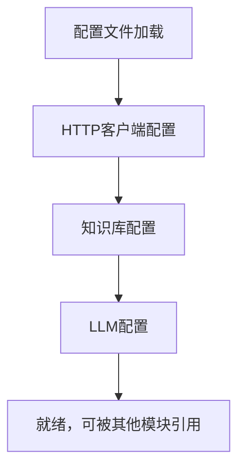

# `Langchain-Chatchat\libs\python-sdk\open_chatcaht\_constants.py` 详细设计文档

该文件为知识库和LLM（大型语言模型）应用的核心配置文件，定义了HTTP客户端的默认参数、知识库文本分割策略、向量搜索配置、大语言模型参数以及支持的向量数据库类型等，用于支撑RAG（检索增强生成）系统的初始化和运行。

## 整体流程



## 类结构

```
无类定义（纯配置模块）
所有配置以模块级常量形式定义
```

## 全局变量及字段


### `RAW_RESPONSE_HEADER`
    
用于表示原始响应头的HTTP请求头名称

类型：`str`
    


### `OVERRIDE_CAST_TO_HEADER`
    
用于覆盖类型转换的HTTP请求头名称

类型：`str`
    


### `DEFAULT_TIMEOUT`
    
默认请求超时配置，连接超时5秒，总超时10分钟

类型：`httpx.Timeout`
    


### `DEFAULT_MAX_RETRIES`
    
默认最大重试次数

类型：`int`
    


### `DEFAULT_CONNECTION_LIMITS`
    
默认连接限制，最大1000个连接，最大100个持久连接

类型：`httpx.Limits`
    


### `INITIAL_RETRY_DELAY`
    
初始重试延迟时间（秒）

类型：`float`
    


### `MAX_RETRY_DELAY`
    
最大重试延迟时间（秒）

类型：`float`
    


### `EMBEDDING_MODEL`
    
默认嵌入模型名称

类型：`str`
    


### `HTTPX_TIMEOUT`
    
HTTPX请求超时时间（秒）

类型：`float`
    


### `API_BASE_URI`
    
API服务的基础URI地址

类型：`str`
    


### `CHUNK_SIZE`
    
知识库中单段文本长度（不适用MarkdownHeaderTextSplitter）

类型：`int`
    


### `OVERLAP_SIZE`
    
知识库中相邻文本重合长度（不适用MarkdownHeaderTextSplitter）

类型：`int`
    


### `ZH_TITLE_ENHANCE`
    
是否开启中文标题加强，以及标题增强的相关配置

类型：`bool`
    


### `VECTOR_SEARCH_TOP_K`
    
知识库匹配向量数量

类型：`int`
    


### `SCORE_THRESHOLD`
    
知识库匹配相关度阈值，取值范围在0-2之间，SCORE越小相关度越高，建议设置在0.5左右

类型：`float`
    


### `VS_TYPE`
    
默认向量库/全文检索引擎类型

类型：`Literal[faiss|milvus|zilliz|pg|es|relyt|chromadb]`
    


### `TEMPERATURE`
    
LLM生成的随机性参数

类型：`float`
    


### `LLM_MODEL`
    
默认大语言模型名称

类型：`str`
    


### `MAX_TOKENS`
    
LLM生成的最大token数量

类型：`int`
    


    

## 全局函数及方法


## 关键组件


这是一段由OpenAPI规范生成的Python配置模块，主要用于配置一个知识库问答系统的HTTP客户端参数、Embedding模型参数、知识库文本处理参数（分块、重叠、标题增强）、向量搜索参数（top_k、阈值、向量库类型）以及大语言模型参数（模型、温度、最大token数）。

### 文件运行流程

该模块为配置定义文件，在项目启动时被导入并读取其定义的配置常量，供其他模块如HTTP客户端类、Embedding服务类、向量检索类和LLM调用类使用。

### 变量详细信息

**HTTP客户端配置组：**
- `DEFAULT_TIMEOUT`：httpx.Timeout类型，HTTP请求超时配置，连接超时5秒，整体超时10分钟
- `DEFAULT_MAX_RETRIES`：int类型，最大重试次数为2次
- `DEFAULT_CONNECTION_LIMITS`：httpx.Limits类型，最大连接数1000，最大Keep-Alive连接数100

**重试机制配置组：**
- `INITIAL_RETRY_DELAY`：float类型，初始重试延迟0.5秒
- `MAX_RETRY_DELAY`：float类型，最大重试延迟8.0秒

**通用配置组：**
- `RAW_RESPONSE_HEADER`：str类型，自定义响应头名称
- `OVERRIDE_CAST_TO_HEADER`：str类型，覆盖类型转换的头部标识
- `EMBEDDING_MODEL`：str类型，Embedding模型名称为"bge-large-zh-v1.5"
- `HTTPX_TIMEOUT`：float类型，HTTPX超时10秒
- `API_BASE_URI`：str类型，API基础URI为"http://127.0.0.1:7861/"

**知识库配置组：**
- `CHUNK_SIZE`：int类型，知识库单段文本长度250字符
- `OVERLAP_SIZE`：int类型，知识库相邻文本重合长度50字符
- `ZH_TITLE_ENHANCE`：bool类型，是否开启中文标题加强，默认关闭
- `VECTOR_SEARCH_TOP_K`：int类型，知识库匹配向量数量3
- `SCORE_THRESHOLD`：float类型，知识库匹配相关度阈值0.4
- `VS_TYPE`：Literal类型，默认向量库类型为"faiss"，可选包括milvus、zilliz、pg、es、relyt、chromadb

**LLM配置组：**
- `TEMPERATURE`：float类型，LLM采样温度0.7
- `LLM_MODEL`：str类型，LLM模型名称为"chatglm-6b"
- `MAX_TOKENS`：int类型，最大生成token数2048

### 关键组件信息

### HTTP客户端配置组件
负责配置HTTP请求的超时时间、连接池限制和重试策略，是整个系统与外部API通信的基础配置模块。

### 知识库文本处理组件
负责配置知识库文档的分块策略，包括单段长度250字符、相邻段落重叠50字符、中文标题增强开关等参数，直接影响后续向量检索的效果。

### 向量搜索配置组件
负责配置向量检索的相关参数，包括返回前3个最相似结果、相似度阈值0.4（分数越小相关度越高）、向量库类型选择（faiss/milvus/zilliz/pg/es/relyt/chromadb），决定了检索的精度和范围。

### LLM对话配置组件
负责配置大语言模型的生成参数，包括使用chatglm-6b模型、温度0.7、最大生成2048个token，控制生成文本的多样性和长度。

### 技术债务与优化空间

1. **配置重复问题**：`VECTOR_SEARCH_TOP_K`变量注释中提到"TODO: 与 tool 配置项重复"，存在配置项冗余，建议统一管理或确认其必要性
2. **硬编码配置**：所有配置均为硬编码值，缺乏从环境变量或配置文件读取的机制，不利于多环境部署
3. **魔法数字**：超时时间、重试延迟、阈值等数值缺乏注释说明其选择依据，增加后续维护难度

### 其它项目

**设计目标与约束：** 通过统一配置文件实现系统参数的集中管理，支持本地部署（127.0.0.1:7861）的知识库问答场景

**错误处理与异常设计：** 配置文件本身不涉及错误处理，但依赖httpx库的重试机制处理网络异常，MAX_RETRY_DELAY=8.0提供了指数退避的上限

**数据流与状态机：** 配置模块为只读数据提供者，被HTTP客户端、Embedding服务、向量检索、LLM调用等模块消费，无状态机设计

**外部依赖与接口契约：** 依赖httpx库提供HTTP客户端能力，依赖OpenAPI规范生成的接口定义，VS_TYPE的Literal类型约束了可选的向量库实现


## 问题及建议


### 已知问题

- **硬编码配置值**：API_BASE_URI、L LM_MODEL、EMBEDDING_MODEL等核心配置直接硬编码，缺乏通过环境变量或配置文件注入的机制，不利于多环境部署
- **配置重复未解决**：TODO注释标记的`VECTOR_SEARCH_TOP_K`与tool配置项重复，表明配置管理存在冗余和不一致
- **类型注解不完整**：`LLM_MODEL`和`MAX_TOKENS`缺少类型注解，`API_BASE_URI`缺少Literal类型约束
- **Magic Number缺乏说明**：`CHUNK_SIZE=250`、`OVERLAP_SIZE=50`、`SCORE_THRESHOLD=0.4`等数值无注释说明取值依据和业务含义
- **默认值可能不适配不同场景**：`DEFAULT_TIMEOUT=600秒`（10分钟）较长，`DEFAULT_MAX_RETRIES=2`固定，可能不适合所有API调用场景

### 优化建议

- 引入配置管理模块（如pydantic-settings或python-dotenv），将环境相关的配置通过环境变量注入
- 统一配置管理，解决VECTOR_SEARCH_TOP_K重复定义问题，确保配置单一来源
- 补充类型注解，使用Literal约束VS_TYPE等枚举值，添加TypedDict或dataclass管理配置组
- 为关键数值添加文档字符串，说明业务含义和调整建议
- 将超时、重试等网络参数设计为可配置项，支持不同API的差异化配置需求

## 其它


### 设计目标与约束

本代码作为OpenAPI规范的Python客户端SDK，旨在为本地部署的LLM服务（基于ChatGLM-6B）提供统一的HTTP接口调用能力。设计目标包括：提供简洁的API调用方式、配置化管理参数、支持知识库检索功能。主要约束包括：依赖httpx库进行HTTP通信、仅支持同步调用模式、配置参数存在冗余（如VECTOR_SEARCH_TOP_K与tool配置重复）。

### 错误处理与异常设计

代码未显式定义异常处理机制，依赖httpx库内置的异常传播。当前设计采用默认超时配置（600秒连接超时、10分钟整体超时），当API调用超时时将抛出httpx.TimeoutException。网络连接失败将抛出httpx.ConnectError。缺少重试机制的显式异常捕获和自定义业务异常定义，建议在实际调用处添加try-except块处理。

### 数据流与状态机

数据流主要分为两类：
1. **配置流**：全局变量定义→HTTPX客户端初始化→API请求发送
2. **请求流**：参数配置→httpx.Client构建→HTTP请求→响应处理

状态机方面较为简单，无复杂状态转换。主要状态为：配置加载状态（初始化全局变量）、客户端就绪状态（httpx.Client实例化）、请求发送状态、响应接收状态。

### 外部依赖与接口契约

**外部依赖**：
- `httpx` (>=0.24.0)：HTTP客户端库，提供同步/异步HTTP请求能力
- `typing`：Python标准库，提供类型注解支持

**接口契约**：
- API基础URI：`http://127.0.0.1:7861/`
- 通信协议：HTTP/HTTPS
- 请求格式：JSON
- 响应格式：JSON（由API端点决定）
- 超时策略：连接超时5秒，整体超时600秒
- 重试机制：默认最多重试2次，初始延迟0.5秒，最大延迟8秒

### 配置管理设计

采用全局变量集中配置模式，便于统一管理和修改。配置项分为三类：
1. **HTTP客户端配置**：DEFAULT_TIMEOUT、DEFAULT_MAX_RETRIES、DEFAULT_CONNECTION_LIMITS
2. **知识库配置**：CHUNK_SIZE、OVERLAP_SIZE、ZH_TITLE_ENHANCE、VECTOR_SEARCH_TOP_K、SCORE_THRESHOLD、VS_TYPE
3. **LLM配置**：TEMPERATURE、LLM_MODEL、MAX_TOKENS、EMBEDDING_MODEL

### 性能考量

连接池配置为最大1000并发连接、100个keepalive连接。超时设置为10分钟，适用于长时LLM推理任务。建议在实际使用中根据服务器性能调整连接限制参数，避免资源耗尽。

### 版本与兼容性

代码注释表明由Stainless从OpenAPI规范自动生成，版本信息需参考原始OpenAPI文档。当前代码仅支持Python 3.8+（依赖typing.Literal特性）。httpx版本建议>=0.24.0以确保兼容性。

    