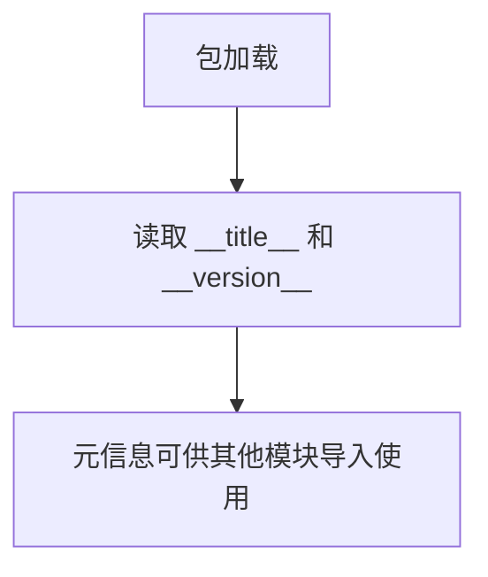

# `Langchain-Chatchat\libs\python-sdk\open_chatcaht\_version.py` 详细设计文档

这是一个 Python 包的元信息定义文件，仅包含包的名称（__title__）和版本号（__version__），用于标识和版本化管理 open_chatcaht 包。

## 整体流程



## 类结构

```
无类层次结构 - 仅包含模块级变量定义
```

## 全局变量及字段


### `__title__`
    
包的名称标识

类型：`str`
    


### `__version__`
    
包的版本号

类型：`str`
    


    

## 全局函数及方法


## 关键组件


### 包元数据定义

该代码片段仅包含Python包的元数据定义，声明了包的名称为"open_chatcaht"和版本号为"1.35.13"，通常用于包的导入识别和版本管理。

### 全局变量

| 名称 | 类型 | 描述 |
|------|------|------|
| __title__ | str | 包名称标识符 |
| __version__ | str | 包版本号 |

### 技术债务或优化空间

1. 包名称拼写错误："open_chatcaht" 应为 "open_chatchat"
2. 缺少功能性代码：该文件仅为元数据定义，未实现任何核心功能
3. 缺少必要的包元数据：如描述、作者、依赖等信息

### 设计目标与约束

- **设计目标**: 定义Python包的基本元信息
- **约束**: 仅为占位符性质，不包含实际业务逻辑实现

### 结论

此代码片段不是功能实现代码，无法从中识别张量索引、惰性加载、反量化支持或量化策略等关键组件。该代码需要与实际功能实现代码配合使用才能形成完整的项目。


## 问题及建议


### 已知问题

-   包名拼写错误：`open_chatcaht` 疑似应为 `open_chat` 或 `open_chatbot`，可能导致包搜索和引用时的混淆
-   元数据信息严重不足：仅包含 `__title__` 和 `__version__`，缺少常见的标准元数据字段，如 `__author__`、`__description__`、`__license__`、`__email__`、`__url__` 等
-   缺少依赖声明：未声明项目依赖、Python版本要求（`__python_requires__`）等关键信息
-   非标准元数据命名：Python社区普遍使用 `__name__` 而非 `__title__`，不符合 PEP 8 和行业惯例
-   版本号格式不明确：未区分开发版与正式版，版本策略不清晰（如 1.35.13 是否为语义化版本）

### 优化建议

-   修正包名拼写，确保名称准确且具有描述性
-   补充完整的标准元数据字段，参考 PEP 318 和主流打包规范（setuptools、pyproject.toml）
-   显式声明 Python 版本支持范围、依赖项及入口点，提升包的可发现性和可用性
-   考虑迁移至 `pyproject.toml` 或 `setup.cfg` 等现代化打包配置方案
-   明确版本发布策略，建议采用语义化版本（SemVer）规范


## 其它


### 设计目标与约束

本模块作为open_chatcaht包的元数据文件，仅用于定义包的名称和版本信息，不包含任何业务逻辑或功能实现。设计约束包括：Python 3.x兼容、遵循PEP 8命名规范（使用dunder属性）、无外部依赖、极简代码结构。

### 错误处理与异常设计

本模块不涉及错误处理与异常设计，因为仅包含常量定义，无任何函数调用或逻辑执行，不存在运行时错误风险。如需扩展错误处理，应在调用方模块中实现。

### 数据流与状态机

不适用。本模块为静态元数据定义模块，不涉及数据流处理或状态机逻辑。

### 外部依赖与接口契约

无外部依赖。本模块导出两个模块级常量：__title__（str类型，包名称）和__version__（str类型，版本号）。接口契约为标准的Python包元数据规范，调用方可通过import导入这两个变量使用。

### 潜在的技术债务或优化空间

1. 包名拼写问题：__title__值为"open_chatcaht"，其中"chatcaht"疑似拼写错误（应为"chatbot"），建议确认为设计意图或修正为正确拼写
2. 缺少元数据完整性：可考虑添加__author__、__description__、__license__等标准Python包元数据字段
3. 无类型注解：建议添加类型注解以提升代码可维护性和IDE支持

### 关键组件信息

本模块无类结构，仅包含两个模块级常量变量：
- __title__：字符串类型，表示包的名称
- __version__：字符串类型，表示包的版本号

### 类的详细信息

不适用。本模块无类定义。

### 全局变量和全局函数信息

__title__：类型str，用于标识包的名称，值为"open_chatcaht"
__version__：类型str，用于标识包的版本，值为"1.35.13"

### 文件的整体运行流程

本模块为入口文件，加载时仅执行变量赋值操作，无运行时流程。导入时Python解释器执行赋值语句，将字符串值绑定到模块属性，调用方可通过模块对象访问__title__和__version__属性。

### 一段话描述

open_chatcaht是一个Python包的元数据定义模块，通过定义__title__和__version__两个标准包属性，提供包的名称和版本信息，属于包的基础设施代码，不包含业务逻辑实现。

    