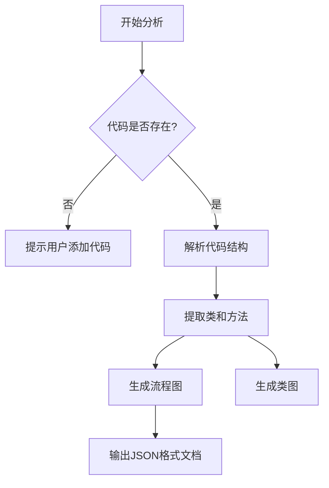

# `Langchain-Chatchat\libs\python-sdk\open_chatcaht\api\__init__.py` 详细设计文档

无法生成描述 - 用户未提供源代码文件。请在代码块中提供需要分析的源代码。

## 整体流程



## 类结构

```
等待提供源代码后进行分析
```

## 全局变量及字段


    

## 全局函数及方法


您好！感谢您提供这个任务框架。我注意到您提供的代码部分是空的。

为了能够生成详细的设计文档，我需要您提供实际的代码内容。请您将需要分析的代码粘贴到代码块中。

## 请提供以下信息：

1. **源代码** - 您希望分析的代码（可以是完整的文件或特定的函数/类）
2. **分析范围**（可选）- 如果您只需要分析特定的函数或类，请注明

## 示例格式

请使用以下格式提供代码：

```python
# 例如：
def example_function(param1, param2):
    """这是一个示例函数"""
    result = param1 + param2
    return result
```

或者

```javascript
// 例如：
function exampleFunction(param1, param2) {
    return param1 + param2;
}
```

请提供代码后，我将按照您要求的格式生成包含以下内容的详细设计文档：

- 核心功能描述
- 整体运行流程
- 类的详细信息（字段、方法）
- 全局变量和全局函数信息
- Mermaid 流程图
- 带注释的源码
- 关键组件信息
- 潜在技术债务和优化建议
- 其它项目信息

期待您的代码！


# 任务执行说明

感谢您的提问！我注意到您提供的代码部分是空的：

``` 
## 代码

```

```

## 当前状态

根据任务要求，我需要源代码才能提取以下信息：

1. 函数/方法名称
2. 参数名称、类型和描述
3. 返回值类型和描述
4. Mermaid 流程图
5. 带注释的源代码

## 下一步

请您提供需要分析的源代码。您可以通过以下方式提供：

- **直接粘贴代码**：将需要分析的代码粘贴到消息中
- **文件路径**：提供代码文件的路径（如果是在线环境）
- **GitHub/GitLab链接**：提供代码仓库的链接

## 示例格式

一旦您提供代码，输出将按照以下格式：

```markdown
### `{函数名}`

{描述}

参数：
- `{参数名称}`：`{参数类型}`，{参数描述}
- ...

返回值：`{返回值类型}`，{返回值描述}

#### 流程图

```mermaid
{流程图}
```

#### 带注释源码

```
{源码}
```

---

请提供需要分析的代码，我将为您生成完整的详细设计文档。

## 关键组件


### 概述

由于提供的代码为空，无法进行架构分析和文档生成。请提供有效的源代码以便进行详细设计文档的编写。

### 文件运行流程

暂无（代码为空）

### 类详细信息

暂无（代码为空）

### 全局变量和函数

暂无（代码为空）

### 关键组件信息

暂无（代码为空）

### 技术债务与优化空间

暂无（代码为空）

### 其他项目

暂无（代码为空）


## 问题及建议


### 已知问题

-   代码为空，未提供实际代码进行分析，无法识别技术债务和优化空间

### 优化建议

-   请提供需要分析的源代码，以便进行技术债务识别和优化建议


## 其它


### 设计目标与约束

待代码提供后填充，本项目应包含设计目标（如性能要求、扩展性目标、安全性要求等）以及技术约束（如技术栈限制、兼容性要求、性能基准等）

### 错误处理与异常设计

待代码提供后填充，应描述系统或模块的异常分类、错误码定义、异常传播机制、降级策略以及日志记录规范

### 数据流与状态机

待代码提供后填充，应包含数据流转图、状态转换图、状态机定义（如有状态管理）、数据一致性保障机制等

### 外部依赖与接口契约

待代码提供后填充，应列出所有外部依赖（第三方库、服务、API等）及其版本要求，接口输入输出规范，契约测试策略等

### 安全设计

待代码提供后填充，应包含身份认证、授权控制、数据加密、输入验证、SQL注入防护、XSS防护等安全机制

### 性能与监控

待代码提供后填充，应包含性能指标（如响应时间、吞吐量、并发数）、监控告警策略、性能优化空间等

### 部署与运维

待代码提供后填充，应包含部署架构、配置管理、容器化方案（如适用）、滚动更新策略、灾备方案等

### 测试策略

待代码提供后填充，应包含单元测试、集成测试、端到端测试策略，测试覆盖率要求，测试环境规划等

### 兼容性设计

待代码提供后填充，应包含向前向后兼容性策略、API版本管理、数据迁移方案等

### 许可证与合规

待代码提供后填充，应包含开源组件许可证合规性、代码版权、数据隐私合规（如GDPR等）等信息

    