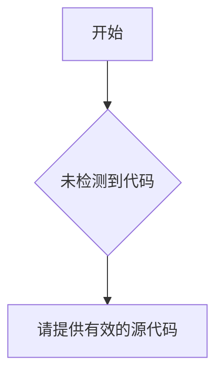

# `Langchain-Chatchat\libs\python-sdk\open_chatcaht\api\chat\__init__.py` 详细设计文档

未提供源代码，无法进行分析

## 整体流程



## 类结构

```

```

## 全局变量及字段


    

## 全局函数及方法


## 关键组件


### 关键组件信息

无（代码为空，无法识别关键组件）

### 潜在的技术债务或优化空间

无（代码为空，无法分析技术债务）

### 其它项目

无（代码为空，无法提供分析）


## 问题及建议


### 已知问题

-   未提供待分析的代码，无法进行技术债务和优化空间的分析

### 优化建议

-   请提供待分析的源代码，以便进行详细的技术债务识别和优化建议


## 其它


### 一段话描述

由于未提供具体代码，此文档为空白模板，待补充实际代码后进行详细分析。

### 文件的整体运行流程

由于未提供具体代码，无法确定运行流程，待补充实际代码后进行详细分析。

### 类的详细信息

由于未提供具体代码，无法提供类的详细信息，待补充实际代码后进行详细分析。

### 类字段

由于未提供具体代码，无法提供类字段信息，待补充实际代码后进行详细分析。

### 类方法

由于未提供具体代码，无法提供类方法信息，待补充实际代码后进行详细分析。

### 全局变量

由于未提供具体代码，无法提供全局变量信息，待补充实际代码后进行详细分析。

### 全局函数

由于未提供具体代码，无法提供全局函数信息，待补充实际代码后进行详细分析。

### 关键组件信息

由于未提供具体代码，无法提供关键组件信息，待补充实际代码后进行详细分析。

### 潜在的技术债务或优化空间

由于未提供具体代码，无法提供技术债务或优化建议，待补充实际代码后进行详细分析。

### 设计目标与约束

由于未提供具体代码，无法确定设计目标与约束，待补充实际代码后进行详细分析。

### 错误处理与异常设计

由于未提供具体代码，无法确定错误处理与异常设计方式，待补充实际代码后进行详细分析。

### 数据流与状态机

由于未提供具体代码，无法确定数据流与状态机设计，待补充实际代码后进行详细分析。

### 外部依赖与接口契约

由于未提供具体代码，无法确定外部依赖与接口契约，待补充实际代码后进行详细分析。

### 安全性考虑

由于未提供具体代码，无法确定安全性考虑因素，待补充实际代码后进行详细分析。

### 性能要求与指标

由于未提供具体代码，无法确定性能要求与指标，待补充实际代码后进行详细分析。

### 兼容性设计

由于未提供具体代码，无法确定兼容性设计要求，待补充实际代码后进行详细分析。

### 测试策略

由于未提供具体代码，无法确定测试策略，待补充实际代码后进行详细分析。

### 部署与运维注意事项

由于未提供具体代码，无法确定部署与运维注意事项，待补充实际代码后进行详细分析。

### 版本历史与变更记录

由于未提供具体代码，无法提供版本历史与变更记录，待补充实际代码后进行详细分析。


    