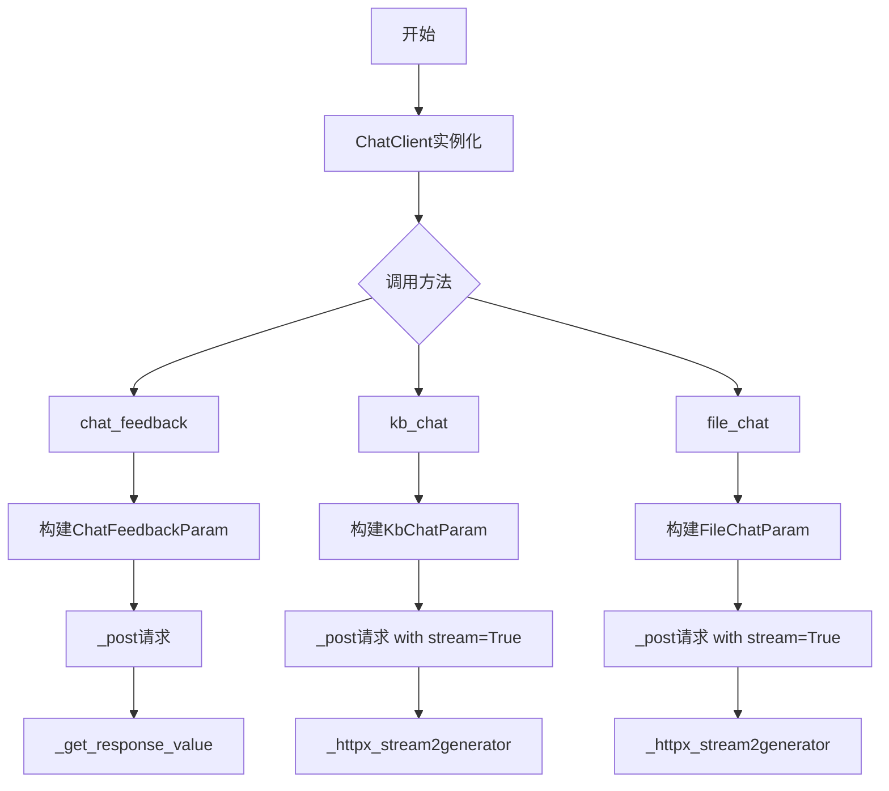
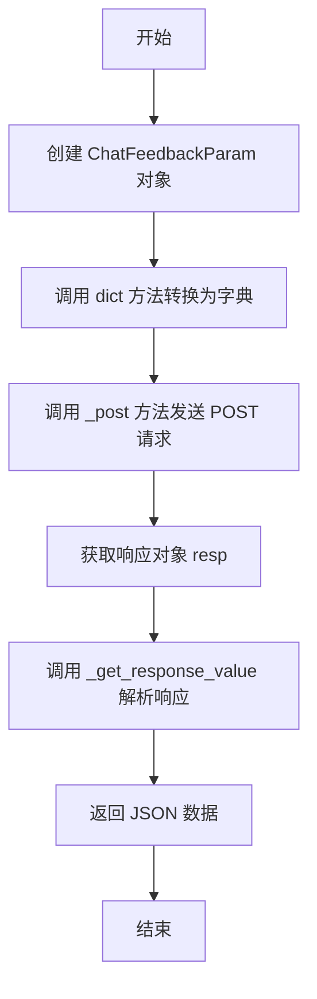
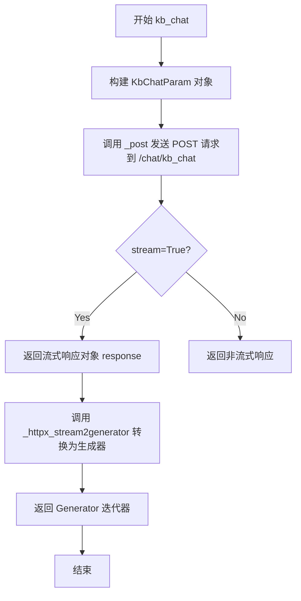
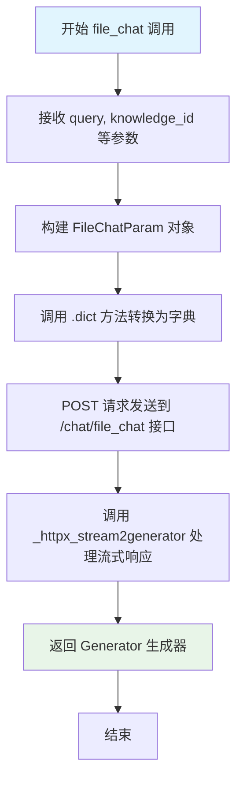

# `Langchain-Chatchat\libs\python-sdk\open_chatcaht\api\chat\chat_client.py` 详细设计文档

ChatClient类是一个聊天客户端，继承自ApiClient，提供了基于知识库(kb)的聊天、基于文件的聊天以及聊天反馈三大核心功能，支持流式响应和多种参数配置。

## 整体流程



## 类结构

```
ApiClient (基类)
└── ChatClient (继承自ApiClient)
```

## 全局变量及字段


### `API_URI_CHAT_FEEDBACK`
    
聊天反馈功能的API端点路径

类型：`str`
    


### `API_URI_FILE_CHAT`
    
文件聊天功能的API端点路径

类型：`str`
    


### `API_URI_KB_CHAT`
    
知识库聊天功能的API端点路径

类型：`str`
    


    

## 全局函数及方法


### `ChatClient.chat_feedback`

该方法用于向聊天服务提交用户对特定消息的反馈评分，允许用户对聊天消息进行满意度评价并附带评价原因。

参数：

- `self`：`ChatClient`，ChatClient 实例本身，表示调用该方法的客户端对象
- `message_id`：`str`，消息的唯一标识符，用于指定需要反馈的具体聊天消息
- `score`：`int`，评分分数，默认值为 100，表示用户对消息的满意度评分
- `reason`：`str`，评分原因或反馈说明，默认值为空字符串，用于记录用户给出该评分的具体原因

返回值：`Any`（具体类型取决于 `_get_response_value` 的返回），返回从 API 响应中提取的 JSON 数据，通常表示反馈提交是否成功

#### 流程图



#### 带注释源码

```python
def chat_feedback(self,
                  message_id: str,
                  score: int = 100,
                  reason: str = ""):
    """
    向聊天服务提交消息反馈
    
    参数:
        message_id: 消息的唯一标识符
        score: 评分分数，默认100分
        reason: 评分原因，可选
    
    返回:
        从API响应中提取的JSON数据
    """
    # 使用传入的参数创建 ChatFeedbackParam 对象
    # ChatFeedbackParam 是一个 Pydantic 模型，用于验证和序列化反馈参数
    data = ChatFeedbackParam(
        message_id=message_id,
        score=score,
        reason=reason,
    ).dict()  # 转换为字典格式，用于 JSON 序列化
    
    # 调用父类 ApiClient 的 _post 方法
    # 向 API_URI_CHAT_FEEDBACK 端点发送 POST 请求
    # 请求体为 JSON 格式的 data 字典
    resp = self._post(API_URI_CHAT_FEEDBACK, json=data)
    
    # 调用 _get_response_value 方法解析响应
    # 参数 as_json=True 表示将响应解析为 JSON 格式
    # 返回提取后的响应数据
    return self._get_response_value(resp, as_json=True)
```


### `ChatClient.kb_chat`

该方法用于与知识库进行聊天交互，接收用户查询内容，根据指定的知识库模式（本地知识库、临时知识库或搜索引擎）和配置参数，向后端API发送请求并返回流式响应。

参数：

- `query`：`str`，用户输入的查询内容
- `mode`：`Literal["local_kb", "temp_kb", "search_engine"]`，知识库模式，默认为 "local_kb"
- `kb_name`：`str`，知识库名称，默认为空字符串
- `top_k`：`int`，向量搜索返回的Top K结果数量，默认为 VECTOR_SEARCH_TOP_K
- `score_threshold`：`float`，相似度分数阈值，低于该阈值的结果将被过滤，默认为 SCORE_THRESHOLD
- `history`：`List[Union[ChatMessage, dict]]`，会话历史记录列表，默认为空列表
- `stream`：`bool`，是否使用流式响应，默认为 True
- `model`：`str`，使用的LLM模型名称，默认为 LLM_MODEL
- `temperature`：`float`，LLM生成内容的温度参数，控制随机性，默认为 TEMPERATURE
- `max_tokens`：`Optional[int]`，
- `prompt_name`：`str`，使用的提示词模板名称，默认为 "default"
- `return_direct`：`bool`，是否直接返回知识库检索结果而不经过LLM处理，默认为 False

返回值：`Generator`，返回流式响应生成的迭代器（Generator）

#### 流程图



#### 带注释源码

```python
def kb_chat(self,
            query: str,
            mode: Literal["local_kb", "temp_kb", "search_engine"] = "local_kb",
            kb_name: str = "",
            top_k: int = VECTOR_SEARCH_TOP_K,
            score_threshold: float = SCORE_THRESHOLD,
            history: List[Union[ChatMessage, dict]] = [],
            stream: bool = True,
            model: str = LLM_MODEL,
            temperature: float = TEMPERATURE,
            max_tokens: Optional[int] = MAX_TOKENS,
            prompt_name: str = "default",
            return_direct: bool = False,
            ):
    """
    与知识库进行聊天交互
    
    参数:
        query: 用户查询内容
        mode: 知识库模式，支持 local_kb/temp_kb/search_engine
        kb_name: 知识库名称
        top_k: 向量搜索返回的Top K结果数
        score_threshold: 相似度分数阈值
        history: 会话历史记录
        stream: 是否使用流式响应
        model: 使用的LLM模型
        temperature: LLM温度参数
        max_tokens: 最大生成token数
        prompt_name: 提示词模板名称
        return_direct: 是否直接返回检索结果
    """
    # 步骤1: 构建知识库聊天参数对象
    kb_chat_param = KbChatParam(
        query=query,
        mode=mode,
        kb_name=kb_name,
        top_k=top_k,
        score_threshold=score_threshold,
        history=history,
        stream=stream,
        model=model,
        temperature=temperature,
        max_tokens=max_tokens,
        prompt_name=prompt_name,
        return_direct=return_direct,
    ).dict()
    
    # 步骤2: 发送POST请求到知识库聊天API端点
    # 使用 stream=True 参数以支持流式响应
    response = self._post(API_URI_KB_CHAT, json=kb_chat_param, stream=True)
    
    # 步骤3: 将HTTP流式响应转换为Python生成器
    # as_json=True 表示将响应内容解析为JSON格式
    return self._httpx_stream2generator(response, as_json=True)
```


### `ChatClient.file_chat`

该方法用于与指定知识库（Knowledge Base）中的文件进行对话交互。用户提交查询问题，系统根据知识库ID检索相关文档内容，结合历史对话记录和指定的LLM模型生成回复，支持流式响应以实现实时输出。

#### 参数

- `query`：`str`，用户输入的查询问题或对话内容
- `knowledge_id`：`str`，目标知识库的唯一标识ID，用于定位待查询的知识库
- `top_k`：`int`，默认为 `VECTOR_SEARCH_TOP_K`，向量搜索时返回的最相似结果数量
- `score_threshold`：`float`，默认为 `SCORE_THRESHOLD`，检索结果的相似度分数阈值，低于该值的结果将被过滤
- `history`：`List[Union[dict, ChatMessage]]`，默认为空列表 `[]`，对话历史记录，包含之前的用户提问和AI回复
- `stream`：`bool`，默认为 `True`，是否启用流式响应模式，True 时返回生成器逐块输出
- `model_name`：`str`，默认为 `LLM_MODEL`，用于生成回答的LLM模型名称
- `temperature`：`float`，默认为 `0.01`，LLM生成文本的随机性参数，值越小生成结果越确定性
- `max_tokens`：`Optional[int]`，默认为 `MAX_TOKENS`，生成回答的最大token数量限制
- `prompt_name`：`str`，默认为 `"default"`，使用的提示词模板名称

#### 返回值

`Generator`，流式响应生成器，用于迭代获取AI生成的回复内容，每个元素为JSON格式的响应块

#### 流程图



#### 带注释源码

```python
def file_chat(self,
              query: str,                          # 用户查询问题
              knowledge_id: str,                   # 知识库ID
              top_k: int = VECTOR_SEARCH_TOP_K,    # 向量搜索top_k
              score_threshold: float = SCORE_THRESHOLD,  # 相似度阈值
              history: List[Union[dict, ChatMessage]] = [],  # 对话历史
              stream: bool = True,                 # 是否流式响应
              model_name: str = LLM_MODEL,         # LLM模型名称
              temperature: float = 0.01,           # 生成温度参数
              max_tokens: Optional[int] = MAX_TOKENS,  # 最大token数
              prompt_name: str = "default",        # 提示词模板名称
              ):
    """
    与知识库文件进行对话
    :param query: 用户问题
    :param knowledge_id: 知识库ID
    :param top_k: 检索返回的结果数
    :param score_threshold: 相似度分数阈值
    :param history: 对话历史
    :param stream: 是否流式输出
    :param model_name: 使用的LLM模型
    :param temperature: 温度参数
    :param max_tokens: 最大生成token数
    :param prompt_name: 提示词模板名
    :return: 流式响应生成器
    """
    # 步骤1: 创建请求参数对象 FileChatParam
    file_chat_param = FileChatParam(
        query=query,
        knowledge_id=knowledge_id,
        top_k=top_k,
        score_threshold=score_threshold,
        history=history,
        stream=stream,
        model_name=model_name,
        temperature=temperature,
        max_tokens=max_tokens,
        prompt_name=prompt_name,
    ).dict()  # 转换为字典格式
    
    # 步骤2: 发送POST请求到文件聊天接口
    # stream=True 启用HTTP流式传输
    response = self._post(API_URI_FILE_CHAT, json=file_chat_param, stream=True)
    
    # 步骤3: 将httpx流式响应转换为Python生成器
    # as_json=True 表明返回JSON格式数据
    return self._httpx_stream2generator(response, as_json=True)
```

## 关键组件


### ChatClient 类

继承自 ApiClient 的聊天客户端类，提供知识库聊天、文件聊天和聊天反馈功能。

### chat_feedback 方法

用于向聊天服务发送用户反馈，支持评分和反馈原因。

### kb_chat 方法

实现基于知识库的对话功能，支持流式响应，可选择本地知识库、临时知识库或搜索引擎模式。

### file_chat 方法

实现基于文件的对话功能，支持指定知识库ID进行对话，采用流式响应。

### API 端点常量

定义聊天相关 API 端点 URI，包括反馈、文件聊天和知识库聊天三个端点。

### 参数验证模型

使用 Pydantic 模型（KbChatParam、FileChatParam、ChatFeedbackParam）进行参数验证和数据序列化。


## 问题及建议


### 已知问题

-   **可变默认参数（Mutable Default Argument）**：kb_chat 和 file_chat 方法中的 `history` 参数使用 `[]` 作为默认值，这在Python中会导致所有调用共享同一列表对象，造成潜在的状态泄漏问题
-   **参数命名不一致**：kb_chat 方法使用 `model` 参数，而 file_chat 方法使用 `model_name` 参数，命名规范不统一
-   **硬编码值**：file_chat 方法中 `temperature=0.01` 是硬编码值，与 kb_chat 使用常量 TEMPERATURE 的方式不一致
-   **缺少文档字符串**：类和方法均没有 docstring，缺少对功能、参数和返回值的说明，影响代码可维护性和可读性
-   **类型注解不精确**：返回类型统一使用 `Any` 或未标注，无法利用静态类型检查工具进行验证
-   **参数验证缺失**：缺少对参数的有效性校验，如 score 应在 0-100 范围内、top_k 应为正整数、mode 应为合法值等
-   **错误处理不足**：网络请求缺少异常捕获和重试机制，无法优雅地处理 API 失败场景
-   **重复代码模式**：kb_chat 和 file_chat 方法中存在大量重复的参数处理逻辑，可以抽象出公共的参数字典构建方法

### 优化建议

-   将可变默认参数改为 `None`，在方法内部进行初始化：`history: Optional[List[Union[ChatMessage, dict]]] = None`，然后在方法体中检查并初始化
-   统一参数命名规范，建议都将模型参数命名为 `model`，与 kb_chat 保持一致
-   将 file_chat 中的硬编码 temperature 值提取为常量，保持一致性
-   为类和方法添加详细的 docstring，包括功能描述、参数说明、返回值类型和示例
-   完善类型注解，使用 `Generator` 或 `Iterator` 类型标注流式返回值的具体类型
-   添加参数验证逻辑，可以使用 Pydantic 的 validator 或在方法开头进行手工校验
-   增加异常处理，使用 try-except 捕获网络异常，并考虑添加重试装饰器
-   抽取公共的参数字典构建逻辑到一个私有方法中，如 `_build_kb_chat_params` 和 `_build_file_chat_params`
-   考虑将部分 API URI 路径常量统一管理到专门的常量模块中


## 其它


### 设计目标与约束

本模块旨在提供一个统一的聊天客户端接口，封装对后端聊天API的调用，支持知识库问答、文件问答和聊天反馈三大核心功能。设计约束包括：1）必须继承自ApiClient基类以复用HTTP请求能力；2）所有聊天方法默认支持流式响应；3）参数默认值遵循_open_chatcaht._constants模块中的全局配置；4）仅支持Python 3.8+环境。

### 错误处理与异常设计

本模块未显式定义异常处理逻辑，错误传播依赖父类ApiClient的HTTP请求机制。主要潜在错误包括：1）网络连接失败时httpx抛出ConnectError；2）API返回非200状态码时返回错误响应体；3）参数校验失败时Pydantic模型抛出ValidationError；4）流式响应中断时可能产生httpx.StreamClosed异常。建议在调用方添加全局异常捕获机制，对网络异常、API错误码、参数校验失败分别进行统一处理。

### 数据流与状态机

数据流遵循以下路径：用户调用chat方法 → 构建Pydantic参数对象 → 转换为dict → 调用父类_post方法发起HTTP请求 → 对流式响应调用_httpx_stream2generator转换为生成器 → 返回给调用方。非流式场景（stream=False）未在本模块实现，由调用方控制生成器消费。状态机转换：IDLE → REQUESTING（发起请求） → STREAMING（流式响应中） → COMPLETED（生成器耗尽） → ERROR（异常）。

### 外部依赖与接口契约

核心依赖包括：1）pydantic用于参数模型验证；2）httpx用于HTTP请求（继承自ApiClient）；3）open_chatcaht._constants模块提供配置常量；4）open_chatcaht.types.chat下的参数模型类。接口契约方面：chat_feedback返回JSON响应；kb_chat和file_chat返回httpx生成器对象；所有方法签名中的参数类型需与后端API协议一致；历史消息支持ChatMessage对象或dict混合输入。

### 安全性考虑

1）敏感信息（API密钥等）由ApiClient基类统一管理，不在本模块暴露；2）query参数需由调用方进行输入过滤，防止注入攻击；3）history参数支持dict类型输入，需验证结构以防止恶意构造；4）建议在生产环境中对message_id进行长度校验和格式验证。

### 性能考虑

1）流式响应通过生成器实现，降低内存占用；2）history参数默认空列表，避免不必要的内存分配；3）参数对象在方法内创建后立即转换为dict，生命周期短；4）未实现连接池复用，依赖ApiClient的httpx客户端配置；5）建议对高频调用场景添加请求去重和超时控制。

### 配置管理

配置通过_open_chatcaht._constants模块集中管理，包括：MAX_TOKENS（最大令牌数）、LLM_MODEL（默认模型）、TEMPERATURE（温度参数）、SCORE_THRESHOLD（相似度阈值）、VECTOR_SEARCH_TOP_K（向量搜索返回数）。方法参数支持覆盖默认值，但需确保与后端API支持的取值范围一致。

### 版本兼容性

本模块依赖pydantic v2+（使用.model_dump()或.dict()方法），需确认项目中pydantic版本。httpx流式响应处理方式需与ApiClient._httpx_stream2generator方法实现保持兼容。Python类型注解使用typing.Optional和typing.Union，需Python 3.8+环境。

### 使用示例

```python
# 初始化客户端
client = ChatClient(base_url="http://localhost:8000", api_key="your-api-key")

# 知识库问答
for chunk in client.kb_chat(query="什么是机器学习", mode="local_kb", kb_name="ml_kb"):
    print(chunk)

# 文件问答
for chunk in client.file_chat(query="总结该文档", knowledge_id="doc-123"):
    print(chunk)

# 提交反馈
result = client.chat_feedback(message_id="msg-456", score=90, reason="回答准确")
```

### 测试策略建议

1）单元测试：对每个方法参数组合进行mock测试，验证参数构建正确性；2）集成测试：启动后端服务，测试实际API调用和流式响应解析；3）边界测试：空query、超长history、异常score_threshold值等；4）mock依赖：使用pytest-mock模拟httpx响应，避免网络依赖。

### 部署注意事项

1）确保ApiClient基类的base_url配置正确；2）生产环境需配置HTTPS和API密钥安全存储；3）流式响应场景需注意服务器超时配置；4）建议为每个ChatClient实例配置独立的httpx客户端，避免并发共享问题；5）监控流式响应中断率和API错误率。

    