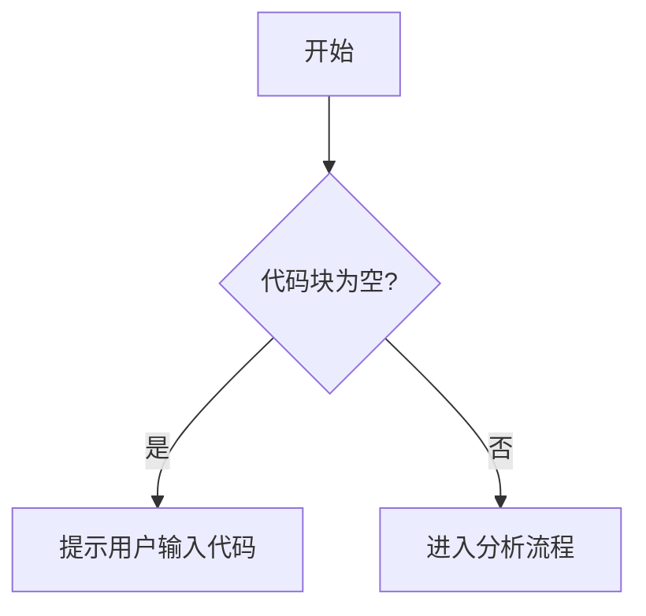

# `Langchain-Chatchat\libs\python-sdk\open_chatcaht\api\knowledge_base\__init__.py` 详细设计文档

未提供代码内容，请检查输入

## 整体流程



## 类结构

```

```

## 全局变量及字段


    

## 全局函数及方法


## 关键组件


由于您提供的代码部分为空，我无法识别源代码中的关键组件。请提供需要分析的代码，我将为您生成包含以下内容的详细设计文档：

### 核心功能概述
一段话描述代码的核心功能

### 文件运行流程
代码的整体执行流程

### 类详细信息
包括类字段、类方法、全局变量和全局函数的详细信息

### 关键组件信息
如张量索引与惰性加载、反量化支持、量化策略等

### 技术债务或优化空间
潜在的问题和改进建议

### 其它项目
设计目标与约束、错误处理与异常设计、数据流与状态机、外部依赖与接口契约等

请提供代码后，我将按照您要求的格式输出完整的详细设计文档。


## 问题及建议


### 已知问题

- 未提供代码内容，无法进行技术债务或优化空间的分析

### 优化建议

- 请提供需要分析的源代码，以便进行详细的技术债务识别和优化建议


## 其它


由于提供的代码为空，我无法提供具体的代码分析。但根据任务要求，一个完整的详细设计文档除了用户已经提到的内容外，还应该包含以下项目：

### 设计目标与约束

描述系统的设计目标，包括功能目标、性能目标、安全目标等，以及各种约束条件（如技术栈约束、时间约束、资源约束等）。

### 错误处理与异常设计

描述系统如何处理错误和异常，包括错误码定义、异常类型设计、错误日志记录策略、故障恢复机制等。

### 数据流与状态机

描述数据在系统中的流动过程，包括数据输入、处理、输出各环节，以及可能的状态机建模（如有状态转换）。

### 外部依赖与接口契约

描述系统依赖的外部服务、库、框架等，以及与外部系统交互的接口契约，包括API定义、协议规范、数据格式约定等。

### 安全性考虑

描述系统安全相关的设计，包括身份认证、授权控制、数据加密、输入验证、安全审计等。

### 性能要求与优化策略

描述系统的性能指标要求（如响应时间、吞吐量、并发数等），以及可能的性能优化策略（如缓存、异步处理、负载均衡等）。

### 兼容性设计

描述系统对不同环境、版本、平台的兼容性考虑，包括前后兼容、浏览器兼容、操作系统兼容等。

### 配置管理

描述系统的配置管理方案，包括配置项定义、配置存储方式、配置更新机制、配置验证等。

### 日志与监控

描述系统的日志记录策略和监控方案，包括日志级别、日志格式、日志存储、监控指标、告警机制等。

### 部署架构

描述系统的部署方案，包括部署拓扑、服务器要求、容器化方案、持续集成/持续部署流程等。

### 测试策略

描述系统的测试方案，包括单元测试、集成测试、系统测试、压力测试等策略，以及测试覆盖率要求。

### 文档维护计划

描述文档的维护策略，包括文档更新时机、责任人、版本管理等。


    