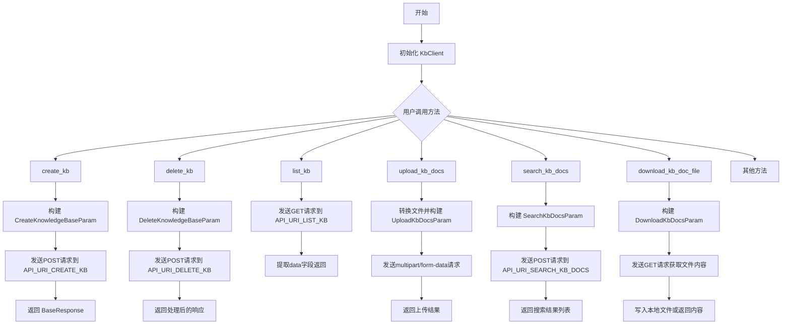
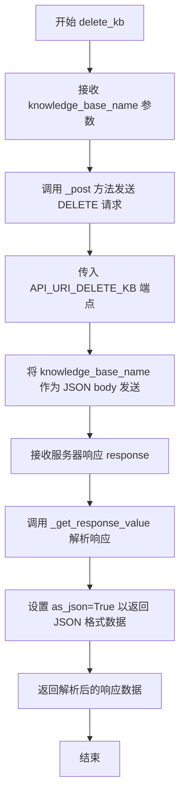
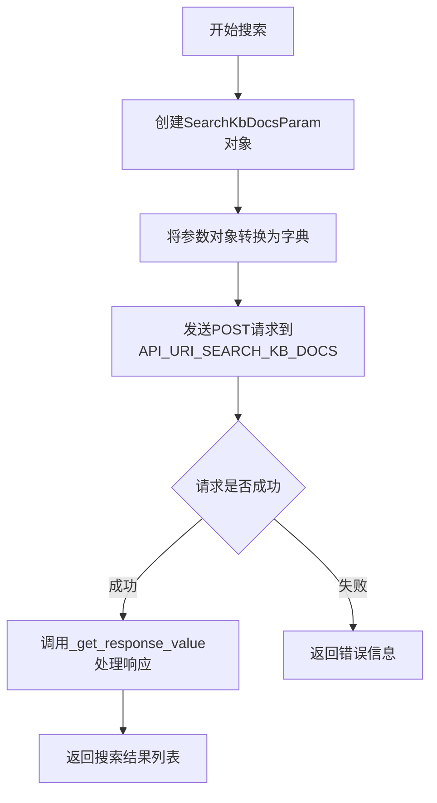
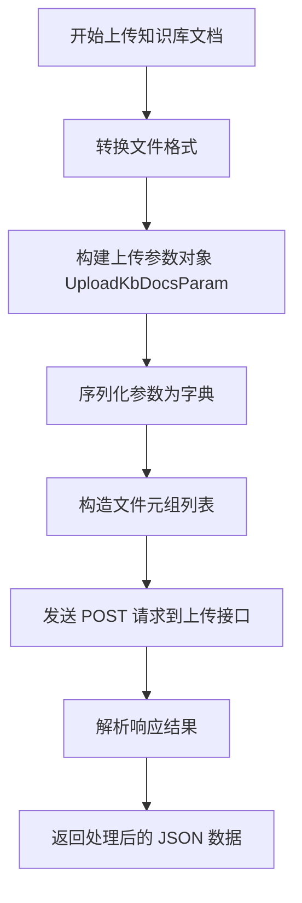
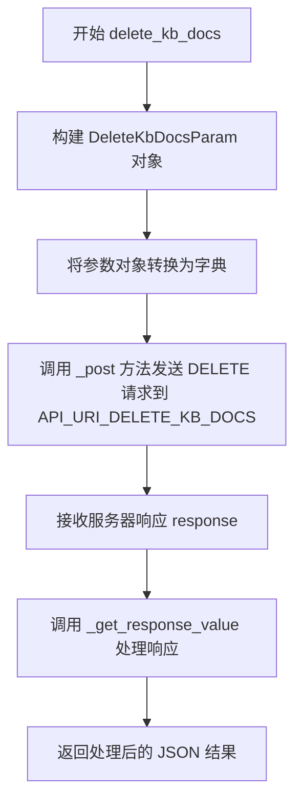
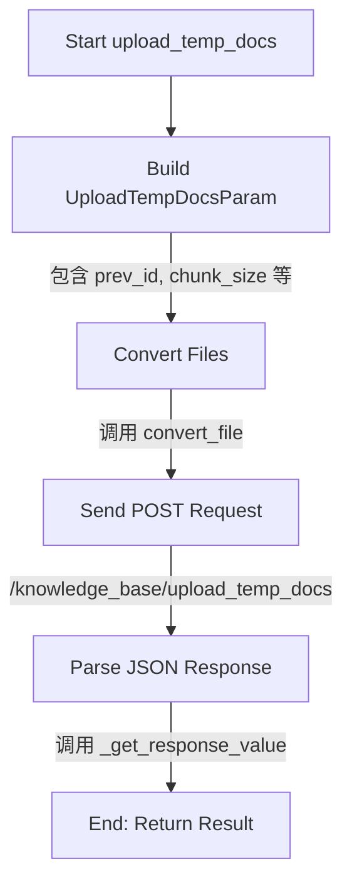
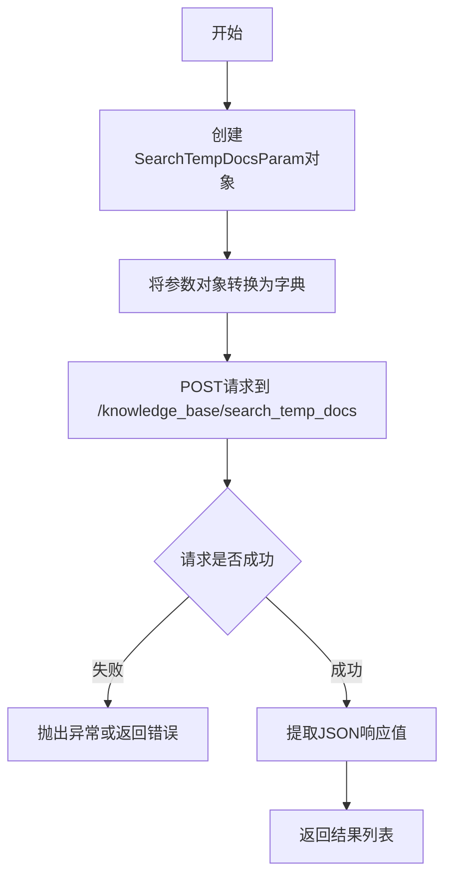
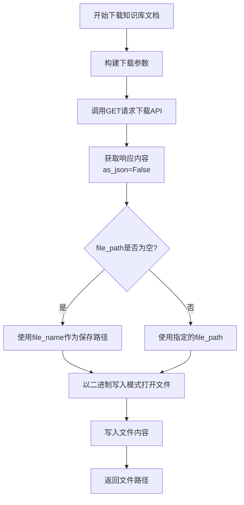
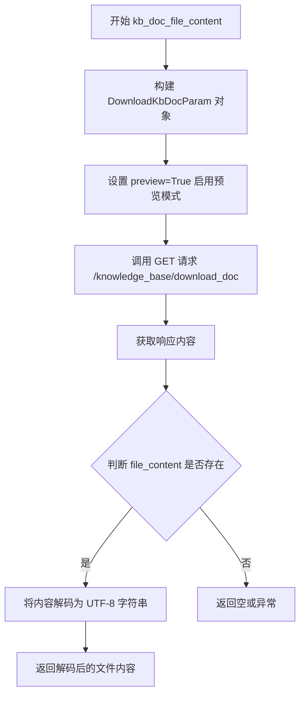

# `Langchain-Chatchat\libs\python-sdk\open_chatcaht\api\knowledge_base\knowledge_base_client.py` 详细设计文档

KbClient是一个知识库客户端类，封装了与知识库API的完整交互能力，包括知识库的创建、删除、列表、文档上传下载、搜索、向量存储重建等核心功能，为知识库管理提供了统一的Python接口。

## 整体流程



## 类结构

```
ApiClient (基类)
└── KbClient (知识库客户端)
```

## 全局变量及字段


### `API_URI_CREATE_KB`
    
创建知识库的API端点路径

类型：`str`
    


### `API_URI_DELETE_KB`
    
删除知识库的API端点路径

类型：`str`
    


### `API_URI_KB_UPDATE_INFO`
    
更新知识库信息的API端点路径

类型：`str`
    


### `API_URI_LIST_KB`
    
列出所有知识库的API端点路径

类型：`str`
    


### `API_URI_URI_LIST_KB_FILE`
    
列出知识库中所有文件的API端点路径

类型：`str`
    


### `API_URI_SEARCH_KB_DOCS`
    
搜索知识库文档的API端点路径

类型：`str`
    


### `API_URI_KB_UPLOAD_DOCS`
    
上传文档到知识库的API端点路径

类型：`str`
    


### `API_URI_KB_DOWNLOAD_DOC`
    
下载知识库文档的API端点路径

类型：`str`
    


### `API_URI_DELETE_KB_DOCS`
    
删除知识库文档的API端点路径

类型：`str`
    


### `API_URI_KB_RECREATE_VECTOR_STORE`
    
重新创建知识库向量存储的API端点路径

类型：`str`
    


### `API_URI_KB_SEARCH_TEMP_DOCS`
    
搜索临时文档的API端点路径

类型：`str`
    


### `API_URI_KB_UPLOAD_TEMP_DOCS`
    
上传临时文档的API端点路径

类型：`str`
    


### `API_URI_KB_SUMMARY_FILE_TO_VECTOR_STORE`
    
将文件摘要写入向量存储的API端点路径

类型：`str`
    


### `API_URI_KB_SUMMARY_DOC_IDS_TO_VECTOR_STORE`
    
将文档ID摘要写入向量存储的API端点路径

类型：`str`
    


### `API_URI_KB_SUMMARY_RECREATE_VECTOR_STORE`
    
重新创建摘要向量存储的API端点路径

类型：`str`
    


### `KbClient.KbClient`
    
知识库客户端类，继承自ApiClient，提供知识库创建、删除、查询、文档管理等操作的API封装

类型：`class`
    
    

## 全局函数及方法


### `KbClient.create_kb`

该方法用于在知识库系统中创建一个新的知识库，通过向服务器发送POST请求来创建知识库，并返回包含创建结果的BaseResponse对象。

参数：

- `self`：`KbClient`，调用该方法的KbClient实例本身
- `knowledge_base_name`：`str`，知识库的名称，用于唯一标识要创建的知识库，必填参数
- `kb_info`：`str`，知识库的描述信息，可选参数，默认为空字符串，用于提供知识库的简要说明
- `vector_store_type`：`str`，向量存储的类型，默认为VS_TYPE常量值，指定知识库使用的向量数据库类型
- `embed_model`：`str`，嵌入模型的名称，默认为EMBEDDING_MODEL常量值，指定用于将文本向量化处理的模型

返回值：`BaseResponse`，包含服务器创建知识库操作的结果响应，通常包含成功状态、消息和可能的知识库ID等信息

#### 流程图

```mermaid
flowchart TD
    A[调用create_kb方法] --> B[校验knowledge_base_name参数]
    B --> C{参数有效?}
    C -->|是| D[@post装饰器构建请求]
    C -->|否| E[抛出参数验证异常]
    D --> F[创建CreateKnowledgeBaseParam对象]
    F --> G[序列化参数为JSON]
    G --> H[发送POST请求到/knowledge_base/create_knowledge_base]
    H --> I[接收服务器响应]
    I --> J[封装为BaseResponse对象]
    J --> K[返回结果给调用者]
```

#### 带注释源码

```python
@post(url=API_URI_CREATE_KB
    , body_model=CreateKnowledgeBaseParam)
def create_kb(
        self,
        knowledge_base_name: str,      # 知识库名称，必填参数
        kb_info: str = "",             # 知识库描述信息，可选，默认为空
        vector_store_type: str = VS_TYPE,   # 向量存储类型，默认使用常量VS_TYPE
        embed_model: str = EMBEDDING_MODEL, # 嵌入模型，默认使用常量EMBEDDING_MODEL
) -> BaseResponse:
    """
    创建新的知识库
    
    使用@post装饰器自动将方法参数封装为CreateKnowledgeBaseParam对象，
    并发送POST请求到服务器端的/knowledge_base/create_knowledge_base接口
    
    Args:
        knowledge_base_name: 知识库的名称，必须唯一且非空
        kb_info: 知识库的描述信息，可选
        vector_store_type: 向量存储类型，默认值从常量VS_TYPE获取
        embed_model: 嵌入模型名称，默认值从常量EMBEDDING_MODEL获取
    
    Returns:
        BaseResponse: 包含创建结果的响应对象，通常包含success状态和message
    """
    ...  # 方法实现由@post装饰器自动处理，方法体为pass/ellipsis
```


### `KbClient.delete_kb`

该方法用于通过知识库名称向服务器发送删除请求，以删除指定的知识库，并返回删除操作的结果响应。

参数：

- `knowledge_base_name`：`str`，要删除的知识库的名称

返回值：`BaseResponse`（或类似响应类型），表示删除操作的结果，通常包含成功状态或错误信息

#### 流程图



#### 带注释源码

```python
def delete_kb(
        self,
        knowledge_base_name: str,  # 要删除的知识库名称
):
    """
    删除指定的知识库
    
    参数:
        knowledge_base_name: 知识库的名称，用于标识要删除的知识库
    
    返回:
        删除操作的结果响应
    """
    # 使用 _post 方法向删除知识库的 API 端点发送 POST 请求
    # 将 knowledge_base_name 直接作为 JSON 请求体发送
    response = self._post(API_URI_DELETE_KB, json=knowledge_base_name)
    
    # 解析响应并返回 JSON 格式的数据
    return self._get_response_value(response, as_json=True)
```


### `KbClient.list_kb`

该方法用于获取系统中所有知识库（Knowledge Base）的列表，通过调用后端 API 接口 `/knowledge_base/list_knowledge_bases` 并解析返回的 JSON 数据，返回知识库列表数据。

参数：

- `self`：`KbClient` 实例本身（隐式参数），无需显式传入

返回值：`List`，返回知识库列表数据，如果 API 返回的 data 字段不存在或为空，则返回空列表 `[]`。

#### 流程图

```mermaid
flowchart TD
    A[开始 list_kb 调用] --> B[调用 self._get API_URI_LIST_KB]
    B --> C[获取 HTTP 响应对象 response]
    C --> D[调用 self._get_response_value 方法]
    D --> E{解析响应}
    E -->|as_json=True| F[将响应转为 JSON 格式]
    F --> G[应用 value_func 提取 data 字段]
    G --> H{data 是否存在}
    H -->|是| I[返回 data 列表]
    H -->|否| J[返回空列表 [] 作为默认值]
    I --> K[结束]
    J --> K
```

#### 带注释源码

```python
def list_kb(self):
    """
    获取系统中所有知识库的列表。
    
    该方法向服务器发送 GET 请求到 /knowledge_base/list_knowledge_bases 端点，
    然后解析返回的 JSON 响应，提取其中的 "data" 字段作为知识库列表返回。
    如果响应中没有 "data" 字段或其为 None，则返回空列表。
    
    Returns:
        List: 知识库列表，包含每个知识库的基本信息（如名称、描述等）
    """
    # 发起 GET 请求到列表知识库 API 端点
    response = self._get(API_URI_LIST_KB)
    
    # 解析响应值：
    # - as_json=True: 将响应内容解析为 JSON 格式
    # - value_func: 提取 response 中 "data" 字段的值，如果不存在则返回空列表
    return self._get_response_value(
        response, 
        as_json=True, 
        value_func=lambda r: r.get("data", [])
    )
```


### `KbClient.list_kb_docs_file`

该方法用于获取指定知识库中的文件列表，通过调用API接口 `/knowledge_base/list_files` 并传入知识库名称作为查询参数，返回知识库中所有文件的列表数据。

参数：

- `knowledge_base_name`：`str`，知识库的名称，用于指定要列出文件的目标知识库

返回值：`List`，返回知识库中的文件列表，列表中的每个元素代表一个文件信息

#### 流程图

```mermaid
flowchart TD
    A[开始 list_kb_docs_file] --> B[构建查询参数]
    B --> C[创建 DeleteKnowledgeBaseParam 对象]
    C --> D[调用 .dict 方法转换为字典]
    D --> E[调用 _get 方法发送 GET 请求]
    E --> F[调用 _get_response_value 处理响应]
    F --> G{检查 as_json=True}
    G -->|是| H[应用 value_func: r.getdata}
    H --> I[返回文件列表]
    G -->|否| J[返回原始响应]
    I --> K[结束]
    J --> K
```

#### 带注释源码

```python
def list_kb_docs_file(
        self,
        knowledge_base_name: str,
):
    """
    获取指定知识库中的文件列表
    
    参数:
        knowledge_base_name: 知识库名称
        
    返回:
        文件列表
    """
    # 使用 DeleteKnowledgeBaseParam 构建查询参数（此处存在参数类使用不当的技术债务）
    params = DeleteKnowledgeBaseParam(knowledge_base_name=knowledge_base_name).dict()
    
    # 调用 GET 请求获取知识库文件列表
    response = self._get(API_URI_URI_LIST_KB_FILE, params=params)
    
    # 处理响应数据，提取 "data" 字段作为返回值
    # 如果 data 为空，则返回空列表
    return self._get_response_value(
        response, 
        as_json=True, 
        value_func=lambda r: r.get("data", [])
    )
```

#### 技术债务说明

1. **参数类使用不当**：该方法使用 `DeleteKnowledgeBaseParam` 来构建查询参数，这是一个不恰当的参数类，应该创建专门的 `ListKbDocsFileParam` 参数类来使用，提高代码的可读性和语义正确性。

2. **异常处理缺失**：方法没有显式的异常处理机制，当 API 请求失败或网络异常时，可能导致调用方无法得到明确的错误信息。

3. **参数校验不足**：没有对 `knowledge_base_name` 参数进行有效性校验（如空字符串、None 值等）。


### `KbClient.search_kb_docs`

该方法用于在指定的知识库中搜索与查询字符串最相关的文档，通过向量相似度检索返回匹配的文档列表。

参数：

- `knowledge_base_name`：`str`，知识库名称，指定要搜索的知识库
- `query`：`str`，查询字符串，默认为空字符串，表示要搜索的文本内容
- `top_k`：`int`，返回结果数量，默认为 `VECTOR_SEARCH_TOP_K` 常量值
- `score_threshold`：`float`，分数阈值，默认为 `SCORE_THRESHOLD` 常量值，用于过滤低相似度结果
- `file_name`：`str`，文件名筛选条件，默认为空字符串，表示不限制文件
- `metadata`：`dict`，元数据筛选条件，默认为空字典，用于按文档元数据过滤

返回值：`List`，返回搜索结果列表，包含与查询相关的文档信息

#### 流程图



#### 带注释源码

```python
def search_kb_docs(
        self,
        knowledge_base_name: str,      # 知识库名称，指定搜索的目标知识库
        query: str = "",                # 查询字符串，待搜索的文本内容
        top_k: int = VECTOR_SEARCH_TOP_K,   # 返回结果数量，默认为配置常量
        score_threshold: float = SCORE_THRESHOLD,  # 相似度分数阈值
        file_name: str = "",            # 文件名，用于过滤特定文件
        metadata: dict = {},            # 元数据，用于按文档属性过滤
) -> List:
    """
    在知识库中搜索与查询最相关的文档
    
    参数:
        knowledge_base_name: 知识库名称
        query: 查询文本
        top_k: 返回结果数量限制
        score_threshold: 相似度阈值
        file_name: 文件名筛选
        metadata: 元数据筛选条件
    
    返回:
        搜索结果列表
    """
    # 创建搜索参数对象，包含所有查询条件
    data = SearchKbDocsParam(
        query=query,                           # 查询字符串
        knowledge_base_name=knowledge_base_name,  # 知识库名称
        top_k=top_k,                           # 返回结果数量
        score_threshold=score_threshold,       # 分数阈值
        file_name=file_name,                   # 文件名筛选
        metadata=metadata,                     # 元数据筛选
    ).dict()  # 转换为字典格式
    
    # 发送POST请求到知识库搜索API
    response = self._post(API_URI_SEARCH_KB_DOCS, json=data)
    
    # 处理响应，提取JSON数据并返回
    return self._get_response_value(response, as_json=True)
```


### `KbClient.upload_kb_docs`

该方法用于将文档上传到知识库，支持文件转换为向量并可选地刷新向量存储缓存。

参数：

- `files`：`List[Union[str, Path, bytes]]`，待上传的文件列表，支持字符串路径、Path对象或字节内容
- `knowledge_base_name`：`str`，目标知识库的名称
- `override`：`bool`，是否覆盖已存在的文档，默认为 False
- `to_vector_store`：`bool`，是否将上传的文档转换为向量并存入向量存储，默认为 True
- `chunk_size`：`int`，文本分块的大小，默认为 CHUNK_SIZE
- `chunk_overlap`：`int`，文本分块之间的重叠大小，默认为 OVERLAP_SIZE
- `zh_title_enhance`：`bool`，是否启用中文标题增强，默认为 ZH_TITLE_ENHANCE
- `docs`：`Dict`，额外的文档元数据字典，用于描述文档信息
- `not_refresh_vs_cache`：`bool`，是否不刷新向量存储缓存，默认为 False

返回值：`Any`，上传操作的结果，通常包含上传成功的文件列表和状态信息

#### 流程图



#### 带注释源码

```python
def upload_kb_docs(
        self,
        files: List[Union[str, Path, bytes]],
        knowledge_base_name: str,
        override: bool = False,
        to_vector_store: bool = True,
        chunk_size=CHUNK_SIZE,
        chunk_overlap=OVERLAP_SIZE,
        zh_title_enhance=ZH_TITLE_ENHANCE,
        docs: Dict = {},
        not_refresh_vs_cache: bool = False,
):
    """
    上传文档到知识库
    
    参数:
        files: 待上传的文件列表，支持 str/Path/bytes 类型
        knowledge_base_name: 目标知识库名称
        override: 是否覆盖已存在文档
        to_vector_store: 是否转换为向量并存储
        chunk_size: 文本分块大小
        chunk_overlap: 分块重叠大小
        zh_title_enhance: 是否启用中文标题增强
        docs: 文档元数据字典
        not_refresh_vs_cache: 是否不刷新向量存储缓存
    
    返回:
        上传操作的结果数据
    """
    # 步骤1: 将所有文件转换为统一格式（filename, file_content）元组
    files = [convert_file(file) for file in files]
    
    # 步骤2: 构建上传参数对象
    data = UploadKbDocsParam(
        knowledge_base_name=knowledge_base_name,
        override=override,
        to_vector_store=to_vector_store,
        chunk_size=chunk_size,
        chunk_overlap=chunk_overlap,
        zh_title_enhance=zh_title_enhance,
        docs=json.dumps(docs, ensure_ascii=False),  # 将字典序列化为 JSON 字符串
        not_refresh_vs_cache=not_refresh_vs_cache,
    ).dict()
    
    # 步骤3: 发送 POST 请求，上传文件和参数
    # files 参数格式: [("files", (filename, file_content)), ...]
    response = self._post(API_URI_KB_UPLOAD_DOCS, data=data,
                          files=[("files", (filename, file)) for filename, file in files])
    
    # 步骤4: 解析响应并返回 JSON 格式的结果
    return self._get_response_value(response, as_json=True)
```


### `KbClient.delete_kb_docs`

该方法用于从知识库中删除指定的文档文件，支持可选地删除文件内容以及控制是否刷新向量存储缓存。

参数：

- `self`：`KbClient`，调用该方法的客户端实例本身
- `knowledge_base_name`：`str`，要删除文档的目标知识库名称
- `file_names`：`List[str]`，要删除的文件名列表
- `delete_content`：`bool`，是否同时删除原始文件内容，默认为 `False`（仅删除向量索引）
- `not_refresh_vs_cache`：`bool`，是否不刷新向量存储缓存，默认为 `False`

返回值：`Any`，调用 `_get_response_value` 处理后的响应结果，通常为包含删除操作结果的字典或响应对象

#### 流程图



#### 带注释源码

```python
def delete_kb_docs(
        self,
        knowledge_base_name: str,
        file_names: List[str],
        delete_content: bool = False,
        not_refresh_vs_cache: bool = False,
):
    """
    从知识库中删除指定的文档
    
    Args:
        knowledge_base_name: 知识库名称
        file_names: 要删除的文件名列表
        delete_content: 是否删除原始文件内容，False 仅删除向量索引
        not_refresh_vs_cache: 是否不刷新向量存储缓存
    
    Returns:
        删除操作的结果响应
    """
    # 1. 创建删除文档参数对象，包含知识库名、文件名列表及选项配置
    data = DeleteKbDocsParam(
        knowledge_base_name=knowledge_base_name,
        file_names=file_names,
        delete_content=delete_content,
        not_refresh_vs_cache=not_refresh_vs_cache,
    ).dict()
    
    # 2. 向服务器发送 POST 请求，JSON 格式提交删除参数
    response = self._post(API_URI_DELETE_KB_DOCS, json=data)
    
    # 3. 解析响应结果为 JSON 格式并返回
    return self._get_response_value(response, as_json=True)
```


### `KbClient.update_kb_info`

该方法用于更新指定知识库的描述信息。它接收知识库名称和新的描述信息，将其封装为 `UpdateKbInfoParam` 对象，转换为字典后通过 POST 请求发送至后端 API，最终返回处理结果。

参数：

- `knowledge_base_name`：未标注类型（应为 `str`），目标知识库的名称
- `kb_info`：未标注类型（应为 `str`），要更新的知识库描述信息

返回值：未明确标注类型，根据 `self._get_response_value(response, as_json=True)` 调用推断为 JSON 序列化后的响应数据（通常为 `dict` 或 `BaseResponse`）

#### 流程图

```mermaid
flowchart TD
    A[开始 update_kb_info] --> B[创建 UpdateKbInfoParam 对象]
    B --> C[调用 .dict\(\) 转换为字典]
    C --> D[调用 self._post 发送 POST 请求]
    D --> E[调用 self._get_response_value 解析响应]
    E --> F[返回 JSON 格式结果]
```

#### 带注释源码

```python
def update_kb_info(self, knowledge_base_name, kb_info):
    """
    更新知识库的描述信息
    
    参数:
        knowledge_base_name: 目标知识库的名称
        kb_info: 新的知识库描述信息
    """
    # 使用 UpdateKbInfoParam 模型封装请求参数
    data = UpdateKbInfoParam(
        knowledge_base_name=knowledge_base_name,  # 知识库名称
        kb_info=kb_info,                            # 知识库描述信息
    ).dict()  # 转换为字典格式
    
    # 向后端 API 发送 POST 请求更新知识库信息
    response = self._post(API_URI_KB_UPDATE_INFO, json=data)
    
    # 解析响应数据并以 JSON 格式返回
    return self._get_response_value(response, as_json=True)
```


### `KbClient.recreate_vector_store`

该方法用于触发对指定知识库（Knowledge Base）的向量存储（Vector Store）进行重建操作。它接收知识库名称、向量存储类型、嵌入模型、分块参数等配置，封装为请求参数并以流式（Streaming）方式发送给后端 API，最终返回一个生成器（Generator）以迭代获取重建过程中的状态或结果数据。

参数：

-  `self`：隐式参数，指向 `KbClient` 实例本身。
-  `knowledge_base_name`：`str`，目标知识库的名称，用于指定需要重建向量库的知识库。
-  `allow_empty_kb`：`bool`，是否允许对空知识库执行重建操作，默认为 `True`。
-  `vs_type`：`str`，向量存储的类型（Vector Store Type），默认为常量 `VS_TYPE`（如 Faiss, Milvus 等）。
-  `embed_model`：`str`，嵌入模型（Embedding Model），默认为常量 `EMBEDDING_MODEL`。
-  `chunk_size`：数值类型（通常为 `int`），文档分块的大小，默认为常量 `CHUNK_SIZE`。
-  `chunk_overlap`：数值类型（通常为 `int`），分块之间的重叠大小，默认为常量 `OVERLAP_SIZE`。
-  `zh_title_enhance`：布尔类型，是否启用中文标题增强，默认为常量 `ZH_TITLE_ENHANCE`。

返回值：`Generator` 或 `Iterator`，返回一个流式生成器，用于迭代解析服务器返回的 JSON 格式的重建进度或结果数据。

#### 流程图

```mermaid
flowchart TD
    A([开始]) --> B[构建 RecreateVectorStoreParam 对象]
    B --> C[调用 .dict() 转换为字典]
    C --> D[调用 self._post 发送流式请求]
    D --> E{请求成功?}
    E -- 否 --> F[抛出异常或返回错误]
    E -- 是 --> G[获取 response 对象]
    G --> H[调用 self._httpx_stream2generator 处理流响应]
    H --> I([返回 Generator])
    
    style A fill:#f9f,stroke:#333,stroke-width:2px
    style I fill:#bbf,stroke:#333,stroke-width:2px
```

#### 带注释源码

```python
def recreate_vector_store(
        self,
        knowledge_base_name: str,
        allow_empty_kb: bool = True,
        vs_type: str = VS_TYPE,
        embed_model: str = EMBEDDING_MODEL,
        chunk_size=CHUNK_SIZE,
        chunk_overlap=OVERLAP_SIZE,
        zh_title_enhance=ZH_TITLE_ENHANCE,
):
    """
    重新创建指定知识库的向量存储。
    
    参数:
        knowledge_base_name: 知识库名称
        allow_empty_kb: 是否允许空知识库
        vs_type: 向量存储类型
        embed_model: 嵌入模型
        chunk_size: 分块大小
        chunk_overlap: 分块重叠大小
        zh_title_enhance: 是否启用中文标题增强
    """
    # 1. 构造请求参数数据模型，并转换为字典
    data = RecreateVectorStoreParam(
        knowledge_base_name=knowledge_base_name,
        allow_empty_kb=allow_empty_kb,
        vs_type=vs_type,
        embed_model=embed_model,
        chunk_size=chunk_size,
        chunk_overlap=chunk_overlap,
        zh_title_enhance=zh_title_enhance,
    ).dict()
    
    # 2. 发起 POST 请求，使用 stream=True 以处理流式响应，timeout=None 允许永久等待（直至任务完成）
    response = self._post(API_URI_KB_RECREATE_VECTOR_STORE, json=data, stream=True, timeout=None)
    
    # 3. 将 HTTP 响应转换为 JSON 生成器并返回，供调用者迭代处理重建进度
    return self._httpx_stream2generator(response, as_json=True)
```


### `KbClient.upload_temp_docs`

该方法用于将文档上传到知识库的临时存储区（Session）。它接收文件列表及知识ID（用于关联上下文），结合分块和中文标题增强等配置参数，构造请求体并通过 POST 方式上传文件，最后解析服务器返回的 JSON 结果，完成临时文档的入库操作。

参数：
- `files`：`List[Union[str, Path, bytes]]`，待上传的文件列表，支持文件路径或字节数据。
- `knowledge_id`：`str`，可选，关联的知识库/会话 ID（对应后端 `prev_id`），用于保持上下文连续性。
- `chunk_size`：`int`，文本分块的大小，默认为常量 `CHUNK_SIZE`。
- `chunk_overlap`：`int`，文本分块的 overlap 大小，默认为常量 `OVERLAP_SIZE`。
- `zh_title_enhance`：`bool`，是否启用中文标题增强，默认为常量 `ZH_TITLE_ENHANCE`。

返回值：`Any`（通常为 Dict 或 List），服务器处理后的 JSON 响应，包含临时文档的 ID 或状态信息。

#### 流程图



#### 带注释源码

```python
def upload_temp_docs(self,
                     files: List[Union[str, Path, bytes]],
                     knowledge_id: str = None,
                     chunk_size: int = CHUNK_SIZE,
                     chunk_overlap: int = OVERLAP_SIZE,
                     zh_title_enhance: bool = ZH_TITLE_ENHANCE,
                     ):
    """
    上传临时文档到知识库。

    参数:
        files: 文件列表，可以是路径或字节。
        knowledge_id: 知识库/会话ID，用于关联上下文。
        chunk_size: 文本分块大小。
        chunk_overlap: 文本分块重叠大小。
        zh_title_enhance: 是否开启中文标题增强。
    """
    # 1. 构造请求参数对象，将 knowledge_id 映射为 prev_id
    data = UploadTempDocsParam(
        prev_id=knowledge_id,
        chunk_size=chunk_size,
        chunk_overlap=chunk_overlap,
        zh_title_enhance=zh_title_enhance
    ).dict()
    
    # 2. 将输入文件转换为符合 API 要求的格式
    _files = [convert_file(file) for file in files]
    
    # 3. 发起 POST 请求，上传文件及表单数据
    # 注意：此处直接使用了字符串路径，未使用常量 API_URI_KB_UPLOAD_TEMP_DOCS
    response = self._post(
        "/knowledge_base/upload_temp_docs",
        data=data,
        files=[("files", (filename, file)) for filename, file in _files],
    )
    
    # 4. 解析并返回 JSON 响应
    return self._get_response_value(response, as_json=True)
```


### `KbClient.search_temp_kb_docs`

该方法用于在临时知识库中搜索文档，通过提供知识库ID、查询语句、返回结果数量和分数阈值等参数，向服务器发送搜索请求并返回符合条件的文档列表。

参数：

- `self`：`KbClient` 隐式参数，当前类实例
- `knowledge_id`：`str`，临时知识库的ID，用于指定搜索的目标知识库
- `query`：`str`，搜索查询语句，用于在知识库中匹配相关文档
- `top_k`：`int`，返回结果的最大数量，默认为 `VECTOR_SEARCH_TOP_K`，用于限制返回的相似文档数目
- `score_threshold`：`float`，相似度分数阈值，默认为 `SCORE_THRESHOLD`，用于过滤低于该分数的搜索结果

返回值：`List`，返回与查询语句匹配的文档列表，列表中每个元素包含文档内容及相关元信息

#### 流程图



#### 带注释源码

```python
def search_temp_kb_docs(
        self,
        knowledge_id: str,
        query: str,
        top_k: int = VECTOR_SEARCH_TOP_K,
        score_threshold: float = SCORE_THRESHOLD,
) -> List:
    """
    在临时知识库中搜索文档
    
    参数:
        knowledge_id: 临时知识库的唯一标识ID
        query: 用户查询文本
        top_k: 返回最相似的K个文档
        score_threshold: 相似度分数阈值，低于此分数的文档将被过滤
    
    返回:
        包含搜索结果的列表
    """
    # 步骤1: 构建搜索参数对象
    # 使用SearchTempDocsParam模型封装搜索请求参数，确保参数类型和格式正确
    data = SearchTempDocsParam(
        knowledge_id=knowledge_id,      # 临时知识库ID
        query=query,                     # 搜索查询语句
        top_k=top_k,                     # 返回结果数量
        score_threshold=score_threshold, # 分数阈值过滤
    ).dict()                             # 转换为字典格式
    
    # 步骤2: 发送POST请求
    # 调用_post方法向服务器端点发送JSON格式的搜索请求
    response = self._post(API_URI_KB_SEARCH_TEMP_DOCS, json=data)
    
    # 步骤3: 提取并返回响应数据
    # _get_response_value方法负责解析HTTP响应，as_json=True表示返回JSON格式数据
    return self._get_response_value(response, as_json=True)
```


### `KbClient.download_kb_doc_file`

该方法用于从指定知识库下载文档文件，通过调用知识库下载API获取文件内容，并将其保存到本地文件系统。

参数：

- `knowledge_base_name`：`str`，知识库的名称，用于指定从哪个知识库下载文件
- `file_name`：`str`，要下载的文件名称
- `file_path`：`Optional[str]`，可选参数，文件保存的本地路径，默认为 `None`，即使用 `file_name` 作为保存路径

返回值：`str`，返回保存后的文件路径

#### 流程图



#### 带注释源码

```python
def download_kb_doc_file(self, knowledge_base_name: str, file_name: str, file_path: Optional[str] = None):
    """
    从知识库下载文档文件并保存到本地
    
    参数:
        knowledge_base_name: 知识库名称
        file_name: 要下载的文件名
        file_path: 可选的本地保存路径，默认使用文件名
    
    返回:
        保存的文件路径
    """
    # 步骤1: 构建下载请求参数
    params = DownloadKbDocParam(
        knowledge_base_name=knowledge_base_name,
        file_name=file_name,
        preview=False
    ).dict()
    
    # 步骤2: 发送GET请求到下载API端点
    response = self._get(API_URI_KB_DOWNLOAD_DOC, params=params)
    
    # 步骤3: 从响应中提取文件内容（二进制）
    # as_json=False 表示返回原始内容（非JSON）
    # value_func=lambda r: r.content 获取响应的二进制内容
    file_content = self._get_response_value(response, as_json=False, value_func=lambda r: r.content)
    
    # 步骤4: 确定文件保存路径
    if file_path is None:
        file_path = file_name
    
    # 步骤5: 以二进制写入模式保存文件
    with open(file_path, 'wb') as file:
        file.write(file_content)
    
    # 步骤6: 返回保存的文件路径
    return file_path
```


### `KbClient.kb_doc_file_content`

该方法用于从知识库中获取指定文件的文本内容，支持预览模式，返回文件内容的 UTF-8 字符串表示。

参数：

- `knowledge_base_name`：`str`，知识库的名称，用于指定要获取文件内容的知识库
- `file_name`：`str`，要获取内容的文件名

返回值：`str`，文件内容的 UTF-8 解码字符串

#### 流程图



#### 带注释源码

```python
def kb_doc_file_content(self, knowledge_base_name: str, file_name: str):
    """
    从知识库中获取文档文件的文本内容（预览模式）
    
    Args:
        knowledge_base_name: 知识库名称
        file_name: 文件名
    
    Returns:
        文件内容的 UTF-8 字符串
    """
    # 构造下载参数对象，设置 preview=True 表示预览模式
    params = DownloadKbDocParam(
        knowledge_base_name=knowledge_base_name,
        file_name=file_name,
        preview=True  # 预览模式，返回文本内容而非文件下载
    ).dict()
    
    # 向知识库文档下载接口发送 GET 请求
    response = self._get(API_URI_KB_DOWNLOAD_DOC, params=params)
    
    # 获取响应内容（原始字节流，不解析为 JSON）
    file_content = self._get_response_value(
        response, 
        as_json=False,  # 不解析为 JSON
        value_func=lambda r: r.content  # 获取原始响应内容
    )
    
    # 将二进制内容解码为 UTF-8 字符串并返回
    return file_content.decode('utf-8')
```

## 关键组件


### 知识库客户端 (KbClient)

核心组件，提供知识库（Knowledge Base）的完整生命周期管理能力，包括创建、删除、列表、文档上传下载、向量存储重建、文档搜索等操作。

### 知识库创建 (create_kb)

通过API创建新的知识库，支持配置向量存储类型和嵌入模型。

### 知识库删除 (delete_kb)

根据知识库名称删除指定的知识库。

### 知识库列表 (list_kb)

获取当前系统中所有知识库的列表。

### 文档上传 (upload_kb_docs)

将文件上传至知识库，支持分块参数配置（chunk_size、chunk_overlap）和中文标题增强选项。

### 文档删除 (delete_kb_docs)

从知识库中删除指定文件，支持可选的内容删除和向量缓存刷新控制。

### 文档搜索 (search_kb_docs)

基于向量相似度在知识库中搜索文档，支持top_k和score_threshold过滤。

### 向量存储重建 (recreate_vector_store)

重建知识库的向量存储，支持流式响应返回处理进度。

### 临时文档上传 (upload_temp_docs)

上传临时文档到知识库系统，用于处理中间状态的文档。

### 临时文档搜索 (search_temp_kb_docs)

在临时文档集合中搜索内容，基于知识ID和查询字符串。

### 文档下载 (download_kb_doc_file)

从知识库下载指定文件，可选择保存到指定路径。

### 知识库信息更新 (update_kb_info)

更新知识库的描述信息。

### 文档列表 (list_kb_docs_file)

获取指定知识库中的所有文件列表。

### 文档内容预览 (kb_doc_file_content)

获取知识库中指定文档的内容，支持预览模式。

## 问题及建议


### 已知问题

-   **类型注解不完整**：多个方法缺少返回类型注解（如`delete_kb`、`list_kb`、`list_kb_docs_file`），部分参数缺少类型提示（如`chunk_size`、`chunk_overlap`参数），使用泛型时未指定类型参数（如`List`、`Dict`未指定内部类型）
-   **硬编码URL不一致**：`upload_temp_docs`方法中直接使用字符串路径`"/knowledge_base/upload_temp_docs"`而非常量`API_URI_KB_UPLOAD_TEMP_DOCS`
-   **异常处理缺失**：所有API调用方法均无try-except异常处理，缺少对网络错误、API错误响应的捕获和处理
-   **文档字符串缺失**：整个类没有任何docstring，大部分方法也没有文档说明，影响代码可维护性和可读性
-   **代码重复**：文件转换逻辑`[convert_file(file) for file in files]`在`upload_kb_docs`和`upload_temp_docs`中重复出现
-   **不一致的命名规范**：方法命名不统一，如`list_kb`与`list_kb_docs_file`风格不一致
-   **魔法数字和默认值分散**：`top_k`、`score_threshold`等参数默认值分散在各方法中，应统一管理
-   **被注释掉的废弃代码**：存在大段被注释的方法（如`recreate_summary_vector_store`等），长期未清理
-   **文件写入无验证**：`download_kb_doc_file`方法直接写入文件，未检查写入是否成功或文件路径是否合法
-   **响应处理方式不统一**：部分方法使用`value_func`lambda处理响应，部分直接返回，处理逻辑不一致

### 优化建议

-   **完善类型注解**：为所有方法添加完整的类型注解，使用typing模块的详细类型（如`List[str]`、`Optional[str]`等）
-   **统一使用常量**：确保所有API路径使用统一定义的常量，消除硬编码字符串
-   **添加异常处理**：在API调用外层添加统一的异常处理机制，或在基类中实现
-   **添加文档字符串**：为类和方法添加详细的docstring，说明功能、参数、返回值和可能抛出的异常
-   **提取公共逻辑**：将文件转换、参数构建等重复逻辑抽取为私有方法
-   **清理废弃代码**：删除被注释掉的废弃方法，或使用版本控制管理
-   **统一响应处理**：在基类中统一响应处理逻辑，确保所有API调用返回格式一致
-   **添加验证逻辑**：文件下载写入前验证路径安全性，检查写入结果

## 其它


### 设计目标与约束

本代码旨在为知识库（Knowledge Base）系统提供Python客户端封装，简化对知识库的创建、删除、文档上传、搜索、下载等操作的调用。设计目标包括：提供统一的API接口、封装底层HTTP通信细节、支持文件上传下载、兼容多种向量存储类型和嵌入模型。约束条件包括：依赖open_chatcaht._constants中的配置常量、依赖pydantic进行参数校验、依赖httpx进行HTTP通信。

### 错误处理与异常设计

错误处理主要通过ApiClient基类的_get_response_value方法和HttpResponse对象的异常捕获实现。当API返回非200状态码时，httpx库会抛出异常，由调用方捕获处理。对于业务层面的错误（如知识库不存在、文档删除失败等），错误信息包含在响应体的message或code字段中。代码中未显式定义自定义异常类，依赖外部API返回的错误码进行错误判断。建议增加对常见错误码的显式异常抛出，如知识库已存在、文件不存在等。

### 数据流与状态机

数据流主要分为两类：查询类操作（search、list、download）和写入类操作（create、upload、delete）。查询类操作采用同步HTTP GET/POST请求，返回JSON格式的查询结果。写入类操作同样采用同步请求，但upload操作支持多文件并行上传。对于recreate_vector_store等耗时操作，采用流式响应（stream=True）并通过_httpx_stream2generator转换为生成器返回，实现增量处理。知识库状态包括：初始化（无向量库）、已创建（已建向量库）、重建中（正在重建向量库）。

### 外部依赖与接口契约

主要依赖包括：pydantic用于参数模型校验、httpx用于HTTP通信、typing用于类型注解。外部接口为RESTful API，包括：/knowledge_base/create_knowledge_base（创建知识库）、/knowledge_base/delete_knowledge_base（删除知识库）、/knowledge_base/list_knowledge_bases（列出知识库）、/knowledge_base/search_docs（搜索文档）、/knowledge_base/upload_docs（上传文档）、/knowledge_base/download_doc（下载文档）、/knowledge_base/delete_docs（删除文档）等。接口采用JSON格式进行请求和响应，文件上传采用multipart/form-data格式。

### 安全性考虑

代码中未显式实现认证和授权机制，依赖ApiClient基类中可能实现的token或API Key注入。敏感信息（如知识库名称、文档内容）通过HTTPS传输时由底层httpx库处理。文件下载时直接写入本地文件系统，存在路径遍历风险（file_path参数可控）。建议增加文件路径安全校验，防止../等路径穿越攻击。

### 性能考量

文件上传采用批量处理（List[Union[str, Path, bytes]]），减少网络往返次数。recreate_vector_store等耗时操作采用流式响应，避免一次性加载大文件到内存。文档分块参数（chunk_size、chunk_overlap）允许控制单次处理的文档大小。潜在优化点：对于大量小文件，可考虑压缩后再上传；搜索操作可增加缓存机制。

### 配置与可扩展性

配置通过open_chatcaht._constants模块集中管理，包括：EMBEDDING_MODEL（嵌入模型）、VS_TYPE（向量存储类型）、VECTOR_SEARCH_TOP_K（搜索返回条数）、SCORE_THRESHOLD（相似度阈值）、CHUNK_SIZE（分块大小）、OVERLAP_SIZE（块重叠大小）、ZH_TITLE_ENHANCE（中文标题增强）、LLM_MODEL（大语言模型）。扩展方式包括：继承KbClient类并重写特定方法、添加新的知识库操作方法、注册新的API端点常量。

### 测试策略

建议测试覆盖：单元测试针对每个方法的参数校验和请求构造、集成测试针对实际API调用的正确性、Mock测试模拟各种API响应（包括成功、失败、异常情况）。重点测试场景包括：知识库创建重复检测、文档上传分块处理、文件下载路径安全、搜索结果排序正确性、向量库重建的流式响应处理。

### 版本兼容性

代码假设后端API版本为当前版本，未实现版本协商机制。当API接口参数或返回格式变化时，需要同步更新客户端代码。建议在ApiClient基类中添加API版本校验逻辑，当检测到不兼容的API版本时给出明确提示。

### 部署与环境要求

运行依赖Python 3.8+、pydantic、httpx库。环境变量或配置文件需包含API服务端地址、认证凭证等。知识库文件存储依赖后端服务的文件系统或对象存储配置。部署时需确保网络可达API服务端，文件上传大小限制需与后端配置一致（通常为10MB-100MB）。

    