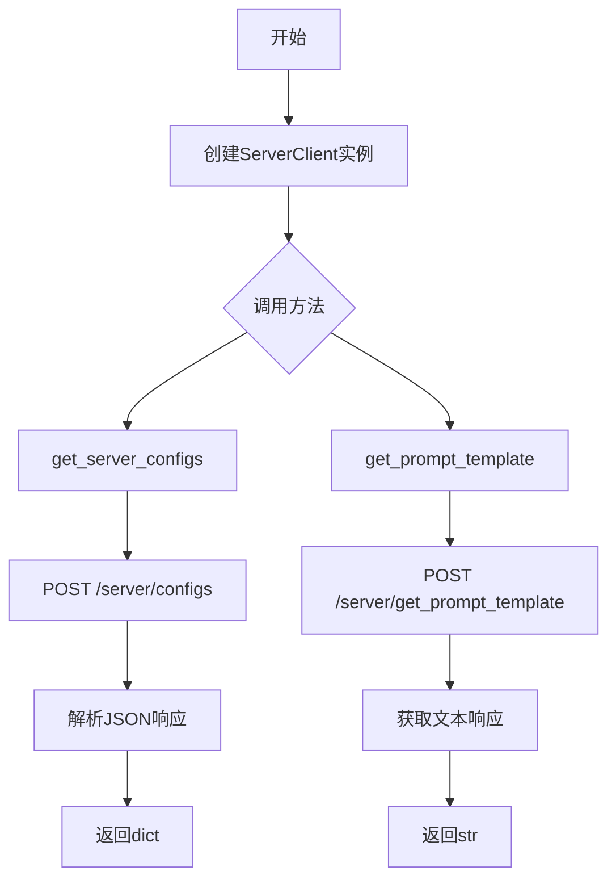
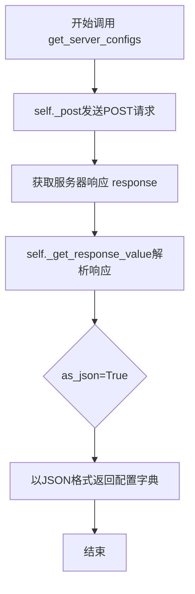
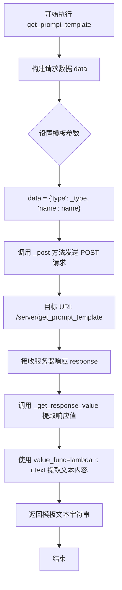

# `Langchain-Chatchat\libs\python-sdk\open_chatcaht\api\server\server_client.py` 详细设计文档

该代码定义了一个ServerClient类，用于与服务器端点进行交互，提供获取服务器配置和提示模板的功能，属于API客户端封装层。

## 整体流程



## 类结构

```
ApiClient (基类)
└── ServerClient (服务器客户端)
```

## 全局变量及字段


### `API_URI_GET_SERVER_CONFIGS`
    
获取服务器配置的API端点路径

类型：`str`
    


### `API_URI_GET_PROMPT_TEMPLATE`
    
获取提示模板的API端点路径

类型：`str`
    


    

## 全局函数及方法


### `ServerClient.get_server_configs`

该方法是`ServerClient`类的一个实例方法，用于从服务器获取服务器配置信息。它通过POST请求调用后端API接口 `/server/configs`，并返回解析后的JSON配置数据。

参数：
- 该方法无显式参数（`self`为实例自身参数）

返回值：`dict`，返回从服务器获取的配置信息，以字典形式呈现

#### 流程图



#### 带注释源码

```python
def get_server_configs(self) -> dict:
    """
    获取服务器配置信息
    
    Returns:
        dict: 服务器配置信息字典
    """
    # 调用父类的_post方法向服务器发送POST请求
    # API_URI_GET_SERVER_CONFIGS = "/server/configs"
    response = self._post(API_URI_GET_SERVER_CONFIGS)
    
    # 调用_get_response_value方法解析响应结果
    # as_json=True 表示将响应结果解析为JSON格式并返回字典
    return self._get_response_value(response, as_json=True)
```


### `ServerClient.get_prompt_template`

该方法用于从服务器获取指定类型和名称的提示词模板，通过POST请求调用服务端接口并返回模板的文本内容。

参数：

- `self`：`ServerClient`，调用此方法的类实例
- `_type`：`str`，模板类型，默认为 `"knowledge_base_chat"`，用于指定要获取的模板类别
- `name`：`str`，模板名称，默认为 `"default"`，用于指定具体的模板名称

返回值：`str`，返回服务器提供的提示词模板文本内容

#### 流程图



#### 带注释源码

```python
def get_prompt_template(
        self,
        _type: str = "knowledge_base_chat",
        name: str = "default",
) -> str:
    """
    获取提示词模板
    
    Args:
        _type: 模板类型，默认为 "knowledge_base_chat"（知识库对话类型）
        name: 模板名称，默认为 "default"（默认模板）
    
    Returns:
        str: 服务器返回的提示词模板文本内容
    """
    # 构建请求数据字典，包含模板类型和名称
    data = {
        "type": _type,  # 模板类型
        "name": name    # 模板名称
    }
    # 发送 POST 请求到服务器端点，获取提示词模板
    response = self._post(API_URI_GET_PROMPT_TEMPLATE, json=data)
    # 从响应中提取文本内容并返回
    # 使用 lambda 函数 r: r.text 提取响应体的原始文本
    return self._get_response_value(response, value_func=lambda r: r.text)
```

## 关键组件


### ServerClient 类

用于与服务器端点通信的客户端类，继承自 ApiClient，提供获取服务器配置和提示词模板的功能。

### get_server_configs 方法

获取服务器配置信息，返回服务器的配置字典数据。

### get_prompt_template 方法

获取指定类型和名称的提示词模板，返回模板文本字符串。

### API_URI_GET_SERVER_CONFIGS 常量

服务器配置接口的 URI 端点。

### API_URI_GET_PROMPT_TEMPLATE 常量

提示词模板接口的 URI 端点。

### ApiClient 父类依赖

提供基础的网络请求能力，包括 _post 方法和 _get_response_value 方法。


## 问题及建议


### 已知问题

-   **参数命名不规范**：`_type` 使用下划线前缀命名参数，这在 Python 中通常表示私有变量，容易造成混淆，应使用 `type_` 代替
-   **缺乏异常处理**：方法中未对网络请求失败、API 返回错误状态码等异常情况进行捕获和处理
-   **缺少文档注释**：类和方法均无 docstring，缺少对功能、参数、返回值的使用说明
-   **魔法字符串硬编码**：API 路径、默认值 `"knowledge_base_chat"` 和 `"default"` 硬编码在代码中，缺乏配置管理
-   **返回值处理不一致**：`get_server_configs` 使用 `as_json=True`，`get_prompt_template` 使用 `value_func` 提取 `text`，处理方式不统一
-   **缺乏输入校验**：参数 `_type` 和 `name` 没有进行有效性校验

### 优化建议

-   **规范化参数命名**：将 `_type` 重命名为 `type_`，符合 Python 命名规范
-   **添加异常处理**：对 `_post` 调用添加 try-except 块，处理网络异常和 API 错误响应
-   **补充文档注释**：为类和关键方法添加 docstring，说明功能、参数和返回值
-   **提取配置常量**：将 API 路径和默认值提取到配置类或环境变量中
-   **统一返回值处理**：考虑抽取公共的响应处理逻辑，或在父类中定义统一规范
-   **增加参数校验**：使用 Pydantic 或手动校验参数类型和取值范围

## 其它


### 设计目标与约束

本代码的设计目标是封装服务器配置和提示词模板的获取功能，为上层应用提供统一的接口服务。约束条件包括：依赖ApiClient基类实现、遵循RESTful API调用规范、返回类型明确（get_server_configs返回dict，get_prompt_template返回str）。

### 错误处理与异常设计

代码依赖于ApiClient的_post方法和_get_response_value方法处理响应，未在本类中显式处理网络异常、HTTP错误码（如404、500）或JSON解析失败。建议在调用处或基类中统一捕获requests.exceptions.RequestException及其子类，以及json.JSONDecodeError。

### 外部依赖与接口契约

依赖open_chatcaht.api_client.ApiClient类，需确保该基类实现了_post和_get_response_value方法。外部接口契约：get_server_configs端点为/server/configs（POST），返回JSON格式的服务器配置；get_prompt_template端点为/server/get_prompt_template（POST），接收type和name参数，返回文本内容。

### 数据流与状态机

数据流向：调用方传入参数 → ServerClient方法构建请求数据 → 调用基类_post发送HTTP请求 → 基类返回Response对象 → 调用_get_response_value解析响应 → 返回最终结果。无状态机设计，仅为无状态的服务调用。

### 配置管理

API_URI_GET_SERVER_CONFIGS和API_URI_GET_PROMPT_TEMPLATE作为模块级常量定义，便于统一管理API路径，支持后续配置化或环境切换。

### 安全性考虑

当前代码未实现认证、授权或敏感信息脱敏。若ApiClient基类未处理API Key或Token，建议在基类或调用方补充身份验证机制。

### 性能要求与限制

get_prompt_template方法默认参数type="knowledge_base_chat"、name="default"，适用于常规场景。高并发调用时需考虑ApiClient的连接池管理和超时配置。

### 测试策略建议

建议编写单元测试覆盖：正常响应解析、HTTP错误响应处理、参数边界值（如空字符串、特殊字符）、基类方法mock验证。

### 版本兼容性

代码基于Python类型注解（Python 3.5+），兼容Python 3.5至3.11版本。ApiClient基类需保持向后兼容，避免破坏_get_response_value的接口契约。

### 日志记录

当前无显式日志记录。建议在关键路径添加logging模块日志，包括请求发起、响应状态码、异常捕获等，便于生产环境排查问题。


    