# `Langchain-Chatchat\libs\python-sdk\open_chatcaht\api\standard_openai\standard_openai_client.py` 详细设计文档

这是一个Standard OpenAI API客户端封装类，通过统一的接口提供了对OpenAI各类API的调用能力，包括模型列表查询、聊天补全、文本补全、嵌入向量、图像生成、图像编辑、图像变体、音频翻译、音频转录、语音合成以及文件管理等核心功能，基于ApiClient实现HTTP请求的封装与响应处理。

## 整体流程

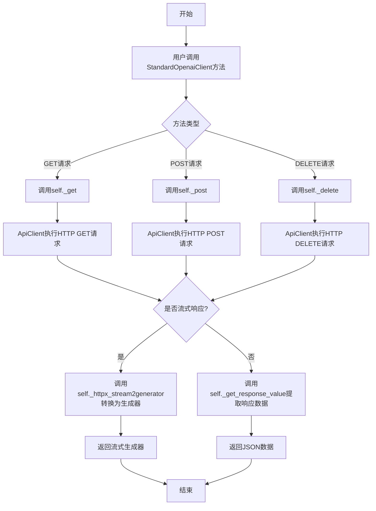

## 类结构

```
ApiClient (基类)
└── StandardOpenaiClient (OpenAI标准API客户端)
```

## 全局变量及字段


### `API_UTI_STANDARD_OPENAI_LIST_MODELS`
    
获取模型列表的API端点路径

类型：`str`
    


### `API_UTI_STANDARD_OPENAI_CHAT_COMPLETIONS`
    
聊天补全功能的API端点路径

类型：`str`
    


### `API_UTI_STANDARD_OPENAI_COMPLETIONS`
    
文本补全功能的API端点路径

类型：`str`
    


### `API_UTI_STANDARD_OPENAI_EMBEDDINGS`
    
文本嵌入功能的API端点路径

类型：`str`
    


### `API_UTI_STANDARD_OPENAI_IMAGE_GENERATIONS`
    
图像生成功能的API端点路径

类型：`str`
    


### `API_UTI_STANDARD_OPENAI_IMAGE_VARIATIONS`
    
图像变体功能的API端点路径

类型：`str`
    


### `API_UTI_STANDARD_OPENAI_IMAGE_EDIT`
    
图像编辑功能的API端点路径

类型：`str`
    


### `API_UTI_STANDARD_OPENAI_AUDIO_TRANSLATIONS`
    
音频翻译功能的API端点路径

类型：`str`
    


### `API_UTI_STANDARD_OPENAI_AUDIO_TRANSCRIPTIONS`
    
音频转录功能的API端点路径

类型：`str`
    


### `API_UTI_STANDARD_OPENAI_AUDIO_SPEECH`
    
文本转语音功能的API端点路径

类型：`str`
    


### `API_UTI_STANDARD_OPENAI_FILES`
    
文件上传功能的API端点路径

类型：`str`
    


### `API_UTI_STANDARD_OPENAI_LIST_FILES`
    
文件列表功能的API端点路径

类型：`str`
    


### `API_UTI_STANDARD_OPENAI_RETRIEVE_FILE`
    
检索文件信息的API端点路径（支持file_id参数）

类型：`str`
    


### `API_UTI_STANDARD_OPENAI_RETRIEVE_FILE_CONTENT`
    
检索文件内容的API端点路径（支持file_id参数）

类型：`str`
    


### `API_UTI_STANDARD_OPENAI_DELETE_FILE`
    
删除文件的API端点路径（支持file_id参数）

类型：`str`
    


    

## 全局函数及方法


### `StandardOpenaiClient.list_models`

该方法是StandardOpenaiClient类中的一个成员方法，用于获取OpenAI标准API支持的模型列表。它通过向`/v1/models`端点发送GET请求，并返回服务器响应的JSON数据。

参数：

- 无显式参数（仅包含隐式参数`self`）

返回值：`dict`，返回OpenAI API支持的模型列表数据，通常包含模型的id、创建时间、拥有者等信息的字典或字典列表。

#### 流程图

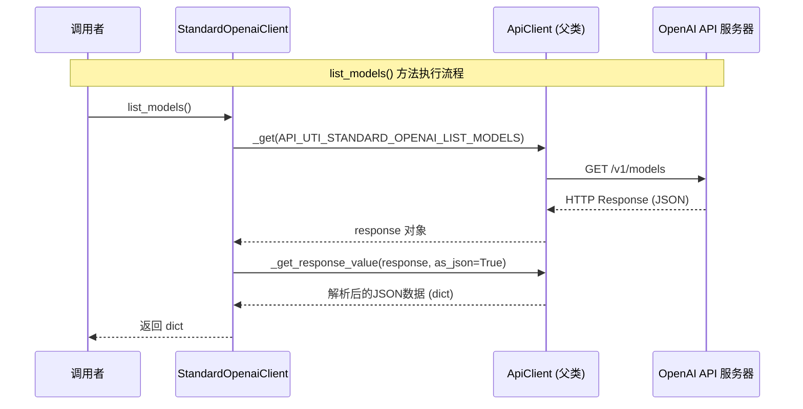

#### 带注释源码

```python
def list_models(self) -> dict:
    """
    获取OpenAI标准API支持的模型列表。
    
    该方法向OpenAI API的/v1/models端点发送GET请求，
    并返回服务器响应的模型列表数据。
    
    Returns:
        dict: 包含模型信息的字典，通常包含 'data' 字段，
             其中 'data' 是模型对象列表，每个对象包含 id, created, owned_by 等字段。
    
    Example:
        >>> client = StandardOpenaiClient(api_key="your-api-key")
        >>> models = client.list_models()
        >>> print(models)
        {
            'object': 'list',
            'data': [
                {'id': 'gpt-4', 'object': 'model', 'created': 1687882411, 'owned_by': 'openai'},
                {'id': 'gpt-3.5-turbo', 'object': 'model', 'created': 1677649963, 'owned_by': 'openai'}
            ]
        }
    """
    # 调用父类ApiClient的_get方法，向API端点发送GET请求
    # API_UTI_STANDARD_OPENAI_LIST_MODELS = "/v1/models"
    response = self._get(API_UTI_STANDARD_OPENAI_LIST_MODELS)
    
    # 调用父类方法_get_response_value解析响应
    # 参数as_json=True表示将响应解析为JSON格式并返回
    # 返回类型为dict
    return self._get_response_value(response, as_json=True)
```


### `StandardOpenaiClient.chat_completions`

该方法用于向 OpenAI Chat Completions API 发送聊天完成请求，通过流式传输（streaming）方式获取实时响应，并将 HTTP 流响应转换为 Python 生成器返回。

参数：

- `chat_input`：`OpenAIChatInput`，聊天输入参数，包含模型、消息列表等配置信息

返回值：`dict`（生成器），流式响应的 JSON 数据块

#### 流程图

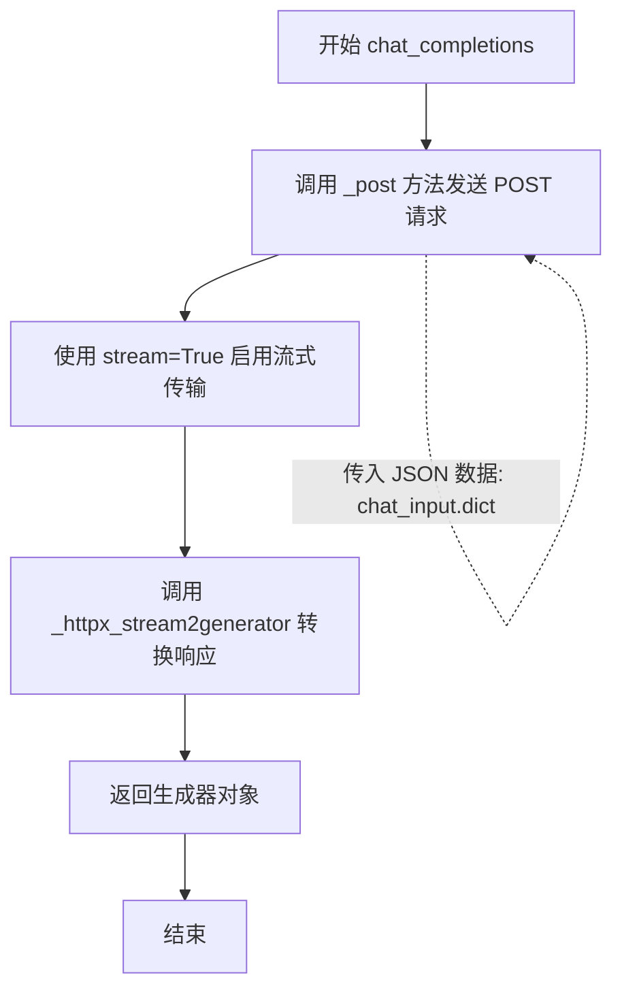

#### 带注释源码

```python
def chat_completions(self, chat_input: OpenAIChatInput) -> dict:
    """
    发送聊天完成请求到 OpenAI API，使用流式传输方式
    
    参数:
        chat_input: OpenAIChatInput 类型的聊天输入，包含模型、消息等配置
        
    返回:
        dict: 流式响应的生成器，可迭代获取每个 JSON 数据块
    """
    # 1. 调用 _post 方法向 OpenAI Chat Completions API 发送 POST 请求
    #    - API_UTI_STANDARD_OPENAI_CHAT_COMPLETIONS = "/v1/chat/completions"
    #    - json=chat_input.dict(): 将 OpenAIChatInput 对象序列化为字典作为 JSON 请求体
    #    - stream=True: 启用 HTTP 流式传输，适用于实时返回部分响应的场景
    response = self._post(API_UTI_STANDARD_OPENAI_CHAT_COMPLETIONS, json=chat_input.dict(), stream=True)
    
    # 2. 将 httpx 的流式响应对象转换为 Python 生成器
    #    - as_json=True: 解析每个流块为 JSON 格式
    #    - 返回生成器类型，可逐个迭代获取流式响应数据
    return self._httpx_stream2generator(response, as_json=True)
```


### `StandardOpenaiClient.completions`

该方法是 StandardOpenaiClient 类的核心方法之一，用于调用 OpenAI 的 Completions API（补全接口），发送聊天输入数据并以流式方式返回模型生成的补全结果。

参数：

- `chat_input`：`OpenAIChatInput`，聊天输入数据模型，包含用户消息、模型参数等信息

返回值：`dict`，流式响应生成器，用于迭代获取服务器返回的补全结果

#### 流程图

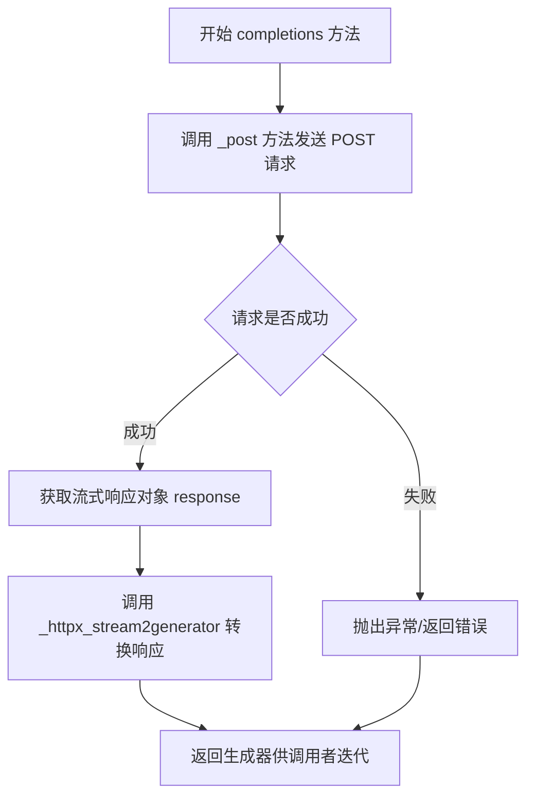

#### 带注释源码

```python
def completions(self, chat_input: OpenAIChatInput) -> dict:
    """
    调用 OpenAI Completions API 获取补全结果
    
    参数:
        chat_input: OpenAIChatInput 类型的聊天输入数据
        
    返回:
        流式响应的生成器对象
    """
    # 使用 _post 方法向 Completions 端点发送 POST 请求
    # 参数 chat_input.dict() 将输入模型转换为字典格式
    # stream=True 启用流式响应模式
    response = self._post(API_UTI_STANDARD_OPENAI_COMPLETIONS, json=chat_input.dict(), stream=True)
    
    # 将 httpx 的流式响应转换为 Python 生成器
    # as_json=True 表示自动解析 JSON 格式
    return self._httpx_stream2generator(response, as_json=True)
```

---

### 补充信息

#### 1. 代码核心功能概述

该代码定义了一个 `StandardOpenaiClient` 类，作为与 OpenAI API 交互的客户端封装，提供了多种 API 调用方法，包括模型列表查询、聊天补全、文本补全、嵌入、图像生成、图像编辑、图像变体、音频翻译、音频转录、语音合成以及文件管理等功能。

#### 2. 文件整体运行流程

```
导入依赖模块 → 定义 API 端点常量 → 定义 StandardOpenaiClient 类 
→ 类继承 ApiClient → 实现各类 API 调用方法 → 暴露给外部调用
```

#### 3. 类详细信息

| 字段/方法 | 类型 | 描述 |
|-----------|------|------|
| `list_models` | 方法 | 获取可用模型列表 |
| `chat_completions` | 方法 | 聊天补全接口（流式） |
| `completions` | 方法 | 文本补全接口（流式） |
| `embeddings` | 方法 | 嵌入向量生成 |
| `image_generations` | 方法 | 图像生成 |
| `image_variations` | 方法 | 图像变体生成 |
| `image_edit` | 方法 | 图像编辑 |
| `audio_translations` | 方法 | 音频翻译 |
| `audio_transcriptions` | 方法 | 音频转录 |
| `audio_speech` | 方法 | 语音合成 |
| `files` | 方法 | 文件上传（异步，待完成） |
| `list_files` | 方法 | 列出文件 |
| `retrieve_file` | 方法 | 获取文件信息 |
| `retrieve_file_content` | 方法 | 获取文件内容 |
| `delete_file` | 方法 | 删除文件 |

#### 4. 全局变量/常量

| 名称 | 类型 | 描述 |
|------|------|------|
| `API_UTI_STANDARD_OPENAI_LIST_MODELS` | str | 模型列表端点 |
| `API_UTI_STANDARD_OPENAI_CHAT_COMPLETIONS` | str | 聊天补全端点 |
| `API_UTI_STANDARD_OPENAI_COMPLETIONS` | str | 补全端点 |
| `API_UTI_STANDARD_OPENAI_EMBEDDINGS` | str | 嵌入端点 |
| `API_UTI_STANDARD_OPENAI_IMAGE_GENERATIONS` | str | 图像生成端点 |
| `API_UTI_STANDARD_OPENAI_IMAGE_VARIATIONS` | str | 图像变体端点 |
| `API_UTI_STANDARD_OPENAI_IMAGE_EDIT` | str | 图像编辑端点 |
| `API_UTI_STANDARD_OPENAI_AUDIO_TRANSLATIONS` | str | 音频翻译端点 |
| `API_UTI_STANDARD_OPENAI_AUDIO_TRANSCRIPTIONS` | str | 音频转录端点 |
| `API_UTI_STANDARD_OPENAI_AUDIO_SPEECH` | str | 语音合成端点 |
| `API_UTI_STANDARD_OPENAI_FILES` | str | 文件上传端点 |
| `API_UTI_STANDARD_OPENAI_LIST_FILES` | str | 文件列表端点 |
| `API_UTI_STANDARD_OPENAI_RETRIEVE_FILE` | str | 文件检索端点 |
| `API_UTI_STANDARD_OPENAI_RETRIEVE_FILE_CONTENT` | str | 文件内容获取端点 |
| `API_UTI_STANDARD_OPENAI_DELETE_FILE` | str | 文件删除端点 |

#### 5. 关键组件信息

| 组件名称 | 描述 |
|----------|------|
| `ApiClient` | 基类，提供 HTTP 请求底层实现（`_get`, `_post`, `_delete`, `_httpx_stream2generator` 等） |
| `OpenAIChatInput` | 聊天输入数据模型类 |
| `_httpx_stream2generator` | 将 httpx 流式响应转换为 Python 生成器的工具方法 |

#### 6. 潜在技术债务与优化空间

1. **重复代码**：多个 API 方法的实现模式高度相似，可考虑提取公共逻辑
2. **待完成功能**：`files` 方法标记为 TODO，参数未使用，逻辑未实现
3. **端点 URL 错误**：部分 URL 存在双斜杠（如 `/v1//images/...`），虽然可能不影响功能但不规范
4. **类型注解不完整**：部分方法返回 `dict` 而非更具体的类型，建议使用泛型定义具体响应结构
5. **错误处理缺失**：方法中未看到显式的异常处理逻辑

#### 7. 其它项目

**设计目标与约束：**

- 遵循 OpenAI API 规范
- 使用流式响应提升用户体验
- 统一使用 Pydantic 模型进行数据验证

**错误处理与异常设计：**

- 依赖基类 `ApiClient` 的异常处理机制
- 建议在调用处捕获可能的网络异常和 API 错误响应

**数据流与状态机：**

- 输入：用户构造 `OpenAIChatInput` 模型
- 处理：通过 HTTP POST 发送请求
- 输出：流式 Generator，可迭代获取各 chunk

**外部依赖与接口契约：**

- 依赖 `open_chatcaht` 包的内部模块
- 依赖 `httpx` 库进行 HTTP 请求


### `StandardOpenaiClient.embeddings`

该方法用于调用OpenAI的Embeddings API，将文本转换为向量嵌入表示。它接收一个OpenAIEmbeddingsInput对象作为输入，通过POST请求向嵌入端点发送数据，并返回解析后的JSON响应结果。

参数：

- `embeddings_input`：`OpenAIEmbeddingsInput`，嵌入操作的输入参数，包含模型选择、文本输入等配置信息

返回值：`dict`，返回嵌入向量结果，通常包含向量数据和元信息

#### 流程图

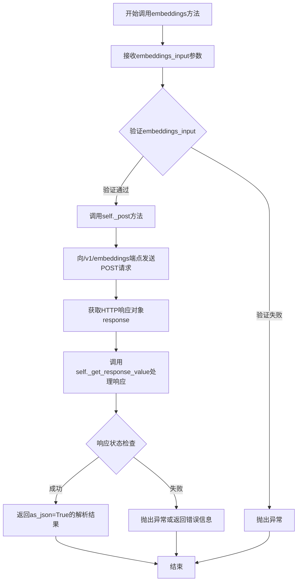

#### 带注释源码

```python
def embeddings(self, embeddings_input: OpenAIEmbeddingsInput):
    """
    调用OpenAI Embeddings API获取文本嵌入向量
    
    该方法将输入的文本转换为向量表示，用于后续的相似度计算、
    语义搜索、特征提取等场景。
    
    参数:
        embeddings_input: OpenAIEmbeddingsInput类型
            包含以下关键配置:
            - model: 指定的嵌入模型(如text-embedding-ada-002)
            - input: 要嵌入的文本或文本列表
            
    返回:
        dict: 包含嵌入向量的响应数据，通常结构为:
            {
                "object": "list",
                "data": [
                    {
                        "object": "embedding",
                        "embedding": [浮点数向量数组],
                        "index": 0
                    }
                ],
                "model": "模型名称",
                "usage": {"prompt_tokens": N, "total_tokens": M}
            }
    """
    # 使用_post方法发送HTTP POST请求
    # 将embeddings_input转换为字典格式(JSON)发送给API端点
    response = self._post(
        API_UTI_STANDARD_OPENAI_EMBEDDINGS,  # 嵌入API端点: /v1/embeddings
        json=embeddings_input.dict()         # 将Pydantic模型序列化为字典
    )
    
    # 处理响应结果，as_json=True表示将响应解析为Python字典
    return self._get_response_value(response, as_json=True)
```


### `StandardOpenaiClient.image_generations`

该方法是StandardOpenaiClient类中用于调用OpenAI图像生成API的核心方法，通过接收OpenAI图像生成输入参数（包含提示词、模型、生成数量等），向服务器发送POST请求并返回生成的图像数据。

参数：

- `data`：`OpenAIImageGenerationsInput`，图像生成输入参数对象，包含生成图像所需的提示词、模型、图像数量、尺寸等配置信息

返回值：`dict`，包含生成的图像URL或图像Base64数据的响应结果

#### 流程图

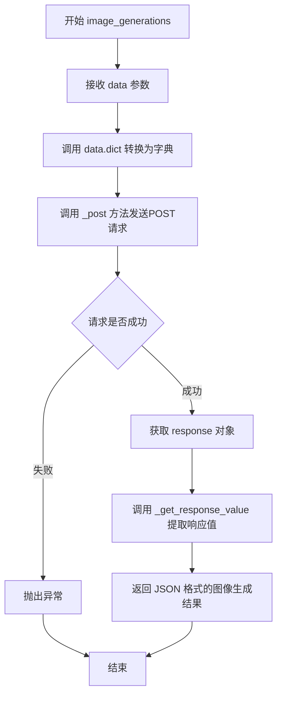

#### 带注释源码

```python
def image_generations(
        self,
        data: OpenAIImageGenerationsInput,
):
    """
    调用 OpenAI 图像生成 API 生成图像
    
    Args:
        data: OpenAIImageGenerationsInput 类型的输入参数，包含：
              - prompt: str, 生成图像的文本描述
              - n: int, 生成图像的数量
              - size: str, 图像尺寸（如 1024x1024）
              - model: str, 使用的模型（可选）
              - response_format: str, 返回格式（url 或 b64_json）
              - user: str, 用户标识（可选）
    
    Returns:
        dict: 包含生成图像结果的字典，通常包含 'data' 字段，
              其中每个元素包含 'url' 或 'b64_json' 字段
    """
    # 使用 _post 方法向图像生成端点发送 POST 请求
    # 将 data 对象转换为字典格式作为请求体
    response = self._post(API_UTI_STANDARD_OPENAI_IMAGE_GENERATIONS, json=data.dict())
    
    # 从响应对象中提取 JSON 格式的数据并返回
    return self._get_response_value(response, as_json=True)
```


### `StandardOpenaiClient.image_variations`

该方法是 StandardOpenaiClient 类中用于调用 OpenAI 图像变体生成 API 的核心方法。通过接收包含图像变体参数的输入数据对象，构造 POST 请求发送到 `/v1/images/variations` 端点，并将 API 返回的 JSON 响应转换为字典格式供调用方使用。

**参数：**

- `data`：`OpenAIImageVariationsInput`，包含生成图像变体所需的参数，如原始图像、变体数量、尺寸等输入数据

**返回值：**

- `dict`，返回 OpenAI API 生成的图像变体结果，通常包含生成的图像 URL 或 Base64 编码数据

#### 流程图

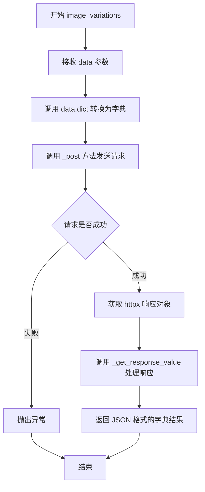

#### 带注释源码

```python
def image_variations(
        self,
        data: OpenAIImageVariationsInput,
):
    """
    生成图像变体
    
    参数:
        data: OpenAIImageVariationsInput 类型，包含生成图像变体所需的参数
              如原始图像、变体数量、尺寸等
    
    返回:
        dict: API 返回的图像变体结果，包含生成的图像信息
    """
    # 使用 _post 方法向 OpenAI API 端点发送 POST 请求
    # 将 data 对象转换为字典格式作为请求体 JSON
    response = self._post(API_UTI_STANDARD_OPENAI_IMAGE_VARIATIONS, json=data.dict())
    
    # 调用 _get_response_value 方法解析响应
    # as_json=True 表示将响应内容解析为 JSON 格式并返回字典
    return self._get_response_value(response, as_json=True)
```


### `StandardOpenaiClient.image_edit`

该方法是 StandardOpenaiClient 类中的图像编辑功能，接收 OpenAIImageEditsInput 类型的输入数据，通过 POST 请求调用 OpenAI 的图像编辑 API 端点，并返回处理后的 JSON 响应结果。

参数：

- `data`：`OpenAIImageEditsInput`，包含图像编辑所需的输入参数（如原图、提示词等）

返回值：`dict`，API 返回的图像编辑结果（JSON 格式）

#### 流程图

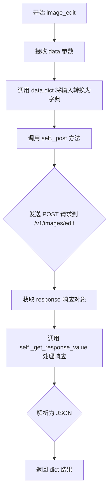

#### 带注释源码

```python
def image_edit(
        self,
        data: OpenAIImageEditsInput,
):
    """
    执行图像编辑操作
    
    参数:
        data: OpenAIImageEditsInput 对象，包含图像编辑所需的参数
              （如原图路径、编辑提示词、遮罩等）
    
    返回:
        dict: API 返回的图像编辑结果，包含编辑后的图像 URL 或相关数据
    """
    # 使用 POST 方法调用图像编辑 API 端点
    # 将 data 对象转换为字典作为 JSON 请求体
    response = self._post(API_UTI_STANDARD_OPENAI_IMAGE_EDIT, json=data.dict())
    
    # 解析响应为 JSON 格式并返回
    return self._get_response_value(response, as_json=True)
```


### `StandardOpenaiClient.audio_translations`

该方法是 `StandardOpenaiClient` 类中的音频翻译功能，用于将音频文件中的语音内容翻译成目标语言并返回翻译结果。它接收 `OpenAIAudioTranslationsInput` 类型的输入数据，通过 POST 请求发送到 OpenAI 的音频翻译 API 端点，并返回解析后的 JSON 响应。

参数：

- `data`：`OpenAIAudioTranslationsInput`，包含音频翻译所需的输入参数（如音频文件、模型、语言等）

返回值：`dict`，API 返回的翻译结果数据，通常包含翻译后的文本内容

#### 流程图

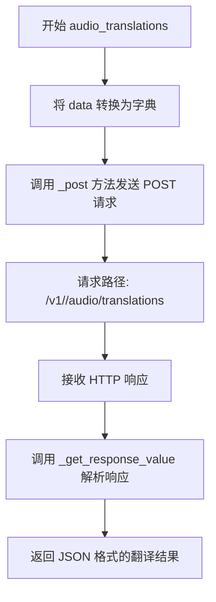

#### 带注释源码

```python
def audio_translations(
        self,
        data: OpenAIAudioTranslationsInput,
):
    """
    音频翻译功能：将音频文件中的语音内容翻译成目标语言
    
    参数:
        data: OpenAIAudioTranslationsInput 类型，包含翻译所需的输入参数
              （如音频文件路径、模型名称、目标语言等）
    
    返回:
        dict: 包含翻译结果的字典，通常包含翻译后的文本内容
    """
    # 使用 POST 方法向音频翻译 API 端点发送请求
    # 将 data 对象转换为字典格式作为请求体
    response = self._post(API_UTI_STANDARD_OPENAI_AUDIO_TRANSLATIONS, json=data.dict())
    
    # 解析响应内容并返回 JSON 格式的数据
    return self._get_response_value(response, as_json=True)
```


### `StandardOpenaiClient.audio_transcriptions`

该方法是StandardOpenaiClient类中用于调用OpenAI音频转录API的核心方法，接收OpenAIAudioTranscriptionsInput类型的输入数据，通过POST请求发送到`/v1/audio/transcriptions`端点，并将响应解析为JSON格式返回。

参数：

-  `data`：`OpenAIAudioTranscriptionsInput`，包含音频转录所需的参数，如音频文件、模型、语言等

返回值：`dict`，返回OpenAI音频转录API的响应结果，包含转录文本等信息

#### 流程图

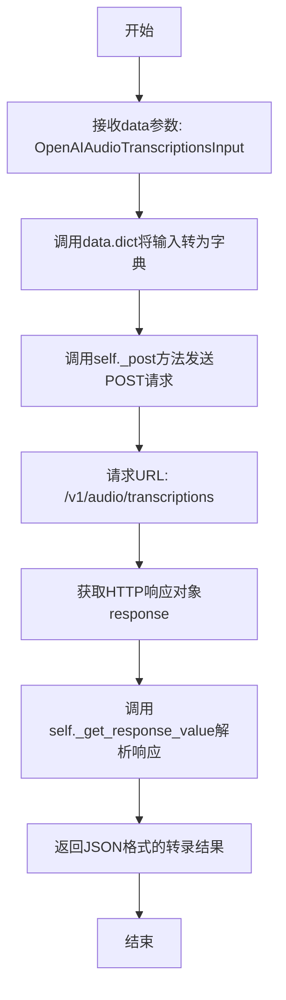

#### 带注释源码

```python
def audio_transcriptions(
        self,
        data: OpenAIAudioTranscriptionsInput,
):
    """
    调用OpenAI音频转录API，将音频文件转换为文字
    
    参数:
        data: OpenAIAudioTranscriptionsInput类型，包含音频转录所需的参数
              如audio文件路径、model选择、language等
    
    返回:
        dict: 包含转录文本的JSON响应
    """
    # 将输入对象转换为字典格式，用于JSON请求体
    # data.dict()会提取OpenAIAudioTranscriptionsInput的所有字段
    response = self._post(
        API_UTI_STANDARD_OPENAI_AUDIO_TRANSCRIPTIONS,  # API端点: /v1/audio/transcriptions
        json=data.dict()  # 将输入数据作为JSON请求体发送
    )
    # 解析HTTP响应，提取JSON内容并返回
    return self._get_response_value(response, as_json=True)
```


### `StandardOpenaiClient.audio_speech`

该方法用于调用OpenAI的文本转语音（Text-to-Speech）API，将输入的文本内容转换为音频文件。

参数：

- `data`：`OpenAIAudioSpeechInput`，包含文本转语音所需的输入参数（如要转换的文本、语音模型、声音类型等）

返回值：`dict`，返回生成的音频数据，通常为二进制音频内容或包含音频URL的响应

#### 流程图

```mermaid
graph TD
    A[开始 audio_speech] --> B[接收 data 参数]
    B --> C[调用 data.dict() 转换为字典]
    C --> D[调用 _post 方法发送POST请求]
    D --> E[请求路径: /v1/audio/speech]
    E --> F[接收响应 response]
    F --> G[调用 _get_response_value 处理响应]
    G --> H[返回 JSON 格式的音频数据]
    H --> I[结束]
```

#### 带注释源码

```python
def audio_speech(
        self,
        data: OpenAIAudioSpeechInput,
):
    """
    调用OpenAI文本转语音API，将文本转换为音频
    
    参数:
        data: OpenAIAudioSpeechInput对象，包含以下关键字段:
            - model: 使用的语音模型(如tts-1, tts-1-hd)
            - input: 要转换的文本内容
            - voice: 使用的声音(如alloy, echo, fable等)
            - response_format: 返回的音频格式(如mp3, opus等)
            - speed: 播放速度(0.25-4.0)
    
    返回:
        dict: 包含生成音频数据的响应，通常是二进制音频内容或音频URL
    """
    # 将输入对象转换为字典格式，用于JSON请求体
    response = self._post(API_UTI_STANDARD_OPENAI_AUDIO_SPEECH, json=data.dict())
    # 处理HTTP响应，转换为JSON格式返回
    return self._get_response_value(response, as_json=True)
```


### `StandardOpenaiClient.files`

该方法是一个异步方法，用于向 OpenAI API 的文件上传端点发送请求，目前标记为待完成状态，接收文件路径和用途参数，但未实际使用这些参数进行请求。

参数：

- `self`：标准 OpenAI 客户端实例
- `file`：`str`，要上传的文件路径
- `purpose`：`str`，默认值 `"assistants"`，文件用途

返回值：`Dict`，API 响应的 JSON 数据

#### 流程图

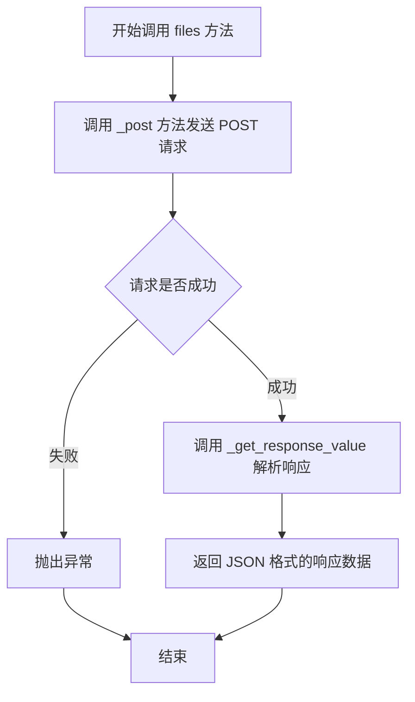

#### 带注释源码

```python
async def files(
        self,
        file: str,
        purpose: str = "assistants",
) -> Dict:
    """
    上传文件到 OpenAI API
    注意：当前方法为待完成状态，file 和 purpose 参数未实际使用
    
    参数:
        file: 要上传的文件路径
        purpose: 文件用途，默认为 "assistants"
    
    返回:
        Dict: API 响应的 JSON 数据
    """
    # 向 /v1/files 端点发送 POST 请求
    # 注意：此处未传递任何参数（file 和 purpose 均未使用）
    response = self._post(API_UTI_STANDARD_OPENAI_FILES)
    
    # 解析响应为 JSON 格式并返回
    return self._get_response_value(response, as_json=True)
```


### `StandardOpenaiClient.list_files`

该方法用于从 OpenAI 标准 API 获取文件列表，支持通过 `purpose` 参数过滤特定用途的文件，并返回包含文件详细信息的字典。

参数：

- `purpose`：`str`，用于过滤特定用途的文件（如 "assistants"、"fine-tune" 等）

返回值：`Dict[str, List[Dict]]`，返回文件列表的字典，包含文件 ID、文件名、大小、创建时间等信息

#### 流程图

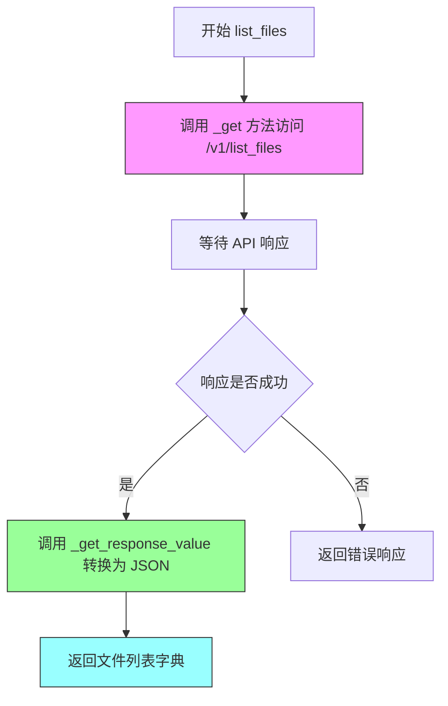

#### 带注释源码

```python
def list_files(self, purpose: str) -> Dict[str, List[Dict]]:
    """
    列出所有文件，支持通过 purpose 参数过滤文件列表
    
    Args:
        purpose: 文件用途过滤条件，可选值如 "assistants"、"fine-tune" 等
        
    Returns:
        包含文件列表的字典，结构为 {"data": [file_info_1, file_info_2, ...]}
        
    Note:
        当前 purpose 参数未在请求中使用，可能需要在 API_UTI_STANDARD_OPENAI_LIST_FILES
        中添加查询参数，或者该功能尚未完全实现
    """
    # 调用内部 _get 方法访问列表文件 API 端点
    response = self._get(API_UTI_STANDARD_OPENAI_LIST_FILES)
    
    # 将 HTTP 响应转换为 JSON 格式的字典并返回
    return self._get_response_value(response, as_json=True)
```


### `StandardOpenaiClient.retrieve_file`

该方法通过文件ID从OpenAI API检索特定文件的元数据信息，并返回包含文件详细信息的字典。

参数：

- `file_id`：`str`，文件的唯一标识符，用于指定要检索的文件

返回值：`Dict`，包含文件元数据的字典，如文件ID、文件名、大小、创建时间等信息

#### 流程图

```mermaid
flowchart TD
    A[开始 retrieve_file] --> B[接收 file_id 参数]
    B --> C[格式化API端点 URL<br/>API_UTI_STANDARD_OPENAI_RETRIEVE_FILE.format&#40;file_id=file_id&#41;]
    C --> D[调用 self._get&#40;url&#41; 发起GET请求]
    D --> E[获取 HTTP 响应对象]
    E --> F[调用 self._get_response_value&#40;response, as_json=True&#41; 解析响应]
    F --> G[返回包含文件元数据的 Dict]
    G --> H[结束]
```

#### 带注释源码

```python
def retrieve_file(self, file_id: str) -> Dict:
    """
    根据文件ID检索OpenAI文件信息
    
    Args:
        file_id: 文件的唯一标识符，用于指定要检索的文件
        
    Returns:
        Dict: 包含文件元数据的字典，包含file_id、filename、purpose、bytes、created_at等字段
    """
    # 使用file_id格式化API端点URL，替换占位符{file_id}
    # API_UTI_STANDARD_OPENAI_RETRIEVE_FILE = "/v1//files/{file_id}"
    formatted_url = API_UTI_STANDARD_OPENAI_RETRIEVE_FILE.format(file_id=file_id)
    
    # 调用父类ApiClient的_get方法发起HTTP GET请求
    response = self._get(formatted_url)
    
    # 解析响应为JSON格式并返回字典
    return self._get_response_value(response, as_json=True)
```


### `StandardOpenaiClient.retrieve_file_content`

该方法是 StandardOpenaiClient 类中用于从 OpenAI API 检索指定文件内容的核心方法，通过构造包含 file_id 的 API 端点 URL，调用内部的 GET 请求方法获取文件内容响应，并返回解析后的 JSON 格式数据。

参数：

- `file_id`：`str`，要检索的文件的唯一标识符

返回值：`Dict`，包含文件内容的字典类型响应数据

#### 流程图

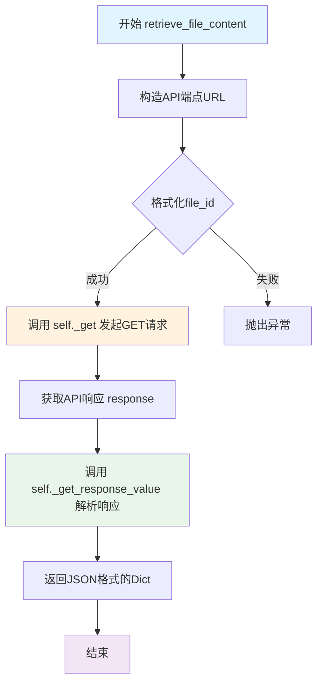

#### 带注释源码

```python
def retrieve_file_content(self, file_id: str) -> Dict:
    """
    从OpenAI API检索指定文件的內容
    
    Args:
        file_id: 文件的唯一标识符,用于指定要检索的文件
    
    Returns:
        Dict: 包含文件内容的JSON响应数据
    
    Raises:
        ValueError: 如果file_id为空或格式不正确
        APIError: 如果API调用失败
    """
    # 格式化API端点URL,将file_id替换到URL模板中的占位符
    # API_UTI_STANDARD_OPENAI_RETRIEVE_FILE_CONTENT = "/v1//files/{file_id}/content"
    api_endpoint = API_UTI_STANDARD_OPENAI_RETRIEVE_FILE_CONTENT.format(file_id=file_id)
    
    # 调用父类的_get方法发起HTTP GET请求
    # 该方法内部处理了连接管理、请求头设置等底层逻辑
    response = self._get(api_endpoint)
    
    # 调用内部方法将响应转换为JSON格式的Dict
    # 参数as_json=True表示将响应体解析为JSON
    # 该方法内部处理了错误检查、响应验证等逻辑
    return self._get_response_value(response, as_json=True)
```

#### 关键组件信息

| 组件名称 | 一句话描述 |
|---------|-----------|
| `API_UTI_STANDARD_OPENAI_RETRIEVE_FILE_CONTENT` | API端点URL模板，定义了文件内容检索的接口地址 |
| `ApiClient._get` | 父类方法，负责发起HTTP GET请求 |
| `ApiClient._get_response_value` | 父类方法，负责解析HTTP响应并提取数据 |

#### 潜在技术债务与优化空间

1. **缺少参数校验**：方法未对 `file_id` 进行有效性校验（如空值、格式验证），可能导致无效请求
2. **错误处理缺失**：未显式处理网络异常、API错误响应等情况
3. **返回类型不精确**：返回类型声明为 `Dict`，建议改为更具体的类型定义以提升类型安全性和代码可读性
4. **URL双斜号问题**：观察到API路径中存在双斜号（如 `/v1//files/`），可能是拼写错误，建议统一规范
5. **文档注释不完整**：缺少对可能抛出异常的说明，与代码中的docstring不一致

#### 其他设计考量

- **设计目标**：提供标准化的OpenAI文件内容检索接口，封装底层HTTP通信细节
- **约束条件**：依赖父类 `ApiClient` 的实现，需确保父类方法可用
- **错误处理**：当前依赖父类 `_get_response_value` 的隐式错误处理，建议增强
- **外部依赖**：依赖 `ApiClient` 基类和 `API_UTI_STANDARD_OPENAI_RETRIEVE_FILE_CONTENT` 常量


### StandardOpenaiClient.delete_file

删除指定ID的文件，通过调用API的DELETE端点实现文件删除功能。

参数：

- `file_id`：`str`，文件的唯一标识符，用于指定要删除的文件

返回值：`Dict`，包含删除操作的结果数据（如删除状态、文件信息等）

#### 流程图

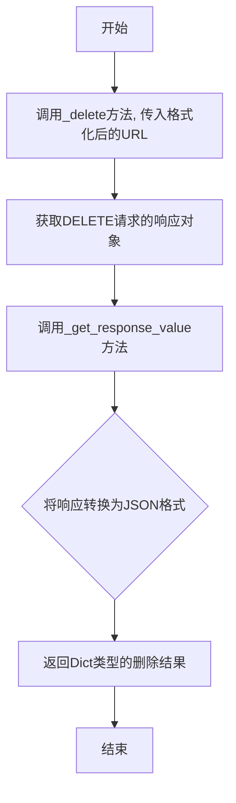

#### 带注释源码

```
def delete_file(self, file_id: str) -> Dict:
    """
    删除指定ID的文件
    
    Args:
        file_id: 文件的唯一标识符
        
    Returns:
        包含删除操作结果的字典
    """
    # 使用_delete方法调用API的DELETE端点
    # 通过API_UTI_STANDARD_OPENAI_DELETE_FILE模板格式化URL
    # 模板为: /v1//files/{file_id}
    response = self._delete(API_UTI_STANDARD_OPENAI_DELETE_FILE.format(file_id=file_id))
    
    # 获取响应值并将结果转换为JSON格式返回
    return self._get_response_value(response, as_json=True)
```

## 关键组件


### API端点常量

定义了与OpenAI API交互的各种服务端点URI，包括模型列表、聊天完成、嵌入、图像生成、图像编辑、图像变体、音频翻译、音频转录、音频语音、文件操作等相关的API路径。

### StandardOpenaiClient类

继承自ApiClient的客户端类，提供对OpenAI标准API的完整调用能力，包括聊天完成、文本补全、嵌入生成、图像生成、图像编辑、图像变体、音频翻译、音频转录、音频语音合成以及文件管理等功能。

### 聊天完成方法 (chat_completions, completions)

处理聊天补全请求，支持流式响应返回。chat_completions和completions方法功能相同，都通过POST请求发送到聊天补全端点，将输入转换为字典并以流式方式返回生成器结果。

### 嵌入生成方法 (embeddings)

将文本转换为向量表示，接收OpenAIEmbeddingsInput对象作为输入，返回JSON格式的嵌入向量结果。

### 图像处理方法 (image_generations, image_variations, image_edit)

分别处理图像生成、图像变体和图像编辑请求。image_generations用于根据描述生成新图像，image_variations用于创建图像变体，image_edit用于编辑现有图像。三者都接收相应的输入类型并返回JSON结果。

### 音频处理方法 (audio_translations, audio_transcriptions, audio_speech)

处理三类音频任务：audio_translations将音频翻译为英文，audio_transcriptions将音频转录为文本，audio_speech将文本转换为语音。所有方法都接收对应的输入类型并返回JSON格式结果。

### 文件管理方法 (list_models, list_files, retrieve_file, retrieve_file_content, delete_file)

提供完整的文件操作能力：list_models列出可用模型，list_files列出已上传文件，retrieve_file获取文件信息，retrieve_file_content获取文件内容，delete_file删除指定文件。所有方法都通过相应的HTTP方法（GET或DELETE）调用API并返回JSON结果。

### 模型列表方法 (list_models)

获取当前可用的OpenAI模型列表，通过GET请求访问模型端点并返回完整的模型信息JSON响应。


## 问题及建议


### 已知问题

-   **API路径语法错误**：多个常量定义中存在双斜杠（`/v1//images/...`），应修正为 `/v1/images/...`
-   **端点重复定义**：`API_UTI_STANDARD_OPENAI_COMPLETIONS` 与 `API_UTI_STANDARD_OPENAI_CHAT_COMPLETIONS` 的值完全相同，造成冗余
-   **未完成功能**：`files` 方法标记为 TODO，参数 `file` 和 `purpose` 未被使用，方法体未实现文件上传逻辑
-   **类型注解不一致**：`list_files` 方法声明返回 `Dict[str, List[Dict]]`，但实际返回类型取决于 `_get_response_value` 的实现；`embeddings` 方法缺少返回类型注解
-   **参数未使用**：`files` 方法接收 `file` 和 `purpose` 参数但未使用，且未实现文件上传的 multipart 请求处理
-   **文档缺失**：类和方法均无 docstring，缺少功能说明和使用指导
-   **异常处理缺失**：所有方法均无 try-except 包装，网络请求失败时会导致未捕获异常上抛
-   **参数验证缺失**：方法入口处无输入参数校验（如 `file_id` 格式、`purpose` 合法性等）

### 优化建议

-   修正所有 API 路径常量中的双斜杠问题，统一使用单斜杠格式
-   移除重复的端点定义 `API_UTI_STANDARD_OPENAI_COMPLETIONS`
-   完成 `files` 方法的实现，支持文件上传功能，使用 `httpx` 的 `MultipartFormDataLoader` 或构造 `files` 参数
-   补充方法返回类型注解，确保与实际返回值一致
-   为所有公开方法添加 docstring，说明功能、参数和返回值
-   在关键方法中添加异常处理，捕获网络超时、API 错误等常见异常
-   对关键参数（如 `file_id`、`purpose`）添加前置校验，提升接口健壮性
-   考虑将默认 purpose 值提取为常量或配置，避免硬编码
-   统一 streaming 和非 streaming 方法的返回类型约定，或在文档中明确说明调用方处理差异

## 其它


### 设计目标与约束

本模块旨在提供对OpenAI标准API的封装支持，实现统一的接口调用规范，简化与OpenAI服务的交互流程。设计目标包括：1）提供同步和流式响应支持；2）覆盖OpenAI主要API端点（模型、聊天、补全、嵌入、图像、音频、文件等）；3）遵循RESTful风格设计；4）保持与ApiClient基类的一致性。约束条件包括：依赖open_chatcaht框架、Python版本需支持类型注解、需处理网络异常和API错误响应。

### 错误处理与异常设计

错误处理采用分层设计：1）ApiClient基类负责HTTP层面的异常捕获（连接超时、SSL错误等）；2）本模块通过_get_response_value方法处理响应状态码，解析错误消息；3）流式响应通过_generator转换，异常会在迭代时抛出。设计建议：应定义自定义异常类（如StandardOpenaiError），区分API错误（4xx/5xx）与网络错误；应记录详细错误上下文（请求URL、参数、响应体）；todo注释的files方法实现不完整，需补充错误处理逻辑。

### 数据流与状态机

数据流遵循请求→序列化→HTTP调用→响应处理→反序列化→返回的流程。类方法分为四类操作：1）GET操作（list_models、list_files、retrieve_file、retrieve_file_content）；2）POST非流式操作（embeddings、image_generations、image_variations、image_edit、audio系列）；3）POST流式操作（chat_completions、completions）；4）DELETE操作（delete_file）。状态转换：客户端实例化→调用对应方法→发送请求→接收响应→返回结果（同步或生成器）。流式响应通过_post配合stream=True参数，使用_httpx_stream2generator转换为生成器。

### 外部依赖与接口契约

核心依赖：1）open_chatcaht.api_client.ApiClient：基类，提供_get/_post/_delete/_httpx_stream2generator等方法；2）open_chatcaht.types标准输入类型（OpenAIChatInput、OpenAIEmbeddingsInput等）；3）httpx库：HTTP客户端（由ApiClient使用）。接口契约：所有公开方法接受特定输入类型（Data Class），返回dict或生成器；API端点常量定义在模块级别；文件操作使用file_id作为路径参数。注意事项：部分API URI存在双斜杠（如"/v1//images/"），需确认为有意设计还是拼写错误。

### 安全性考虑

当前实现未包含认证和授权机制，假设由ApiClient基类或外部框架处理。安全性建议：1）API密钥应通过环境变量或安全配置管理，不应硬编码；2）敏感操作（如文件删除）应添加确认机制；3）文件内容获取需考虑数据脱敏；4）网络请求建议使用HTTPS；5）可添加请求签名或Token验证机制。

### 性能考虑

性能优化点：1）流式响应减少内存占用，通过生成器按需获取数据；2）连接池复用（由httpx/ApiClient管理）；3）嵌入操作和图像操作无需流式处理，直接返回完整响应。潜在瓶颈：1）大文件传输（retrieve_file_content）可能占用大量内存；2）同步方法在高频调用时可能阻塞；3）网络延迟受限于OpenAI服务响应时间。优化建议：考虑添加异步版本方法（async/await），实现请求重试机制，添加超时配置。

### 兼容性设计

版本兼容性：1）依赖Python 3.7+的typing模块；2）输入类型使用Pydantic Data Class，支持序列化/反序列化；3）响应返回dict，兼容JSON格式。API兼容性：OpenAI API版本通过端点路径体现（/v1/），需关注版本演进。向后兼容：现有方法签名不宜频繁变更，新增可选参数需有默认值。限制：当前不支持Azure OpenAI、OpenAI兼容API（如本地部署模型）的配置切换。

### 监控与日志

监控指标建议：1）API调用成功率/失败率；2）响应时间分布；3）各端点调用频次；4）流式响应中断率。日志记录建议：1）请求日志（URL、方法、非敏感参数）；2）响应状态码；3）错误详情（不含敏感信息）；4）性能指标（耗时）。日志级别：DEBUG用于开发调试，INFO用于常规调用，WARNING用于可恢复错误，ERROR用于关键故障。

### 配置管理

配置项建议：1）基础URL（ApiClient层配置）；2）超时时间（连接超时、读取超时）；3）重试策略（最大重试次数、退避算法）；4）流式处理参数（块大小）；5）代理配置。当前代码中未包含配置类，建议通过构造函数或环境变量扩展配置能力。

### 版本管理

版本策略建议：1）遵循语义化版本（MAJOR.MINOR.PATCH）；2）API端点变更需升级MAJOR版本；3）新增方法为MINOR版本；4）文档和类型修复为PATCH版本。当前代码无版本标识，建议添加__version__常量或使用setuptools配置管理。

### 测试策略

测试覆盖建议：1）单元测试：每个方法的基本功能验证；2）集成测试：与OpenAI API的实际交互（需Mock或测试环境）；3）流式响应测试：验证生成器行为；4）错误处理测试：模拟网络异常和API错误；5）类型检查：使用mypy验证类型注解。当前todo标记的files方法需补充测试覆盖。


    