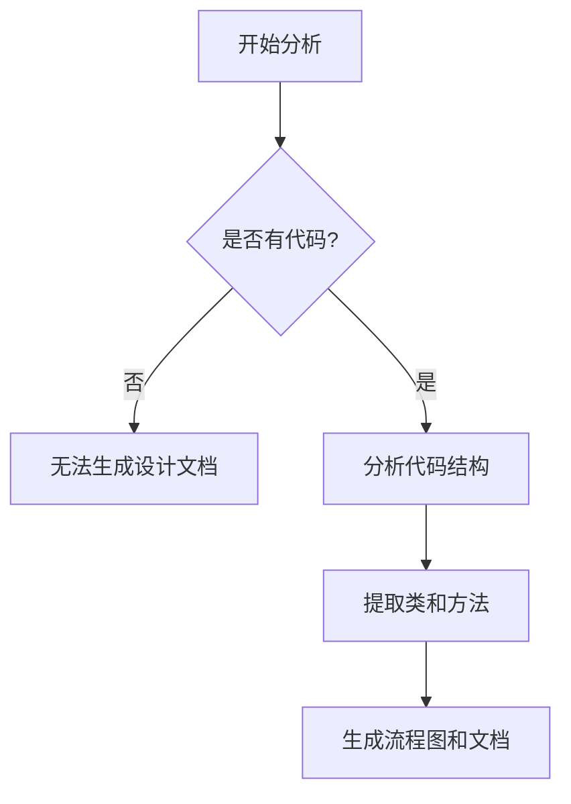

# `Langchain-Chatchat\libs\python-sdk\open_chatcaht\api\tools\__init__.py` 详细设计文档

未提供源代码，无法生成描述

## 整体流程



## 类结构

```

```

## 全局变量及字段


    

## 全局函数及方法


## 关键组件


无法生成设计文档，因为未提供源代码。请在"代码"部分提供需要分析的代码。


## 问题及建议


### 已知问题

-   代码内容为空，未提供待分析的源代码文件

### 优化建议

-   请提供完整的源代码内容以便进行分析和技术债务识别
-   建议在代码准备完成后重新提交分析请求


## 其它


### 设计目标与约束

无（代码为空，无法分析设计目标与约束）

### 错误处理与异常设计

无（代码为空，无法分析错误处理机制）

### 数据流与状态机

无（代码为空，无法分析数据流与状态机）

### 外部依赖与接口契约

无（代码为空，无法分析外部依赖与接口）

### 性能要求与资源约束

无（代码为空，无法分析性能要求）

### 安全性设计

无（代码为空，无法分析安全性设计）

### 可扩展性与可维护性设计

无（代码为空，无法分析可扩展性与可维护性）

### 测试策略

无（代码为空，无法分析测试策略）

### 部署与配置

无（代码为空，无法分析部署与配置）

### 版本兼容性

无（代码为空，无法分析版本兼容性）

### 监控与日志

无（代码为空，无法分析监控与日志设计）

### 并发与线程安全

无（代码为空，无法分析并发与线程安全）

### 国际化与本地化

无（代码为空，无法分析国际化与本地化）


    