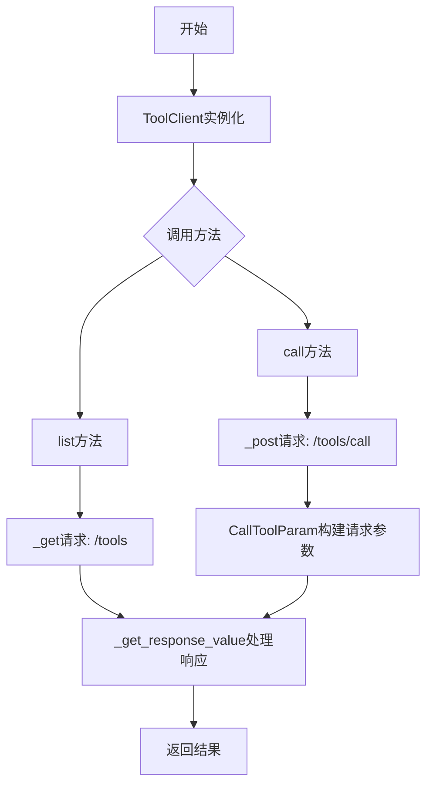
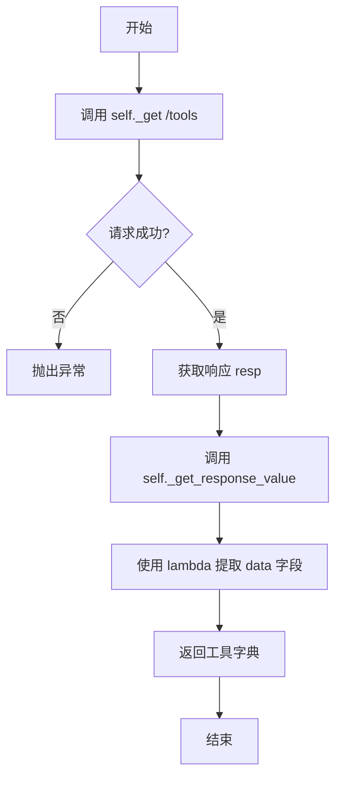
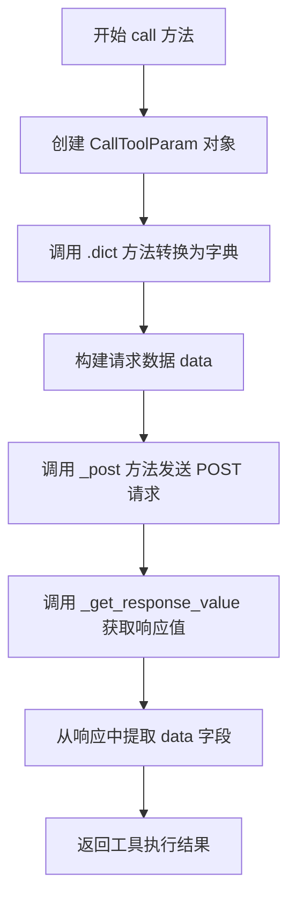

# `Langchain-Chatchat\libs\python-sdk\open_chatcaht\api\tools\tool_client.py` 详细设计文档

这是一个工具客户端类，封装了对工具服务的API调用，提供了列出所有可用工具和调用指定工具的功能，通过继承ApiClient并调用内部_get和_post方法与远程服务进行HTTP通信。

## 整体流程



## 类结构

```
ApiClient (基类)
└── ToolClient (工具客户端)
    ├── list()
    └── call()
```

## 全局变量及字段


### `API_URI_TOOL_CALL`
    
调用工具的API端点路径

类型：`str`
    


### `API_URI_TOOL_LIST`
    
列出所有工具的API端点路径

类型：`str`
    


    

## 全局函数及方法


### `ToolClient.list`

列出所有已注册的可用工具，返回包含工具信息的字典数据。

参数： 无（仅包含隐式参数 `self`）

返回值：`dict`，返回所有工具的字典，包含工具列表数据

#### 流程图



#### 带注释源码

```python
def list(self) -> dict:
    """
    列出所有工具
    
    该方法调用 GET /tools API 端点获取所有已注册的可用工具列表，
    并从响应中提取 data 字段返回工具字典。
    
    Returns:
        dict: 包含所有工具信息的字典，结构为 {'data': [...]}
    """
    # 调用父类的 _get 方法向 /tools 端点发送 GET 请求
    resp = self._get(API_URI_TOOL_LIST)
    
    # 调用 _get_response_value 处理响应
    # as_json=True 表示将响应解析为 JSON
    # value_func=lambda r: r.get("data", {}) 表示从响应中提取 data 字段
    # 若 data 不存在则返回空字典 {}
    return self._get_response_value(
        resp, 
        as_json=True, 
        value_func=lambda r: r.get("data", {})
    )
```


### ToolClient.call

调用指定工具，执行工具并返回结果

参数：

- `name`：`str`，工具名称，指定要调用的工具的唯一标识符
- `tool_input`：`dict`，工具输入参数，传递给工具的参数字典，默认为空字典

返回值：`dict`，返回工具执行的结果数据，即响应中 data 字段的内容

#### 流程图



#### 带注释源码

```python
def call(
        self,
        name: str,
        tool_input: dict = {},
):
    """
    调用工具
    """
    # 1. 创建 CallToolParam 对象，包含工具名称和输入参数
    #    CallToolParam 是工具调用参数的封装类
    data = CallToolParam(name=name, tool_input=tool_input).dict()
    
    # 2. 发送 POST 请求到 /tools/call 接口
    #    将 data 作为 JSON 请求体发送
    resp = self._post(API_URI_TOOL_CALL, json=data)
    
    # 3. 处理响应，提取 data 字段并返回
    #    as_json=True 表示将响应解析为 JSON
    #    value_func=lambda r: r.get("data") 表示从响应中提取 data 字段
    return self._get_response_value(resp, as_json=True, value_func=lambda r: r.get("data"))
```

## 关键组件


### ToolClient 类

工具客户端类，继承自 ApiClient，用于与远程工具服务交互，提供列出可用工具和调用指定工具的功能。

### list 方法

列出所有可用的工具，通过 GET 请求访问 /tools 端点，返回工具列表数据。

### call 方法

调用指定名称的工具，接收工具名称和输入参数，通过 POST 请求访问 /tools/call 端点，执行工具并返回结果。

### CallToolParam 参数类

工具调用参数的数据模型，用于封装工具名称和工具输入参数，转换为字典格式用于 API 请求。

### API_URI_TOOL_CALL 常量

工具调用接口的端点路径，值为 "/tools/call"。

### API_URI_TOOL_LIST 常量

工具列表接口的端点路径，值为 "/tools"。

### ApiClient 基类依赖

提供基础的网络请求能力，包括 _get、_post 和 _get_response_value 等方法，ToolClient 通过继承获得这些能力。


## 问题及建议


### 已知问题

- **可变默认参数陷阱**：`call` 方法中使用 `tool_input: dict = {}` 作为默认参数，这是 Python 中的常见反模式，会导致默认参数在多次调用间共享同一字典对象
- **类型注解不完整**：`call` 方法缺少返回类型注解，无法静态类型检查
- **异常处理缺失**：网络请求可能因网络问题、超时、服务端错误等原因失败，但代码中没有任何异常处理逻辑
- **参数验证不足**：`name` 参数未进行非空校验，`tool_input` 参数未验证其类型是否为字典
- **文档字符串过于简略**：docstring 缺少参数说明、返回值细节、可能的异常类型等关键信息
- **响应数据访问不安全**：`r.get("data")` 假设响应结构始终正确，若 API 返回异常格式（如缺少 data 字段），会导致难以追踪的问题
- **缺少超时配置**：HTTP 请求未设置超时时间，可能导致请求无限期挂起

### 优化建议

- 将 `tool_input: dict = {}` 改为 `tool_input: dict = None`，在方法体内使用 `tool_input or {}` 初始化
- 为 `call` 方法添加返回类型注解，如 `-> Any` 或更具体的类型
- 添加 try-except 包装网络调用，捕获并合理处理 `requests.RequestException` 等异常
- 在方法入口添加参数校验，如 `if not name: raise ValueError("name cannot be empty")`
- 完善 docstring，使用 Google/NumPy 风格文档，添加 Args、Returns、Raises 等 section
- 考虑添加重试机制（使用 tenacity 库）和请求日志记录
- 考虑添加类型别名定义，提高代码可读性和可维护性

## 其它


### 设计目标与约束

本代码旨在为聊天工具提供统一的客户端接口，支持列出可用工具和调用指定工具的功能。设计约束包括：依赖open_chatcaht模块的ApiClient基类；使用RESTful API进行通信；工具参数通过CallToolParam进行验证和序列化；返回数据统一通过_get_response_value方法处理。

### 错误处理与异常设计

代码未显式实现错误处理机制，依赖于ApiClient基类提供的错误处理能力。建议在调用失败时捕获异常，并进行适当的错误恢复。call方法未指定返回值类型，应补充返回类型声明以提高类型安全性。

### 数据流与状态机

数据流如下：list方法通过GET请求获取工具列表，返回工具数据字典；call方法接收工具名称和参数，构建CallToolParam对象，序列化为JSON后通过POST请求发送，返回工具执行结果。状态转换：无状态设计，每次调用相互独立。

### 外部依赖与接口契约

依赖项包括：open_chatcaht.api_client.ApiClient（基类）、open_chatcaht.types.tools.call_tool_param.CallToolParam（参数封装类）。接口契约：list方法返回dict类型工具列表；call方法接受name(str)和tool_input(dict)参数，返回工具执行结果。

### 性能考虑

当前实现为同步调用，未实现连接池复用或异步支持。高并发场景下可能存在性能瓶颈，建议考虑添加异步方法或连接池管理。

### 安全性考虑

tool_input参数直接传递给API，未进行输入验证或过滤，可能存在安全风险。建议在调用前对tool_input进行安全检查，防止注入攻击。

### 版本兼容性

代码未指定版本兼容性策略，依赖的ApiClient和CallToolParam类接口变更可能导致兼容性问题。建议明确版本依赖范围。

### 测试策略

建议为list和call方法编写单元测试，覆盖正常流程和异常情况。Mock ApiClient的_get和_post方法进行隔离测试。

### 配置管理

API端点通过常量API_URI_TOOL_CALL和API_URI_TOOL_LIST定义，缺少配置化支持。建议提取为配置项，支持不同环境切换。

### 部署注意事项

部署时需确保open_chatcaht包正确安装且版本兼容。网络可达性需保证，API服务不可用时将导致功能失效。


    