# `Langchain-Chatchat\libs\python-sdk\open_chatcaht\api_client.py` 详细设计文档

该文件实现了一个API客户端封装类（ApiClient），提供同步/异步HTTP请求方法（GET/POST/DELETE），支持重试机制、流式响应处理、日志记录和配置管理，同时通过装饰器模式简化API调用方式。

## 整体流程

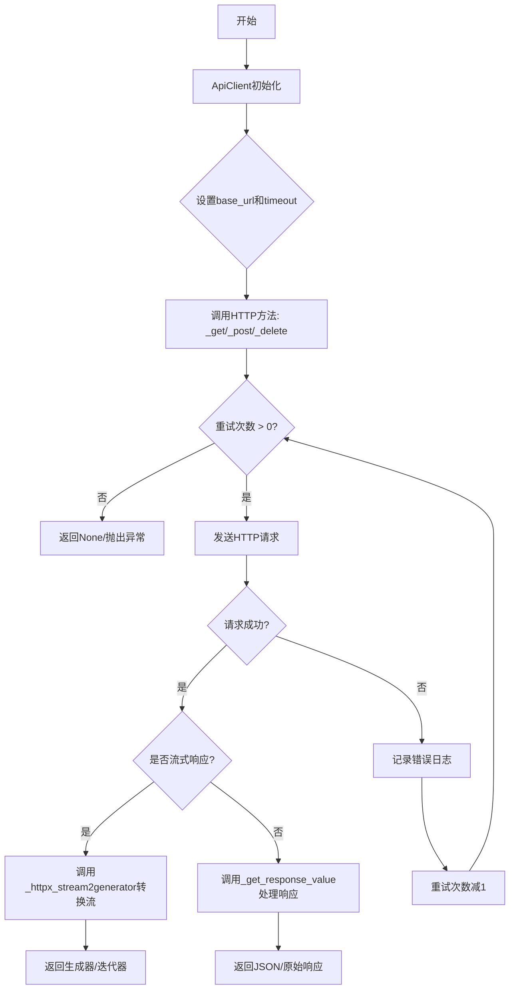

## 类结构

```
ApiClient (API客户端封装类)
├── 字段: base_url, timeout, _use_async, use_proxy, default_retry_count, default_retry_interval, proxies, _client, logger
└── 方法: __init__, client, _get, _post, _delete, _httpx_stream2generator, _get_response_value
```

## 全局变量及字段


### `CHATCHAT_API_BASE`
    
ChatChat API基础地址，默认http://127.0.0.1:8000

类型：`str`
    


### `CHATCHAT_CLIENT_TIME_OUT`
    
客户端超时时间，默认60秒

类型：`float`
    


### `CHATCHAT_CLIENT_DEFAULT_RETRY_COUNT`
    
默认重试次数，默认3

类型：`int`
    


### `CHATCHAT_CLIENT_DEFAULT_RETRY_INTERVAL`
    
默认重试间隔，默认60秒

类型：`int`
    


### `ApiClient.base_url`
    
API基础URL

类型：`str`
    


### `ApiClient.timeout`
    
请求超时时间

类型：`float`
    


### `ApiClient._use_async`
    
是否使用异步模式

类型：`bool`
    


### `ApiClient.use_proxy`
    
是否使用代理

类型：`bool`
    


### `ApiClient.default_retry_count`
    
默认重试次数

类型：`int`
    


### `ApiClient.default_retry_interval`
    
默认重试间隔

类型：`int`
    


### `ApiClient.proxies`
    
代理配置

类型：`Dict`
    


### `ApiClient._client`
    
HTTP客户端实例

类型：`httpx.Client`
    


### `ApiClient.logger`
    
日志记录器

类型：`logging.Logger`
    
    

## 全局函数及方法


### `get_request_method`

该函数根据传入的HTTP方法（`httpx.post`、`httpx.get`、`httpx.delete`）动态返回`ApiClient`实例对应的私有方法（`_post`、`_get`、`_delete`），从而实现HTTP请求方法的统一调用。

参数：

- `api_client_obj`：`ApiClient`，ApiClient实例对象，用于获取对应的请求方法
- `method`：`任意类型`（实际应为`httpx.HTTPMethod`），HTTP请求方法类型（如`httpx.post`、`httpx.get`、`httpx.delete`）

返回值：`Callable`，返回`ApiClient`对象对应的私有请求方法（`_post`、`_get`、`_delete`），若未匹配到任何方法则返回`None`

#### 流程图

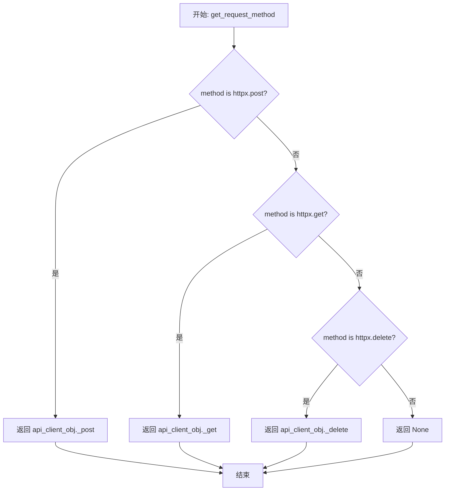

#### 带注释源码

```python
def get_request_method(api_client_obj: ApiClient, method):
    """
    根据HTTP方法获取对应的ApiClient实例方法
    
    该函数通过比对传入的method与httpx库中定义的HTTP方法常量，
    返回ApiClient实例对应的私有请求方法，实现动态方法调用。
    
    参数:
        api_client_obj: ApiClient实例，用于获取对应的请求方法
        method: HTTP方法类型（httpx.post, httpx.get, httpx.delete等）
    
    返回值:
        返回ApiClient对象对应的私有方法（_post, _get, _delete），
        若无匹配的方法则返回None
    """
    # 判断是否为POST方法，若是则返回ApiClient的_post方法
    if method is httpx.post:
        return getattr(api_client_obj, "_post")
    # 判断是否为GET方法，若是则返回ApiClient的_get方法
    elif method is httpx.get:
        return getattr(api_client_obj, "_get")
    # 注意：代码中注释掉的PUT方法预留了扩展空间
    # elif method is httpx.put:
    #     return api_client_obj.put
    # 判断是否为DELETE方法，若是则返回ApiClient的_delete方法
    elif method is httpx.delete:
        return getattr(api_client_obj, "_delete")
```


### `http_request(method)`

这是一个装饰器工厂函数，用于装饰API请求函数，简化HTTP请求调用流程。通过传入不同的HTTP方法（GET、POST、DELETE等），返回相应的装饰器，自动处理URL拼接、参数合并、请求发送和响应处理。

参数：

- `method`：`httpx.HTTPMethod`（如`httpx.post`、`httpx.get`、`httpx.delete`等），HTTP请求方法类型

#### 流程图

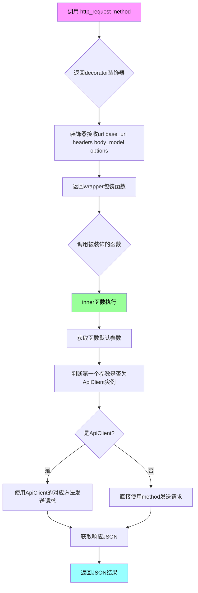

#### 带注释源码

```python
def http_request(method):
    """
    装饰器工厂：用于装饰API请求函数，简化HTTP请求调用
    参数：
        method: httpx的HTTP方法（如post、get、delete等）
    返回：
        decorator: 返回一个装饰器函数
    """
    
    def decorator(url, base_url='', headers=None, body_model: Type[BaseModel] = None, **options):
        """
        装饰器内部函数：配置URL、headers和请求体模型
        参数：
            url: API端点路径
            base_url: 基础URL，默认为空字符串
            headers: HTTP请求头，默认为None
            body_model: 可选的Pydantic BaseModel类型，用于请求体验证
            **options: 其他HTTP选项
        返回：
            wrapper: 返回包装函数
        """
        headers = headers or {}  # 确保headers不为None

        def wrapper(func):
            """
            包装函数：使用wraps保持原函数元数据
            """
            @wraps(func)
            def inner(*args, **kwargs):
                """
                实际执行装饰逻辑的内部函数
                参数：
                    *args: 位置参数
                    **kwargs: 关键字参数
                返回：
                    response.json(): API响应的JSON数据
                """
                try:
                    # 获取函数的默认参数
                    default_param: dict = get_function_default_params(func)

                    # 判断第一个参数是否为ApiClient实例
                    api_client_obj: ApiClient = args[0] if len(args) > 0 and isinstance(args[0], ApiClient) else None
                    
                    # 获取函数返回类型注解
                    return_type = get_type_hints(func).get('return')
                    
                    # 拼接完整URL
                    full_url = base_url + url
                    
                    # 合并kwargs和默认参数
                    param = merge_dicts(kwargs, default_param)
                    
                    # 如果提供了body_model，使用Pydantic模型验证并转换
                    if body_model is not None:
                        param = body_model(**kwargs).dict()
                    
                    # 发送HTTP请求
                    response = None
                    if api_client_obj is not None:
                        # 使用ApiClient对象的方法
                        _method = get_request_method(api_client_obj, method)
                        response = _method(full_url, headers=headers, json=param)
                    else:
                        # 直接使用httpx方法
                        response = method(full_url, headers=headers, json=param)
                        response.raise_for_status()
                    
                    # 返回响应JSON
                    return response.json()
                
                except requests.exceptions.HTTPError as http_err:
                    # 处理HTTP错误
                    print(f"HTTP error occurred: {http_err}")
                except Exception as err:
                    # 处理其他异常
                    print(f"An error occurred: {err}")

            return inner

        return wrapper

    return decorator
```


### `post`

`post` 是一个 HTTP POST 请求装饰器，基于 `http_request(httpx.post)` 创建，用于简化 API 调用过程。它允许被装饰的函数直接发送 POST 请求，支持自定义请求头、请求体模型，并智能判断使用 ApiClient 实例或直接使用 httpx 发送请求。

参数：

- `url`：`str`，装饰器参数，要请求的路由 URL
- `base_url`：`str`，装饰器参数，基础 URL（默认为空字符串，会拼接到 url 前面）
- `headers`：`Dict`，装饰器参数，请求头字典（默认为 None）
- `body_model`：`Type[BaseModel]`，装饰器参数，Pydantic 请求体模型类（默认为 None）
- `*args`：被装饰函数的任意位置参数
- `**kwargs`：被装饰函数的任意关键字参数

返回值：`Any`，`response.json()` 的返回结果，即 API 响应的 JSON 数据

#### 流程图

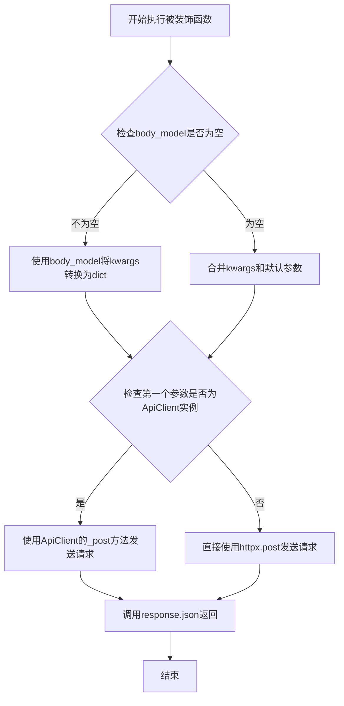

#### 带注释源码

```python
# post 装饰器是基于 http_request 工厂函数创建的
# 传入 httpx.post 作为 method 参数
post = http_request(httpx.post)


def http_request(method):
    """
    HTTP 请求装饰器工厂函数
    :param method: httpx 的请求方法 (post, get, delete, put)
    :return: 装饰器函数
    """
    
    def decorator(url, base_url='', headers=None, body_model: Type[BaseModel] = None, **options):
        """
        装饰器：接收 URL、基础 URL、请求头、请求体模型等参数
        :param url: API 路由路径
        :param base_url: 基础 URL 地址
        :param headers: HTTP 请求头
        :param body_model: Pydantic BaseModel 类，用于验证和序列化请求体
        :param options: 其他可选参数
        """
        
        def wrapper(func):
            """
            实际包装被装饰函数的内部函数
            """
            
            @wraps(func)
            def inner(*args, **kwargs):
                """
                执行实际的 HTTP 请求
                :param args: 被装饰函数的参数
                :param kwargs: 被装饰函数的关键字参数
                :return: API 响应的 JSON 数据
                """
                try:
                    # 获取被装饰函数的默认参数
                    default_param: dict = get_function_default_params(func)

                    # 检查第一个参数是否为 ApiClient 实例
                    # 如果是，则使用 ApiClient 的方法发送请求
                    api_client_obj: ApiClient = args[0] if len(args) > 0 and isinstance(args[0], ApiClient) else None
                    
                    # 获取被装饰函数的返回类型注解
                    return_type = get_type_hints(func).get('return')
                    
                    # 拼接完整 URL
                    full_url = base_url + url
                    
                    # 合并默认参数和传入的参数
                    param = merge_dicts(kwargs, default_param)
                    
                    # 如果指定了 body_model，则使用模型验证和转换参数
                    if body_model is not None:
                        param = body_model(**kwargs).dict()
                    
                    # 发送 HTTP 请求
                    response = None
                    if api_client_obj is not None:
                        # 使用 ApiClient 的对应方法（_post, _get 等）
                        _method = get_request_method(api_client_obj, method)
                        response = _method(full_url, headers=headers, json=param)
                    else:
                        # 直接使用 httpx 方法发送请求
                        response = method(full_url, headers=headers, json=param)
                        response.raise_for_status()
                    
                    # 返回 JSON 响应
                    return response.json()
                
                # 异常处理
                except requests.exceptions.HTTPError as http_err:
                    print(f"HTTP error occurred: {http_err}")
                except Exception as err:
                    print(f"An error occurred: {err}")

            return inner

        return wrapper

    return decorator
```


### `get`

这是一个GET请求装饰器，通过`http_request(httpx.get)`创建，用于将任意函数转换为GET请求调用，支持通过ApiClient或直接使用httpx发送请求，并自动处理响应转换为JSON格式。

参数：

- `url`：`str`，目标请求的URL路径（相对路径）
- `base_url`：`str`，可选，基础URL，默认为空字符串
- `headers`：`Dict`，可选，请求头字典，默认为None
- `body_model`：`Type[BaseModel]`，可选，Pydantic模型类，用于构建请求体，默认为None
- `**options`：任意关键字参数，将作为请求选项传递

返回值：`Any`，返回请求响应解析后的JSON数据，如果发生异常则返回None

#### 流程图

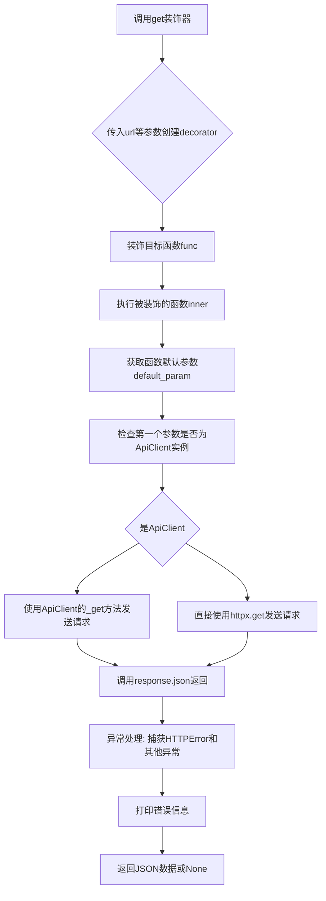

#### 带注释源码

```python
# get装饰器是通过http_request工厂函数创建的
# 传入httpx.get方法作为参数
get = http_request(httpx.get)


def http_request(method):
    """
    HTTP请求装饰器工厂函数
    :param method: httpx的请求方法(如httpx.get, httpx.post等)
    :return: 返回一个装饰器
    """
    
    def decorator(url, base_url='', headers=None, body_model: Type[BaseModel] = None, **options):
        """
        装饰器:配置请求的URL、基础URL、请求头和请求体模型
        :param url: 请求的URL路径
        :param base_url: 基础URL前缀
        :param headers: 请求头字典
        :param body_model: 可选的Pydantic模型类,用于验证和转换请求参数
        :param options: 其他请求选项
        """
        headers = headers or {}

        def wrapper(func):
            @wraps(func)
            def inner(*args, **kwargs):
                """
                实际执行请求的内层包装函数
                :param args: 位置参数
                :param kwargs: 关键字参数
                :return: 请求响应的JSON数据
                """
                try:
                    # 获取被装饰函数的默认参数
                    default_param: dict = get_function_default_params(func)

                    # 检查第一个参数是否为ApiClient实例
                    # 如果是,则使用ApiClient的方法发送请求
                    api_client_obj: ApiClient = args[0] if len(args) > 0 and isinstance(args[0], ApiClient) else None
                    
                    # 获取函数的返回类型注解
                    return_type = get_type_hints(func).get('return')
                    
                    # 拼接完整URL
                    full_url = base_url + url
                    
                    # 合并默认参数和传入参数
                    param = merge_dicts(kwargs, default_param)
                    
                    # 如果指定了body_model,则使用模型验证和转换参数
                    if body_model is not None:
                        param = body_model(**kwargs).dict()
                    
                    # 发送HTTP请求
                    response = None
                    if api_client_obj is not None:
                        # 使用ApiClient的对应方法(内部已实现重试机制)
                        _method = get_request_method(api_client_obj, method)
                        response = _method(full_url, headers=headers, json=param)
                    else:
                        # 直接使用httpx方法发送请求
                        response = method(full_url, headers=headers, json=param)
                        response.raise_for_status()
                    
                    # 返回响应的JSON数据
                    return response.json()
                except requests.exceptions.HTTPError as http_err:
                    # 捕获HTTP错误(如4xx,5xx状态码)
                    print(f"HTTP error occurred: {http_err}")
                except Exception as err:
                    # 捕获其他所有异常
                    print(f"An error occurred: {err}")

            return inner

        return wrapper

    return decorator
```


### `delete`

这是一个HTTP DELETE请求装饰器，用于简化API调用过程。它通过`http_request`装饰器工厂创建，内部调用`ApiClient`的`_delete`方法或直接使用`httpx.delete`发送DELETE请求，并自动处理请求参数、异常捕获和JSON响应返回。

参数：

- `method`：在`http_request(httpx.delete)`调用时传入，指定为`httpx.delete`
- `url`：装饰器参数，字符串类型，目标API端点路径
- `base_url`：装饰器参数，字符串类型，默认为空字符串，用于拼接完整URL
- `headers`：装饰器参数，字典类型，默认为None，请求头
- `body_model`：装饰器参数，Type[BaseModel]类型，默认为None，可选的Pydantic模型用于请求体验证
- `**options`：装饰器参数，任意类型，其他HTTP请求选项

返回值：`函数`，返回装饰后的内部函数`inner`，该函数执行实际的HTTP DELETE请求并返回JSON响应

#### 流程图

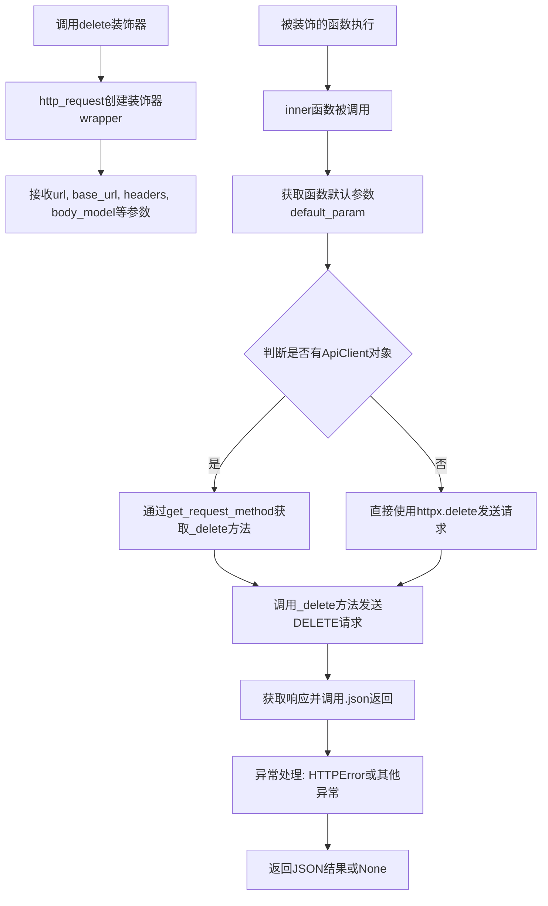

#### 带注释源码

```python
# 定义delete装饰器，等价于 http_request(httpx.delete)
# 这是一个装饰器工厂，接收httpx.delete作为method参数
delete = http_request(httpx.delete)

# http_request函数是一个装饰器工厂，接受method参数(httpx.post/get/delete/put)
def http_request(method):
    # decorator是一个内部函数，接收url, base_url, headers, body_model等参数
    def decorator(url, base_url='', headers=None, body_model: Type[BaseModel] = None, **options):
        # 确保headers不为None
        headers = headers or {}

        # wrapper是实际的装饰器函数
        def wrapper(func):
            # 使用wraps保持原函数的元数据
            @wraps(func)
            def inner(*args, **kwargs):
                try:
                    # 获取被装饰函数的默认参数
                    default_param: dict = get_function_default_params(func)

                    # 检查第一个参数是否为ApiClient对象
                    api_client_obj: ApiClient = args[0] if len(args) > 0 and isinstance(args[0], ApiClient) else None
                    
                    # 获取函数的返回类型注解
                    return_type = get_type_hints(func).get('return')
                    
                    # 拼接完整URL
                    full_url = base_url + url
                    
                    # 合并kwargs和默认参数
                    param = merge_dicts(kwargs, default_param)
                    
                    # 如果指定了body_model，使用Pydantic模型验证并转换为dict
                    if body_model is not None:
                        param = body_model(**kwargs).dict()
                    
                    # 发送HTTP请求
                    response = None
                    if api_client_obj is not None:
                        # 使用ApiClient的方法发送请求
                        _method = get_request_method(api_client_obj, method)
                        response = _method(full_url, headers=headers, json=param)
                    else:
                        # 直接使用httpx方法发送请求
                        response = method(full_url, headers=headers, json=param)
                        response.raise_for_status()
                    
                    # 返回JSON响应
                    return response.json()
                except requests.exceptions.HTTPError as http_err:
                    # 处理HTTP错误
                    print(f"HTTP error occurred: {http_err}")
                except Exception as err:
                    # 处理其他异常
                    print(f"An error occurred: {err}")

            return inner

        return wrapper

    return decorator
```


### `put`

`put` 是一个 HTTP 请求装饰器工厂函数，用于发送 PUT 请求到指定 URL。它接收 `url`、`base_url`、`headers`、`body_model` 等参数，并返回一个装饰器，该装饰器会将目标函数转换为发送 PUT HTTP 请求的函数，支持自动合并默认参数、构建请求体以及处理 API 响应。

参数：

-  `url`：`str`，请求的目标 URL 路径
-  `base_url`：`str`，基础 URL 地址，默认为空字符串
-  `headers`：`Dict`，HTTP 请求头，默认为 None
-  `body_model`：`Type[BaseModel]`（可选），Pydantic 模型类，用于验证和序列化请求体数据，默认为 None
-  `**options`：其他可选参数，如超时设置、认证信息等

返回值：`Any`，返回 API 响应的 JSON 数据

#### 流程图

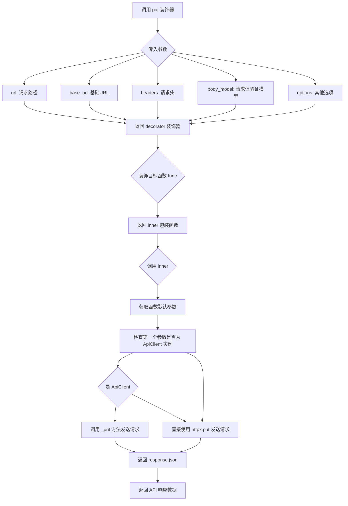

#### 带注释源码

```python
put = http_request(httpx.put)
```

```python
def http_request(method):
    """
    HTTP 请求装饰器工厂函数
    :param method: HTTP 方法（如 httpx.post, httpx.get, httpx.put, httpx.delete）
    :return: decorator 装饰器
    """
    def decorator(url, base_url='', headers=None, body_model: Type[BaseModel] = None, **options):
        """
        装饰器内部函数
        :param url: 请求的 URL 路径
        :param base_url: 基础 URL 地址
        :param headers: HTTP 请求头
        :param body_model: Pydantic 模型类，用于请求体验证
        :param options: 其他可选参数
        :return: wrapper 装饰器
        """
        headers = headers or {}  # 确保 headers 不为 None

        def wrapper(func):
            """
            实际包装目标函数的装饰器
            :param func: 被装饰的函数
            :return: inner 包装函数
            """
            @wraps(func)  # 保留原函数的元信息
            def inner(*args, **kwargs):
                try:
                    # 获取函数的默认参数
                    default_param: dict = get_function_default_params(func)

                    # 检查第一个参数是否为 ApiClient 实例
                    api_client_obj: ApiClient = args[0] if len(args) > 0 and isinstance(args[0], ApiClient) else None
                    
                    # 获取返回类型注解
                    return_type = get_type_hints(func).get('return')
                    
                    # 拼接完整 URL
                    full_url = base_url + url
                    
                    # 合并默认参数和传入参数
                    param = merge_dicts(kwargs, default_param)
                    
                    # 如果指定了 body_model，则使用模型验证和序列化参数
                    if body_model is not None:
                        param = body_model(**kwargs).dict()
                    
                    # 发送 HTTP 请求
                    response = None
                    if api_client_obj is not None:
                        # 使用 ApiClient 的方法发送请求（需先实现 _put 方法）
                        _method = get_request_method(api_client_obj, method)
                        response = _method(full_url, headers=headers, json=param)
                    else:
                        # 直接使用 httpx 方法发送请求
                        response = method(full_url, headers=headers, json=param)
                        response.raise_for_status()
                    
                    # 返回响应 JSON 数据
                    return response.json()
                except requests.exceptions.HTTPError as http_err:
                    print(f"HTTP error occurred: {http_err}")
                except Exception as err:
                    print(f"An error occurred: {err}")

            return inner

        return wrapper

    return decorator
```


### `ApiClient.__init__`

该方法是 `ApiClient` 类的构造函数，用于初始化 API 客户端实例，配置基础 URL、超时时间、重试策略、日志级别、代理设置等核心参数，并创建日志记录器。

参数：

- `base_url`：`str`，API 服务的基地址，默认值为 `API_BASE_URI`
- `timeout`：`float`，HTTP 请求的超时时间（秒），默认值为 `60`
- `use_async`：`bool`，是否使用异步 HTTP 客户端，默认值为 `False`
- `use_proxy`：`bool`，是否启用代理，默认值为 `False`
- `proxies`：`Optional[Dict]`，代理配置字典，默认值为 `None`
- `log_level`：`int`，日志记录级别，默认值为 `logging.INFO`
- `retry`：`int`，默认重试次数，默认值为 `3`
- `retry_interval`：`int`，重试间隔时间（秒），默认值为 `1`

返回值：`None`，构造函数不返回任何值，仅初始化实例属性

#### 流程图

```mermaid
flowchart TD
    A[开始 __init__] --> B{检查 proxies 是否为 None}
    B -->|是| C[proxies = {}]
    B -->|否| D[使用传入的 proxies]
    C --> E[获取 base_url]
    D --> E
    E --> F[获取 timeout]
    F --> G[设置 self._use_async = use_async]
    G --> H[设置 self.use_proxy = use_proxy]
    H --> I[获取 default_retry_count]
    I --> J[获取 default_retry_interval]
    J --> K[设置 self.proxies = proxies]
    K --> L[设置 self._client = None]
    L --> M[创建并配置 logger]
    M --> N[结束 __init__]
```

#### 带注释源码

```python
def __init__(
        self,
        base_url: str = API_BASE_URI,       # API 服务的基地址
        timeout: float = 60,                # HTTP 请求超时时间（秒）
        use_async: bool = False,            # 是否使用异步客户端
        use_proxy: bool = False,            # 是否启用代理
        proxies=None,                       # 代理配置字典
        log_level: int = logging.INFO,      # 日志记录级别
        retry: int = 3,                     # 默认重试次数
        retry_interval: int = 1,            # 重试间隔（秒）
):
    """
    初始化 ApiClient 实例
    
    参数:
        base_url: API 服务的基地址
        timeout: HTTP 请求超时时间
        use_async: 是否使用异步 HTTP 客户端
        use_proxy: 是否启用代理
        proxies: 代理配置字典
        log_level: 日志记录级别
        retry: 默认重试次数
        retry_interval: 重试间隔时间
    """
    # 如果未传入 proxies，初始化为空字典
    if proxies is None:
        proxies = {}
    
    # 使用 get_variable 获取 base_url，支持环境变量覆盖
    self.base_url = get_variable(base_url, CHATCHAT_API_BASE)
    
    # 获取 timeout，支持环境变量覆盖
    self.timeout = get_variable(timeout, CHATCHAT_CLIENT_TIME_OUT)
    
    # 保存异步模式配置
    self._use_async = use_async
    
    # 保存代理启用状态
    self.use_proxy = use_proxy
    
    # 获取默认重试次数，支持环境变量覆盖
    self.default_retry_count = get_variable(retry, CHATCHAT_CLIENT_DEFAULT_RETRY_COUNT)
    
    # 获取默认重试间隔，支持环境变量覆盖
    self.default_retry_interval = get_variable(retry_interval, CHATCHAT_CLIENT_DEFAULT_RETRY_INTERVAL)
    
    # 保存代理配置
    self.proxies = proxies
    
    # 初始化 HTTP 客户端为 None（延迟初始化）
    self._client = None
    
    # 创建日志记录器
    self.logger = logging.getLogger(__name__)
    
    # 设置日志级别
    self.logger.setLevel(log_level)
```


### `ApiClient.client`

这是一个属性方法，用于获取或创建HTTP客户端实例，实现懒加载（Lazy Initialization）模式，确保HTTP客户端只在首次访问时才初始化，并且当客户端关闭时会自动重新创建。

参数：无（仅包含self）

返回值：`httpx.Client` 或 `httpx.AsyncClient`，返回当前维护的HTTP客户端实例，如果为None或已关闭则创建新实例

#### 流程图

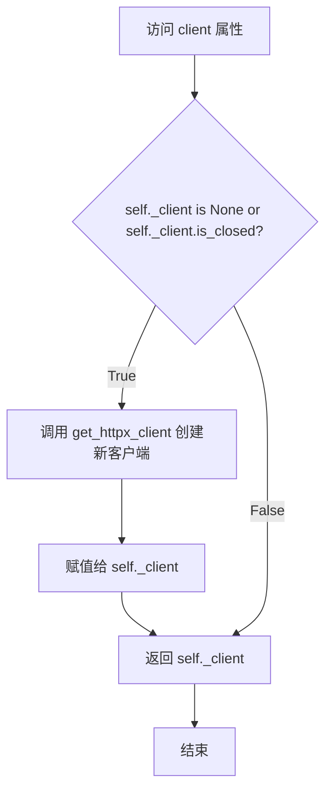

#### 带注释源码

```python
@property
def client(self):
    """
    获取HTTP客户端实例的延迟初始化属性
    如果客户端未初始化或已关闭，则创建新客户端；否则返回现有客户端
    """
    # 检查客户端是否未初始化或已关闭
    if self._client is None or self._client.is_closed:
        # 使用配置创建新的httpx客户端
        self._client = get_httpx_client(
            base_url=self.base_url,      # API基础URL
            use_async=self._use_async,    # 是否使用异步客户端
            timeout=self.timeout          # 请求超时时间
        )
    # 返回客户端实例
    return self._client
```


### ApiClient._get

该方法是 ApiClient 类的私有方法，用于执行 HTTP GET 请求，支持重试机制和流式响应处理。

参数：

- `self`：ApiClient，ApiClient 实例本身
- `url`：`str`，请求的目标 URL 地址
- `params`：`Union[Dict, List[Tuple], bytes]`，查询参数，可为字典、元组列表或字节类型，默认为 None
- `retry`：`int`，重试次数，默认为 3
- `stream`：`bool`，是否使用流式响应，默认为 False
- `**kwargs`：`Any`，传递给 httpx 客户端的额外关键字参数

返回值：`Union[httpx.Response, Iterator[httpx.Response], None]`，成功时返回 httpx.Response 对象或流式响应迭代器，失败时返回 None

#### 流程图

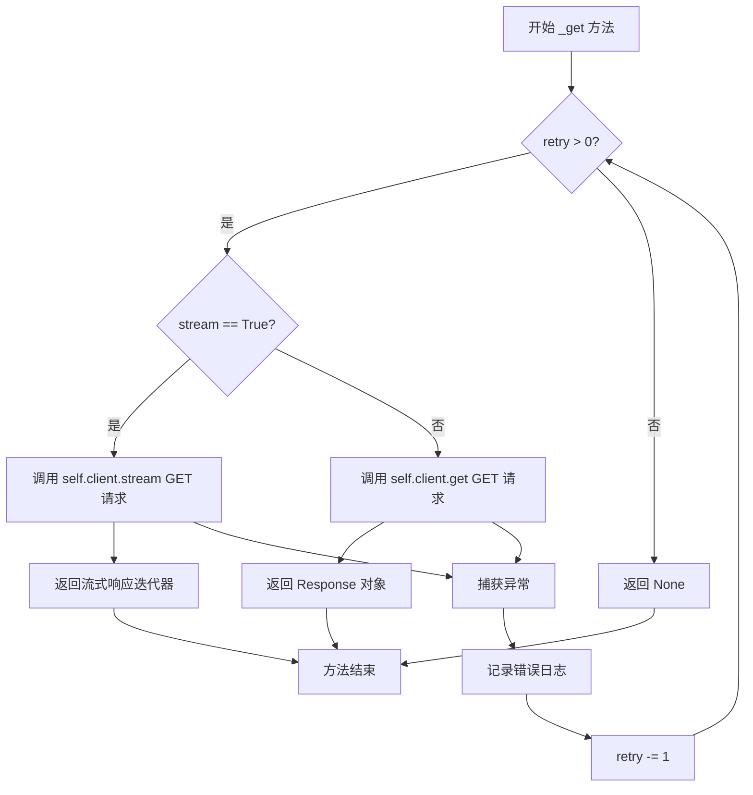

#### 带注释源码

```python
def _get(
        self,
        url: str,
        params: Union[Dict, List[Tuple], bytes] = None,
        retry: int = 3,
        stream: bool = False,
        **kwargs: Any,
) -> Union[httpx.Response, Iterator[httpx.Response], None]:
    """
    执行 HTTP GET 请求
    
    参数:
        url: str - 请求的目标URL地址
        params: Union[Dict, List[Tuple], bytes] - 查询参数，支持字典、元组列表或字节类型
        retry: int - 重试次数，默认值为3
        stream: bool - 是否使用流式响应，默认False
        **kwargs: Any - 传递给httpx客户端的额外参数
    
    返回:
        Union[httpx.Response, Iterator[httpx.Response], None] - 
        成功时返回httpx.Response对象或流式响应迭代器，失败时返回None
    """
    # 当重试次数大于0时循环执行请求
    while retry > 0:
        try:
            # 根据stream参数决定使用流式请求还是普通请求
            if stream:
                # 流式请求，返回迭代器
                return self.client.stream("GET", url, params=params, **kwargs)
            else:
                # 普通GET请求，返回Response对象
                return self.client.get(url, params=params, **kwargs)
        except Exception as e:
            # 捕获所有异常并记录错误日志
            msg = f"error when get {url}: {e}"
            self.logger.error(f"{e.__class__.__name__}: {msg}")
            # 重试次数减1
            retry -= 1
    # 重试次数用尽后返回None
    return None
```


### `ApiClient._post`

该方法是 `ApiClient` 类的私有方法，用于发送 HTTP POST 请求，支持重试机制和流式响应。它封装了 httpx 客户端的 POST 请求逻辑，提供自动重试、异常处理和调试日志功能。

参数：

- `url`：`str`，请求的目标 URL 地址
- `data`：`Dict = None`，可选的表单数据，将作为 `application/x-www-form-urlencoded` 发送
- `json`：`Dict = None`，可选的 JSON 数据，将作为 `application/json` 发送
- `retry`：`int = 3`，请求失败时的重试次数，默认为 3 次
- `stream`：`bool = False`，是否使用流式传输（SSE/Server-Sent Events）
- `**kwargs`：`Any`，传递给 httpx 客户端的其他关键字参数

返回值：`Union[httpx.Response, Iterator[httpx.Response], None]`，返回 httpx 响应对象、流式迭代器，或重试耗尽后返回 `None`

#### 流程图

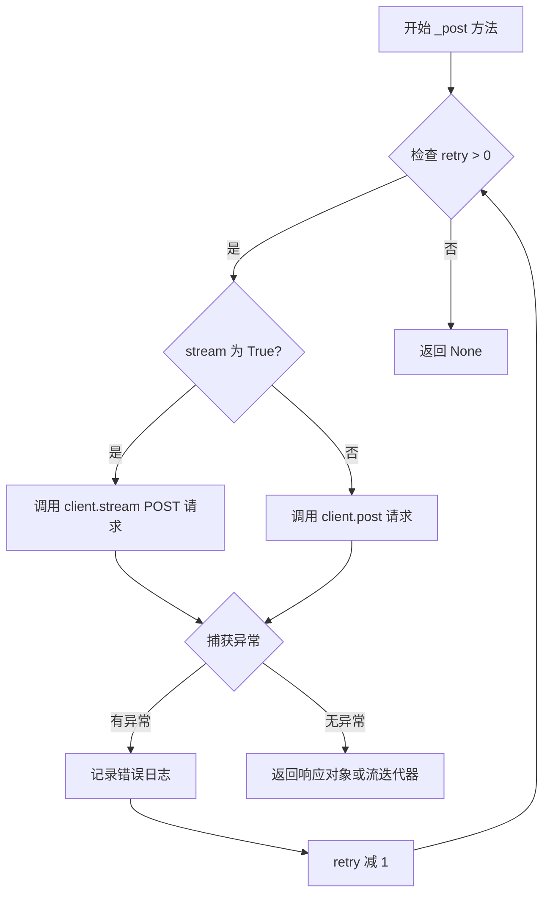

#### 带注释源码

```python
def _post(
        self,
        url: str,
        data: Dict = None,
        json: Dict = None,
        retry: int = 3,
        stream: bool = False,
        **kwargs: Any,
) -> Union[httpx.Response, Iterator[httpx.Response], None]:
    """
    发送 HTTP POST 请求，支持重试机制和流式传输
    
    参数:
        url: 请求目标URL
        data: 表单数据（application/x-www-form-urlencoded）
        json: JSON数据（application/json）
        retry: 最大重试次数
        stream: 是否启用流式响应（SSE）
        **kwargs: 传递给httpx的其他参数
    
    返回:
        httpx.Response: 普通响应对象
        Iterator[httpx.Response]: 流式响应迭代器
        None: 重试次数耗尽时返回
    """
    # 循环重试机制，允许最多 retry 次请求
    while retry > 0:
        try:
            # 如果启用流式传输
            if stream:
                # 使用 stream 方法处理 Server-Sent Events
                return self.client.stream(
                    "POST", url, data=data, json=json, **kwargs
                )
            else:
                # 调试日志：记录 POST 请求的 URL 和数据
                self.logger.debug(f"post {url} with data: {data}")
                # 执行标准 POST 请求
                return self.client.post(url, data=data, json=json, **kwargs)
        except Exception as e:
            # 捕获所有异常，记录错误日志
            msg = f"error when post {url}: {e}"
            self.logger.error(f"{e.__class__.__name__}: {msg}")
            # 重试次数减 1
            retry -= 1
    # 重试次数耗尽，返回 None
    return None
```


### ApiClient._delete

该方法是 `ApiClient` 类的私有方法，用于发送 HTTP DELETE 请求，支持重试机制和流式响应处理。

参数：

- `self`：`ApiClient`，ApiClient 实例本身
- `url`：`str`，删除请求的目标 URL
- `data`：`Dict = None`，请求体数据（可选）
- `json`：`Dict = None`，JSON 格式的请求体数据（可选）
- `retry`：`int = 3`，重试次数，默认为 3 次
- `stream`：`bool = False`，是否使用流式响应，默认为 False
- `**kwargs`：`Any`，其他传递给 httpx 客户端的额外参数

返回值：`Union[httpx.Response, Iterator[httpx.Response], None]`，返回 httpx 响应对象、流式迭代器或 None（当重试次数用尽仍失败时）

#### 流程图

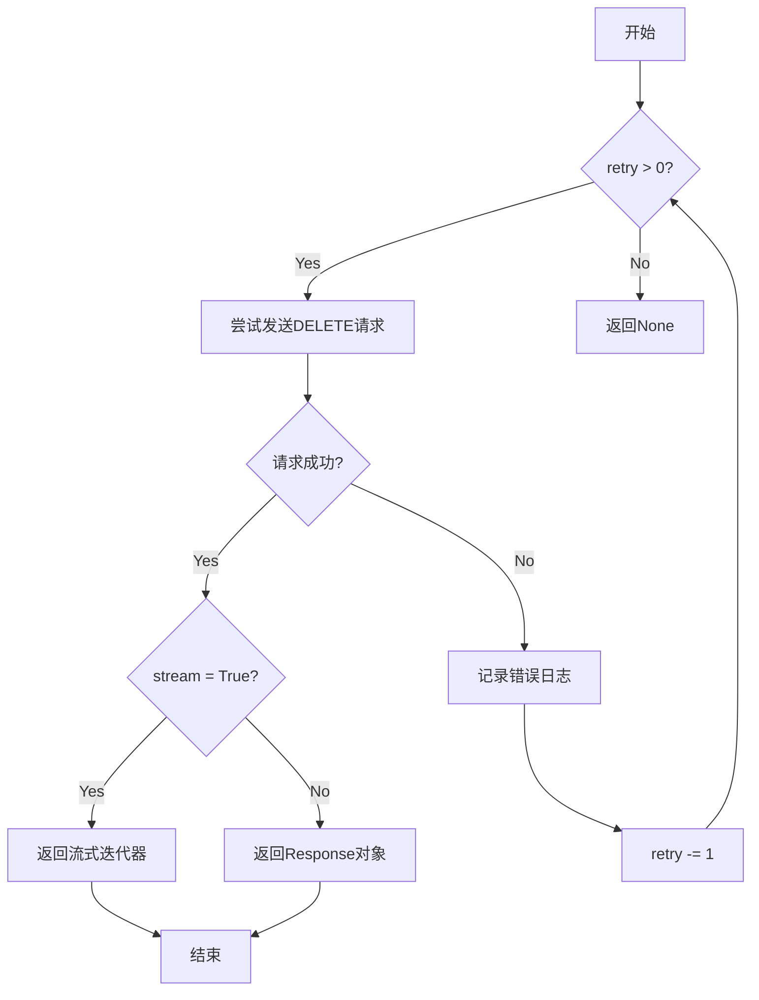

#### 带注释源码

```python
def _delete(
        self,
        url: str,
        data: Dict = None,
        json: Dict = None,
        retry: int = 3,
        stream: bool = False,
        **kwargs: Any,
) -> Union[httpx.Response, Iterator[httpx.Response], None]:
    """
    发送 HTTP DELETE 请求
    
    参数:
        url: str - 删除请求的目标URL
        data: Dict - 请求体数据
        json: Dict - JSON格式的请求体数据
        retry: int - 重试次数，默认3次
        stream: bool - 是否使用流式响应，默认False
        **kwargs: Any - 其他传递给httpx客户端的参数
    
    返回:
        Union[httpx.Response, Iterator[httpx.Response], None] - 响应对象、流式迭代器或None
    """
    # 当重试次数大于0时持续尝试
    while retry > 0:
        try:
            # 判断是否需要流式处理
            if stream:
                # 流式处理：使用 client.stream 方法
                return self.client.stream(
                    "DELETE", url, data=data, json=json, **kwargs
                )
            else:
                # 普通处理：直接调用 client.delete 方法
                return self.client.delete(url, data=data, json=json, **kwargs)
        except Exception as e:
            # 捕获异常并记录错误日志
            msg = f"error when delete {url}: {e}"
            self.logger.error(f"{e.__class__.__name__}: {msg}")
            # 重试次数减1
            retry -= 1
    # 重试次数用尽且均失败，返回 None
    return None
```


### `ApiClient._httpx_stream2generator`

将 httpx.stream 返回的 GeneratorContextManager（生成器上下文管理器）转换为普通的同步或异步生成器，用于处理 Server-Sent Events (SSE) 流式响应。

参数：

- `response`：`contextlib._GeneratorContextManager`，httpx.stream 方法返回的生成器上下文管理器对象
- `as_json`：`bool`，指示是否将流式内容解析为 JSON 格式，默认为 False

返回值：`Generator`，根据 `self._use_async` 属性返回异步或同步生成器，用于迭代处理流式响应数据

#### 流程图

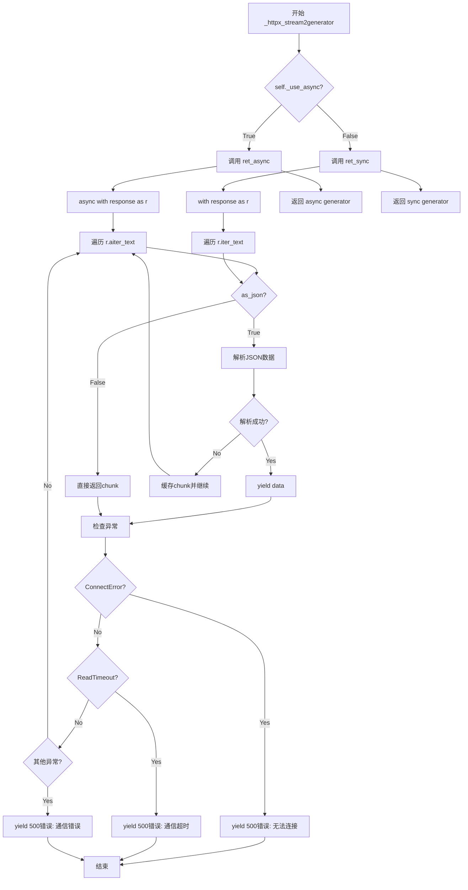

#### 带注释源码

```python
def _httpx_stream2generator(
        self,
        response: contextlib._GeneratorContextManager,
        as_json: bool = False,
):
    """
    将httpx.stream返回的GeneratorContextManager转化为普通生成器
    """

    # 定义异步内部生成器函数，用于处理异步流式响应
    async def ret_async(response, as_json):
        try:
            # 使用 async with 上下文管理器获取响应对象
            async with response as r:
                chunk_cache = ""  # 用于缓存不完整的JSON片段
                # 异步迭代响应文本内容
                async for chunk in r.aiter_text(None):
                    if not chunk:  # fastchat api yield empty bytes on start and end
                        continue
                    if as_json:
                        try:
                            # 处理SSE格式: "data: {...}\n\n"
                            if chunk.startswith("data: "):
                                data = json.loads(chunk_cache + chunk[6:-2])
                            elif chunk.startswith(":"):  # skip sse comment line
                                continue
                            else:
                                data = json.loads(chunk_cache + chunk)

                            chunk_cache = ""
                            yield data
                        except Exception as e:
                            msg = f"接口返回json错误： '{chunk}'。错误信息是：{e}。"
                            self.logger.error(f"{e.__class__.__name__}: {msg}")

                            # 缓存无法解析的片段，与下一段拼接重试
                            if chunk.startswith("data: "):
                                chunk_cache += chunk[6:-2]
                            elif chunk.startswith(":"):  # skip sse comment line
                                continue
                            else:
                                chunk_cache += chunk
                            continue
                    else:
                        # 不解析JSON，直接返回原始文本块
                        # print(chunk, end="", flush=True)
                        yield chunk
            # 捕获连接错误
            except httpx.ConnectError as e:
                msg = f"无法连接API服务器，请确认 'api.py' 已正常启动。({e})"
                self.logger.error(msg)
                yield {"code": 500, "msg": msg}
            # 捕获读取超时
            except httpx.ReadTimeout as e:
                msg = f"API通信超时，请确认已启动FastChat与API服务（详见Wiki '5. 启动 API 服务或 Web UI'）。（{e}）"
                self.logger.error(msg)
                yield {"code": 500, "msg": msg}
            # 捕获其他异常
            except Exception as e:
                msg = f"API通信遇到错误：{e}"
                self.logger.error(f"{e.__class__.__name__}: {msg}")
                yield {"code": 500, "msg": msg}

    # 定义同步内部生成器函数，用于处理同步流式响应
    def ret_sync(response, as_json):
        try:
            # 使用 with 上下文管理器获取响应对象
            with response as r:
                chunk_cache = ""  # 用于缓存不完整的JSON片段
                # 同步迭代响应文本内容
                for chunk in r.iter_text(None):
                    if not chunk:  # fastchat api yield empty bytes on start and end
                        continue
                    if as_json:
                        try:
                            # 处理SSE格式: "data: {...}\n\n"
                            if chunk.startswith("data: "):
                                data = json.loads(chunk_cache + chunk[6:-2])
                            elif chunk.startswith(":"):  # skip sse comment line
                                continue
                            else:
                                data = json.loads(chunk_cache + chunk)

                            chunk_cache = ""
                            yield data
                        except Exception as e:
                            msg = f"接口返回json错误： '{chunk}'。错误信息是：{e}。"
                            self.logger.error(f"{e.__class__.__name__}: {msg}")

                            # 缓存无法解析的片段，与下一段拼接重试
                            if chunk.startswith("data: "):
                                chunk_cache += chunk[6:-2]
                            elif chunk.startswith(":"):  # skip sse comment line
                                continue
                            else:
                                chunk_cache += chunk
                            continue
                    else:
                        # 不解析JSON，直接返回原始文本块
                        # print(chunk, end="", flush=True)
                        yield chunk
            # 捕获连接错误
            except httpx.ConnectError as e:
                msg = f"无法连接API服务器，请确认 'api.py' 已正常启动。({e})"
                self.logger.error(msg)
                yield {"code": 500, "msg": msg}
            # 捕获读取超时
            except httpx.ReadTimeout as e:
                msg = f"API通信超时，请确认已启动FastChat与API服务（详见Wiki '5. 启动 API 服务或 Web UI'）。（{e}）"
                self.logger.error(msg)
                yield {"code": 500, "msg": msg}
            # 捕获其他异常
            except Exception as e:
                msg = f"API通信遇到错误：{e}"
                self.logger.error(f"{e.__class__.__name__}: {msg}")
                yield {"code": 500, "msg": msg}

    # 根据配置选择返回异步或同步生成器
    if self._use_async:
        return ret_async(response, as_json)
    else:
        return ret_sync(response, as_json)
```


### `ApiClient._get_response_value`

该方法用于将 HTTP 响应转换为所需格式，支持同步/异步模式、可选 JSON 解析以及自定义值处理函数，提供了灵活的响应处理能力。

参数：

- `self`：`ApiClient` 实例，调用该方法的客户端对象
- `response`：`httpx.Response`，HTTP 响应对象
- `as_json`：`bool`，可选，默认为 `False`，是否将响应解析为 JSON 格式
- `value_func`：`Callable`，可选，默认为 `None`，自定义返回值处理函数，接收 response 或解析后的 JSON 作为参数

返回值：`Any`，返回经过处理的值，可能是原始响应、JSON 数据或自定义函数处理后的结果

#### 流程图

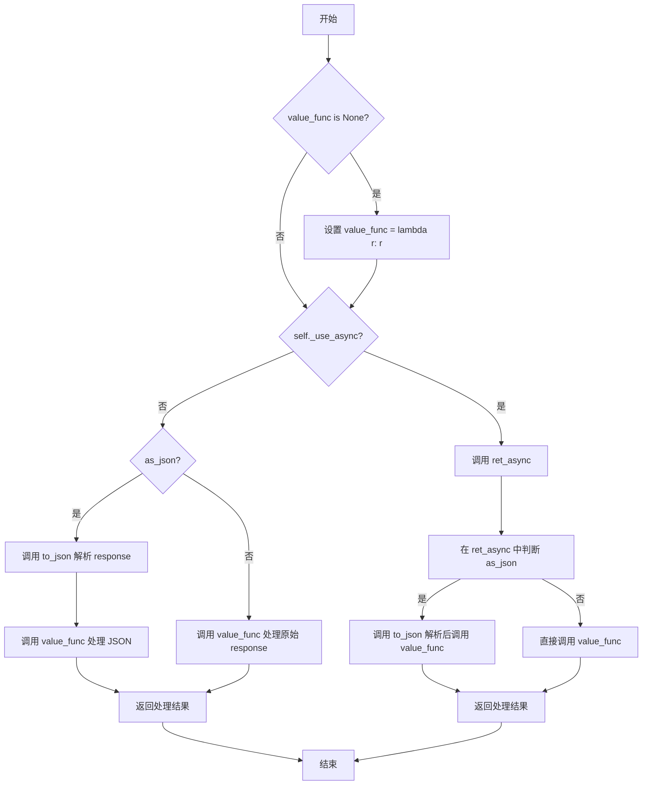

#### 带注释源码

```python
def _get_response_value(
        self,
        response: httpx.Response,
        as_json: bool = False,
        value_func: Callable = None,
):
    """
    转换同步或异步请求返回的响应
    `as_json`: 返回json
    `value_func`: 用户可以自定义返回值，该函数接受response或json
    """

    def to_json(r):
        """
        将响应对象解析为 JSON 格式
        失败时返回错误信息字典
        """
        try:
            return r.json()
        except Exception as e:
            msg = "API未能返回正确的JSON。" + str(e)
            self.logger.error(f"{e.__class__.__name__}: {msg}")
            return {"code": 500, "msg": msg, "data": None}

    # 如果未提供自定义处理函数，默认使用恒等函数
    if value_func is None:
        value_func = lambda r: r

    async def ret_async(response):
        """
        异步模式下的响应处理函数
        根据 as_json 标志决定是否解析 JSON
        """
        if as_json:
            return value_func(to_json(await response))
        else:
            return value_func(await response)

    # 根据客户端模式选择同步或异步处理路径
    if self._use_async:
        # 异步模式：返回异步处理函数供调用者 await
        return ret_async(response)
    else:
        # 同步模式：直接执行处理逻辑
        if as_json:
            return value_func(to_json(response))
        else:
            return value_func(response)
```

## 关键组件


### ApiClient 类

HTTP API客户端封装类，提供同步/异步HTTP请求能力，支持流式响应、重试机制和代理配置。

### 流式响应转换器 (_httpx_stream2generator)

将httpx流式响应转换为生成器，支持SSE(Server-Sent Events)解析，自动处理JSON数据提取和错误恢复。

### HTTP请求装饰器 (http_request)

用于简化API调用方法定义的装饰器，支持自动参数合并、请求体验证(BaseModel)、以及动态路由到同步/异步客户端方法。

### 请求方法路由器 (get_request_method)

根据传入的HTTP方法(httpx.get/post/delete)动态返回对应的ApiClient实例方法，实现统一的请求接口适配。

### 全局配置变量

包含CHATCHAT_API_BASE(API基础URL)、CHATCHAT_CLIENT_TIME_OUT(超时时间)、CHATCHAT_CLIENT_DEFAULT_RETRY_COUNT(默认重试次数)、CHATCHAT_CLIENT_DEFAULT_RETRY_INTERVAL(重试间隔)等环境变量配置。

### 懒加载HTTP客户端 (client property)

通过property实现的惰性加载机制，确保HTTP客户端只在首次访问时才创建，支持自动重置已关闭的连接。

### 重试机制实现

在_get、_post、_delete方法中内置的重试逻辑，通过循环和异常捕获实现自动重试，支持可配置的重试次数和间隔。

### 响应值转换器 (_get_response_value)

将httpx响应转换为JSON或自定义格式，支持异步/同步模式自动适配，提供统一的响应处理接口。

### 错误处理与日志记录

在流式响应转换器和请求方法中集成了完整的异常处理，包括连接错误、超时错误、JSON解析错误等，并记录详细日志信息。


## 问题及建议


### 已知问题

-   **混合使用httpx和requests库**：代码同时导入了`httpx`和`requests`，但主要使用`httpx`发送请求，却在装饰器`http_request`中捕获`requests.exceptions.HTTPError`，导致异常捕获逻辑不一致。
-   **retry机制不完善**：`_get`、`_post`、`_delete`方法中的重试逻辑在捕获异常后直接递减retry计数，没有实现重试间隔等待，可能导致快速连续失败。
-   **代码重复**：`_get`、`_post`、`_delete`方法中包含大量重复的重试和错误处理逻辑，可以抽取公共逻辑。
-   **`_httpx_stream2generator`方法冗长**：该方法同时包含异步和同步两套几乎完全相同的逻辑，代码冗余且难以维护。
-   **装饰器错误处理不完整**：`http_request`装饰器捕获异常后仅使用`print`输出，未向上抛出异常或返回结构化错误信息，导致调用方无法感知请求失败。
-   **`stream`参数未实际使用**：`_get`、`_post`、`_delete`方法接收`stream`参数但未在请求时使用，该功能可能尚未完全实现。
-   **`put`方法case缺失**：`get_request_method`函数中未处理`httpx.put`的情况，虽然定义了`put = http_request(httpx.put)`装饰器。
-   **类型注解不完整**：多处使用`Any`类型，如`_get`、`_post`方法的`**kwargs: Any`，降低了代码的可读性和类型安全。
-   **日志输出方式不统一**：部分地方使用`self.logger.error`，部分地方使用`print`，不符合统一的日志规范。
-   **资源管理不完善**：`client`属性虽然会在关闭时重新创建，但未提供显式的`close`方法供外部调用者使用，可能导致资源泄漏。

### 优化建议

-   统一使用`httpx`库，移除`requests`导入及相关异常捕获，或保留`requests`仅用于特定场景。
-   在重试逻辑中添加`time.sleep`延迟，如`time.sleep(self.default_retry_interval)`，避免快速重试。
-   抽取`_get`、`_post`、`_delete`的公共逻辑到一个私有方法中，如`_execute_request`。
-   将`_httpx_stream2generator`拆分为两个独立方法` _stream_async`和`_stream_sync`，通过参数选择调用。
-   装饰器应返回有意义的错误响应或重新抛出异常，或至少返回`None`让调用方知道请求失败。
-   实现完整的流式请求支持，或移除未使用的`stream`参数以避免混淆。
-   在`get_request_method`中添加`httpx.put`的处理分支。
-   完善类型注解，使用具体类型替代`Any`，增强代码可读性和IDE支持。
-   统一使用`self.logger`进行日志输出，移除所有`print`语句。
-   添加`close()`方法显式管理httpx客户端生命周期，实现上下文管理器接口（`__enter__`/`__exit__`）。

## 其它


### 设计目标与约束

该模块旨在提供一个统一、简洁的HTTP客户端封装，用于与ChatChat后端API服务进行通信。设计目标包括：1) 支持同步/异步两种调用模式；2) 内置自动重试机制以提高可靠性；3) 提供流式响应处理能力以支持SSE（Server-Sent Events）场景；4) 通过装饰器模式简化API调用方式；5) 支持代理配置和超时控制。约束条件包括依赖httpx作为HTTP客户端库，依赖pydantic进行请求体校验，且该客户端仅适用于与ChatChat API服务的通信场景。

### 错误处理与异常设计

代码采用多层次的异常处理策略：1) 在HTTP请求方法（`_get`、`_post`、`_delete`）中使用while循环配合try-except捕获所有Exception，实现自动重试逻辑；2) 在流式响应转换方法（`_httpx_stream2generator`）中针对`httpx.ConnectError`和`httpx.ReadTimeout`进行特定捕获并返回结构化错误JSON；3) 在JSON解析时捕获异常并缓存不完整的chunk以便后续拼接；4) 在装饰器`http_request`中捕获`requests.exceptions.HTTPError`和其他异常并打印错误信息。错误日志使用`self.logger.error()`记录，包含错误类名和详细描述。返回值方面，异常时返回`{"code": 500, "msg": "错误信息"}`格式的字典。

### 数据流与状态机

客户端的数据流分为三种模式：1) 普通请求模式：发起请求 → 获取Response → 转换为JSON或原始Response → 返回；2) 流式响应模式：发起流式请求 → 进入`_httpx_stream2generator`生成器 → 迭代处理chunk → 检测SSE格式（`data: `前缀或`:`开头）→ 尝试JSON解析 → 成功则yield数据，失败则缓存chunk等待下次拼接 → 异常时yield错误字典；3) 异步模式：通过`self._use_async`标志位判断，异步模式下返回async生成器函数。状态转换主要体现在重试计数器`retry`的递减和`self._client`的连接状态（`is_closed`）检查上。

### 外部依赖与接口契约

核心依赖包括：1) `httpx` - HTTP客户端库，提供同步/异步请求能力；2) `requests` - 仅用于装饰器中的错误处理（`requests.exceptions.HTTPError`）；3) `pydantic` - 用于`body_model`参数进行请求体验证；4) `open_chatcaht._constants` - 提供`API_BASE_URI`常量；5) `open_chatcaht.utils` - 提供`set_httpx_config`、`get_httpx_client`、`get_variable`、`get_function_default_params`、`merge_dicts`等工具函数。内部模块依赖`CHATCHAT_API_BASE`、`CHATCHAT_CLIENT_TIME_OUT`、`CHATCHAT_CLIENT_DEFAULT_RETRY_COUNT`、`CHATCHAT_CLIENT_DEFAULT_RETRY_INTERVAL`等全局配置常量。

### 配置管理

配置通过环境变量和默认值双重机制管理：1) `CHATCHAT_API_BASE` - API基础URL，默认`http://127.0.0.1:8000`；2) `CHATCHAT_CLIENT_TIME_OUT` - 超时时间，默认60秒；3) `CHATCHAT_CLIENT_DEFAULT_RETRY_COUNT` - 默认重试次数，默认3次；4) `CHATCHAT_CLIENT_DEFAULT_RETRY_INTERVAL` - 默认重试间隔，默认60秒；5) 构造函参数`base_url`、`timeout`、`use_async`、`use_proxy`、`proxies`、`log_level`、`retry`、`retry_interval`允许运行时覆盖默认值。配置获取使用`get_variable()`函数实现环境变量优先的策略。

### 重试机制设计

重试机制实现于`_get`、`_post`、`_delete`方法中，采用指数递减（实际为线性递减）策略：1) 方法签名包含`retry`参数，默认值为3；2) 使用`while retry > 0`循环结构；3) 每次捕获异常后执行`retry -= 1`；4) 当retry降至0时循环结束，方法返回None（因为最后异常时retry已减为0，不再执行请求）；5) 重试间隔采用固定间隔（`default_retry_interval`参数），未实现指数退避。日志记录每次错误但不记录重试尝试本身。

### 日志记录策略

日志记录采用Python标准`logging`模块：1) `self.logger = logging.getLogger(__name__)`创建类级别logger；2) 日志级别通过`log_level`参数配置，默认为`logging.INFO`；3) 错误级别日志使用`self.logger.error()`记录HTTP请求错误、流式响应异常、JSON解析错误、连接错误和超时错误；4) 调试级别日志使用`self.logger.debug()`记录POST请求的URL和data信息；5) 日志格式包含错误类名和描述信息，便于问题定位。注意装饰器中的错误使用`print()`而非logger打印。

### 异步与同步实现

代码通过`self._use_async`标志位实现双模式支持：1) 构造函数接受`use_async: bool = False`参数；2) `client`属性根据`self._use_async`创建同步或异步的httpx客户端；3) `_get_response_value`方法根据标志位返回同步或异步的转换函数；4) `_httpx_stream2generator`方法根据标志位返回`ret_async`或`ret_sync`生成器函数；5) 异步函数内部使用`await`关键字处理响应，同步函数直接处理。注意：虽然标志位可以动态切换，但客户端实例创建时已锁定模式，切换标志位不会立即生效。

### 潜在技术债务与优化空间

1) **重试间隔未生效**：代码中定义了`default_retry_interval`参数，但在`_get`、`_post`、`_delete`方法中并未使用该参数实现重试间隔等待，当前重试是立即执行的；2) **装饰器异常处理不完整**：`http_request`装饰器捕获异常后仅打印错误，未返回统一的错误响应格式，也未使用logger；3) **流式响应chunk缓存逻辑复杂**：chunk拼接逻辑在异步和同步版本中重复，且缓存逻辑在异常处理分支中，容易产生bug；4) **缺少连接池管理**：虽然使用了httpx客户端，但未显式配置连接池大小和生命周期；5) **类型提示不完整**：部分参数使用`Any`类型，部分返回值使用`Union`简化了具体类型；6) **PUT方法支持缺失**：代码中导入了`put`但实际装饰器中未实现完整逻辑；7) **未实现请求超时重试**：当前重试逻辑在请求成功后即返回，未考虑超时后的重试。

    