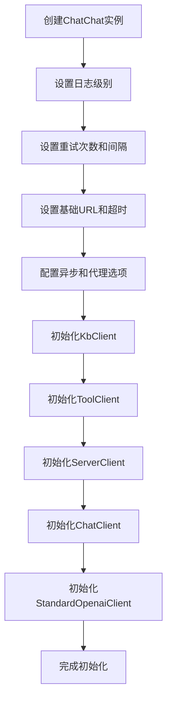
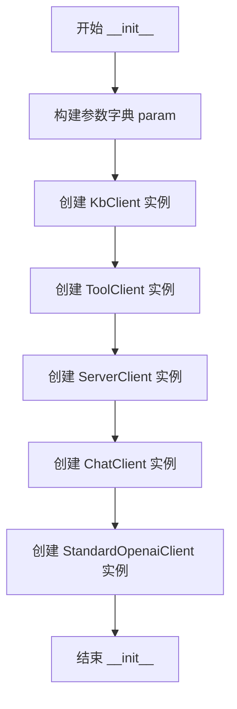

# `Langchain-Chatchat\libs\python-sdk\open_chatcaht\chatchat_api.py` 详细设计文档

ChatChat是一个统一的客户端封装类，通过初始化多个子客户端（知识库、工具、服务器、聊天和OpenAI适配器）来提供对后端API的便捷访问，支持配置超时、代理、重试、日志等通用参数。

## 整体流程



## 类结构

```
ChatChat (主入口类)
├── KbClient (知识库客户端)
├── ToolClient (工具客户端)
├── ServerClient (服务器客户端)
├── ChatClient (聊天客户端)
└── StandardOpenaiClient (OpenAI适配器客户端)
```

## 全局变量及字段


### `logging`
    
Python标准库日志模块，用于记录程序运行日志

类型：`module`
    


### `API_BASE_URI`
    
从open_chatcaht._constants模块导入的API基础URI常量

类型：`str`
    


### `param`
    
存储客户端初始化参数的字典，包含日志级别、重试次数、基础URL、超时时间、异步选项、代理配置等信息

类型：`dict`
    


### `ChatChat.knowledge`
    
知识库客户端实例，用于处理知识库相关的API调用

类型：`KbClient`
    


### `ChatChat.tool`
    
工具客户端实例，用于处理工具调用相关的API请求

类型：`ToolClient`
    


### `ChatChat.server`
    
服务器客户端实例，用于处理服务器管理相关的API操作

类型：`ServerClient`
    


### `ChatChat.chat`
    
聊天客户端实例，用于处理聊天对话相关的核心API功能

类型：`ChatClient`
    


### `ChatChat.openai_adapter`
    
OpenAI标准适配器客户端实例，用于兼容标准OpenAI API的调用

类型：`StandardOpenaiClient`
    
    

## 全局函数及方法


### `ChatChat.__init__`

该方法是ChatChat类的构造函数，用于初始化聊天客户端实例。它接收多个配置参数（包括API地址、超时时间、代理、日志级别、重试策略等），并将它们传递给内部创建的各类客户端对象（知识库、工具、服务器、聊天和标准OpenAI适配器），从而统一管理整个聊天系统的API交互。

参数：

- `base_url`：`str`，API服务的基础URL地址，默认为`API_BASE_URI`
- `timeout`：`float`，请求超时时间（秒），默认为60
- `use_async`：`bool`，是否使用异步模式，默认为False
- `use_proxy`：`bool`，是否启用代理，默认为False
- `proxies`：代理配置字典，默认为None
- `log_level`：`int`，日志级别，默认为`logging.INFO`
- `retry`：`int`，请求失败时的重试次数，默认为3
- `retry_interval`：`int`，重试间隔时间（秒），默认为1

返回值：`None`，构造函数不返回值，仅初始化实例状态

#### 流程图



#### 带注释源码

```python
def __init__(self,
             base_url: str = API_BASE_URI,
             timeout: float = 60,
             use_async: bool = False,
             use_proxy: bool = False,
             proxies=None,
             log_level: int = logging.INFO,
             retry: int = 3,
             retry_interval: int = 1, ):
    """
    初始化ChatChat实例
    
    参数:
        base_url: API基础URL，默认为常量API_BASE_URI
        timeout: 请求超时时间（秒），默认60秒
        use_async: 是否使用异步模式，默认False
        use_proxy: 是否启用代理，默认False
        proxies: 代理服务器配置，默认None
        log_level: 日志级别，默认logging.INFO
        retry: 失败重试次数，默认3次
        retry_interval: 重试间隔时间（秒），默认1秒
    """
    # 构建统一的参数字典，用于初始化所有客户端
    param = {
        'log_level': log_level,
        'retry': retry,
        'retry_interval': retry_interval,
        'base_url': base_url,
        'timeout': timeout,
        'use_async': use_async,
        'use_proxy': use_proxy,
        'proxies': proxies
    }

    # 初始化知识库客户端
    self.knowledge = KbClient(**param)
    # 初始化工具客户端
    self.tool = ToolClient(**param)
    # 初始化服务器客户端
    self.server = ServerClient(**param)
    # 初始化聊天客户端
    self.chat = ChatClient(**param)
    # 初始化标准OpenAI适配器客户端
    self.openai_adapter = StandardOpenaiClient(**param)
```

## 关键组件


### ChatChat 类

主入口类，封装了与ChatCAHT系统交互的所有客户端实例，提供统一的配置管理和初始化接口。

### KbClient (knowledge 字段)

知识库客户端，负责管理与知识库相关的API调用和交互。

### ToolClient (tool 字段)

工具客户端，负责处理工具调用和工作流相关的API请求。

### ServerClient (server 字段)

服务器客户端，负责服务器配置、状态查询等管理类API操作。

### ChatClient (chat 字段)

聊天客户端，负责核心的聊天功能API调用，包括消息发送、对话管理等。

### StandardOpenaiClient (openai_adapter 字段)

OpenAI适配器客户端，提供与标准OpenAI API兼容的接口适配功能。

### __init__ 方法

初始化方法，接收多个配置参数（base_url、timeout、use_async、use_proxy、proxies、log_level、retry、retry_interval），并初始化所有子客户端实例，实现配置的统一管理和复用。

### 参数配置体系

统一的参数传递机制，将日志级别、重试策略、基础URL、超时设置、代理配置等参数一次性传递给所有子客户端，保证行为一致性。


## 问题及建议


### 已知问题

-   **类属性初始化方式不当**：将实例变量在类级别定义为`None`，这种做法不符合Python最佳实践，应该在`__init__`方法中声明和初始化实例属性
-   **类型注解不完整**：参数`proxies`缺少类型注解，无法获得静态类型检查的保护
-   **重复参数传递**：每个客户端都接收完全相同的参数集合（log_level、retry、retry_interval等），代码重复度高
-   **初始化参数验证缺失**：未对timeout、retry、retry_interval等关键参数进行合法性校验（如timeout为负数、retry为负数）
-   **缺少错误处理机制**：实例化5个客户端时没有异常捕获，任一客户端初始化失败会导致整个对象创建失败
-   **无法按需初始化客户端**：所有客户端在初始化时都会创建，即使某些功能可能不会使用，造成资源浪费
-   **缺少资源管理协议**：未实现`__enter__`和`__exit__`方法，不支持上下文管理器，无法确保资源正确释放
-   **日志配置不灵活**：log_level只能是int类型，限制了日志配置的多样性（如无法直接传入logging.getLogger()对象）
-   **代理配置类型不安全**：`proxies`参数没有类型提示，且在Python中proxies字典的键值格式需要严格规范，容易用错
-   **类文档字符串缺失**：ChatChat类没有docstring，无法获得文档和IDE自动补全的支持

### 优化建议

-   **改进属性声明方式**：移除类级别的属性定义，在`__init__`方法中使用`self.xxx: Type = None`或使用`dataclass`或`pydantic`定义配置
-   **完善类型注解**：为`proxies`添加类型注解，如`Optional[Dict[str, str]]`
-   **提取公共配置**：创建一个配置类或dataclass来封装公共参数，多个客户端共享同一配置对象引用
-   **添加参数校验**：在`__init__`方法开头添加参数验证逻辑，如`assert timeout > 0`
-   **实现懒加载模式**：使用`property`或`__getattr__`实现客户端的延迟初始化，按需创建客户端实例
-   **添加异常处理**：使用try-except包装客户端初始化，提供部分初始化成功的能力
-   **实现上下文管理器**：添加`__enter__`和`__exit__`方法，支持`with`语句管理资源生命周期
-   **添加类文档字符串**：为类和方法添加完整的docstring文档
-   **考虑使用单例模式或连接池**：如果多个实例共享同一服务端点，可以考虑单例模式或连接池优化
</think>

## 其它


### 设计目标与约束

设计目标：该类作为统一的客户端入口，提供对知识库（Knowledge Base）、工具（Tool）、服务器（Server）、聊天（Chat）和标准OpenAI适配器的集中管理，简化多客户端初始化流程，统一配置参数。

约束条件：
- 所有子客户端共享相同的配置参数（base_url、timeout、use_async等）
- 默认超时时间为60秒
- 重试机制默认3次，间隔1秒
- 必须依赖 open_chatcaht 内部模块

### 错误处理与异常设计

该类本身不直接抛出异常，异常由各子客户端（KbClient、ToolClient、ServerClient、ChatClient、StandardOpenaiClient）在实际API调用时抛出。建议调用方对各子客户端的API方法进行try-except包装处理。

### 外部依赖与接口契约

依赖项：
- open_chatcaht._constants.API_BASE_URI：默认API基础URI
- open_chatcaht.api.knowledge_base.knowledge_base_client.KbClient：知识库客户端
- open_chatcaht.api.tools.tool_client.ToolClient：工具客户端
- open_chatcaht.api.server.server_client.ServerClient：服务器客户端
- open_chatcaht.api.chat.chat_client.ChatClient：聊天客户端
- open_chatcaht.api.standard_openai.standard_openai_client.StandardOpenaiClient：OpenAI适配器客户端

接口契约：初始化时传入统一参数字典param，各子客户端接收相同参数进行各自初始化。

### 线程安全性

该类本身不保存可变状态，各子客户端为独立实例，在多线程环境下安全。但需注意各子客户端的底层实现是否线程安全。

### 资源管理与生命周期

资源管理：各子客户端在__init__中创建，生命周期与ChatChat实例一致。无可配置的显式资源释放方法。

生命周期：
- 创建ChatChat实例时初始化所有子客户端
- 实例销毁时各子客户端一同销毁

### 扩展性设计

扩展方式：
- 新增客户端：可在__init__中添加新的客户端初始化
- 配置变更：可通过修改param字典或重新实例化实现

### 配置管理

配置来源：构造函数参数
配置项：base_url、timeout、use_async、use_proxy、proxies、log_level、retry、retry_interval
默认值：base_url=API_BASE_URI、timeout=60、use_async=False、use_proxy=False、proxies=None、log_level=logging.INFO、retry=3、retry_interval=1


    