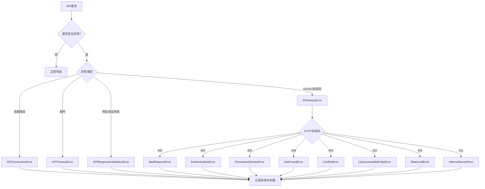
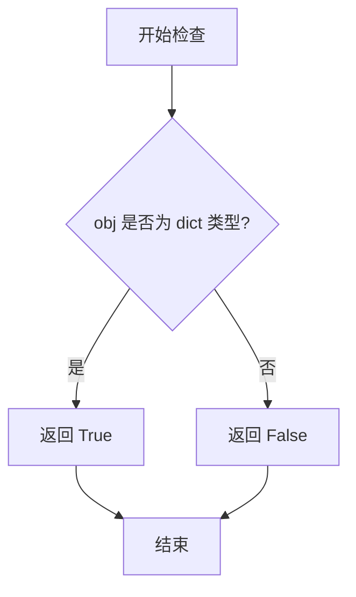
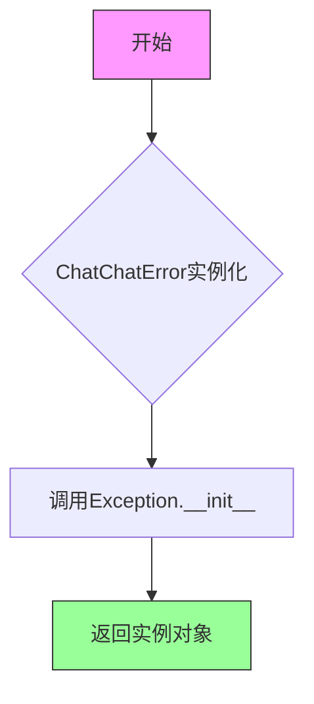
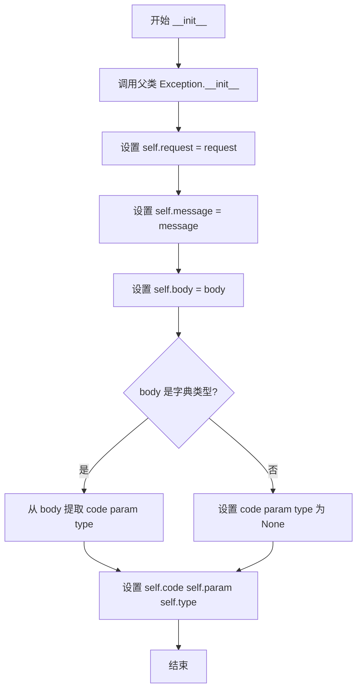
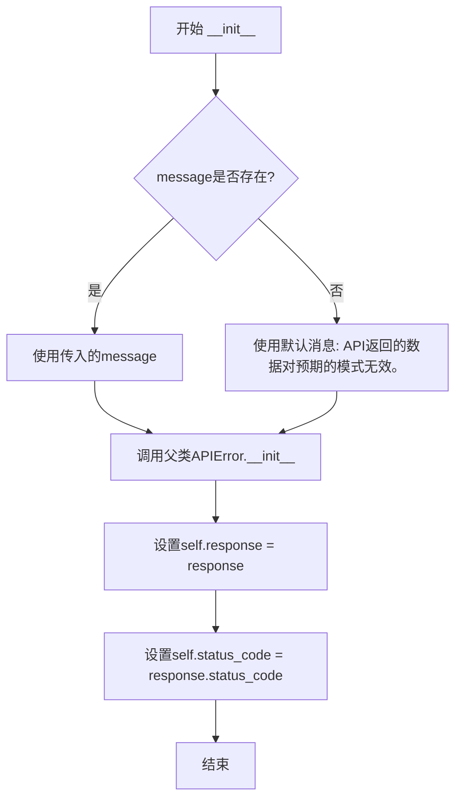
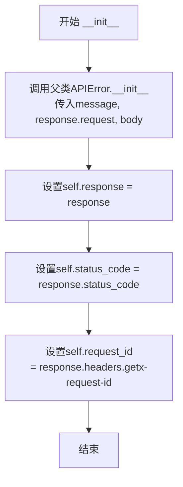
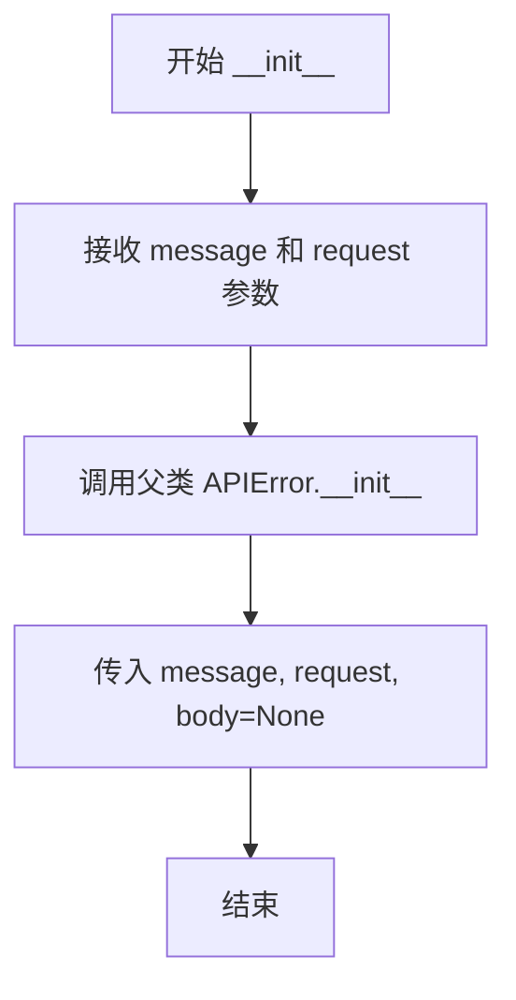

# `Langchain-Chatchat\libs\python-sdk\open_chatcaht\exceptions.py` 详细设计文档

该文件定义了一个完整的API异常类层次结构，用于处理HTTP API调用过程中可能出现的各种错误情况，包括客户端错误（4xx）、服务器错误（5xx）、连接错误、超时错误以及响应验证错误等，并提供了对请求信息、响应体和状态码的封装。

## 整体流程



## 类结构

```
Exception (Python内置)
└── ChatChatError
    └── APIError
        ├── APIResponseValidationError
        ├── APIStatusError
        │   ├── BadRequestError (400)
        │   ├── AuthenticationError (401)
        │   ├── PermissionDeniedError (403)
        │   ├── NotFoundError (404)
        │   ├── ConflictError (409)
        │   ├── UnprocessableEntityError (422)
        │   ├── RateLimitError (429)
        │   └── InternalServerError (5xx)
        └── APIConnectionError
            └── APITimeoutError
```

## 全局变量及字段


### `__all__`
    
模块公开导出的异常类名称列表

类型：`list[str]`
    


### `APIError.message`
    
错误消息文本

类型：`str`
    


### `APIError.request`
    
触发错误的HTTP请求对象

类型：`httpx.Request`
    


### `APIError.body`
    
API响应体，可能是解码后的JSON对象、原始响应或None

类型：`object | None`
    


### `APIError.code`
    
错误代码标识

类型：`Optional[str]`
    


### `APIError.param`
    
与错误相关的参数信息

类型：`Optional[str]`
    


### `APIError.type`
    
错误类型分类

类型：`Optional[str]`
    


### `APIResponseValidationError.response`
    
包含无效数据的API响应对象

类型：`httpx.Response`
    


### `APIResponseValidationError.status_code`
    
HTTP响应状态码

类型：`int`
    


### `APIStatusError.response`
    
包含错误状态的HTTP响应对象

类型：`httpx.Response`
    


### `APIStatusError.status_code`
    
HTTP响应状态码（4xx或5xx）

类型：`int`
    


### `APIStatusError.request_id`
    
用于追踪请求的ID标识

类型：`str | None`
    


### `BadRequestError.status_code`
    
HTTP 400状态码常量

类型：`Literal[400]`
    


### `AuthenticationError.status_code`
    
HTTP 401状态码常量

类型：`Literal[401]`
    


### `PermissionDeniedError.status_code`
    
HTTP 403状态码常量

类型：`Literal[403]`
    


### `NotFoundError.status_code`
    
HTTP 404状态码常量

类型：`Literal[404]`
    


### `ConflictError.status_code`
    
HTTP 409状态码常量

类型：`Literal[409]`
    


### `UnprocessableEntityError.status_code`
    
HTTP 422状态码常量

类型：`Literal[422]`
    


### `RateLimitError.status_code`
    
HTTP 429状态码常量

类型：`Literal[429]`
    
    

## 全局函数及方法


### `is_dict`

检查给定对象是否为字典类型，用于安全地访问可能为字典的响应体属性。

参数：

- `obj`：`object | None`，任意需要检查类型的对象

返回值：`bool`，如果对象是字典类型返回 `True`，否则返回 `False`

#### 流程图



#### 带注释源码

```
# is_dict 函数的可能实现（从 open_chatcaht.utils 导入）
def is_dict(obj: object) -> bool:
    """
    检查对象是否为字典类型
    
    参数:
        obj: 任意需要检查类型的对象
        
    返回值:
        bool: 如果对象是字典类型返回 True，否则返回 False
    """
    return isinstance(obj, dict)
```

#### 在代码中的使用示例

```
# 在 APIError.__init__ 方法中使用 is_dict
if is_dict(body):
    # 只有当 body 是字典时才尝试访问 .get() 方法
    self.code = cast(str, body.get("code"))
    self.param = cast(str, body.get("param"))
    self.type = cast(str, body.get("type"))
else:
    self.code = None
    self.param = None
    self.type = None
```

#### 设计说明

`is_dict` 函数是一个简单的类型检查工具函数，主要用于：
1. **安全类型检查**：在访问字典的 `.get()` 方法前确保对象是字典类型，避免 `AttributeError`
2. **防御性编程**：因为 `body` 的类型是 `object | None`，可能不是字典，需要先检查再访问
3. **代码清晰度**：比直接使用 `isinstance(obj, dict)` 更语义化，代码可读性更好


### ChatChatError.__init__

该方法是 ChatChatError 类的初始化方法，由于 ChatChatError 仅继承自 Exception 且内部为 pass 语句，因此该方法直接继承自 Exception 类的默认实现，不执行任何自定义逻辑。作为项目所有自定义异常的基类，为后续 API 错误类提供基础架构支持。

参数：

- 无自定义参数（继承自 Exception 的默认参数）

返回值：`None`，无返回值（构造函数）

#### 流程图



#### 带注释源码

```python
class ChatChatError(Exception):
    """
    基础异常类，项目中所有自定义异常的基类。
    继承自 Python 内置的 Exception 类，不添加任何自定义属性或方法。
    """
    pass  # 无任何自定义实现，完全继承 Exception 的行为
```


### `APIError.__init__`

初始化 APIError 异常对象，接收错误消息、HTTP 请求对象和可选的响应体，并从响应体中提取错误代码、参数和类型信息。

参数：

- `message`：`str`，错误消息，描述具体的错误内容
- `request`：`httpx.Request`，触发该错误的 HTTP 请求对象
- `body`：`object | None`，API 响应体，如果响应是有效的 JSON 结构则会被解码，否则为原始响应或 None

返回值：`None`，`__init__` 方法不返回任何值

#### 流程图



#### 带注释源码

```python
def __init__(self, message: str, request: httpx.Request, *, body: object | None) -> None:
    """
    初始化 APIError 异常。

    参数:
        message: 错误消息描述
        request: 触发错误的 HTTP 请求
        body: 可选的响应体数据
    """
    # 调用父类 Exception 的初始化方法，设置异常消息
    super().__init__(message)
    
    # 保存 HTTP 请求对象，用于后续追踪和调试
    self.request = request
    
    # 保存错误消息
    self.message = message
    
    # 保存响应体，可能是解码后的 JSON 或原始响应
    self.body = body

    # 检查 body 是否为字典类型（有效的 JSON 结构）
    if is_dict(body):
        # 从响应体中提取错误代码、参数和类型
        self.code = cast(str, body.get("code"))
        self.param = cast(str, body.get("param"))
        self.type = cast(str, body.get("type"))
    else:
        # 如果 body 不是有效字典，设置相关属性为 None
        self.code = None
        self.param = None
        self.type = None
```


### `APIResponseValidationError.__init__`

该方法用于初始化API响应验证错误对象，当API返回的数据不符合预期模式时抛出此异常。它继承自APIError类，并通过调用父类构造函数设置基本错误信息，同时存储响应对象和状态码以供后续错误处理使用。

参数：

- `response`：`httpx.Response`，HTTP响应对象，包含服务器返回的原始响应信息
- `body`：`object | None`，API响应体，可以是解码后的JSON对象或其他类型的响应内容
- `message`：`str | None`，可选的错误消息参数，如果不提供则使用默认消息"API返回的数据对预期的模式无效。"

返回值：`None`，该方法为构造函数，不返回任何值

#### 流程图



#### 带注释源码

```python
def __init__(self, response: httpx.Response, body: object | None, *, message: str | None = None) -> None:
    """
    初始化API响应验证错误对象。
    
    当API返回的数据无法通过预期模式验证时创建此异常。
    
    参数:
        response: HTTP响应对象，包含状态码和请求信息
        body: API响应体内容，可以是字典或其他对象
        message: 可选的错误消息，如果为None则使用默认消息
    """
    # 调用父类APIError的初始化方法
    # 如果message为None，则使用默认的错误描述信息
    super().__init__(message or "API返回的数据对预期的模式无效。", response.request, body=body)
    
    # 存储完整的响应对象，以便调用者可以访问响应详情
    self.response = response
    
    # 提取并存储HTTP状态码，便于错误分类和处理
    self.status_code = response.status_code
```


### `APIStatusError.__init__`

当API返回4xx或5xx状态码时，用于初始化APIStatusError异常对象的构造函数，继承自APIError并额外记录响应对象、状态码和请求ID。

参数：

- `message`：`str`，错误描述信息
- `response`：`httpx.Response`，触发错误的HTTP响应对象（关键字参数）
- `body`：`object | None`，API响应体内容，可能为JSON解码结果、原始响应或None（关键字参数）

返回值：`None`，该方法为构造函数，不返回任何值

#### 流程图



#### 带注释源码

```python
def __init__(self, message: str, *, response: httpx.Response, body: object | None) -> None:
    """
    初始化APIStatusError异常对象。
    
    当API响应的状态码为4xx或5xx时，创建此异常实例。
    该类继承自APIError，并额外记录响应对象、状态码和请求ID。
    
    参数:
        message: str - 错误描述信息，用于向用户展示错误原因
        response: httpx.Response - 触发错误的HTTP响应对象，
                  包含状态码、请求头等信息（关键字参数）
        body: object | None - API响应体内容，可能为：
              - 有效JSON解码后的字典
              - 非JSON格式的原始响应
              - 无响应时为None（关键字参数）
    
    返回值:
        None - 构造函数不返回值
    """
    # 调用父类APIError的初始化方法，传递错误消息、请求对象和响应体
    super().__init__(message, response.request, body=body)
    
    # 存储完整的响应对象，供调用者进一步处理
    self.response = response
    
    # 从响应中提取HTTP状态码，便于程序化判断错误类型
    self.status_code = response.status_code
    
    # 从响应头中获取x-request-id，用于问题追踪和日志关联
    self.request_id = response.headers.get("x-request-id")
```


### APIConnectionError.__init__

这是 API 连接错误异常的初始化方法，用于在网络连接失败时创建错误实例。

参数：

- `message`：`str`，错误消息，默认值为 "连接错误"
- `request`：`httpx.Request`，导致连接错误的请求对象

返回值：`None`，无返回值（`__init__` 方法）

#### 流程图



#### 带注释源码

```python
class APIConnectionError(APIError):
    """
    API连接错误异常类。
    当发生网络连接错误时抛出此异常。
    继承自 APIError。
    """
    
    def __init__(self, *, message: str = "连接错误", request: httpx.Request) -> None:
        """
        初始化 APIConnectionError 实例。
        
        参数:
            message: 错误消息字符串，默认为 "连接错误"
            request: 触发连接错误的 httpx.Request 请求对象
        """
        # 调用父类 APIError 的初始化方法
        # 传入错误消息、请求对象，以及 body=None（因为连接错误没有响应体）
        super().__init__(message, request, body=None)
```


### `APITimeoutError.__init__`

该方法是 `APITimeoutError` 类的构造函数，用于创建超时错误实例。它继承自 `APIConnectionError`，在初始化时自动设置错误消息为“请求超时”，并传递请求对象给父类处理。

参数：

- `request`：`httpx.Request`，触发超时的 HTTP 请求对象

返回值：`None`，构造函数不返回任何值

#### 流程图

```mermaid
flowchart TD
    A[开始 __init__] --> B[接收 request 参数]
    B --> C[调用 super().__init__]
    C --> D[设置 message='请求超时']
    D --> E[传递 request 给父类]
    E --> F[初始化完成]
```

#### 带注释源码

```python
class APITimeoutError(APIConnectionError):
    def __init__(self, request: httpx.Request) -> None:
        """
        初始化 APITimeoutError 实例。
        
        Args:
            request: 触发超时的 HTTP 请求对象
            
        Returns:
            None
        """
        # 调用父类 APIConnectionError 的构造方法
        # 传入固定的消息"请求超时"和请求对象
        super().__init__(message="请求超时", request=request)
```

## 关键组件


### ChatChatError

所有自定义异常的基类，继承自Python内置Exception类，作为整个异常体系的基础。

### APIError

核心API错误类，封装了API请求失败时的完整错误信息。包含错误消息、请求对象、响应体（支持JSON解码或原始响应）、错误码、参数和类型等字段。提供从响应体字典中提取错误详情的逻辑。

### APIResponseValidationError

当API返回的数据不符合预期模式时抛出的异常。继承自APIError，额外包含响应对象和状态码，用于表示数据验证失败的情况。

### APIStatusError

当API返回4xx或5xx状态码时抛出的异常。继承自APIError，包含响应对象、状态码和request_id（从响应头中提取），用于统一处理HTTP错误状态。

### APIConnectionError

网络连接错误异常，继承自APIError，用于处理连接失败的情况，默认消息为"连接错误"。

### APITimeoutError

请求超时异常，继承自APIConnectionError，专门用于标识API请求超时场景，默认消息为"请求超时"。

### BadRequestError

HTTP 400错误，表示客户端请求语法无效或无法被服务器理解。

### AuthenticationError

HTTP 401错误，表示请求需要用户认证或认证失败。

### PermissionDeniedError

HTTP 403错误，表示服务器理解请求但拒绝执行，权限不足。

### NotFoundError

HTTP 404错误，表示服务器无法找到请求的资源。

### ConflictError

HTTP 409错误，表示请求与服务器当前状态冲突，通常用于资源冲突场景。

### UnprocessableEntityError

HTTP 422错误，表示服务器理解请求内容格式正确，但无法处理其中的指令，通常用于业务逻辑验证失败。

### RateLimitError

HTTP 429错误，表示用户在给定时间内发送了过多请求，触发速率限制。

### InternalServerError

HTTP 5xx系列错误的基类，表示服务器内部错误，无法完成请求。


## 问题及建议


### 已知问题

- **类型注解不一致**：`APIError`类中`message`和`type`在类级别有类型注解，但`request`没有类级别注解，而`code`、`param`作为实例属性在`__init__`中赋值却未在类级别声明，导致类型信息不完整
- **重复代码**：多个具体错误类（BadRequestError、AuthenticationError等）除了`status_code`不同外，结构完全重复，未利用工厂模式或数据驱动方式减少代码冗余
- **类型转换缺乏运行时检查**：使用`cast(str, body.get("code"))`进行类型转换，但未验证`body`字典中键的实际类型，若API返回非字符串值可能导致运行时错误
- **文档字符串缺失**：大部分类和关键方法缺少文档字符串，特别是`APIError`的类属性和`APIStatusError`的`request_id`缺少说明
- **`InternalServerError`类无实际作用**：该类继承自`APIStatusError`但未添加任何新属性或方法，与父类完全相同，属于冗余定义
- **`body`属性类型处理不一致**：构造函数接受`object | None`类型，但`is_dict(body)`检查仅能处理字典情况，非字典时的`code`、`param`、`type`解析逻辑被跳过，可能导致错误信息不完整
- **中英文混用**：错误消息既有中文（"API返回的数据对预期的模式无效"）又有英文（"连接错误"、"请求超时"），国际化支持不统一

### 优化建议

- 统一所有类属性的类型注解位置，考虑使用`__slots__`优化内存
- 引入错误类工厂函数或枚举类来管理HTTP状态码与异常类的映射关系
- 在类型转换前增加运行时类型检查或使用`guard`函数替代`cast`
- 为所有公共类和方法添加docstring，特别是异常属性说明用途
- 移除`InternalServerError`类或为其添加有意义的差异化实现
- 完善`body`属性的类型处理逻辑，对非字典类型也进行合理的属性赋值
- 统一错误消息语言，建议使用英文或提取为可配置的国际化字符串

## 其它


### 设计目标与约束

本模块的设计目标是构建一个层次化、结构化的API异常体系，用于统一处理与OpenAI API交互过程中可能出现的各类错误。主要约束包括：必须兼容Python 3.8+环境，依赖httpx库进行HTTP请求处理，使用typing_extensions支持Literal类型提示，所有异常类需继承自ChatChatError以保证统一的异常捕获机制。

### 错误处理与异常设计

本模块采用继承式异常设计，共定义10个异常类，形成三层继承结构。基础层为ChatChatError，中间层包含APIError及其子类（APIResponseValidationError、APIStatusError、APIConnectionError），最底层为具体的HTTP状态码异常（BadRequestError、AuthenticationError等）。错误处理遵循以下原则：APIError负责解析响应体中的JSON错误信息，APIStatusError专门处理4xx和5xx状态码，APIConnectionError和APITimeoutError处理网络层异常。所有异常携带request对象以支持错误追踪。

### 外部依赖与接口契约

本模块依赖三个外部库：`httpx`（提供Request和Response对象）、`typing`（类型提示）、`open_chatcaht.utils.is_dict`（字典类型判断函数）。模块导出8个异常类到__all__列表，对外提供统一的异常接口。APIError类要求传入message、request和body参数，APIStatusError额外要求response参数，APIResponseValidationError要求response和可选的message参数。

### 安全性考虑

异常信息中可能包含敏感的请求路径、API密钥片段或用户数据。在生产环境中，应避免直接暴露完整的request对象内容到日志或用户界面。建议在错误日志记录时对敏感头部（如Authorization）进行脱敏处理。body属性可能包含用户提交的原始数据，需注意数据隐私保护。

### 性能考虑

本模块本身不涉及复杂的计算或IO操作，性能开销主要来自于body的字典类型检查（is_dict调用）和JSON解析。对于高频API调用场景，建议在业务层实现异常缓存机制，避免重复创建相同的异常对象。异常类的__init__方法应保持轻量，避免在此处进行耗时操作。

### 版本兼容性

代码使用`from __future__ import annotations`实现向后兼容的注解语法，支持Python 3.8至3.11版本。使用`object | None`语法要求Python 3.10+，对于更低版本需使用`Optional[object]`。Literal类型要求Python 3.8+或通过typing_extensions回退。

### 使用示例

```python
try:
    # API调用逻辑
    response = client.chat.completions.create(...)
except APIStatusError as e:
    if e.status_code == 401:
        # 处理认证错误
        refresh_token()
    elif e.status_code == 429:
        # 处理限流错误
        wait_and_retry()
except APIConnectionError as e:
    # 处理连接错误
    retry_with_backoff()
except ChatChatError as e:
    # 捕获所有ChatChat相关错误
    log_error(e)
```

### 模块依赖关系

模块导入顺序为：先导入`__future__`注解，再导入工具函数is_dict，然后导入typing相关类型，最后导入httpx。这种顺序确保了类型检查在类定义之前完成。is_dict函数来自open_chatcaht.utils模块，需要该模块正常加载才能使用本模块。

### 常量定义

模块中隐含的常量包括各HTTP状态码：400（BadRequest）、401（Authentication）、403（PermissionDenied）、404（NotFound）、409（Conflict）、422（UnprocessableEntity）、429（RateLimit）、500（InternalServerError）。这些通过Literal类型字面量定义在具体的异常类中。

### 线程安全性

异常类本身不涉及共享状态修改，是线程安全的。但在多线程环境下共享包含httpx.Request对象的异常时需注意，Request对象可能被复用或修改，建议在跨线程传递前进行深拷贝。

    