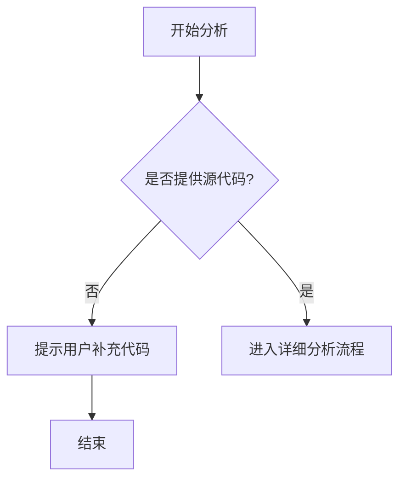

# `Langchain-Chatchat\libs\python-sdk\open_chatcaht\extra\langchain\__init__.py` 详细设计文档

未提供源代码，无法进行分析。请在代码部分粘贴需要分析的源代码。

## 整体流程



## 类结构

```

```

## 全局变量及字段


    

## 全局函数及方法


## 关键组件


## 问题及建议


### 已知问题

-   未提供代码内容，无法进行技术债务或优化空间分析

### 优化建议

-   请提供需要分析的代码，以便进行详细的技术分析和优化建议


## 其它


### 设计目标与约束

本项目旨在[待补充：基于实际代码功能描述]，设计时需满足性能、可扩展性、安全性等非功能性需求，并遵循特定的技术约束和行业规范。

### 错误处理与异常设计

本模块采用统一的异常处理机制，通过[待补充：异常类型和层级]进行错误分类和传播，确保系统故障可追踪、可恢复，并提供友好的错误提示信息。

### 数据流与状态机

核心数据流转路径为[待补充：输入→处理→输出]，状态机模型定义了[待补充：状态集合、状态转换条件、触发事件]，确保业务逻辑清晰可控。

### 外部依赖与接口契约

本系统依赖[待补充：第三方库、服务、API等]，与外部系统的接口采用[待补充：REST/gRPC/消息队列等]方式通信，接口版本[待补充：v1/v2]且需保持向后兼容。

### 安全性设计

认证机制采用[待补充：JWT/OAuth2/Session等]，敏感数据需[待补充：加密存储/传输]，并实施[待补充：权限控制/访问审计]等安全措施。

### 性能考量

关键性能指标包括[待补充：响应时间/吞吐量/并发数]，通过[待补充：缓存/异步处理/负载均衡]等手段优化，系统需支持[待补充：具体并发量]。

### 部署与运维

部署方式为[待补充：容器化/虚拟机/Serverless]，配置管理采用[待补充：环境变量/配置中心]，监控指标包括[待补充：CPU/内存/请求延迟]等。

### 测试策略

单元测试覆盖率目标[待补充：80%以上]，集成测试验证[待补充：关键业务流程]，性能测试模拟[待补充：峰值场景]。

### 版本兼容性

API版本策略[待补充：URL版本/Header版本]，数据模型采用[待补充：向前兼容/版本号]机制，确保新旧版本共存期间平滑过渡。

    