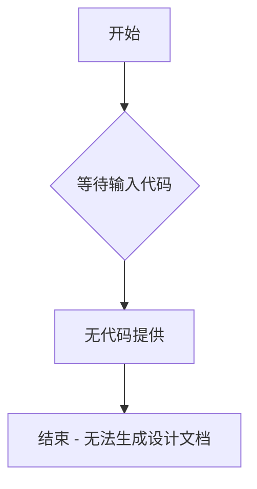

# `Langchain-Chatchat\libs\python-sdk\open_chatcaht\extra\llmaindex\__init__.py` 详细设计文档

未提供代码进行分析。请在代码块中提供需要分析的源代码。

## 整体流程



## 类结构

```

```

## 全局变量及字段


    

## 全局函数及方法


## 关键组件


### 组件列表

（未提供代码，无法识别关键组件）

### 核心功能概述

（未提供代码，无法描述核心功能）

### 文件运行流程

（未提供代码，无法描述运行流程）

### 类详细信息

（未提供代码，无法提供类信息）

### 全局变量与全局函数

（未提供代码，无法提供全局变量与函数信息）

### 潜在技术债务与优化空间

（未提供代码，无法分析技术债务）

### 其他项目

（未提供代码，无法提供其他分析）


## 问题及建议


### 已知问题

-   未提供待分析的代码内容，无法进行技术债务或优化空间的分析

### 优化建议

-   请提供需要分析的源代码，以便进行详细的技术债务识别和优化建议


## 其它


### 设计目标与约束

描述系统的设计目标，包括性能要求、可扩展性目标、安全性要求等；列举项目的技术约束，如技术栈限制、兼容性要求、预算约束等。

### 错误处理与异常设计

描述系统中的错误处理机制，包括异常分类、错误码定义、错误消息规范、异常传播策略、降级处理机制等。

### 数据流与状态机

描述数据的流转路径，包括输入数据处理流程、数据转换逻辑、输出数据格式；如涉及状态机，描述状态定义、状态转换条件、状态变更触发器等。

### 外部依赖与接口契约

列举系统依赖的外部服务、库、框架等；定义与外部系统交互的接口规范，包括接口协议、请求/响应格式、认证机制、版本管理策略等。

### 配置文件与参数说明

描述系统使用的配置文件结构、各配置项的作用、默认值、取值范围；说明运行时参数的设置方式和生效机制。

### 安全性设计

描述系统的安全机制，包括身份认证、授权控制、数据加密、敏感信息保护、输入验证、SQL注入防护等安全措施。

### 性能与监控设计

描述系统的性能指标要求、性能优化策略；说明监控指标、告警阈值、日志记录方案、链路追踪方案等可观测性设计。

### 部署与运维设计

描述系统的部署架构、运行环境要求、容器化方案、负载均衡策略、灾备方案、扩容缩容策略等运维相关设计。

### 测试策略

描述单元测试、集成测试、系统测试的覆盖范围；说明测试用例设计原则、Mock策略、测试数据准备方案等。

### 版本兼容性说明

描述API版本管理策略、向前向后兼容性维护方案、数据迁移策略、版本发布流程等。

    