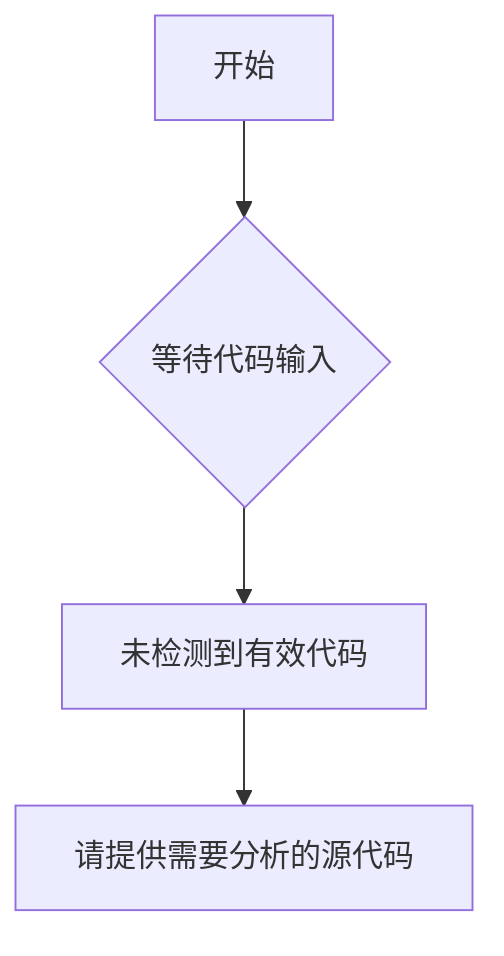

# `Langchain-Chatchat\libs\python-sdk\open_chatcaht\extra\llmaindex\chatchat_kb_retrieve.py` 详细设计文档

未提供源代码文件

## 整体流程



## 类结构

```

```

## 全局变量及字段


    

## 全局函数及方法


## 关键组件


## 问题及建议


### 已知问题

-   代码为空，未提供任何可分析的源代码内容
-   无法提取类、函数、全局变量等详细信息
-   无法生成完整的详细设计文档

### 优化建议

-   请提供需要分析的源代码，以便进行技术债务和优化空间的评估
-   确保代码内容完整且格式正确（无截断或占位符）
-   如果是多文件项目，请提供所有相关源文件


## 其它


### 设计目标与约束

本代码库的设计目标与约束待补充。设计目标应明确阐述系统要解决的核心问题、业务价值以及预期的技术目标。约束条件应包括性能指标（如响应时间、吞吐量）、资源限制（如内存、存储）、兼容性要求（支持的平台、浏览器、SDK版本）以及法规合规要求（如GDPR、HIPAA）。由于当前代码为空，需要在后续补充具体业务需求后完善本章节。

### 错误处理与异常设计

错误处理与异常设计待补充。应明确系统中的异常分类（如业务异常、系统异常、第三方服务异常）、异常传播机制、错误码体系设计、日志记录规范以及降级策略。对于空代码库，建议采用统一的异常处理框架，定义标准的错误响应格式（包含错误码、错误信息、错误详情、请求ID等），并制定详细的异常处理流程文档。

### 数据流与状态机

数据流与状态机待补充。应描绘系统从接收请求到返回响应的完整数据流转路径，包括数据输入验证、业务逻辑处理、数据持久化、外部服务调用等环节。对于涉及状态变更的业务场景，应详细设计状态机模型，定义所有可能的状态、触发状态转换的事件、转换条件以及转换后的副作用。当前代码为空，暂无具体数据流和状态机设计。

### 外部依赖与接口契约

外部依赖与接口契约待补充。应列出系统所有的外部依赖（包括第三方库、框架、中间件、服务等），明确依赖版本要求、集成方式以及License信息。对于提供的API接口，应定义完整的接口契约，包括请求参数（参数名、类型、必填性、默认值、校验规则）、响应格式（成功响应、错误响应）、错误码定义、限流策略、认证授权方式等。由于代码为空，外部依赖和接口契约需在后续需求分析后确定。

### 安全性考虑

安全性考虑待补充。应涵盖身份认证与授权机制（如OAuth2.0、JWT、Session）、数据加密方案（传输加密、存储加密）、输入验证与防注入攻击策略、XSS/CSRF防护、敏感信息处理规范、安全审计日志等方面。对于空代码库，建议采用安全开发生命周期（SDL）实践，在编码阶段遵循OWASP安全编码指南。

### 性能考虑

性能考虑待补充。应明确性能指标目标（如TPS、QPS、RT、并发数）、资源利用率要求（CPU、内存、磁盘IO、网络IO）、性能测试计划以及性能调优策略。对于可能成为性能瓶颈的模块（如数据库查询、复杂计算、第三方服务调用），应提前设计缓存机制、异步处理、读写分离等优化方案。当前代码为空，暂无具体性能设计。

### 可扩展性设计

可扩展性设计待补充。应阐述系统的水平扩展和垂直扩展策略，包括服务拆分思路、无状态设计、分布式缓存、数据库分片、消息队列异步解耦等。对于业务功能扩展，应设计良好的扩展点（如插件机制、策略模式、模板方法），确保新增功能时最小化对现有代码的修改。空代码库应遵循SOLID原则和良好的代码组织结构，为未来扩展预留空间。

### 配置管理

配置管理待补充。应定义配置项分类（如环境配置、业务配置、第三方服务配置）、配置存储方式（如配置文件、环境变量、配置中心）、配置更新机制（热更新、冷更新）以及配置审计要求。对于敏感配置（如数据库密码、API密钥），应明确加密存储和访问控制策略。当前代码库暂无配置管理设计，需根据实际技术栈选择合适的配置管理方案。

### 部署架构

部署架构待补充。应描绘系统的部署拓扑结构，包括服务器/容器数量、负载均衡策略、高可用方案、灾难恢复策略等。对于云原生应用，应明确Kubernetes部署配置、容器镜像构建流程、CI/CD流水线设计、服务网格配置等。空代码库暂无具体部署架构设计，需根据业务规模和技术选型确定。

### 测试策略

测试策略待补充。应明确测试分层策略（单元测试、集成测试、端到端测试）、测试覆盖率要求、测试数据管理、Mock策略、自动化测试框架选型以及性能测试方法。对于空代码库，建议采用测试驱动开发（TDD）实践，确保核心业务逻辑具备充分的测试覆盖。测试设计应包含正向场景、边界条件、异常情况以及安全性测试用例。

### 监控与运维

监控与运维待补充。应定义监控指标体系（包括基础设施监控、应用性能监控、业务指标监控）、告警策略（告警阈值、告警渠道、告警级别）、日志采集与分析方案、链路追踪方案、运维自动化工具链等。对于生产环境，应设计完善的运维文档，包括部署手册、故障排查指南、应急响应流程等。空代码库暂无具体监控运维设计，需根据实际部署环境确定。

### 编码规范与代码审查

编码规范与代码审查待补充。应明确编程语言编码规范（如Google Java Style、PEP 8）、命名约定、注释规范、提交信息规范（Conventional Commits）等。代码审查流程应定义审查清单、审查通过标准、冲突解决机制等。建议采用自动化工具（如ESLint、Checkstyle、SonarQube）进行代码质量检查，将代码规范检查集成到CI/CD流程中。空代码库应从一开始就建立良好的编码规范。

### 版本演进与迁移策略

版本演进与迁移策略待补充。应定义版本号命名规范（语义化版本）、版本发布流程、废弃功能处理策略。对于涉及数据迁移或API变更的版本升级，应设计平滑迁移方案，包括向后兼容性策略、灰度发布策略、回滚机制等。当前代码为空，暂无版本演进需求，但应提前规划以支持未来的平滑迭代。


    