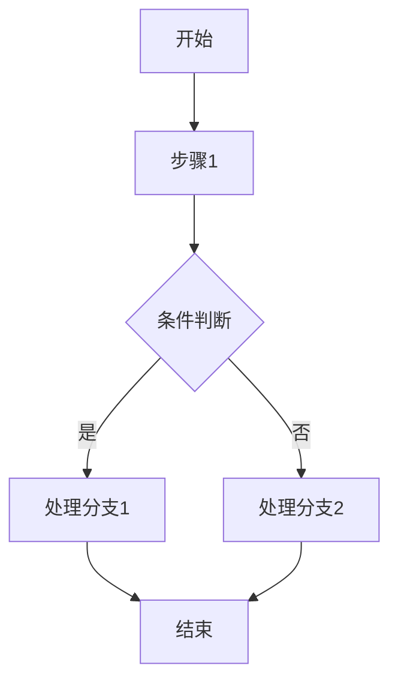

# `Langchain-Chatchat\libs\python-sdk\open_chatcaht\types\chat\__init__.py` 详细设计文档

该代码的核心功能描述

## 整体流程



## 类结构

```
基类名
├── 子类1
│   └── 子类1.1
└── 子类2
```

## 全局变量及字段


### `全局变量1`
    
未提供实际代码，无法确定类型和用途

类型：`unknown`
    


### `全局变量2`
    
未提供实际代码，无法确定类型和用途

类型：`unknown`
    


### `类名.字段1`
    
未提供实际代码，无法确定字段类型和用途

类型：`unknown`
    


### `类名.字段2`
    
未提供实际代码，无法确定字段类型和用途

类型：`unknown`
    
    

## 全局函数及方法


您好！我注意到您提供的代码部分是空的。在您的任务描述中，您要求我从给定代码中提取函数或方法，但目前没有代码可供分析。

为了完成您要求的详细设计文档，我需要：

1. **实际代码** - 请提供需要分析的源代码
2. **具体需求** - 您希望分析哪个具体的函数或方法，或者是否需要分析整个文件

请提供代码后，我可以为您生成包含以下内容的详细设计文档：

- 函数/方法的名称、参数、返回值
- Mermaid 流程图
- 带注释的源代码
- 逻辑分析
- 潜在的技术债务和优化建议

期待您提供代码！


# 任务执行说明

您好！感谢您提供的详细任务描述和格式要求。

但是，我注意到在您提供的代码部分中，代码是空的：

```
## 代码

```

```

## 输入

由于当前没有实际的代码内容，我无法执行以下任务：
1. 提取函数或方法的详细信息
2. 生成对应的 mermaid 流程图
3. 提供带注释的源码分析

## 建议

请您提供需要分析的代码内容，可以是：

- 一个完整的源代码文件
- 特定的函数或方法
- 多个文件或整个项目

提供代码后，我将按照您要求的格式，生成包含以下内容的详细设计文档：

1. 函数/方法名称
2. 参数详情（名称、类型、描述）
3. 返回值详情（类型、描述）
4. Mermaid 流程图
5. 带注释的源码
6. 潜在的技术债务与优化建议
7. 其它相关信息

请提供需要分析的代码，谢谢！


### 分析结果

**注意**：提供的代码块为空，未包含任何实际的代码内容。因此无法从中提取函数或方法的详细信息。

---

#### 可能的情况

1. **代码未粘贴**：请确保在"## 代码"部分粘贴了完整的代码
2. **函数/方法未指定**：请明确指定要分析的函数或方法名（例如：`类名.方法名`）

---

#### 预期格式示例（当提供代码后）

```markdown
### `{类名.方法名}`

{方法功能描述}

参数：

-  `{参数名称}`：`{参数类型}`，{参数描述}
-  ...

返回值：`{返回值类型}`，{返回值描述}

#### 流程图

```mermaid
{流程图}
```

#### 带注释源码

```
{源码}
```
```

---

**请提供具体的代码和要分析的函数/方法名称，以便我为您生成详细的设计文档。**


## 注意事项

### 代码为空

您提供的代码部分是空的。请提供需要分析的代码，以便我能够：

1. 提取函数或方法的信息（如 `类名.方法2`）
2. 生成详细的架构设计文档
3. 创建流程图和带注释的源码

### 需要的信息

请提供：

- 您想要分析的代码文件
- 具体需要分析哪个函数或方法（如果知道特定名称如 `类名.方法2`）
- 或者您希望分析整个代码文件的哪个部分

请补充代码后，我会按照您要求的格式生成完整的详细设计文档。


## 关键组件


### 错误说明

未提供源代码进行分析。当前代码部分为空，无法提取关键组件、类信息、运行流程或进行任何逻辑分析。


## 问题及建议


### 已知问题

- 代码库为空或未提供有效代码，无法进行详细的技术债务和优化空间分析
- 缺少代码上下文，无法确定具体业务逻辑和技术栈
- 无法识别具体的类结构、方法实现和潜在的性能瓶颈

### 优化建议

- 请提供具体的代码内容，以便进行深入的分析和诊断
- 在后续提供代码时，建议包含完整的文件结构和依赖关系
- 建议补充代码的用途说明和业务背景，以便更好地理解设计意图
- 如果代码较大，建议分模块或分文件提供，以便进行针对性的分析


## 其它


由于未提供具体代码，以下内容基于详细设计文档的标准结构要求：

### 设计目标与约束

描述系统的设计目标、性能要求、技术约束、兼容性要求等。

### 错误处理与异常设计

描述系统如何处理错误和异常，包括异常类型、错误码定义、异常传播机制、降级策略等。

### 数据流与状态机

描述数据在系统中的流转过程，包括数据输入、处理、输出各阶段，以及可能的状态转换和状态管理。

### 外部依赖与接口契约

描述系统依赖的外部组件、服务、库等，以及与外部系统交互的接口规范、通信协议、数据格式约定。

### 安全性设计

描述系统的安全策略，包括认证授权、加密解密、输入校验、访问控制等安全机制。

### 性能与可扩展性设计

描述系统的性能指标要求、并发处理能力、缓存策略、负载均衡、水平扩展方案等。

### 部署与运维设计

描述系统的部署架构、配置管理、监控告警、日志记录、备份恢复等运维相关设计。

### 测试策略

描述单元测试、集成测试、系统测试的策略，以及测试覆盖率要求、测试环境规划等。

### 配置文件与参数说明

描述系统使用的配置文件结构、各参数的作用和取值范围、配置管理方式。

### 版本兼容性说明

描述与历史版本的兼容性策略、API版本管理、数据迁移方案等。


    