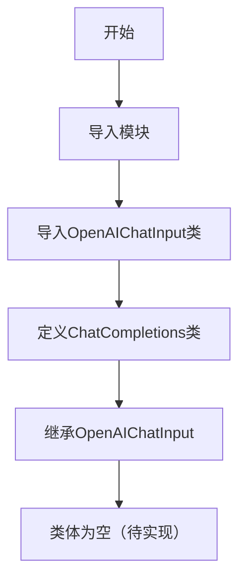
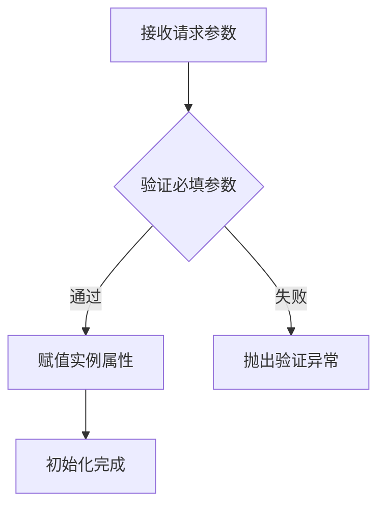

# `Langchain-Chatchat\libs\python-sdk\open_chatcaht\types\chat\chat_completions.py` 详细设计文档

该文件定义了一个ChatCompletions类，继承自OpenAIChatInput，用于处理OpenAI聊天补全API的输入模式。该类作为API请求的数据模型，可能用于验证和解析聊天补全接口的输入数据。

## 整体流程



## 类结构

```
OpenAIChatInput (基类/父类)
└── ChatCompletions (继承子类)
```

## 全局变量及字段


    

## 全局函数及方法


## 关键组件


### ChatCompletions 类

继承自 OpenAIChatInput 的聊天补全请求处理类，用于处理 OpenAI 格式的聊天补全 API 请求。

### OpenAIChatInput

从 chatchat.server.api.api_schemas 模块导入的基类，定义了聊天补全 API 的输入数据结构规范。


## 问题及建议


### 已知问题

-   **空类实现**：ChatCompletions类仅继承自OpenAIChatInput但没有任何实际实现，仅包含`...`占位符，无法提供任何额外功能或业务逻辑，类的存在性值得商榷。
-   **继承滥用**：使用类继承来实现API端点定义不够灵活，若仅是为了类型标注或语义区分，应使用类型别名或组合而非继承。
-   **缺乏文档说明**：类没有任何文档字符串（docstring），无法明确该类的设计意图、适用场景和使用方式。
-   **功能边界不明确**：无法判断该类是用于API路由定义、数据验证还是仅作为命名空间，职责不清晰。
-   **外部强依赖**：直接继承chatchat.server.api.api_schemas.OpenAIChatInput，导致与外部模块强耦合，OpenAIChatInput的接口变更会直接影响此类。

### 优化建议

-   **明确类职责**：若此类仅为API端点标识，建议使用TypeAlias或直接使用OpenAIChatInput；若需扩展功能，应添加具体实现而非空类占位。
-   **添加文档注释**：至少应包含类的作用、使用场景及与OpenAIChatInput关系的说明。
-   **解耦设计**：考虑通过组合或依赖注入替代直接继承，降低对外部模块的强耦合。
-   **实现或移除**：若当前业务暂不需要此类，建议移除该空类定义以避免代码混乱；若需要，应尽快补充完整实现。
-   **接口抽象**：若此类需要被多处引用，建议定义抽象基类或协议（Protocol），明确接口契约。


## 其它


### 一段话描述

ChatCompletions是一个继承自OpenAIChatInput的数据模型类，用于处理OpenAI兼容的Chat Completions API请求输入，封装聊天完成功能的请求参数结构。

### 文件的整体运行流程

该文件作为数据模型定义模块，被API路由层引用。当客户端发送聊天完成请求时，请求数据被反序列化为ChatCompletions对象，验证各项参数后传递给业务逻辑层处理，最终返回聊天完成结果。

### 类字段（推断）

由于代码仅包含类继承声明，类字段需参考父类OpenAIChatInput的典型定义：

| 字段名称 | 类型 | 描述 |
|---------|------|------|
| messages | List[Message] | 聊天消息列表，包含角色和内容 |
| model | str | 使用的模型名称 |
| temperature | float | 生成温度参数 |
| max_tokens | int | 最大生成token数 |
| stream | bool | 是否使用流式响应 |
| top_p | float | nucleus采样参数 |
| stop | List[str] | 停止词列表 |

### 类方法（推断）

由于代码未实现具体方法，类方法需参考父类OpenAIChatInput的典型定义：

#### __init__方法

| 项目 | 内容 |
|------|------|
| 名称 | __init__ |
| 参数 | self, messages: List[Dict], model: str, temperature: float = 0.7, max_tokens: int = None, stream: bool = False, **kwargs |
| 参数描述 | 初始化聊天完成请求参数 |
| 返回值类型 | None |
| 返回值描述 | 无返回值 |

**mermaid流程图**


**源码**
```python
def __init__(self, messages: List[Dict], model: str, temperature: float = 0.7, 
             max_tokens: int = None, stream: bool = False, **kwargs):
    super().__init__(
        messages=messages,
        model=model,
        temperature=temperature,
        max_tokens=max_tokens,
        stream=stream,
        **kwargs
    )
```

### 全局变量

该文件未定义全局变量。

### 全局函数

该文件未定义全局函数。

### 关键组件信息

| 组件名称 | 描述 |
|---------|------|
| OpenAIChatInput | 父类，定义OpenAI兼容API的输入数据结构 |
| ChatCompletions | 当前类，作为聊天完成API的数据模型 |

### 潜在的技术债务或优化空间

1. **文档缺失**：类本身缺乏docstring文档说明其用途和用法
2. **继承过度耦合**：直接继承自OpenAIChatInput，如父类变更可能影响当前类
3. **验证逻辑缺失**：未在当前类中添加额外的参数验证逻辑
4. **类型提示不完整**：缺少对messages中Message结构的详细类型定义

### 其它项目

#### 设计目标与约束

- 目标：提供OpenAI兼容的Chat Completions API数据模型
- 约束：必须继承自OpenAIChatInput以保持API兼容性

#### 错误处理与异常设计

- 依赖父类OpenAIChatInput的参数验证机制
- 建议在调用处捕获Pydantic验证错误（ValidationError）

#### 数据流与状态机

- 请求数据 → 反序列化 → ChatCompletions实例 → 业务处理 → 响应

#### 外部依赖与接口契约

- 依赖：chatchat.server.api.api_schemas.OpenAIChatInput
- 接口契约：接收符合OpenAI Chat Completions API规范的JSON输入

#### 使用示例

```python
# 创建请求对象
request = ChatCompletions(
    messages=[
        {"role": "system", "content": "You are a helpful assistant."},
        {"role": "user", "content": "Hello!"}
    ],
    model="gpt-3.5-turbo",
    temperature=0.7
)
```


    