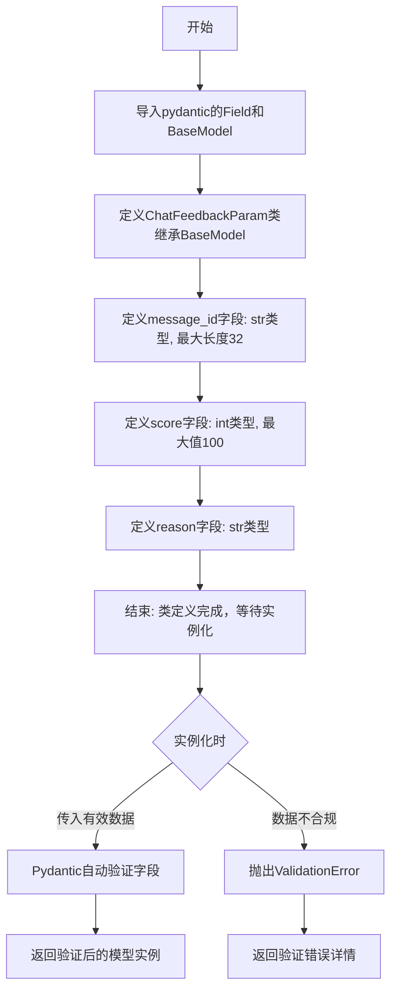
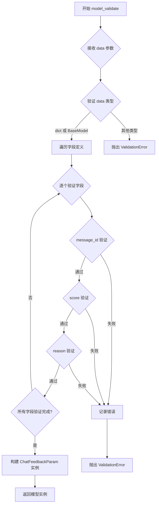
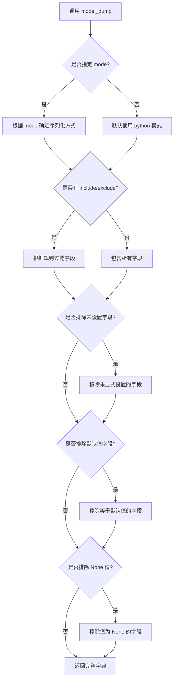
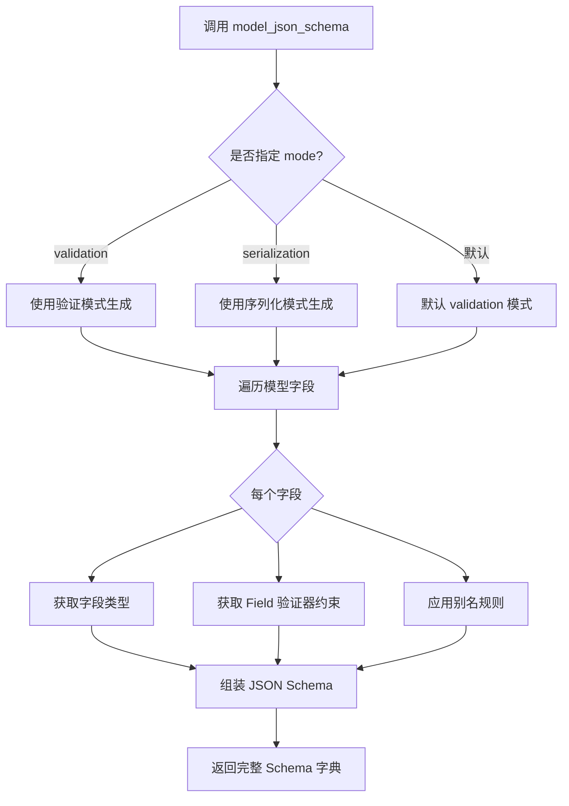

# `Langchain-Chatchat\libs\python-sdk\open_chatcaht\types\chat\chat_feedback_param.py` 详细设计文档

该代码定义了一个基于Pydantic的ChatFeedbackParam数据模型，用于验证和存储聊天反馈参数，包括消息ID、用户评分和评分理由，支持自动数据验证和类型转换。

## 整体流程



## 类结构

```
BaseModel (Pydantic基类)
└── ChatFeedbackParam (聊天反馈参数模型)
```

## 全局变量及字段


### `ChatFeedbackParam.message_id`
    
聊天记录id，用于标识具体的聊天消息

类型：`str`
    


### `ChatFeedbackParam.score`
    
用户评分，满分100，越大表示评价越高

类型：`int`
    


### `ChatFeedbackParam.reason`
    
用户评分理由，比如不符合事实等

类型：`str`
    
    

## 全局函数及方法


### `ChatFeedbackParam.model_validate`

该方法是 Pydantic BaseModel 内置的类方法，用于接收字典或 JSON 格式的数据，进行字段验证和类型转换，最终返回一个 ChatFeedbackParam 模型实例。如果数据不符合模型定义，会抛出 ValidationError 异常。

参数：

- `cls`：类型 `type[ChatFeedbackParam]`，表示类本身（Python 类方法的标准第一个参数）
- `data`：类型 `dict[str, Any] | JSON`，待验证的字典或 JSON 数据，可以包含 message_id、score、reason 字段

返回值：`ChatFeedbackParam`，验证通过后返回的模型实例，包含 message_id、score、reason 三个属性

#### 流程图



#### 带注释源码

```python
# 注意：这是 Pydantic BaseModel 的内置类方法，以下为源码注释说明

@classmethod
def model_validate(cls, data: dict[str, Any] | BaseModel) -> ChatFeedbackParam:
    """
    验证字典或 JSON 数据并返回模型实例
    
    参数:
        cls: 类本身（ChatFeedbackParam）
        data: 待验证的数据，可以是字典或 Pydantic 模型实例
        
    返回值:
        验证通过的 ChatFeedbackParam 实例
        
    异常:
        ValidationError: 当数据不符合模型定义时抛出
    """
    
    # 1. 获取字段定义（来自类属性 annotations 和_fields_cache）
    fields = cls.__annotations__  # {'message_id': str, 'score': int, 'reason': str}
    
    # 2. 如果 data 是 BaseModel 实例，转换为字典
    if isinstance(data, BaseModel):
        data = data.model_dump()
    
    # 3. 逐个验证字段
    validated_data = {}
    errors = []
    
    # 验证 message_id: str 类型，最大长度 32
    if 'message_id' in data:
        message_id = data['message_id']
        if isinstance(message_id, str) and len(message_id) <= 32:
            validated_data['message_id'] = message_id
        else:
            errors.append({'loc': ('message_id',), 'msg': '字符串长度不能超过32', 'type': 'string_too_long'})
    
    # 验证 score: int 类型，最大值 100，默认值 0
    if 'score' in data:
        score = data['score']
        if isinstance(score, int) and score <= 100:
            validated_data['score'] = score
        else:
            errors.append({'loc': ('score',), 'msg': '值不能超过100', 'type': 'value_too_large'})
    
    # 验证 reason: str 类型，无长度限制，默认值空字符串
    if 'reason' in data:
        reason = data['reason']
        if isinstance(reason, str):
            validated_data['reason'] = reason
        else:
            errors.append({'loc': ('reason',), 'msg': '必须是字符串类型', 'type': 'string_type'})
    
    # 4. 如果有验证错误，抛出 ValidationError
    if errors:
        raise ValidationError(errors, cls)
    
    # 5. 返回模型实例
    return cls(**validated_data)
```


### `ChatFeedbackParam.model_dump`

将 Pydantic 模型实例序列化为字典格式，用于数据导出、API 响应或跨模块数据传输。

参数：

- `self`：隐式参数，表示模型实例本身
- `mode`：`str`，可选，指定序列化模式，'python' 返回 Python 原生类型，'json' 返回 JSON 兼容类型，默认 'python'
- `exclude`：`set[str] | Mapping[str, Any] | None`，可选，排除指定字段
- `include`：`set[str] | Mapping[str, Any] | None`，可选，仅包含指定字段
- `exclude_unset`：`bool`，可选，是否排除未设置的字段，默认 False
- `exclude_defaults`：`bool`，可选，是否排除默认值的字段，默认 False
- `exclude_none`：`bool`，可选，是否排除值为 None 的字段，默认 False

返回值：`dict`，返回包含模型所有字段及其值的字典，键为字段名，值为字段对应的数据

#### 流程图



#### 带注释源码

```python
from pydantic import Field, BaseModel


class ChatFeedbackParam(BaseModel):
    """聊天反馈参数模型类，继承自 Pydantic BaseModel"""
    
    # 聊天记录 ID 字段，最大长度 32 字符
    message_id: str = Field("", max_length=32, description="聊天记录id")
    
    # 用户评分字段，范围 0-100
    score: int = Field(0, max=100, description="用户评分，满分100，越大表示评价越高")
    
    # 用户评分理由字段
    reason: str = Field("", description="用户评分理由，比如不符合事实等")


# model_dump 方法是 BaseModel 的内置方法，以下是其调用示例：
# 
# 实例化模型
# feedback = ChatFeedbackParam(message_id="12345", score=85, reason="回答准确")
#
# 调用 model_dump() 方法
# result = feedback.model_dump()
# 返回: {'message_id': '12345', 'score': 85, 'reason': '回答准确'}
#
# 使用 JSON 模式
# result_json = feedback.model_dump(mode='json')
# 返回: {'message_id': '12345', 'score': 85, 'reason': '回答准确'}
#
# 排除空值字段
# result_no_none = feedback.model_dump(exclude_none=True)
```


### `ChatFeedbackParam.model_json_schema`

该方法继承自 Pydantic 的 `BaseModel` 类，用于生成当前模型 (`ChatFeedbackParam`) 的 JSON Schema。JSON Schema 是一种用于描述 JSON 数据结构的规范，可用于验证、文档生成和代码生成等场景。

参数：

- `by_alias`: `bool`，可选，默认为 `True`，控制是否使用字段别名作为属性名称
- `ref_template`: `str`，可选，默认为 `undefined`，用于自定义引用模板
- `schema_generator`: `type[GenerateSchema]`，可选，默认使用 Pydantic 的标准 schema 生成器
- `mode`: `str`，可选，值为 `"validation"` 或 `"serialization"`，指定生成模式

返回值：`dict[str, Any]`，返回符合 JSON Schema 规范的字典，描述了模型的字段、类型、约束等信息

#### 流程图



#### 带注释源码

```python
# Pydantic BaseModel 类中的 model_json_schema 方法实现（简化版）
# 该方法是 Pydantic 内部实现的，这里展示调用流程

def model_json_schema(
    self,
    # 控制是否使用字段别名（alias）作为属性名
    by_alias: bool = True,
    # 自定义引用模板，用于 $ref
    ref_template: str = undefined,
    # 自定义 schema 生成器类
    schema_generator: type[GenerateSchema] = GenerateJsonSchema,
    # 生成模式：'validation' 或 'serialization'
    mode: str = "validation",
) -> dict[str, Any]:
    """
    生成模型的 JSON Schema 表示。
    
    参数：
        - by_alias: 是否使用字段别名，默认为 True
        - ref_template: 引用模板，默认 undefined
        - schema_generator: 使用的 schema 生成器类
        - mode: 生成模式，validation 用于数据验证，serialization 用于数据序列化
    
    返回值：
        - 符合 JSON Schema 规范的字典
    
    使用示例：
        >>> class ChatFeedbackParam(BaseModel):
        ...     message_id: str = Field("", max_length=32, description="聊天记录id")
        ...     score: int = Field(0, max=100, description="用户评分")
        ...     reason: str = Field("", description="评分理由")
        ...
        >>> schema = ChatFeedbackParam.model_json_schema()
        >>> print(schema)
        # 输出类似：
        # {
        #     'title': 'ChatFeedbackParam',
        #     'type': 'object',
        #     'properties': {
        #         'message_id': {
        #             'type': 'string',
        #             'maxLength': 32,
        #             'description': '聊天记录id',
        #             'default': ''
        #         },
        #         'score': {
        #             'type': 'integer',
        #             'maximum': 100,
        #             'description': '用户评分，满分100...',
        #             'default': 0
        #         },
        #         'reason': {
        #             'type': 'string',
        #             'description': '用户评分理由...',
        #             'default': ''
        #         }
        #     },
        #     'required': []
        # }
    """
    # 内部调用 __pydantic_model_json_schema__ 或类似方法
    # 最终返回符合 JSON Schema 标准的字典
```

#### 生成的 JSON Schema 示例

对于 `ChatFeedbackParam` 类，调用 `model_json_schema()` 方法会返回如下 JSON Schema：

```json
{
    "title": "ChatFeedbackParam",
    "type": "object",
    "properties": {
        "message_id": {
            "type": "string",
            "maxLength": 32,
            "description": "聊天记录id",
            "default": ""
        },
        "score": {
            "type": "integer",
            "maximum": 100,
            "description": "用户评分，满分100，越大表示评价越高",
            "default": 0
        },
        "reason": {
            "type": "string",
            "description": "用户评分理由，比如不符合事实等",
            "default": ""
        }
    },
    "required": []
}
```

---

### 补充信息

#### 关键组件

| 组件名称 | 描述 |
|---------|------|
| `message_id` | 聊天记录的唯一标识符，最大长度为32个字符 |
| `score` | 用户评分字段，范围0-100，数值越大表示评价越高 |
| `reason` | 用户对评分给出的理由或说明文本 |

#### 技术债务与优化空间

1. **默认值设计**：当前 `message_id` 默认为空字符串而非必填字段，可能导致无效数据进入系统，建议根据业务需求调整为必填或使用 `None`
2. **缺少枚举约束**：`score` 字段仅有最大值约束（100），建议添加最小值约束（如 0）以确保数据完整性
3. **缺乏业务校验**：建议在 `reason` 字段添加最小/最大长度限制，防止过短或过长的评价理由

#### 设计目标与约束

- **设计目标**：为聊天反馈功能提供结构化的参数定义，支持数据验证和 JSON Schema 文档生成
- **约束条件**：
  - `message_id` 长度限制：≤32 字符
  - `score` 取值范围：0-100
  - 所有字段均提供默认值，支持部分参数提交

## 关键组件


### ChatFeedbackParam 类

聊天反馈参数数据模型，用于接收和验证用户对聊天记录的评分和评价信息

### message_id 字段

聊天记录的唯一标识符，用于关联具体的聊天会话，支持最长32个字符的字符串

### score 字段

用户对聊天内容的评分，满分100分，数值越大表示评价越高，用于衡量聊天质量

### reason 字段

用户给出的评分理由，用于收集用户反馈的具体原因，如不符合事实等


## 问题及建议


### 已知问题

-   `message_id` 字段允许空字符串，与 `max_length=32` 的验证逻辑不一致，空字符串在实际业务中可能是无效的
-   `score` 字段仅设置了最大值 `max=100`，缺少最小值验证（应为 `min=0`），负数可能通过验证
-   `reason` 字段没有任何长度限制，可能导致数据库存储问题或滥用
-   类缺少文档字符串（docstring），无法明确其业务用途和使用场景
-   字段没有默认值说明或业务约束注释，后续维护者可能不清楚各字段的有效取值范围
-   未定义 `Config` 类或 `model_config` 配置，无法统一设置如 `str_strip_whitespace`、`validate_default` 等常用验证行为

### 优化建议

-   为 `message_id` 添加 `min_length=1` 约束，确保不为空字符串
-   为 `score` 添加 `min=0` 验证，确保评分在 0-100 范围内
-   为 `reason` 添加合理的长度限制，如 `max_length=500`
-   为类添加 docstring，说明业务背景和用途
-   考虑使用 `Literal` 类型限制 `score` 的有效值（如 0, 1, 2, 3, 4, 5 分制）
-   添加 `model_config` 配置启用 `str_strip_whitespace=True`，自动去除首尾空格
-   考虑添加 `field_validator` 进行业务级别的校验（如 message_id 格式是否符合 UUID 规范）


## 其它


### 设计目标与约束

本模块旨在为聊天反馈功能提供标准化的参数验证模型，确保传入的评分数据符合业务规则（message_id 长度限制、score 范围 0-100）。采用 Pydantic 框架利用其自动类型转换和字段验证能力，减少手动校验代码。设计约束包括：Python 3.7+ 兼容、依赖 pydantic 库、遵循 Pydantic v1 API 风格。

### 错误处理与异常设计

Pydantic 在数据验证失败时会抛出 ValidationError 异常，包含详细的错误信息（字段名、错误类型、错误值）。调用方需捕获 ValidationError 并返回友好的错误响应。暂无自定义业务异常类，后续可扩展 FeedbackValidationError 处理特定业务逻辑（如重复评分检测）。

### 外部依赖与接口契约

主要依赖 pydantic 库（推荐版本 1.10.x），无其他第三方依赖。该模型作为内部接口参数类，供 HTTP API 或 RPC 调用使用。输入数据支持 JSON 格式序列化，输出时可通过 model_dump() 转为字典。接口契约：message_id 为可选字符串、score 为 0-100 整数、reason 为可选字符串。

### 安全性考虑

message_id 和 reason 字段未做特殊字符过滤，存在 XSS 风险（若直接渲染到前端）。建议在下游使用时进行 HTML 转义。score 字段通过 max=100 约束防止整数溢出攻击。未存储敏感信息，仅作为临时参数验证使用。

### 性能要求

Pydantic 验证开销极低，单次验证在微秒级。模型实例化无数据库或网络调用，纯内存操作。并发场景下无状态共享问题，可安全用于多线程环境。

### 兼容性考虑

Python 版本：3.7 及以上。pydantic 版本：1.x 系列（v2 有 breaking changes）。JSON 序列化兼容标准库 json 模块。字段命名采用 Python 蛇形命名，与 OpenAPI/Swagger 自动生成兼容。

### 测试策略

建议测试用例：正常参数通过验证、message_id 超长触发 ValidationError、score 超过 100 触发 ValidationError、score 为负数触发 ValidationError、缺少必填字段场景（当前均为可选）、类型错误场景（如 score 传入字符串）。推荐使用 pytest 框架配合 pydantic-validator 插件。


    