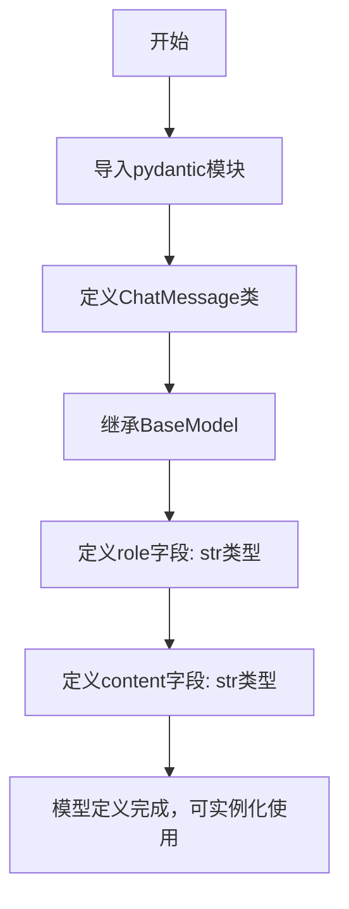
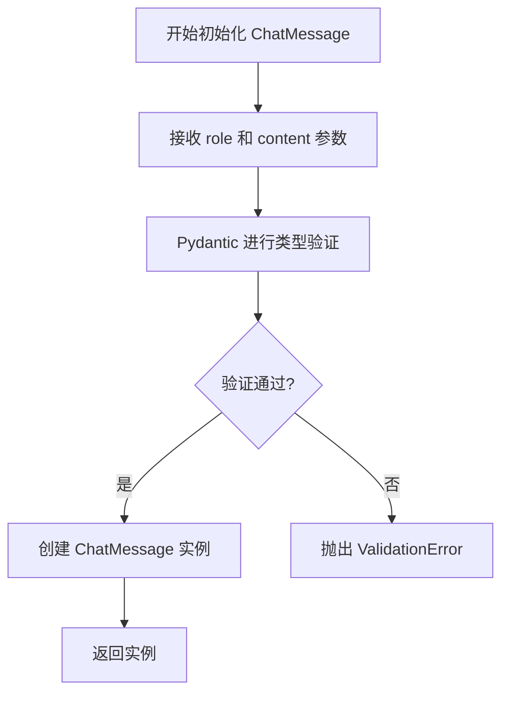
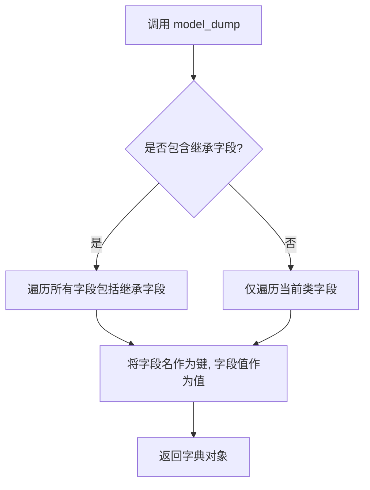
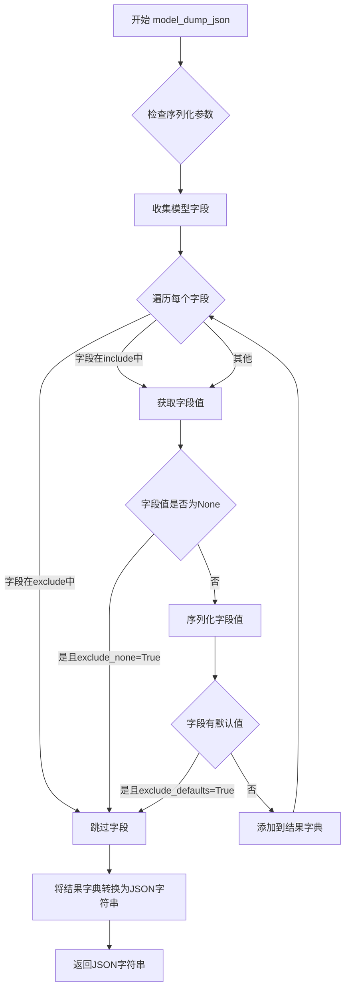
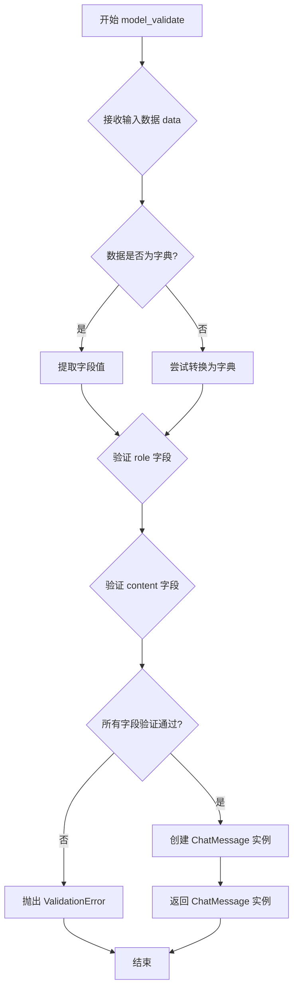

# `Langchain-Chatchat\libs\python-sdk\open_chatcaht\types\chat\chat_message.py` 详细设计文档

使用pydantic定义了一个简单的聊天消息模型，用于表示对话中的角色和内容信息

## 整体流程



## 类结构

```
BaseModel (pydantic基类)
└── ChatMessage (聊天消息模型)
```

## 全局变量及字段


### `ChatMessage.role`
    
消息角色（如user、assistant）

类型：`str`
    


### `ChatMessage.content`
    
消息内容

类型：`str`
    
    

## 全局函数及方法


### `ChatMessage.__init__`

这是 ChatMessage 类的初始化方法，继承自 Pydantic 的 BaseModel，用于创建包含角色和内容的聊天消息实例。该方法自动接收 role 和 content 参数并进行数据验证。

参数：

- `role`：`str`，表示消息发送者的角色（如 "user"、"assistant" 等）
- `content`：`str`，表示消息的实际内容

返回值：`ChatMessage`，返回初始化后的聊天消息对象实例

#### 流程图



#### 带注释源码

```python
def __init__(self, role: str = Field(...), content: str = Field(...)) -> None:
    """
    ChatMessage 类的初始化方法
    
    参数:
        role: str - 消息发送者的角色标识
        content: str - 消息的具体内容
    
    返回值:
        ChatMessage - 验证后的聊天消息实例
    """
    # 调用父类 BaseModel 的初始化方法进行数据验证和实例化
    super().__init__(role=role, content=content)
```


### `ChatMessage.__str__`

该方法是Pydantic BaseModel类继承而来的字符串表示方法，用于将ChatMessage模型实例转换为人类可读的字符串格式，默认返回类名及所有字段的名称和值。

参数：

- 该方法无显式参数（使用Python隐式self参数）

返回值：`str`，返回该模型的字符串表示，格式为`ChatMessage(role='...', content='...')`

#### 流程图

```mermaid
flowchart TD
    A[调用 ChatMessage.__str__] --> B{检查模型是否已实例化}
    B -->|是| C[获取模型的__dict__属性]
    B -->|否| D[返回类名加空括号]
    C --> E[遍历所有模型字段]
    E --> F[格式化字段名=字段值]
    F --> G[拼接为最终字符串]
    G --> H[返回格式: ChatMessage(role='xxx', content='xxx')]
```

#### 带注释源码

```python
def __str__(self) -> str:
    """
    返回模型的字符串表示形式。
    
    该方法继承自pydantic.BaseModel，提供了模型实例的默认字符串化实现。
    在pydantic v1中，__str__返回格式如：ChatMessage(role='user', content='hello')
    在pydantic v2中，__str__通常返回更结构化的表示。
    
    Returns:
        str: 包含类名和所有字段名值对的字符串
    """
    # 获取模型实例的字典表示（排除私有属性）
    # self.model_dump() 在 pydantic v2 中，或 self.dict() 在 pydantic v1 中
    data = self.__dict__.copy()
    
    # 过滤掉pydantic内部的私有属性（以_开头的键）
    # 保留只有模型定义的字段
    fields = {k: v for k, v in data.items() if not k.startswith('_')}
    
    # 格式化每个字段为 key='value' 形式
    # 对于字符串值添加引号，其他类型直接转为字符串
    field_strs = [f"{k}={repr(v)}" for k, v in fields.items()]
    
    # 拼接为最终字符串格式：ClassName(field1=value1, field2=value2)
    return f"{self.__class__.__name__}({', '.join(field_strs)})"
```

> **注意**：上述源码是pydantic BaseModel.__str__方法的典型实现逻辑重构。实际实现可能因pydantic版本不同而有差异。该方法的核心功能是将模型实例转换为包含类名和字段信息的可读字符串，便于调试和日志输出。


### `ChatMessage.__repr__`

继承自 BaseModel 的调试表示方法，用于返回 ChatMessage 模型的字符串表示形式，便于调试和日志输出。

参数：

- `self`：`ChatMessage`，调用该方法的实例对象本身

返回值：`str`，返回模型的字符串表示，格式为 `ChatMessage(role='...', content='...')`

#### 流程图

```mermaid
flowchart TD
    A[调用 __repr__ 方法] --> B{是否需要完整表示}
    B -->|是| C[获取所有字段名和字段值]
    B -->|否| D[使用简短表示]
    C --> E[格式化为 role='role值', content='content值']
    D --> E
    E --> F[返回字符串: ChatMessage(role='...', content='...')]
```

#### 带注释源码

```python
# 继承自 pydantic.BaseModel 的 __repr__ 方法
# BaseModel 会在类定义时自动生成此方法

# 实际的 __repr__ 实现位于 pydantic 库中，大致逻辑如下：
def __repr__(self) -> str:
    """
    返回模型的字符串表示
    
    Returns:
        str: 包含类名和所有字段名-值的字符串
    """
    # 1. 获取所有字段定义
    fields = self.model_fields  # {'role': ..., 'content': ...}
    
    # 2. 提取字段名和对应的值
    field_values = []
    for field_name in fields:
        value = getattr(self, field_name)
        field_values.append(f"{field_name}={value!r}")
    
    # 3. 组装字符串: ChatMessage(role='user', content='hello')
    return f"{self.__class__.__name__}({', '.join(field_values)})"

# 示例输出:
# >>> msg = ChatMessage(role="user", content="Hello")
# >>> msg.__repr__()
# "ChatMessage(role='user', content='Hello')"
```


### `ChatMessage.model_dump`

该方法继承自 Pydantic 的 BaseModel 类，用于将 ChatMessage 模型实例序列化为字典格式，导出模型中所有字段的名称和值，适用于对象序列化、数据传输或调试场景。

参数：

- `self`：隐式参数，ChatMessage 实例本身

返回值：`dict`，返回包含模型所有字段的字典，键为字段名，值为字段值

#### 流程图



#### 带注释源码

```python
from pydantic import BaseModel, Field


class ChatMessage(BaseModel):
    """
    ChatMessage 类：用于表示聊天消息的模型
    继承自 Pydantic 的 BaseModel, 自动获得 model_dump 方法
    """
    role: str = Field(...)  # 消息角色, 如 'user' 或 'assistant'
    content: str = Field(...)  # 消息内容

    # model_dump 是继承自 BaseModel 的方法
    # 导出模型实例为字典
    # def model_dump(self) -> dict:
    #     """将模型实例转换为字典"""
    #     ...
```


### `ChatMessage.model_dump_json`

继承自 Pydantic BaseModel 的 JSON 序列化方法，用于将 ChatMessage 模型实例转换为 JSON 格式的字符串。

参数：

- `self`：隐式参数，ChatMessage 实例本身
- `mode`：str，可选，序列化模式，默认为 "json"，表示输出 JSON 兼容的字符串
- `include`：set 或 list，可选，包含的字段列表，默认为 None
- `exclude`：set 或 list，可选，排除的字段列表，默认为 None
- `by_alias`：bool，可选，是否使用字段别名，默认为 False
- `exclude_unset`：bool，可选，是否排除未设置的字段，默认为 False
- `exclude_defaults`：bool，可选，是否排除默认字段，默认为 False
- `exclude_none`：bool，可选，是否排除 None 值字段，默认为 False

返回值：`str`，返回 JSON 格式的字符串表示

#### 流程图



#### 带注释源码

```python
# 由于 model_dump_json 继承自 Pydantic BaseModel，以下是其核心实现逻辑的注释说明

class ChatMessage(BaseModel):
    role: str = Field(...)      # 消息角色（如 'user', 'assistant'）
    content: str = Field(...)   # 消息内容

# model_dump_json 方法调用流程：
# 1. model_dump() - 将模型实例转换为字典
# 2. json.dumps() - 将字典序列化为 JSON 字符串

# 示例调用：
msg = ChatMessage(role="user", content="Hello")
json_str = msg.model_dump_json()
# 输出: '{"role":"user","content":"Hello"}'

# 带参数示例：
json_str_with_options = msg.model_dump_json(
    exclude={"role"},           # 排除 role 字段
    exclude_none=True,          # 排除值为 None 的字段
    by_alias=False              # 不使用字段别名
)
# 输出: '{"content":"Hello"}'
```


### `ChatMessage.model_validate`

这是 Pydantic BaseModel 的内置类方法，用于验证输入数据（通常是字典）并返回一个 ChatMessage 实例。如果数据不符合模型定义，会抛出验证错误。

参数：

- `data`：`Any`，需要验证的数据，通常是字典类型
- `strict`：可选，`bool`，是否使用严格模式验证，默认为 None
- `from_derivations`：可选，`bool`，是否允许从派生模型验证，默认为 True
- `context`：可选，`Any`，验证上下文，可用于自定义验证器

返回值：`ChatMessage`，验证通过后返回的 ChatMessage 实例

#### 流程图



#### 带注释源码

```python
# 这是 Pydantic BaseModel 的类方法，此处展示调用方式
# 源码位置：pydantic.main

class ChatMessage(BaseModel):
    """
    聊天消息模型类
    继承自 Pydantic 的 BaseModel，自动获得 model_validate 等验证方法
    """
    role: str = Field(...)      # 消息角色，如 'user', 'assistant'
    content: str = Field(...)  # 消息内容

# 使用示例
message = ChatMessage.model_validate({
    "role": "user",
    "content": "你好"
})
# 内部流程：
# 1. model_validate 接收字典 {"role": "user", "content": "你好"}
# 2. Pydantic 内部调用验证器检查 role 和 content 字段
# 3. 验证 role 是字符串类型（非空）
# 4. 验证 content 是字符串类型（非空）
# 5. 验证通过后创建 ChatMessage 实例并返回
# 6. 验证失败则抛出 ValidationError 异常
```

## 关键组件


### 核心功能概述

该代码定义了一个基于Pydantic的ChatMessage数据模型，用于表示聊天对话中的消息结构，包含角色(role)和内容(content)两个基本字段，为聊天系统提供标准化的消息数据结构支持。

### 文件的整体运行流程

该文件是一个独立的Python模块，定义了数据模型类。当应用程序需要处理聊天消息时，会导入并实例化ChatMessage类，验证消息数据的有效性和类型。Pydantic会自动进行数据验证，确保role和content字段都存在且符合预期类型。

### 类的详细信息

#### ChatMessage类

**类字段：**
- role: str - 消息发送者的角色标识（如"user"、"assistant"等）
- content: str - 消息的实际内容文本

**类方法：**
该类继承自pydantic.BaseModel，自动获得以下方法：
- `__init__`: 初始化方法，接收role和content参数
- `model_dump`: 将模型实例转换为字典
- `model_validate`: 从字典创建模型实例
- `model_json_schema`: 生成JSON Schema

### 关键组件信息

#### ChatMessage数据模型
基于Pydantic BaseModel的聊天消息数据结构，用于在系统中传递和验证聊天消息的标准格式。

#### role字段
字符串类型的消息角色标识，用于区分不同类型的消息发送者。

#### content字段
字符串类型的消息内容，承载实际的对话文本信息。

### 潜在的技术债务或优化空间

1. **字段验证不足**：当前role和content字段没有长度限制或格式验证，可能导致存储过长的内容或无效的角色值
2. **缺少枚举约束**：role字段应该是枚举类型而非任意字符串，以确保只有合法的角色值
3. **缺乏默认值**：没有为字段提供默认值或可选值，限制了使用的灵活性
4. **扩展性不足**：未来如果需要添加时间戳、消息ID等字段，需要修改模型结构
5. **文档缺失**：缺少类级别的文档字符串说明其用途

### 其它项目

#### 设计目标与约束
- 目标：提供轻量级的聊天消息数据结构
- 约束：依赖pydantic库进行数据验证

#### 错误处理与异常设计
- Pydantic会自动抛出ValidationError当数据不符合模型定义时
- 可通过自定义validator增强错误处理逻辑

#### 数据流与状态机
- 该模型作为数据传输对象（DTO），在API请求/响应、消息队列、数据库存储等场景中使用
- 配合FastAPI等框架使用时，自动生成OpenAPI文档

#### 外部依赖与接口契约
- 依赖：pydantic>=2.0（代码中使用的是pydantic v2语法）
- 接口：遵循Pydantic BaseModel的标准接口契约


## 问题及建议


### 已知问题

- **字段验证缺失**: `role` 字段没有进行值域限制，可以接受任意字符串，导致数据一致性风险
- **缺乏默认值**: 两个必需字段都无默认值，实例化时必须显式提供，增加使用复杂度
- **长度约束缺失**: `content` 字段无最大长度限制，可能接收超长文本导致存储或传输问题
- **不可变性未定义**: 未设置 `frozen=True`，实例状态可被修改，无法保证消息对象的不可变性
- **文档注释缺失**: 类和字段缺少 docstring 文档说明，降低代码可维护性和可读性
- **配置能力不足**: 未定义 `ModelConfig` 类，无法自定义 Pydantic 的验证行为（如严格模式、别名处理等）
- **可扩展性受限**: 设计为扁平结构，难以扩展支持消息附件、元数据、时间戳等额外信息
- **类型提示粗粒度**: `role` 使用通用 `str` 类型而非字面量联合类型 `Literal["user", "assistant", "system"]`

### 优化建议

- 使用 `Literal` 类型定义 `role` 的允许值集合，如 `role: Literal["user", "assistant", "system"]`
- 为 `content` 添加最大长度约束，如 `Field(..., max_length=65536)`
- 设置 `model_config = ConfigDict(frozen=True)` 确保实例不可变
- 添加 `Field` 描述信息：`description` 参数说明字段用途
- 考虑继承 `BaseModel` 并配置 `str_strip_whitespace=True` 自动去除首尾空白
- 若需支持额外元数据，可设计为支持动态字段或使用泛型扩展

## 其它


### 设计目标与约束

该代码的核心设计目标是定义一个轻量级的聊天消息数据结构，用于在AI对话系统中标准化消息格式的序列化和验证。约束包括：必须兼容Python类型提示生态、使用pydantic v2+、role字段仅支持特定角色值（user/assistant/system）。

### 错误处理与异常设计

ValidationError: 当role或content字段验证失败时，pydantic自动抛出ValidationError。业务层需捕获该异常并返回友好的错误信息。数据完整性约束：content字段不允许为空字符串，role字段需在枚举值范围内。

### 外部依赖与接口契约

pydantic>=2.0: 用于数据验证和序列化。BaseModel: 提供dict()、model_dump()、model_validate()等方法。Field: 用于定义字段元数据（description、validation等）。

### 兼容性考虑

Python版本：需Python 3.8+以支持pydantic v2。pydantic版本：仅兼容pydantic v2，v1需使用BaseModel和validator装饰器。JSON序列化：model_dump()默认返回dict，model_dump_json()返回JSON字符串。

### 使用示例

```python
# 创建消息实例
msg = ChatMessage(role="user", content="你好")

# 序列化为字典
msg_dict = msg.model_dump()

# 从字典反序列化
msg2 = ChatMessage.model_validate({"role": "assistant", "content": "你好，有什么可以帮助的？"})

# JSON序列化
json_str = msg.model_dump_json()
```

### 扩展性设计

建议扩展方案：1）添加timestamp字段记录消息时间；2）添加metadata字段存储额外信息；3）通过model_validator实现跨字段验证；4）支持嵌套消息结构实现多轮对话。

### 安全性考虑

内容过滤：content字段建议添加长度限制（max_length）防止DoS攻击。敏感信息：避免在日志中直接输出content字段内容。输入校验：外部输入需先通过ChatMessage验证再处理。

### 测试策略

单元测试：验证字段类型验证、必填字段检查、默认值处理。边界测试：测试空字符串、超长内容、特殊字符等。集成测试：验证与数据库ORM、API序列化层的兼容性。


    