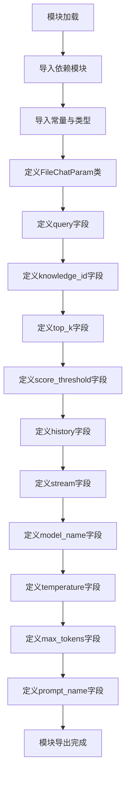

# `Langchain-Chatchat\libs\python-sdk\open_chatcaht\types\chat\file_chat_param.py` 详细设计文档

该文件定义了一个用于文件对话场景的Pydantic数据模型FileChatParam，封装了用户查询、知识库配置、对话历史、模型参数等核心输入参数，并利用Field验证器提供类型检查、默认值设置和数值范围约束，确保接口调用的数据安全性与规范性。

## 整体流程



## 类结构

```
FileChatParam (Pydantic BaseModel)
└── 字段列表: query, knowledge_id, top_k, score_threshold, history, stream, model_name, temperature, max_tokens, prompt_name
```

## 全局变量及字段


### `VECTOR_SEARCH_TOP_K`
    
向量搜索返回的匹配结果数量默认值

类型：`int`
    


### `SCORE_THRESHOLD`
    
知识库匹配相关度阈值默认值

类型：`float`
    


### `ChatMessage`
    
聊天消息类型，用于定义对话中的用户和助手消息结构

类型：`type`
    


### `FileChatParam.query`
    
用户输入的查询文本

类型：`str`
    


### `FileChatParam.knowledge_id`
    
临时知识库的唯一标识ID

类型：`str`
    


### `FileChatParam.top_k`
    
向量搜索返回的匹配结果数量

类型：`int`
    


### `FileChatParam.score_threshold`
    
知识库匹配相关度阈值

类型：`float`
    


### `FileChatParam.history`
    
维持对话上下文的聊天历史记录

类型：`List[ChatMessage]`
    


### `FileChatParam.stream`
    
控制是否启用流式输出的布尔标志

类型：`bool`
    


### `FileChatParam.model_name`
    
指定使用的大语言模型名称

类型：`str`
    


### `FileChatParam.temperature`
    
控制LLM生成随机性的采样温度参数

类型：`float`
    


### `FileChatParam.max_tokens`
    
限制LLM单次生成的最大Token数

类型：`Optional[int]`
    


### `FileChatParam.prompt_name`
    
引用的Prompt模板标识符

类型：`str`
    
    

## 全局函数及方法


## 关键组件


### FileChatParam 类

文件对话参数模型类，基于Pydantic BaseModel实现，用于定义与大语言模型进行文件对话时的请求参数结构。

### query 字段

用户输入的查询文本，用于向知识库发起检索和对话。

### knowledge_id 字段

临时知识库的唯 一标识符，用于指定从哪个知识库中检索相关文档。

### top_k 字段

向量检索时返回的最相似文档数量，默认值为系统常量VECTOR_SEARCH_TOP_K，用于控制检索结果的范围。

### score_threshold 字段

知识库匹配相关度阈值，取值范围0-2之间，数值越小表示相关性要求越高，默认为系统常量SCORE_THRESHOLD，用于过滤低相关性检索结果。

### history 字段

历史对话记录列表，用于维护多轮对话的上下文信息，类型为ChatMessage对象列表。

### stream 字段

流式输出标志，设置为True时启用Server-Sent Events进行实时响应，适用于长文本生成的场景。

### model_name 字段

大语言模型的名称标识，用于指定调用哪个LLM进行对话生成。

### temperature 字段

LLM采样温度参数，取值范围0.0-1.0，控制生成文本的随机性，值越低输出越确定性，默认值为0.01。

### max_tokens 字段

限制LLM单次生成的最大Token数量，可选参数，设为None时使用模型默认最大值。

### prompt_name 字段

使用的prompt模板名称，对应prompt_settings.yaml中配置的模板，默认为"default"模板。

### 全局常量依赖

代码依赖open_chatcaht._constants模块中的VECTOR_SEARCH_TOP_K和SCORE_THRESHOLD常量，用于提供系统级别的配置默认值。

### 类型依赖

代码引用了open_chatcaht.types.chat.chat_message模块中的ChatMessage类型，用于定义历史对话的数据结构。


## 问题及建议


### 已知问题

-   `score_threshold` 字段验证范围不一致：字段定义为 `ge=0, le=2`（允许0-2），但描述中明确说明"取值范围在0-1之间"，存在逻辑矛盾
-   `model_name` 类型定义与默认值不匹配：类型注解为 `str`，默认值却为 `None`，应改为 `Optional[str]` 或调整默认值
-   `history` 字段类型定义与示例数据不一致：类型定义为 `List[ChatMessage]`，但 `examples` 中提供的是字典列表格式，可能导致类型验证问题
-   `top_k` 字段缺少上限验证：虽然引用了常量 `VECTOR_SEARCH_TOP_K`，但未对该字段设置最大值约束，可能导致用户输入过大值
-   `max_tokens` 字段缺少正整数验证：类型为 `Optional[int]` 但未约束必须为正数
-   `knowledge_id` 字段缺少格式验证：作为临时知识库ID，应添加格式或长度约束
-   导入路径存在潜在拼写问题：`open_chatcaht` 看起来像是 `open_chatgpt` 的拼写错误

### 优化建议

-   修正 `score_threshold` 的验证范围为 `ge=0, le=1`，与文档描述保持一致
-   将 `model_name` 类型改为 `Optional[str]` 并添加描述说明默认行为
-   统一 `history` 字段的 examples 与类型定义，或使用 `ChatMessage` 对象作为示例
-   为 `top_k` 添加 `le` 参数限制，如 `le=100` 防止过大值
-   为 `max_tokens` 添加 `gt=0` 验证确保为正整数
-   为 `knowledge_id` 添加格式验证，如正则表达式或长度限制
-   确认 `open_chatcaht` 包名的正确性，如有拼写错误应修正

## 其它


### 设计目标与约束

该类用于文件对话场景的参数封装，支持用户查询、知识库ID、向量搜索配置、LLM模型参数、流式输出等功能。约束条件包括：top_k默认值为VECTOR_SEARCH_TOP_K，score_threshold范围0-2，建议0.5左右，temperature范围0.0-1.0，max_tokens可选。

### 错误处理与异常设计

该类主要依赖Pydantic进行数据验证，当传入参数不满足Field约束时，会抛出ValidationError。例如：score_threshold超出0-2范围、temperature超出0.0-1.0范围、top_k为负数等情况会自动触发验证错误。开发者需要捕获pydantic.ValidationError并进行相应处理。

### 外部依赖与接口契约

依赖外部模块包括：pydantic.BaseModel用于数据模型定义、open_chatcaht._constants中的VECTOR_SEARCH_TOP_K和SCORE_THRESHOLD常量、open_chatcaht.types.chat.chat_message.ChatMessage类型。该类作为参数传入层，需要与下游的文件对话服务保持接口一致性，确保knowledge_id、query等必填字段有效。

### 配置说明

该类通过Field定义各参数的默认值和约束条件，其中model_name默认为None、prompt_name默认为"default"、stream默认为False、temperature默认为0.01。所有配置项均可在实例化时动态覆盖，适用于不同的文件对话场景需求。

### 使用示例

```python
# 基本用法
param = FileChatParam(
    query="请解释这段代码",
    knowledge_id="kb_12345"
)

# 自定义LLM参数
param = FileChatParam(
    query="总结文档内容",
    knowledge_id="kb_12345",
    model_name="gpt-4",
    temperature=0.7,
    max_tokens=2000,
    stream=True
)

# 调整搜索参数
param = FileChatParam(
    query="查找相关信息",
    knowledge_id="kb_12345",
    top_k=10,
    score_threshold=0.7
)
```

### 安全性考虑

该类本身不直接处理敏感数据，但需要注意：knowledge_id可能暴露临时知识库标识、query内容可能包含用户隐私信息、history中的ChatMessage可能包含敏感对话记录。建议在传输和使用过程中采取适当的加密和访问控制措施。

### 性能考虑

history字段为List[ChatMessage]类型，大量历史消息会影响序列化性能和内存占用，建议根据实际场景限制历史消息数量。stream参数控制是否流式输出，流式模式可以更快响应首字节时间但会增加连接管理开销。

### 兼容性设计

该类使用Pydantic v2版本语法（BaseModel、Field），与Pydantic v1不兼容。model_name、prompt_name等字段设计为可选，以支持不同版本的LLM服务和Prompt模板框架。score_threshold范围设置为0-2是为了兼容不同的相似度计算算法。
    