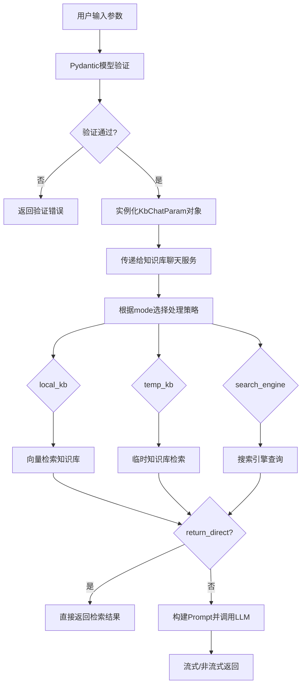
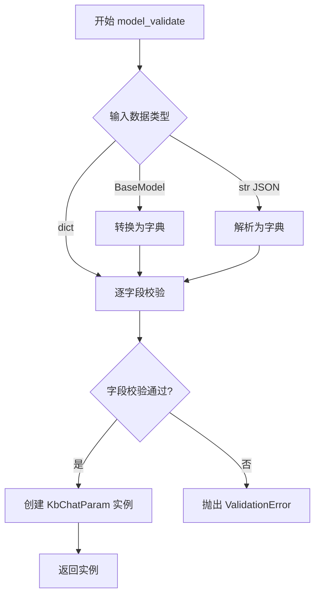
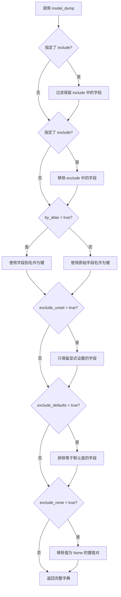
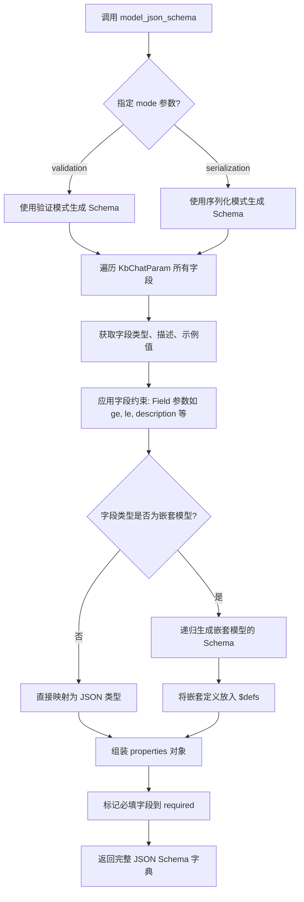

# `Langchain-Chatchat\libs\python-sdk\open_chatcaht\types\chat\kb_chat_param.py` 详细设计文档

定义了一个基于Pydantic的知识库聊天参数模型（KbChatParam），用于封装用户查询、知识库模式、匹配阈值、对话历史、LLM生成参数等配置，以结构化方式传递给后端知识库问答流程。

## 整体流程



## 类结构

```
BaseModel (Pydantic基类)
└── KbChatParam (知识库聊天参数模型)
```

## 全局变量及字段


### `MAX_TOKENS`
    
LLM最大token数常量

类型：`int`
    


### `TEMPERATURE`
    
LLM采样温度常量

类型：`float`
    


### `SCORE_THRESHOLD`
    
知识库匹配阈值常量

类型：`float`
    


### `VECTOR_SEARCH_TOP_K`
    
向量搜索返回数量常量

类型：`int`
    


### `LLM_MODEL`
    
默认LLM模型名称常量

类型：`str`
    


### `KbChatParam.query`
    
用户输入查询字符串

类型：`str`
    


### `KbChatParam.mode`
    
知识来源模式（local_kb/temp_kb/search_engine）

类型：`Literal["local_kb", "temp_kb", "search_engine"]`
    


### `KbChatParam.kb_name`
    
知识库名称或临时知识库ID或搜索引擎名称

类型：`str`
    


### `KbChatParam.top_k`
    
向量检索返回的结果数量

类型：`int`
    


### `KbChatParam.score_threshold`
    
知识库匹配相关度阈值

类型：`float`
    


### `KbChatParam.history`
    
历史对话记录

类型：`List[ChatMessage]`
    


### `KbChatParam.stream`
    
是否启用流式输出

类型：`bool`
    


### `KbChatParam.model`
    
使用的LLM模型名称

类型：`str`
    


### `KbChatParam.temperature`
    
LLM采样温度

类型：`float`
    


### `KbChatParam.max_tokens`
    
LLM生成的最大token数

类型：`Optional[int]`
    


### `KbChatParam.prompt_name`
    
使用的prompt模板名称

类型：`str`
    


### `KbChatParam.return_direct`
    
是否直接返回检索结果而不经过LLM

类型：`bool`
    
    

## 全局函数及方法


### `KbChatParam.model_validate`

Pydantic v2 继承自 `BaseModel` 的类方法，用于验证输入数据（字典或其他可迭代对象），并返回一个新的 `KbChatParam` 实例。如果数据不符合模型定义，将抛出 `ValidationError`。

参数：

- `cls`：隐式参数，类型为 `type[BaseModel]`（即 `KbChatParam` 类本身），用于类方法调用
- `data`：`dict[str, Any] | BaseModel | str`（Pydantic v2 支持多种输入格式），要验证的输入数据

返回值：`KbChatParam`，验证通过后返回的模型实例

#### 流程图



#### 带注释源码

```python
# Pydantic v2 源码签名 (来自 BaseModel)
@classmethod
def model_validate(
    cls,
    obj: Any,
    *,
    strict: bool | None = None,
    from_attributes: bool | None = None,
    context: dict[str, Any] | None = None,
) -> KbChatParam:
    """
    验证输入数据并返回模型实例。
    
    参数:
        obj: 输入数据，支持 dict、JSON 字符串、BaseModel 实例等
        strict: 是否严格模式校验
        from_attributes: 是否从对象属性读取（用于 from_attributes=True 的模型）
        context: 验证上下文，可传递额外信息
    
    返回:
        验证通过后的 KbChatParam 实例
    
    异常:
        ValidationError: 当输入数据不符合模型定义时抛出
    """
    # ... Pydantic 内部实现
    return cls._enforce_dict_if_dict(obj)
```

> **注意**：代码中未显式定义 `model_validate` 方法，该方法继承自 Pydantic v2 的 `BaseModel` 基类。当调用 `KbChatParam.model_validate({"query": "你好"})` 时，Pydantic 会根据类字段定义（`query`, `mode`, `kb_name` 等）自动进行数据验证。


### `KbChatParam.model_dump`

将 Pydantic 模型实例导出为字典格式，用于序列化、数据传输或调试场景。

参数：

- `mode`: `str`，可选，导出模式，默认为 `'python'`，支持 `'python'`、`'json'` 等模式
- `include`: `Optional[Set[str]] | Optional[str]`，可选，指定需要包含的字段名称
- `exclude`: `Optional[Set[str]] | Optional[str]`，可选，指定需要排除的字段名称
- `by_alias`: `bool`，可选，是否使用字段别名进行导出，默认 `False`
- `exclude_unset`: `bool`，可选，是否排除未在初始化时显式设置的值，默认 `False`
- `exclude_defaults`: `bool`，可选，是否排除使用默认值的字段，默认 `False`
- `exclude_none`: `bool`，可选，是否排除值为 `None` 的字段，默认 `False`

返回值：`Dict[str, Any]`，返回模型实例的字典表示，包含所有字段及其对应的值

#### 流程图



#### 带注释源码

```python
from typing import Optional, List, Literal

from pydantic import BaseModel, Field

# 导入项目常量
from open_chatcaht._constants import MAX_TOKENS, TEMPERATURE, SCORE_THRESHOLD, VECTOR_SEARCH_TOP_K, LLM_MODEL
from open_chatcaht.types.chat.chat_message import ChatMessage


class KbChatParam(BaseModel):
    """
    知识库聊天参数模型类，继承自 Pydantic 的 BaseModel
    用于定义与知识库聊天相关的所有配置参数
    """
    query: str = Field(..., description="用户输入", examples=["你好"])
    mode: Literal["local_kb", "temp_kb", "search_engine"] = Field("local_kb", description="知识来源")
    kb_name: str = Field("", description="知识库名称或临时知识库ID或搜索引擎名称")
    top_k: int = Field(VECTOR_SEARCH_TOP_K, description="匹配向量数")
    score_threshold: float = Field(SCORE_THRESHOLD, description="知识库匹配相关度阈值")
    history: List[ChatMessage] = Field([], description="历史对话")
    stream: bool = Field(True, description="流式输出")
    model: str = Field(LLM_MODEL, description="LLM 模型名称")
    temperature: float = Field(TEMPERATURE, description="LLM 采样温度")
    max_tokens: Optional[int] = Field(MAX_TOKENS, description="限制LLM生成Token数量")
    prompt_name: str = Field("default", description="使用的prompt模板名称")
    return_direct: bool = Field(False, description="直接返回检索结果")


# 创建 KbChatParam 实例示例
param = KbChatParam(
    query="你好",
    mode="local_kb",
    kb_name="samples"
)

# 调用 model_dump 方法将实例导出为字典
# 这是继承自 BaseModel 的内置方法
param_dict = param.model_dump(
    mode='python',           # 导出模式，可选 'python' 或 'json'
    by_alias=False,          # 是否使用字段别名
    exclude_unset=False,     # 是否排除未设置的字段
    exclude_defaults=False,  # 是否排除默认值的字段
    exclude_none=False       # 是否排除 None 值的字段
)

# 输出示例：
# {
#     'query': '你好',
#     'mode': 'local_kb',
#     'kb_name': 'samples',
#     'top_k': 3,
#     'score_threshold': 0.5,
#     'history': [],
#     'stream': True,
#     'model': 'gpt-3.5-turbo',
#     'temperature': 0.7,
#     'max_tokens': 1024,
#     'prompt_name': 'default',
#     'return_direct': False
# }
```


### `KbChatParam.model_json_schema`

该方法继承自 Pydantic 的 `BaseModel` 类，用于将 `KbChatParam` 模型类转换为其对应的 JSON Schema 表示，返回一个包含模型字段、类型、约束等信息的字典结构，可用于 API 文档生成、参数校验配置或跨语言 Schema 同步等场景。

参数：

- `mode`：`Literal["validation", "serialization"]`，指定生成模式。`"validation"` 生成用于验证的 Schema（包含字段默认值、约束等），`"serialization"` 生成用于序列化的 Schema（包含字段别名、序列化专用类型等）。默认为 `"validation"`。
- `ref_template`：`str`，自定义引用模板，用于嵌套 Schema 的 `$ref` 路径格式化，默认为 `"#/components/schemas/{model}"`。
- `schema_generator`：`type[GenerateJsonSchema]`，自定义 JSON Schema 生成器类，可覆盖默认的类型映射逻辑，默认为 Pydantic 内置的 `GenerateJsonSchema`。

返回值：`dict[str, Any]`，返回该模型的完整 JSON Schema 描述，包含以下核心键值：

- `title`：模型名称（`"KbChatParam"`）
- `type`：根类型（通常为 `"object"`）
- `properties`：各字段的名称、类型、描述、示例值、约束条件（如 `ge`、`le`、`minimum`、`maximum` 等）
- `required`：必填字段列表
- `$defs` 或 `definitions`：嵌套类型的定义（如 `ChatMessage` 的结构）

#### 流程图



#### 带注释源码

```python
def model_json_schema(
    # mode: 生成验证用 Schema 还是序列化用 Schema
    mode: Literal["validation", "serialization"] = "validation",
    # ref_template: 嵌套模型引用路径的模板
    ref_template: str = "#/components/schemas/{model}",
    # schema_generator: 自定义 Schema 生成器类
    schema_generator: type[GenerateJsonSchema] = GenerateJsonSchema,
) -> dict[str, Any]:
    """
    生成该模型的 JSON Schema 表示。
    
    该方法是继承自 Pydantic.BaseModel 的内置方法，非 KbChatParam 自定义实现。
    Pydantic 框架会自动解析类字段的 type、Field 装饰器参数（description、examples、ge、le 等），
    并将其转换为符合 OpenAPI 规范的 JSON Schema 结构。
    
    返回的 Schema 结构示例：
    {
        "title": "KbChatParam",
        "type": "object",
        "properties": {
            "query": {
                "type": "string",
                "description": "用户输入",
                "examples": ["你好"]
            },
            "mode": {
                "type": "string",
                "enum": ["local_kb", "temp_kb", "search_engine"],
                "default": "local_kb",
                "description": "知识来源"
            },
            "top_k": {
                "type": "integer",
                "default": 3,
                "description": "匹配向量数",
                "minimum": 0,
                "maximum": 100  # 隐式上限由 VECTOR_SEARCH_TOP_K 决定
            },
            "score_threshold": {
                "type": "number",
                "default": 0.5,
                "description": "知识库匹配相关度阈值...",
                "minimum": 0,
                "maximum": 2
            },
            "temperature": {
                "type": "number",
                "default": 0.7,
                "minimum": 0.0,
                "maximum": 2.0
            },
            ...
        },
        "required": ["query", "mode", ...],
        "$defs": {
            "ChatMessage": {
                "type": "object",
                "properties": {...}
            }
        }
    }
    """
    # 调用 Pydantic 内部实现
    ...
```

## 关键组件


### KbChatParam 类

核心参数模型类，封装知识库聊天所需的所有配置参数，继承自Pydantic的BaseModel，用于验证和序列化用户请求参数。

### query 字段

用户输入的查询字符串，作为知识库检索的输入文本。

### mode 字段

知识来源模式，支持三种模式：local_kb（本地知识库）、temp_kb（临时知识库）、search_engine（搜索引擎），决定了知识检索的后端服务。

### kb_name 字段

知识库标识符，根据mode不同含义不同：local_kb时为知识库名称，temp_kb时为临时知识库ID，search_engine时为搜索引擎名称。

### top_k 字段

向量检索返回的匹配结果数量，默认值为VECTOR_SEARCH_TOP_K，用于控制检索结果的召回规模。

### score_threshold 字段

知识库匹配相关度阈值，取值范围0-2，数值越小相关度越高，建议设置为0.5左右，用于过滤低相关度检索结果。

### history 字段

对话历史记录列表，包含ChatMessage对象，用于维护多轮对话上下文。

### stream 字段

流式输出标志，控制是否采用流式方式返回LLM生成内容，提升用户体验。

### model 字段

LLM模型标识符，指定用于生成回答的大语言模型，默认值为LLM_MODEL。

### temperature 字段

LLM采样温度参数，取值范围0.0-2.0，控制生成文本的随机性和创造性。

### max_tokens 字段

LLM生成token数量上限，默认为MAX_TOKENS，用于控制生成内容的长度。

### prompt_name 字段

Prompt模板名称，用于从prompt_settings.yaml中加载对应的提示词配置。

### return_direct 字段

直接返回标志，控制是否绕过LLM直接返回检索结果，适用于仅需检索不需要生成的场景。


## 问题及建议


### 已知问题

-   **类型不一致**：`history` 字段声明类型为 `List[ChatMessage]`，但 examples 中提供的是字典列表 `[[{"role": "user", "content": "..."}]]`，存在类型声明与示例不匹配的问题
-   **默认值与字面量类型不匹配**：`mode` 字段使用 `Literal["local_kb", "temp_kb", "search_engine"]` 类型约束，但默认值设为 `"local_kb"`（字符串字面量），虽然运行正常，但类型安全性和代码意图表达不够明确
-   **字段描述与逻辑可能相反**：`score_threshold` 字段描述中提到"SCORE越小，相关度越高"，这与常见的相似度分数逻辑（分数越高越相关）相反，容易造成理解混淆
-   **缺少输入长度限制**：`query` 字段没有设置最大长度限制，可能导致超长输入影响系统稳定性或性能
-   **top_k 缺少上限约束**：`top_k` 字段没有设置合理的最大值限制（如 `le=100`），可能导致返回过多结果影响性能
-   **字段验证规则不完整**：`kb_name` 字段缺少格式验证（如长度限制、字符规则），且在不同模式下对名称格式要求不同但未做区分验证

### 优化建议

-   统一 `history` 字段的类型与示例，可改为 `List[dict]` 或在 examples 中使用 ChatMessage 对象
-   明确 `score_threshold` 的语义逻辑，与实际向量检索服务的分数计算规则保持一致
-   为 `query` 字段添加 `max_length` 约束（如 `Field(..., max_length=2000)`），防止过长输入
-   为 `top_k` 添加上限约束（如 `le=100`），确保检索性能可控
-   考虑在模型中添加 `model_validator` 或 `root_validator`，实现 `stream` 和 `return_direct` 的互斥校验
-   为 `kb_name` 添加条件验证逻辑，根据 `mode` 不同值校验名称格式（如 `local_kb` 应为知识库名称，`temp_kb` 应为临时ID格式）

## 其它


### 设计目标与约束

1. **设计目标**：提供统一的知识库聊天参数配置模型，支持多种知识来源（本地知识库、临时知识库、搜索引擎），并对LLM生成参数进行灵活配置
2. **约束条件**：
   - score_threshold 必须在 0-2 之间
   - temperature 必须在 0.0-2.0 之间
   - mode 必须为 "local_kb"、"temp_kb" 或 "search_engine" 之一
   - kb_name 在 mode=local_kb 时不应为空
   - max_tokens 可选，默认使用模型最大值

### 错误处理与异常设计

1. **参数验证**：通过 Pydantic 的 Field 参数实现自动校验（ge/le 约束）
2. **类型错误**：Pydantic 会自动捕获类型不匹配错误并给出详细提示
3. **必填字段**：query 字段使用 ... 表示必填，缺少时 Pydantic 会抛出 ValidationError
4. **默认值处理**：所有可选字段均有默认值，支持灵活配置

### 数据流与状态机

1. **输入数据流**：
   - 用户请求 → KbChatParam 模型验证 → 参数对象创建 → 传递给后续处理器
2. **参数状态**：
   - 初始状态：所有字段为默认值
   - 配置状态：用户填充实际请求参数
   - 验证状态：Pydantic 自动完成字段校验
3. **状态转换**：用户输入 → 模型解析 → 验证通过 → 业务处理

### 外部依赖与接口契约

1. **依赖模块**：
   - `pydantic`：用于数据模型定义和验证
   - `open_chatcaht._constants`：获取默认配置常量
   - `open_chatcaht.types.chat.chat_message`：ChatMessage 类型定义
2. **接口契约**：
   - query: str - 用户查询字符串，必填
   - mode: Literal - 知识来源模式，必填
   - 返回：KbChatParam 实例，包含所有配置参数
3. **常量依赖**：
   - MAX_TOKENS：LLM 最大 token 数
   - TEMPERATURE：默认温度
   - SCORE_THRESHOLD：默认相关度阈值
   - VECTOR_SEARCH_TOP_K：默认搜索数量
   - LLM_MODEL：默认模型名称

### 安全性考虑

1. **输入校验**：所有用户输入均通过 Pydantic 进行类型和范围校验
2. **默认值安全**：使用项目定义的常量作为默认值，避免硬编码
3. **敏感信息**：query 内容由业务层处理，本模型仅做参数传递

### 性能考虑

1. **模型轻量**：仅定义参数结构，无复杂计算逻辑
2. **类型提示**：使用 Optional/List/Literal 提供完整类型信息，便于静态分析
3. **延迟初始化**：默认值在实例化时确定，支持懒加载

### 兼容性考虑

1. **Python 版本**：需 Python 3.7+（支持 typing.Literal）
2. **Pydantic 版本**：需 Pydantic 1.x 或 2.x（API 略有差异）
3. **字段演进**：采用 Field 描述元数据，便于后续版本扩展

### 配置管理

1. **默认配置源**：通过 open_chatcaht._constants 模块集中管理默认常量
2. **配置覆盖**：支持运行时覆盖任意配置项
3. **文档化**：每个字段均提供 description 和 examples，便于理解和使用

### 使用示例

```python
# 基本用法
param = KbChatParam(query="什么是机器学习")

# 指定知识库
param = KbChatParam(
    query="查找相关文档",
    mode="local_kb",
    kb_name="samples",
    top_k=5,
    score_threshold=0.7
)

# 使用搜索引擎
param = KbChatParam(
    query="最新天气",
    mode="search_engine",
    kb_name="baidu"
)

# 完整配置
param = KbChatParam(
    query="复杂问题",
    mode="temp_kb",
    kb_name="temp_12345",
    top_k=10,
    score_threshold=0.5,
    stream=False,
    model="gpt-4",
    temperature=0.7,
    max_tokens=2000,
    prompt_name="custom_prompt",
    return_direct=True
)
```


    