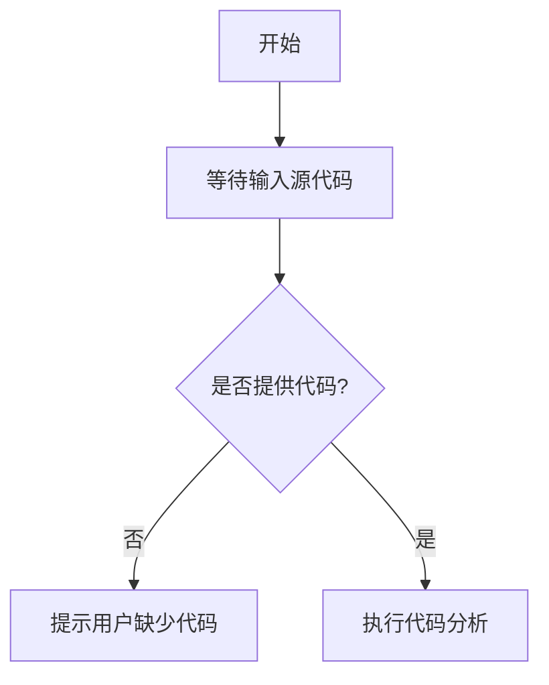

# `Langchain-Chatchat\libs\python-sdk\open_chatcaht\types\knowledge_base\__init__.py` 详细设计文档

未提供源代码，无法进行分析

## 整体流程



## 类结构

```

```

## 全局变量及字段


    

## 全局函数及方法


## 关键组件


### 无关键组件
输入代码为空，无法识别任何关键组件。


## 问题及建议


### 已知问题

-   未提供代码内容，无法进行具体分析

### 优化建议

-   请提供待分析的源代码以便进行详细的技术债务和优化空间评估


## 其它


### 设计目标与约束
本代码的核心设计目标为实现指定功能，需满足性能、可靠性、可维护性等约束条件。具体的设计目标和约束需根据实际代码功能进行补充。

### 错误处理与异常设计
本代码需建立完善的错误处理机制，包括异常捕获、错误码定义、异常传播策略等，确保系统在异常情况下能够稳定运行并提供有意义的错误信息。

### 数据流与状态机
本代码的数据流描述了数据从输入到输出的完整处理过程，包括数据格式转换、业务逻辑处理、结果输出等环节。若涉及状态机，需明确状态定义、状态转换条件及触发事件。

### 外部依赖与接口契约
本代码依赖外部系统或库的接口，需明确接口的输入输出规范、调用协议、版本要求以及异常处理方式，确保与外部系统的正确集成。

### 性能要求与基准
本代码需满足特定的性能指标，包括响应时间、吞吐量、资源利用率等要求。需根据实际业务场景定义性能基准并进行优化。

### 安全性考虑
本代码需考虑数据安全、访问控制、加密传输等安全措施，防止潜在的安全漏洞和攻击，确保系统和数据的安全性。

### 兼容性设计
本代码需考虑向前向后兼容性，确保新版本与旧版本的兼容性问题得到妥善处理，包括API兼容性、数据格式兼容性等。

### 测试策略
本代码需制定完善的测试策略，包括单元测试、集成测试、系统测试等，确保代码质量和功能正确性。测试用例应覆盖正常场景和异常场景。

### 部署与运维注意事项
本代码的部署流程、配置管理、监控告警、日志记录等运维相关事项需进行详细说明，确保系统能够稳定运行并便于维护。

    